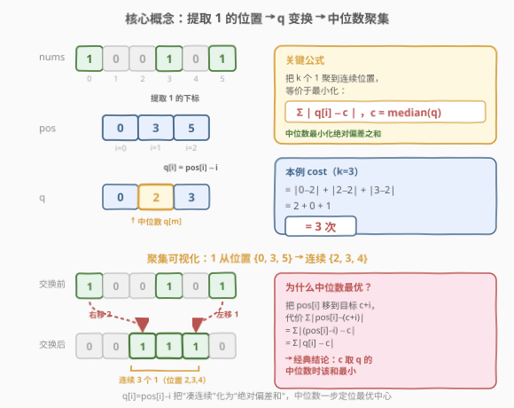
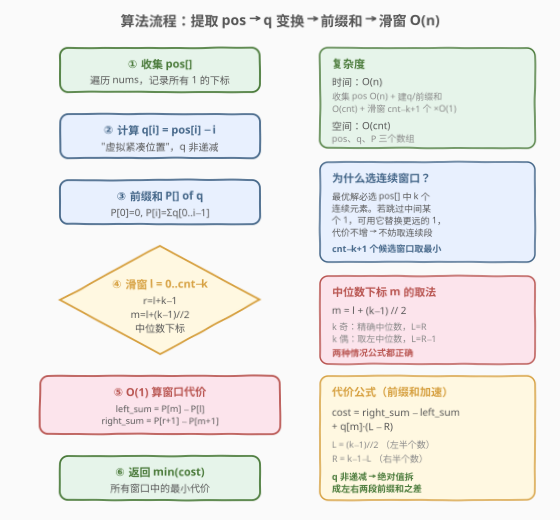

# LeetCode 得到连续 K 个 1 的最少相邻交换次数 题解

## 1. 题目概述

- **标题 / 题号**：得到连续 K 个 1 的最少相邻交换次数（#1703，hard）
- **链接**：https://leetcode.cn/problems/minimum-adjacent-swaps-for-k-consecutive-ones/
- **难度**：困难
- **标签**：数组、滑动窗口、中位数、前缀和

**题意**：给定一个仅含 `0` 和 `1` 的整数数组 `nums` 和一个整数 `k`。每次操作可以选择**相邻**两个数字并交换。返回使 `nums` 中出现 **`k` 个连续 `1`** 的**最少交换次数**。

**示例 1**：

```text
输入：nums = [1,0,0,1,0,1], k = 2
输出：1
解释：交换下标 4、5 的相邻元素 → [1,0,0,1,1,0]，得到连续两个 1。
```

**示例 2**：

```text
输入：nums = [1,0,0,0,0,0,1,1], k = 3
输出：5
解释：最左边的 1 从位置 0 右移到位置 5，共 5 次交换 → [0,0,0,0,0,1,1,1]。
```

**示例 3**：

```text
输入：nums = [1,1,0,1], k = 2
输出：0
解释：已有连续 2 个 1，无需交换。
```

**约束**：

- $1 \le \text{nums.length} \le 10^5$
- `nums[i]` 为 `0` 或 `1`
- $1 \le k \le \sum(\text{nums})$

> 💡 **关键直觉**：相邻交换的本质是把选中的 `1` "平移"到目标位置——每个 `1` 移动一格就是一次交换。我们只需决定**选哪 k 个 `1`**、**聚到哪个连续区间**，代价就是各 `1` 到目标位置的距离之和。这是一个经典的**中位数聚集**问题。

## 2. 解题思路

### 2.1 暴力思路：枚举所有组合

最直觉的做法是：从所有 `1` 的位置中选 `k` 个，对每种选法求"聚到连续区间的最少交换次数"，取全局最小。

- 设 `cnt` 为 `1` 的总数，组合数为 $\binom{\text{cnt}}{k}$，当 `cnt` 接近 $10^5$ 时是天文数字。
- 即便固定选法，朴素求代价也要 $O(k)$，总复杂度不可接受。

> ⚠️ **症结**：组合爆炸。我们需要两个关键观察把搜索空间从 $\binom{\text{cnt}}{k}$ 压缩到 $O(\text{cnt})$ 个候选，再把每个候选的代价计算从 $O(k)$ 压缩到 $O(1)$。

### 2.2 核心观察：中位数聚集 + q 变换 + 前缀和



#### 观察 1：最优选择是 pos 中的连续窗口

设 `pos[]` 为所有 `1` 的下标（已天然有序）。若最优解选了 `pos[a]` 和 `pos[c]`（$a < c$）但跳过了 `pos[b]`（$a < b < c$），由于 $\text{pos}[a] < \text{pos}[b] < \text{pos}[c]$，用 `pos[b]` 替换 `pos[a]` 或 `pos[c]` 中较远者，代价**不会增加**（`pos[b]` 离任意目标更近）。反复"填空"直到无空可填，最优选择必为 `pos[]` 中一段**连续窗口** $[l, l+k-1]$。

> 💡 这把候选数从 $\binom{\text{cnt}}{k}$ 降到 $\text{cnt} - k + 1$。

#### 观察 2：q 变换 —— 把"凑连续"化为"绝对偏差和"

选定窗口 `pos[l..r]`（$r = l+k-1$），要把这 $k$ 个 `1` 移到连续目标位置 $t, t+1, \ldots, t+k-1$。保持顺序配对（由排序-匹配不等式，顺序配对最优），代价为：

$$\text{cost}(t) = \sum_{i=0}^{k-1} \big|\text{pos}[l+i] - (t + i)\big| = \sum_{i=0}^{k-1} \big|(\text{pos}[l+i] - (l+i)) - (t - l)\big|$$

令 $q[j] = \text{pos}[j] - j$（"虚拟紧凑位置"），并令 $c = t - l$，则：

$$\boxed{\text{cost}(c) = \sum_{i=0}^{k-1} |q[l+i] - c|}$$

这是经典的"**绝对偏差和最小化**"问题——$c$ 取 $q[l..r]$ 的**中位数**时最优（参见 [462. 最小操作次数使数组元素相等 II](../0401-0500/462_最小操作次数使数组元素相等II.md)）。

> ⚠️ **$q$ 的单调性**：由于 $\text{pos}[j]$ 严格递增且每次至少 $+1$，$q[j+1] - q[j] = \text{pos}[j+1] - \text{pos}[j] - 1 \geq 0$，故 $q$ **非递减**。这保证了中位数下标 $m = l + \lfloor (k-1)/2 \rfloor$ 处即为中位数值 $q[m]$，且绝对值可按左右拆开。

#### 观察 3：前缀和 —— O(1) 算窗口代价

由 $q$ 非递减，中位数 $q[m]$ 把窗口分成左半（$\leq q[m]$）和右半（$\geq q[m]$），绝对值自然消去：

$$\text{cost}(l) = \underbrace{\sum_{j=m+1}^{r} q[j]}_{\text{右半和}} - \underbrace{\sum_{j=l}^{m-1} q[j]}_{\text{左半和}} + q[m] \cdot \big((m-l) - (r-m)\big)$$

用前缀和 $P[i] = \sum_{j=0}^{i-1} q[j]$（$P[0]=0$），三段求和均 $O(1)$：

$$\text{cost}(l) = (P[r{+}1] - P[m{+}1]) - (P[m] - P[l]) + q[m] \cdot \big((m{-}l) - (r{-}m)\big)$$

其中 $r = l+k-1$，$m = l + \lfloor (k-1)/2 \rfloor$。

> 💡 **$k$ 奇偶的影响**：记 $L = m - l = \lfloor (k-1)/2 \rfloor$（左半个数），$R = r - m = k - 1 - L$（右半个数）。
> - $k$ **奇**：$L = R$，$q[m]$ 项消失，cost = 右半和 $-$ 左半和。
> - $k$ **偶**：$L = R - 1$，$q[m]$ 项 = $-q[m]$，公式仍正确（取左中位数，代价与右中位数相同）。

### 2.3 算法流程图



**步骤**：

1. **收集 pos**：遍历 `nums`，记录所有 `1` 的下标到 `pos[]`。
2. **计算 q**：$q[i] = \text{pos}[i] - i$，得到非递减序列。
3. **前缀和**：$P[0] = 0$，$P[i+1] = P[i] + q[i]$。
4. **滑窗**：对每个 $l \in [0, \text{cnt}-k]$，令 $r = l+k-1$，$m = l + (k-1)//2$，$L = (k-1)//2$，$R = k-1-L$：
   - $\text{left\_sum} = P[m] - P[l]$
   - $\text{right\_sum} = P[r+1] - P[m+1]$
   - $\text{cost} = \text{right\_sum} - \text{left\_sum} + q[m] \times (L - R)$
   - $\text{ans} = \min(\text{ans}, \text{cost})$
5. **返回** ans。

### 2.4 示例演算

以示例 2 `nums = [1,0,0,0,0,0,1,1], k = 3` 为例：

![示例演算：pos=[0,6,7], q=[0,5,5], 中位数 q[1]=5, cost=5](../images/1703_example_walkthrough.svg)

| 步骤 | 数据 |
|------|------|
| pos | $[0, 6, 7]$（3 个 1 的下标） |
| q | $[0, 5, 5]$（$q[i] = \text{pos}[i] - i$） |
| P | $[0, 0, 5, 10]$（前缀和） |
| 窗口 | $l=0, r=2, m=1$，$L=1, R=1$ |
| left_sum | $P[1] - P[0] = 0$ |
| right_sum | $P[3] - P[2] = 10 - 5 = 5$ |
| cost | $5 - 0 + 5 \times (1-1) = \mathbf{5}$ |

**聚集过程**：中位数 $q[m] = 5$，目标位置 $c = q[m] + l = 5$，即 $5, 6, 7$。

| 1 的原位置 | 目标位置 | 移动次数 |
|-----------|---------|---------|
| 0 | 5 | 5 |
| 6 | 6 | 0 |
| 7 | 7 | 0 |

总交换次数 = $5 + 0 + 0 = 5$ ✓

> 💡 **$k$ 奇时 $q[m]$ 项消失**：$L = R = 1$，公式简化为 $\text{right\_sum} - \text{left\_sum} = 5 - 0 = 5$，与直接算 $|0-5| + |5-5| + |5-5| = 5$ 一致。

## 3. 参考代码

### Python

```python
class Solution:
    def minMoves(self, nums: List[int], k: int) -> int:
        pos = [i for i, x in enumerate(nums) if x == 1]
        q = [pos[i] - i for i in range(len(pos))]
        P = [0] * (len(q) + 1)
        for i in range(len(q)):
            P[i + 1] = P[i] + q[i]

        ans = float('inf')
        L = (k - 1) // 2
        R = k - 1 - L
        for l in range(len(q) - k + 1):
            r = l + k - 1
            m = l + L
            left_sum = P[m] - P[l]
            right_sum = P[r + 1] - P[m + 1]
            cost = right_sum - left_sum + q[m] * (L - R)
            ans = min(ans, cost)
        return ans
```

### C++

```cpp
class Solution {
public:
    int minMoves(vector<int>& nums, int k) {
        vector<int> pos;
        for (int i = 0; i < (int)nums.size(); ++i)
            if (nums[i] == 1) pos.push_back(i);

        int n = pos.size();
        vector<long long> q(n);
        for (int i = 0; i < n; ++i) q[i] = (long long)pos[i] - i;

        vector<long long> P(n + 1, 0);
        for (int i = 0; i < n; ++i) P[i + 1] = P[i] + q[i];

        int L = (k - 1) / 2, R = k - 1 - L;
        long long ans = LLONG_MAX;
        for (int l = 0; l <= n - k; ++l) {
            int r = l + k - 1;
            int m = l + L;
            long long leftSum  = P[m] - P[l];
            long long rightSum = P[r + 1] - P[m + 1];
            long long cost = rightSum - leftSum + q[m] * (L - R);
            ans = min(ans, cost);
        }
        return (int)ans;
    }
};
```

> ⚠️ **溢出陷阱（C++）**：$n \le 10^5$，$k \le n$。最坏情况（$k \approx n/2$，`1` 间隔分布）下代价可达 $\sim 6 \times 10^8$，虽在 `int` 范围内但接近上限。`q[i] = pos[i] - i` 和前缀和 $P$ 累加后可能更大，故 `q`、`P`、`cost`、`ans` 均用 `long long`，返回时再 `(int)` 转回。Python 无此问题。

> 💡 **`L` 和 `R` 提到循环外**：$L = (k-1)//2$ 和 $R = k - 1 - L$ 只依赖 $k$，与窗口位置 $l$ 无关，提到循环外避免重复计算。循环内每次仅 $O(1)$ 的四次前缀和查表 + 一次乘法。

## 4. 复杂度分析

| 维度 | 复杂度 | 说明 |
|------|--------|------|
| 时间 | $O(n)$ | 收集 pos $O(n)$；建 q、P 各 $O(\text{cnt})$；滑窗 $\text{cnt}-k+1$ 个 $\times\ O(1)$；总计 $O(n)$ |
| 空间 | $O(\text{cnt})$ | pos、q、P 三个长度为 $\text{cnt}$ 的数组；$\text{cnt} \le n$ |

> 💡 从暴力 $\binom{\text{cnt}}{k} \times O(k)$ 到 $O(n)$，两次关键压缩：①连续窗口把组合数降为线性候选；②前缀和把单窗口代价降为 $O(1)$。前者靠"填空不增代价"的交换论证，后者靠 $q$ 非递减保证绝对值可拆。

## 5. 扩展：中位数最优性的形式化证明与连通性

### 5.1 中位数最小化绝对偏差和

**定理**：给定非递减序列 $a_1 \leq a_2 \leq \ldots \leq a_n$，函数 $f(c) = \sum_i |a_i - c|$ 在 $c$ 取中位数时取最小值。

**证明**（交换论证）：设 $c$ 不是中位数。若 $c$ 小于中位数，则存在 $> n/2$ 个 $a_i > c$。将 $c$ 右移 $\delta$（$\delta$ 足够小不超过下一个 $a_i$），$> n/2$ 个项各减 $\delta$，$< n/2$ 个项各增 $\delta$，净变化 $< 0$。故 $c$ 偏离中位数时总能改进，中位数即最优。$\square$

对应到本题：$a_i = q[l+i]$，$c$ 为目标起始偏移，代价 $\sum |q[l+i] - c|$ 在 $c = q[m]$（中位数）时最小。

### 5.2 连续窗口最优性的交换论证

**引理**：最优解选中的 $k$ 个 `1` 在 `pos[]` 中下标连续。

**证明**：设最优解选中下标集合 $S$，若存在 $a < b < c$（$a, c \in S$，$b \notin S$），则 $\text{pos}[a] < \text{pos}[b] < \text{pos}[c]$。设最优目标区间为 $[t, t+k-1]$：

- 若 $\text{pos}[b] \in [t, t+k-1]$：`pos[b]` 落在目标内，替换 $\text{pos}[a]$ 或 $\text{pos}[c]$ 中距目标更远者，代价严格下降。
- 若 $\text{pos}[b] < t$：则 $\text{pos}[a] < \text{pos}[b] < t$，用 $b$ 替换 $a$（$a$ 配对 $t$），代价变化 $|\text{pos}[b]-t| - |\text{pos}[a]-t| < 0$。
- 若 $\text{pos}[b] > t+k-1$：对称地，用 $b$ 替换 $c$，代价下降。

每种情况都能"填空"且代价不增，反复填空直到 $S$ 连续。$\square$

### 5.3 与 1151 的关系：特例与泛化

[1151. 最少交换次数来组合所有的 1](https://leetcode.cn/problems/minimum-swaps-to-group-all-1s-together/) 是 $k = \sum(\text{nums})$（选中所有 `1`）的特例——只有一个候选窗口（整个 `pos[]`），无需滑动。其代价同样由中位数公式给出。本题将其推广为"选 $k$ 个"的滑动窗口版，是真正的困难版。

> 💡 **环形变体**：[2134. 最少交换次数来组合所有的 1 II](https://leetcode.cn/problems/minimum-swaps-to-group-all-1s-together-ii/) 在环形数组上组合所有 `1`，需把 `pos[]` "翻倍"后在长度 $\text{cnt}$ 的滑窗上套用同样的中位数公式，是本题思路的环形扩展。

## 6. 面试要点

**Q1：为什么最优选择一定是 pos 中的连续窗口？**

> 交换论证：若选中 `pos[a]`、`pos[c]` 但跳过 `pos[b]`（$a < b < c$），因 $\text{pos}[a] < \text{pos}[b] < \text{pos}[c]$，用 `pos[b]` 替换 `pos[a]` 或 `pos[c]` 中较远者，代价不增。反复"填空"直到无空可填，选集连续。这把 $\binom{\text{cnt}}{k}$ 降为 $\text{cnt}-k+1$ 个候选窗口。

**Q2：q 变换 `q[i] = pos[i] - i` 的直觉是什么？**

> 把 $k$ 个 `1` 移到连续位置 $t, t+1, \ldots, t+k-1$ 的代价是 $\sum |\text{pos}[l+i] - (t+i)|$。令 $q[j] = \text{pos}[j] - j$、$c = t - l$，代价变为 $\sum |q[l+i] - c|$——这就是"绝对偏差和"，$c$ 取中位数最优。$q[j]$ 的含义是"若前 $j$ 个 `1` 全部紧凑排列，第 $j$ 个应在的位置与实际位置之差"，即"虚拟紧凑位置"。

**Q3：为什么用前缀和能把单窗口代价降到 O(1)？**

> $q$ 非递减（$\text{pos}$ 严格递增保证 $q[j+1]-q[j] \geq 0$），故中位数 $q[m]$ 把窗口分成左半（$\leq q[m]$）和右半（$\geq q[m]$），绝对值消去后 cost = 右半和 $-$ 左半和 $+\ q[m] \times (\text{左半个数} - \text{右半个数})$。左右半和各用前缀和一次查表 $O(1)$ 搞定。

**Q4：k 为偶数时中位数取左中位数还是右中位数？有影响吗？**

> 没有影响。$k$ 偶时 $q$ 两中位值之间的任意 $c$ 都给出相同的最小代价。公式取左中位数 $m = l + (k-1)//2$，此时左半比右半少一个，$q[m]$ 项 = $q[m] \times (L - R) = -q[m]$，公式自动补偿。若取右中位数，$L = R + 1$，$q[m']$ 项 = $+q[m']$，结果相同。

**Q5：C++ 实现中为什么要用 long long？**

> 最坏情况 $n = 10^5$、$k \approx n/2$、`1` 间隔分布时代价可达 $\sim 6 \times 10^8$，虽在 `int`（$\sim 2.1 \times 10^9$）范围内，但前缀和 $P$ 的元素和可能更大，且中间乘法 `q[m] * (L-R)` 涉及 `long long` 运算。统一用 `long long` 存 $q$、$P$、`cost`、`ans` 避免隐式截断，返回时 `(int)` 转回。

> 💡 **一句话总结**：选连续窗口（交换论证）→ q 变换化为绝对偏差和（中位数最优）→ 前缀和 $O(1)$ 查表，三步把 $\binom{n}{k} \cdot O(k)$ 压到 $O(n)$。

## 同类练习题

| # | 题目 | 与本题的关联 |
|---|------|-------------|
| 1151 | [最少交换次数来组合所有的 1](https://leetcode.cn/problems/minimum-swaps-to-group-all-1s-together/)（[题解](../1101-1200/1151_最少交换次数来组合所有的1.md)） | 本题 $k = \sum(\text{nums})$ 的特例——只有一个候选窗口，无需滑动，是理解中位数公式的入门版 |
| 462 | [最小操作次数使数组元素相等 II](https://leetcode.cn/problems/minimum-moves-to-equal-array-elements-ii/)（[题解](../0401-0500/462_最小操作次数使数组元素相等II.md)） | 中位数最小化绝对偏差和的母题——本题 q 变换后的数学核心正是此定理 |
| 296 | [最佳碰头地点](https://leetcode.cn/problems/best-meeting-point/)（[题解](../0201-0300/296_最佳碰头地点.md)） | 二维中位数聚集——行列独立各取中位数，与本题"一维中位数聚集"同源 |
| 480 | [滑动窗口中位数](https://leetcode.cn/problems/sliding-window-median/)（[题解](../0401-0500/480_滑动窗口中位数.md)） | 同为"滑窗 + 中位数"组合，但侧重中位数动态维护（对顶堆/延迟删除），对照体会"固定窗口求中位数"与"用中位数算代价"的不同侧重点 |
| 2134 | [最少交换次数来组合所有的 1 II](https://leetcode.cn/problems/minimum-swaps-to-group-all-1s-together-ii/) | 1151 的环形版——把 `pos[]` 翻倍后在长度 $\text{cnt}$ 的滑窗上套中位数公式，是本题思路向环形数组的扩展 |
