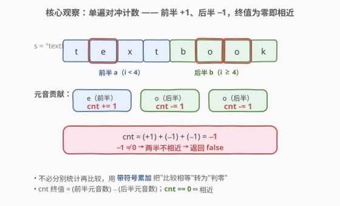
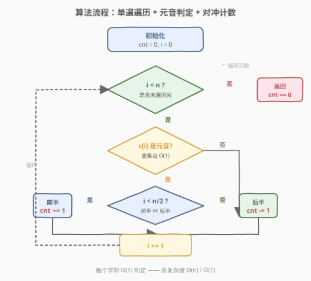
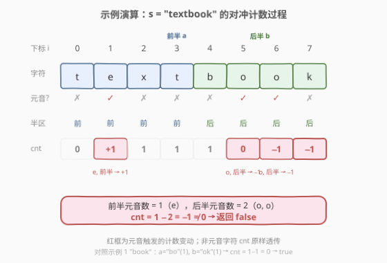

# 判断字符串的两半是否相近

- **题目名称**：判断字符串的两半是否相近
- **链接**：[1704. 判断字符串的两半是否相近](https://leetcode.cn/problems/determine-if-string-halves-are-alike/)
- **难度**：简单
- **标签**：字符串、计数

## 1. 题目概述

给定一个**偶数长度**的字符串 `s`，将其从中间等分成两个半串：前半串 $a = s[0 \ldots n/2-1]$，后半串 $b = s[n/2 \ldots n-1]$。若 $a$ 和 $b$ 含有**相同数量**的元音字母（`'a','e','i','o','u'` 及其大写形式），则称两半"相近"。判断两半是否相近。

**示例 1**：

```text
输入：s = "book"
输出：true
解释：n = 4，a = "bo"（1 个元音 'o'），b = "ok"（1 个元音 'o'），元音数相等 → 相近。
```

**示例 2**：

```text
输入：s = "textbook"
输出：false
解释：n = 8，a = "text"（1 个元音 'e'），b = "book"（2 个元音 'o'），1 ≠ 2 → 不相近。
```

**约束条件**：

- $2 \le s.length \le 1000$
- `s.length` 为偶数
- `s` 由大小写英文字母组成

> 💡 **关键直觉**：这是一道"分半 + 计数比较"的签到题。难点不在算法，而在**把两遍计数压成一遍**——用一个计数器在前半段 +1、后半段 −1，最后判零即可，无需分别统计再比较。

---

## 2. 解题思路

### 2.1 暴力思路：两遍扫描

朴素做法是分两次扫描：先数前半串的元音数 $c_a$，再数后半串的元音数 $c_b$，比较 $c_a = c_b$。时间 $O(n)$、空间 $O(1)$，复杂度已达标，但**遍历两遍**且需要先求出中点 $n/2$。能否一遍搞定？

### 2.2 核心观察：单遍对冲计数



把"比较两半元音数"改写为"求两半元音数之差是否为零"。用一个计数器 `cnt` 遍历整个串：

- 下标 $i < n/2$（前半串）且 $s[i]$ 是元音：`cnt += 1`
- 下标 $i \ge n/2$（后半串）且 $s[i]$ 是元音：`cnt -= 1`

遍历结束，`cnt == 0` 当且仅当两半元音数相等。

> 💡 **为什么这是等价的？** `cnt` 的终值 $=$ (前半元音数) $-$ (后半元音数)。这正是"对冲"思想——把两次独立计数合并为一次带符号累加，把"比较相等"转化为"判零"。该手法在 [525. 连续数组](https://leetcode.cn/problems/contiguous-array/)（0 当 −1 转化前缀和）、[1248. 统计「优美子数组」](https://leetcode.cn/problems/count-number-of-nice-subarrays/)（至多 K 转化）中也有体现：**用符号把两类对象映射到同一维度**。

### 2.3 算法流程图



只需一次遍历，每个字符做一次元音判定（$O(1)$ 哈希/数组查找）和一次条件加减，总 $O(n)$。

### 2.4 示例演算

以 `s = "textbook"`（$n = 8$，$n/2 = 4$）为例：



| 下标 $i$ | 字符 | 元音? | 半区 | cnt 变化 | cnt 值 |
|----------|------|-------|------|----------|--------|
| 0 | `t` | ✗ | 前 | — | 0 |
| 1 | `e` | ✓ | 前 | +1 | 1 |
| 2 | `x` | ✗ | 前 | — | 1 |
| 3 | `t` | ✗ | 前 | — | 1 |
| 4 | `b` | ✗ | 后 | — | 1 |
| 5 | `o` | ✓ | 后 | −1 | 0 |
| 6 | `o` | ✓ | 后 | −1 | −1 |
| 7 | `k` | ✗ | 后 | — | −1 |

终值 $\text{cnt} = -1 \ne 0$ → **false** ✓（前半 1 个元音，后半 2 个元音，差 $-1$）。

对照示例 1 `"book"`：$a=\text{"bo"}$（元音 `o`），$b=\text{"ok"}$（元音 `o`），$\text{cnt} = +1 - 1 = 0$ → **true**。

---

## 3. 参考代码

### Python（单遍对冲计数）

```python
class Solution:
    def halvesAreAlike(self, s: str) -> bool:
        vowels = set('aeiouAEIOU')
        n = len(s)
        cnt = 0
        for i, c in enumerate(s):
            if c in vowels:
                cnt += 1 if i < n // 2 else -1
        return cnt == 0
```

### C++（单遍对冲计数）

```cpp
class Solution {
public:
    bool halvesAreAlike(string s) {
        unordered_set<char> vowels = {'a','e','i','o','u','A','E','I','O','U'};
        int n = s.size(), cnt = 0;
        for (int i = 0; i < n; i++) {
            if (vowels.count(s[i])) {
                cnt += (i < n / 2) ? 1 : -1;
            }
        }
        return cnt == 0;
    }
};
```

> 💡 **实现细节**：① 元音集合同时收录大小写共 10 个字母，避免运行时大小写转换的开销。② `i < n / 2` 整数除法天然定到前半串末下标（题目保证 $n$ 为偶数）。③ 用三元运算符把"前半/后半"映射到 `+1/−1`，一行完成对冲。

---

## 4. 复杂度分析

| 维度 | 复杂度 | 说明 |
|------|--------|------|
| 时间 | $O(n)$ | 单遍遍历，每个字符 $O(1)$ 元音判定 + $O(1)$ 加减 |
| 空间 | $O(1)$ | 元音集合大小固定为 10，计数器与下标各一个整型 |

> ⚠️ 暴力两遍扫描同样是 $O(n)/O(1)$，但单遍对冲在常数因子上更优（一遍循环 vs 两遍），且代码更简洁。本题数据规模 $n \le 1000$，两种写法实测差异可忽略，但单遍写法展示了"差值判零"的思维。

---

## 5. 扩展：元音判定的多种实现

### 5.1 数组查表代替哈希集合

`unordered_set` 虽是 $O(1)$ 均摊，但哈希常数较大。ASCII 字母仅 52 个，用定长数组查表更快：

```cpp
class Solution {
public:
    bool halvesAreAlike(string s) {
        bool isVowel[128] = {};
        for (char c : "aeiouAEIOU") isVowel[(int)c] = true;
        int n = s.size(), cnt = 0;
        for (int i = 0; i < n; i++)
            if (isVowel[(int)s[i]])
                cnt += (i < n / 2) ? 1 : -1;
        return cnt == 0;
    }
};
```

### 5.2 位运算判定元音（Case-Insensitive）

利用 ASCII 字母的一个性质：`c & 31` 能**统一大小写**（`'a'`=97 与 `'A'`=65 的 `& 31` 结果均为 1，`'b'`/`'B'` 均为 2，依此类推）。五个元音对应 `c & 31` 的值为 1(a)、5(e)、9(i)、15(o)、21(u)，把它们编码进一个 22 位的掩码：

```cpp
// 0x208422 的第 1/5/9/15/21 位为 1，恰好对应五个元音的 (c & 31) 值
inline bool isVowel(char c) {
    return (0x208422u >> (c & 31)) & 1;
}
```

> ⚠️ 此法依赖"输入只含英文字母"这一约束。若含数字或符号，`c & 31` 可能误命中掩码位。面试中作为"知道有这招"的展示即可，工程代码仍推荐查表法。

> 💡 **同类位运算技巧**：[191. 位 1 的个数](https://leetcode.cn/problems/number-of-1-bits/)（`n & (n-1)` 消最低位 1）、[231. 2 的幂](https://leetcode.cn/problems/power-of-two/)（`n & (n-1) == 0` 判单 1）同属"用位图压缩离散集合"的范式。

---

## 6. 面试要点

1. **为什么要用对冲计数而不是分别计数？**

   > 两种做法复杂度相同（$O(n)/O(1)$），但对冲计数只遍历一遍、用一个变量，代码更简洁，且体现了"把相等比较转化为差值判零"的思维。面试中先讲朴素两遍扫描，再优化到单遍对冲，能展示思维层次。

2. **元音集合为什么要同时存大小写？**

   > 题目字符串含大小写字母。两种方案：① 集合里直接收 10 个字母（避免运行时转换）；② 遍历时 `tolower(s[i])` 统一转小写再查 5 元素集合。方案 ① 多用几个字节内存但省去每次转换的函数调用，常数更小。

3. **`i < n / 2` 的整数除法会不会有问题？**

   > 不会。题目保证 $n$ 为偶数，`n / 2` 恰为前半串长度，前半下标 $0 \ldots n/2-1$，`i < n/2` 精确覆盖。若 $n$ 为奇数需另行处理（如中位字符不计入任一半），但本题约束排除了该情况。

4. **如果输入很长（$n = 10^9$）怎么办？**

   > 单机 $O(n)$ 仍可能超时。若字符串分布在多机/多核，可按区间并行统计元音数再归约求和——对冲计数天然可并行（各段独立求带符号和，最后求和判零）。

5. **位运算判定元音的原理是什么？有什么陷阱？**

   > ASCII 字母 `c & 31` 统一大小写（大小写字母 ASCII 差 32 = 第 5 位，`& 31` = 取低 5 位，抹掉第 5 位）。把五个元音的低 5 位值编码进掩码，一次移位与运算即可判定。陷阱是只对**字母输入**成立，非字母字符可能误命中，故依赖题目约束。

> 💡 **一句话总结**：单遍遍历，前半元音 +1、后半元音 −1，终值为零即相近；元音判定用查表或位掩码均可。

---

## 7. 同类练习题

- [345. 反转字符串中的元音字母](https://leetcode.cn/problems/reverse-vowels-of-a-string/)（[题解](../0301-0400/345_反转字符串中的元音字母.md)）：同一套元音判定 + 左右双指针反转，与本题"元音计数"对照，体会"判定元音"这一公共子问题的复用
- [344. 反转字符串](https://leetcode.cn/problems/reverse-string/)（[题解](../0301-0400/344_反转字符串.md)）：对撞双指针操作字符串的基础母题，345 的无条件版，可作为字符串双指针的入门
- [525. 连续数组](https://leetcode.cn/problems/contiguous-array/)（[题解](../0501-0600/525_连续数组.md)）：把 0 当 −1 转化前缀和，同属"用符号把两类对象映射到同一维度"的对冲思想，难度升级到哈希+前缀和
- [1248. 统计「优美子数组」](https://leetcode.cn/problems/count-number-of-nice-subarrays/)（[题解](../1201-1300/1248_统计优美子数组.md)）："至多 K" 转化（exactly = atMost(K) − atMost(K−1)），差值思维的同源变体，从"判零"升级到"作差计数"
- [1832. 判断句子是否为全字母句](https://leetcode.cn/problems/check-if-the-sentence-is-pangram/)：字符集合判定（26 字母是否全覆盖），同属"定长字符集查表"的签到题，对照"计数比较"与"存在性判定"的不同问法
