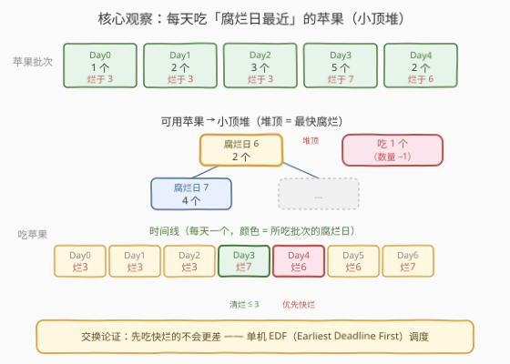
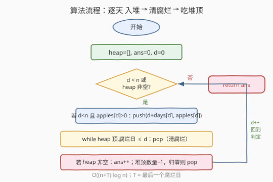
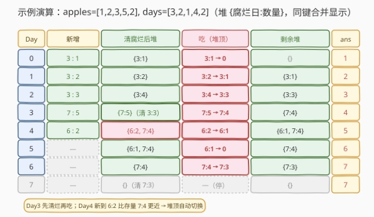

# 吃苹果的最大数目

- **题目名称**：吃苹果的最大数目
- **链接**：[1705. 吃苹果的最大数目](https://leetcode.cn/problems/maximum-number-of-eaten-apples/)
- **难度**：中等
- **标签**：贪心、堆（优先队列）、模拟

## 1. 题目概述

有一棵特殊的苹果树，在连续 $n$ 天里**每天**都会长出若干苹果。第 $i$ 天长出的 `apples[i]` 个苹果会在 `days[i]` 天后**腐烂**——即在第 $i + \text{days}[i]$ 天腐烂，从这一天起这些苹果**不能再吃**。你**每天最多吃一个**苹果，可以留着以后吃，但腐烂的苹果必须丢弃。求你**最多能吃多少个**苹果。

**示例 1**：

```text
输入：apples = [1,2,3,5,2], days = [3,2,1,4,2]
输出：7
解释：各批苹果的腐烂日为 [3,3,3,7,6]
  Day0: 长出 1 个(烂于3)，吃 1 个 Day0 批
  Day1: 长出 2 个(烂于3)，吃 1 个 Day1 批
  Day2: 长出 3 个(烂于3)，吃 1 个 Day1 批（剩 Day2 批 3 个）
  Day3: Day0/1/2 批已烂(腐烂日≤3)，长出 5 个(烂于7)，吃 1 个 Day3 批
  Day4: 长出 2 个(烂于6)，吃 1 个 Day4 批（更快腐烂）
  Day5: 吃 1 个 Day4 批（剩 Day3 批 4 个）
  Day6: Day4 批已烂，吃 1 个 Day3 批
  Day7: Day3 批已烂，无可吃
  共 7 个
```

**示例 2**：

```text
输入：apples = [3,0,0,0,0,2], days = [3,0,0,0,0,2]
输出：5
解释：腐烂日为 [3,_,_,_,_,7]
  Day0/1/2: 各吃 1 个 Day0 批（3 个吃完，Day3 起腐烂）
  Day3/4: 无苹果可吃
  Day5: 长出 2 个(烂于7)，吃 1 个
  Day6: 吃 1 个 Day5 批
  共 5 个
```

**约束条件**：

- $\text{apples.length} == \text{days.length} == n$
- $1 \le n \le 2 \times 10^4$
- $0 \le \text{apples}[i],\ \text{days}[i] \le 2 \times 10^4$
- 当 $\text{apples}[i] = 0$ 时，$\text{days}[i] = 0$（同一天既不长苹果也不计腐烂）

> 💡 **关键结构**：每天有「新苹果到达」与「旧苹果可能腐烂」两类事件，且**每天只能吃一个**。问题本质是一个**带截止期的任务调度**——每批苹果是一组任务，截止期是腐烂日，每天执行一个，求能完成的最多任务数。这类问题的招牌解法是**贪心 + 小顶堆（按截止期）**。

---

## 2. 解题思路

### 2.1 暴力思路：每天线性扫描找最快腐烂

直觉贪心：**每天在所有「尚未腐烂」的苹果批次里，挑腐烂日最近的那批吃一个**。这一贪心策略的正确性见 2.2 的交换论证；先看它的朴素实现：

```text
for d = 0, 1, 2, ... 直到无苹果可吃:
    把第 d 天新长出的批次加入"可用列表"
    从可用列表中删除所有腐烂日 <= d 的批次（已腐烂）
    在剩余批次中线性扫描找"腐烂日最小"者，吃 1 个（数量 -1，归零则删除）
```

每次找最小腐烂日要 $O(B)$（$B$ 为当前可用批次数，最坏 $O(n)$），而时间轴最长可到 $T \approx n + \max(\text{days}) \approx 4 \times 10^4$ 天，整体 $O(T \cdot n) \approx 8 \times 10^8$，逼近超时边界。

> ⚠️ **症结**：「找最小腐烂日」这一步每天重复做，但**每天的可用集合只发生增量变化**（新增一批、腐烂若干）——重复在无序列表里扫最小值纯属浪费。这正是**优先队列**的用武之地。

### 2.2 核心观察：小顶堆按腐烂日维护可用苹果



**两个关键洞察**：

1. **贪心选择**：每天吃「腐烂日最近」的苹果不会更差。证明用**交换论证**：设在某天 $d$ 你没有吃腐烂日最近的批次 $A$（腐烂日 $r_A$），而吃了腐烂日更晚的批次 $B$（$r_B > r_A$）。那么在后续某天 $d'$（$d < d' \le r_A$）你必须吃掉 $A$，否则 $A$ 会腐烂。把「$d$ 吃 $B$、$d'$ 吃 $A$」与「$d$ 吃 $A$、$d'$ 吃 $B$」对比：前者要求 $d' \le r_A$，后者只要求 $d' \le r_B$——由于 $r_A < r_B$，后者的约束更宽松，**总能至少容纳同样多的进食**。故「先吃快烂的」永远不劣。

2. **数据结构**：把「找最小腐烂日」从 $O(n)$ 线性扫描降为 $O(\log n)$ 堆操作。维护一个**小顶堆**，键为**腐烂日**，值为**剩余数量**：
   - **入堆**：第 $d$ 天长出苹果时，push `(d + days[d], apples[d])`；
   - **清腐烂**：每天先弹出堆顶所有腐烂日 $\le d$ 的批次（已腐烂）；
   - **吃**：取堆顶，数量 $-1$，归零则弹出。

> 💡 **腐烂日的语义**：第 $i$ 天长出的苹果在第 $i + \text{days}[i]$ 天腐烂。即腐烂日 $r = i + \text{days}[i]$，在 $r$ 这一天**已不可吃**。故判定条件是 `rot_day <= d`（即 $r \le d$）时丢弃。最后可吃日是 $r - 1$。

> ⚠️ **同一天多批同腐烂日**：示例 1 中 Day0/1/2 三批苹果腐烂日都是 $3$，堆里会出现键相同的多个条目。这不影响正确性——堆对相等键的顺序无要求，任意一个先吃都等价（它们都在同一刻腐烂）。

### 2.3 算法流程图



**步骤**：

1. **初始化** 空小顶堆 `heap`、`ans = 0`、当前日 `d = 0`。
2. **主循环**：只要 `d < n` 或 `heap` 非空就继续：
   - **入堆**：若 `d < n` 且 `apples[d] > 0`，push `(d + days[d], apples[d])`。
   - **清腐烂**：`while heap` 且堆顶腐烂日 $\le d$：`pop`。
   - **吃**：若 `heap` 非空，`ans += 1`，堆顶数量 $-1$，归零则 `pop`。
   - **推进**：`d += 1`。
3. **返回** `ans`。

> 💡 **循环终止**：当 `d >= n`（无新苹果）且堆空（无可用苹果）时停止。每个腐烂日 $r \le n + \max(\text{days}) \le 4 \times 10^4$，故 $d$ 至多走到约 $4 \times 10^4$，循环有限。

### 2.4 示例演算

以示例 1 `apples = [1,2,3,5,2], days = [3,2,1,4,2]`（腐烂日 `[3,3,3,7,6]`）为例，堆用 `{腐烂日:数量}` 表示（同键合并显示）：



| Day | 新增 | 清腐烂后堆 | 吃(堆顶) | 剩余堆 | ans |
|-----|------|------------|----------|--------|-----|
| 0 | 3:1 | {3:1} | 3:1→0 | {} | 1 |
| 1 | 3:2 | {3:2} | 3:2→3:1 | {3:1} | 2 |
| 2 | 3:3 | {3:4} | 3:4→3:3 | {3:3} | 3 |
| 3 | 7:5 | {7:5}（清掉 3:3） | 7:5→7:4 | {7:4} | 4 |
| 4 | 6:2 | {6:2, 7:4} | 6:2→6:1 | {6:1, 7:4} | 5 |
| 5 | — | {6:1, 7:4} | 6:1→0 | {7:4} | 6 |
| 6 | — | {7:4} | 7:4→7:3 | {7:3} | 7 |
| 7 | — | {}（清掉 7:3） | — | {} | 7 |

**关键转折**：

- **Day 3**：堆里原有 `{3:3}`，但腐烂日 $3 \le d=3$，先全部清掉，再入堆 Day3 批 `(7:5)`，于是只剩 `{7:5}`——**清腐烂必须在吃之前做**，否则会吃掉已腐烂的苹果。
- **Day 4**：新入堆的 `(6:2)` 腐烂日比存量 `(7:4)` 更近，堆顶自动变成 `6:2`，保证吃到更快腐烂的那批——这正是小顶堆的核心价值。
- **Day 7**：堆里 `(7:3)` 腐烂日 $7 \le d=7$，全部清除，堆空停止。

最终 `ans = 7` ✓。

---

## 3. 参考代码

### Python

```python
class Solution:
    def eatenApples(self, apples: List[int], days: List[int]) -> int:
        import heapq
        h = []
        n = len(apples)
        ans = 0
        d = 0
        while d < n or h:
            if d < n and apples[d] > 0:
                heapq.heappush(h, [d + days[d], apples[d]])
            while h and h[0][0] <= d:
                heapq.heappop(h)
            if h:
                ans += 1
                h[0][1] -= 1
                if h[0][1] == 0:
                    heapq.heappop(h)
            d += 1
        return ans
```

### C++

```cpp
class Solution {
public:
    int eatenApples(vector<int>& apples, vector<int>& days) {
        int n = apples.size();
        priority_queue<pair<int,int>, vector<pair<int,int>>,
                        greater<pair<int,int>>> pq;
        int ans = 0;
        for (int d = 0; d < n || !pq.empty(); ++d) {
            if (d < n && apples[d] > 0) {
                pq.push({d + days[d], apples[d]});
            }
            while (!pq.empty() && pq.top().first <= d) {
                pq.pop();
            }
            if (!pq.empty()) {
                ++ans;
                auto t = pq.top(); pq.pop();
                if (t.second > 1) {
                    pq.push({t.first, t.second - 1});
                }
            }
        }
        return ans;
    }
};
```

> 💡 **Python 实现细节**：`heapq` 以列表首元素（腐烂日）为键建堆。`h[0][1] -= 1` **原地修改数量**不会破坏堆序——因为键（首元素）未变，堆的不变性依然成立。归零时再 `heappop`，省去了「pop + 重新 push」的一次 $O(\log n)$ 操作。这是 Python 用可变列表实现堆的独有便利。

> ⚠️ **C++ 实现差异**：`std::priority_queue` 的 `top()` 返回 `const` 引用，不能原地改值。故采用「pop 出栈顶、数量 $-1$ 后若仍 $>0$ 则重新 push」的写法，每次吃多一次 $O(\log n)$ 的 push，但总操作数仍为 $O(n + T)$ 量级，不影响渐近复杂度。`greater<pair<int,int>>` 让队列为**小顶堆**（默认是大顶堆，容易写反）。

> ⚠️ **清腐烂顺序**：必须**先清腐烂、再吃**。若先吃后清，可能在腐烂日等于当天的批次里吃掉一个已腐烂苹果（题目不允许）。代码中 `while ... <= d: pop` 严格在 `if (!pq.empty()) ++ans` 之前，确保只吃腐烂日 $> d$ 的苹果。

---

## 4. 复杂度分析

| 维度 | 复杂度 | 说明 |
|------|--------|------|
| 时间 | $O((n + T) \log n)$ | 主循环最多走 $T \approx n + \max(\text{days}) \le 4 \times 10^4$ 天；每天常数次堆操作，每次 $O(\log n)$；总约 $4 \times 10^4 \times \log(2 \times 10^4) \approx 6 \times 10^5$ |
| 空间 | $O(n)$ | 堆中至多同时存放 $n$ 个批次条目（每天至多入堆一批） |

> 💡 **为什么是 $O((n+T)\log n)$ 而非 $O(n\log n)$**：循环由「天」驱动，而非「苹果个数」驱动。即使第 $d$ 天没有新苹果（$d \ge n$），只要堆里还有可吃苹果，循环就得继续推进到所有苹果腐烂或吃完。$T$ 是最后一个腐烂日，约束下 $T \le 4 \times 10^4$，规模可控。若题目把 $\text{days}[i]$ 放大到 $10^9$，逐天模拟会超时——届时需改用「事件驱动」按堆顶腐烂日跳天（见第 5 节扩展）。

---

## 5. 扩展：交换论证与事件驱动优化

### 5.1 贪心正确性的交换论证

「每天吃腐烂日最近的苹果」为何最优？给出更形式化的**交换论证**。

设最优解 $O$ 在某天 $d$ 吃了批次 $B$（腐烂日 $r_B$），而当时存在一个腐烂日更近的批次 $A$（$r_A < r_B$）也被留到了之后某天 $d' > d$ 吃掉（否则 $A$ 必然在 $d$ 之前已被吃，与假设矛盾）。考虑构造新解 $O'$：把 $d$ 与 $d'$ 的进食对象对调——$d$ 吃 $A$、$d'$ 吃 $B$。

- $d$ 吃 $A$：合法，因为 $A$ 在 $d$ 时未腐烂（$d \le r_A$，否则 $A$ 早被丢弃）。
- $d'$ 吃 $B$：需要 $d' \le r_B$。原解中 $d'$ 吃 $A$ 要求 $d' \le r_A < r_B$，故 $d' \le r_B$ 自动成立。

对调后进食总数不变，且仍合法。反复对调可把最优解改造成「每天吃腐烂日最近者」的形式而不减少总数，故贪心解 $\ge$ 最优解；又贪心解本身合法故 $\le$ 最优解。从而**贪心即最优**。

> 💡 **与 EDF 调度的关系**：这正是实时调度中的 **Earliest Deadline First (EDF)** 策略——单机、任务有截止期、每天执行一个，按截止期升序执行可最大化完成任务数。本题是 EDF 的离散版教科书例子。

### 5.2 当 days 很大时：按堆顶跳天

若约束改为 $\text{days}[i] \le 10^9$，逐天推进 $T \le 10^{14}$ 必然超时。优化思路：**没有新苹果到达的日子不必一天天走**，直接跳到下一个有意义的事件——堆顶苹果的腐烂日或吃完日。

```text
i = 0  # 已处理的生长日
while i < n or heap:
    # 把所有"已到达"的批次入堆（本题到达日 = 生长日 i）
    if i < n:
        if apples[i] > 0:
            push(i + days[i], apples[i])
        i += 1
        # 当天推进一格用于吃
        ...  # 复杂度在于"到达日"与"吃日"的耦合
```

这种写法需要小心处理「生长日」与「进食日」的分离——当堆非空时，进食日可连续推进，吃光堆顶后若还没到下一个生长日，需把进食日跳到下一个生长日。实现比逐天版本复杂，但能把复杂度压到 $O(n \log n)$（与 $T$ 无关）。本题约束下 $T$ 不大，逐天版本已足够，故采用更简洁的写法。

> ⚠️ **本题为何不直接用跳天版**：$T \le 4 \times 10^4$，逐天 $O(T \log n)$ 完全在时限内，且代码清晰不易出 bug。跳天版的优势要在 $T \gg n$ 时才显现，是典型的「按约束选实现」的取舍。

---

## 6. 面试要点

**Q1：为什么「每天吃腐烂日最近的」是最优的？**
> 交换论证：若某天没吃腐烂日最近的批次 $A$ 而吃了更晚腐烂的 $B$，则 $A$ 必在之后某天 $d'$（$\le r_A$）被吃。把这两天的进食对象对调，$d'$ 吃 $B$ 仍合法（$d' \le r_A < r_B$），总数不变。反复对调可将任意最优解改造成贪心形式，故贪心不劣于最优。本质是单机 EDF 调度。

**Q2：堆里存什么？键是什么？为什么用小顶堆？**
> 存 `(腐烂日, 剩余数量)` 二元组，键是腐烂日。用小顶堆是为了 $O(\log n)$ 取出「腐烂日最近」的批次——这正是贪心每天要吃的对象。大顶堆会取最晚腐烂的，与贪心策略相反，会白白让快烂的苹果腐烂。

**Q3：清腐烂的判定条件为什么是 `rot_day <= d` 而非 `< d`？**
> 腐烂日 $r = i + \text{days}[i]$ 是苹果**腐烂的那一天**，从 $r$ 起不可吃，最后可吃日是 $r-1$。故当前日 $d = r$ 时苹果已烂，条件 `rot_day <= d` 正确地把它清除。若写成 `< d`，会在腐烂当天误吃一个已腐烂苹果。

**Q4：为什么「清腐烂」必须在「吃」之前？**
> 清腐烂保证堆里剩下的都是腐烂日 $> d$ 的可吃苹果。若先吃后清，可能在堆顶是腐烂日 $= d$ 的批次时吃掉一个已烂苹果，违反题意。代码里 `while` 清除严格在 `if` 吃之前，确保只吃未腐烂的。

**Q5：Python 版原地改 `h[0][1]` 为何不破坏堆？C++ 能这样做吗？**
> `heapq` 的堆序只依赖列表元素的首项（腐烂日），原地改第二项（数量）不改变首项，故堆不变性保持。C++ 的 `priority_queue::top()` 返回 `const` 引用，不能原地修改，必须 pop 后改值再 push——多一次 $O(\log n)$ 但总复杂度不变。

> 💡 **一句话总结**：带截止期的单机调度 → EDF 贪心 → 小顶堆按腐烂日取最小；每天「入堆、清腐烂、吃堆顶」三步，$O((n+T)\log n)$。

---

## 7. 同类练习题

- [1353. 最多可以参加的会议数目](https://leetcode.cn/problems/maximum-number-of-events-that-can-be-attended/)（[题解](../1301-1400/1353_最多可以参加的会议数目.md)）：**最同构的姊妹题**——会议有 `[start, end]` 区间、每天参加一个、求最多参加数。同样「按起始日排序 + 小顶堆按结束日」的 EDF 贪心，只是到达是区间而非单点，对照理解「堆键 = 截止期」的通用性
- [253. 会议室 II](https://leetcode.cn/problems/meeting-rooms-ii/)（[题解](../0201-0300/253_会议室II.md)）：同一族「按时间扫描 + 小顶堆」模型，但目标从「最多完成数」换成「最少并行资源（会议室数）」——堆键仍是结束时间，但语义是维护进行中的会议，对照体会同一数据结构服务不同目标
- [502. IPO](https://leetcode.cn/problems/ipo/)（[题解](../0501-0600/502_IPO.md)）：贪心 + 堆的另一种典型形态——按资本解锁项目（小顶堆）+ 按利润选最大（大顶堆），双堆协作，对照本题单堆 EDF 理解「堆维护候选集」的共性
- [1606. 找到处理最多请求的服务器](https://leetcode.cn/problems/find-servers-that-handled-most-number-of-requests/)（[题解](../1601-1700/1606_找到处理最多请求的服务器.md)）：多机调度变体——从「单机每天吃一个」升级为「$k$ 台服务器」，小顶堆维护空闲时刻 + 有序集合找可用机器，对照理解「单资源 vs 多资源」时堆角色的演变
- [1642. 可以到达的最远建筑](https://leetcode.cn/problems/furthest-building-you-can-reach/)（[题解](../1601-1700/1642_可以到达的最远建筑.md)）：另一种「按需切换堆策略」的贪心——用大顶堆记录已用梯子、不够时把最小差值换回砖块，与本题「清腐烂再吃」的堆维护节奏同属「扫描中动态调整堆」的范式
