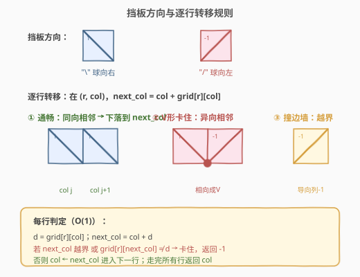
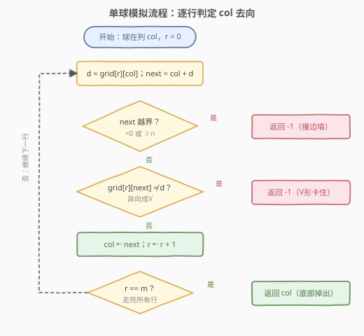
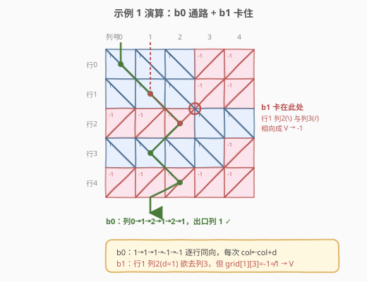

# LeetCode 球会落何处 题解

## 1. 题目概述

- **标题 / 题号**：球会落何处（#1706，medium）
- **链接**：https://leetcode.cn/problems/where-will-the-ball-fall/
- **难度**：中等
- **标签**：数组、矩阵、模拟、深度优先搜索

**题意**：用一个大小为 $m \times n$ 的二维网格 `grid` 表示一个箱子，顶部和底部都是开着的。每个单元格有一块对角线挡板：

- `1` 表示跨过**左上角和右下角**的挡板（形如 `\`），把球导向**右侧**；
- `-1` 表示跨过**右上角和左下角**的挡板（形如 `/`），把球导向**左侧**。

在箱子**每一列的顶端各放一颗球**。球可能从底部掉出，也可能卡住。**卡住**有两种情形：

1. 球被导向箱子左/右**边墙**（即越出网格边界）；
2. 球恰好卡在两块**相向**挡板之间的 "V" 形图案里（当前格 `1` 而相邻右侧格 `-1`，或当前格 `-1` 而相邻左侧格 `1`）。

返回长度为 $n$ 的数组 `answer`，其中 `answer[i]` 是从顶部第 $i$ 列放入的球最终从底部掉出时所在的列下标；若卡住则返回 `-1`。

**示例 1**：

```text
输入：grid = [[1,1,1,-1,-1],[1,1,1,-1,-1],[-1,-1,-1,1,1],[1,1,1,1,-1],[-1,-1,-1,-1,-1]]
输出：[1,-1,-1,-1,-1]
解释：
  b0 放在第 0 列，最终从底部第 1 列掉出。
  b1 放在第 1 列，卡在第 2、3 列与第 1 行之间的 "V" 形里。
  b2 放在第 2 列，卡在第 2、3 列与第 0 行之间的 "V" 形里。
  b3 放在第 3 列，卡在第 2、3 列与第 0 行之间的 "V" 形里。
  b4 放在第 4 列，卡在第 2、3 列与第 1 行之间的 "V" 形里。
```

**示例 2**：

```text
输入：grid = [[-1]]
输出：[-1]
解释：球被导向左侧边墙，卡住。
```

**示例 3**：

```text
输入：grid = [[1,1,1,1,1,1],[-1,-1,-1,-1,-1,-1],[1,1,1,1,1,1],[-1,-1,-1,-1,-1,-1]]
输出：[0,1,2,3,4,-1]
```

**约束**：

- $m == \text{grid.length}$
- $n == \text{grid}[i].\text{length}$
- $1 \le m, n \le 100$
- $\text{grid}[i][j]$ 为 `1` 或 `-1`

> 💡 **关键结构**：每个球从顶到底的路径**完全独立**——球之间互不影响，且每一行只发生一次列转移。因此问题可拆成 $n$ 个独立的「单球下落」子问题，每颗球最多走 $m$ 行，每行只需 $O(1)$ 判定。

## 2. 解题思路

### 2.1 暴力思路：逐格 BFS/DFS 搜索

最直觉的做法是把网格当成图：每个格子 $(r, c)$ 根据 `grid[r][c]` 有唯一的出边——`1` 连向 $(r+1, c+1)$、`-1` 连向 $(r+1, c-1)$。对每颗球从 $(0, \text{start})$ 出发做 DFS/BFS，搜索到底层或撞墙/V 形即终止。

这种写法本身时间复杂度仍是 $O(m \cdot n)$（每球至多走 $m$ 步），但用队列/栈把「确定性的单条路径」包装成「搜索」，引入了不必要的 $O(m)$ 栈空间与代码复杂度。问题在于：**每个格子的出边是唯一的**，球没有分支可选——这不是搜索问题，而是**确定性状态转移**。

> ⚠️ **症结**：把「单链式下落」误当「图搜索」。既然每步去向唯一，只需一个 `col` 变量沿行向下滚动即可，无需任何容器。

### 2.2 核心观察：单变量滚动模拟



关键洞察：球在第 $r$ 行第 `col` 列时，挡板方向 $d = \text{grid}[r][\text{col}]$ **直接给出**下一列：

$$
\text{next\_col} = \text{col} + d
$$

- $d = 1$（`\`）：球向右滑到 `col + 1`；
- $d = -1$（`/`）：球向左滑到 `col - 1`。

球能否落到 `next_col` 取决于**两个条件**，任一不满足即卡住：

1. **不越界**：$0 \le \text{next\_col} < n$。否则球被导向左/右边墙（示例 2：`[-1]` 在列 0，`next_col = -1` 越界）。
2. **相邻格同向**：$\text{grid}[r][\text{next\_col}] = d$。否则两块挡板**相向**构成 "V" 形（`\` 后接 `/`，或 `/` 后接 `\`），球被兜住。

> 💡 **为什么只需检查 `next_col` 一格？** 球要离开当前格必须先进入 `next_col`，而进入 `next_col` 的前提是它「接得住」——即 `next_col` 的挡板与当前格**同向**（把球继续往下送，而非往回推）。若异向，球在两格交界处即被夹住，无需再往下看。

两条件都满足时，球成功下落到 `next_col`，进入第 $r+1$ 行；`col ← next_col`，继续滚动。走完所有 $m$ 行后，`col` 即为出口列。

### 2.3 算法流程图



对每颗球（初始列 `col = start`）：

1. **遍历** 每一行 $r \in [0, m)$：
   - 取 $d = \text{grid}[r][\text{col}]$，计算 $\text{next\_col} = \text{col} + d$；
   - **判定越界**：若 $\text{next\_col} < 0$ 或 $\text{next\_col} \ge n$，返回 $-1$；
   - **判定 V 形**：若 $\text{grid}[r][\text{next\_col}] \ne d$，返回 $-1$；
   - **转移**：$\text{col} \leftarrow \text{next\_col}$。
2. 走完全部行后，返回 `col`。

> 💡 **判定的顺序无关紧要**：两个条件都是「卡住」的充分条件，先判哪个都不影响结果。但工程上**先判越界再判 V 形**更安全——避免在 `next_col` 越界时访问 `grid[r][next_col]` 导致数组越界崩溃。

### 2.4 示例演算

以示例 1 的 $5 \times 5$ 网格为例，追踪 **b0**（从列 0 进入）与 **b1**（从列 1 进入）：



**b0 路径**（成功掉出）：

| 行 $r$ | 当前 col | grid[r][col] | next_col | grid[r][next] | 判定 | 转移后 col |
|--------|----------|--------------|----------|---------------|------|------------|
| 0 | 0 | 1 | 1 | 1 | 同向 ✓ | 1 |
| 1 | 1 | 1 | 2 | 1 | 同向 ✓ | 2 |
| 2 | 2 | -1 | 1 | -1 | 同向 ✓ | 1 |
| 3 | 1 | 1 | 2 | 1 | 同向 ✓ | 2 |
| 4 | 2 | -1 | 1 | -1 | 同向 ✓ | 1 |

走完 5 行，`col = 1` → `answer[0] = 1` ✓。

**b1 路径**（V 形卡住）：

| 行 $r$ | 当前 col | grid[r][col] | next_col | grid[r][next] | 判定 | 结果 |
|--------|----------|--------------|----------|---------------|------|------|
| 0 | 1 | 1 | 2 | 1 | 同向 ✓ | col=2 |
| 1 | 2 | 1 | 3 | **-1** | 异向 ✗ | 返回 -1 |

b1 在行 1 列 2 处，挡板为 `1`（`\`）欲去列 3，但列 3 是 `-1`（`/`），两块板相向成 "V"，球被兜住 → `answer[1] = -1` ✓。

> 💡 **观察**：b0 之所以能贯穿，是因为它每一步的「当前格与 next 格」挡板都同向。这种 zigzag 路径（0→1→2→1→2→1）正是「同向板交替」自然形成的下落轨迹——`1` 把球推右、`-1` 把球推左，只要相邻格同向就能持续下落。

## 3. 参考代码

### C++

```cpp
class Solution {
public:
    vector<int> findBall(vector<vector<int>>& grid) {
        int m = grid.size(), n = grid[0].size();
        vector<int> ans(n);
        for (int start = 0; start < n; ++start) {
            int col = start;
            for (int r = 0; r < m; ++r) {
                int d = grid[r][col];
                int next = col + d;
                if (next < 0 || next >= n || grid[r][next] != d) {
                    col = -1;
                    break;
                }
                col = next;
            }
            ans[start] = col;
        }
        return ans;
    }
};
```

### Python

```python
class Solution:
    def findBall(self, grid: List[List[int]]) -> List[int]:
        m, n = len(grid), len(grid[0])
        ans = []
        for start in range(n):
            col = start
            for r in range(m):
                d = grid[r][col]
                nxt = col + d
                if nxt < 0 or nxt >= n or grid[r][nxt] != d:
                    col = -1
                    break
                col = nxt
            ans.append(col)
        return ans
```

> ⚠️ **越界检查必须在前**：`next < 0 || next >= n` 要放在 `grid[r][next] != d` **之前**用短路 `||` 连接。若颠倒顺序，`next` 越界时 `grid[r][next]` 会触发未定义行为（C++）或 `IndexError`（Python）。C++ 的 `||` 与 Python 的 `or` 都保证短路求值，安全。

> 💡 **为何把「卡住」统一折叠成 `col = -1` + `break`？** 卡住后无需继续往下走，提前跳出循环；循环外 `ans[start] = col` 自然写入 `-1`。这比在循环里 `return -1` 更统一——单球模拟没有「函数返回」概念，用 `col` 这一个状态变量同时承载「当前列」与「失败标记」，代码最简。

## 4. 复杂度分析

| 维度 | 复杂度 | 说明 |
|------|--------|------|
| 时间复杂度 | $O(m \cdot n)$ | $n$ 颗球，每球至多走 $m$ 行，每行 $O(1)$ 判定；$m, n \le 100$ 时约 $10^4$ 次操作 |
| 空间复杂度 | $O(1)$ | 仅 `col`、`d`、`next` 等标量；返回数组不计入额外空间（若计入则为 $O(n)$） |

> 💡 本题 $m, n \le 100$，$O(mn)$ 极宽松。关键在于**没有把单球下落包装成搜索**——确定性转移无需栈/队列，单变量滚动即足够。即便 $m, n$ 放大到 $10^5$，$O(mn)$ 仍可接受（约 $10^{10}$ 边界，需进一步优化才会遇到瓶颈）。

## 5. 扩展：DFS 写法与记忆化

### 5.1 DFS 递归形式

上面的循环写法本质等价于从 $(0, \text{start})$ 出发的一条**确定性 DFS**——每个节点只有一个后继。递归形式如下：

```cpp
int dfs(vector<vector<int>>& g, int r, int c, int m, int n) {
    if (r == m) return c;                 // 走完所有行，返回出口列
    int d = g[r][c], nxt = c + d;
    if (nxt < 0 || nxt >= n || g[r][nxt] != d) return -1;
    return dfs(g, r + 1, nxt, m, n);
}
```

每颗球调用 `dfs(grid, 0, start, m, n)`。逻辑与迭代版完全一致，但递归深度达 $m$，空间 $O(m)$（调用栈）。本题 $m \le 100$ 无溢栈风险，但工程上迭代版更优。

### 5.2 为什么不需要记忆化？

经典 DFS 优化是「记忆化」——缓存子问题答案避免重复计算。但本题**每颗球的路径起点不同，路径本身也互不相同**：球 A 从列 0 出发经过的格子序列，与球 B 从列 1 出发经过的几乎不重合（即便偶有交叠，交点之后的子路径也未必相同，因为「行号 + 列号」相同才算同一子问题）。

更本质地：本题时间已是 $O(mn)$，而「所有球访问的总格子数」上界就是 $n \cdot m$（每球 $m$ 步），记忆化无法降低这个上界——没有冗余计算可消。这与 [79. 单词搜索](../0001-0100/79_单词搜索.md) 的「多起点 DFS + 记忆化」不同：单词搜索中同一格子可被多条路径复用且后缀重叠，才有记忆化收益。

> 💡 **判定是否值得记忆化的标准**：看「子问题是否被重复求解」。本题每个 `(r, col)` 子问题只被至多一颗球以特定方式到达，无重复——记忆化徒增 $O(mn)$ 空间而无收益。

## 6. 面试要点

**Q1：为什么这题是「模拟」而非「搜索」？**
> 每个格子的挡板方向唯一确定球的下一列——`1` 必走右、`-1` 必走左，没有分支。搜索（DFS/BFS）用于「有多种选择、需探索多条路径」的场景；这里路径唯一，只需一个 `col` 变量沿行向下滚动。把确定性转移误当搜索会引入不必要的栈/队列与代码复杂度。

**Q2：V 形卡住的条件 `grid[r][next] != d` 是怎么来的？**
> 球要离开当前格必须进入 `next` 格，而 `next` 格必须「接得住」——即它的挡板与当前格**同向**，把球继续往下送。若 `next` 格挡板与当前格异向（`\` 接 `/` 或 `/` 接 `\`），两板相向构成 "V"，球在交界处被夹住。这正是 `grid[r][next] != d` 的物理含义。

**Q3：越界检查和 V 形检查的顺序重要吗？**
> **结果不重要，安全很重要**。两个条件都是卡住的充分条件，逻辑上先后无所谓。但 C++/Python 中必须**先判越界再访问 `grid[r][next]`**，并用短路运算符（`||` / `or`）连接——否则 `next` 越界时访问数组会触发未定义行为或 `IndexError`。这是本题最常见的实现陷阱。

**Q4：球之间会相互影响吗？为什么可以独立模拟？**
> 不会。题目在每列顶端「各放一颗球」，球下落过程中不互相碰撞、不共享状态——每颗球的路径完全由网格本身决定。因此 $n$ 颗球可独立模拟，无需联合建模。若题目改为「球会堆积/互相阻挡」，则需按行批量处理（类似 [用过期的糖果](https://leetcode.cn/problems/) 之类堆积模拟），复杂度上升。

**Q5：如果把 `1`/`-1` 换成更复杂的挡板（如 `0` 表示水平板）该怎么扩展？**
> 核心是「当前格如何决定下一列」。若 `0` 表示球直接垂直下落（`next = col`），只需在取 `d` 后加分支：`d = grid[r][col]; next = col + (d == 0 ? 0 : d)`，并把 V 形判定改为「`d != 0` 且 `grid[r][next] != d`」。这套「`next_col = col + offset(r, col)` + 合法性校验」的骨架是网格下落模拟的通用模板。

## 同类练习题

| # | 题目 | 与本题的关联 |
|---|------|-------------|
| 1106 | [解析布尔表达式](https://leetcode.cn/problems/parsing-a-boolean-expression/) | 另一类「按字符确定状态转移」的模拟——每个运算符决定后续如何归约，与本题「每块挡板决定下一列」同为确定性状态机 |
| 54 | [螺旋矩阵](https://leetcode.cn/problems/spiral-matrix/)（[题解](../0001-0100/54_螺旋矩阵.md)） | 矩阵上的确定性方向模拟——按方向边界逐步推进，用最少状态变量完成遍历，与本题「单变量滚动」同源 |
| 59 | [螺旋矩阵 II](https://leetcode.cn/problems/spiral-matrix-ii/) | 螺旋矩阵的生成版——按方向规则填充网格，同样是「方向决定下一格」的模拟骨架 |
| 73 | [矩阵置零](https://leetcode.cn/problems/set-matrix-zeroes/) | 矩阵标记模拟——用首行首列做标记，O(1) 额外空间完成批量更新，对照体会「矩阵模拟中状态压缩」的思路 |
| 807 | [保持城市天际线](https://leetcode.cn/problems/max-increase-to-keep-city-skyline/) | 矩阵行列约束模拟——按行/列最大值确定每格上限，与本题「按格子内容决定行为」同为矩阵遍历型 |
