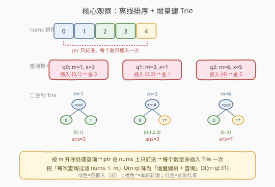
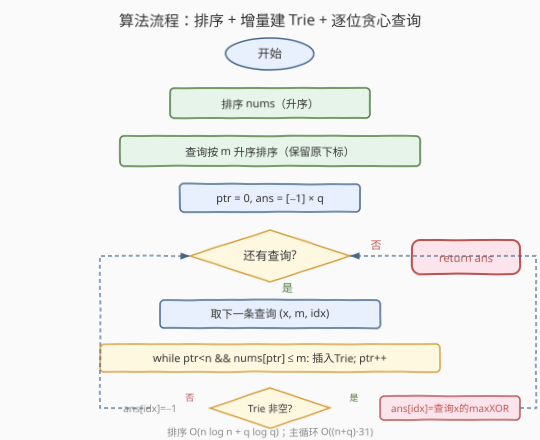
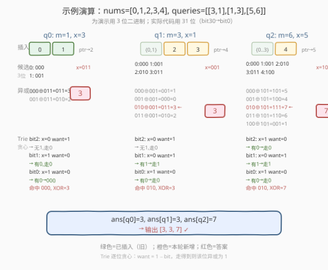

# 与数组中元素的最大异或值

- **题目名称**：与数组中元素的最大异或值
- **链接**：[1707. 与数组中元素的最大异或值](https://leetcode.cn/problems/maximum-xor-with-an-element-from-array/)
- **难度**：困难
- **标签**：位运算、字典树、数组、离线处理

## 1. 题目概述

给定一个由**非负整数**组成的数组 `nums`，以及一个查询数组 `queries`，其中 `queries[i] = [x_i, m_i]`。

第 $i$ 个查询的答案是：在 `nums` 中所有**不超过** $m_i$ 的元素里，与 $x_i$ 按位异或（$\oplus$）后能取到的**最大值**。即：

$$\text{answer}[i] = \max_{\substack{j \,:\, \text{nums}[j] \le m_i}} (\text{nums}[j] \oplus x_i)$$

若 `nums` 中所有元素都大于 $m_i$，则答案为 $-1$。

**示例 1**：

```text
输入：nums = [0,1,2,3,4], queries = [[3,1],[1,3],[5,6]]
输出：[3,3,7]
解释：
  查询 0：x=3, m=1 → 不超过 1 的元素 {0,1}
         0⊕3=3, 1⊕3=2 → max=3
  查询 1：x=1, m=3 → 不超过 3 的元素 {0,1,2,3}
         0⊕1=1, 1⊕1=0, 2⊕1=3, 3⊕1=2 → max=3
  查询 2：x=5, m=6 → 不超过 6 的元素 {0,1,2,3,4}
         0⊕5=5, 1⊕5=4, 2⊕5=7, 3⊕5=6, 4⊕5=1 → max=7
```

**示例 2**：

```text
输入：nums = [5,2,4,6,6,3], queries = [[12,4],[8,1],[6,3]]
输出：[15,-1,5]
解释：
  查询 0：x=12, m=4 → 不超过 4 的元素 {2,3,4}
         2⊕12=14, 3⊕12=15, 4⊕12=8 → max=15
  查询 1：x=8, m=1 → 无元素不超过 1（最小元素为 2）→ ans=−1
  查询 2：x=6, m=3 → 不超过 3 的元素 {2,3}
         2⊕6=4, 3⊕6=5 → max=5
```

**约束条件**：

- $1 \le \text{nums.length}, \text{queries.length} \le 10^5$
- $\text{queries}[i].\text{length} = 2$
- $0 \le \text{nums}[j], x_i, m_i \le 10^9$

> 💡 **关键观察**：本题是 [421. 数组中两个数的最大异或值](../0401-0500/421_数组中两个数的最大异或值.md) 的进阶版——421 无约束地求全局最大异或，而本题每条查询额外限制「候选元素 $\le m_i$」。直接套 421 的二进制 Trie 对每条查询重建一遍会 $O(q \cdot n \cdot 31)$，必然超时。突破口在于**离线排序**：把查询按 $m_i$ 升序处理，候选集只增不减，Trie 也只增不拆。

---

## 2. 解题思路

### 2.1 暴力思路：逐查询枚举

对每条查询 $(x_i, m_i)$，扫描 `nums` 中所有 $\le m_i$ 的元素，逐个计算异或取最大值。时间复杂度 $O(q \cdot n)$，$n, q \le 10^5$ 时约 $10^{10}$ 次运算，必然超时。

> ⚠️ **症结**：每条查询独立处理，重复扫描 `nums` 且重复建 Trie（若用 Trie 加速）。但如果能**按 $m_i$ 排序**处理查询，候选集「只增不减」——之前插入过的数永远有效，只需把新满足条件的数追加进 Trie 即可。

### 2.2 核心观察：离线排序 + 增量建 Trie



本题的关键转换是**离线处理**——不按原始顺序回答查询，而是按 $m_i$ **升序**处理：

1. **排序 `nums`**：升序排列，使得「所有 $\le m_i$ 的元素」构成一个前缀 `nums[0..ptr-1]`。
2. **排序查询**：按 $m_i$ 升序排列（保留原始下标以便最终回填答案），使得随着 $m_i$ 增大，候选前缀只增不减。
3. **增量建 Trie**：用一个游标 `ptr` 指向 `nums` 的待插入位置。处理查询 $(x, m)$ 时，只要 `nums[ptr] <= m`，就把 `nums[ptr]` 插入二进制 Trie 并 `ptr++`。这样**每个数至多插入一次**，总插入代价 $O(n \cdot 31)$。
4. **逐位贪心查询**：对 $x$ 在 Trie 上走「优先相反位」的贪心路径，$O(31)$ 得到最大异或值（与 421 完全相同）。

$$\boxed{\text{总代价} = \underbrace{O(n \log n + q \log q)}_{\text{排序}} + \underbrace{O(n \cdot 31)}_{\text{插入}} + \underbrace{O(q \cdot 31)}_{\text{查询}}}$$

> 💡 **为什么离线排序可行？** 关键在于「候选集 $\le m_i$」具有**单调性**：若 $m_a \le m_b$，则候选集 $S_a \subseteq S_b$。按 $m$ 升序处理时，$S$ 只增不减，已插入 Trie 的数永远有效，无需删除。如果把查询按原始顺序在线回答，候选集会忽大忽小，需要可撤销的数据结构（持久化 Trie），复杂度与实现难度都更高。

> ⚠️ **空候选集判定**：若某查询的 $m$ 小于 `nums` 中最小元素，`ptr` 不会前进，Trie 为空，此时答案为 $-1$。代码中通过 `ptr > 0` 判断 Trie 是否非空——`ptr` 记录了已插入的元素个数，`ptr == 0` 即 Trie 为空。

### 2.3 算法流程图



**步骤**：

1. **排序 `nums`**（升序）。
2. **排序查询**：按 $m_i$ 升序，保留原始下标 `idx`。
3. **初始化** `ptr = 0`，`ans = [-1] × q`，空 Trie。
4. **遍历排序后的查询** $(x, m, \text{idx})$：
   - **增量插入**：`while ptr < n and nums[ptr] <= m: insert(nums[ptr]); ptr++`
   - **查询**：若 `ptr > 0`（Trie 非空），`ans[idx] = query(x)`；否则 `ans[idx]` 保持 $-1$。
5. **返回** `ans`。

### 2.4 示例演算

以示例 1 `nums = [0,1,2,3,4]`、`queries = [[3,1],[1,3],[5,6]]` 为例（为演示用 3 位二进制，实际代码用 31 位）：



| 数 | 3 位二进制 |
|----|-----------|
| 0  | 000 |
| 1  | 001 |
| 2  | 010 |
| 3  | 011 |
| 4  | 100 |

**排序后**：`nums = [0,1,2,3,4]`，查询按 $m$ 排序为 `[(m=1,x=3,idx=0), (m=3,x=1,idx=1), (m=6,x=5,idx=2)]`。

**阶段 1**：`m=1, x=3`（二进制 `011`）
- 插入：`nums[0]=0 ≤ 1` → 插入 `000`；`nums[1]=1 ≤ 1` → 插入 `001`；`nums[2]=2 > 1` → 停。`ptr=2`。
- Trie 贪心查询 `x=011`：
  - `bit2`：`x=0`，`want=1` → `000`/`001` 均以 `0` 开头，无 `1` 分支 → 走 `0`，该位异或 `0`。
  - `bit1`：`x=1`，`want=0` → `000`/`001` 的 `bit1` 均为 `0`，有 `0` 分支 → 走 `0`，`val |= 010 = 2`。
  - `bit0`：`x=1`，`want=0` → `000` 的 `bit0` 为 `0`，有 `0` 分支 → 走 `0`，`val |= 001 = 3`。
  - 命中 `000`（即 `0`），`0 ⊕ 3 = 3`。`ans[0] = 3` ✓

**阶段 2**：`m=3, x=1`（二进制 `001`）
- 插入：`nums[2]=2 ≤ 3` → 插入 `010`；`nums[3]=3 ≤ 3` → 插入 `011`；`nums[4]=4 > 3` → 停。`ptr=4`。
- Trie 现有 `{000, 001, 010, 011}`，贪心查询 `x=001`：
  - `bit2`：`x=0`，`want=1` → 无（全是 `0` 开头）→ 走 `0`。
  - `bit1`：`x=0`，`want=1` → 有（`010`/`011`）→ 走 `1`，`val |= 010 = 2`。
  - `bit0`：`x=1`，`want=0` → 有（`010`）→ 走 `0`，`val |= 001 = 3`。
  - 命中 `010`（即 `2`），`2 ⊕ 1 = 3`。`ans[1] = 3` ✓

**阶段 3**：`m=6, x=5`（二进制 `101`）
- 插入：`nums[4]=4 ≤ 6` → 插入 `100`；`ptr=5=n` → 停。
- Trie 现有 `{000, 001, 010, 011, 100}`，贪心查询 `x=101`：
  - `bit2`：`x=1`，`want=0` → 有（`000`/`001`/`010`/`011`）→ 走 `0`，`val |= 100 = 4`。
  - `bit1`：`x=0`，`want=1` → 有（`010`/`011`）→ 走 `1`，`val |= 010 = 6`。
  - `bit0`：`x=1`，`want=0` → 有（`010`）→ 走 `0`，`val |= 001 = 7`。
  - 命中 `010`（即 `2`），`2 ⊕ 5 = 7`。`ans[2] = 7` ✓

**最终答案**：`[3, 3, 7]` ✓

> 💡 **Trie 贪心的本质**：每一步 `want = 1 - bit` 试图让该位异或为 `1`（高位优先）。走得到相反位则该位贡献 $2^i$，走不到则取相同位（贡献 $0$），但不影响低位继续贪心。这与 421 的查询逻辑完全一致——区别仅在于 421 对**全部** `nums` 建 Trie，而本题只对 $\le m$ 的子集增量建 Trie。

---

## 3. 参考代码

### C++

```cpp
class Solution {
    struct Node {
        Node* child[2] = {nullptr, nullptr};
    };

    void insert(Node* root, int x) {
        Node* cur = root;
        for (int i = 30; i >= 0; i--) {
            int b = (x >> i) & 1;
            if (!cur->child[b]) cur->child[b] = new Node();
            cur = cur->child[b];
        }
    }

    int query(Node* root, int x) {
        Node* cur = root;
        int val = 0;
        for (int i = 30; i >= 0; i--) {
            int b = (x >> i) & 1;
            int want = 1 - b;
            if (cur->child[want]) {
                val |= (1 << i);
                cur = cur->child[want];
            } else {
                cur = cur->child[b];
            }
        }
        return val;
    }

public:
    vector<int> maximizeXor(vector<int>& nums, vector<vector<int>>& queries) {
        sort(nums.begin(), nums.end());

        int q = queries.size();
        struct Q { int x, m, idx; };
        vector<Q> qs(q);
        for (int i = 0; i < q; i++)
            qs[i] = {queries[i][0], queries[i][1], i};
        sort(qs.begin(), qs.end(), [](const Q& a, const Q& b) {
            return a.m < b.m;
        });

        Node* root = new Node();
        int ptr = 0, n = nums.size();
        vector<int> ans(q, -1);

        for (const auto& qr : qs) {
            while (ptr < n && nums[ptr] <= qr.m) {
                insert(root, nums[ptr]);
                ptr++;
            }
            if (ptr > 0)
                ans[qr.idx] = query(root, qr.x);
        }
        return ans;
    }
};
```

### Python

```python
class Solution:
    def maximizeXor(self, nums: List[int], queries: List[List[int]]) -> List[int]:
        class TrieNode:
            __slots__ = ('child',)
            def __init__(self):
                self.child = [None, None]

        root = TrieNode()

        def insert(x):
            cur = root
            for i in range(30, -1, -1):
                b = (x >> i) & 1
                if not cur.child[b]:
                    cur.child[b] = TrieNode()
                cur = cur.child[b]

        def query(x):
            cur = root
            val = 0
            for i in range(30, -1, -1):
                b = (x >> i) & 1
                want = 1 - b
                if cur.child[want]:
                    val |= (1 << i)
                    cur = cur.child[want]
                else:
                    cur = cur.child[b]
            return val

        nums.sort()
        sorted_q = sorted((m, x, i) for i, (x, m) in enumerate(queries))

        ans = [-1] * len(queries)
        ptr = 0
        for m, x, idx in sorted_q:
            while ptr < len(nums) and nums[ptr] <= m:
                insert(nums[ptr])
                ptr += 1
            if ptr > 0:
                ans[idx] = query(x)
        return ans
```

> 💡 **实现细节**：① 排序查询时用 `(m, x, i)` 元组，Python `sorted` 自动按字典序排，首键 `m` 升序即所需。② `ptr > 0` 判断 Trie 非空——`ptr` 记录已插入元素数，`ptr == 0` 说明无元素 $\le m$，答案保持 $-1$。③ `HIGH_BIT = 30`：因为 $10^9 < 2^{30} = 1{,}073{,}741{,}824$，`bit30` 对所有值恒为 `0`，多一层无害但更安全；若精确到 `bit29` 也正确。

> ⚠️ **C++ 注意**：`Node` 使用 `new` 分配，LeetCode 环境无需手动释放。若面试官要求无内存泄漏，可改用 `vector<Node>` 预分配节点池（最坏 $n \cdot 31$ 个节点），索引代替指针。

---

## 4. 复杂度分析

| 维度 | 复杂度 | 说明 |
|------|--------|------|
| 时间 | $O(n \log n + q \log q + (n+q) \cdot 31)$ | 排序 $O(n \log n + q \log q)$；每个 `nums` 元素插入 Trie 一次 $O(n \cdot 31)$；每条查询在 Trie 上贪心走 31 层 $O(q \cdot 31)$ |
| 空间 | $O(n \cdot 31 + q)$ | Trie 最坏 $n \cdot 31$ 个节点（大量前缀共享后实际更少）；排序后的查询数组 $O(q)$；答案数组 $O(q)$ |

> ⚠️ **为什么是 31 不是 30？** $10^9 < 2^{30}$，最高有效位是 `bit29`。代码用 `bit30 → bit0`（31 层）留一格余量，`bit30` 恒为 `0` 不影响结果。若改为 `bit29 → bit0`（30 层）也完全正确，Trie 层数少一层。

> 💡 **与暴力对比**：暴力 $O(q \cdot n) = 10^{10}$；本解法 $\approx 10^5 \cdot 31 \approx 3 \times 10^6$，快约 $3000$ 倍。核心增益来自**离线排序消除了重复建树**——每个数只插入一次，而非每条查询重建。

---

## 5. 扩展：在线查询与持久化 Trie

### 5.1 为什么离线排序可行？

本题能离线排序的关键在于查询之间**无依赖**——每条查询的答案只取决于 `nums` 和 $(x_i, m_i)$ 本身，不依赖前一条查询的结果。若查询有依赖（如「上一条答案作为下一条的 $x$」），则无法重排。

更本质的条件是**候选集的单调性**：`{nums[j] : nums[j] ≤ m}` 关于 $m$ 单调递增。按 $m$ 升序处理时，Trie 只增不删，只需「插入」操作。若候选集不单调（如约束改为「$l_i \le \text{nums}[j] \le r_i$」），则需要在区间上动态维护，离线排序不够用。

### 5.2 在线查询怎么做？

若题目要求**在线**回答查询（即必须按原始顺序，后续查询的 $m_i$ 可能比之前小），离线排序失效。此时有两种替代方案：

- **持久化 Trie（可持久化二进制字典树）**：按 `nums` 排序后依次插入，每插入一个数保存 Trie 的版本快照。查询 $(x, m)$ 时，二分找到 $\le m$ 的最大下标 $k$，在版本 $k$ 的 Trie 上查询。相当于「回到过去」看某时刻的 Trie。时间 $O((n + q) \cdot 31 + q \log n)$，空间 $O(n \cdot 31)$（只存新增节点）。
- **可删除 Trie（带计数）**：每个节点维护子树大小，支持删除操作。但需要维护一个滑动窗口，复杂度更高。

> 💡 **持久化的核心思想**：Trie 的插入只新增一条根到叶的路径，旧版本的所有节点不受影响。因此每插入一个数只需新增 $O(31)$ 个节点，$n$ 次插入共 $O(n \cdot 31)$ 空间，即可保存 $n+1$ 个历史版本。这与**主席树（可持久化线段树）**同源——[210. 课程表 II](https://leetcode.cn/problems/course-schedule-ii/) 中区间第 $k$ 大的持久化线段树也用同样的版本快照思想。

### 5.3 与 421 的关系

[421. 数组中两个数的最大异或值](../0401-0500/421_数组中两个数的最大异或值.md) 是本题的**无约束特例**——相当于 $m_i = +\infty$（所有元素都满足），Trie 一次性建好后对每个元素查询。本题在 421 的基础上增加了「$\le m_i$ 约束」，通过**离线排序 + 增量建 Trie** 将约束化解为「游标前进」，算法骨架完全继承自 421。

---

## 6. 面试要点

**Q1：为什么要把查询按 $m$ 排序？不排序会怎样？**

> 排序后候选集 $\{ \text{nums}[j] \le m \}$ 随 $m$ 升序**只增不减**，游标 `ptr` 在排序后的 `nums` 上只前进、不回退，每个元素至多插入 Trie 一次。若不排序，不同查询的 $m$ 忽大忽小，已插入的大于当前 $m$ 的元素需要剔除——Trie 不支持高效删除，只能每条查询重建，退化为 $O(q \cdot n \cdot 31)$。

**Q2：如何判断某查询的答案为 $-1$？**

> 用 `ptr` 记录已插入 Trie 的元素个数。处理查询 $(x, m)$ 后，若 `ptr == 0`，说明 `nums` 中最小元素也 $> m$，Trie 为空，答案为 $-1$。由于 `ans` 初始化为全 $-1$，只需在 `ptr > 0` 时覆盖 `ans[idx]`，否则保持 $-1$。

**Q3：Trie 的位数为什取 31？取 30 行不行？**

> $10^9 < 2^{30}$，最高有效位是 `bit29`。用 `bit30 → bit0`（31 层）时 `bit30` 恒为 `0`，所有数共享第一层 `child[0]`，多一层但不影响正确性。用 `bit29 → bit0`（30 层）也完全正确且少一层。习惯上取 31 是为了和 [421](../0401-0500/421_数组中两个数的最大异或值.md)（约束 $< 2^{31}$）保持一致，留安全余量。

**Q4：离线排序的适用条件是什么？面试时如何判断？**

> 两个条件：①查询之间**无依赖**（答案不互相影响）；②约束具有**单调性**（如 $\le m$ 的候选集随 $m$ 递增）。若查询有依赖或约束为区间（$l \le \text{nums}[j] \le r$），需改用持久化 Trie 或其他数据结构。面试时先问「能否离线」——若面试官说可以，优先排序 + 增量；若不行，考虑持久化。

**Q5：本题与 421 的核心区别是什么？**

> 421 无约束地求全局最大异或，Trie 一次性建好后查询。本题每条查询有 $\le m_i$ 约束，通过**离线排序 + 游标前进**将「每查询过滤」化为「增量插入」，Trie 随查询推进逐步扩充。算法骨架（二进制 Trie + 逐位贪心）完全相同，区别只在「Trie 何时建、建多少」。

> 💡 **一句话总结**：离线排序让候选集只增不减 → 游标 `ptr` 只前进 → 每个数插入一次 Trie → 查询 $O(31)$ 贪心取最大异或。本质是 421 的 Trie 贪心 + 离线增量建树。

---

## 7. 同类练习题

- [421. 数组中两个数的最大异或值](https://leetcode.cn/problems/maximum-xor-of-two-numbers-in-an-array/)（[题解](../0401-0500/421_数组中两个数的最大异或值.md)）：本题的无约束基础版——一次性建 Trie 后对每个元素查询最大异或伙伴，掌握 421 的二进制 Trie + 逐位贪心后再看本题只需叠加「离线排序 + 增量建树」
- [1938. 查询最大基因差](https://leetcode.cn/problems/maximum-genetic-difference-query/)：树上的离线 Trie 查询——把查询挂到树的节点上，DFS 回溯时增删 Trie，是本题「离线 + 增量 Trie」思想在树上的推广
- [1803. 统计异或值在范围内的数对有多少](https://leetcode.cn/problems/count-pairs-with-xor-in-a-range/)：在二进制 Trie 上记录子树大小做区间计数，困难——Trie 不再只做「最大异或」贪心，而是利用子树规模统计满足条件的数对
- [208. 实现 Trie（前缀树）](https://leetcode.cn/problems/implement-trie-prefix-tree/)（[题解](../0201-0300/208_实现Trie.md)）：字符串 Trie 基础模板，本题把字符换为 0/1 位，是理解二进制 Trie 的前置知识
- [315. 计算右侧小于当前元素的个数](https://leetcode.cn/problems/count-of-smaller-numbers-after-self/)（[题解](../0301-0400/315_计算右侧小于当前元素的个数.md)）：另一类「离线排序 + 增量数据结构」——按位置倒序处理，元素逐个插入树状数组/归并排序中，与本题「查询排序 + 增量 Trie」同属离线增量范式
