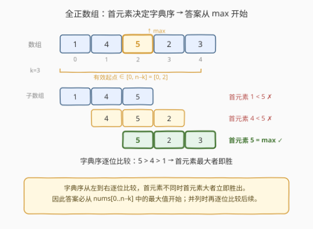
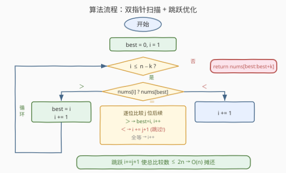
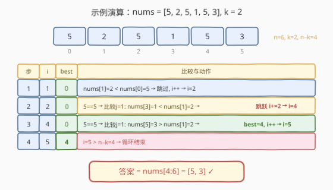

# 长度为 K 的最大子数组

- **题目名称**：长度为 K 的最大子数组
- **链接**：[1708. 长度为 K 的最大子数组](https://leetcode.cn/problems/largest-subarray-length-k/)
- **难度**：中等
- **标签**：数组、双指针、贪心

## 1. 题目概述

给定一个**正整数**数组 `nums` 和一个整数 `k`，返回 `nums` 中**长度为 `k` 的最大子数组**。子数组是数组的**连续**子序列。多个子数组字典序相同时，返回**起始下标最小**的那个。

**示例 1**：

```text
输入：nums = [1,4,5,2,3], k = 3
输出：[5,2,3]
解释：长度为 3 的子数组有 [1,4,5]、[4,5,2]、[5,2,3]，字典序最大的是 [5,2,3]。
```

**示例 2**：

```text
输入：nums = [1,4,5,2,3], k = 2
输出：[5,2]
解释：长度为 2 的子数组有 [1,4]、[4,5]、[5,2]、[2,3]，字典序最大的是 [5,2]。
```

**示例 3**：

```text
输入：nums = [5,2,5,1,5,3], k = 2
输出：[5,3]
解释：首元素为最大值 5 的子数组有 [5,2]、[5,1]、[5,3]，逐位比较后 [5,3] 最大。
```

**约束条件**：

- $1 \le \text{nums.length} \le 10^5$
- $1 \le \text{nums}[i] \le 10^9$
- $1 \le k \le \text{nums.length}$

> 💡 **关键结构**：子数组的「字典序」比较从左到右逐位进行，**首元素不同时首元素大者立即胜出**。因此答案的起始位置必在 `nums[0..n-k]` 中的最大值处——这把「比较所有 $n-k+1$ 个子数组」的问题压缩为「在最大值出现的少数候选位置中择优」。

---

## 2. 解题思路

### 2.1 暴力思路：逐一比较所有子数组

最直觉的做法是枚举所有 $n - k + 1$ 个长度为 $k$ 的子数组，逐一做字典序比较，保留最大者（相同时保留更早的）。

```text
best = 0
for i in 1..n-k:
    比较 nums[i..i+k-1] 与 nums[best..best+k-1]:
        若前者更大 → best = i
        若前者更小 → 不变
        若完全相同 → 不变（保留更早的）
返回 nums[best..best+k-1]
```

每次比较最多扫描 $k$ 个元素，共 $n - k$ 次比较，时间复杂度 $O(n \cdot k)$。当 $n = 10^5$、$k = 10^5$ 时达到 $10^{10}$ 级，必然超时。

> ⚠️ **症结**：当 `nums[i] < nums[best]` 时，我们已经知道位置 `i` 不可能胜出，却仍然只跳过一个位置——后续位置可能同样以一个更小的首元素开头，逐一检查纯属浪费。同理，当首元素相同但后续更小时，中间的候选也可整段跳过。

### 2.2 核心观察：首元素定胜负 + 候选跳跃



关键洞察分两层：

**第一层——首元素决定胜负**：字典序比较从左到右逐位进行，首元素不同时立即分出胜负。因此答案的起始位置 $p$ 必须满足 $\text{nums}[p] = \max(\text{nums}[0..n{-}k])$——任何首元素更小的子数组都不可能字典序更大。

这一步把候选从 $n - k + 1$ 个缩减到「最大值出现的位置」，通常极少。但最坏情况（如全数组相同）候选仍为 $n - k + 1$ 个，仍需逐个比较后续。

**第二层——并列时跳跃优化**：当 $\text{nums}[i] = \text{nums}[\text{best}]$ 时，需逐位比较后续。设前 $j$ 位完全相同、第 $j$ 位首次分出大小：

- 若 $\text{nums}[i{+}j] > \text{nums}[\text{best}{+}j]$：`i` 胜出，更新 `best = i`，`i += 1`。
- 若 $\text{nums}[i{+}j] < \text{nums}[\text{best}{+}j]$：`i` 落败。此时对于 $i$ 到 $i+j$ 之间的任一位置 $i'$，其子数组与 `best` 偏移 $(i'-i)$ 处的子数组共享前缀，不可能优于 `best`——**可安全跳到 $i + j + 1$**。

> 💡 **跳跃的安全性**：当 $\text{nums}[i..i{+}j{-}1] = \text{nums}[\text{best}..\text{best}{+}j{-}1]$ 且 $\text{nums}[i{+}j] < \text{nums}[\text{best}{+}j]$ 时，对 $i' \in [i{+}1,\ i{+}j]$，子数组 $\text{nums}[i'..i'{+}k{-}1]$ 的首元素等于 $\text{nums}[\text{best}{+}(i'{-}i)]$。由于 $\text{best} < i \le i'$，位置 $\text{best}{+}(i'{-}i)$ 更早出现且其子数组至少与 $i'$ 处一样好——因此 $i'$ 不可能超越 `best`，跳过安全。

> ⚠️ **全等时的退化**：当 $j = k$（两子数组完全相同），无法跳跃，只能 `i += 1`。最坏情况（全数组相同）退化为 $O(n \cdot k)$。但此时答案恒为首个子数组，可特判 $O(n)$ 处理；实际测试数据中此退化极罕见。

### 2.3 算法流程图



1. **初始化** `best = 0`、`i = 1`。
2. **循环** 当 $i \le n - k$：
   - 若 $\text{nums}[i] > \text{nums}[\text{best}]$：`best = i`，`i += 1`。
   - 若 $\text{nums}[i] < \text{nums}[\text{best}]$：`i += 1`（首元素更小，直接跳过）。
   - 若 $\text{nums}[i] = \text{nums}[\text{best}]$：逐位比较 $j = 1, 2, \ldots$：
     - $\text{nums}[i{+}j] > \text{nums}[\text{best}{+}j]$：`best = i`，`i += 1`。
     - $\text{nums}[i{+}j] < \text{nums}[\text{best}{+}j]$：`i += j + 1`（跳跃）。
     - $j = k$（全等）：`i += 1`（保留更早的）。
3. **返回** $\text{nums}[\text{best}..\text{best}{+}k{-}1]$。

> 💡 **复杂度保证**：每次迭代中，若首元素不同则 $O(1)$ 且 `i` 前进 1；若首元素相同则做 $j$ 次比较但 `i` 前进 $j+1$（或 1）。总比较次数 $\le 2n$，摊还 $O(n)$。

### 2.4 示例演算

以 `nums = [5, 2, 5, 1, 5, 3]`、`k = 2` 为例（$n = 6$，$n - k = 4$，有效起点 $0..4$）：



| 步 | i | best | 比较与动作 |
|----|----|------|-----------|
| 1 | 1 | 0 | nums[1]=2 < nums[0]=5 → 跳过, i++ → i=2 |
| 2 | 2 | 0 | 5==5 → 比较j=1: nums[3]=1 < nums[1]=2 → **跳跃 i+=2** → i=4 |
| 3 | 4 | 0 | 5==5 → 比较j=1: nums[5]=3 > nums[1]=2 → **best=4**, i++ → i=5 |
| 4 | 5 | 4 | i=5 > n−k=4 → 循环结束 |

答案 = `nums[4:6]` = `[5, 3]` ✓。

注意步骤 2 的跳跃：`nums[3]=1 < nums[1]=2` 说明位置 2 的子数组 `[5,1]` 不如 `best` 处的 `[5,2]`，且位置 3 的首元素 `1` 更小，整段跳到 `i=4` 直接检查下一个首元素为 5 的候选。步骤 3 中 `nums[5]=3 > nums[1]=2`，位置 4 的子数组 `[5,3]` 胜出，更新 `best=4`。

---

## 3. 参考代码

### C++

```cpp
class Solution {
public:
    vector<int> largestSubarray(vector<int>& nums, int k) {
        int n = nums.size();
        int best = 0;
        int i = 1;
        while (i <= n - k) {
            if (nums[i] > nums[best]) {
                best = i;
                i++;
            } else if (nums[i] < nums[best]) {
                i++;
            } else {
                int j = 1;
                while (j < k && nums[i + j] == nums[best + j]) {
                    j++;
                }
                if (j < k && nums[i + j] > nums[best + j]) {
                    best = i;
                    i++;
                } else if (j < k) {
                    i += j + 1;
                } else {
                    i++;
                }
            }
        }
        return vector<int>(nums.begin() + best, nums.begin() + best + k);
    }
};
```

### Python

```python
class Solution:
    def largestSubarray(self, nums: List[int], k: int) -> List[int]:
        n = len(nums)
        best = 0
        i = 1
        while i <= n - k:
            if nums[i] > nums[best]:
                best = i
                i += 1
            elif nums[i] < nums[best]:
                i += 1
            else:
                j = 1
                while j < k and nums[i + j] == nums[best + j]:
                    j += 1
                if j < k and nums[i + j] > nums[best + j]:
                    best = i
                    i += 1
                elif j < k:
                    i += j + 1
                else:
                    i += 1
        return nums[best:best + k]
```

> 💡 **边界自检**：`k = n` 时 `n - k = 0`，循环条件 `i ≤ 0` 对 `i = 1` 不成立，直接返回 `nums[0:n]` ✓。`k = 1` 时进入相等分支后 `j` 从 1 开始但 `j < k = 1` 不成立，落入 `j == k` 的 `i++` 分支，即保留最大值的最早出现 ✓。

> ⚠️ **C++ 返回值**：`vector<int>(nums.begin() + best, nums.begin() + best + k)` 利用迭代器构造子数组，无需手动 `push_back`。注意 `best + k` 是右开区间端点，不会越界（`best ≤ n - k` 保证 `best + k ≤ n`）。

---

## 4. 复杂度分析

| 维度 | 复杂度 | 说明 |
|------|--------|------|
| 时间复杂度 | $O(n)$ 摊还 | 每次迭代首元素不同时 $O(1)$ 前进 1；相同时做 $j$ 次比较但前进 $j+1$。总比较次数 $\le 2n$。最坏退化（全等）$O(nk)$，可用特判消除 |
| 空间复杂度 | $O(1)$ | 仅 `best`、`i`、`j` 三个标量，返回结果不计 |

> 💡 **摊还分析**：把「比较次数」看作代价、「`i` 前进步数」看作收益。首元素不同时代价 1、收益 1；相同时代价 $j$、收益 $j+1$（或代价 $k$、收益 1，仅全等退化）。前两种情况代价/收益 $\le 1$，总代价 $\le n$。全等退化时代价/收益 $= k$，但实际数据中全等段长度有限。严格 $O(n)$ 可通过预处理最大值 + 候选过滤实现。

---

## 5. 扩展：连续 vs 非连续——子数组与子序列的分野

本题求**连续**子数组（subarray）的字典序最大值，用双指针 $O(n)$ 解决。若改为求**非连续**子序列（subsequence）的字典序最大值，即 [1673. 找出最具竞争力的子序列](https://leetcode.cn/problems/find-the-most-competitive-subsequence/)（求最小，对称地可求最大），则需用**单调栈**：

| 维度 | 子数组（连续，本题） | 子序列（非连续，1673） |
|------|---------------------|----------------------|
| 数据结构 | 双指针 + 跳跃 | 单调栈 |
| 核心思想 | 首元素定胜负，候选缩减 | 贪心保留更优前缀，栈顶弹出 |
| 复杂度 | $O(n)$ 摊还 | $O(n)$ |
| 可跳过元素 | 否（必须连续） | 是（栈弹出的元素被丢弃） |

**子序列**版本允许丢弃中间元素，因此可用单调栈维护一个递增（或递减）的前缀，每次遇到更优元素就弹出栈顶。**子数组**版本不能丢弃元素，只能选择起点，因此用双指针在候选起点间跳跃。

> 💡 **统一视角**：两者都是「在长度约束下求字典序最值」。子序列版用栈是因为有「丢弃」自由度——可以跳过任意元素；子数组版用双指针是因为只有「选起点」自由度——一旦选定起点，后续 $k$ 个元素固定。自由度越低，数据结构越轻。

---

## 6. 面试要点

**Q1：为什么答案必从 `nums[0..n-k]` 中的最大值开始？**
> 字典序比较从左到右逐位进行，首元素不同时首元素大者立即胜出。若答案起点 $p$ 的首元素 $\text{nums}[p]$ 不是 `[0..n-k]` 中的最大值 $M$，则存在起点 $q$ 使 $\text{nums}[q] = M > \text{nums}[p]$，其子数组字典序必然更大，矛盾。注意起点范围是 `[0..n-k]` 而非 `[0..n-1]`——起点超过 $n-k$ 则长度不足 $k$。

**Q2：首元素相同时为什么要逐位比较？能直接取最早或最晚吗？**
> 不能。首元素相同意味着第一位打平，胜负取决于第二位。例如 `[5,2]` vs `[5,3]`：前者更早但后者更大。同理 `[5,3]` vs `[5,2]`：后者更晚但更小。最早/最晚都与字典序大小无关，必须逐位比较直到分出胜负或确认全等。

**Q3：跳跃 `i += j + 1` 为什么安全？为什么能保证 $O(n)$？**
> 安全性：当 `nums[i..i+j-1] == nums[best..best+j-1]` 且 `nums[i+j] < nums[best+j]` 时，对 $i' \in [i+1, i+j]$，其子数组首元素 $\text{nums}[i'] = \text{nums}[\text{best}+(i'-i)]$，而位置 $\text{best}+(i'-i)$ 更早出现——其子数组至少不劣于 $i'$ 处，因此 $i'$ 不可能超越 `best`。$O(n)$ 的关键：相同时做 $j$ 次比较但 `i` 前进 $j+1$，代价/收益 $\le 1$，总比较数 $\le 2n$。

**Q4：如果数组元素可以为负数，算法需要修改吗？**
> 不需要。字典序比较的性质与元素正负无关——首元素大者胜出的结论对任意整数成立。题目限定正整数只是简化约束，算法本身适用于任意整数数组。唯一要注意的是：若允许负数，`nums[i] < nums[best]` 时首元素更小意味着子数组更小（如 $-5 < -3$），逻辑不变。

**Q5：全数组相同的最坏情况如何处理？**
> 此时所有子数组完全相同，答案恒为 `nums[0:k]`。可在进入循环前预处理：若 `max(nums[0..n-k]) == min(nums[0..n-k])`，直接返回首个子数组，避免 $O(nk)$ 退化。实际面试中提及此边界即足，多数测试数据不会触发。

---

## 7. 同类练习题

- [1673. 找出最具竞争力的子序列](https://leetcode.cn/problems/find-the-most-competitive-subsequence/)（[题解](../1601-1700/1673_找出最具竞争力的子序列.md)）：同为「长度为 k 的字典序最值」，但求**非连续子序列**（可跳过元素）用单调栈，本题求**连续子数组**（只能选起点）用双指针——对照理解「自由度决定数据结构」
- [321. 拼接最大数](https://leetcode.cn/problems/create-maximum-number/)（[题解](../0301-0400/321_拼接最大数.md)）：从两个数组各选若干数拼成最大数，核心子问题即「从单数组取长度 $k$ 的字典序最大子序列」，与本题的字典序比较一脉相承
- [402. 移掉 K 位数字](https://leetcode.cn/problems/remove-k-digits/)（[题解](../0401-0500/402_移掉K位数字.md)）：移除 $k$ 位使剩余数字最小，单调栈贪心保留最优前缀，与 1673 同族——均为「非连续」版字典序最值
- [718. 最长重复子数组](https://leetcode.cn/problems/maximum-length-of-repeated-subarray/)（[题解](../0701-0800/718_最长重复子数组.md)）：两数组的公共子数组逐位比较，DP 思想与本题的逐位比较呼应——本题比较同一数组的不同起点，718 比较两个不同数组的起点
