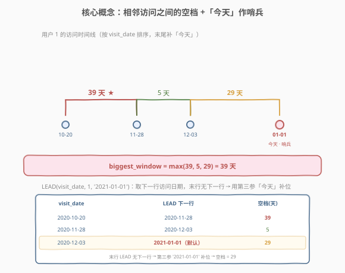
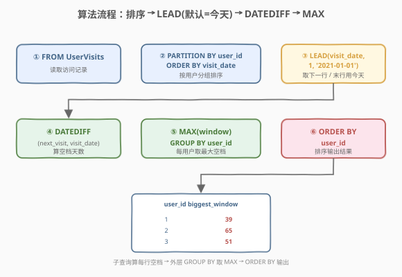
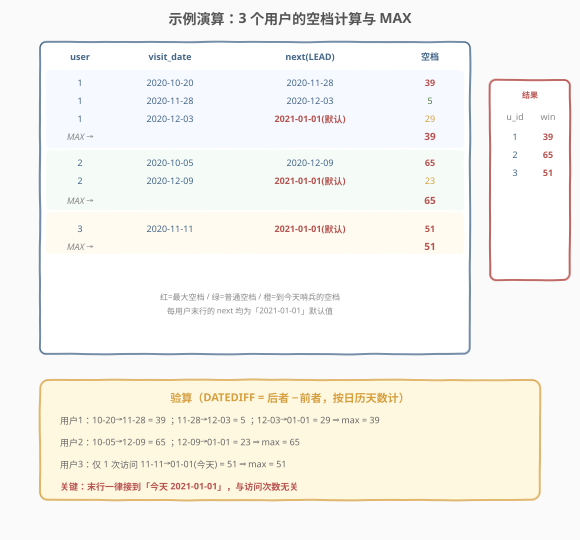

# LeetCode 访问日期之间最大的空档期 题解

- **备注**：本题为 LeetCode **Plus 会员专享题**（Database 分类）。题面与样例依据官方 schema 与样例测试用例整理。

## 1. 题目概述

- **标题 / 题号**：访问日期之间最大的空档期（#1709，medium）
- **链接**：https://leetcode.cn/problems/biggest-window-between-visits/
- **难度**：中等
- **标签**：数据库、SQL、窗口函数、`LEAD`、`DATEDIFF`、`GROUP BY`、`MAX`、哨兵默认值、`COALESCE`、相关子查询

**题意**：给定 `UserVisits` 表，记录用户到访某零售店的日期。编写 SQL 查询，为每个 `user_id` 计算**两次相邻访问之间最大的空档期**——即相邻两次访问日期之间相隔的天数。**最后一次访问**的「下一次访问」用**今天**（题目约定为 `2021-01-01`）作为哨兵。结果按 `user_id` 升序返回。

**表结构**：

```text
Table: UserVisits
+-------------+------+
| Column Name | Type |
+-------------+------+
| user_id     | int  |
| visit_date  | date |
+-------------+------+
该表记录用户访问某零售店的日期。
（user_id, visit_date）组合标识一次访问，同一用户同一天不会重复记录。
```

> 💡 **关键约定**：题目**显式假设「今天」= `2021-01-01`**。这个日期不是「当前系统日期」，而是题目固定的常量——它在查询里以字面量 `'2021-01-01'` 直接出现，是整个解法的「哨兵锚点」。

**示例 1**：

```text
输入：
UserVisits 表:
+---------+------------+
| user_id | visit_date |
+---------+------------+
| 1       | 2020-11-28 |
| 1       | 2020-10-20 |
| 1       | 2020-12-3  |
| 2       | 2020-10-5  |
| 2       | 2020-12-9  |
| 3       | 2020-11-11 |
+---------+------------+

输出:
+---------+---------------+
| user_id | biggest_window|
+---------+---------------+
| 1       | 39            |
| 2       | 65            |
| 3       | 51            |
+---------+---------------+
```

**解释**：

| user_id | 排序后访问 | 相邻空档（天） | 最大空档 |
|---------|-----------|----------------|----------|
| 1 | 10-20, 11-28, 12-03 | 10-20→11-28=39；11-28→12-03=5；12-03→**01-01(今天)**=29 | **39** |
| 2 | 10-05, 12-09 | 10-05→12-09=65；12-09→**01-01(今天)**=23 | **65** |
| 3 | 11-11 | 11-11→**01-01(今天)**=51 | **51** |

> 💡 **核心结构**：每位用户的**末次访问都要接到「今天」**，无论该用户访问了几次。因此「今天」不是只给「仅访问一次的用户」用的特例——它是**每个用户时间线的统一终点哨兵**。把今天视作追加在每条用户时间线末尾的一个虚拟访问点，问题就归约为「排序后的相邻日期差取 `MAX`」。

## 2. 解题思路

### 2.1 暴力思路：逐用户逐访问嵌套循环

最直觉的过程式思路：对每个用户，按日期升序取出其全部访问，再两两相邻作差，记录最大值；末次访问则与 `2021-01-01` 作差。伪代码：

```text
for each user_id:
    dates = sorted(visit_date of this user)
    append '2021-01-01' to dates        # 末尾补今天哨兵
    max_gap = 0
    for i in 0 .. len(dates)-2:
        max_gap = max(max_gap, days_diff(dates[i+1], dates[i]))
    emit (user_id, max_gap)
```

但**纯 SQL 没有显式的逐行循环与变量赋值**——「按用户分组、组内排序、取下一行、作差、取最大」这套相邻行操作，正是**窗口函数**的招牌场景。其中「取下一行」对应 `LEAD`，「组内排序」对应 `PARTITION BY ... ORDER BY`，而「末行无下一行」恰好由 `LEAD` 的第三参数（默认值）天然补位。

### 2.2 核心观察：LEAD 窗口函数 +「今天」作默认哨兵



**问题拆解为三个子问题**：

1. **组内排序取下一行**：`LEAD(visit_date) OVER (PARTITION BY user_id ORDER BY visit_date)`。`PARTITION BY user_id` 把每个用户的访问独立成一组；`ORDER BY visit_date` 让组内按日期升序排列；`LEAD` 偏移 1 即取「紧接其后的下一次访问日期」。这是窗口函数「跨行引用」的最典型用法——把过程式语言里的「`dates[i+1]`」翻译成 SQL 的 `LEAD`。

2. **末行用今天补位**：`LEAD(visit_date, 1, '2021-01-01')`。`LEAD` 的第三参数是**默认值**——当偏移超出当前分组的边界（即某用户的最后一条访问无「下一行」）时，返回该默认值而非 `NULL`。把 `'2021-01-01'`（今天）填作默认值，**正好实现「末次访问接到今天」的哨兵语义**，无需额外 `UNION` 或 `COALESCE`。

3. **作差后取每用户最大**：`DATEDIFF(next_visit, visit_date)` 算出每行空档天数，外层 `GROUP BY user_id` + `MAX(window)` 取每位用户的最大空档。

> ⚠️ **「今天」是每个用户末行的哨兵，不是单访问用户的特例**：常见误解是「只有访问一次的用户才用今天」。题面原文「each visit and the one right after it **(or today if you are considering the last visit)**」明确——**任何用户的最后一次访问**都要与今天作差。这意味着用户 1 的最大空档是 `max(39, 5, 29) = 39`，而非 `max(39, 5) = 39`（恰好相同，但语义不同）；用户 2 是 `max(65, 23) = 65`。若漏掉末行接今天，访问过两次以上的用户可能漏算（例如某用户两次访问很近、但末次到今天很远时就会出错）。

> 💡 **`LEAD` 三参数语义**：`LEAD(expr, offset, default)`——`expr` 是要取的列，`offset` 默认 1（下一行），`default` 是越界时的返回值（默认 `NULL`）。本题把 `default` 设为 `'2021-01-01'`，让哨兵逻辑**内嵌进窗口函数**，写法最简。若不用第三参数，末行会得到 `NULL`，需在外层 `COALESCE` 兜底或用 `UNION ALL` 显式追加哨兵行（见解法 B/C）。

### 2.3 算法流程图



**逻辑执行步骤**：

| 步骤 | 子句 / 函数 | 作用 |
|------|-------------|------|
| ① | `FROM UserVisits` | 读取全部访问记录 |
| ② | `PARTITION BY user_id ORDER BY visit_date` | 按用户分组、组内按日期升序 |
| ③ | `LEAD(visit_date, 1, '2021-01-01')` | 取下一行访问日期；末行越界返回今天 |
| ④ | `DATEDIFF(next, visit_date)` | 相邻日期作差得空档天数 |
| ⑤ | `MAX(window) ... GROUP BY user_id` | 每位用户取最大空档 |
| ⑥ | `ORDER BY user_id` | 按 `user_id` 升序输出 |

> 💡 **窗口函数 vs 聚合函数的执行位置**：`LEAD` 是**窗口函数**，在 `GROUP BY` **之前**对原始行逐行计算（每行仍保留，多出 `next_visit` 一列）；`MAX` 是**聚合函数**，在 `GROUP BY` 之后把每用户的若干行折叠成一行。故解法 A 采用「子查询里用 `LEAD` 逐行算 `window`，外层 `GROUP BY` 取 `MAX`」的两层结构——内层窗口、外层聚合，各司其职。若把 `LEAD` 与 `GROUP BY` 写在同一层，`LEAD` 会在聚合后的行上运算，语义全错。

### 2.4 示例演算

以示例 1 的 3 个用户、6 条访问为例，观察「排序 → `LEAD`（末行补今天）→ `DATEDIFF` → 每用户 `MAX`」的逐步过程：



**用户 1**（3 次访问，排序后 10-20、11-28、12-03）：

| visit_date | LEAD 下一行 | 空档（天） | 说明 |
|------------|-------------|-----------|------|
| 2020-10-20 | 2020-11-28 | **39** | 普通相邻，最大空档候选 |
| 2020-11-28 | 2020-12-03 | 5 | 普通相邻 |
| 2020-12-03 | 2021-01-01（默认） | 29 | 末行，`LEAD` 越界 → 今天补位 |

`MAX(39, 5, 29) = 39` ✓

**用户 2**（2 次访问，排序后 10-05、12-09）：

| visit_date | LEAD 下一行 | 空档（天） | 说明 |
|------------|-------------|-----------|------|
| 2020-10-05 | 2020-12-09 | **65** | 普通相邻，最大 |
| 2020-12-09 | 2021-01-01（默认） | 23 | 末行接今天 |

`MAX(65, 23) = 65` ✓

**用户 3**（1 次访问 11-11）：

| visit_date | LEAD 下一行 | 空档（天） | 说明 |
|------------|-------------|-----------|------|
| 2020-11-11 | 2021-01-01（默认） | **51** | 唯一行即末行，直接接今天 |

`MAX(51) = 51` ✓

> 💡 **用户 3 揭示哨兵的关键作用**：只有一次访问的用户，其唯一的「相邻空档」就是「访问日 → 今天」。`LEAD` 在该行即越界，返回默认值 `2021-01-01`，作差得 51。若没有哨兵机制，这类用户会因 `LEAD` 返回 `NULL` 而 `DATEDIFF` 得 `NULL`，被 `MAX` 忽略——最终整个用户从结果中丢失。哨兵默认值同时解决了「末行」与「单访问用户」两种情形。

## 3. 参考代码

### SQL（解法 A：`LEAD` + 默认值，推荐）

```sql
SELECT user_id,
       MAX(window) AS biggest_window
FROM (
    SELECT user_id,
           DATEDIFF(
               LEAD(visit_date, 1, '2021-01-01') OVER (PARTITION BY user_id ORDER BY visit_date),
               visit_date
           ) AS window
    FROM UserVisits
) t
GROUP BY user_id
ORDER BY user_id;
```

> 💡 **写法要点**：
> - **`LEAD(visit_date, 1, '2021-01-01')`**：第三参数把「今天」内嵌为末行哨兵——`LEAD` 越界时返回 `'2021-01-01'` 而非 `NULL`，无需外层 `COALESCE`。这是最简洁的写法。
> - **`PARTITION BY user_id ORDER BY visit_date`**：组内排序是 `LEAD` 正确取「下一次访问」的前提；若漏掉 `ORDER BY`，`LEAD` 取的是物理存储上的下一行（无序），结果错误。
> - **`DATEDIFF(next, visit_date)`**：`DATEDIFF(a, b)` 返回 `a − b` 的天数（前者减后者），故写 `DATEDIFF(next_visit, visit_date)` 得正数空档。
> - **子查询 + 外层 `GROUP BY`**：内层逐行算 `window`（窗口函数不折叠行），外层按用户 `MAX` 聚合。两层职责分明，不可合并。
> - ✓ **最推荐**：哨兵内嵌、无需 `UNION`/`COALESCE`、标准 SQL 窗口语义，MySQL 8.0+ 直接支持。

### SQL（解法 B：`UNION ALL` 显式哨兵行 + `LEAD`）

```sql
SELECT user_id,
       MAX(DATEDIFF(next_visit, visit_date)) AS biggest_window
FROM (
    SELECT user_id,
           visit_date,
           LEAD(visit_date) OVER (PARTITION BY user_id ORDER BY visit_date) AS next_visit
    FROM (
        SELECT user_id, visit_date FROM UserVisits
        UNION ALL
        SELECT DISTINCT user_id, CAST('2021-01-01' AS DATE) FROM UserVisits
    ) combined
) t
WHERE next_visit IS NOT NULL
GROUP BY user_id
ORDER BY user_id;
```

> 💡 **解法 B 的思路**：不依赖 `LEAD` 的第三参数，而是**主动给每位用户追加一行「今天」的虚拟访问**（`UNION ALL` + `DISTINCT user_id`），再对合并后的数据用无默认值的 `LEAD`。追加哨兵行后，每位用户的末次真实访问自然指向「今天」这一行；而哨兵行本身作为各组最后一行，其 `LEAD` 为 `NULL`，被 `WHERE next_visit IS NOT NULL` 过滤掉。
>
> **与解法 A 的关系**：两者等价——A 把哨兵塞进 `LEAD` 默认值（逻辑层），B 把哨兵塞进数据行（物理层）。B 更「显式」：能直观看到「今天」是如何进入每条用户时间线的；A 更「简洁」：一行 `LEAD` 三参数搞定。**优先选 A**，B 作为理解哨兵语义的对照。
>
> ⚠️ **`DISTINCT user_id` 不可省**：`UNION ALL` 直接 `SELECT user_id, '2021-01-01'` 会为每位用户的每条访问都追加一个哨兵行（一个用户被追加多次），导致 `LEAD` 在哨兵行之间再算出 0 天空档。必须 `DISTINCT` 保证每位用户只追加一个哨兵。

### SQL（解法 C：相关子查询 + `COALESCE`，MySQL 5.7 兼容）

```sql
SELECT user_id,
       MAX(DATEDIFF(next_date, visit_date)) AS biggest_window
FROM (
    SELECT v1.user_id,
           v1.visit_date,
           COALESCE(
               (SELECT MIN(v2.visit_date)
                FROM UserVisits v2
                WHERE v2.user_id = v1.user_id
                  AND v2.visit_date > v1.visit_date),
               CAST('2021-01-01' AS DATE)
           ) AS next_date
    FROM UserVisits v1
) t
GROUP BY user_id
ORDER BY user_id;
```

> 💡 **解法 C 的思路**：不使用窗口函数（兼容 MySQL 5.7 等不支持 `LEAD` 的环境）。对每条访问 `v1`，用**相关子查询**找出同用户中比它大的最小 `visit_date`（即「下一次访问」）；若不存在（即 `v1` 是末次访问），子查询返回 `NULL`，`COALESCE` 兜底为今天。
>
> **复杂度代价**：相关子查询对每行访问执行一次，最坏 $O(n^2)$；若在 `(user_id, visit_date)` 上建复合索引，子查询可走索引范围扫描降到 $O(n \log n)$。性能不如解法 A 的窗口函数（一次排序 $O(n \log n)$），但兼容性好。
>
> **三法对比**：A（`LEAD` 默认值）最简洁、性能最优，需 MySQL 8.0+；B（`UNION ALL` 哨兵）显式直观、同样需窗口函数；C（相关子查询）兼容 5.7、但 $O(n^2)$ 需索引兜底。**生产优先 A**。

### Python（pandas）

```python
import pandas as pd

def biggest_window_between_visits(user_visits: pd.DataFrame) -> pd.DataFrame:
    today = pd.Timestamp('2021-01-01')
    df = user_visits.copy()
    df['visit_date'] = pd.to_datetime(df['visit_date'])
    df = df.sort_values(['user_id', 'visit_date'])
    df['next_visit'] = df.groupby('user_id')['visit_date'].shift(-1)
    df['next_visit'] = df['next_visit'].fillna(today)
    df['window'] = (df['next_visit'] - df['visit_date']).dt.days
    result = (
        df.groupby('user_id', as_index=False)['window']
        .max()
        .rename(columns={'window': 'biggest_window'})
    )
    return result
```

> 💡 **pandas 对照**：
> - `groupby('user_id')['visit_date'].shift(-1)` 对应 `LEAD`——组内向后偏移 1 行取下一次访问；每组末行得到 `NaT`（pandas 的日期型 `NULL`）。
> - `.fillna(today)` 对应 `LEAD` 第三参数的默认值——把末行的 `NaT` 替换为今天，实现哨兵补位。
> - `(next - cur).dt.days` 对应 `DATEDIFF`——`Timedelta` 取 `.dt.days` 得整数天数。
> - `groupby('user_id').max()` 对应外层 `GROUP BY` + `MAX`；`groupby` 默认按键排序，天然满足 `ORDER BY user_id`。
> - **pandas 等价于解法 A**：`shift(-1)` 即 `LEAD`，`fillna(today)` 即第三参默认值，一一对应。

## 4. 复杂度分析

| 维度 | 解法 A（`LEAD` 默认值） | 解法 B（`UNION ALL` 哨兵） | 解法 C（相关子查询） | pandas |
|------|------------------------|----------------------------|----------------------|--------|
| **时间** | $O(n \log n)$ | $O(n \log n)$ | $O(n^2)$（无索引）/ $O(n \log n)$（有索引） | $O(n \log n)$ |
| **空间** | $O(n)$ | $O(n)$ | $O(n)$ | $O(n)$ |
| **MySQL 版本** | ≥ 8.0（窗口函数） | ≥ 8.0（窗口函数） | ≥ 5.7（无窗口函数） | — |
| **推荐度** | ✓ **首选** | ✓ 语义对照 | ✓ 兼容旧版 | ✓ 验证用 |

> - $n$ = `UserVisits` 表总行数。
> - **时间**：解法 A/B 的核心是窗口函数，需按 `(user_id, visit_date)` 排序，$O(n \log n)$；排序后 `LEAD`/`DATEDIFF`/`MAX` 均为 $O(n)$ 线性扫描。解法 C 的相关子查询对每行执行一次范围查询，无索引时 $O(n^2)$；在 `(user_id, visit_date)` 复合索引上可降至 $O(n \log n)$（每次子查询走索引最小值）。
> - **空间**：窗口函数需物化排序后的中间表 $O(n)$；解法 B 额外追加 $u$ 个哨兵行（$u$ 为用户数），仍为 $O(n)$。
> - **索引优化**：建复合索引 `(user_id, visit_date)` 可加速解法 C 的子查询，也利于解法 A/B 的排序（索引本身有序，可免排序代价）。

## 5. 扩展：窗口函数相邻行模型与哨兵默认值

本题是 SQL「**相邻行差值**」模式的招牌题——按某键分组、组内排序、引用下一行、作差聚合。这套操作有几种等价实现，辨析如下。

### 5.1 `LEAD` 三参数与 `LAG` 对照

| 函数 | 语义 | 第三参数（默认值） |
|------|------|--------------------|
| `LEAD(expr, offset, default)` | 取**当前行之后**第 `offset` 行的 `expr` | 越界（末行向后）时返回 `default`，缺省 `NULL` |
| `LAG(expr, offset, default)` | 取**当前行之前**第 `offset` 行的 `expr` | 越界（首行向前）时返回 `default`，缺省 `NULL` |

> 💡 **本题为何用 `LEAD` 而非 `LAG`**：题目要算「当前访问 → 下一次访问」的空档，方向向后，故用 `LEAD` 取下一行。哨兵在时间线**末尾**（今天），恰好落在 `LEAD` 的越界边界——用 `LEAD` 第三参数补位最自然。若改用 `LAG`（取上一行），哨兵应在**首行**（如「注册日」之类的时间线起点），方向相反。**哨兵在末尾用 `LEAD`，哨兵在开头用 `LAG`**。

### 5.2 哨兵的三种实现方式

「末行接到一个固定值」的哨兵语义有三种等价实现：

| 方式 | 写法 | 层次 | 优劣 |
|------|------|------|------|
| **A. `LEAD` 默认值** | `LEAD(visit_date, 1, '2021-01-01')` | 逻辑层（函数参数） | ✓ 最简洁，一行搞定 |
| **B. `UNION ALL` 哨兵行** | 先 `UNION ALL` 追加今天行，再 `LEAD` | 物理层（数据行） | ✓ 最直观，可看到哨兵入表 |
| **C. `COALESCE` 兜底** | `COALESCE(LEAD(visit_date), today)` 或相关子查询 | 表达式层（函数组合） | ✓ 兼容性好，适合无第三参数的环境 |

> 💡 **三法等价但适用场景不同**：A 依赖 `LEAD` 第三参数（MySQL 8.0+、PostgreSQL、SQL Server 均支持）；B 任何支持窗口函数的环境都行；C 连窗口函数都不需要（`COALESCE` + 相关子查询），兼容 MySQL 5.7。**优先 A，兼容用 C**。

### 5.3 `DATEDIFF` 的方向性与日期运算

`DATEDIFF(a, b)` 在 MySQL 中返回 `a − b` 的天数（**前者减后者**），与参数顺序严格相关：

| 表达式 | 结果 | 含义 |
|--------|------|------|
| `DATEDIFF('2021-01-01', '2020-12-03')` | `29` | 今天在 12-03 之后 29 天 ✓ |
| `DATEDIFF('2020-12-03', '2021-01-01')` | `-29` | 12-03 在今天之前 29 天 ✗（负数） |

> ⚠️ 本题要的是「下一次访问 − 当前访问」的正数空档，故写 `DATEDIFF(next_visit, visit_date)`——**被减数在前**。若写反，得到负数，`MAX` 会取到错误的负值或 0。PostgreSQL/SQL Server 的 `DATEDIFF` 参数顺序与单位约定不同（如 PG 用 `date_part` 或 `-` 直接相减返回 `interval`），跨方言时需留意。

### 5.4 与「连续性判定」问题的对照

同样是「排序后引用相邻行」，本题算**相邻差的最大值**，另有一类问题判定**相邻是否连续**（差为 1）：

- [180. 连续出现的数字](https://leetcode.cn/problems/consecutive-numbers/)（[题解](../0101-0200/180_连续出现的数字.md)）：用 `LAG`/`LEAD` 取相邻行，判定「连续三行相同」——同样是窗口函数相邻行模型，但目标是**判定相等/连续**而非算差值。
- [197. 上升的温度](https://leetcode.cn/problems/rising-temperature/)（[题解](../0101-0200/197_上升的温度.md)）：`DATEDIFF` + 自连接/`LAG` 判定「比昨天温度高」——`DATEDIFF` 跨行比较的鼻祖题，本题在其基础上多了「分组 + 取最大」。

> 💡 **一句话归类**：本题属「**分组排序 → 相邻行差 → 聚合最值**」三段式，是 `LEAD` + `DATEDIFF` + `MAX` 的组合技；180/197 是同模型的「判定」变体，1164 是同模型的「点时查询 + 默认值」变体。

## 6. 面试要点

**Q1：为什么用 `LEAD` 的第三参数而非 `COALESCE` 兜底？**
> `LEAD(visit_date, 1, '2021-01-01')` 把哨兵内嵌进窗口函数——末行越界时直接返回今天，一行表达完整语义。`COALESCE(LEAD(visit_date), today)` 是等价的「外层兜底」写法，但需多一层函数嵌套。两者结果相同，优先用第三参数更简洁。若环境不支持第三参数（极少见），退回 `COALESCE`。

**Q2：「今天」是给所有用户的末行，还是只给单访问用户？**
> **所有用户的末行**。题面「each visit and the one right after it (or today if you are considering the last visit)」明确——任何用户的**最后一次访问**都要与今天作差。常见误解是「只有访问一次的用户才用今天」，这会导致访问多次的用户漏算末段空档（例如某用户两次访问很近、但末次到今天很远时，最大空档其实在末段）。把今天视作每位用户时间线的统一终点哨兵，逻辑才完整。

**Q3：为什么需要子查询，不能把 `LEAD` 和 `GROUP BY` 写在一层？**
> `LEAD` 是窗口函数，对**未聚合的行**逐行运算（保留行数）；`MAX` 是聚合函数，在 `GROUP BY` 后**折叠行**。若同层写 `LEAD(...) ... GROUP BY user_id`，`LEAD` 会在聚合后的行（每用户一行）上运算，已无「下一行」可言，语义全错。必须「子查询里 `LEAD` 逐行算 `window`，外层 `GROUP BY` 取 `MAX`」两层分离——内层窗口、外层聚合。

**Q4：`DATEDIFF` 的参数顺序有何陷阱？**
> MySQL 的 `DATEDIFF(a, b)` 返回 `a − b`（前者减后者）。本题要正数空档「下一次 − 当前」，故写 `DATEDIFF(next_visit, visit_date)`，被减数在前。写反得负数，`MAX` 会取到错误值。跨方言时更要小心：PostgreSQL 用 `date1 - date2` 返回 `interval`，SQL Server 的 `DATEDIFF(unit, start, end)` 单位在前、参数顺序相反。

**Q5：解法 C 的相关子查询为何可能 $O(n^2)$？如何优化？**
> 相关子查询对每行访问执行一次 `SELECT MIN(visit_date) WHERE user_id = v1.user_id AND visit_date > v1.visit_date`——无索引时每次全表扫描，总计 $O(n^2)$。在 `(user_id, visit_date)` 上建复合索引后，子查询走索引范围扫描取首个大于值，每次 $O(\log n)$，总计 $O(n \log n)$，与窗口函数解法持平。故解法 C 在有索引时可用，无索引时仅适合小数据量。

> 💡 **一句话总结**：1709 是 SQL「**分组相邻行差 + 末行哨兵**」招牌题——核心模板「`LEAD(visit_date, 1, '2021-01-01') OVER (PARTITION BY user_id ORDER BY visit_date)` → `DATEDIFF` → `MAX ... GROUP BY`」。最大要点：**今天作哨兵是给每位用户的末行（非单访问特例）**；哨兵用 `LEAD` 第三参数内嵌最简；窗口函数在子查询、聚合在外层，两层分离不可混。

## 同类练习题

| # | 题目 | 与本题的关联 |
|---|------|-------------|
| 197 | [上升的温度](https://leetcode.cn/problems/rising-temperature/)（[题解](../0101-0200/197_上升的温度.md)） | `DATEDIFF` + 自连接/`LAG` 判定「比昨天温度高」——`DATEDIFF` 跨行比较的鼻祖题，本题在其基础上多了「分组 + 取最大空档」 |
| 180 | [连续出现的数字](https://leetcode.cn/problems/consecutive-numbers/)（[题解](../0101-0200/180_连续出现的数字.md)） | `LAG`/`LEAD` 取相邻行判定「连续三行相同」——同属窗口函数相邻行模型，目标是判定连续性而非算差值，对照体会 `LEAD` 的两种用途 |
| 1164 | [指定日期的产品价格](https://leetcode.cn/problems/product-price-at-a-given-date/)（[题解](../1101-1200/1164_指定日期的产品价格.md)） | `LAG` + `IFNULL` 默认值 10 做「点时查询」——同样是「窗口函数 + 默认值补位」的哨兵思想，但哨兵在首行（首次改价前价格=10）而非末行，对照 `LAG` vs `LEAD` 的哨兵方向 |
| 603 | [连续空余座位](https://leetcode.cn/problems/consecutive-available-seats/)（[题解](../0601-0700/603_连续空余座位.md)） | 自连接/`LEAD` 判定「相邻座位都空闲」——相邻行比较的另一变体，巩固「排序后引用下一行」的通用骨架 |
| 550 | [游戏玩法分析 IV](https://leetcode.cn/problems/game-play-analysis-iv/)（[题解](../0501-0600/550_游戏玩法分析IV.md)） | 首次登录日 + `DATEDIFF` 统计次日回访比例——`DATEDIFF` 用于「日期差条件过滤」，与本题「日期差取最值」对照，体会 `DATEDIFF` 在聚合与过滤中的不同角色 |
