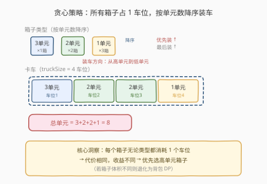
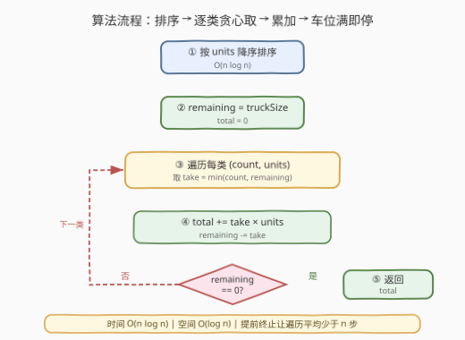
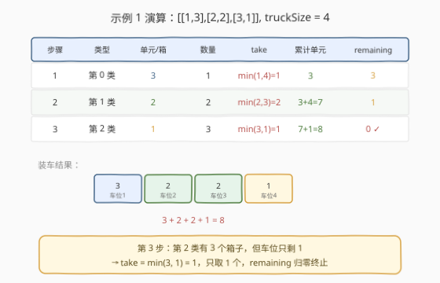

# LeetCode 卡车上的最大单元数 题解

## 1. 题目概述

- **标题 / 题号**：卡车上的最大单元数（#1710，easy）
- **链接**：https://leetcode.cn/problems/maximum-units-on-a-truck/
- **难度**：简单
- **标签**：贪心、排序、数组

**题意**：将一些箱子装上**一辆卡车**。给定二维数组 `boxTypes`，其中 `boxTypes[i] = [numberOfBoxes_i, numberOfUnitsPerBox_i]`：

- `numberOfBoxes_i`：第 $i$ 类箱子的**数量**；
- `numberOfUnitsPerBox_i`：第 $i$ 类箱子**每个**箱子可装载的**单元数量**。

整数 `truckSize` 表示卡车上可装载的**箱子最大数量**（注意是箱子数，不是单元数）。只要箱子总数不超过 `truckSize`，可以选择任意箱子装车。返回卡车可装载**单元**的**最大**总数。

**示例 1**：

```text
输入：boxTypes = [[1,3],[2,2],[3,1]], truckSize = 4
输出：8
解释：
  1 个第一类箱子，每个含 3 单元；
  2 个第二类箱子，每个含 2 单元；
  3 个第三类箱子，每个含 1 单元。
  选第一类全部(1)、第二类全部(2)、第三类取 1 个 → 单元 = 1×3 + 2×2 + 1×1 = 8
```

**示例 2**：

```text
输入：boxTypes = [[5,10],[2,5],[4,7],[3,9]], truckSize = 10
输出：91
解释：
  按单位数降序：[10]×5, [9]×3, [7]×4, [5]×2
  取 5 个(10) → 50；取 3 个(9) → 27；取 2 个(7) → 14；合计 91，箱子数 5+3+2=10
```

**约束**：

- $1 \le \text{boxTypes.length} \le 1000$
- $1 \le \text{numberOfBoxes}_i,\ \text{numberOfUnitsPerBox}_i \le 1000$
- $1 \le \text{truckSize} \le 10^6$

> 💡 **关键结构**：卡车的容量单位是**箱子数**而非单元数，且**每个箱子无论类型都占用 1 个车位**。这意味着「装一个高单元箱子」与「装一个低单元箱子」的**代价相同**（都消耗 1 个车位），但**收益不同**。代价相同的前提下最大化收益——这正是贪心可解的典型信号。

## 2. 解题思路

### 2.1 暴力思路：枚举所有选取方案

最直觉的暴力做法是把问题当作「在 $n$ 类箱子中选若干个装入容量为 `truckSize` 的卡车」，用回溯枚举每一类箱子**取多少个**：

```text
dfs(i, remaining):
    if i == n or remaining == 0:
        return 0
    best = 0
    for k in 0..min(count_i, remaining):      # 第 i 类取 k 个
        best = max(best, k * units_i + dfs(i+1, remaining - k))
    return best
```

每类箱子有 $\min(\text{count}_i,\ \text{truckSize}) + 1$ 种取法，最坏情况下分支数巨大，复杂度为指数级。本题 $n \le 1000$、$\text{truckSize} \le 10^6$，回溯完全不可行。

> ⚠️ **症结**：暴力枚举把「每类取几个」当作自由维度去搜索，但题目中**所有箱子的车位代价相同**——这意味着不同类型的箱子之间**不存在资源竞争的权衡**，只有「单位收益高低」的差别。自由度其实是假的，搜索空间可以大幅压缩。

### 2.2 核心观察：贪心——按单位数降序装车



关键洞察：由于**每个箱子无论类型都消耗恰好 1 个卡车车位**，装一个高单元箱子与装一个低单元箱子的**代价相同**、**收益不同**。因此最优策略直截了当——**优先装单位数最高的箱子**，装完一类再装下一类，直到车位用完。

具体步骤：

1. 将 `boxTypes` 按 `numberOfUnitsPerBox` **降序排序**；
2. 从单位数最高的类开始，**尽可能多取**：取 $\min(\text{count}_i,\ \text{remaining})$ 个箱子；
3. 累加单元数，扣减剩余车位；
4. 车位归零即停。

**正确性（交换论证）**：设某最优解中装了一个单位数为 $u_{\text{low}}$ 的箱子，但存在一个单位数 $u_{\text{high}} > u_{\text{low}}$ 的箱子**未被装入**。将低单位箱子换成那个高单位箱子，车位消耗不变（都是 1），单元总数增加 $u_{\text{high}} - u_{\text{low}} > 0$，与「最优解」矛盾。故最优解中**不存在「能装高单位却装了低单位」的情形**——即贪心选择是最优的。

> 💡 **贪心可行性的根源**：本题的贪心之所以成立，核心在于**代价均匀**——所有箱子的车位消耗相同。一旦代价不均匀（如不同类型箱子体积不同、卡车有体积限制），问题就升级为「多尺寸背包」，贪心不再保证最优，需用 DP。代价均匀是贪心生效的充分条件。

### 2.3 算法流程图



1. **排序**：`boxTypes` 按 `numberOfUnitsPerBox` 降序排列。
2. **初始化**：`remaining = truckSize`、`total_units = 0`。
3. **遍历** 每类箱子 `(count, units)`：
   - `take = min(count, remaining)`——能装多少装多少；
   - `total_units += take * units`；
   - `remaining -= take`；
   - 若 `remaining == 0`：**提前终止**。
4. **返回** `total_units`。

> 💡 **提前终止**：一旦车位装满即可 `break`，无需遍历剩余低单位类型。最坏情况（车位极大、每类都取不完）遍历全部 $n$ 类，复杂度仍是 $O(n \log n)$（排序主导）。

### 2.4 示例演算

以示例 1 `boxTypes = [[1,3],[2,2],[3,1]]`、`truckSize = 4` 为例：



| 步骤 | 类型 | 单元/箱 | 数量 | 取几箱 | remaining(前) | 累计单元 | remaining(后) |
|------|------|---------|------|--------|---------------|----------|---------------|
| 1 | 第 0 类 | 3 | 1 | min(1, 4) = **1** | 4 | 1×3 = **3** | 3 |
| 2 | 第 1 类 | 2 | 2 | min(2, 3) = **2** | 3 | 3 + 2×2 = **7** | 1 |
| 3 | 第 2 类 | 1 | 3 | min(3, 1) = **1** | 1 | 7 + 1×1 = **8** | 0 |

`remaining` 归零，终止。结果 = **8** ✓。

注意第 3 步：第 2 类有 3 个箱子，但车位只剩 1，只能取 1 个。`min` 运算精确地截断了「想多取但车位不够」的情形。

## 3. 参考代码

### C++

```cpp
class Solution {
public:
    int maximumUnits(vector<vector<int>>& boxTypes, int truckSize) {
        sort(boxTypes.begin(), boxTypes.end(),
             [](const auto& a, const auto& b) {
                 return a[1] > b[1];
             });
        int remaining = truckSize, total = 0;
        for (const auto& b : boxTypes) {
            int take = min(b[0], remaining);
            total += take * b[1];
            remaining -= take;
            if (remaining == 0) break;
        }
        return total;
    }
};
```

### Python

```python
class Solution:
    def maximumUnits(self, boxTypes: List[List[int]], truckSize: int) -> int:
        boxTypes.sort(key=lambda x: x[1], reverse=True)
        remaining = truckSize
        total = 0
        for count, units in boxTypes:
            take = min(count, remaining)
            total += take * units
            remaining -= take
            if remaining == 0:
                break
        return total
```

> 💡 **排序方向**：按 `boxTypes[i][1]`（即 `numberOfUnitsPerBox`）降序，而非 `boxTypes[i][0]`（箱子数量）。常见错误是按数量排序——数量多不代表收益高，**单位收益才是决策依据**。
>
> ⚠️ **乘法溢出（C++）**：最坏情况 $\text{truckSize} = 10^6$、$\text{units} = 1000$，`total` 可达 $10^9$，恰好在 32 位 `int`（约 $2.1 \times 10^9$）范围内。但若题目放宽上界，应改用 `long long` 防溢出。Python 无此问题。

## 4. 复杂度分析

| 维度 | 复杂度 | 说明 |
|------|--------|------|
| 时间复杂度 | $O(n \log n)$ | 排序主导；遍历 $O(n)$，`min`/乘法/累加均为 $O(1)$；$n \le 1000$ 时约 $10^4$ 次运算 |
| 空间复杂度 | $O(\log n)$ | 原地排序的递归栈深度（C++ `sort` 为内省排序）；若语言不允许原地排序则 $O(n)$ |

> 💡 本题 $n \le 1000$，$O(n \log n)$ 极其宽裕。即使 $n$ 放大到 $10^6$，排序仍可接受。瓶颈永远在排序而非遍历——遍历阶段由于提前终止，实际常少于 $n$ 步。

## 5. 扩展：当代价不再均匀——退化为背包

本题贪心成立的前提是**每个箱子占用相同的车位**。若题目变形为「不同类型箱子体积不同、卡车有总体积限制」，则代价不再均匀，贪心（按单位体积价值排序）**不再保证最优**——这正是经典的 **0-1 背包 / 完全背包** 问题，需用 DP 求解。

| 变体 | 代价模型 | 最优策略 | 复杂度 |
|------|----------|----------|--------|
| 本题 | 每箱占 1 车位 | 贪心：按单元数降序 | $O(n \log n)$ |
| 体积不同 + 总体积限制 | 每箱体积 $v_i$ 不同 | 完全背包 DP | $O(n \cdot V)$ |
| 体积不同 + 数量有限 + 总体积限制 | 每箱体积 $v_i$、数量 $c_i$ | 多重背包 DP | $O(n \cdot V)$ |

> 💡 **贪心与背包的分界**：当物品可按「单位价值」线性比较且代价均匀时，贪心最优；一旦代价维度不均匀（体积、重量各异），需用 DP 枚举「装哪些、装几个」的组合。[322. 零钱兑换](../0301-0400/322_零钱兑换.md)（完全背包）与 [416. 分割等和子集](../0401-0500/416_分割等和子集.md)（0-1 背包）正是这一思路的代表。

## 6. 面试要点

**Q1：为什么贪心是正确的？如何证明？**
> 用**交换论证**：假设最优解中装了一个低单位箱子 $u_{\text{low}}$，但存在一个未装入的高单位箱子 $u_{\text{high}} > u_{\text{low}}$。由于两者占用车位相同（都是 1），将低换高后总单元严格增加，矛盾。故最优解中不存在「舍高取低」的情形，贪心按降序取即最优。

**Q2：贪心成立的根本前提是什么？**
> **代价均匀**——所有箱子占用相同的车位数（1）。这使得不同类型箱子之间不存在「资源竞争的权衡」，只有收益高低的比较。一旦代价不均匀（如箱子体积不同），贪心失效，需升级为背包 DP。

**Q3：为什么要提前终止（`remaining == 0` 时 `break`）？**
> 车位装满后，剩余类型无论单位多高都无法再装。继续遍历只会做无意义的 `min(0, count)` 与加法。提前终止让遍历阶段平均少于 $n$ 步，虽不改变最坏复杂度（排序仍是 $O(n \log n)$），但常数更优。

**Q4：排序的键是 `numberOfBoxes` 还是 `numberOfUnitsPerBox`？常见错误是什么？**
> 排序键是 `numberOfUnitsPerBox`（每个箱子的单元数），**降序**。常见错误：①按 `numberOfBoxes`（箱子数量）排序——数量多不代表收益高；②升序排序——会优先装低单位箱子，与最大化目标相反。

**Q5：如果 `truckSize` 极大（$10^9$）而箱子总数很少，算法还高效吗？**
> 是。遍历阶段对每类箱子只做 $O(1)$ 的 `min` 与乘法，$n \le 1000$ 时至多 1000 步。`truckSize` 的大小不影响遍历步数（不像逐箱模拟那样按 `truckSize` 线性走），只影响 `total` 的数值范围。复杂度始终由排序的 $O(n \log n)$ 主导。

## 同类练习题

| # | 题目 | 与本题的关联 |
|---|------|-------------|
| 455 | [分发饼干](https://leetcode.cn/problems/assign-cookies/) | 同为「排序 + 贪心填充」——将孩子胃口与饼干尺寸排序后双指针贪心分配，与本题「按价值降序装车」的贪心骨架一致，对照体会代价均匀时的贪心范式 |
| 435 | [无重叠区间](https://leetcode.cn/problems/non-overlapping-intervals/)（[题解](../0401-0500/435_无重叠区间.md)） | 排序后贪心区间调度——按右端点排序保留最早结束的区间，与本题「排序后逐类贪心取」同属「排序改变决策顺序」的贪心家族 |
| 502 | [IPO](https://leetcode.cn/problems/ipo/)（[题解](../0501-0600/502_IPO.md)） | 排序解锁 + 堆贪心——按资本排序逐步解锁可用项目，再用堆取最大利润，是本题「排序 + 贪心取最大」的进阶版（增加动态解锁维度） |
| 881 | [救生艇](https://leetcode.cn/problems/boats-to-save-people/) | 排序 + 双指针贪心—— people 排序后用最轻+最重配对，贪心策略同样依赖排序建立决策顺序，对照「单指针贪心（本题）」与「双指针贪心（881）」的差异 |
| 322 | [零钱兑换](https://leetcode.cn/problems/coin-change/)（[题解](../0301-0400/322_零钱兑换.md)） | 当代价不再均匀时的 DP 对照——硬币面值不同（类比箱子体积不同），贪心失效需用完全背包，正是本题第 5 节「退化为背包」的实例 |
