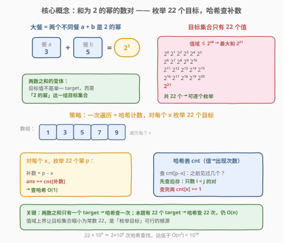
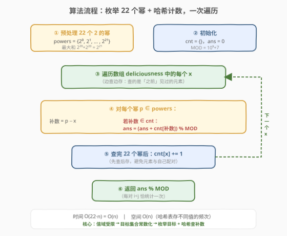

# 大餐计数

- **题目名称**：大餐计数
- **链接**：[1711. 大餐计数](https://leetcode.cn/problems/count-good-meals/)
- **难度**：中等
- **标签**：数组、哈希表

## 1. 题目概述

大餐是指**恰好包含两道不同餐食**的餐食组合，且这两道餐食的美味程度之和等于 **2 的幂**。给定一个整数数组 `deliciousness`，其中 `deliciousness[i]` 是第 `i` 道餐食的美味程度，返回可以组合成大餐的**不同餐食对的数量**。结果对 $10^9 + 7$ 取余。

注意：餐食对的下标 $(i, j)$ 满足 $i < j$，且**两道餐食不同**意味着 $i \neq j$（即使美味程度相同，下标不同也算两道不同餐食）。

**示例 1**：

```text
输入：deliciousness = [1,3,5,7,9]
输出：4
解释：4 对大餐为 (1,3)、(3,5)、(7,1)、(9,7)，和分别为 4、8、8、16，都是 2 的幂。
```

**示例 2**：

```text
输入：deliciousness = [1,1,1,3,3,3,7]
输出：15
解释：3 个 1 之间两两配对和为 2 的有 C(3,2)=3 对；
      3 个 1 与 3 个 3 配对和为 4 的有 3×3=9 对；
      3 个 1 与 1 个 7 配对和为 8 的有 3×1=3 对；共 15 对。
```

**约束条件**：

- $1 \le \text{deliciousness.length} \le 10^5$
- $0 \le \text{deliciousness[i]} \le 2^{20}$

> 💡 **关键约束**：美味程度上界是 $2^{20}$，故任意两数之和最大为 $2^{20} + 2^{20} = 2^{21}$。这意味着可作为「目标和」的 2 的幂只有 $2^0, 2^1, \dots, 2^{21}$ 共 **22 个**——这一极小的常数是本题能用哈希表 $O(n)$ 求解的根基。

---

## 2. 解题思路

### 2.1 暴力思路：两层循环枚举所有数对

最直观的做法是两层循环枚举所有 $(i, j)$（$i < j$），判断 `deliciousness[i] + deliciousness[j]` 是否为 2 的幂（用位运算 `sum > 0 and (sum & (sum - 1)) == 0` 判定）。

```text
for i in 0..n-1:
    for j in i+1..n-1:
        s = a[i] + a[j]
        if s > 0 and (s & (s-1)) == 0:
            ans += 1
```

时间复杂度 $O(n^2)$，对 $10^5$ 规模约 $5 \times 10^9$ 次操作，**超时**。问题在于：对每个元素配对时都重新做了一次线性扫描，且每次配对都要判断是否为 2 的幂。需要把「找另一半」从 $O(n)$ 降到 $O(1)$。

### 2.2 核心观察：枚举 22 个目标值，哈希查补数



本题是 [1. 两数之和](https://leetcode.cn/problems/two-sum/) 的**多目标变体**：两数之和的 target 是**单一值**，而本题 target 是「2 的幂」这一**集合**。关键洞察有两层：

1. **目标集合极小**。因美味程度 $\le 2^{20}$，两数和 $\le 2^{21}$，可作为 target 的 2 的幂只有 $\{2^0, 2^1, \dots, 2^{21}\}$ 共 **22 个**。既然目标只有 22 个，就可以**反过来枚举目标**，而不是枚举数对。

2. **哈希查补数 $O(1)$**。对每个元素 $x$ 和每个目标 $p$，所需的「另一半」$= p - x$ 是确定的。用哈希表 `cnt` 记录「已遍历元素值 → 出现次数」，查 `cnt[p - x]` 即知前面有多少个元素能与 $x$ 凑成和 $p$，$O(1)$ 完成。

于是算法为：遍历数组，对每个 $x$ 枚举 22 个幂 $p$，把 `cnt[p - x]` 累加进答案，**随后**才把 $x$ 存入 `cnt`。

> 💡 **为什么「枚举目标」比「枚举数对」高效？** 暴力枚举数对是 $O(n^2)$，因为数对空间是 $n^2$；而目标空间只有 22，枚举目标是 $O(22n) = O(n)$。本质是用「目标值域受限」换取「枚举维度从 $n$ 降到 22」。这正是 [1. 两数之和](../0001-0100/1_两数之和.md) 哈希思路的推广：单 target 查一次补数，多 target 查 22 次。

> ⚠️ **「先查后存」的必要性**：必须先查 `cnt[p - x]` 再执行 `cnt[x] += 1`。当 $p - x = x$（如 $x = 1, p = 2$，即 $1 + 1 = 2$）时，若先存后查，会把自己刚存进去的计数也算上，导致**元素与自己配对**。先查后存保证查的时候 `cnt` 里只有当前元素**之前**的元素，天然满足 $i < j$ 且 $i \neq j$。这与两数之和中 `[3,3], target=6` 的处理一脉相承。

### 2.3 算法流程图



**步骤**：

1. **预处理**：生成 22 个 2 的幂 `powers = [1, 2, 4, ..., 2^21]`（$2^0$ 到 $2^{21}$）。注意 $2^0 = 1$ 是最小幂，$0 + 0 = 0$ 不是 2 的幂故不纳入。
2. **初始化**：空哈希表 `cnt`，`ans = 0`，`MOD = 10^9 + 7`。
3. **遍历**：对每个 $x \in \text{deliciousness}$：
   - 对每个 $p \in \text{powers}$：令 `comp = p - x`，若 `comp` 在 `cnt` 中，`ans = (ans + cnt[comp]) % MOD`。
   - 遍历完 22 个幂后，`cnt[x] += 1`（**先查后存**）。
4. **返回** `ans % MOD`。

> 💡 **每个数对 $(i, j)$（$i < j$）恰被统计一次**：当遍历到 $j$ 时，$i$ 已在 `cnt` 中；遍历到 $i$ 时 $j$ 还未入表。故累加方向单向、不重不漏。

### 2.4 示例演算

以 `deliciousness = [1,3,5,7,9]` 为例（幂集合取 $\{1,2,4,8,16,32,\dots\}$）：

![示例演算：[1,3,5,7,9] → 4](../images/1711_example_walkthrough.svg)

逐步追踪（下表只列出**命中**的幂，实际每步枚举全部 22 个幂查补数）：

| 步骤 | $x$ | 命中的幂 $p$ | 补数 $p - x$ | `cnt[补数]` | `ans` | 存入后 `cnt` |
|------|-----|------------|-------------|------------|-------|--------------|
| i=0 | 1 | —（无） | — | 0 | 0 | {1:1} |
| i=1 | 3 | $2^2=4$ | 1 | 1 | 1 | {1:1, 3:1} |
| i=2 | 5 | $2^3=8$ | 3 | 1 | 2 | {1:1, 3:1, 5:1} |
| i=3 | 7 | $2^3=8$ | 1 | 1 | 3 | {1:1, 3:1, 5:1, 7:1} |
| i=4 | 9 | $2^4=16$ | 7 | 1 | 4 | {1,3,5,7,9 各 1} |

最终 `ans = 4`，对应四对大餐 $(1,3), (3,5), (1,7), (7,9)$，和分别为 $4, 8, 8, 16$。

**示例 2 的重复值场景**：`[1,1,1,3,3,3,7]` 中，处理第 2 个 `1` 时 $p=2$ 的补数也是 `1`，此时 `cnt[1]=1`（只有第 1 个 `1` 已入表），累加 1；处理第 3 个 `1` 时 `cnt[1]=2`，累加 2。三个 `1` 两两配对共 $1+2 = 3 = C(3,2)$ 对，正是「先查后存」让重复值也能正确计数——每次只数「之前的同值元素」，恰好等价于组合数 $C(k, 2)$ 的递推求和。

---

## 3. 参考代码

### Python（哈希计数 + 枚举幂）

```python
class Solution:
    def countPairs(self, deliciousness: List[int]) -> int:
        MOD = 10 ** 9 + 7
        # 22 个 2 的幂：2^0 .. 2^21（最大和 2^20 + 2^20 = 2^21）
        powers = [1 << k for k in range(22)]
        cnt = {}
        ans = 0
        for x in deliciousness:
            for p in powers:
                comp = p - x
                if comp in cnt:
                    ans = (ans + cnt[comp]) % MOD
            cnt[x] = cnt.get(x, 0) + 1   # 先查后存：查完 22 个幂再存入
        return ans
```

### C++

```cpp
class Solution {
  public:
    int countPairs(vector<int>& deliciousness) {
        const long long MOD = 1e9 + 7;
        // 22 个 2 的幂：2^0 .. 2^21
        long long powers[22];
        for (int k = 0; k < 22; k++) powers[k] = 1LL << k;

        unordered_map<int, int> cnt;
        long long ans = 0;
        for (int x : deliciousness) {
            for (long long p : powers) {
                long long comp = p - x;
                if (comp >= 0) {              // 美味度非负，补数 < 0 不必查
                    auto it = cnt.find((int)comp);
                    if (it != cnt.end()) ans = (ans + it->second) % MOD;
                }
            }
            cnt[x]++;                        // 先查后存
        }
        return (int)ans;
    }
};
```

> ⚠️ **实现细节**：① 幂个数是 **22** 不是 21——最大和 $2^{20}+2^{20}=2^{21}$，故需包含 $2^{21}$。② `1 << k` 在 C++ 中是 `int` 移位，$k=21$ 时 $2^{21}=2097152$ 未溢出 `int`，但为安全用 `1LL << k`。③ 补数 `p - x` 可能为负（当 $p < x$），美味度非负故负补数必不在表里，C++ 版用 `comp >= 0` 跳过可省一次哈希查找。④ 答案用 `long long` 累加再取模，避免中途溢出（最坏 $n=10^5$ 全同值，单步可累加近 $10^5$，累计需防溢出）。

> 💡 **也可用「先统计频次再配对」的写法**：先用 `Counter` 统计所有值频次，再对每个**不同值** $x$ 枚举幂 $p$，查 $y = p - x$：若 $y > x$ 则 `ans += cnt[x] * cnt[y]`；若 $y == x$ 则 `ans += cnt[x] * (cnt[x] - 1) / 2`。这种写法需自行处理 $y == x$ 的组合数与去重，边界更多，**不如「边遍历边查边存」简洁**——后者把 $i < j$ 的去重天然交给遍历顺序。

---

## 4. 复杂度分析

| 维度 | 复杂度 | 说明 |
|------|--------|------|
| 时间复杂度 | $O(n)$ | 遍历 $n$ 个元素，每个枚举 22 个幂、每次哈希查找 $O(1)$，共 $22n$ 次操作，常数级 |
| 空间复杂度 | $O(n)$ | 哈希表最坏存 $n$ 个不同值（实际受值域限制至多 $2^{20}+1$ 种） |

> ⚠️ 暴力 $O(n^2)$ 在 $n = 10^5$ 时约 $5 \times 10^9$ 次操作超时；优化到 $O(22n) \approx 2.2 \times 10^6$，快约 2000 倍。核心是利用「值域上界 $2^{20}$」把目标集合压缩为常数 22。

---

## 5. 扩展：为何不能像两数之和那样只查一个补数？

[1. 两数之和](../0001-0100/1_两数之和.md) 的 target 是**单一确定值**，每个元素只需查 `target - x` 一次。本题 target 是「2 的幂」这一**集合**，元素 $x$ 可能与不同补数凑出不同的幂：

- $x = 1$ 既能与 $3$ 凑成 $4 = 2^2$，也能与 $7$ 凑成 $8 = 2^3$，还能与 $15$ 凑成 $16 = 2^4$……

故必须枚举所有 22 个可能的幂逐一查补数。**能否枚举目标取决于目标集合规模**：

| 场景 | 目标规模 | 策略 |
|------|---------|------|
| 两数之和（单 target） | 1 | 查 `target - x` 一次 |
| 大餐计数（2 的幂集合） | 22（常数） | 枚举 22 个幂各查一次，仍 $O(n)$ |
| 任意 target 区间（如 $[1, 10^9]$） | $O(\text{值域})$ | 无法枚举，退回排序+双指针或其它思路 |

> 💡 **判断能否「枚举目标」的准则**：目标集合大小是否为**常数**（与 $n$ 无关）。本题因值域上界 $2^{20}$ 使幂集合固定为 22，恰好满足。若题面去掉值域上界，让和可以是任意大数，则目标集合不再常数，需另寻解法（如排序后双指针 $O(n \log n)$，但需额外去重处理）。

---

## 6. 面试要点

1. **为什么能用 $O(n)$ 而不是 $O(n^2)$？关键常数 22 从哪来？**

   > 美味程度 $\le 2^{20}$，两数和 $\le 2^{21}$，可作为目标和的 2 的幂只有 $2^0$ 到 $2^{21}$ 共 **22 个**。把「枚举 $n^2$ 个数对」换成「枚举 22 个目标」，每个元素查 22 次哈希，总 $22n = O(n)$。常数 22 源于值域上界。

2. **为什么必须「先查后存」？不这样做会怎样？**

   > 若先存后查，当 $p - x = x$（如 $x=1, p=2$，即 $1+1=2$）时，会查到自己刚存入的计数，把元素与自己配对。先查后存保证查时 `cnt` 只含当前元素**之前**的元素，天然满足 $i < j$、$i \neq j$，每对恰好统计一次。

3. **数组里有大量重复值（如示例 2 的三个 1），算法还正确吗？**

   > 正确。处理第 $k$ 个值为 $x$ 的元素时，`cnt[x]` 恰为 $k-1$（之前见过的同值个数），累加 $k-1$。$m$ 个同值元素两两配对共 $0+1+\dots+(m-1) = C(m, 2)$ 对，与组合数一致。「先查后存」让重复值的组合计数自动归约为组合数递推求和。

4. **幂的个数为什么是 22 而不是 21？最大和怎么算？**

   > 最大和 = 两个最大美味度之和 $= 2^{20} + 2^{20} = 2^{21}$。幂集合从 $2^0 = 1$（最小幂，$0$ 不是 2 的幂故不取）到 $2^{21}$，共 $21 - 0 + 1 = 22$ 个。漏掉 $2^{21}$ 会漏掉「两个 $2^{20}$ 配对」这一情况。

5. **答案为什么要取模 $10^9 + 7$？什么时候会很大？**

   > 最坏情况：$n = 10^5$ 个全相同的 $1$，和 $1+1=2=2^1$ 是幂，共 $C(10^5, 2) \approx 5 \times 10^9$ 对，远超 32 位整数范围。故累加用 `long long` 并每步取模。即使单步增量不大，累计也会溢出，必须全程取模。

6. **本题与 [1. 两数之和](../0001-0100/1_两数之和.md)、[1512. 好数对的数目](https://leetcode.cn/problems/number-of-good-pairs/) 的异同？**

   > 三者都是「数对计数 + 哈希」。两数之和是单 target、返回下标；好数对是 target 隐式为「两值相等」（即 $a_i = a_j$），只需哈希计同值频次；大餐计数是 **target 为 2 的幂集合**，需枚举 22 个 target 逐个查补数。难度递进：单 target → 隐式 target → 多 target 枚举。

> 💡 **一句话总结**：值域上界 $2^{20}$ 把「2 的幂」目标集压缩为常数 22，于是「枚举目标 + 哈希查补数」做到 $O(n)$；先查后存保证每对 $i < j$ 恰数一次、重复值自动归约为 $C(m,2)$。

---

## 7. 同类练习题

- [1. 两数之和](https://leetcode.cn/problems/two-sum/)（[题解](../0001-0100/1_两数之和.md)）：哈希查单 target 补数的母题，本题是其「多目标」推广
- [1512. 好数对的数目](https://leetcode.cn/problems/number-of-good-pairs/)：数对计数 + 哈希频次，target 隐式为「两值相等」，对照「单值匹配」与「枚举幂匹配」
- [930. 和相同的二元子数组](https://leetcode.cn/problems/binary-subarrays-with-sum/)：子数组和等于固定 goal 的计数，前缀和 + 哈希，对照「目标和固定」与「目标为幂集合」
- [2001. 可互换矩形的组数](https://leetcode.cn/problems/number-of-pairs-of-interchangeable-rectangles/)：数对计数 + 哈希，按化简比例分组求 $C(m,2)$，与本题重复值计数同源
- [454. 四数相加 II](https://leetcode.cn/problems/4sum-ii/)：分组 + 哈希 Meet in the Middle，对照「枚举目标查补数」在不同数对问题中的迁移
