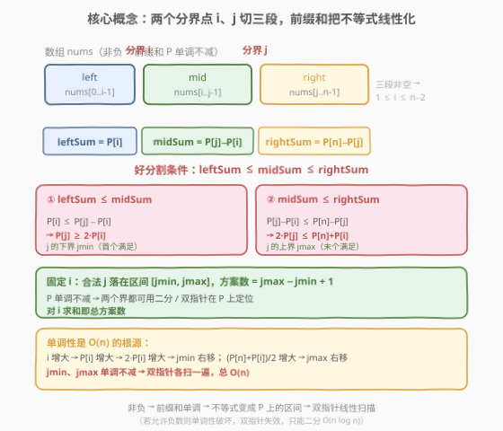
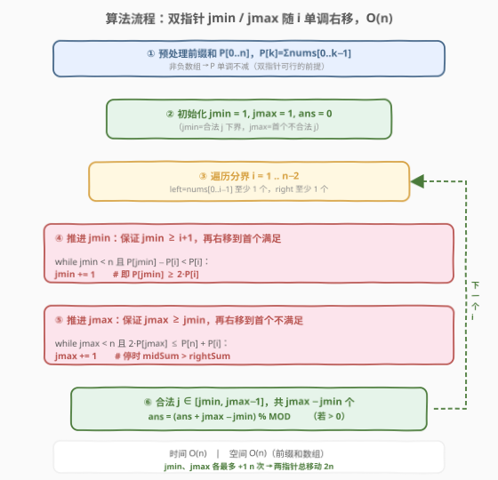

# LeetCode 将数组分成三个子数组的方案数 题解

## 1. 题目概述

- **标题 / 题号**：将数组分成三个子数组的方案数（#1712，medium）
- **链接**：https://leetcode.cn/problems/ways-to-split-array-into-three-subarrays/
- **难度**：中等
- **标签**：数组、双指针、二分查找、前缀和

**题意**：称一种分割整数数组的方案是**好的**，当它满足：

1. 数组被分成三个**非空**连续子数组，从左至右分别命名为 `left`、`mid`、`right`。
2. `left` 中元素和 $\le$ `mid` 中元素和 $\le$ `right` 中元素和。

给定一个**非负**整数数组 `nums`，返回好的分割方案数目。由于答案可能很大，将结果对 $10^9 + 7$ 取余后返回。

**示例 1**：

```text
输入：nums = [1,1,1]
输出：1
解释：唯一好分割为 [1] [1] [1]。
```

**示例 2**：

```text
输入：nums = [1,2,2,2,5,0]
输出：3
解释：3 种好分割：
  [1] [2]   [2,2,5,0]
  [1] [2,2] [2,5,0]
  [1,2] [2,2] [5,0]
```

**示例 3**：

```text
输入：nums = [3,2,1]
输出：0
解释：没有好的分割方案。
```

**约束**：

- $3 \le \text{nums.length} \le 10^5$
- $0 \le \text{nums[i]} \le 10^4$

> 💡 **关键约束**：元素**非负**意味着前缀和**单调不减**——这是把两个不等式转化为前缀和数组上「合法下标区间」、并用双指针/二分线性求解的根基。若允许负数，单调性破坏，双指针失效，只能退回 $O(n \log n)$ 二分。

## 2. 解题思路

### 2.1 暴力思路：枚举两个分界点

最直观的做法是枚举两个分界点 $i$、$j$（$1 \le i < j \le n-1$），把数组切成 `left = nums[0..i-1]`、`mid = nums[i..j-1]`、`right = nums[j..n-1]`，逐个判断 `leftSum ≤ midSum ≤ rightSum` 是否成立。

```text
for i in 1..n-2:
    for j in i+1..n-1:
        leftSum  = sum(nums[0..i-1])
        midSum   = sum(nums[i..j-1])
        rightSum = sum(nums[j..n-1])
        if leftSum <= midSum <= rightSum:
            ans += 1
```

时间复杂度 $O(n^3)$（若每次重算区间和）或 $O(n^2)$（用前缀和 $O(1)$ 取区间和）。对 $n = 10^5$，$O(n^2) \approx 10^{10}$，**超时**。问题在于：对每个 $i$，能配的 $j$ 是一个**连续区间**，而暴力逐个 $j$ 枚举没有利用这一结构。

### 2.2 核心观察：固定 $i$，合法 $j$ 落在一个区间上



引入前缀和 $P$，其中 $P[0] = 0$，$P[k] = \text{nums}[0] + \dots + \text{nums}[k-1]$（$P$ 长度为 $n+1$）。则三段和可写为：

$$
\text{leftSum} = P[i],\quad \text{midSum} = P[j] - P[i],\quad \text{rightSum} = P[n] - P[j].
$$

把好分割的两个不等式代入并整理，$j$ 的约束**只依赖 $P[j]$ 与 $P[i]$**：

| 不等式 | 代入前缀和 | 整理为对 $P[j]$ 的约束 |
|--------|-----------|----------------------|
| $\text{leftSum} \le \text{midSum}$ | $P[i] \le P[j] - P[i]$ | $P[j] \ge 2\,P[i]$ |
| $\text{midSum} \le \text{rightSum}$ | $P[j] - P[i] \le P[n] - P[j]$ | $2\,P[j] \le P[n] + P[i]$ |

于是对**固定的 $i$**，合法的 $j$ 满足：

$$
2\,P[i] \;\le\; P[j] \;\le\; \frac{P[n] + P[i]}{2}, \qquad i+1 \le j \le n-1.
$$

> 💡 **关键洞察**：由于 `nums` 非负，$P$ 单调不减。因此「满足 $P[j] \ge 2P[i]$ 的首个 $j$」（记 `jmin`）和「满足 $2P[j] > P[n]+P[i]$ 的首个 $j$」（记 `jmax`，即首个**不合法**的下标）都可以在 $P$ 上用**二分**或**双指针**定位。合法 $j$ 的区间就是 $[\text{jmin}, \text{jmax}-1]$，本行方案数 $= \text{jmax} - \text{jmin}$（注意是减法而非 $+1$，因为 `jmax` 是首个不合法的位置）。

> ⚠️ **「非负」为何不可或缺**：若 `nums` 含负数，$P$ 不再单调，则 $P[j] \ge 2P[i]$ 的 $j$ 不再构成一个后缀区间，「合法 $j$ 是连续区间」这一结构崩塌，双指针与二分双双失效。本题能用 $O(n)$ 全靠非负带来的单调性。

### 2.3 算法流程图



**为什么能用双指针做到 $O(n)$？** 当 $i$ 递增时：

- $P[i]$ 单调不减 → $2\,P[i]$ 单调不减 → **`jmin` 只右移不回退**；
- $P[i]$ 单调不减 → $(P[n] + P[i]) / 2$ 单调不减 → 不合法阈值上升 → **`jmax` 只右移不回退**。

两个指针各自最多推进 $n$ 次，总移动 $2n$，故整体 $O(n)$。

**步骤**：

1. **预处理**前缀和 $P[0..n]$，`total = P[n]`。
2. **初始化** `jmin = 1`、`jmax = 1`、`ans = 0`、`MOD = 10^9+7`。
3. **遍历** $i = 1 \dots n-2$（保证 `left`、`right` 各至少 1 个元素）：
   - 先令 `jmin = max(jmin, i+1)`（保证 `mid` 非空），再 `while jmin < n and P[jmin] - P[i] < P[i]: jmin += 1`。
   - 再令 `jmax = max(jmax, jmin)`（保证上界 ≥ 下界），再 `while jmax < n and 2*P[jmax] <= total + P[i]: jmax += 1`。
   - 若 `jmax > jmin`：`ans = (ans + jmax - jmin) % MOD`。
4. **返回** `ans`。

> ⚠️ **指针回拨的细节**：`jmin = max(jmin, i+1)` 是因为 `jmin` 可能落后于 `i+1`（当上一轮 `jmin` 停在 `i` 附近、本轮 `i` 跳到 `jmin` 之前时）。`jmax = max(jmax, jmin)` 同理——上界不能小于下界。这两句 `max` 是双指针不重置、跨轮复用的关键，漏写会导致漏数或错位。

### 2.4 示例演算

以 `nums = [1,2,2,2,5,0]` 为例，$P = [0,1,3,5,7,12,12]$，$\text{total} = 12$，$i$ 取 $1 \dots 4$：

![示例演算：[1,2,2,2,5,0] → 3](../images/1712_example_walkthrough.svg)

逐步追踪（下表 `jmin` 为首个满足 $P[j] \ge 2P[i]$ 的 $j$，`jmax` 为首个不满足 $2P[j] \le 12+P[i]$ 的 $j$）：

| $i$ | $\text{leftSum}=P[i]$ | 阈值 $2P[i]$ | `jmin`（首个满足） | 阈值 $\frac{12+P[i]}{2}$ | `jmax`（首个不满足） | 合法 $j$ 区间 | 方案数 |
|-----|----------------------|--------------|-------------------|------------------------|---------------------|--------------|--------|
| 1 | 1 | 2 | 2（$P[2]=3\ge2$） | 6.5 | 4（$2P[4]=14>13$） | $[2,3]$ | 2 |
| 2 | 3 | 6 | 4（$P[4]=7\ge6$） | 7.5 | 5（$2P[5]=24>15$） | $[4,4]$ | 1 |
| 3 | 5 | 10 | 5（$P[5]=12\ge10$） | 8.5 | 5（$2P[5]=24>17$） | $\varnothing$ | 0 |
| 4 | 7 | 14 | 6（$=n$，无满足） | 9.5 | 6 | $\varnothing$ | 0 |

合计 $2 + 1 + 0 + 0 = 3$，对应三种好分割：

- $i=1, j=2$：`[1] [2] [2,2,5,0]`，和 $1, 2, 9$。
- $i=1, j=3$：`[1] [2,2] [2,5,0]`，和 $1, 4, 7$。
- $i=2, j=4$：`[1,2] [2,2] [5,0]`，和 $3, 4, 5$。

**示例 1 验证** `nums = [1,1,1]`：$P=[0,1,2,3]$，$i=1$：$2P[1]=2$，`jmin=2`（$P[2]=2\ge2$）；$\frac{3+1}{2}=2$，`jmax=3`（$2P[3]=6>4$）；合法 $j\in[2,2]$，方案 $1$。✓

**示例 3 验证** `nums = [3,2,1]`：$P=[0,3,5,6]$，$i=1$：$2P[1]=6$，`jmin` 从 $2$ 起推到 $3$（$P[2]=5<6$，$P[3]=6\ge6$ 但 $j\le n-1=2$ 失效）→ 实际 `jmin` 推到 $3=n$ 停，合法区间空，方案 $0$。✓

## 3. 参考代码

### Python（双指针，$O(n)$）

```python
class Solution:
    def waysToSplit(self, nums: List[int]) -> int:
        MOD = 10 ** 9 + 7
        n = len(nums)
        # 前缀和 P[k] = nums[0]+...+nums[k-1]，P[0]=0
        P = [0] * (n + 1)
        for i in range(n):
            P[i + 1] = P[i] + nums[i]
        total = P[n]

        ans = 0
        jmin = 1   # 首个满足 P[j] >= 2*P[i] 的 j
        jmax = 1   # 首个不满足 2*P[j] <= total + P[i] 的 j
        for i in range(1, n - 1):          # left、right 各至少 1 个元素
            if jmin < i + 1:               # 保证 mid 非空：j >= i+1
                jmin = i + 1
            while jmin < n and P[jmin] - P[i] < P[i]:
                jmin += 1                  # 推到首个 P[jmin] >= 2*P[i]

            if jmax < jmin:                # 上界不能低于下界
                jmax = jmin
            while jmax < n and 2 * P[jmax] <= total + P[i]:
                jmax += 1                  # 推到首个 2*P[jmax] > total + P[i]

            if jmax > jmin:                # 合法 j ∈ [jmin, jmax-1]
                ans = (ans + jmax - jmin) % MOD
        return ans
```

### C++

```cpp
class Solution {
  public:
    int waysToSplit(vector<int>& nums) {
        const long long MOD = 1e9 + 7;
        int n = nums.size();
        vector<long long> P(n + 1, 0);
        for (int i = 0; i < n; i++) P[i + 1] = P[i] + nums[i];
        long long total = P[n];

        long long ans = 0;
        int jmin = 1, jmax = 1;
        for (int i = 1; i < n - 1; i++) {
            if (jmin < i + 1) jmin = i + 1;
            while (jmin < n && P[jmin] - P[i] < P[i]) jmin++;

            if (jmax < jmin) jmax = jmin;
            while (jmax < n && 2 * P[jmax] <= total + P[i]) jmax++;

            if (jmax > jmin) ans = (ans + jmax - jmin) % MOD;
        }
        return (int)ans;
    }
};
```

> ⚠️ **实现细节**：
> - **前缀和用 `long long`**：$n \le 10^5$、$\text{nums}[i] \le 10^4$，故 $\text{total} \le 10^9$，`2 * P[k]` 与 `total + P[i]` 均可达 $2 \times 10^9$，**超出 32 位 `int` 上界**（约 $2.1 \times 10^9$），必须用 `long long` 防溢出。Python 无此问题。
> - **`jmax` 是首个不合法下标**：合法区间是 $[\text{jmin}, \text{jmax}-1]$，方案数为 $\text{jmax} - \text{jmin}$（**不是** $+1$）。这一一差是本题最易错的点：把 `jmax` 误当成「末个合法」会多算一倍。
> - **`max` 回拨不可省**：`jmin`、`jmax` 跨 $i$ 复用不重置；当本轮 $i$ 超过指针位置时，需用 `max(jmin, i+1)` / `max(jmax, jmin)` 把指针拉回到合法起点，否则会用上一轮的旧位置错算区间。
> - **取模**：最坏 $n=10^5$，单行方案数可达 $O(n)$，累计需防溢出，故每步 `(ans + delta) % MOD`。

## 4. 复杂度分析

| 维度 | 复杂度 | 说明 |
|------|--------|------|
| 时间复杂度 | $O(n)$ | 预处理前缀和 $O(n)$；`jmin`、`jmax` 各单调不减，全程最多各推进 $n$ 次，主循环总计 $O(n)$ |
| 空间复杂度 | $O(n)$ | 前缀和数组 $P$ 长度 $n+1$；若原地累加 `nums` 为前缀和可降到 $O(1)$ 额外空间 |

> 💡 暴力 $O(n^2)$ 在 $n=10^5$ 时约 $10^{10}$ 次操作超时；优化到 $O(n)$ 约 $2 \times 10^5$ 次比较，快约 $10^5$ 倍。核心是用「非负 → 前缀和单调 → 合法 $j$ 是连续区间 → 双指针线性扫描」这条推理链。

## 5. 扩展：二分解法 $O(n \log n)$

若不依赖单调性的双指针，也可对每个 $i$ 在 $P$ 上做两次二分，直接定位 `jmin` 与 `jmax`：

- `jmin` = `lower_bound(P, i+1, n, 2*P[i])`：在 $P[i+1..n-1]$ 中找首个 $\ge 2P[i]$ 的下标。
- `jmax` = `upper_bound(P, jmin, n, (total + P[i]) // 2)`：在 $P[\text{jmin}..n-1]$ 中找首个 $> \lfloor(\text{total}+P[i])/2\rfloor$ 的下标。
- 本行方案 $= \max(0, \text{jmax} - \text{jmin})$。

```python
from itertools import accumulate
import bisect
class Solution:
    def waysToSplit(self, nums: List[int]) -> int:
        MOD = 10**9 + 7
        n = len(nums)
        P = list(accumulate([0] + nums))
        total = P[n]
        ans = 0
        for i in range(1, n - 1):
            lo = bisect.bisect_left(P, 2 * P[i], i + 1, n)      # 首个 P[j] >= 2*P[i]
            hi = bisect.bisect_right(P, (total + P[i]) // 2, lo, n)  # 首个 P[j] > 上界
            if hi > lo:
                ans = (ans + hi - lo) % MOD
        return ans
```

| 解法 | 时间 | 适用前提 | 备注 |
|------|------|---------|------|
| 双指针 | $O(n)$ | `nums` 非负（$P$ 单调） | 最优，需维护两指针跨轮复用 |
| 二分 | $O(n \log n)$ | 同上（$P$ 单调才能二分） | 实现更短、不易写错；$n=10^5$ 下 $\log n \approx 17$，$1.7\times10^6$ 次操作，同样轻松通过 |

> 💡 **何时选二分、何时选双指针？** 二分更不易写错、对边界更友好，是面试「先写出正确解」的稳妥选择；双指针是「再优化一步」的进阶答案。若题目改成允许负数，二者皆失效（$P$ 不单调），需另寻解法（如分治或权值树状数组），不在本题范围。

## 6. 面试要点

1. **为什么固定 $i$ 后合法 $j$ 是一个连续区间？**

   > 两个不等式整理后只对 $P[j]$ 施加约束：$2P[i] \le P[j] \le (P[n]+P[i])/2$。由于 `nums` 非负，$P$ 单调不减，满足「下界 $\le P[j] \le$ 上界」的 $j$ 必然是 $P$ 上的一段连续下标区间，故可整体计数而非逐个判断。

2. **双指针为什么是 $O(n)$ 而不是 $O(n^2)$？**

   > $i$ 递增时 $P[i]$ 单调不减，于是 $2P[i]$ 与 $(P[n]+P[i])/2$ 都单调不减，导致 `jmin`（首个满足下界的 $j$）和 `jmax`（首个不满足上界的 $j$）都只右移不回退。两指针各最多推进 $n$ 次，总 $2n$，均摊到每个 $i$ 为 $O(1)$。

3. **方案数为什么是 `jmax - jmin` 而不是 `jmax - jmin + 1`？**

   > `jmax` 定义为**首个不合法**的下标（即首个使 $2P[j] > P[n]+P[i]$ 的 $j$），合法区间是 $[\text{jmin}, \text{jmax}-1]$，元素个数 $= (\text{jmax}-1) - \text{jmin} + 1 = \text{jmax} - \text{jmin}$。若误把 `jmax` 当成末个合法下标，会多算 1。

4. **如果 `nums` 允许有负数，解法还成立吗？**

   > 不成立。负数使 $P$ 不再单调，「满足 $P[j] \ge 2P[i]$ 的 $j$」不再构成连续后缀，合法 $j$ 不再是单一区间，双指针与二分双双失效。需退回 $O(n^2)$ 暴力或借助更复杂的数据结构（如对 $P[j]$ 建权值线段树按值域查询）。本题 $O(n)$ 全靠「非负 → 单调」这一前提。

5. **前缀和为什么必须用 `long long`？哪里会溢出？**

   > $n \le 10^5$、$\text{nums}[i] \le 10^4$，故 $\text{total} \le 10^9$。比较 `2 * P[jmax] <= total + P[i]` 时，左侧可达 $2 \times 10^9$、右侧可达 $2 \times 10^9$，均逼近并可能超过 `int` 上界 $2{,}147{,}483{,}647$。用 `long long` 存 $P$ 与 `total` 可一并消除该溢出隐患。Python 大整数自动扩展，无需处理。

6. **本题与 [410. 分割数组的最大值](../0401-0500/410_分割数组的最大值.md) 的异同？**

   > 二者都是「数组分段 + 前缀和」。410 是「分成 $m$ 段、最小化最大段和」，用**二分答案 + 贪心划分**（判定「最大段和 $\le$ mid 能否分成 $\le m$ 段」）；1712 是「固定 3 段、数满足和递增的方案数」，用**前缀和 + 双指针**（固定 $i$ 后 $j$ 是连续区间）。模型不同：前者求最值（二分答案），后者求数量（区间计数）。

> 💡 **一句话总结**：非负 → 前缀和单调 → 两个不等式被线性化为 $P[j]$ 的上下界 → 合法 $j$ 是连续区间 → 双指针随 $i$ 单调右移做到 $O(n)$；注意 `jmax` 是「首个不合法」，方案数为差值而非 $+1$。

## 同类练习题

| # | 题目 | 与本题的关联 |
|---|------|-------------|
| 410 | [分割数组的最大值](https://leetcode.cn/problems/split-array-largest-sum/)（[题解](../0401-0500/410_分割数组的最大值.md)） | 数组分段 + 二分答案，对照「求最值」与「求方案数」两种分段题模型 |
| 1011 | [在 D 天内送达包裹的能力](https://leetcode.cn/problems/capacity-to-ship-packages-within-d-days/)（[题解](../1001-1100/1011_在D天内送达包裹的能力.md)） | 二分答案 + 贪心验证，与 410 同模板，巩固「分段 + 单调判定」 |
| 560 | [和为 K 的子数组](https://leetcode.cn/problems/subarray-sum-equals-k/) | 前缀和 + 哈希数子数组，对照「固定端点查另一端」的两种套路（哈希 vs 双指针/二分） |
| 209 | [长度最小的子数组](https://leetcode.cn/problems/minimum-size-subarray-sum/)（[题解](../0201-0300/209_长度最小的子数组.md)） | 正数前缀和单调 → 滑动窗口，与本题同源（单调性启用双指针/滑窗） |
| 719 | [找出第 K 小的数对距离](https://leetcode.cn/problems/find-k-th-smallest-pair-distance/)（[题解](../0701-0800/719_找出第K小的数对距离.md)） | 排序后二分答案 + 双指针计数，对照「固定一端、另一端是连续区间」的计数范式 |
