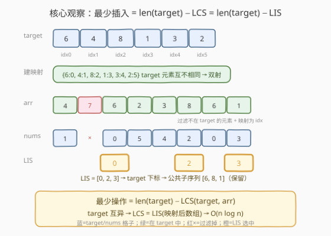
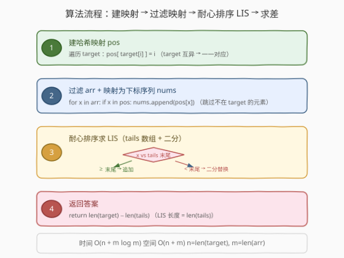
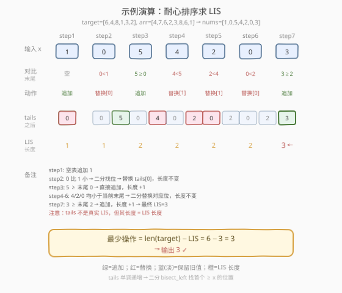

# 得到子序列的最少操作次数

- **题目名称**：得到子序列的最少操作次数
- **链接**：[1713. 得到子序列的最少操作次数](https://leetcode.cn/problems/minimum-operations-to-make-a-subsequence/)
- **难度**：困难
- **标签**：数组、哈希表、二分查找、最长递增子序列、最长公共子序列

## 1. 题目概述

给定一个**元素互不相同**的数组 `target`，以及另一个**可能含重复元素**的数组 `arr`。每次操作可以在 `arr` 的任意位置插入一个整数。求使 `target` 成为 `arr` 的子序列所需的**最少操作次数**。

> 💡 **子序列**：删除原数组某些元素（可不删），不改变剩余元素相对顺序得到的数组。

**示例 1**：

```text
输入：target = [5,1,3], arr = [9,4,2,3,4]
输出：2
解释：在 arr 中插入 5 和 1，得到 [5,9,4,1,2,3,4]，此时 target=[5,1,3] 是其子序列。
      arr 中已有 3（保留），只需补插入 5、1 两数 → 2 次操作。
```

**示例 2**：

```text
输入：target = [6,4,8,1,3,2], arr = [4,7,6,2,3,8,6,1]
输出：3
解释：arr 中 6、8、1 已按 target 的相对顺序出现（公共子序列 [6,8,1]），
      只需补插入 4、3、2 三数 → 3 次操作。
```

**约束条件**：

- $1 \le \text{target.length}, \text{arr.length} \le 10^5$
- $1 \le \text{target}[i], \text{arr}[i] \le 10^9$
- `target` 不包含任何重复元素

> 💡 **关键观察**：要让 `target` 成为 `arr` 的子序列，等价于在 `arr` 中**保留尽可能多的、相对顺序与 `target` 一致的元素**——也就是求 `target` 与 `arr` 的**最长公共子序列（LCS）**，然后插入剩余元素。但通用 LCS 是 $O(nm)$ 的，$10^5 \times 10^5$ 必然超时。突破口在于 `target` 元素**互不相同**这一特殊条件：它把 LCS 问题归约为**最长递增子序列（LIS）**，从而用 $O(n \log n)$ 的耐心排序解决。

---

## 2. 解题思路

### 2.1 暴力思路：动态规划求 LCS

最小操作次数 = `len(target) − LCS(target, arr)`。因为保留 LCS 部分不动，其余 `target` 元素逐个插入即可——插入的元素可放在任意位置补齐，每个缺失元素恰好一次操作，且不可能比这更少（LCS 已是能「不操作就保留」的最大集合）。

用经典二维 DP 求 LCS：

$$\text{dp}[i][j] = \begin{cases} \text{dp}[i-1][j-1] + 1 & \text{target}[i] = \text{arr}[j] \\ \max(\text{dp}[i-1][j], \text{dp}[i][j-1]) & \text{otherwise} \end{cases}$$

时间复杂度 $O(nm)$，$n, m \le 10^5$ 时约 $10^{10}$，必然超时；空间也需 $O(nm)$，同样不可接受。

> ⚠️ **症结**：通用 LCS 必须用二维状态，因为两个数组都可能有重复，无法用「下标顺序」简化。但本题 `target` 元素**互不相同**——这意味着 `target` 的任意子序列由「所选元素集合」唯一确定（顺序即下标序），可以利用这一约束把二维 DP 降为一维 LIS。

### 2.2 核心观察：target 互异 → LCS 归约为 LIS



**转换分两步**：

**第一步：建映射**。因为 `target` 元素互不相同，每个值与它在 `target` 中的下标构成**一一对应（双射）**。建立哈希表 `pos`：`pos[target[i]] = i`。

**第二步：过滤 + 映射**。遍历 `arr`，跳过不在 `target` 中的元素（它们不可能出现在任何公共子序列里），把剩余元素替换为其在 `target` 中的下标，得到下标序列 `nums`。

**为什么此时 LCS = LIS(nums)？**

- `target` 的任意子序列，其元素在 `target` 中的下标必然**严格递增**（子序列保序）。
- 反过来，`nums` 的一段**严格递增子序列**，对应的 `target` 元素构成一个 `target` 的子序列；同时这段子序列在 `arr` 中保序出现（因为 `nums` 本身按 `arr` 顺序排列），所以它同时是 `arr` 的子序列——即公共子序列。
- 因此「公共子序列」与「`nums` 的递增子序列」一一对应，**LCS 长度 = LIS 长度**。

$$\boxed{\text{最少操作} = \text{len}(\text{target}) - \text{LIS}(\text{nums})}$$

> 💡 **为什么要求 target 互异？** 若 `target` 有重复值，同一个值会对应多个下标，`pos` 不再是双射——映射后无法保证「递增 = target 子序列」。本题正是利用互异条件把 $O(nm)$ 的 LCS 降到 $O(m \log m)$ 的 LIS，这是该条件的「关键用法」。

### 2.3 算法流程图



**步骤**：

1. **建哈希映射** `pos`：遍历 `target`，`pos[target[i]] = i`。$O(n)$。
2. **过滤 + 映射**：遍历 `arr`，对每个在 `pos` 中的元素，把其下标追加到 `nums`。$O(m)$。
3. **耐心排序求 LIS**：维护单调递增数组 `tails`，对 `nums` 中每个 `v`：
   - 若 `v` ≥ `tails` 末尾（或 `tails` 为空）→ 直接追加；
   - 否则 → 二分找 `tails` 中首个 $\ge v$ 的位置，替换之。
   - 每步 $O(\log m)$，总计 $O(m \log m)$。
4. **返回** `len(target) − len(tails)`。`len(tails)` 即 LIS 长度。

### 2.4 示例演算

以示例 2 `target = [6,4,8,1,3,2]`、`arr = [4,7,6,2,3,8,6,1]` 为例：

- **建映射**：`pos = {6:0, 4:1, 8:2, 1:3, 3:4, 2:5}`。
- **过滤 + 映射**：`arr` 中 `7` 不在 `target`（跳过），其余映射得 `nums = [1, 0, 5, 4, 2, 0, 3]`。
- **耐心排序**（`tails` 始终单调递增）：



| 步骤 | 输入 `v` | 对比末尾 | 动作 | `tails` 之后 | LIS 长度 |
|------|---------|----------|------|-------------|---------|
| 1 | 1 | 空 | 追加 | `[1]` | 1 |
| 2 | 0 | $0 < 1$ | 替换 `[0]` 位 | `[0]` | 1 |
| 3 | 5 | $5 \ge 0$ | 追加 | `[0, 5]` | 2 |
| 4 | 4 | $4 < 5$ | 替换 `[1]` 位 | `[0, 4]` | 2 |
| 5 | 2 | $2 < 4$ | 替换 `[1]` 位 | `[0, 2]` | 2 |
| 6 | 0 | $0 < 2$ | 替换 `[0]` 位 | `[0, 2]` | 2 |
| 7 | 3 | $3 \ge 2$ | 追加 | `[0, 2, 3]` | 3 |

- **答案**：$\text{len}(\text{target}) - \text{LIS} = 6 - 3 = 3$ ✓

对应的 LIS 为 `[0, 2, 3]`（`nums[1]=0, nums[4]=2, nums[7]=3`），映射回 `target` 即下标 `{0, 2, 3}` 对应的元素 `[6, 8, 1]`——这正是 `arr` 中已按正确顺序出现的公共子序列，保留它不动，补插入 `4, 3, 2` 三数即可。

> 💡 **tails 的含义**：`tails[k]` 表示「所有长度为 $k+1$ 的递增子序列中，末尾元素的最小值」。`tails` 单调递增，因此可用二分。`tails` 本身**不一定是真实的 LIS**（如上演算末尾 `tails=[0,2,3]` 恰好是真实 LIS，但这是巧合），但其**长度**始终等于 LIS 长度——我们只需要长度。

---

## 3. 参考代码

### C++

```cpp
class Solution {
public:
    int minOperations(vector<int>& target, vector<int>& arr) {
        unordered_map<int, int> pos;
        for (int i = 0; i < (int)target.size(); i++)
            pos[target[i]] = i;

        vector<int> tails;
        for (int x : arr) {
            auto it = pos.find(x);
            if (it == pos.end()) continue;
            int v = it->second;
            auto p = lower_bound(tails.begin(), tails.end(), v);
            if (p == tails.end())
                tails.push_back(v);
            else
                *p = v;
        }
        return (int)target.size() - (int)tails.size();
    }
};
```

### Python

```python
from bisect import bisect_left

class Solution:
    def minOperations(self, target: List[int], arr: List[int]) -> int:
        pos = {v: i for i, v in enumerate(target)}
        tails = []
        for x in arr:
            v = pos.get(x)
            if v is None:
                continue
            i = bisect_left(tails, v)
            if i == len(tails):
                tails.append(v)
            else:
                tails[i] = v
        return len(target) - len(tails)
```

> 💡 **实现细节**：① 用 `pos.get(x)` / `pos.find(x)` 判断 `x` 是否在 `target` 中，避免对 `arr` 中大量不在 `target` 的元素做无用二分。② `lower_bound` / `bisect_left` 找的是「首个 $\ge v$」的位置——因为 LIS 要求**严格递增**，相等元素也必须替换（不能追加），这样长度才不会虚高。③ `tails` 用 `vector` / `list` 动态增长，追加是均摊 $O(1)$。

> ⚠️ **严格递增 vs 非严格递增**：本题映射后的 `nums` 中，同一个下标可能出现多次（`arr` 有重复，如示例 2 中 `6` 出现两次 → `nums` 有两个 `0`）。LIS 要求严格递增，故用 `lower_bound`（找 $\ge v$），相同时也替换而非追加。若题目改为非严格递增，则改用 `upper_bound`（找 $> v$），相同时也追加。

---

## 4. 复杂度分析

| 维度 | 复杂度 | 说明 |
|------|--------|------|
| 时间 | $O(n + m \log m)$ | 建映射 $O(n)$；过滤映射 $O(m)$；耐心排序每个元素二分 $O(\log m)$，共 $O(m \log m)$ |
| 空间 | $O(n + m)$ | 哈希表 $O(n)$；`nums` 隐式产生（可边遍历边二分，无需显式存储）；`tails` 最坏 $O(\min(n, m))$ |

> 💡 **与暴力对比**：暴力 LCS $O(nm) = 10^{10}$；本解法 $\approx 10^5 \cdot 17 \approx 1.7 \times 10^6$，快约 $5000$ 倍。核心增益来自「target 互异 → LCS 归约 LIS」这一**问题转换**——把二维 DP 压成一维二分。

> ⚠️ **空间优化**：代码中无需显式构造 `nums` 数组，遍历 `arr` 时直接对 `tails` 做二分即可，省去 $O(m)$ 的 `nums` 存储。上方代码正是如此实现——空间只剩哈希表 $O(n)$ 与 `tails` $O(\min(n,m))$。

---

## 5. 扩展：LCS 的高效解法与适用边界

### 5.1 何时 LCS 能做到优于 $O(nm)$？

通用 LCS 的 $O(nm)$ DP 在两个序列「无特殊结构」时已是最优下界。但在以下特殊条件下可加速：

- **一序列元素互异**（本题）：LCS 归约为 LIS，$O(n + m \log m)$。
- **一序列是排列**：同样归约 LIS，且 `nums` 长度恰为另一序列长度。
- **公共子序列长度 $L$ 较小**：用 Hunt-Szymanski 算法，按匹配点排序后求 LIS，复杂度 $O((n+m) \log m + L \log L)$，适合 $L \ll \min(n,m)$ 的场景。
- **字母表小**（如 DNA 序列的 4 字符）：可用位并行 Bitset LCS，$O(nm / w)$，$w$ 为机器字长。

> 💡 **本题属于第一类**：`target` 互异 → 双射 → LIS 归约。面试时若遇到 LCS 但数据规模 $> 10^4$，应首先检查是否有「一序列互异 / 是排列」的条件，若有则走 LIS 路线。

### 5.2 为什么「互异」能保证归约正确？

归约的核心是**双射**：`target` 元素互异时，`pos` 是值到下标的一一映射。于是：

- `target` 的子序列 ⟺ `target` 下标的递增序列（保序性）。
- `arr` 中的元素经映射后保序出现在 `nums` 中。
- 「同时是 `target` 和 `arr` 的子序列」⟺「`nums` 中的递增子序列」。

若 `target` 有重复值，同一值对应多个下标，映射不再唯一，递增性不再等价于子序列关系——归约失效，只能退回 $O(nm)$ DP。

### 5.3 耐心排序与 LIS 的等价性

耐心排序（Patience Sorting）来源于纸牌游戏「耐心」：把元素逐个放到「最上面一张 ≥ 当前元素」的牌堆顶，没有则开新堆。最终**牌堆数 = LIS 长度**。`tails` 数组就是「各牌堆的堆顶」，它单调递增故可二分。这一等价性可通过 Dilworth 定理严格证明：序列的最长递增子序列长度，等于将其划分为若干不下降子序列所需的最少段数。

> 💡 **延伸**：若还需还原一条真实 LIS（不只是长度），可在二分替换时额外记录每个元素所在「堆」的编号（即它被放入 `tails` 时的位置 $k$），最后从最大堆号倒推前驱即可重建。本题只需长度，无需此步。

---

## 6. 面试要点

**Q1：为什么最少操作次数等于 `len(target) − LCS`？**

> 因为要让 `target` 成为 `arr` 的子序列，`arr` 中**已经按 `target` 顺序出现的那些元素无需操作**——它们恰好构成一个公共子序列。保留最长的这样的公共子序列（即 LCS），剩余的 `target` 元素每个需要一次插入补齐。插入可在任意位置完成且互不干扰，故总次数 = `len(target) − LCS`，且不可能更少（LCS 已是不操作能保留的最大集合）。

**Q2：为什么 `target` 互异时 LCS 能转化为 LIS？**

> `target` 互异 → 值与下标一一对应（双射）。把 `arr` 中出现在 `target` 的元素替换为它在 `target` 的下标，得到 `nums`。由于 `target` 的子序列对应下标的严格递增序列，而 `nums` 按 `arr` 顺序排列，所以「`nums` 的递增子序列」与「`target` 和 `arr` 的公共子序列」一一对应，LCS 长度 = LIS 长度。若 `target` 有重复值，双射不成立，归约失效。

**Q3：耐心排序中 `tails` 数组的含义是什么？为什么二分用 `lower_bound`？**

> `tails[k]` 是「所有长度为 $k+1$ 的递增子序列中，末尾元素的最小值」。`tails` 单调递增，所以新元素 `v` 可二分定位。本题要求**严格递增** LIS，故用 `lower_bound` 找「首个 $\ge v$」的位置：相同时也替换（不能追加），避免长度虚高。若改为非严格递增，则用 `upper_bound` 找「首个 $> v$」的位置，相同时追加。

**Q4：`tails` 末尾的数组一定是真实的 LIS 吗？**

> 不一定。`tails` 只保证长度正确，元素本身可能是「拼凑」的。例如 `nums = [2, 5, 3, 4]`：处理后 `tails = [2, 3, 4]` 恰为真实 LIS；但 `nums = [3, 4, 1, 2]` 处理后 `tails = [1, 2]`，而真实 LIS 是 `[3, 4]`——`tails` 的元素被后来的小值覆盖了，但长度仍为 2 正确。本题只需长度，故无影响；若需还原真实 LIS，需额外记录前驱。

**Q5：如果 `target` 也有重复元素，该怎么做？**

> 归约失效，退回通用 LCS。若数据规模小（$\le 10^3$），用 $O(nm)$ 的二维 DP；若规模大，考虑 Bitset LCS（$O(nm/w)$，字母表小时有效）或 Hunt-Szymanski（公共子序列较短时有效）。但 $n, m \le 10^5$ 且两序列都有重复时，目前没有 $O((n+m) \text{polylog})$ 的一般解法——这也是本题特意给出「target 互异」条件的原因。

> 💡 **一句话总结**：target 互异 → 建值到下标双射 → arr 过滤映射为下标序列 → LCS 归约为 LIS → 耐心排序 $O(m \log m)$ 求长度 → 答案 = `len(target) − LIS`。本质是用「互异」这一特殊条件把二维 LCS 压成一维 LIS。

---

## 7. 同类练习题

- [300. 最长递增子序列](https://leetcode.cn/problems/longest-increasing-subsequence/)（[题解](../0301-0400/300_最长递增子序列.md)）：耐心排序 + 二分求 LIS 的母题——掌握 `tails` 数组的单调性与 `lower_bound` 用法后再看本题只需叠加「LCS → LIS 归约」
- [1143. 最长公共子序列](https://leetcode.cn/problems/longest-common-subsequence/)（[题解](../1101-1200/1143_最长公共子序列.md)）：通用 LCS 的二维 DP 母题——本题是其「一序列互异」特例的加速版，对比理解何时能用 LIS 替代 $O(nm)$ DP
- [1035. 不相交的线](https://leetcode.cn/problems/uncrossed-lines/)（[题解](../1001-1100/1035_不相交的线.md)）：LCS 的等价变形（连线不相交 ⟺ 公共子序列），练习识别「LCS 套皮」题型
- [392. 判断子序列](https://leetcode.cn/problems/is-subsequence/)（[题解](../0301-0400/392_判断子序列.md)）：判定 `s` 是否为 `t` 的子序列——本题的「零操作」边界情形（若 target 已是 arr 子序列，LCS=len(target)，答案为 0）
- [354. 俄罗斯套娃信封问题](https://leetcode.cn/problems/russian-doll-envelopes/)（[题解](../0301-0400/354_俄罗斯套娃信封问题.md)）：二维约束下的 LIS——先按一维排序、另一维求 LIS，是「把多约束 LIS 归约为标准 LIS」的经典套路，与本题「把 LCS 归约为 LIS」同属问题转换思想
