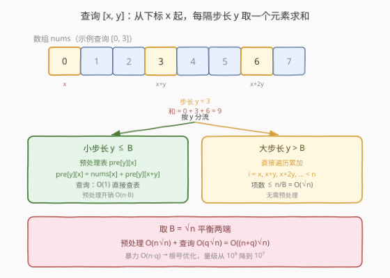
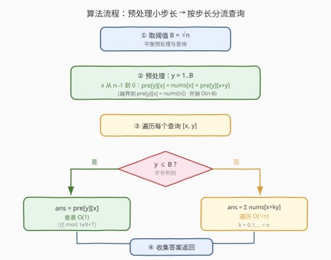
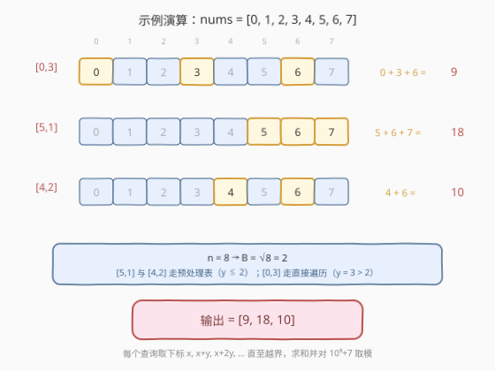

# LeetCode 数组中特殊等间距元素的和 题解

## 1. 题目概述

- **标题 / 题号**：数组中特殊等间距元素的和（#1714，hard）
- **链接**：https://leetcode.cn/problems/sum-of-special-evenly-spaced-elements-in-array/
- **难度**：困难
- **标签**：数组、根号分治（Sqrt Decomposition）、动态规划、前缀和

**题意**：给定一个下标从 $0$ 开始的整数数组 `nums`（长度为 $n$），和一个二维查询数组 `queries`。每个查询 $\text{queries}[i] = [x_i,\ y_i]$ 要求计算从下标 $x_i$ 出发、**每隔步长 $y_i$** 取一个元素求和：

$$
S_i = \text{nums}[x_i] + \text{nums}[x_i + y_i] + \text{nums}[x_i + 2y_i] + \cdots
$$

其中累加所有满足 $x_i + k \cdot y_i < n$（$k \ge 0$）的下标。返回每个查询的结果构成数组，**结果对 $10^9 + 7$ 取模**。

**示例 1**：

```text
输入：nums = [0,1,2,3,4,5,6,7], queries = [[0,3],[5,1],[4,2]]
输出：[9,18,10]
解释：
  [0,3]：下标 0,3,6 → 0 + 3 + 6 = 9
  [5,1]：下标 5,6,7 → 5 + 6 + 7 = 18
  [4,2]：下标 4,6   → 4 + 6 = 10
```

**约束条件**（依据官方提示与示例还原，实际以官方为准）：

- $1 \le n = \text{nums.length} \le 5 \times 10^4$
- $1 \le \text{queries.length} \le 5 \times 10^4$
- $0 \le \text{nums}[i] \le 10^9$
- $\text{queries}[i] = [x_i,\ y_i]$，$0 \le x_i < n$，$1 \le y_i \le n$

> ⚠️ 本题为 LeetCode **Plus 会员专享题**，题面与约束依据官方提示（hints）、示例用例与官方标签（Array / Dynamic Programming / Sqrt Decomposition）还原。官方给出的三条提示直接指向「根号分治」解法，下文展开。

> 💡 **关键结构**：单个查询的代价是 $O(n / y_i)$——步长 $y_i$ 越大，要累加的元素越少；步长越小，代价越高。这种「查询代价随某个参数反比变化」的结构，正是**根号分治（阈值分流）**发挥的舞台。

## 2. 解题思路

### 2.1 暴力思路：逐查询累加

最直觉的做法是对每个查询 $[x_i, y_i]$ 直接按步长遍历累加：

```text
for each query [x, y]:
    s = 0
    for i = x; i < n; i += y:
        s += nums[i]
    ans.append(s % MOD)
```

单个查询的代价为 $O(n / y_i)$。最坏情况 $y_i = 1$ 时退化为 $O(n)$，所有查询合计 $O(n \cdot q)$。以 $n = q = 5 \times 10^4$ 计，约 $2.5 \times 10^9$ 次运算，**必然超时**。

> ⚠️ **症结**：暴力对所有步长 $y$ 一视同仁。但步长 $y$ 大时本就只需累加很少几项（天然廉价），步长 $y$ 小时才真正昂贵。把所有查询都按最坏方式遍历，等于在小步长查询上反复做重复的累加工作——而这些累加本可**预先算好**。

### 2.2 核心观察：根号分治——按步长 $y$ 分流



关键洞察：查询代价 $O(n / y)$ 随步长 $y$ **反比**变化。据此把查询按 $y$ 与阈值 $B$ 的大小关系分成两类，分别用不同策略：

| 分支 | 条件 | 策略 | 单查询代价 |
|------|------|------|-----------|
| **小步长** | $y \le B$ | 预处理一张表 `pre[y][x]`，查询时 $O(1)$ 取值 | $O(1)$ |
| **大步长** | $y > B$ | 不预处理，直接按步长遍历累加 | $O(n/y) \le O(n/B)$ |

**小步长分支——预处理（DP 递推）**：对每个 $y \in [1, B]$，定义

$$
\text{pre}[y][x] = \text{nums}[x] + \text{nums}[x+y] + \text{nums}[x+2y] + \cdots \pmod{10^9+7}
$$

它满足递推（从右往左算，保证 $\text{pre}[y][x+y]$ 已算好）：

$$
\text{pre}[y][x] = \text{nums}[x] + \begin{cases} \text{pre}[y][x+y] & x+y < n \\ 0 & x+y \ge n \end{cases}
$$

这正是「带步长的后缀和」，也是官方标签 **Dynamic Programming** 的由来——用已求出的子问题解 $\text{pre}[y][x+y]$ 拼出 $\text{pre}[y][x]$。预处理总开销 $O(n \cdot B)$。

**大步长分支——直接遍历**：当 $y > B$ 时，累加项数 $\le n / y < n / B$。若取 $B \approx \sqrt{n}$，则单查询代价 $< \sqrt{n}$，合计 $O(q \sqrt{n})$。

> 💡 **为什么必须分流？** 若想对所有步长都 $O(1)$ 查询，需预处理所有 $y \in [1, n]$，开销 $O(n^2)$，不可行。分流的精妙在于：**只对“代价高的小步长”预处理**（$y$ 取值少，只有 $B$ 个），而**让“天然廉价的大步长”直接算**（项数少）。两端的弱点都被对方的优势补上。

### 2.3 算法流程图



1. **取阈值** $B = \lfloor \sqrt{n} \rfloor$。
2. **预处理**：对 $y = 1, 2, \ldots, B$，令 $x$ 从 $n-1$ 到 $0$ 递减，按递推式填 `pre[y][x]`，过程中对 $10^9+7$ 取模。
3. **回答查询**：遍历每个 $[x, y]$——
   - 若 $y \le B$：`ans = pre[y][x]`，$O(1)$；
   - 若 $y > B$：`for i = x; i < n; i += y` 累加，最后取模，$O(\sqrt{n})$。
4. **返回** 答案数组。

### 2.4 示例演算

以官方示例 `nums = [0,1,2,3,4,5,6,7]`、`queries = [[0,3],[5,1],[4,2]]` 为例。$n = 8$，$B = \lfloor\sqrt{8}\rfloor = 2$，故只需预处理 $y = 1, 2$ 两张表。



| 查询 | 步长 $y$ | 分支 | 取下标 | 求和 | 结果 |
|------|---------|------|--------|------|------|
| $[0,3]$ | $3$ | $y=3 > B=2$，直接遍历 | $0, 3, 6$ | $0+3+6$ | $9$ |
| $[5,1]$ | $1$ | $y=1 \le B$，查 `pre[1][5]` | $5, 6, 7$ | $5+6+7$ | $18$ |
| $[4,2]$ | $2$ | $y=2 \le B$，查 `pre[2][4]` | $4, 6$ | $4+6$ | $10$ |

预处理表（验证）：

- `pre[1]`（步长 1 的后缀和）：$[28, 28, 27, 25, 22, \mathbf{18}, 13, 7]$，`pre[1][5] = 18` ✓
- `pre[2]`（步长 2 的后缀和）：$[12, 16, 12, 15, \mathbf{10}, 12, 6, 7]$，`pre[2][4] = 10` ✓

输出 `[9, 18, 10]` ✓。注意 $[0,3]$ 因 $y=3 > 2$ 走直接遍历分支，恰好只需累加 3 项——大步长天然廉价的体现。

## 3. 参考代码

### C++

```cpp
class Solution {
public:
    vector<int> solve(vector<int>& nums, vector<vector<int>>& queries) {
        const int MOD = 1000000007;
        int n = nums.size();
        int B = (int)sqrt((double)n);
        // 预处理小步长：pre[y][x] = nums[x] + nums[x+y] + ... (mod MOD)
        // 对 y in [1, B]，x 从 n-1 到 0 递推（带步长的后缀和）
        vector<vector<int>> pre(B + 1, vector<int>(n, 0));
        for (int y = 1; y <= B; y++) {
            for (int x = n - 1; x >= 0; x--) {
                pre[y][x] = nums[x] % MOD;
                if (x + y < n) pre[y][x] = (pre[y][x] + pre[y][x + y]) % MOD;
            }
        }
        vector<int> ans;
        ans.reserve(queries.size());
        for (auto& q : queries) {
            int x = q[0], y = q[1];
            if (y <= B) {
                ans.push_back(pre[y][x]);           // O(1) 查表
            } else {
                long long s = 0;
                for (int i = x; i < n; i += y) s += nums[i];   // O(n/y) <= O(sqrt(n))
                ans.push_back((int)(s % MOD));
            }
        }
        return ans;
    }
};
```

### Python

```python
import math
from array import array

class Solution:
    def solve(self, nums, queries):
        MOD = 10**9 + 7
        n = len(nums)
        B = math.isqrt(n)
        # 预处理小步长 y=1..B。用 array('i') 存储以控制内存（值 < 1e9+7 < 2^31）
        pre = [None] * (B + 1)
        for y in range(1, B + 1):
            row = array('i', [0]) * n
            for x in range(n - 1, -1, -1):
                v = nums[x] % MOD
                if x + y < n:
                    v += row[x + y]
                row[x] = v % MOD
            pre[y] = row
        ans = []
        for x, y in queries:
            if y <= B:
                ans.append(pre[y][x])              # O(1) 查表
            else:
                s = 0
                for i in range(x, n, y):           # O(n/y) <= O(sqrt(n))
                    s += nums[i]
                ans.append(s % MOD)
        return ans
```

> 💡 **阈值 $B$ 的精度不影响正确性**：无论 $B$ 偏大还是偏小，两类分支都给出正确结果，只会影响预处理与查询的占比（常数差异）。C++ 用 `(int)sqrt` 在完全平方数处可能因浮点误差少取 1，无碍正确性；Python 用 `math.isqrt` 得到精确整数平方根，更稳妥。
>
> ⚠️ **取模与负数**：上述代码假设 $\text{nums}[i] \ge 0$（与示例一致）。若题面允许负数，C++ 的 `%` 会保留符号，需改为 `((nums[x] % MOD) + MOD) % MOD`；Python 的 `%` 对负数已返回非负结果，无需调整。
>
> ⚠️ **Python 内存**：预处理表大小 $O(nB)$。纯 Python 列表每个 `int` 是独立对象，$n = 5\times10^4$、$B \approx 223$ 时约 $1.1\times10^7$ 个对象、占内存偏大。改用 `array('i')`（4 字节/元素）可降到约 45 MB，稳定通过。

## 4. 复杂度分析

| 维度 | 复杂度 | 说明 |
|------|--------|------|
| 时间复杂度 | $O\big((n+q)\sqrt{n}\big)$ | 预处理 $O(nB)$；查询最坏全走大步长分支，合计 $O(q \cdot n/B)$；取 $B = \sqrt{n}$ 得 $O(n\sqrt{n} + q\sqrt{n})$ |
| 空间复杂度 | $O(n\sqrt{n})$ | 预处理表 `pre` 共 $B \times n$ 个整数；$B \approx \sqrt{n}$ |

> 💡 **推导**：总时间 $T = nB + q \cdot \dfrac{n}{B}$。对 $B$ 求导令其为零得 $B = \sqrt{q}$；当 $q \approx n$（本题典型规模），$B \approx \sqrt{n}$，此时 $T = n\sqrt{n} + q\sqrt{n} = (n+q)\sqrt{n}$。以 $n = q = 5\times10^4$ 计，约 $2.2 \times 10^7$ 次运算，远低于暴力 $O(nq) \approx 2.5 \times 10^9$。

## 5. 扩展：根号分治的适用特征与变体

### 5.1 何时该想到根号分治

本题能套用根号分治，源于两个特征同时成立：

1. **查询代价随某参数反比变化**：本题代价 $O(n/y)$ 随步长 $y$ 增大而减小。
2. **“昂贵情形”的参数取值有限**：小步长 $y \in [1, B]$ 只有 $B$ 种取值，可全部预处理；“廉价情形”虽不预处理但单次代价本就低。

只要问题具备「**参数小则贵、参数大则廉，且小参数取值可枚举**」的结构，就值得考虑阈值分流。

### 5.2 内存优化的变体：按需预处理

若内存吃紧，可**只预处理查询中实际出现的小步长** $y$，用哈希表/字典惰性计算：首次遇到某 $y \le B$ 时再构建 `pre[y]`，后续命中直接复用。最坏情况（所有小步长都出现）与全预处理相同，但常数更省、平均更优。

### 5.3 与「定步长前缀和」的对照

若步长固定为 $1$（普通区间和），一张前缀和表即可让所有查询 $O(1)$，无需分流——这正是 [1310. XOR Queries of a Subarray](https://leetcode.cn/problems/xor-queries-of-a-subarray/) 的情形。本题难点在于**步长随查询变化**：想对所有 $y$ 都 $O(1)$ 查询需 $O(n^2)$ 预处理，不可行，于是退而用根号分治在「预处理量」与「查询量」间取得平衡。

## 6. 面试要点

**Q1：为什么要按步长 $y$ 分流？核心思想是什么？**
> 单查询代价 $O(n/y)$ 随步长反比变化：$y$ 小时代价高、$y$ 大时代价低。对廉价的大步长直接算即可，对昂贵的小步长则预先建表 $O(1)$ 取值。这样两类的弱点都被对方优势补上——小步长的重复累加被预处理消除，大步长无需付出 $O(n^2)$ 的全量预处理代价。

**Q2：阈值 $B$ 为什么取 $\sqrt{n}$？**
> 总时间 $T = nB + qn/B$。对 $B$ 求导令为零得 $B = \sqrt{q}$；本题 $q \approx n$，故 $B \approx \sqrt{n}$，此时预处理项 $nB$ 与查询项 $qn/B$ 同阶，达到平衡。$B$ 偏大偏小都仍正确，只是常数变差，所以 $\sqrt n$ 是「最优常数」而非「正确性要求」。

**Q3：预处理表 `pre[y][x]` 的递推关系是什么？为什么 $x$ 要从右往左？**
> $\text{pre}[y][x] = \text{nums}[x] + \text{pre}[y][x+y]$（$x+y \ge n$ 时后项为 $0$）。因为 $\text{pre}[y][x]$ 依赖更靠右的 $\text{pre}[y][x+y]$，所以 $x$ 必须从 $n-1$ 递减到 $0$，保证依赖项已算好——本质是「带步长的后缀和」DP。

**Q4：暴力 $O(nq)$ 为什么不可行？优化后量级改善多少？**
> $n = q = 5\times10^4$ 时 $nq \approx 2.5\times10^9$，远超时限。根号分治后 $O((n+q)\sqrt n) \approx 2.2\times10^7$，约快两个数量级。

**Q5：Python 中如何避免内存超限？**
> 预处理表 $O(n\sqrt n)$ 在纯 Python 列表下每元素是一个独立 `int` 对象，$n=5\times10^4$ 时约上亿字节。改用 `array('i')`（每元素 4 字节，值 $< 10^9+7 < 2^{31}$ 适用）可把内存压到约 45 MB。也可用「按需预处理」只对出现过的 $y$ 建表进一步省内存。

## 同类练习题

| # | 题目 | 与本题的关联 |
|---|------|-------------|
| 1310 | [子数组异或查询](https://leetcode.cn/problems/xor-queries-of-a-subarray/) | 前缀异或预处理，每个查询 $O(1)$——对照「步长固定为 1 时一张前缀表通吃所有查询」；本题因步长随查询变化才需根号分治 |
| 304 | [二维区域和检索 - 数组不可变](../0301-0400/304_二维区域和检索.md) | 二维前缀和预处理、查询 $O(1)$，同为「预计算摊销查询开销」范式（升到二维的容斥版本） |
| 1178 | [猜字谜](https://leetcode.cn/problems/number-of-valid-words-for-each-puzzle/) | 预计算词频掩码 + 每个 puzzle 枚举首字母的子集（$\le 64$）——与本题「大步长直接枚举少量项」分支同构，体现「可枚举的小空间直接搜」思想 |
| 1782 | [统计点对的数目](https://leetcode.cn/problems/count-pairs-of-nodes/)（Plus 会员题） | 按度数阈值分流——高度数点少则预计算、低度数点多则直接遍历，是 LeetCode 上根号分治（阈值分流）的典型代表，与本题按步长分流的骨架完全一致 |
