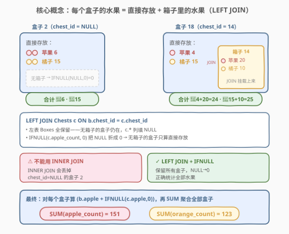
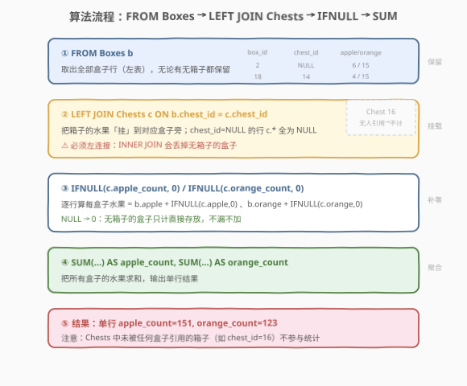
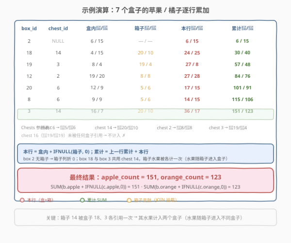

# LeetCode 苹果和橘子的个数 题解

- **备注**：本题为 LeetCode **Plus 会员专享题**（Database 分类）。题面与样例依据官方 schema 与样例测试用例整理。

## 1. 题目概述

- **标题 / 题号**：苹果和橘子的个数（#1715，medium）
- **链接**：https://leetcode.cn/problems/count-apples-and-oranges/
- **难度**：中等
- **标签**：数据库、SQL、`LEFT JOIN`、`IFNULL`/`COALESCE`、`SUM`、聚合、外键关联、`NULL` 处理

**题意**：仓库里有若干**盒子**（Boxes），每个盒子可以直接存放一些苹果和橘子，也可能装着一个**箱子**（Chest）。箱子本身也存放苹果和橘子。编写 SQL 查询，统计**所有盒子里的苹果和橘子总数**——包括盒子里直接存放的，以及盒子所装箱子里的。

**表结构**：

```text
Table: Boxes
+-------------+------+
| Column Name | Type |
+-------------+------+
| box_id      | int  |
| chest_id    | int  |
| apple_count | int  |
| orange_count| int  |
+-------------+------+
box_id 是该表主键。
chest_id 是指向 Chests 表的外键，可以为 NULL（表示该盒子没装箱子）。
apple_count / orange_count 是盒子直接存放的苹果 / 橘子数量（不含箱子里的）。

Table: Chests
+-------------+------+
| Column Name | Type |
+-------------+------+
| chest_id    | int  |
| apple_count | int  |
| orange_count| int  |
+-------------+------+
chest_id 是该表主键。
apple_count / orange_count 是箱子里存放的苹果 / 橘子数量。
```

**示例 1**：

```text
输入：
Boxes 表:
+--------+----------+-------------+--------------+
| box_id | chest_id | apple_count | orange_count |
+--------+----------+-------------+--------------+
| 2      | null     | 6           | 15           |
| 18     | 14       | 4           | 15           |
| 19     | 3        | 8           | 4            |
| 12     | 2        | 19          | 20           |
| 20     | 6        | 12          | 9            |
| 8      | 6        | 9           | 9            |
| 3      | 14       | 16          | 7            |
+--------+----------+-------------+--------------+
Chests 表:
+----------+-------------+--------------+
| chest_id | apple_count | orange_count |
+----------+-------------+--------------+
| 6        | 5           | 6            |
| 14       | 20          | 10           |
| 2        | 8           | 8            |
| 3        | 19          | 4            |
| 16       | 19          | 19           |
+----------+-------------+--------------+

输出:
+-------------+--------------+
| apple_count | orange_count |
+-------------+--------------+
| 151         | 123          |
+-------------+--------------+
```

**解释**：

| box_id | chest_id | 盒内 🍎/🍊 | 箱子 🍎/🍊 | 本盒合计 🍎/🍊 |
|--------|----------|-----------|-----------|----------------|
| 2 | null | 6 / 15 | 0 / 0 | 6 / 15 |
| 18 | 14 | 4 / 15 | 20 / 10 | 24 / 25 |
| 19 | 3 | 8 / 4 | 19 / 4 | 27 / 8 |
| 12 | 2 | 19 / 20 | 8 / 8 | 27 / 28 |
| 20 | 6 | 12 / 9 | 5 / 6 | 17 / 15 |
| 8 | 6 | 9 / 9 | 5 / 6 | 14 / 15 |
| 3 | 14 | 16 / 7 | 20 / 10 | 36 / 17 |
| **合计** | | | | **151 / 123** |

> ⚠️ 注意 `Chests` 表中的 **`chest_id = 16`** 没有被任何盒子引用——它的水果不在任何盒子里，因此**不计入**统计。只有「装进盒子」的箱子里的水果才算数。

> 💡 **关键结构**：每个盒子的水果 = 盒内直接存放 + 盒中所装箱子。箱子数据在另一张表，需要**按外键 `chest_id` 关联**到盒子；而 `chest_id` 可为 `NULL`（无箱子），关联时必须**保留这些盒子**——这正是 `LEFT JOIN` 的招牌场景。

## 2. 解题思路

### 2.1 暴力思路：逐盒子相关子查询

最直觉的过程式思路：遍历每个盒子，若它有 `chest_id`，就去 `Chests` 表里查出对应箱子的苹果 / 橘子数加进来；若 `chest_id` 为 `NULL`，则箱子贡献为 0。翻译成 SQL 即**相关子查询**：

```sql
SELECT
    SUM(b.apple_count  + COALESCE((SELECT c.apple_count  FROM Chests c WHERE c.chest_id = b.chest_id), 0)) AS apple_count,
    SUM(b.orange_count + COALESCE((SELECT c.orange_count FROM Chests c WHERE c.chest_id = b.chest_id), 0)) AS orange_count
FROM Boxes b;
```

对 `Boxes` 的每一行，子查询去 `Chests` 里按 `chest_id` 找匹配行。若 `chest_id` 为 `NULL`，子查询返回 `NULL`（`WHERE NULL = NULL` 不成立），`COALESCE` 折成 0。

> ⚠️ **性能隐患**：相关子查询对 `Boxes` 的**每一行**执行一次 `Chests` 查找。若无索引，单次查找 $O(m)$（$m$ = `Chests` 行数），合计 $O(n \cdot m)$。`Chests` 行数不大时尚可，但更优雅的做法是**一次性连接**两表，避免逐行查找。

### 2.2 核心观察：LEFT JOIN 把箱子「挂」到盒子旁 + IFNULL 补零



把问题拆成三个子问题：

1. **关联**：把 `Chests` 的苹果 / 橘子列「挂」到 `Boxes` 旁——用 `LEFT JOIN Chests c ON b.chest_id = c.chest_id`。连接后每行同时拥有盒内水果和箱子水果两套列。

2. **补零**：`chest_id` 为 `NULL` 的盒子，连接后 `c.apple_count`/`c.orange_count` 为 `NULL`。用 `IFNULL(c.apple_count, 0)` 把 `NULL` 折成 0，使无箱子的盒子只计直接存放、不漏不加。

3. **求和**：对每个盒子的「盒内 + 箱子」逐行相加后，外层 `SUM` 聚合所有盒子，得到全局总数。

> 💡 **为什么必须 `LEFT JOIN` 而非 `INNER JOIN`？** `INNER JOIN` 只保留两表都匹配的行——`chest_id = NULL` 的盒子（如 box 2）会被**丢弃**，导致漏统计。`LEFT JOIN` 保留左表（`Boxes`）的全部行，右表（`Chests`）不匹配时填 `NULL`，再用 `IFNULL` 补零——既不丢盒子，也不多算箱子。

> ⚠️ **方向不能反**：`FROM Chests c LEFT JOIN Boxes b` 会以 `Chests` 为左表，保留**所有箱子**——包括未被任何盒子引用的 `chest_id = 16`！这会把箱子 16 的 19 个苹果、19 个橘子错误计入。**左表必须是 `Boxes`**，因为统计口径是「所有盒子里的水果」，箱子只有装进盒子才计数。

### 2.3 算法流程图



**逻辑执行步骤**：

| 步骤 | 子句 / 函数 | 作用 |
|------|-------------|------|
| ① | `FROM Boxes b` | 读取全部盒子（左表），有无箱子都保留 |
| ② | `LEFT JOIN Chests c ON b.chest_id = c.chest_id` | 把箱子水果挂到对应盒子旁；无箱子的行 `c.*` 为 `NULL` |
| ③ | `IFNULL(c.apple_count, 0)` / `IFNULL(c.orange_count, 0)` | 逐行算每盒水果 = 盒内 + 箱子（`NULL`→0） |
| ④ | `SUM(...)` | 聚合所有盒子，输出单行结果 |
| ⑤ | 返回 | `apple_count = 151, orange_count = 123` |

> 💡 **连接的执行模型**：`LEFT JOIN` 先确定左表 `Boxes` 的每一行，再对每行去右表 `Chests` 按 `ON` 条件找匹配。匹配上则并排填充 `c.*` 列；匹配不上（`chest_id` 为 `NULL` 或指向不存在的箱子）则 `c.*` 填 `NULL`。在 `Chests.chest_id`（主键）上天然有序，连接可走索引/哈希，无需逐行全表扫描。

### 2.4 示例演算

以示例 1 的 7 个盒子为例，观察「`LEFT JOIN` 挂载 → `IFNULL` 补零 → 逐行累加」的过程：



| box_id | chest_id | 盒内 🍎/🍊 | 箱子 🍎/🍊（JOIN） | 本行 🍎/🍊 | 累计 🍎/🍊 |
|--------|----------|-----------|-------------------|-----------|-----------|
| 2 | NULL | 6 / 15 | 0 / 0（NULL→0） | 6 / 15 | 6 / 15 |
| 18 | 14 | 4 / 15 | 20 / 10 | 24 / 25 | 30 / 40 |
| 19 | 3 | 8 / 4 | 19 / 4 | 27 / 8 | 57 / 48 |
| 12 | 2 | 19 / 20 | 8 / 8 | 27 / 28 | 84 / 76 |
| 20 | 6 | 12 / 9 | 5 / 6 | 17 / 15 | 101 / 91 |
| 8 | 6 | 9 / 9 | 5 / 6 | 14 / 15 | 115 / 106 |
| 3 | 14 | 16 / 7 | 20 / 10 | 36 / 17 | **151 / 123** |

> 💡 **箱子 14 被复用**：盒子 18 和盒子 3 都装着 `chest_id = 14` 的箱子。`LEFT JOIN` 后这两行都挂上箱子 14 的水果（🍎20/🍊10），各计一次——因为「同一个型号的箱子」可以装进多个盒子，每个盒子里的箱子水果都要算。这不同于「去重」，而是「水果随箱子进入盒子」。
>
> ⚠️ **箱子 16 被忽略**：`Chests` 表里 `chest_id = 16`（🍎19/🍊19）没有被任何盒子的 `chest_id` 引用。`LEFT JOIN` 以 `Boxes` 为左表，箱子 16 不会出现在连接结果中，其水果自然不计——符合「只统计盒子里的水果」的题意。

输出 `apple_count = 151, orange_count = 123` ✓。

## 3. 参考代码

### SQL（解法 A：`LEFT JOIN` + `IFNULL`，推荐）

```sql
SELECT
    SUM(b.apple_count  + IFNULL(c.apple_count, 0))  AS apple_count,
    SUM(b.orange_count + IFNULL(c.orange_count, 0)) AS orange_count
FROM Boxes b
LEFT JOIN Chests c ON b.chest_id = c.chest_id;
```

> 💡 **写法要点**：
> - **`FROM Boxes b LEFT JOIN Chests c`**：左表是 `Boxes`，保留所有盒子；右表 `Chests` 不匹配时 `c.*` 为 `NULL`。方向不可反——以 `Chests` 为左表会把无人引用的箱子 16 也算进来。
> - **`IFNULL(c.apple_count, 0)`**：`chest_id` 为 `NULL` 的盒子连接后 `c.apple_count` 为 `NULL`，`IFNULL` 折成 0，使该盒只计直接存放的 `b.apple_count`。`IFNULL(a, b)` 是 MySQL 专用写法，等价于标准 SQL 的 `COALESCE(a, b)`。
> - **`SUM(b.apple + IFNULL(c.apple, 0))`**：逐行先算「盒内 + 箱子」再求和。也可写成 `SUM(b.apple_count) + SUM(IFNULL(c.apple_count, 0))`——两段分别求和再相加，结果相同（`SUM` 对 `NULL` 忽略，故 `SUM(b.apple_count)` 不受影响）。
> - **无 `GROUP BY`**：整表聚合成单行，无需分组。

### SQL（解法 B：`COALESCE` 标准写法，跨方言兼容）

```sql
SELECT
    SUM(b.apple_count  + COALESCE(c.apple_count, 0))  AS apple_count,
    SUM(b.orange_count + COALESCE(c.orange_count, 0)) AS orange_count
FROM Boxes b
LEFT JOIN Chests c ON b.chest_id = c.chest_id;
```

> 💡 **`COALESCE` vs `IFNULL`**：两者都返回第一个非 `NULL` 参数。`IFNULL` 是 MySQL 专有语法（只接受 2 个参数）；`COALESCE` 是 SQL 标准（可接受多个参数，PostgreSQL / SQL Server / SQLite 均支持）。在 LeetCode 的 MySQL 环境下两者等价，优先 `COALESCE` 以保证跨方言可移植。

### SQL（解法 C：相关子查询 + `COALESCE`，无 `JOIN`）

```sql
SELECT
    SUM(b.apple_count  + COALESCE((SELECT c.apple_count  FROM Chests c WHERE c.chest_id = b.chest_id), 0)) AS apple_count,
    SUM(b.orange_count + COALESCE((SELECT c.orange_count FROM Chests c WHERE c.chest_id = b.chest_id), 0)) AS orange_count
FROM Boxes b;
```

> 💡 **解法 C 的思路**：不用 `JOIN`，对每个盒子用相关子查询按 `chest_id` 查 `Chests`。`chest_id` 为 `NULL` 时 `WHERE NULL = NULL` 不成立，子查询返回 `NULL`，`COALESCE` 折成 0。
>
> **与解法 A 的关系**：A 是「先连接成宽表再聚合」（一次 `JOIN` 搞定全部关联）；C 是「逐行按需查找」（每行独立查一次箱子）。逻辑等价，但 A 让数据库优化器一次性规划连接策略（哈希/索引），C 退化为逐行子查询。**优先选 A**，C 作为理解「外键关联」语义的对照。
>
> ⚠️ **`NULL = NULL` 的陷阱**：SQL 中 `NULL = NULL` 的结果是 `UNKNOWN`（视为假），故 `chest_id` 为 `NULL` 时子查询 `WHERE c.chest_id = b.chest_id` 匹配不到任何行，返回 `NULL`——恰好被 `COALESCE` 补零。若误用 `IN` 或 `=` 判 `NULL` 而不兜底，会得到 `NULL` 参与加法→整行变 `NULL`→被 `SUM` 忽略，导致漏统计。

### Python（pandas）

```python
import pandas as pd

def count_apples_and_oranges(boxes: pd.DataFrame, chests: pd.DataFrame) -> pd.DataFrame:
    merged = boxes.merge(chests, on='chest_id', how='left')
    merged['apple_count_y'] = merged['apple_count_y'].fillna(0)
    merged['orange_count_y'] = merged['orange_count_y'].fillna(0)
    result = pd.DataFrame({
        'apple_count': [int((merged['apple_count_x'] + merged['apple_count_y']).sum())],
        'orange_count': [int((merged['orange_count_x'] + merged['orange_count_y']).sum())],
    })
    return result
```

> 💡 **pandas 对照**：
> - `merge(..., how='left')` 对应 `LEFT JOIN`——以左表 `boxes` 为基准，`chest_id` 匹配不上时右表列填 `NaN`。
> - `.fillna(0)` 对应 `IFNULL(..., 0)`——把 `NaN`（SQL 的 `NULL`）折成 0。
> - `apple_count_x` / `apple_count_y` 是 pandas 对两表同名列自动加的后缀（`_x`=左表 `Boxes`，`_y`=右表 `Chests`），对应 SQL 的 `b.apple_count` / `c.apple_count`。
> - `.sum()` 对应 `SUM` 聚合。`merge` 后未被引用的箱子（如 chest 16）不会出现在结果中（因为左表没有对应行），与 SQL `LEFT JOIN` 行为一致。

## 4. 复杂度分析

| 维度 | 解法 A（`LEFT JOIN` + `IFNULL`） | 解法 C（相关子查询） | pandas |
|------|----------------------------------|----------------------|--------|
| **时间** | $O(n + m)$（哈希连接）/ $O(n \log m)$（索引连接） | $O(n \cdot m)$（无索引）/ $O(n \log m)$（`chest_id` 有索引） | $O(n + m)$ |
| **空间** | $O(n)$（连接中间表） | $O(1)$ 额外空间 | $O(n + m)$ |
| **MySQL 版本** | ≥ 5.7 | ≥ 5.7 | — |
| **推荐度** | ✓ **首选** | ✓ 语义对照 | ✓ 验证用 |

> - $n$ = `Boxes` 行数，$m$ = `Chests` 行数。
> - **时间**：解法 A 的 `LEFT JOIN` 在 `Chests.chest_id`（主键，天然有索引）上可走索引查找，每行 $O(\log m)$，合计 $O(n \log m)$；若优化器选哈希连接则 $O(n + m)$。解法 C 的相关子查询对每行执行一次，无索引时 $O(n \cdot m)$；因 `chest_id` 是主键有索引，实际也为 $O(n \log m)$，但常数大于 `JOIN`（逐行子查询无法批量优化）。
> - **空间**：`JOIN` 需物化连接后的宽表 $O(n)$（每行多挂两列）；相关子查询不物化中间表，额外空间 $O(1)$，但以时间换空间、且常数更差。
> - **索引**：`Chests.chest_id` 是主键自带索引；若 `Boxes.chest_id` 也建索引，可加速连接的探测端。本题数据量小，差异不明显，但生产环境优先 `JOIN`。

## 5. 扩展：外连接语义与 NULL 处理

本题是 SQL「**外键关联 + 外连接 + NULL 补零**」的招牌题——一张表的外键指向另一张表，但外键可空，需保留所有左表行。辨析如下。

### 5.1 四种 JOIN 的行保留策略

| JOIN 类型 | 保留哪些行 | 不匹配时 | 本题是否可用 |
|-----------|-----------|----------|-------------|
| `INNER JOIN` | 两表都匹配的行 | 丢弃 | ✗ 丢掉 `chest_id=NULL` 的盒子 |
| `LEFT JOIN` | 左表全部 + 右表匹配的 | 右表列填 `NULL` | ✓ **正确** |
| `RIGHT JOIN` | 右表全部 + 左表匹配的 | 左表列填 `NULL` | ✗ 保留所有箱子（含未被引用的 16） |
| `FULL JOIN` | 两表全部 | 不匹配侧填 `NULL` | ✗ 多算未引用箱子 |

> 💡 **选择口诀**：统计口径以哪张表为准，就把那张表放在 `LEFT JOIN` 的**左侧**。本题统计「所有盒子里的水果」，以 `Boxes` 为准→`Boxes` 在左。若题意改为「统计所有箱子的水果（无论是否装入盒子）」，则应 `FROM Chests c LEFT JOIN Boxes b`——口径决定方向。

### 5.2 NULL 处理三件套

| 函数 | 语义 | 适用场景 |
|------|------|----------|
| `IFNULL(a, b)` | `a` 非 `NULL` 返回 `a`，否则返回 `b` | MySQL 专用，2 参数 |
| `COALESCE(a, b, ...)` | 返回第一个非 `NULL` 参数 | SQL 标准，多参数，跨方言 |
| `CASE WHEN a IS NULL THEN b ELSE a END` | 显式判 `NULL` | 最通用，可表达复杂条件 |

> ⚠️ **不能用 `a = NULL` 判空**：SQL 中 `NULL = NULL` 结果是 `UNKNOWN`（非真），`WHERE c IS NULL` 才是正确的空值判定。本题靠 `LEFT JOIN` 把不匹配行填 `NULL`，再用 `IFNULL`/`COALESCE` 补零，绕开了显式判空——但理解 `NULL` 的三值逻辑是避免 SQL 陷阱的基础。

### 5.3 「外键可空」的关联模式

本题的 `Boxes.chest_id` 是**可空外键**——指向 `Chests` 但允许 `NULL`。这是数据库设计中常见的「可选关联」：一个实体可选地关联另一个实体（一个盒子可选地装一个箱子）。处理这类关联的标准范式：

1. 以**主体表**（`Boxes`）为左表 `LEFT JOIN` **可选表**（`Chests`）。
2. 对可选表的列用 `IFNULL`/`COALESCE` 补零 / 补默认值。
3. 聚合时主体表的行全部参与。

> 💡 **对照「非空外键」**：若 `chest_id` 是 `NOT NULL`（每个盒子必装一个箱子），则 `INNER JOIN` 和 `LEFT JOIN` 结果相同（没有不匹配行）。本题的难点恰恰在于外键可空——`LEFT JOIN` + `IFNULL` 是为可空外键量身定制的组合。

## 6. 面试要点

**Q1：为什么用 `LEFT JOIN` 而不是 `INNER JOIN`？**
> `chest_id` 可为 `NULL`（盒子没装箱子）。`INNER JOIN` 只保留两表都匹配的行，会丢掉 `chest_id = NULL` 的盒子（如 box 2），导致漏统计。`LEFT JOIN` 保留左表 `Boxes` 的全部行，右表不匹配时 `c.*` 填 `NULL`，再用 `IFNULL` 补零——无箱子的盒子只计直接存放，不丢不多。

**Q2：`LEFT JOIN` 的方向（哪张表在左）重要吗？如果反过来会怎样？**
> 非常重要。本题统计「所有盒子里的水果」，以 `Boxes` 为左表。若反过来 `FROM Chests LEFT JOIN Boxes`，会保留 `Chests` 的全部行——包括未被任何盒子引用的 `chest_id = 16`（🍎19/🍊19），把它错误计入。**口径决定方向**：以哪张表的统计口径为准，就把它放左侧。

**Q3：`IFNULL(c.apple_count, 0)` 在这里解决什么问题？**
> `LEFT JOIN` 对 `chest_id = NULL` 的盒子，连接后 `c.apple_count` 为 `NULL`。若直接 `b.apple_count + c.apple_count`，`NULL` 参与加法使整行结果变 `NULL`，被 `SUM` 忽略——盒内直接存放的水果也丢了。`IFNULL` 把 `NULL` 折成 0，确保无箱子的盒子只计 `b.apple_count`。`COALESCE(c.apple_count, 0)` 是跨方言等价写法。

**Q4：箱子 14 被两个盒子引用，它的水果会被算几次？合理吗？**
> 算两次（盒子 18 和盒子 3 各计一次 🍎20/🍊10）。合理——题意是统计「所有盒子里的水果」，同一个型号的箱子可以装进多个盒子，每个盒子里的箱子水果都要算。`LEFT JOIN` 按外键匹配，左表有几行匹配就挂几次，天然实现「水果随箱子进入盒子」的语义，无需去重。

**Q5：解法 C 的相关子查询为什么比 `JOIN` 慢？**
> 相关子查询对 `Boxes` 的每一行执行一次 `Chests` 查找，无法批量优化——即使 `chest_id` 有索引（每次 $O(\log m)$），$n$ 行合计 $O(n \log m)$，但常数大于一次 `JOIN`（优化器可走哈希连接 $O(n+m)$ 或索引批量探测）。`JOIN` 让优化器一次性规划全局策略，相关子查询退化为逐行调用。生产环境优先 `JOIN`。

> 💡 **一句话总结**：1715 是 SQL「**可空外键关联 + 外连接 + NULL 补零 + 聚合**」招牌题——核心模板「`FROM Boxes b LEFT JOIN Chests c ON b.chest_id = c.chest_id` → `IFNULL(c.apple_count, 0)` → `SUM`」。最大要点：**左表必须是统计口径所在的 `Boxes`**（反方向会多算未引用箱子）；**`LEFT JOIN` 保留无箱子的盒子**（`INNER JOIN` 会漏）；**`IFNULL` 把 `NULL` 折 0** 避免 `NULL` 污染加法。

## 同类练习题

| # | 题目 | 与本题的关联 |
|---|------|-------------|
| 577 | [员工奖金](https://leetcode.cn/problems/employee-bonus/) | `LEFT JOIN` + `NULL` 过滤——以员工表为左表左连接奖金表，筛选奖金为 `NULL` 或小于 1000 的员工，与本题同为「可空外键 + `LEFT JOIN`」范式但目标是过滤而非聚合 |
| 1068 | [产品销售分析 I](https://leetcode.cn/problems/product-sales-analysis-i/) | `LEFT JOIN` 关联 `Sales` 与 `Product`，查出每条销售记录的产品名——基础 `JOIN` 练习，对照体会「以销售表为左表保留全部销售记录」的方向选择 |
| 1174 | [即时食物配送 II](https://leetcode.cn/problems/immediate-food-delivery-ii/) | `LEFT JOIN` + `MIN` 窗口/子查询算首次订单即时率——同为「外键关联 + 聚合」，但多了「首单判定」的条件过滤维度 |
| 550 | [游戏玩法分析 IV](https://leetcode.cn/problems/game-play-analysis-iv/)（[题解](../0501-0600/550_游戏玩法分析IV.md)） | `LEFT JOIN` 自连接找次日回访——`LEFT JOIN` 用于「左表全部保留 + 右表可能无匹配」的另一种场景（留存率分母），对照体会 `LEFT JOIN` 在「保留基准行」上的通用性 |
| 586 | [订单最多的客户](https://leetcode.cn/problems/customer-placing-the-largest-number-of-orders/) | `COUNT` + `GROUP BY` + `ORDER BY LIMIT` 取最高频——纯聚合题，对照本题「无 `GROUP BY` 的整表 `SUM`」，体会单行聚合与分组聚合的区别 |
