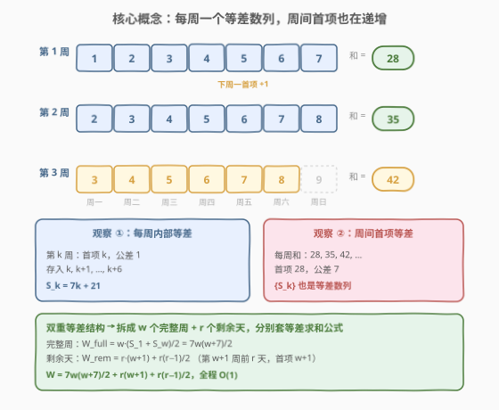
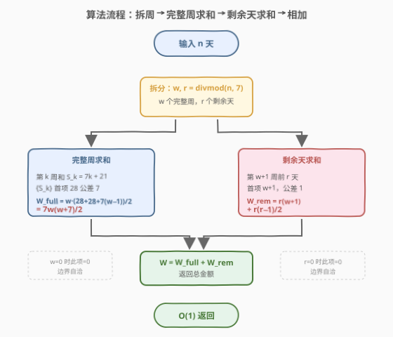
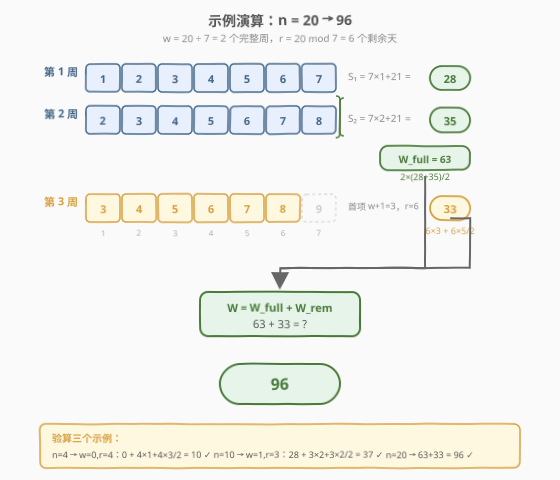

# LeetCode 力扣银行中的钱数 题解

## 1. 题目概述

- **标题 / 题号**：力扣银行中的钱数（#1716，easy）
- **链接**：https://leetcode.cn/problems/calculate-money-in-leetcode-bank/
- **难度**：简单
- **标签**：数学

**题意**：Hercy 想要为他的第一辆车存钱。他每天都向**力扣银行**存钱，规则如下：

- 他从某个**星期一**开始存钱，第一天（星期一）存入 **$1**。
- 从星期二到星期日，每天比前一天**多存 $1**。
- 在接下来的每一个星期一，他比**上一个星期一**多存 $1$。

给定整数 `n`，表示他存钱的**总天数**，返回 `n` 天后他在银行里的**总金额**。

**示例 1**：

```text
输入：n = 4
输出：10
解释：第 4 天是星期四，存入序列为 1 + 2 + 3 + 4 = 10。
```

**示例 2**：

```text
输入：n = 10
输出：37
解释：第 10 天是下个星期三。
      第 1 周：1 + 2 + 3 + 4 + 5 + 6 + 7 = 28
      第 2 周前 3 天：2 + 3 + 4 = 9
      总计 28 + 9 = 37。
```

**示例 3**：

```text
输入：n = 20
输出：96
解释：第 20 天是第 3 周的第 6 天（星期六）。
      第 1 周：1+2+3+4+5+6+7 = 28
      第 2 周：2+3+4+5+6+7+8 = 35
      第 3 周前 6 天：3+4+5+6+7+8 = 33
      总计 28 + 35 + 33 = 96。
```

**约束**：

- $1 \le n \le 1000$

> 💡 **关键观察**：$n \le 1000$ 很小，连 $O(n)$ 逐天模拟都能轻松通过。但存钱序列有**强规律性**——每周是一个等差数列、每周之间首项也在递增——因此可用数学公式 $O(1)$ 直接算出答案。

## 2. 解题思路

### 2.1 暴力思路：逐天模拟

最直观的做法是按天模拟：用一个变量 `monday_start` 记录本周一的存钱额，用 `cur` 记录今天的存钱额，每过一天 `cur += 1`，每过一周（第 7 天结束）让 `monday_start += 1` 并把 `cur` 重置为 `monday_start`。

```text
ans = 0
monday_start = 1
cur = 1
for day in 1..n:
    ans += cur
    cur += 1
    if day % 7 == 0:        # 一周结束，下周一比本周一多 1
        monday_start += 1
        cur = monday_start
return ans
```

时间复杂度 $O(n)$，$n \le 1000$ 时仅 1000 次加法，**完全够用**。但存钱序列结构高度规整，完全可以提炼出闭式公式做到 $O(1)$。

### 2.2 核心观察：完整周 + 剩余天，等差数列求和



把 `n` 天拆成 **`w = n // 7` 个完整周** + **`r = n % 7` 个剩余天**。整个存钱序列可看作一个**双重等差结构**：

1. **每周内部**是公差为 $1$ 的等差数列。第 $k$ 周（$k$ 从 $1$ 开始）周一存入 $k$，周日存入 $k+6$，该周一周总和为：

$$
S_k = 7k + (0+1+2+3+4+5+6) = 7k + 21
$$

2. **周与周之间**首项也在递增：第 $k$ 周的首项是 $k$，第 $k+1$ 周的首项是 $k+1$，故 $\{S_k\}$ 本身又是公差为 $7$ 的等差数列：

$$
S_1=28,\quad S_2=35,\quad S_3=42,\quad \dots,\quad S_k = 28 + 7(k-1)
$$

于是 $w$ 个完整周的总和（首项 $S_1=28$、末项 $S_w=28+7(w-1)$、项数 $w$）：

$$
W_{\text{full}} = \frac{w \cdot \big(S_1 + S_w\big)}{2} = \frac{w \cdot \big(28 + 28 + 7(w-1)\big)}{2} = \frac{w \cdot (49 + 7(w-1))}{2} = \frac{7w(w+7)}{2}
$$

> 💡 等价地用 $\sum_{k=1}^{w}(7k+21) = 7\cdot\frac{w(w+1)}{2} + 21w = \frac{7w(w+1)}{2} + \frac{42w}{2} = \frac{7w(w+1)+42w}{2} = \frac{7w(w+7)}{2}$，殊途同归。

3. **剩余 $r$ 天**属于第 $w+1$ 周，首项为 $w+1$，是首项 $w+1$、公差 $1$、项数 $r$ 的等差数列：

$$
W_{\text{rem}} = r \cdot (w+1) + \frac{r(r-1)}{2}
$$

最终答案：

$$
\boxed{\,W = \frac{7w(w+7)}{2} + r(w+1) + \frac{r(r-1)}{2}\,,\quad w=\left\lfloor n/7 \right\rfloor,\ r=n \bmod 7\,}
$$

> ⚠️ **边界自查**：当 $n < 7$ 时 $w=0$，$W_{\text{full}}=0$，只剩剩余天项，公式仍成立（此时第 $1$ 周首项为 $1=w+1$）。当 $n$ 是 $7$ 的倍数时 $r=0$，$W_{\text{rem}}=0$，只剩完整周项。两种极端都被闭式公式自然覆盖，无需特判。

### 2.3 算法流程图



**步骤**：

1. **拆分**：$w = \lfloor n / 7 \rfloor$，$r = n \bmod 7$。
2. **完整周求和**：$W_{\text{full}} = \dfrac{7w(w+7)}{2}$（首项 $28$、末项 $28+7(w-1)$、项数 $w$ 的等差数列和）。
3. **剩余天求和**：$W_{\text{rem}} = r(w+1) + \dfrac{r(r-1)}{2}$（首项 $w+1$、公差 $1$、项数 $r$ 的等差数列和）。
4. **返回** $W_{\text{full}} + W_{\text{rem}}$。

> 💡 **为什么不必取整担心**：$7w(w+7)$ 中 $w$ 与 $w+7$ 必有一个偶数，故 $7w(w+7)$ 恒为偶数，除以 $2$ 必为整数；$r(r-1)$ 是相邻两数之积也恒为偶数。两个分数项都整数化，结果无小数。

### 2.4 示例演算

以 $n = 20$ 为例（$w = 2$ 个完整周 + $r = 6$ 个剩余天）：



**完整周**：

| 第 $k$ 周 | 周一首项 | 周日末项 | 该周和 $S_k = 7k + 21$ |
|-----------|---------|---------|------------------------|
| $k=1$ | $1$ | $7$ | $7\times1+21 = 28$ |
| $k=2$ | $2$ | $8$ | $7\times2+21 = 35$ |

$$
W_{\text{full}} = \frac{2 \times (28+35)}{2} = 63 \quad \text{（或 } \frac{7\times2\times9}{2}=63\text{）}
$$

**剩余 $6$ 天**（第 $3$ 周，首项 $w+1=3$，存入 $3,4,5,6,7,8$）：

$$
W_{\text{rem}} = 6 \times 3 + \frac{6 \times 5}{2} = 18 + 15 = 33
$$

**总计**：

$$
W = 63 + 33 = 96
$$

> 💡 **验算三个示例**：$n=4 \Rightarrow w=0,r=4$：$0 + 4\times1 + \frac{4\times3}{2} = 4+6 = 10$ ✓；$n=10 \Rightarrow w=1,r=3$：$\frac{7\times1\times8}{2} + 3\times2 + \frac{3\times2}{2} = 28+6+3 = 37$ ✓；$n=20 \Rightarrow 63+33 = 96$ ✓。

## 3. 参考代码

### Python（$O(1)$ 数学公式）

```python
class Solution:
    def totalMoney(self, n: int) -> int:
        w, r = divmod(n, 7)          # w 个完整周，r 个剩余天
        full = 7 * w * (w + 7) // 2  # w 个完整周的等差求和
        rem = r * (w + 1) + r * (r - 1) // 2  # 剩余 r 天的等差求和
        return full + rem
```

### Python（$O(n)$ 逐天模拟，对照写法）

```python
class Solution:
    def totalMoney(self, n: int) -> int:
        ans = 0
        monday_start = 1
        cur = 1
        for day in range(n):
            ans += cur
            cur += 1
            if day % 7 == 6:          # 一周结束（第 7,14,... 天）
                monday_start += 1
                cur = monday_start
        return ans
```

### C++（$O(1)$ 数学公式）

```cpp
class Solution {
  public:
    int totalMoney(int n) {
        int w = n / 7, r = n % 7;
        int full = 7 * w * (w + 7) / 2;              // 完整周求和
        int rem = r * (w + 1) + r * (r - 1) / 2;     // 剩余天求和
        return full + rem;
    }
};
```

> ⚠️ **实现细节**：① `divmod` / `n / 7, n % 7` 一次拿到 $w$ 和 $r$。② 完整周用 $7w(w+7)/2$ 形式，注意 `7 * w * (w + 7)` 在 $w \le 142$（$n \le 1000$）时最大约 $7\times142\times149 \approx 1.5\times10^5$，远在 `int` 范围内，无需 `long long`。③ `r * (r - 1) / 2` 中 `r-1` 可能为 $0$（$r=1$ 时），结果 $0$ 正确（只存一天即首项）。④ 模拟写法中 `day % 7 == 6`（0-indexed 的第 6 天即第 7 天）触发周一重置，比 `day % 7 == 0` 更直观地表达「一周最后一天」。

> 💡 **两种写法怎么选？** 面试中先说 $O(n)$ 模拟把题做对、讲清规律，再提炼出 $O(1)$ 公式展示数学化简能力。$n \le 1000$ 时两者运行时间几乎无差别，但 $O(1)$ 公式体现了「识别等差数列」的洞察，是本题的加分项。

## 4. 复杂度分析

| 维度 | 复杂度 | 说明 |
|------|--------|------|
| 时间复杂度 | $O(1)$ | 一次除法 + 两次乘除即可算出闭式结果，与 $n$ 无关 |
| 空间复杂度 | $O(1)$ | 只用常数个变量 |

> ⚠️ 逐天模拟版为 $O(n)$ 时间 / $O(1)$ 空间，$n \le 1000$ 时同样轻松通过；公式版把 $O(n)$ 降为 $O(1)$，体现了「等差数列求和」的数学化简。

## 5. 扩展：双重等差结构的通项与求和

本题存钱序列 $a_1, a_2, \dots, a_n$ 的**通项**也可直接写出。第 $d$ 天（$d$ 从 $1$ 开始）位于第 $\lceil d/7 \rceil$ 周、是该周的第 $((d-1) \bmod 7)+1$ 天，故：

$$
a_d = \left\lceil \frac{d}{7} \right\rceil + \big((d-1) \bmod 7\big)
$$

即「所在周序号 + 周内偏移」。例如 $d=20$：第 $\lceil 20/7\rceil = 3$ 周，$(20-1)\bmod 7 = 5$（第 6 天，偏移 $5$），$a_{20} = 3+5 = 8$ ✓。

用通项求和：$W = \sum_{d=1}^{n} a_d = \sum_{d=1}^{n}\left\lceil d/7 \right\rceil + \sum_{d=1}^{n}\big((d-1)\bmod 7\big)$。后者是 $0,1,\dots,6$ 循环，$w$ 个完整循环之和为 $21w$，剩余 $r$ 项之和为 $r(r-1)/2$；前者是 $1$ 出现 $7$ 次、$2$ 出现 $7$ 次……的阶梯求和，化简后同样得到 $7w(w+7)/2$。这给出公式的另一条推导路径，殊途同归。

> 💡 **核心洞察**：识别「双重等差」（每周内部等差 + 周间首项等差）是把 $O(n)$ 降为 $O(1)$ 的关键。一旦看出 $\{S_k\}$ 是公差 $7$ 的等差数列，求和就只是套用等差数列求和公式。

## 6. 面试要点

1. **为什么能 $O(1)$？等差数列在哪一层？**

   > 两层：① 每周内部是公差 $1$ 的等差数列，第 $k$ 周和 $S_k = 7k+21$；② $\{S_k\}$ 本身是公差 $7$ 的等差数列（$28, 35, 42, \dots$）。完整周用等差求和 $w(S_1+S_w)/2$，剩余天再单独算一个短等差数列，全程 $O(1)$。

2. **剩余天公式 $r(w+1) + r(r-1)/2$ 怎么来的？**

   > 剩余 $r$ 天是第 $w+1$ 周的前 $r$ 天，首项 $w+1$、公差 $1$、项数 $r$。等差数列和 $= r \times \text{首项} + r(r-1)/2 \times \text{公差} = r(w+1) + r(r-1)/2$。当 $r=0$ 时此式为 $0$，自然不贡献。

3. **$n < 7$ 时公式还成立吗？需要特判吗？**

   > 成立，无需特判。$n<7 \Rightarrow w=0, r=n$：$W_{\text{full}} = 0$，$W_{\text{rem}} = n\times1 + n(n-1)/2 = 1+2+\dots+n$，正是第 $1$ 周前 $n$ 天的存入和。闭式公式在 $w=0$ 和 $r=0$ 两个边界都自洽。

4. **逐天模拟和公式法，面试怎么取舍？**

   > 先讲模拟（清晰、不易错、快速 AC 建立信心），再指出序列的等差规律、化简到 $O(1)$ 公式展示洞察力。$n \le 1000$ 时性能无差异，但公式法体现「识别数学结构」的能力，是本题的亮点。

5. **如果规则改成「每个星期一比上周一多存 $x$ 元」（而非固定 $1$），公式怎么推广？**

   > 第 $k$ 周首项变为 $1+(k-1)x$，该周和 $S_k = 7(1+(k-1)x)+21 = 7(k-1)x + 28$，仍是公差 $7x$ 的等差数列。完整周和 $= w(S_1+S_w)/2 = w(28 + 28+7x(w-1))/2$，剩余天首项 $1+wx$、和 $= r(1+wx)+r(r-1)/2$。把 $x$ 参数代入即可，结构不变。

> 💡 **一句话总结**：$n$ 天拆成 $w$ 个完整周 + $r$ 个剩余天；每周和 $\{S_k\}$ 是公差 $7$ 的等差数列，套求和公式得 $7w(w+7)/2$；剩余天再算一个短等差数列，全程 $O(1)$。

## 同类练习题

| # | 题目 | 与本题的关联 |
|---|------|-------------|
| 258 | [各位相加](https://leetcode.cn/problems/add-digits/) | 数学规律化简迭代为 $O(1)$ 公式，对照「识别数论结构降复杂度」 |
| 292 | [Nim 游戏](https://leetcode.cn/problems/nim-game/) | 博弈结论用 $O(1)$ 公式判定，对照「规律提炼到闭式」 |
| 168 | [Excel 表列名称](https://leetcode.cn/problems/excel-sheet-column-title/)（[题解](../0101-0200/168_Excel表列名称.md)） | 1-indexed 进制转换的数学化简，与本题「按周期分层求和」同为数学型简单题 |
| 171 | [Excel 表列序号](https://leetcode.cn/problems/excel-sheet-column-number/)（[题解](../0101-0200/171_Excel表列序号.md)） | 168 的合成方向，Horner 累乘加，对照「数学公式 $O(n)$ 一次遍历」 |
| 172 | [阶乘后的零](https://leetcode.cn/problems/factorial-trailing-zeroes/)（[题解](../0101-0200/172_阶乘后的零.md)） | 勒让德公式 $O(\log n)$，对照「识别数学结构降幂枚举维度」 |
