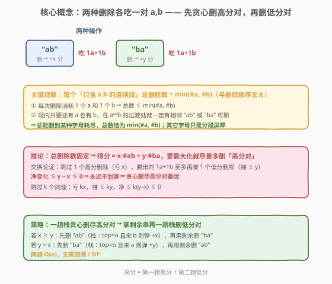
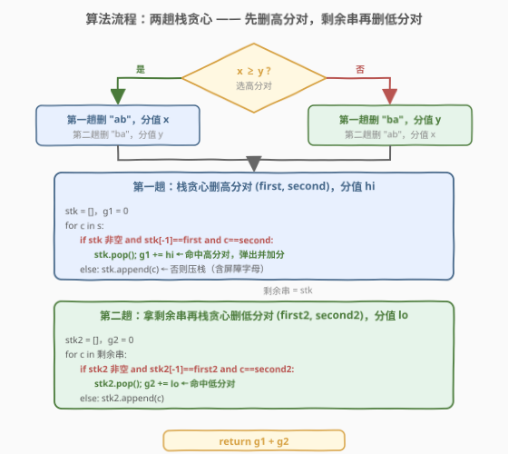
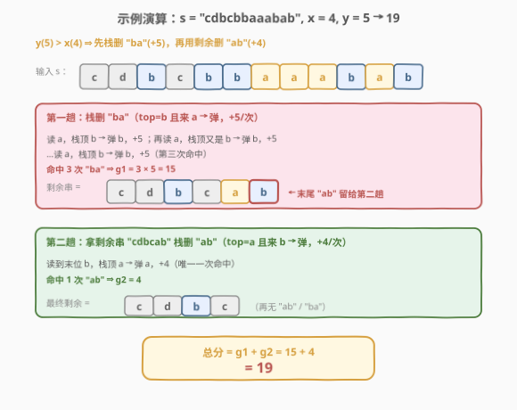

# 删除子字符串的最大得分

- **题目名称**：删除子字符串的最大得分
- **链接**：[1717. 删除子字符串的最大得分](https://leetcode.cn/problems/maximum-score-from-removing-substrings/)
- **难度**：中等
- **标签**：栈、贪心、字符串

## 1. 题目概述

给定字符串 `s` 和两个整数 `x`、`y`，可任意次执行两种操作：

- 删除子字符串 `"ab"` 获得 `x` 分；
- 删除子字符串 `"ba"` 获得 `y` 分。

每次删除后字符串前后拼接（收缩）。求能获得的最大得分。

**示例 1**：

```text
输入：s = "cdbcbbaaabab", x = 4, y = 5
输出：19
解释：依次删 ba(+5) → ab(+4) → ba(+5) → ba(+5) = 19
```

**示例 2**：

```text
输入：s = "aabbaaxybbaabb", x = 5, y = 4
输出：20
```

**约束条件**：

- $1 \le \text{s.length} \le 10^5$
- $1 \le x, y \le 10^4$
- `s` 只包含小写英文字母

> 💡 **关键点**：`s` 不止含 `a`/`b`，其它字母不参与任何删除，只起「屏障」作用，把串切成若干个只含 `a`、`b` 的连续段——每段独立处理即可。

---

## 2. 解题思路

### 2.1 暴力思路：枚举删除顺序

每次扫描找一个 `"ab"` 或 `"ba"` 删除，不同选择构成搜索树；用 DFS/BFS 枚举所有顺序取最大得分。但每删一步串就变一次，分支极多，且同一局面可由不同路径达到——指数级，$n=10^5$ 完全不可行。

需要抓住「两种操作本质上消耗相同资源」这一结构。

### 2.2 核心观察：两种删除各吃一对 a,b，总数固定 → 贪心删高分对



**两层观察**：

1. **资源同构**。`"ab"` 和 `"ba"` 都由一个 `a` 和一个 `b` 组成，每次删除都消耗「一对 `a`、`b`」。非 `a`/`b` 字母无法被删，仅作分段屏障。

2. **每段总删除数固定为 $\min(\#a, \#b)$**。在任一仅含 `a`、`b` 的连续段内：
   - **上界**：每次删除消耗 $1$ 个 `a` 和 $1$ 个 `b`，故总删除数 $\le \min(\#a, \#b)$。
   - **下界可达**：只要段内还有 `a` 也有 `b`，在某个 `a`↔`b` 的**过渡处**就一定存在相邻的 `"ab"` 或 `"ba"` 可删；反复删除直到某一种字母耗尽，恰好删 $\min(\#a, \#b)$ 次。

   于是**总删除数与删除顺序无关**，是一个定值。

**推论**：设删了 $A$ 个 `"ab"`、$B$ 个 `"ba"`，则 $A+B=\min(\#a,\#b)$（逐段求和）固定，得分 $=xA+yB = y\cdot\text{总数}+(x-y)A$。要最大化得分，只需**最大化高分对的删除次数**。

**交换论证（贪心正确性）**：假设 $x\ge y$（`"ab"` 更值钱）。若跳过 $1$ 个本可删的 `"ab"`（亏 $x$），腾出的 $1$ 个 `a` 和 $1$ 个 `b` **至多**再凑成 $1$ 个额外的 `"ba"`（赚 $\le y\le x$），净变化 $\le y-x\le 0$，不划算。跳过 $k$ 个同理，净 $\le k(y-x)\le 0$。故**永不跳过高分删除**最优 ⇒ 贪心删尽高分对，再用剩余删低分对。

> 💡 **一句话**：总数固定 ⇒ 把删除「名额」尽可能分给分值高的那种。栈贪心一趟删尽高分对，剩余串再删低分对。

> ⚠️ **为何贪心栈删的是「最大数量」的高分对？** 栈在遇到可删对时立即弹出，删完一趟后栈内再无该相邻对（如删 `"ab"` 后，每段呈 `b* a*` 形态，`a` 全在 `b` 之后）。这种「即时删除」只会把两侧字符拉近、至多创造新机会，不会破坏其它可删对，故达到最大计数。

### 2.3 算法流程图



**步骤**：

1. **定优先级**：若 $x\ge y$，高分对为 `"ab"`（`first='a', second='b', hi=x`），低分对为 `"ba"`；否则互换。
2. **第一趟（栈删高分对）**：维护栈 `stk`、计数 `g1`。遍历 `s`：
   - 若 `stk` 非空且 `stk[-1]==first` 且 `c==second`：`stk.pop()`，`g1 += hi`；
   - 否则 `stk.append(c)`。
   遍历结束，`stk` 即剩余串。
3. **第二趟（栈删低分对）**：以 `stk`（剩余串）为输入，用低分对 `(first2, second2, lo)` 重复步骤 2，得 `g2`。
4. **返回** `g1 + g2`。

> 💡 **屏障字母自然处理**：非 `a`/`b` 字母压栈后隔开两端，不会误删跨段对；两趟栈都 $O(n)$，无需显式分段。

### 2.4 示例演算

以示例 1 `s="cdbcbbaaabab", x=4, y=5` 为例。$y>x$ ⇒ 先栈删 `"ba"`（`+5`），再用剩余删 `"ab"`（`+4`）。



**第一趟：删 `"ba"`（栈顶 `b` 且来 `a` 则弹，`+5`）**

| 读入 | 栈顶 | 动作 | 栈状态 | 得分 |
|------|------|------|--------|------|
| c | — | 压 | c | 0 |
| d | c | 压 | c d | 0 |
| b | d | 压 | c d b | 0 |
| c | b | 压 | c d b c | 0 |
| b | c | 压 | c d b c b | 0 |
| b | b | 压 | c d b c b b | 0 |
| a | b | **弹 b，+5** | c d b c b | 5 |
| a | b | **弹 b，+5** | c d b c | 10 |
| a | c | 压 | c d b c a | 10 |
| b | a | 压 | c d b c a b | 10 |
| a | b | **弹 b，+5** | c d b c a | 15 |
| b | a | 压 | c d b c a b | 15 |

剩余串 = `cdbcab`，`g1 = 15`。

**第二趟：删 `"ab"`（栈顶 `a` 且来 `b` 则弹，`+4`），输入 `cdbcab`**

| 读入 | 栈顶 | 动作 | 栈状态 | 得分 |
|------|------|------|--------|------|
| c | — | 压 | c | 0 |
| d | c | 压 | c d | 0 |
| b | d | 压 | c d b | 0 |
| c | b | 压 | c d b c | 0 |
| a | c | 压 | c d b c a | 0 |
| b | a | **弹 a，+4** | c d b c | 4 |

`g2 = 4`，最终 `g1 + g2 = 19`。

---

## 3. 参考代码

### Python

```python
class Solution:
    def maximumGain(self, s: str, x: int, y: int) -> int:
        # 一趟栈贪心：删 (first, second) 相邻对，每删一个得 score 分
        # 返回 (得分, 剩余串)
        def remove_pair(st, first, second, score):
            stk = []
            gain = 0
            for c in st:
                if stk and stk[-1] == first and c == second:
                    stk.pop()
                    gain += score
                else:
                    stk.append(c)
            return gain, stk

        if x >= y:                       # ab 更值钱，先删 ab
            g1, rest = remove_pair(s, 'a', 'b', x)
            g2, _    = remove_pair(rest, 'b', 'a', y)
        else:                            # ba 更值钱，先删 ba
            g1, rest = remove_pair(s, 'b', 'a', y)
            g2, _    = remove_pair(rest, 'a', 'b', x)
        return g1 + g2
```

### C++

```cpp
class Solution {
  public:
    int maximumGain(string s, int x, int y) {
        // 一趟栈贪心：返回 (得分, 剩余串)
        auto removePair = [](const string& st, char first, char second, int score) {
            string stk;
            int gain = 0;
            for (char c : st) {
                if (!stk.empty() && stk.back() == first && c == second) {
                    stk.pop_back();
                    gain += score;
                } else {
                    stk.push_back(c);
                }
            }
            return make_pair(gain, stk);
        };

        if (x >= y) {                    // ab 更值钱，先删 ab
            auto p1 = removePair(s, 'a', 'b', x);
            auto p2 = removePair(p1.second, 'b', 'a', y);
            return p1.first + p2.first;
        } else {                         // ba 更值钱，先删 ba
            auto p1 = removePair(s, 'b', 'a', y);
            auto p2 = removePair(p1.second, 'a', 'b', x);
            return p1.first + p2.first;
        }
    }
};
```

> ⚠️ **实现细节**：① 第二趟的输入是第一趟的**栈内容（剩余串）**，直接作为列表/字符串再跑一次栈即可，无需还原成原串。② 栈用 `list`/`string` 均可，`[-1]`/`back()` 取栈顶。③ `s` 含非 `a`/`b` 字母时压栈充当屏障，无需特判。④ 两趟各 $O(n)$，空间 $O(n)$（栈）。

> 💡 **也可用「双指针原地写 + 计数」做到 $O(1)$ 额外空间**：第一趟不用真栈，而是用一个写指针在原串/数组上原地模拟弹出（命中则 `w--`，否则 `s[w++]=c`）；但可读性远不如栈版本，面试中栈版即可。

---

## 4. 复杂度分析

| 维度 | 复杂度 | 说明 |
|------|--------|------|
| 时间复杂度 | $O(n)$ | 两趟遍历，每趟每个字符入栈/出栈至多一次，均摊 $O(1)$ |
| 空间复杂度 | $O(n)$ | 栈最坏存 $n$ 个字符（如全屏障字母） |

> ⚠️ 暴力枚举删除顺序是指数级；栈贪心把「反复收缩」压缩成两趟线性扫描，关键在于认识到总删除数固定、只需偏袒高分对。

---

## 5. 扩展：为何不能「同时贪心」两种对？

有人会想：一趟扫描里遇到 `"ab"` 删 `"ab"`、遇到 `"ba"` 删 `"ba"`，按当前谁值钱删谁，岂不更省事？问题在于**删除会改变后续相邻关系**：一次 `"ab"` 删除可能把其后方的 `b` 与更后的 `a` 拼成新的 `"ba"`，反之亦然。一趟里「即时决策」很难保证全局高分对数量最大——某处删个低分对可能吃掉本可留给高分对的资源。

而「先一趟删尽高分对、再一趟删低分对」的**两趟分离**做法，由交换论证保证了第一趟删的是**最大数量**的高分对（跳过必亏），第二趟在剩余定局上再取低分对，互不干扰。这正是把「资源争用」化作「先占贵的、后补便宜的」的贪心范式。

> 💡 **贪心顺序无关乎「先删左还是先删右」**：栈一趟扫描会自然处理所有可删位置（即时弹出 + 收缩），无需关心删除的左右先后；要紧的只有「先删哪一种模式」，即高分对优先。

---

## 6. 面试要点

1. **为什么先删高分对一定最优？**

   > 两种对都消耗一对 `a`、`b`，每段总删除数固定为 $\min(\#a,\#b)$。跳过 1 个高分对（亏 $x$）腾出的资源至多换 1 个低分对（赚 $\le y\le x$），净 $\le 0$。故把名额尽量给高分对最优。

2. **总删除数为什么是 $\min(\#a,\#b)$？「与顺序无关」怎么证？**

   > 上界：每删一次消耗 1 个 `a`、1 个 `b`。下界：段内只要 `a`、`b` 都还在，`a`↔`b` 过渡处必有相邻 `"ab"` 或 `"ba"` 可删，可一直删到某种耗尽。故恰为 $\min(\#a,\#b)$，与顺序无关。

3. **栈为什么能做到「最大数量」的高分对删除？**

   > 栈即时弹出可删对，删完一趟栈内再无该相邻对（删 `"ab"` 后段呈 `b* a*`）。即时删除只拉近两侧字符、至多创造新机会，不破坏其它可删对，故达最大计数。

4. **非 `a`/`b` 字母怎么处理？需要预先分段吗？**

   > 不用。它们压栈后充当屏障，天然隔断跨段误删。两趟栈都自动处理，无需显式切分。

5. **第二趟为什么作用在「剩余串」上而不是原串？**

   > 第一趟已删尽高分对，剩余串是定局。低分对只能在这之上再抠。若回原串重删会破坏第一趟成果、重复计数。剩余串即第一趟的栈内容，直接复用即可。

6. **时间/空间复杂度？能否 $O(1)$ 空间？**

   > 两趟 $O(n)$ 时间、$O(n)$ 空间（栈）。可改用「双指针原地写 + 计数」做到 $O(1)$ 额外空间，但牺牲可读性，面试栈版足够。

> 💡 **一句话总结**：两种删除吃同样的资源（一对 `a`、`b`），每段总删除数固定 ⇒ 把名额尽量分给高分对；栈一趟删尽高分对、剩余串再删低分对，两趟 $O(n)$。

---

## 7. 同类练习题

- [1047. 删除字符串中的所有相邻重复项](https://leetcode.cn/problems/remove-all-adjacent-duplicates-in-string/)（[题解](../1001-1100/1047_删除字符串中的所有相邻重复项.md)）：栈即时弹出相邻同字符，本题栈机制的母题
- [1003. 检查替换后的词是否有效](https://leetcode.cn/problems/check-if-word-is-valid-after-substitutions/)（[题解](../1001-1100/1003_检查替换后的词是否有效.md)）：栈判断能否删尽 `"abc"`，相邻模式删除的判定变体
- [1209. 删除字符串中的所有相邻重复项 II](https://leetcode.cn/problems/remove-all-adjacent-duplicates-in-string-ii/)：栈 + 计数桶删 k 个相邻同字符，栈删相邻对的进阶
- [735. 行星碰撞](https://leetcode.cn/problems/asteroid-collision/)（[题解](../0701-0800/735_行星碰撞.md)）：栈模拟相邻碰撞抵消，对照「栈处理相邻抵消」范式
- [680. 验证回文串 II](https://leetcode.cn/problems/valid-palindrome-ii/)：双指针 + 至多删一次的局部决策，对照「单次删除」与「反复收缩」的差异
