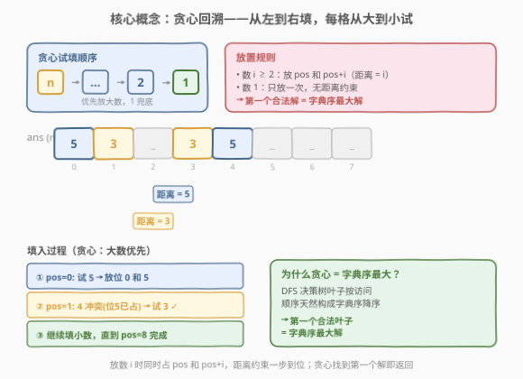

# LeetCode 构建字典序最大的可行序列 题解

## 1. 题目概述

- **标题 / 题号**：构建字典序最大的可行序列（#1718，medium）
- **链接**：https://leetcode.cn/problems/construct-the-lexicographically-largest-valid-sequence/
- **难度**：中等
- **标签**：回溯、贪心、数组

**题意**：给定一个整数 `n`，构造一个长度为 $2n - 1$ 的序列，满足：

- 整数 $1$ 在序列中**只出现一次**。
- 整数 $2$ 到 $n$ 每个都**恰好出现两次**。
- 对于每个 $2 \le i \le n$，两个 $i$ 之间出现的**距离恰好为 $i$**（即若一个 $i$ 在下标 $p$，另一个在下标 $q$，则 $|p - q| = i$）。

返回满足条件的**字典序最大**的序列。题目保证在给定限制下一定存在解。

**示例 1**：

```text
输入：n = 3
输出：[3,1,2,3,2]
解释：[2,3,2,1,3] 也是一个可行序列，但 [3,1,2,3,2] 字典序更大。
```

**示例 2**：

```text
输入：n = 5
输出：[5,3,1,4,3,5,2,4,2]
```

**约束**：

- $1 \le n \le 20$

> 💡 **关键观察**：序列长度固定为 $2n - 1$（$1$ 出现 $1$ 次，$2 \dots n$ 各出现 $2$ 次，共 $1 + 2(n-1) = 2n-1$）。$n \le 20$ 意味着序列最长 $39$，搜索空间虽大但约束极强——每个数 $i$ 的两个副本必须相距 $i$，这把放置选项压缩到极少，使得回溯配合贪心剪枝即可高效求解。

## 2. 解题思路

### 2.1 暴力思路：枚举全排列逐一校验

最直觉的做法是：生成多重集 $\{1, 2, 2, 3, 3, \ldots, n, n\}$ 的所有排列（共 $\frac{(2n-1)!}{2^{n-1}}$ 种），对每种排列检查距离约束，再取字典序最大者。

- $n = 5$ 时，排列数 $= \frac{9!}{2^4} = 22680$，尚可枚举。
- $n = 20$ 时，排列数约 $\frac{39!}{2^{19}} \approx 4 \times 10^{44}$，完全不可行。

> ⚠️ **症结**：暴力枚举了大量不满足距离约束的排列。关键在于**边构造边校验**——在放置每个数的时候就检查约束，一旦冲突立即回溯，把搜索树在浅层就剪掉。

### 2.2 核心观察：贪心回溯（从大到小试填）



本题有两个关键洞察：

**洞察 1：贪心保证字典序最大。**

字典序的比较规则是：从左到右找第一个不同的位置，该位置数字大的序列更大。因此，要让序列字典序最大，应该**从左到右逐位填，每位尽量填最大的数**。

具体做法：用 DFS 从位置 $0$ 开始扫描，遇到空位时**从 $n$ 到 $1$ 依次尝试**。一旦某个尝试能成功填完整个序列，就立即返回——因为我们在每个位置都优先选了更大的数，**第一个找到的解就是字典序最大的解**。

> 💡 **为什么第一个找到的解就是字典序最大？** DFS 按「位置 $0$ 尽量大 → 位置 $1$ 尽量大 → …」的顺序探索决策树。决策树的叶子按 DFS 访问顺序天然构成字典序降序。第一个被访问到的合法叶子，就是字典序最大的合法解。无需枚举所有解再比较。

**洞察 2：距离约束即「一处填，另一处同时锁定」。**

放数 $i$（$i \ge 2$）到位置 `pos` 时，第二个 $i$ 必须在 `pos + i` 处。所以放置 $i$ 等于**同时占两个格子**——`pos` 和 `pos + i`。这带来两层效果：

- **强剪枝**：只有当 `pos + i` 在界内且为空时，$i$ 才是合法候选，大数往往因 `pos + i` 越界或冲突而被快速排除。
- **跳过已填位**：DFS 扫描到已被「提前锁定」的位置时直接跳过，不需要再选数。

> ⚠️ **数 $1$ 的特殊性**：$1$ 只出现一次，无距离约束，放任意空位即可。它是最后的「兜底候选」——当大数都放不下时，$1$ 总能填入当前空位。这也保证了解一定存在（题目已保证）。

### 2.3 算法流程图


**步骤**：

1. **初始化**：`ans` 数组长度 $2n - 1$，全填 $0$（$0$ 表示空位）；`used` 布尔数组长度 $n + 1$，全 `false`。
2. **DFS(pos)**：
   - 若 `pos == 2n - 1`：所有位置已填，返回 `True`。
   - 若 `ans[pos] != 0`：该位已被提前锁定，跳到 `dfs(pos + 1)`。
   - **从 $n$ 到 $1$ 依次尝试**数 $i$：
     - 若 `used[i]` 为 `True`，跳过。
     - 若 $i = 1$：在 `pos` 放 $1$，标记 `used[1] = True`，递归 `dfs(pos + 1)`。成功则返回 `True`；否则撤销。
     - 若 $i \ge 2$：检查 `pos + i < 2n - 1` 且 `ans[pos + i] == 0`。满足则在 `pos` 和 `pos + i` 同时放 $i$，标记 `used[i] = True`，递归 `dfs(pos + 1)`。成功则返回 `True`；否则撤销。
   - 所有数都试过仍无解，返回 `False`。
3. **返回** `ans`。

> 💡 **跳过已填位的设计精妙**：放数 $i$ 时锁定了 `pos + i`，后续 DFS 自然跳过该位。这把「距离约束的检查」隐式融入了扫描过程——不需要单独验证整个序列，放置时检查一次即可。

### 2.4 示例演算

以 $n = 3$ 为例，序列长度 $= 5$，逐步追踪贪心回溯过程：

![示例演算：n=3 → [3,1,2,3,2]](../images/1718_example_walkthrough.svg)

| 步骤 | 位置 `pos` | 尝试 | 操作 | `ans` 状态 | 说明 |
|------|-----------|------|------|-----------|------|
| ① | 0 | $3$ | 放 $3$ 于位 $0$ 和 $3$ | `[3, _, _, 3, _]` | 距离 $3 - 0 = 3$ ✓，位 $3$ 锁定 |
| ② | 1 | $2$ | 放 $2$ 于位 $1$ 和 $3$？ | — | 位 $3$ 已被 $3$ 占，**冲突**，跳过 |
| ② | 1 | $1$ | 放 $1$ 于位 $1$ | `[3, 1, _, 3, _]` | $1$ 只放一次 ✓ |
| ③ | 2 | $2$ | 放 $2$ 于位 $2$ 和 $4$ | `[3, 1, 2, 3, 2]` | 距离 $4 - 2 = 2$ ✓，位 $4$ 锁定 |
| ④ | 3 | — | 已填 $3$，跳过 | `[3, 1, 2, 3, 2]` | 跳到 `pos = 4` |
| ⑤ | 4 | — | 已填 $2$，跳过 | `[3, 1, 2, 3, 2]` | 跳到 `pos = 5` |
| ⑥ | 5 | — | `pos == 5 == 2n-1` | `[3, 1, 2, 3, 2]` | **完成！** 返回 ✓ |

> 💡 **对比暴力** $[2, 3, 2, 1, 3]$：贪心回溯在位置 $0$ 就选了 $3$（而非 $2$），因为 $3$ 能成功填完。位置 $0$ 的 $3 > 2$ 直接决定了结果字典序更大。整个过程**无一次回溯**——每步的贪心选择恰好都通向了合法解。

> ⚠️ **并非总是无回溯**：$n = 5$ 时，位置 $0$ 放 $5$ 后，位置 $1$ 尝试 $4$（需放位 $1$ 和 $5$，但位 $5$ 已被 $5$ 占，冲突），转而尝试 $3$（放位 $1$ 和 $4$，成功）。后续也会经历若干次「试大数冲突 → 退而求其次」的过程，但每次退让都是被迫的最小退让，仍保证字典序最大。

## 3. 参考代码

### Python

```python
class Solution:
    def constructDistancedSequence(self, n: int) -> List[int]:
        size = 2 * n - 1
        ans = [0] * size
        used = [False] * (n + 1)

        def dfs(pos: int) -> bool:
            if pos == size:
                return True
            if ans[pos] != 0:               # 已被提前锁定，跳过
                return dfs(pos + 1)
            for i in range(n, 0, -1):        # 从大到小贪心试填
                if used[i]:
                    continue
                if i == 1:
                    ans[pos] = 1
                    used[1] = True
                    if dfs(pos + 1):
                        return True
                    ans[pos] = 0
                    used[1] = False
                else:
                    j = pos + i
                    if j < size and ans[j] == 0:
                        ans[pos] = i
                        ans[j] = i
                        used[i] = True
                        if dfs(pos + 1):
                            return True
                        ans[pos] = 0
                        ans[j] = 0
                        used[i] = False
            return False

        dfs(0)
        return ans
```

### C++

```cpp
class Solution {
public:
    vector<int> constructDistancedSequence(int n) {
        int size = 2 * n - 1;
        vector<int> ans(size, 0);
        vector<bool> used(n + 1, false);
        dfs(ans, used, 0, n, size);
        return ans;
    }

private:
    bool dfs(vector<int>& ans, vector<bool>& used, int pos, int n, int size) {
        if (pos == size) return true;
        if (ans[pos] != 0) return dfs(ans, used, pos + 1, n, size);
        for (int i = n; i >= 1; --i) {       // 从大到小贪心试填
            if (used[i]) continue;
            if (i == 1) {
                ans[pos] = 1;
                used[1] = true;
                if (dfs(ans, used, pos + 1, n, size)) return true;
                ans[pos] = 0;
                used[1] = false;
            } else {
                int j = pos + i;
                if (j < size && ans[j] == 0) {
                    ans[pos] = i;
                    ans[j] = i;
                    used[i] = true;
                    if (dfs(ans, used, pos + 1, n, size)) return true;
                    ans[pos] = 0;
                    ans[j] = 0;
                    used[i] = false;
                }
            }
        }
        return false;
    }
};
```

> ⚠️ **实现细节**：① `dfs` 返回 `bool` 而非收集所有解——找到第一个合法解即返回，这是贪心回溯的核心。② 放数 $i \ge 2$ 时**同时写两个位置** `ans[pos]` 和 `ans[j]`，撤销时也要**同时清两个**。③ `ans[pos] != 0` 的跳过逻辑不可省——不放它的话，被提前锁定的位置会被当作空位重复处理。④ 循环 `range(n, 0, -1)` / `for (int i = n; i >= 1; --i)` 保证从大到小试，是字典序最大的保证。

> 💡 **为什么不用 `path` 数组收集结果？** 与 [46. 全排列](../0001-0100/46_全排列.md) 不同，本题的 `ans` 数组本身就是结果——位置有物理含义（下标对应序列位置），不需要额外 `path`。填完后 `ans` 即为答案，无需拷贝。

## 4. 复杂度分析

| 维度 | 复杂度 | 说明 |
|------|--------|------|
| 时间复杂度 | $O(n^{2n})$（最坏）；实际极快 | 最坏每个空位试 $n$ 个数，共 $2n - 1$ 位。但距离约束把大数的候选压到极少，贪心找到第一个解即停，$n = 20$ 实测毫秒级 |
| 空间复杂度 | $O(n)$ | `ans` 数组 $O(n)$ + `used` 数组 $O(n)$ + 递归栈深 $O(n)$，总计 $O(n)$ |

> ⚠️ **最坏与实际的差距**：最坏上界 $n^{2n}$ 是极松的——假设每个位置都有 $n$ 种选择且无剪枝。实际上，数 $i$ 只能放在满足 `pos + i < 2n - 1` 且 `ans[pos + i] == 0` 的位置，大数的合法位极少。加上贪心找到第一个解就返回（不枚举所有解），实际搜索树极小。$n = 20$ 时 DFS 调用次数通常在数百到数千量级。

## 5. 扩展：为什么贪心回溯一定返回字典序最大？

### 5.1 决策树上的字典序遍历

把构造序列的过程建模为一棵**决策树**：

- 第 $k$ 层对应序列的第 $k$ 个空位。
- 每个节点的子节点按「从大到小」排列——第一个子节点对应放最大的可用数，最后一个对应放最小的。
- 从根到叶子的路径 = 一个完整序列。

DFS 按子节点的排列顺序访问，因此**第一个被访问到的合法叶子，就是所有合法叶子中字典序最大的**。

### 5.2 形式化论证

**定理**：贪心回溯（从 $n$ 到 $1$ 试填）返回的序列是字典序最大的合法序列。

**证明**（反证）：设贪心回溯返回序列 $A = [a_0, a_1, \ldots]$，假设存在另一个合法序列 $B = [b_0, b_1, \ldots]$ 且 $B$ 字典序更大。设 $A$ 和 $B$ 第一个不同的位置为 $p$，则 $b_p > a_p$。

在 DFS 填位置 $p$ 时，算法从 $n$ 到 $1$ 依次尝试。$b_p > a_p$ 意味着 $b_p$ 比 $a_p$ 更先被尝试。算法选择了 $a_p$ 说明 $b_p$ 在位置 $p$ 时**无法完成填空**（递归返回 `False`）。但 $B$ 是合法序列，$B$ 在位置 $p$ 放 $b_p$ 后能填完——矛盾。$\square$

> 💡 **核心**：贪心回溯 = 在决策树上做**字典序降序的 DFS**，第一个合法叶子即最优。这一范式适用于一切「求字典序最大/最小的约束满足问题」——只需把试填顺序设为降序（求最大）或升序（求最小），找到第一个解即返回。

## 6. 面试要点

1. **为什么从大到小试填就能得到字典序最大的解？**

   > 字典序由第一个不同位置决定。从左到右每位优先放最大的可用数，DFS 决策树的叶子按访问顺序天然构成字典序降序。第一个合法叶子即字典序最大的合法解，找到就返回，无需枚举所有解。

2. **放数 $i$ 时为什么要同时占两个位置？撤销时也要清两个？**

   > $i \ge 2$ 时两个副本距离必须为 $i$，故放 `pos` 时第二个必在 `pos + i`。同时写两格保证距离约束一步到位。若只写一格，后续可能错误地在 `pos + i` 放别的数。撤销时也必须同时清两格，否则残留的值会污染后续分支。

3. **`ans[pos] != 0` 的跳过逻辑有什么作用？可以省掉吗？**

   > 不可省。放数 $i$ 时 `pos + i` 被提前锁定，DFS 扫到该位时必须跳过而非重新选数。省掉会导致已锁定位被当作空位处理，距离约束被破坏，结果错误。

4. **为什么数 $1$ 不需要距离约束？它有什么特殊作用？**

   > 题目规定 $1$ 只出现一次，无距离约束，放任意空位即可。它是「兜底候选」——当大数都因冲突放不下时，$1$ 总能填入当前空位。这保证了在题目给定条件下搜索不会在浅层死锁，解一定存在。

5. **时间复杂度最坏是指数级，为什么 $n = 20$ 还能跑得很快？**

   > 三重剪枝：① 距离约束使大数的合法位极少（$i$ 越大，`pos + i` 越容易越界或冲突）；② 贪心找到第一个解就返回，不枚举所有解；③ `used` 数组排除已用的数。实际搜索树极小，$n = 20$ 时 DFS 调用次数通常数百到数千，毫秒级完成。

6. **本题与普通回溯题（如全排列）的核心区别是什么？**

   > 三点：① 本题**每个数占多个位置**（$i \ge 2$ 占两格），普通回溯每个选择占一格；② 本题 DFS 返回 `bool` 找**一个**解，全排列收集**所有**解；③ 本题用贪心顺序（从大到小）保证第一个解即最优，全排列的顺序只影响输出顺序不影响正确性。

> 💡 **一句话总结**：贪心回溯 = 决策树上字典序降序的 DFS——从左到右每位从大到小试填，放数 $i$ 时同时锁定 `pos` 和 `pos + i`，第一个合法解即字典序最大解，距离约束的强剪枝让 $n \le 20$ 毫秒级出解。

## 同类练习题

| # | 题目 | 与本题的关联 |
|---|------|-------------|
| 46 | [全排列](https://leetcode.cn/problems/permutations/)（[题解](../0001-0100/46_全排列.md)） | 回溯三步模板「选-递归-撤销」的母题，对照「每选占一格」与本题「放 $i$ 占两格」的差异 |
| 526 | [优美的排列](https://leetcode.cn/problems/beautiful-arrangement/)（[题解](../0501-0600/526_优美的排列.md)） | 回溯 + 位置约束（$i$ 能放位置 $j$ 需满足整除条件），对照「位置约束驱动剪枝」与本题「距离约束驱动剪枝」 |
| 51 | [N 皇后](https://leetcode.cn/problems/n-queens/)（[题解](../0001-0100/51_N皇后.md)） | 回溯 + 多维约束（同行/列/对角线判重），对照「约束越多剪枝越强」的回溯家族 |
| 79 | [单词搜索](https://leetcode.cn/problems/word-search/)（[题解](../0001-0100/79_单词搜索.md)） | DFS 回溯 + 路径标记撤销，对照「网格回溯」与「序列回溯」的状态恢复方式 |
| 60 | [第k个排列](https://leetcode.cn/problems/permutation-sequence/)（[题解](../0001-0100/60_第k个排列.md)） | 不回溯而用康托尔展开直接定位第 $k$ 个排列，对照「构造特定序的排列」的回溯法与数学法两条路线 |
