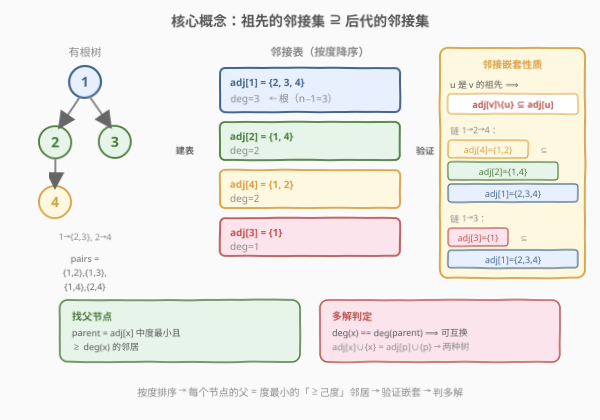
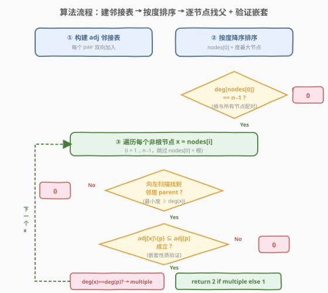
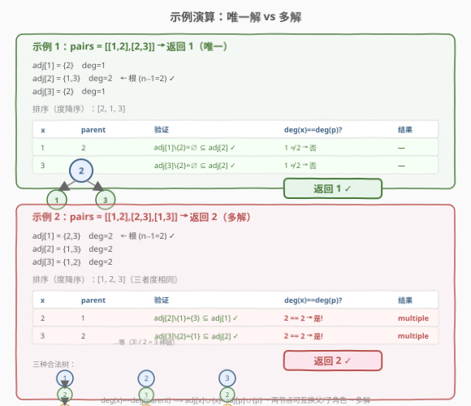

# 重构一棵树的方案数

- **题目名称**：重构一棵树的方案数
- **链接**：[1719. 重构一棵树的方案数](https://leetcode.cn/problems/number-of-ways-to-reconstruct-a-tree/)
- **难度**：困难
- **标签**：树、图、贪心、排序

## 1. 题目概述

给定一个数组 `pairs`，其中 `pairs[i] = [xi, yi]`，满足 `xi < yi` 且无重复元素。令 `ways` 为满足以下条件的有根树的方案数：

- 树所包含的所有节点值都在 `pairs` 中出现。
- 一对 `[xi, yi]` 出现在 `pairs` 中 **当且仅当** `xi` 是 `yi` 的祖先或 `yi` 是 `xi` 的祖先。
- 构造的树不一定是二叉树。

两棵树不同当且仅当存在至少一个节点在两棵树中有不同的父节点。返回：`ways == 0` 返回 `0`；`ways == 1` 返回 `1`；`ways > 1` 返回 `2`。

**示例 1**：

```text
输入：pairs = [[1,2],[2,3]]
输出：1
解释：有且只有一个符合规定的有根树：2 为根，1 和 3 为子节点。
```

**示例 2**：

```text
输入：pairs = [[1,2],[2,3],[1,3]]
输出：2
解释：有多个符合规定的有根树，如 1→2→3、2→1→3、3→2→1 等。
```

**示例 3**：

```text
输入：pairs = [[1,2],[2,3],[2,4],[1,5]]
输出：0
解释：没有符合规定的有根树。
```

**约束条件**：

- $1 \le \text{pairs.length} \le 10^5$
- $1 \le x_i < y_i \le 500$
- `pairs` 中的元素互不相同

> 💡 **关键约束**：节点值域 $\le 500$，意味着节点数 $n \le 500$。即使 $O(n^2)$ 的算法也能在 $2.5 \times 10^5$ 次操作内完成——这一极小的 $n$ 是本题能用「按度排序 + 线性扫描找父」求解的根基。而 `pairs.length` 可达 $10^5$，建邻接表和验证子集时需注意效率（用哈希集合保证 $O(1)$ 查找）。

---

## 2. 解题思路

### 2.1 暴力思路：枚举所有树结构

最直觉的做法是：从 `pairs` 中提取所有节点，枚举所有可能的有根树结构（每个节点选一个父节点或作为根），然后检查每棵树的祖先-后代对集合是否恰好等于 `pairs`。

- 节点数 $n$ 个，每个节点有 $O(n)$ 种父节点选择（含「无父=根」），组合空间 $O(n^n)$。
- 即便固定树结构，验证祖先-后代对也需要 $O(n^2)$（DFS 求每对节点的祖孙关系）。

> ⚠️ **症结**：组合爆炸。需要从 `pairs` 结构中直接推导树的拓扑，而非枚举。

### 2.2 核心观察：邻接嵌套性质



本题的关键洞察是：`pairs` 定义的不是树的边，而是树的**传递闭包**——所有祖先-后代对。如果把 `pairs` 看作图的边，则每个节点的邻接集 `adj[x]` 恰好是它的**祖先集合 $\cup$ 后代集合**。

#### 观察 1：祖先的邻接集 ⊇ 后代的邻接集

若 $u$ 是 $v$ 的祖先，则 $v$ 的祖先都是 $u$ 的祖先（$u$ 及其上方），$v$ 的后代都是 $u$ 的后代。因此：

$$\text{adj}[v] \setminus \{u\} \subseteq \text{adj}[u]$$

即**后代节点的邻接集是祖先邻接集的子集**。这是整个算法的基石。

> 💡 **直观理解**：越靠近根的节点，与越多的节点有祖孙关系（度越大）；越靠近叶子的节点，邻接集越小。根与所有节点配对，度 $= n-1$；叶子只与祖先链上的节点配对，度最小。

#### 观察 2：根 = 度最大的节点

根是所有节点的祖先，与每个其他节点都配对，故 $\text{deg}(\text{root}) = n - 1$。如果度最大的节点度数 $\ne n-1$，说明没有节点能作为根与所有人配对 → 返回 `0`。

#### 观察 3：父节点 = 度最小且 $\ge \text{deg}(x)$ 的邻居

将节点按度降序排列。对于非根节点 $x$，其父节点是 `adj[x]` 中度最小且 $\ge \text{deg}(x)$ 的邻居——即排序序列中 $x$ 左侧最近的邻居。这是因为：

- 所有祖先的度都 $> \text{deg}(x)$（严格大于，因为祖先的邻接集是 $x$ 邻接集的真超集）。
- 父节点是「最近的」祖先（度最小的祖先），即度刚好大于 $\text{deg}(x)$ 的那个邻居。
- 后代的度都 $< \text{deg}(x)$，不会干扰查找。

#### 观察 4：多解判定 —— 度相等即可互换

如果 $\text{deg}(x) == \text{deg}(\text{parent})$，则 $\text{adj}[x] \cup \{x\} = \text{adj}[\text{parent}] \cup \{\text{parent}\}$（两个节点的闭邻域相同），意味着 $x$ 和 parent 可以互换父子角色——$x$ 做 parent 的孩子，或 parent 做 $x$ 的孩子，两种树都产生相同的 `pairs` 集合 → 多解。

> ⚠️ **为什么度相等就一定能互换？** 由观察 1，$\text{adj}[x] \setminus \{\text{parent}\} \subseteq \text{adj}[\text{parent}]$。若 $\text{deg}(x) = \text{deg}(\text{parent})$，即 $|\text{adj}[x]| = |\text{adj}[\text{parent}]|$，且 $\text{parent} \in \text{adj}[x]$、$x \in \text{adj}[\text{parent}]$（二者互为邻居），则 $\text{adj}[x] \setminus \{\text{parent}\} = \text{adj}[\text{parent}] \setminus \{x\}$（等大的子集必相等）。所以 $\text{adj}[x] \cup \{x\} = \text{adj}[\text{parent}] \cup \{\text{parent}\}$，二者闭邻域相同，互换不改变任何配对关系。

### 2.3 算法流程图



**步骤**：

1. **建邻接表**：遍历 `pairs`，对每个 `[x, y]`，`adj[x].add(y)`、`adj[y].add(x)`。
2. **排序**：将所有节点按度降序排列，`nodes[0]` 为度最大节点。
3. **检查根**：若 `deg(nodes[0]) != n - 1`，返回 `0`。
4. **逐节点处理**（`i = 1` 到 `n-1`，跳过根 `nodes[0]`）：
   - **找父节点**：从 `j = i-1` 向左扫描，找到第一个 `nodes[j] ∈ adj[x]`，即为 parent（度最小且 $\ge \text{deg}(x)$ 的邻居）。找不到 → 返回 `0`。
   - **验证嵌套**：检查 `adj[x]` 中每个元素 $y$，若 $y \ne \text{parent}$ 且 $y \notin \text{adj}[\text{parent}]$，返回 `0`。
   - **判多解**：若 $\text{deg}(x) == \text{deg}(\text{parent})$，标记 `multiple = True`。
5. **返回**：`multiple ? 2 : 1`。

> 💡 **为什么从右向左扫描？** 节点按度降序排列，`nodes[i-1]` 的度 $\ge \text{deg}(x)$。从 `i-1` 向左扫描，第一个找到的邻居就是度最小且 $\ge \text{deg}(x)$ 的邻居，即 $x$ 的父节点。这个父节点是「最近的祖先」——度刚好够大，不是更高层的祖先。

### 2.4 示例演算



#### 示例 1：`pairs = [[1,2],[2,3]]` → 返回 1

| 节点 | 邻接集 | 度 |
|------|--------|-----|
| 1 | {2} | 1 |
| 2 | {1,3} | 2 ← 根 ($n-1=2$) |
| 3 | {2} | 1 |

排序（度降序）：`[2, 1, 3]`

| x | parent | 验证 | deg(x)==deg(p)? |
|---|--------|------|-----------------|
| 1 | 2 | `adj[1]\{2} = ∅ ⊆ adj[2]` ✓ | 1 ≠ 2 → 否 |
| 3 | 2 | `adj[3]\{2} = ∅ ⊆ adj[2]` ✓ | 1 ≠ 2 → 否 |

无多解标记 → 返回 **1** ✓

#### 示例 2：`pairs = [[1,2],[2,3],[1,3]]` → 返回 2

| 节点 | 邻接集 | 度 |
|------|--------|-----|
| 1 | {2,3} | 2 ← 根 ($n-1=2$) |
| 2 | {1,3} | 2 |
| 3 | {1,2} | 2 |

排序（度降序）：`[1, 2, 3]`（三者度相同）

| x | parent | 验证 | deg(x)==deg(p)? |
|---|--------|------|-----------------|
| 2 | 1 | `adj[2]\{1} = {3} ⊆ adj[1]={2,3}` ✓ | 2 == 2 → **是!** |
| 3 | 2 | `adj[3]\{2} = {1} ⊆ adj[2]={1,3}` ✓ | 2 == 2 → **是!** |

多解标记 → 返回 **2** ✓

三节点度全相同，闭邻域 $\{1,2,3\}$ 全等，任意节点可做根，任意链结构（$1\to2\to3$、$2\to1\to3$、$3\to2\to1$…）都产生相同的 `pairs`。

#### 示例 3：`pairs = [[1,2],[2,3],[2,4],[1,5]]` → 返回 0

| 节点 | 邻接集 | 度 |
|------|--------|-----|
| 1 | {2,5} | 2 |
| 2 | {1,3,4} | 3 ← 度最大 |
| 3 | {2} | 1 |
| 4 | {2} | 1 |
| 5 | {1} | 1 |

$n = 5$，$\text{deg}(\text{nodes[0]}) = \text{deg}(2) = 3 \ne n-1 = 4$。节点 2 虽然度最大，但未与节点 5 配对，无法作为根 → 返回 **0** ✓

---

## 3. 参考代码

### Python

```python
class Solution:
    def checkWays(self, pairs: List[List[int]]) -> int:
        adj = defaultdict(set)
        for x, y in pairs:
            adj[x].add(y)
            adj[y].add(x)

        n = len(adj)
        # 按度降序排列
        nodes = sorted(adj.keys(), key=lambda x: -len(adj[x]))

        # 根的度必须 = n - 1
        if len(adj[nodes[0]]) != n - 1:
            return 0

        multiple = False
        for i in range(1, n):
            x = nodes[i]
            # 向左扫描找父节点（度最小且 >= deg(x) 的邻居）
            parent = -1
            for j in range(i - 1, -1, -1):
                if nodes[j] in adj[x]:
                    parent = nodes[j]
                    break

            if parent == -1:
                return 0  # 非根节点找不到祖先邻居

            # 验证嵌套：adj[x] \ {parent} ⊆ adj[parent]
            for y in adj[x]:
                if y != parent and y not in adj[parent]:
                    return 0

            # 度相等 → 可互换 → 多解
            if len(adj[x]) == len(adj[parent]):
                multiple = True

        return 2 if multiple else 1
```

### C++

```cpp
class Solution {
public:
    int checkWays(vector<vector<int>>& pairs) {
        unordered_map<int, unordered_set<int>> adj;
        for (auto& p : pairs) {
            adj[p[0]].insert(p[1]);
            adj[p[1]].insert(p[0]);
        }

        int n = adj.size();
        vector<int> nodes;
        nodes.reserve(n);
        for (auto& [k, _] : adj) nodes.push_back(k);
        sort(nodes.begin(), nodes.end(), [&](int a, int b) {
            return adj[a].size() > adj[b].size();
        });

        // 根的度必须 = n - 1
        if ((int)adj[nodes[0]].size() != n - 1) return 0;

        bool multiple = false;
        for (int i = 1; i < n; i++) {
            int x = nodes[i];
            int parent = -1;
            // 向左扫描找父节点
            for (int j = i - 1; j >= 0; j--) {
                if (adj[x].count(nodes[j])) {
                    parent = nodes[j];
                    break;
                }
            }
            if (parent == -1) return 0;

            // 验证嵌套：adj[x] \ {parent} ⊆ adj[parent]
            for (int y : adj[x]) {
                if (y != parent && !adj[parent].count(y)) return 0;
            }

            if (adj[x].size() == adj[parent].size()) multiple = true;
        }

        return multiple ? 2 : 1;
    }
};
```

> ⚠️ **实现细节**：① `adj` 用 `unordered_set`（C++）或 `set`（Python）存储，保证 $O(1)$ 查找——验证嵌套时需高频查 `y ∈ adj[parent]`。② 排序的 key 是度（邻接集大小），不是节点值。③ 扫描从 `i-1` 向左到 `0`，找第一个邻居即停——利用排序保证它是度最小的合法祖先。④ `n = len(adj)` 是不同节点数，不是 `len(pairs)`。

> 💡 **为什么验证嵌套时只查 `adj[parent]` 而不查 `adj[parent] ∪ {parent}`？** 代码中 `if y != parent and y not in adj[parent]` 已隐含处理：当 $y = \text{parent}$ 时直接跳过（`y != parent` 为假），其余 $y$ 必须 $\in \text{adj}[\text{parent}]$。这与数学条件 $\text{adj}[x] \setminus \{\text{parent}\} \subseteq \text{adj}[\text{parent}]$ 完全一致。

---

## 4. 复杂度分析

| 维度 | 复杂度 | 说明 |
|------|--------|------|
| 时间复杂度 | $O(n^2 + m)$ | 排序 $O(n \log n)$；找父节点扫描 $O(n^2)$（每节点至多扫 $n$ 个）；验证嵌套 $O(m)$（每条边查两次）；$n \le 500$, $m \le 10^5$ |
| 空间复杂度 | $O(n + m)$ | 邻接表存 $n$ 个节点的 $m$ 条边（双向） |

> 💡 暴力枚举 $O(n^n)$ 完全不可行。本算法利用「邻接嵌套」把树拓扑从组合枚举降为线性推导：排序定序 + 扫描定父 + 验证定合法性。$n \le 500$ 的约束使 $O(n^2)$ 扫描完全可接受。

---

## 5. 扩展：邻接嵌套性质的形式化证明

### 5.1 核心引理

**引理**：在合法的有根树中，若 $u$ 是 $v$ 的祖先，则 $\text{adj}[v] \setminus \{u\} \subseteq \text{adj}[u]$。

**证明**：$\text{adj}[v]$ = $v$ 的祖先 $\cup$ $v$ 的后代。

- $v$ 的祖先 = $\{u$ 及 $u$ 的祖先 $\} \cup \{$ $u$ 到 $v$ 路径上的中间节点 $\}$。其中 $u$ 及 $u$ 的祖先都在 $\text{adj}[u]$ 中（$u$ 的祖先是 $u$ 的祖先，也是 $u$ 的邻居）；中间节点是 $u$ 的后代，也在 $\text{adj}[u]$ 中。唯一例外是 $u$ 本身——$u \in \text{adj}[v]$ 但 $u \notin \text{adj}[u]$，已在 $\setminus \{u\}$ 中排除。
- $v$ 的后代都是 $u$ 的后代（$u$ 是 $v$ 的祖先），故都在 $\text{adj}[u]$ 中。

因此 $\text{adj}[v] \setminus \{u\} \subseteq \text{adj}[u]$。$\square$

### 5.2 度相等等价于可互换

**定理**：若 $\text{deg}(x) = \text{deg}(\text{parent})$ 且 $\text{adj}[x] \setminus \{\text{parent}\} \subseteq \text{adj}[\text{parent}]$，则 $\text{adj}[x] \cup \{x\} = \text{adj}[\text{parent}] \cup \{\text{parent}\}$。

**证明**：由引理，$\text{adj}[x] \setminus \{\text{parent}\} \subseteq \text{adj}[\text{parent}]$。两边同时去掉对方节点：

$$\text{adj}[x] \setminus \{\text{parent}\} \subseteq \text{adj}[\text{parent}] \setminus \{x\}$$

（因 $x \in \text{adj}[\text{parent}]$，去掉 $x$ 后右端更小，包含关系仍成立。）

又 $|\text{adj}[x] \setminus \{\text{parent}\}| = \text{deg}(x) - 1 = \text{deg}(\text{parent}) - 1 = |\text{adj}[\text{parent}] \setminus \{x\}|$，等大的子集必相等：

$$\text{adj}[x] \setminus \{\text{parent}\} = \text{adj}[\text{parent}] \setminus \{x\}$$

两边各加回对方节点即得 $\text{adj}[x] \cup \{x\} = \text{adj}[\text{parent}] \cup \{\text{parent}\}$。$\square$

这意味着 $x$ 和 parent 的闭邻域完全相同——交换它们的父子角色不改变任何配对关系，产生另一棵合法树。

### 5.3 唯一性的保证

若每个非根节点 $x$ 都满足 $\text{deg}(x) < \text{deg}(\text{parent})$（严格小于），则不存在可互换的节点对。此时每个节点的父节点是唯一确定的（度最小的严格大度邻居），树结构唯一。

---

## 6. 面试要点

1. **`pairs` 定义的是什么？为什么不能直接当作树的边？**

   > `pairs` 是树的**传递闭包**——所有祖先-后代对，而非父子边。例如链 $1\to2\to3$ 的 `pairs` 包含 $\{1,2\}, \{2,3\}, \{1,3\}$，其中 $\{1,3\}$ 不是边而是跨两层的祖孙对。直接把 `pairs` 当边会得到一张图而非树。

2. **为什么祖先的邻接集 $\supseteq$ 后代的邻接集？**

   > 后代的祖先都是祖先的祖先（在祖先链上方或就是祖先本身），后代的后代都是祖先的后代。所以后代能配对的节点，祖先也都能配对——邻接集嵌套。唯一例外是祖先自己：后代与祖先配对，但祖先不与自己配对，故需 $\setminus \{u\}$ 去掉。

3. **根为什么一定是度 $= n-1$ 的节点？**

   > 根是所有节点的祖先，与每个其他节点都配对，故度 $= n-1$。若没有度 $= n-1$ 的节点，说明没有节点能作为根与所有人配对，无解。

4. **为什么从 `i-1` 向左扫描找父节点？**

   > 节点按度降序排列，`nodes[i-1]` 的度 $\ge \text{deg}(x)$。从 `i-1` 向左扫，第一个找到的邻居度最小且 $\ge \text{deg}(x)$，即「最近的祖先」——度刚好够大的那个。更高层的祖先度更大、距离更远，不是直接父节点。

5. **多解判定为什么是 `deg(x) == deg(parent)`？**

   > 度相等 + 嵌套成立 $\Rightarrow$ 闭邻域相同 $\Rightarrow$ 两节点可互换父子角色。交换后 `pairs` 不变（所有配对关系由闭邻域决定），产生另一棵合法树。若所有节点的度都严格小于父节点，则不可互换，树唯一。

> 💡 **一句话总结**：`pairs` 是树的传递闭包，邻接集按祖孙链嵌套——按度排序后每个节点的父 = 度最小的「≥己度」邻居，验证嵌套判定合法性，度相等判定多解。$O(n^2 + m)$ 搞定。

---

## 7. 同类练习题

- [236. 二叉树的最近公共祖先](https://leetcode.cn/problems/lowest-common-ancestor-of-a-binary-tree/)（[题解](../0201-0300/236_二叉树最近公共祖先.md)）：理解祖先-后代关系的基础题，LCA 是树上祖孙链的经典应用
- [200. 岛屿数量](https://leetcode.cn/problems/number-of-islands/)（[题解](../0101-0200/200_岛屿数量.md)）：图的遍历基础，对照本题从图结构反推树拓扑的思路
- [684. 冗余连接](https://leetcode.cn/problems/redundant-connection/)（[题解](../0601-0700/684_冗余连接.md)）：并查集判环，从边集恢复树结构的另一形态——本题是「从传递闭包恢复树」，684 是「从边集恢复树」
- [310. 最小高度树](https://leetcode.cn/problems/minimum-height-trees/)：拓扑排序从叶子向内剥层找根，与本题「按度排序从根向外定父」方向相反但同属「从图结构推导树拓扑」
- [2192. 有向无环图中一个节点的所有祖先](https://leetcode.cn/problems/all-ancestors-of-a-node-in-a-directed-acyclic-graph/)：正向求祖先集合，与本题「从祖先-后代对反推树」互为正逆问题
