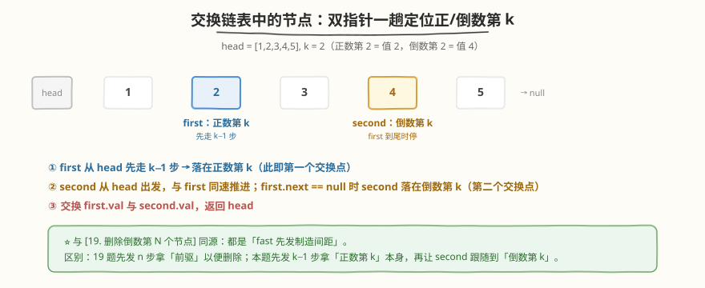
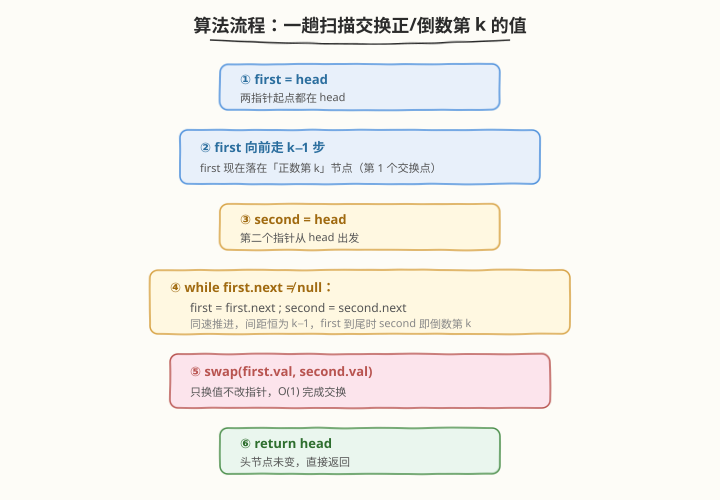

# 交换链表中的节点

- **题目名称**：交换链表中的节点
- **链接**：[1721. 交换链表中的节点](https://leetcode.cn/problems/swapping-nodes-in-a-linked-list/)
- **难度**：中等
- **标签**：链表、双指针

## 1. 题目概述

给定一个链表的**头节点** `head` 和一个整数 `k`，交换链表中**倒数第** `k` **个节点**与**正数第** `k` **个节点**的**值**，返回链表的头节点。链表下标从 1 开始，且保证 `1 <= k <= 节点总数`。

**示例 1**：

```text
输入：head = [1,2,3,4,5], k = 2
输出：[1,4,3,2,5]
解释：正数第 2 个节点值为 2，倒数第 2 个节点值为 4，交换两者的值后链表变为 1 → 4 → 3 → 2 → 5。
```

**示例 2**：

```text
输入：head = [7,9,6,6,7,8,3,0,9,5], k = 5
输出：[7,9,6,6,8,7,3,0,9,5]
解释：链表共 10 个节点。正数第 5 个节点值为 7（位置 5），倒数第 5 个节点值为 8（位置 10−5+1=6），交换后得上述结果。
```

**示例 3**：

```text
输入：head = [1], k = 1
输出：[1]
解释：正数第 1 与倒数第 1 是同一个节点，交换自身值无变化。
```

**约束条件**：

- 链表中节点数目为 $n$
- $1 \le n \le 10^5$
- $0 \le \text{Node.val} \le 100$
- $1 \le k \le n$

> 💡 **关键观察**：题面只要求交换**值**而非交换**节点本身**——这意味着无需改动任何 `next` 指针，定位到两个节点后一次 `swap` 即可。难点从「指针重连」简化为「一次扫描定位两个节点」，而定位正/倒数第 $k$ 恰是 [19. 删除链表的倒数第 N 个节点](../0001-0100/19_删除链表的倒数第N个节点.md) 的招牌双指针技巧。

---

## 2. 解题思路

### 2.1 暴力思路：两趟扫描

第一趟遍历求出链表长度 $n$，则倒数第 $k$ 个节点即正数第 $n - k + 1$ 个节点。第二趟分别走到正数第 $k$ 与正数第 $n - k + 1$，交换两者的值。

```text
# 第一趟：数长度
n = 0; cur = head
while cur: n++; cur = cur.next
# 第二趟：定位两个节点
p = head; for _ in range(k - 1):       p = p.next   # 正数第 k
q = head; for _ in range(n - k):       q = q.next   # 倒数第 k = 正数第 n-k+1
swap(p.val, q.val)
```

时间 $O(n)$，空间 $O(1)$。能过，但需要**两趟扫描**。能否在一趟扫描中同时锁定两个节点？关键在于让一个指针「先发」制造间距，把「倒数第 $k$」这一后向参照转化为前向间距——这正是 [19 题](../0001-0100/19_删除链表的倒数第N个节点.md) 的同款技巧。

### 2.2 核心观察：一趟扫描 + 双指针



**两个关键技巧**：

1. **先发指针定位正数第 $k$**：让 `first` 从 `head` 先走 $k - 1$ 步，`first` 即落在「正数第 $k$」节点——这是第一个交换点。这一步直接锁定前向参照。

2. **跟随指针定位倒数第 $k$**：再让 `second` 从 `head` 出发，与 `first` **同速推进**。当 `first` 走到链表末尾（`first.next == null`）时，`second` 恰好落在「倒数第 $k$」节点——这是第二个交换点。

**为什么 `second` 恰好停在倒数第 $k$？**

- 初始：`first` 走了 $k - 1$ 步到达位置 $k$；`second` 在位置 $1$。两者间距为 $k - 1$ 条边。
- 同速推进：每轮各走 1 步，**间距恒为 $k - 1$**。
- 终止：当 `first.next == null`（`first` 在最后一个节点，位置 $n$）时，`second` 与 `first` 间距仍为 $k - 1$，故 `second` 在位置 $n - (k - 1) = n - k + 1$——正是倒数第 $k$ 个节点（倒数第 $k$ = 正数第 $n - k + 1$）。

> 💡 **核心洞察**：`first` 的「先发优势」把「倒数第 $k$」这一**后向参照系**转化为「领先 $k - 1$ 步」这一**前向间距**。`second` 不需知道总长度 $n$，只需跟着 `first` 走——当 `first` 触底时，`second` 的位置即答案。这与 [19 题](../0001-0100/19_删除链表的倒数第N个节点.md) 「快指针先走 $n$ 步制造间距」同源，区别仅在于先发量与目标：19 题先发 $n$ 步拿「前驱」以便删除，本题先发 $k - 1$ 步拿「正数第 $k$」本身，再让 `second` 跟随到「倒数第 $k$」。

> ⚠️ **循环条件是 `first.next != null` 而非 `first != null`**：若写成 `first != null`，`first` 会越过尾部变为 `null`，`second` 多走一步，停到「倒数第 $k - 1$」（即再往后一个），错位。`first.next != null` 让 `first` 停在**最后一个节点**，`second` 恰好停在倒数第 $k$。这一细节与 19 题如出一辙。

### 2.3 算法流程图



**完整步骤**：

1. **`first = head`**：第一个指针从头部出发。
2. **`first` 先走 $k - 1$ 步**：`first` 落在正数第 $k$（第一个交换点）。
3. **`second = head`**：第二个指针从头部出发。
4. **同速推进**：`while first.next != null`：`first = first.next`，`second = second.next`。
5. **交换值**：`swap(first.val, second.val)`（`second` 此时在倒数第 $k$，第二个交换点）。
6. **返回 `head`**：头节点本身未变（$k \ge 1$，正数第 $k$ 不可能是 `head` 之前的节点），直接返回。

> 💡 **同一节点自交换单调**：当 $n$ 为奇数且 $k = \lceil n/2 \rceil$（如示例 3 中 $n = 1, k = 1$），正数第 $k$ 与倒数第 $k$ 是同一节点，`first` 与 `second` 指向同节点，`swap` 自身值不改变任何东西，结果正确，无需特判。

### 2.4 示例演算

以 `head = [1,2,3,4,5]`，`k = 2` 为例（$n = 5$，正数第 2 = 值 2，倒数第 2 = 值 4）：

![示例演算：[1,2,3,4,5], k=2 → [1,4,3,2,5]](../images/1721_example_walkthrough.svg)

| 阶段 | first 位置 | second 位置 | 说明 |
|------|-----------|-------------|------|
| 初始 | 1 | — | `first = head` |
| first 走 $k - 1 = 1$ 步 | 2（值 2） | — | `first` 落在正数第 $k$ |
| `second = head` | 2 | 1（值 1） | `second` 从头部出发 |
| 同速推进 1 | 3 | 2 | 各前进 1 步 |
| 同速推进 2 | 4 | 3 | 各前进 1 步 |
| 同速推进 3 | 5（值 5） | 4（值 4） | `first.next == null`，停止；`second` 在倒数第 $k$ |
| 交换值 | — | — | 交换 2 与 4 |

最终 `head = 1 → 4 → 3 → 2 → 5`。

> 💡 注意 `first` 与 `second` 的间距恒为 $k - 1 = 1$ 条边：`first` 在位置 2 时 `second` 在位置 1；`first` 推进到位置 5 时 `second` 推进到位置 4。间距不变是双指针定位正确的根基。

---

## 3. 参考代码

### C++

```cpp
struct ListNode {
    int val;
    ListNode* next;
    ListNode() : val(0), next(nullptr) {}
    ListNode(int x) : val(x), next(nullptr) {}
    ListNode(int x, ListNode* n) : val(x), next(n) {}
};

class Solution {
  public:
    ListNode* swapNodes(ListNode* head, int k) {
        ListNode* first = head;
        for (int i = 1; i < k; ++i) {   // first 先走 k-1 步 → 正数第 k
            first = first->next;
        }
        ListNode* second = head;        // second 从 head 出发
        while (first->next != nullptr) {// 同速推进，first 到尾时 second 落在倒数第 k
            first = first->next;
            second = second->next;
        }
        swap(first->val, second->val);  // 只换值不改指针
        return head;
    }
};
```

### Python

```python
from typing import Optional

class ListNode:
    def __init__(self, val=0, next=None):
        self.val = val
        self.next = next

class Solution:
    def swapNodes(self, head: Optional[ListNode], k: int) -> Optional[ListNode]:
        first = head
        for _ in range(k - 1):          # first 先走 k-1 步 → 正数第 k
            first = first.next
        second = head                   # second 从 head 出发
        while first.next:               # 同速推进，first 到尾时 second 落在倒数第 k
            first = first.next
            second = second.next
        first.val, second.val = second.val, first.val  # 只换值不改指针
        return head
```

> ⚠️ **实现细节**：① 先发量是 $k - 1$ 步（`range(k - 1)`），不是 $k$ 步——`first` 走 $k - 1$ 步后落在第 $k$ 个节点本身；若走 $k$ 步会落到第 $k + 1$ 个节点，错位。② 循环用 `first->next != nullptr` 让 `first` 停在最后一个节点，`second` 恰在倒数第 $k$；若误用 `first != nullptr`，`second` 多走一步停到倒数第 $k - 1$。③ `swap` 交换的是 `val` 而非节点指针，故无需处理 `next` 重连，代码极简。④ $k \le n$ 由题面保证，无需判空。

> 💡 **也可用「先走 $k$ 步」的等价写法**：让 `first` 先走 $k$ 步（落到第 $k + 1$ 个节点），再 `second = head` 同速推进直到 `first == nullptr`。此时 `second` 落在倒数第 $k$，但第一个交换点需另存 `firstNode = head` 后走 $k - 1$ 步保存。两种写法等价，本文采用「先走 $k - 1$ 步」更直观——`first` 直接停在第一个交换点上，无需额外变量。

---

## 4. 复杂度分析

| 维度 | 复杂度 | 说明 |
|------|--------|------|
| 时间复杂度 | $O(n)$ | `first` 先走 $k - 1$ 步，再与 `second` 同速推进 $n - k$ 步，合计 $n - 1$ 步，一趟扫描 |
| 空间复杂度 | $O(1)$ | 仅用 `first`、`second` 两个指针 |

> ⚠️ 暴力两趟扫描同为 $O(n)$ 时间、$O(1)$ 空间，但需两趟遍历（$2n$ 步）；双指针一趟仅 $n - 1$ 步，常数更优。更重要的是，一趟扫描体现了「双指针制造间距」这一通用模板，可迁移到链表中点、倒数第 $k$、距尾 $n$ 步等所有「定位类」链表问题。

---

## 5. 扩展：交换值 vs 交换节点

题面只要求交换**值**，故代码极简。若面试官追问「**交换两个节点本身**（改 `next` 指针）而非交换值」，难度陡增——需处理四种边界：两节点相邻、两节点相同、其中之一为头节点、两节点的前驱互指。此时套路为：

1. 用双指针分别找到两个节点的**前驱**（`prev1`、`prev2`）与节点本身（`node1`、`node2`）。
2. 特判相邻与相同情况。
3. 通用交换：先交换前驱的 `next`，再交换两节点的 `next`。

```text
# 伪代码（相邻情况需特判）
prev1.next = node2
prev2.next = node1
tmp = node1.next
node1.next = node2.next
node2.next = tmp
```

> 💡 **面试策略**：若题面允许交换值，**优先交换值**——简洁、不易错、$O(1)$ 完成。若面试官明确要求交换节点，再走「前驱 + 指针重连」流程，并务必画图对照四种边界。本题（1721）官方允许交换值，故无需复杂指针操作。

---

## 6. 面试要点

1. **为什么先发量是 $k - 1$ 步而不是 $k$ 步？**

   > `first` 从 `head`（位置 1）出发，走 $k - 1$ 步后落在位置 $1 + (k - 1) = k$，即正数第 $k$ 个节点本身——这是第一个交换点。若走 $k$ 步会落到位置 $k + 1$，错位一个。先发量的目标是「让指针停在目标节点上」，故步数 = 目标位置 − 起点位置 = $k - 1$。

2. **为什么循环条件是 `first.next != null` 而非 `first != null`？**

   > `first.next != null` 让 `first` 停在**最后一个节点**（位置 $n$），此时 `second` 与之间距 $k - 1$，落在位置 $n - k + 1$ = 倒数第 $k$。若用 `first != null`，`first` 会越过尾部变 `null`，`second` 多走一步停到位置 $n - k + 2$ = 倒数第 $k - 1$，错位。这一细节与 [19 题](../0001-0100/19_删除链表的倒数第N个节点.md) 完全一致：定位节点本身用 `next != null`，定位前驱用 `next->next != null`。

3. **正数第 $k$ 与倒数第 $k$ 是同一节点时（如 $n = 1, k = 1$）会出错吗？**

   > 不会。此时 `first` 走 $k - 1 = 0$ 步停在 `head`；`second = head`；循环中 `first` 从 `head` 推进到末尾，`second` 同步推进——但因 $n = 1$，`first.next` 初始即 `null`，循环不执行，`second` 仍在 `head`。`first` 与 `second` 指向同一节点，`swap(val, val)` 自身交换无变化，结果正确，无需特判。一般地，$n$ 为奇数且 $k = \lceil n/2 \rceil$ 时两节点重合，均由 `swap` 幂等性兜底。

4. **本题与 [19. 删除链表的倒数第 N 个节点](../0001-0100/19_删除链表的倒数第N个节点.md) 的异同？**

   > 同：都用「快慢双指针制造间距」一趟定位倒数第 $k$，循环条件都用 `next != null` 让快指针停在末尾。异：① 19 题先发 $n$ 步拿**前驱**（以便 `slow.next = slow.next.next` 删除），需用哑节点统一删除头节点；本题先发 $k - 1$ 步拿**正数第 $k$ 本身**，再让 `second` 跟随到倒数第 $k$，定位两个交换点。② 19 题改指针（删除），本题只换值（$O(1)$ swap）。③ 本题无需哑节点——$k \ge 1$ 且只交换值，头节点永不会在交换中丢失。

5. **为什么可以只交换值而不交换节点？何时必须交换节点？**

   > 题面明确「交换两个节点的值」，故交换值即满足要求，且 $O(1)$ 完成、无需处理 `next` 重连。只有当题面要求「交换节点本身」（即改拓扑结构、保留节点对象身份）时才需指针重连。例如 [24. 两两交换链表中的节点](https://leetcode.cn/problems/swap-nodes-in-pairs/) 要求改 `next` 指针，因交换的是「节点位置」而非「值」。判断准则：看题面要的是「值的结果」还是「节点的身份」。

> 💡 **一句话总结**：本题是「双指针制造间距」的直白应用——`first` 先走 $k - 1$ 步锁定正数第 $k$，`second` 从 `head` 跟随到 `first` 触尾即得倒数第 $k$，一次 `swap` 换值搞定。一趟 $O(n)$、$O(1)$ 空间，与 [19 题](../0001-0100/19_删除链表的倒数第N个节点.md) 同源，差异只在先发量与「换值 vs 删节点」。

---

## 7. 同类练习题

- [19. 删除链表的倒数第 N 个节点](https://leetcode.cn/problems/remove-nth-node-from-end-of-list/)（[题解](../0001-0100/19_删除链表的倒数第N个节点.md)）：快慢双指针先发制造间距的招牌题，先发 $n$ 步拿前驱以便删除，对照本题先发 $k - 1$ 步拿节点本身
- [876. 链表的中间结点](https://leetcode.cn/problems/middle-of-the-linked-list/)：快慢双指针不同速（`fast` 走 2 步、`slow` 走 1 步）定位中点，对照本题「先发 + 同速」的另一种间距制造方式
- [24. 两两交换链表中的节点](https://leetcode.cn/problems/swap-nodes-in-pairs/)：要求改 `next` 指针交换节点本身，对照本题「只换值」的简化版，体会何时需指针重连
- [141. 环形链表](https://leetcode.cn/problems/linked-list-cycle/)（[题解](../0101-0200/141_环形链表.md)）：快慢双指针不同速追及判环，与本题「先发 + 同速」同为双指针两大典型用法
- [234. 回文链表](https://leetcode.cn/problems/palindrome-linked-list/)：876 找中点 + 206 反转后半 + 双指针比对，综合运用双指针定位与链表操作
