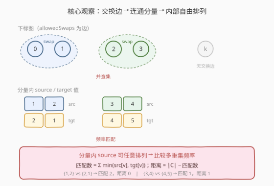
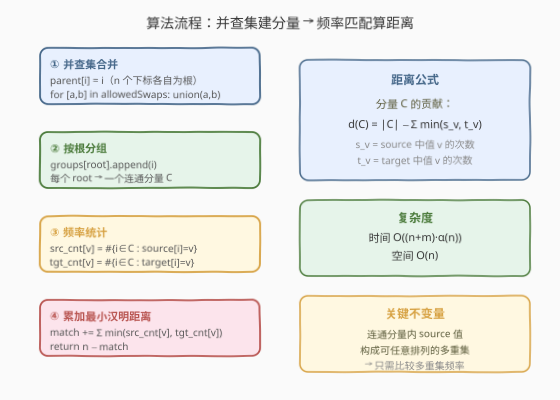
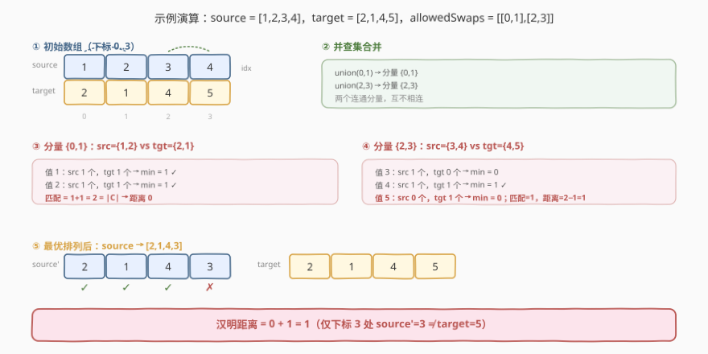

# 执行交换操作后的最小汉明距离

- **题目名称**：执行交换操作后的最小汉明距离
- **链接**：[1722. 执行交换操作后的最小汉明距离](https://leetcode.cn/problems/minimize-hamming-distance-after-swap-operations/)
- **难度**：中等
- **标签**：并查集、图、哈希表、数组

## 1. 题目概述

给你两个长度均为 $n$ 的整数数组 `source` 和 `target`，以及一个数组 `allowedSwaps`，其中 `allowedSwaps[i] = [ai, bi]` 表示你可以**交换** `source` 中下标 `ai` 和 `bi` 处的两个元素。每对下标的交换可以执行**任意次**、**任意顺序**。

两个等长数组的**汉明距离**定义为元素不同的下标数量，即满足 $\text{source}[i] \ne \text{target}[i]$ 的下标 $i$ 的个数。要求在对 `source` 执行任意数量交换后，返回 `source` 与 `target` 间的**最小汉明距离**。

**示例 1**：

```text
输入：source = [1,2,3,4], target = [2,1,4,5], allowedSwaps = [[0,1],[2,3]]
输出：1
解释：交换下标 0,1 → source = [2,1,3,4]；交换下标 2,3 → source = [2,1,4,3]
      最终 source = [2,1,4,3]，与 target = [2,1,4,5] 仅在下标 3 处不同，距离为 1。
```

**示例 2**：

```text
输入：source = [1,2,3,4], target = [1,3,2,4], allowedSwaps = []
输出：2
解释：无交换操作可用，source 不变，与 target 在下标 1、2 处不同，距离为 2。
```

**示例 3**：

```text
输入：source = [5,1,2,4,3], target = [1,5,4,2,3], allowedSwaps = [[0,4],[4,2],[1,3],[1,4]]
输出：0
解释：所有下标通过交换边连通成同一个分量，source 的值可任意排列，完全匹配 target。
```

**约束条件**：

- $n = \text{source.length} = \text{target.length}$
- $1 \le n \le 10^5$
- $1 \le \text{source}[i], \text{target}[i] \le 10^5$
- $0 \le \text{allowedSwaps.length} \le 10^5$
- $0 \le a_i, b_i \le n - 1$，$a_i \ne b_i$

> 💡 **关键结构**：交换操作是「成对交换」，而交换具有**传递性**——若下标 $a$ 能与 $b$ 交换、$b$ 能与 $c$ 交换，则 $a$、$b$、$c$ 三处的值可以通过一串交换**任意排列**。这把问题从「逐次模拟交换」转化为「下标按连通分量分组，分量内自由排列」——正是并查集的招牌场景。

---

## 2. 解题思路

### 2.1 暴力思路：模拟所有交换序列

最直觉的做法是：尝试所有可能的交换序列，对每条序列执行后计算汉明距离，取最小值。然而交换可执行任意次、任意顺序，序列空间是**无穷的**（同一对可反复交换），即便限制为「每对至多用一次」，组合数仍为 $m!$（$m$ 为 `allowedSwaps` 长度），$m \le 10^5$ 时完全不可行。

即便退而求其次，用 BFS 搜索「所有可达的 source 排列」，状态空间为 $n!$（$n$ 个下标的全排列），$n \le 10^5$ 时同样爆炸。

> ⚠️ **症结**：暴力把「交换」当作**操作序列**来搜索，忽略了交换的**传递性**已将下标划分为若干「内部自由排列」的连通分量。一旦识别出这一结构，问题就从「搜索最优交换序列」简化为「分量内比较多重集频率」——无需搜索任何交换序列。

### 2.2 核心观察：交换边构成连通分量，分量内可自由排列



关键洞察来自交换的**代数性质**：

> **命题**：若下标集合 $C$ 在 `allowedSwaps` 构成的无向图中**连通**，则 $C$ 中各位置的 `source` 值可以通过交换变为**任意排列**。

**证明直觉**：连通分量中存在生成树，沿树做「冒泡」即可把任意值送到任意位置——两交换操作可生成整个对称群 $S_{|C|}$。因此分量内 `source` 的值构成一个**可任意排列的多重集**，我们只需关心每个值出现的**次数**，而非具体位置。

于是问题转化为：对每个连通分量 $C$，将 `source` 在 $C$ 中的值多重集与 `target` 在 $C$ 中的值多重集做**频率匹配**，最大化能对齐的位置数。

$$
\text{match}(C) = \sum_{v} \min\bigl(\text{src\_cnt}_C[v],\;\text{tgt\_cnt}_C[v]\bigr)
$$

分量 $C$ 对汉明距离的贡献为：

$$
\boxed{\;d(C) = |C| - \text{match}(C)\;}
$$

总距离 = 所有分量贡献之和 = $n - \sum_C \text{match}(C)$。

> 💡 **为什么取 min？** 对值 $v$，`source` 侧有 $s_v$ 个、`target` 侧有 $t_v$ 个。最优排列下至多 $\min(s_v, t_v)$ 个位置能对齐为 $v$（多余的那一侧必然落空，贡献距离）。对每个值独立取 min 后求和，即为分量内最多能匹配的位置数。这与「多重集交集大小」的定义完全一致。

### 2.3 算法流程图



1. **初始化并查集**：`parent[i] = i`，$n$ 个下标各自为根。
2. **合并**：对每条 `allowedSwaps` 边 $[a, b]$，执行 `union(a, b)`——经过路径压缩后，同属一个分量的下标共享同一个根。
3. **分组**：遍历所有下标 $i$，按 `find(i)` 归入对应分量的列表。
4. **频率匹配**：对每个分量 $C$，分别统计 `source` 和 `target` 在 $C$ 中的值频率，累加 $\min(\text{src\_cnt}[v], \text{tgt\_cnt}[v])$ 到总匹配数 `match`。
5. **返回**：$n - \text{match}$。

### 2.4 示例演算

以示例 1 `source = [1,2,3,4]`、`target = [2,1,4,5]`、`allowedSwaps = [[0,1],[2,3]]` 为例：



| 分量 | source 值多重集 | target 值多重集 | 逐值匹配 | 匹配数 | 距离 |
|------|-----------------|-----------------|----------|--------|------|
| $\{0,1\}$ | $\{1, 2\}$ | $\{2, 1\}$ | $v{=}1$: $\min(1,1){=}1$；$v{=}2$: $\min(1,1){=}1$ | 2 | $2-2=0$ |
| $\{2,3\}$ | $\{3, 4\}$ | $\{4, 5\}$ | $v{=}3$: $\min(1,0){=}0$；$v{=}4$: $\min(1,1){=}1$；$v{=}5$: $\min(0,1){=}0$ | 1 | $2-1=1$ |

总匹配数 = $2 + 1 = 3$，总距离 = $4 - 3 = \mathbf{1}$ ✓。

最优排列：分量 $\{0,1\}$ 内交换得 $[2,1]$（完美匹配）；分量 $\{2,3\}$ 内交换得 $[4,3]$（下标 2 对齐 $4$，下标 3 处 $3 \ne 5$ 失配）。最终 `source' = [2,1,4,3]`，与 `target = [2,1,4,5]` 仅下标 3 不同。

---

## 3. 参考代码

### C++（并查集 + 哈希表频率匹配）

```cpp
class UnionFind {
public:
    vector<int> parent;
    UnionFind(int n) : parent(n) {
        iota(parent.begin(), parent.end(), 0);
    }
    int find(int x) {
        if (parent[x] != x) parent[x] = find(parent[x]);   // 路径压缩
        return parent[x];
    }
    void unite(int x, int y) {
        parent[find(x)] = find(y);
    }
};

class Solution {
public:
    int minimumHammingDistance(vector<int>& source, vector<int>& target,
                               vector<vector<int>>& allowedSwaps) {
        int n = source.size();
        UnionFind uf(n);
        for (auto& s : allowedSwaps) {
            uf.unite(s[0], s[1]);                            // 合并可交换下标
        }

        unordered_map<int, unordered_map<int, int>> srcCnt, tgtCnt;
        for (int i = 0; i < n; ++i) {
            int r = uf.find(i);
            srcCnt[r][source[i]]++;                          // 分量内 source 频率
            tgtCnt[r][target[i]]++;                          // 分量内 target 频率
        }

        int match = 0;
        for (auto& [r, cnt] : srcCnt) {
            for (auto& [v, c] : cnt) {
                int t = tgtCnt[r].count(v) ? tgtCnt[r][v] : 0;
                match += min(c, t);                          // 逐值取 min 累加
            }
        }
        return n - match;
    }
};
```

### Python（并查集 + Counter 频率匹配）

```python
class Solution:
    def minimumHammingDistance(self, source: List[int], target: List[int],
                               allowedSwaps: List[List[int]]) -> int:
        n = len(source)
        parent = list(range(n))

        def find(x):
            while parent[x] != x:
                parent[x] = parent[parent[x]]                # 隔代压缩
                x = parent[x]
            return x

        def union(x, y):
            parent[find(x)] = find(y)

        for a, b in allowedSwaps:
            union(a, b)

        from collections import defaultdict, Counter
        groups = defaultdict(lambda: [Counter(), Counter()])
        for i in range(n):
            r = find(i)
            groups[r][0][source[i]] += 1                     # src 频率
            groups[r][1][target[i]] += 1                     # tgt 频率

        match = 0
        for src_cnt, tgt_cnt in groups.values():
            for v, c in src_cnt.items():
                match += min(c, tgt_cnt[v])                  # 逐值取 min 累加
        return n - match
```

> 💡 **实现要点**：两版代码都用「根 → 频率表」的两级哈希结构，避免显式收集每个分量的下标列表。C++ 版用 `unordered_map<int, unordered_map<int,int>>`，外层键为根、内层键为值；Python 版用 `defaultdict` 套两个 `Counter`，写法更简洁。关键是**先 `find` 再归组**——路径压缩后同一分量的下标必然指向同一根。
>
> ⚠️ **只遍历 src 侧的值**：频率匹配时只遍历 `srcCnt` 中的值即可——若某值只在 `target` 侧出现（`src_cnt = 0`），则 $\min(0, t) = 0$，对匹配数无贡献，无需额外处理。

---

## 4. 复杂度分析

| 维度 | 复杂度 | 说明 |
|------|--------|------|
| 时间复杂度 | $O\bigl((n + m) \cdot \alpha(n)\bigr)$ | $m$ 条边各做一次 `union`（含两次 `find`），$n$ 个下标各做一次 `find` 归组；并查集单次均摊 $O(\alpha(n))$；频率统计与匹配 $O(n)$ |
| 空间复杂度 | $O(n)$ | `parent` 数组 $O(n)$；频率哈希表至多存 $n$ 个键值对（所有分量合计） |

> 💡 $\alpha(n) \le 5$（本题 $n \le 10^5$），实际等同于 $O(n + m)$。瓶颈在 I/O 与哈希表常数，但 $n, m \le 10^5$ 下完全宽裕。

---

## 5. 扩展：交换的代数视角与排列群

**为何连通分量内可任意排列？** 严格证明用到了群论：交换操作 $(i\ j)$ 是**对换**（transposition），而对换乘积可生成下标集合上的整个**对称群** $S_{|C|}$。具体地，连通分量存在生成树，而树上的对换序列可模拟「冒泡排序」——任意排列都能分解为相邻对换之积，树上路径提供了相邻性的桥接。

> 💡 这与 [684. 冗余连接](../0601-0700/684_冗余连接.md) 的「并查集判环」、[547. 省份数量](../0501-0600/547_省份数量.md) 的「并查集数分量」是同一模板的三种用法：684 抓 `union` 失败判环边，547 数成功 `union` 的次数得分量数，本题在得到分量后**进一步在分量内做频率匹配**——并查集负责「分组」，分组后的统计交给哈希表。

---

## 6. 面试要点

**Q1：为什么不用 BFS 搜索所有可达的 source 排列？**
> 因为状态空间是 $n!$（$n$ 个下标的全排列），$n \le 10^5$ 时爆炸。关键在于识别交换的**传递性**——连通分量内的值可任意排列，无需搜索具体排列。用并查集在 $O((n+m)\alpha(n))$ 内完成分组，再做多集频率匹配即可。把「操作序列搜索」转化为「连通分量 + 频率统计」是降维的关键。

**Q2：为什么分量内取 $\min(\text{src\_cnt}[v], \text{tgt\_cnt}[v])$ 就是最优匹配？**
> 对值 $v$，source 侧有 $s_v$ 个、target 侧有 $t_v$ 个。无论怎么排列，至多 $\min(s_v, t_v)$ 个位置能对齐为 $v$（一侧不够就必然失配）。对每个值独立取 min 求和即最大化总对齐数——这是多重集交集的定义。剩余 $|C| - \text{match}$ 即无法对齐的位置数，就是该分量的最小距离贡献。

**Q3：并查集在此题中的角色和 547、684 有何异同？**
> 三题用同一并查集模板（`find` + `union` + 路径压缩），区别在**后续统计**：547 数成功 `union` 次数得连通分量个数；684 抓第一次 `union` 失败定位冗余边；本题在 `union` 完所有边后，按根分组并在组内做频率匹配。并查集负责「高效分组」，分组后的任务交给各自的后续逻辑。

**Q4：如果 `allowedSwaps` 为空，结果是什么？**
> 退化为原始汉明距离——每个下标自成独立分量（大小 1），频率匹配中 $\min(\text{src}[i], \text{tgt}[i])$ 仅在 $\text{source}[i] = \text{target}[i]$ 时为 1。总匹配数 = 原本相等的位置数，距离 = $n - \text{match}$ = 不等位置数，与定义一致。这正是示例 2 的情形。

**Q5：频率匹配时为什么只遍历 source 侧的值就够？**
> 因为 $\min(0, t) = 0$——只在 `target` 侧出现的值对匹配数无贡献。所以遍历 `srcCnt` 的键，对每个值查 `tgtCnt` 中对应次数取 min 即可。若需完整遍历，也可对 `tgtCnt` 独有的值取 $\min(s, 0) = 0$ 跳过，结果相同但多一轮遍历无益。

---

## 7. 同类练习题

- [547. 省份数量](https://leetcode.cn/problems/number-of-provinces/)（[题解](../0501-0600/547_省份数量.md)）：同一并查集模板，统计连通分量个数，与本题「分组后统计」对照——547 只需数分量，本题需在分量内做频率匹配
- [684. 冗余连接](https://leetcode.cn/problems/redundant-connection/)（[题解](../0601-0700/684_冗余连接.md)）：并查集判环，捕获 `union` 失败的边，与本题「用 `union` 建分量」对照体会同一模板的不同用法
- [1202. 交换字符串中的元素](https://leetcode.cn/problems/smallest-string-with-swaps/)：同一思路——交换边的连通分量内可自由排列，但目标是**最小字典序**而非最小汉明距离，排序替代频率匹配
- [721. 账户合并](https://leetcode.cn/problems/accounts-merge/)：并查集按邮箱合并账户，分组后收集去重——同样是「并查集分组 + 组内统计」的范式，键从整数下标升级为字符串
- [1319. 连通网络的操作次数](https://leetcode.cn/problems/number-of-operations-to-make-network-connected/)：并查集数连通分量，求最少冗余线缆数——体会「分量数 − 1」这一经典结论与本题「分量内匹配」的差异
