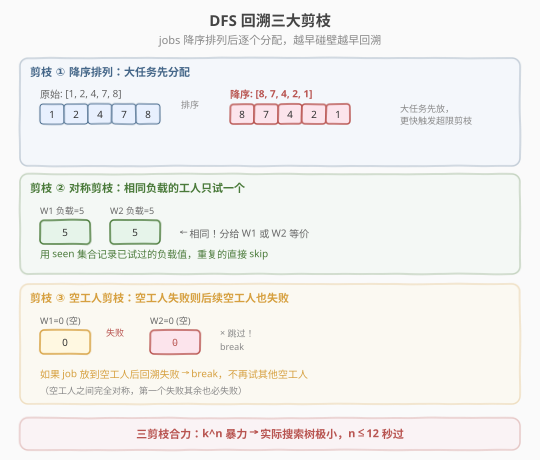
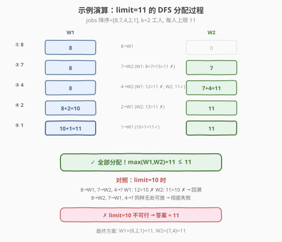

# 完成所有工作的最短时间

- **题目名称**：完成所有工作的最短时间
- **链接**：[1723. 完成所有工作的最短时间](https://leetcode.cn/problems/find-minimum-time-to-finish-all-jobs/)
- **难度**：困难
- **标签**：数组、二分查找、回溯、剪枝、状态压缩 DP

## 1. 题目概述

给定一个整数数组 `jobs`，其中 `jobs[i]` 是完成第 $i$ 项工作要花费的时间。你需要将这些工作分配给 $k$ 位工人——**每项工作恰好分给一位工人**，工人的**工作时间**是其所有分配工作的总时长。目标是**最小化最大工作时间**（即让最忙的工人尽可能轻松）。

**示例 1**：

```text
输入：jobs = [3,2,3], k = 3
输出：3
解释：给每位工人分配一项工作，最大工作时间 = 3。
```

**示例 2**：

```text
输入：jobs = [1,2,4,7,8], k = 2
输出：11
解释：1 号工人 {1,2,8} = 11；2 号工人 {4,7} = 11。最大 = 11。
```

**约束条件**：

- $1 \le k \le \text{jobs.length} \le 12$
- $1 \le \text{jobs}[i] \le 10^7$

> 💡 **关键信号**：$n \le 12$ 极小，暗示指数级搜索（回溯 / 状压 DP）可行。题目本质是**将 $n$ 个数分成 $k$ 组，最小化最大组内和**——经典的「最小化最大值」问题，天然适合**二分答案**。

---

## 2. 解题思路

### 2.1 暴力思路：枚举所有分配方案

每个 job 有 $k$ 种选择（分给哪个工人），$n$ 个 job 共 $k^n$ 种方案。对每种方案算最大工作时间取最小。

- $n = 12, k = 12$ 时 $k^n \approx 8.9 \times 10^{12}$，**远超时限**。

> ⚠️ **症结**：搜索空间 $k^n$ 太大。但注意到答案（最大工作时间）有**单调性**——如果上限 $\text{limit}$ 可行，那么更大的 $\text{limit}$ 也可行。这指向**二分答案 + 回溯验证**，用剪枝把 $k^n$ 压到极小。

### 2.2 核心观察：二分答案 + DFS 三大剪枝

![二分答案：在 [max(jobs), sum(jobs)] 上搜索最小可行上限](../images/1723_binary_search_concept.svg)

#### 观察 1：答案有单调性 → 二分

- **下界** $\text{left} = \max(\text{jobs})$：最大的单个 job 必须由某人完成。
- **上界** $\text{right} = \sum(\text{jobs})$：一个人干完所有活。
- 对每个 $\text{mid}$，调用 `check(mid)`：能否把所有 job 分给 $k$ 个工人且每人 $\le \text{mid}$？
  - 可行 → 缩右（`right = mid`），尝试更紧的上限。
  - 不可行 → 缩左（`left = mid + 1`）。

> 💡 `check(limit)` 就是「$k$ 维容量背包可行性判定」——每人容量 $\text{limit}$，所有 job 必须放完。

#### 观察 2：DFS 回溯 + 三大剪枝把 $k^n$ 压到极小

`check(limit)` 用 DFS 逐个分配 `job[idx]` 给某个工人，配三大剪枝：



| 剪枝 | 做法 | 原理 |
|------|------|------|
| **① 降序排列** | jobs 降序排序后再 DFS | 大任务先放，更早触发"超限"剪枝；小任务后放更易塞进缝隙 |
| **② 对称剪枝** | 用 `seen` 集合记录本轮已试过的工人负载，相同负载只试一次 | 负载相同的工人完全等价，分给谁都一样，避免重复搜索 |
| **③ 空工人剪枝** | 若 `workloads[i] == 0` 且分配后回溯失败，直接 `break` | 空工人之间完全对称，第一个空工人失败了，其余空工人也必失败 |

> ⚠️ **剪枝 ③ 最关键**：它把"试 $k$ 个空工人"降为"试 1 个空工人"，在搜索树深层砍掉了大量对称分支。搭配剪枝 ②，搜索树从 $k^n$ 萎缩到极小——$n = 12$ 时实际运行毫秒级。

### 2.3 算法流程图

**完整步骤**：

1. **排序**：`jobs` 降序排列（剪枝 ①）。
2. **二分**：`left = max(jobs)`，`right = sum(jobs)`。
3. **`check(mid)`**：DFS 回溯验证可行性——
   - `dfs(idx)`：若 `idx == n`，返回 `true`（所有 job 分完）。
   - 遍历工人 $i \in [0, k)$：
     - 若 `workloads[i] + jobs[idx] > limit` → 跳过（超限）。
     - 若 `workloads[i] ∈ seen` → 跳过（对称剪枝 ②）。
     - 否则：`seen.add(workloads[i])`，`workloads[i] += jobs[idx]`，递归 `dfs(idx+1)`。
     - 递归成功 → 返回 `true`；失败 → 回溯 `workloads[i] -= jobs[idx]`。
     - 若 `workloads[i] == 0` → `break`（空工人剪枝 ③）。
   - 返回 `false`。
4. 二分收敛后 `left` 即答案。

### 2.4 示例演算

以 `jobs = [1,2,4,7,8], k = 2` 为例（降序后 `[8,7,4,2,1]`）：



**二分过程**：

| 步骤 | left | right | mid | check(mid) | 动作 |
|------|------|-------|-----|-----------|------|
| 1 | 8 | 22 | 15 | ✓ (8+7=15, 4+2+1=7) | right=15 |
| 2 | 8 | 15 | 11 | ✓ (8+2+1=11, 7+4=11) | right=11 |
| 3 | 8 | 11 | 9 | ✗ (无处放 4) | left=10 |
| 4 | 10 | 11 | 10 | ✗ (无处放 4) | left=11 |
| 收敛 | 11 | 11 | — | — | 答案=11 |

**limit=11 的 DFS 成功路径**：

| 步骤 | job | W1 负载 | W2 负载 | 决策 |
|------|-----|---------|---------|------|
| ① | 8 | 8 | 0 | 8→W1 |
| ② | 7 | 8 | 7 | 7→W2（W1: 15&gt;11 ✗） |
| ③ | 4 | 8 | 11 | 4→W2（W1: 12&gt;11 ✗, W2: 11✓） |
| ④ | 2 | 10 | 11 | 2→W1（W2: 13&gt;11 ✗） |
| ⑤ | 1 | 11 | 11 | 1→W1（10+1=11✓） |

最终方案：W1={8,2,1}=11，W2={7,4}=11，最大=11 ✓

> 💡 **limit=10 为何失败**：8→W1, 7→W2 后，job=4 无处可放（W1: 8+4=12&gt;10，W2: 7+4=11&gt;10）。回溯尝试 8→W2, 7→W1 同样卡在 4。所有方案都失败。

---

## 3. 参考代码

### C++

```cpp
// 完成所有工作的最短时间.cpp —— 二分答案 + DFS 回溯剪枝
// 编译: g++ -O2 -std=c++17 完成所有工作的最短时间.cpp -o jobs
#include <vector>
#include <algorithm>
#include <numeric>
#include <unordered_set>
using namespace std;

class Solution {
  public:
    int minimumTimeRequired(vector<int>& jobs, int k) {
        sort(jobs.rbegin(), jobs.rend());            // 剪枝①：降序
        int left = jobs[0];                          // 下界 = max(jobs)
        int right = accumulate(jobs.begin(), jobs.end(), 0); // 上界 = sum(jobs)
        vector<int> workloads(k, 0);
        while (left < right) {
            int mid = left + (right - left) / 2;
            fill(workloads.begin(), workloads.end(), 0);
            if (dfs(jobs, workloads, 0, mid))
                right = mid;
            else
                left = mid + 1;
        }
        return left;
    }

  private:
    bool dfs(vector<int>& jobs, vector<int>& workloads, int idx, int limit) {
        if (idx == (int)jobs.size()) return true;    // 所有 job 分完
        unordered_set<int> seen;                     // 剪枝②：对称去重
        for (int i = 0; i < (int)workloads.size(); ++i) {
            if (workloads[i] + jobs[idx] > limit) continue;  // 超限跳过
            if (seen.count(workloads[i])) continue;           // 相同负载只试一次
            seen.insert(workloads[i]);
            workloads[i] += jobs[idx];
            if (dfs(jobs, workloads, idx + 1, limit)) return true;
            workloads[i] -= jobs[idx];
            if (workloads[i] == 0) break;            // 剪枝③：空工人失败则 break
        }
        return false;
    }
};
```

### Python

```python
class Solution:
    def minimumTimeRequired(self, jobs: list[int], k: int) -> int:
        jobs.sort(reverse=True)                      # 剪枝①：降序
        left, right = max(jobs), sum(jobs)

        def dfs(idx: int, workloads: list[int], limit: int) -> bool:
            if idx == len(jobs):
                return True
            seen = set()                             # 剪枝②：对称去重
            for i in range(k):
                if workloads[i] + jobs[idx] > limit:
                    continue
                if workloads[i] in seen:
                    continue
                seen.add(workloads[i])
                workloads[i] += jobs[idx]
                if dfs(idx + 1, workloads, limit):
                    return True
                workloads[i] -= jobs[idx]
                if workloads[i] == 0:                # 剪枝③：空工人失败则 break
                    break
            return False

        while left < right:
            mid = (left + right) // 2
            if dfs(0, [0] * k, mid):
                right = mid
            else:
                left = mid + 1
        return left
```

> 💡 **Python 实现细节**：每次 `check` 新建 `[0] * k` 作为 `workloads`，避免 `fill` 重置。`seen` 用 `set()` 记录本轮已试的负载值——由于 `workloads[i]` 是非负整数且 $\le \text{limit} \le 10^7 \times 12$，哈希集合足够高效。

---

## 4. 复杂度分析

| 维度 | 复杂度 | 说明 |
|------|--------|------|
| **时间** | $O\big(\log(\sum \text{jobs}) \cdot f(n, k)\big)$ | 二分 $O(\log S)$ 轮（$S = \sum \text{jobs}$），每轮 `check` 是 DFS 回溯。理论最坏 $k^n$，但三大剪枝使实际搜索树极小 |
| **空间** | $O(n + k)$ | `workloads` 数组 $O(k)$，DFS 递归栈 $O(n)$，`seen` 集合 $O(k)$ |

> ⚠️ **理论 vs 实际**：最坏情况 $k^n = 12^{12} \approx 8.9 \times 10^{12}$，但剪枝 ②（对称去重）和剪枝 ③（空工人 break）砍掉了绝大多数对称分支。实际运行中 $n = 12$ 的用例在毫秒级完成，远优于理论值。二分的 $\log S$ 轮（$S \le 12 \times 10^7 \approx 34$ 轮）开销可忽略。

---

## 5. 扩展：状压 DP 解法

除二分 + 回溯外，本题也可用**子集状压 DP** 求解，无需二分。

### 5.1 状态定义

- $\text{sum}[\text{mask}]$：子集 $\text{mask}$ 中所有 job 的总时长（预处理）。
- $\text{dp}[\text{mask}]$：将 $\text{mask}$ 中的 job 分给若干工人后，**最小化的最大工作时间**。

### 5.2 转转移方程

枚举 $\text{mask}$ 的一个子集 $\text{sub}$ 作为**当前工人**的分配，其余 $\text{mask} \setminus \text{sub}$ 由之前的工人承担：

$$\text{dp}[\text{mask}] = \min_{\text{sub} \subseteq \text{mask}} \max\big(\text{dp}[\text{mask} \setminus \text{sub}],\ \text{sum}[\text{sub}]\big)$$

但这里有个问题：$\text{dp}$ 没有记录用了几个工人。解决方法是**迭代 $k$ 轮**——每轮代表一个新工人：

```python
dp = [float('inf')] * (1 << n)
dp[0] = 0
for _ in range(k):                          # 每轮派一个工人
    new_dp = [float('inf')] * (1 << n)
    for mask in range(1 << n):
        if dp[mask] == float('inf'):
            continue
        sub = mask
        while sub:                          # 枚举 mask 的所有非空子集
            rest = mask ^ sub
            new_dp[rest] = min(new_dp[rest], max(dp[mask], sum_sub[sub]))
            sub = (sub - 1) & mask          # 子集枚举技巧
    dp = new_dp
return dp[0]                                # 全部分完，剩余空集
```

> 💡 **反向理解**：`dp[mask]` = 还剩 `mask` 中的 job 未分配时，已分配部分的最小最大值。每轮从 `mask` 中取出 `sub` 给当前工人，剩余 `rest = mask ^ sub` 进入下一轮。$k$ 轮后若 `dp[0]` 有值则可行。

### 5.3 复杂度

- 预处理 $\text{sum}[\text{mask}]$：$O(2^n \cdot n)$。
- DP：$k$ 轮，每轮枚举所有 $\text{mask}$ 及其子集，共 $k \cdot 3^n$（每个元素三态：在 sub / 在 rest / 不在 mask）。
- $n = 12$ 时 $3^{12} = 531441$，$k \cdot 3^n \approx 6.4 \times 10^6$，可接受。

### 5.4 两种方法对比

| 维度 | 二分 + 回溯 | 状压 DP |
|------|------------|---------|
| 时间 | $O(\log S \cdot f(n,k))$，剪枝后极快 | $O(k \cdot 3^n)$，稳定可预测 |
| 空间 | $O(n + k)$ | $O(2^n)$ |
| 适用性 | 依赖剪枝，最坏退化 | 不依赖数据，保证通过 |
| 推广性 | 适合 $n$ 小但 $k$ 大 | 适合 $n \le 20$ |

> 💡 **面试推荐**：二分 + 回溯更直观、空间更优、且剪枝后实际更快。状压 DP 适合作为「不依赖剪枝的保底方案」或面试官追问时展示。

---

## 6. 面试要点

**Q1：为什么可以用二分？单调性体现在哪里？**

> 如果上限 $\text{limit}$ 可行（所有 job 能分完且每人 $\le \text{limit}$），那么 $\text{limit} + 1$ 也可行——只需沿用同一方案。即"可行"关于 $\text{limit}$ 单调递增。因此答案满足「第一个可行的 $\text{limit}$」，适合二分找下界。

**Q2：三大剪枝各自的原理是什么？哪个最关键？**

> - **降序排列**：大任务先放更容易触发超限，剪枝更早发生（类比装箱先放大件）。
> - **对称剪枝**（`seen` 集合）：负载相同的工人完全等价，分给谁都一样，只试一个避免重复。
> - **空工人剪枝**（`break`）：空工人之间完全对称，第一个空工人失败了其余也必失败，直接 `break`。
>
> 最关键的是**空工人剪枝**——它在搜索树深层把"试 $k$ 个空工人"降为"试 1 个"，砍掉指数级对称分支。搭配对称剪枝，搜索树从 $k^n$ 萎缩到极小。

**Q3：二分的上下界怎么确定？**

> 下界 $\max(\text{jobs})$：最大的单个 job 必须由某人完成，所以最大工作时间 $\ge$ 最大 job。上界 $\sum(\text{jobs})$：一个人干完所有活。二分范围 $[\max, \sum]$，$O(\log(\sum - \max))$ 轮。

**Q4：状压 DP 的 $O(k \cdot 3^n)$ 怎么来的？**

> 每轮 DP 枚举所有 $\text{mask}$ 及其子集 $\text{sub}$。对每个元素有三 种状态：在 $\text{sub}$ 中 / 在 $\text{mask} \setminus \text{sub}$ 中 / 不在 $\text{mask}$ 中。故所有 $\text{(mask, sub)}$ 对的总数为 $3^n$。$k$ 轮迭代得 $O(k \cdot 3^n)$。子集枚举用 `sub = (sub - 1) & mask` 技巧遍历。

**Q5：如果 $n$ 更大（如 $n = 20$）怎么办？**

> 回溯剪枝会退化（搜索空间太大），状压 DP 的 $3^{20} \approx 3.5 \times 10^9$ 也超时。此时需考虑近似算法（如贪心 + 局部搜索、模拟退火），或问题是否有特殊结构（如 job 时长相同可简化）。$n \le 12$ 是本题刻意设置的"指数级可解"甜区。

> 💡 **一句话总结**：$n \le 12$ 的小数据 → 二分答案 + DFS 回溯三大剪枝（降序、对称、空工人），把 $k^n$ 搜索树剪到毫秒级。核心是「最小化最大值 → 二分」+「对称性剪枝」两个思想的组合。

---

## 7. 同类练习题

- [410. 分割数组的最大值](https://leetcode.cn/problems/split-array-largest-sum/)（[题解](../0401-0500/410_分割数组的最大值.md)）：同套路母题——二分答案 + 贪心验证，但要求**连续分段**（无需回溯），是本题的简化版
- [1011. 在 D 天内送达包裹的能力](https://leetcode.cn/problems/capacity-to-ship-packages-within-d-days/)（[题解](../1001-1100/1011_在D天内送达包裹的能力.md)）：二分答案 + 贪心验证，连续分段型，比 410 更直观的入门版
- [2305. 公平分发饼干](https://leetcode.cn/problems/fair-distribution-of-cookies/)：几乎同题（分饼干给 k 个孩子，最小化最大值），$n \le 8$，状压 DP 或回溯均可
- [1986. 完成任务的最少工作时间段](https://leetcode.cn/problems/minimum-number-of-work-sessions-to-finish-the-tasks/)：同框架但目标不同——给定 session 上限，求最少 session 数（最大化 vs 最小化的镜像问题），状压 DP 解
- [698. 划分为 k 个相等的子集](https://leetcode.cn/problems/partition-to-k-equal-sum-subsets/)：回溯 + 剪枝的经典题，判断能否分成 k 个和相等的子集，与本题的 DFS 回溯剪枝思路高度一致
