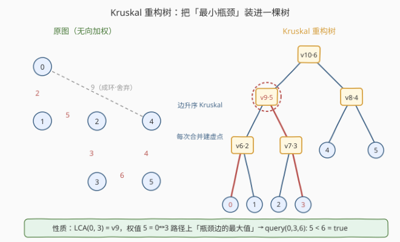
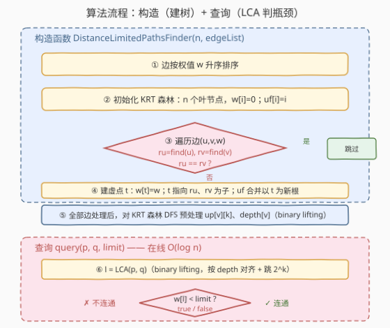
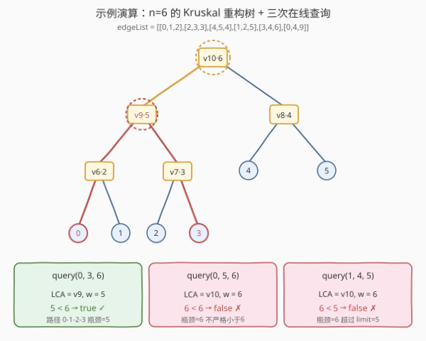

# 检查边长度限制的路径是否存在 II

- **题目名称**：检查边长度限制的路径是否存在 II
- **链接**：[1724. 检查边长度限制的路径是否存在 II](https://leetcode.cn/problems/checking-existence-of-edge-length-limited-paths-ii/)
- **难度**：困难
- **标签**：并查集、Kruskal 重构树、最近公共祖先 LCA、二分提升、在线查询

## 1. 题目概述

这是 [1697. 检查边长度限制的路径是否存在](../1601-1700/1697_检查边长度限制的路径是否存在.md) 的**在线版本**：查询不再一次性给出、不能排序，而是通过方法调用逐个到达，必须即时回答。

设计一个数据结构 `DistanceLimitedPathsFinder`：

- `DistanceLimitedPathsFinder(int n, vector<vector<int>>& edgeList)`：预处理。`edgeList[i] = [ui, vi, disi]` 表示点 `ui`、`vi` 间有一条长度为 `disi` 的无向边，两点间可能有多条边。
- `bool query(int p, int q, int limit)`：在线查询——判断是否存在从 `p` 到 `q` 的路径，且路径上**每一条边的长度都严格小于** `limit`。

**示例 1**：

```text
输入：
  n = 6
  edgeList = [[0,1,2],[2,3,3],[4,5,4],[1,2,5],[3,4,6],[0,4,9]]
  query(0, 3, 6)  → true   // 路径 0-1-2-3，边 2,5,3 都 < 6
  query(0, 5, 6)  → false  // 0→5 必经边 3-4(=6)，不满足 < 6
  query(1, 4, 5)  → false  // 1→4 必经边 3-4(=6)，超过 limit=5
```

**约束条件**：

- `2 <= n <= 10^4`
- `1 <= edgeList.length <= 10^4`
- `query` 调用总次数不超过 `10^4`
- `0 <= ui, vi, pj, qj <= n - 1`，`ui != vi`，`pj != qj`
- `1 <= disi, limit <= 10^9`
- 两点之间可能有多条边

> ⚠️ 与 1697 的关键差异：1697 把所有 `queries` 一次性传入，可按 `limit` 排序后用并查集**增量加边**；本题查询**在线到达**，大 `limit` 查询之后可能紧跟小 `limit` 查询，并查集「只加不删」的特性失效——必须**预处理一颗能回答任意瓶颈查询的树**。

---

## 2. 解题思路

### 2.1 暴力思路

每次 `query(p, q, limit)` 时，临时只保留长度 `< limit` 的边做 BFS/DFS 判连通。单次查询 $O(n + m)$，共 $q$ 次调用总复杂度 $O(q \cdot (n+m))$，在 $n, m, q \le 10^4$ 时约 $10^8$ 量级，勉强但低效；若规模再放大则必然超时。

更致命的是：查询在线到达、`limit` 任意波动，1697 的「排序 + 增量加边」**完全失效**——大 `limit` 加进去的边无法为后续小 `limit` 查询「撤回」。突破口是**把整张图的最小瓶颈结构一次性装进一棵树**，让任意 `query` 都能在树上 $O(\log n)$ 回答。

### 2.2 核心观察：Kruskal 重构树



**关键定理**：按边权升序执行 Kruskal，每次合并两个连通块时**新建一个虚点** $t$，令 $t$ 的权值为该边权值，并把两个块的原根挂为 $t$ 的子节点——这样得到的二叉树称为 **Kruskal 重构树（KRT）**。它有两条神仙性质：

1. **叶子是原节点**，内部点（虚点）对应一次合并，权值**沿根方向单调不减**（升序加边保证）。
2. **对任意两叶子 $p, q$，其 LCA 的权值 = $p, q$ 之间「瓶颈边的最大值」的最小值**（即 minimax 路径的瓶颈）。

于是在线查询被一举化解：

$$
\exists\ \text{path}(p, q)\ \text{with all edges} < \text{limit}
\iff \min_{\text{paths}}\max_{e \in \text{path}} w(e) < \text{limit}
\iff w\big[\text{LCA}(p, q)\big] < \text{limit}
$$

> 💡 直觉：KRT 把「图上最小瓶颈问题」转成「树上 LCA 问题」。LCA 用 binary lifting 预处理 $O(n \log n)$、单次查询 $O(\log n)$，完美适配在线场景。

> ⚠️ 原节点（叶子）权值设为 $0$，虚点权值设为对应边权。这样 `query(p, p, limit)` 时 $\text{LCA}=p$，$w[p]=0 < \text{limit}$ 恒真，符合「点到自身路径长度为 0」。

### 2.3 算法流程图



### 2.4 示例演算



以 `n = 6, edgeList = [[0,1,2],[2,3,3],[4,5,4],[1,2,5],[3,4,6],[0,4,9]]` 为例，边已升序。

**构建 KRT**（虚点编号从 $n=6$ 起）：

| 步骤 | 边 (u,v,w) | ru, rv | 动作 | KRT 变化 |
|------|-----------|--------|------|---------|
| ① | (0,1,2) | 0, 1 | 建虚点 v6(w=2)，挂 0,1 为子 | v6{0,1} |
| ② | (2,3,3) | 2, 3 | 建虚点 v7(w=3)，挂 2,3 为子 | v7{2,3} |
| ③ | (4,5,4) | 4, 5 | 建虚点 v8(w=4)，挂 4,5 为子 | v8{4,5} |
| ④ | (1,2,5) | v6, v7 | 建虚点 v9(w=5)，挂 v6,v7 为子 | v9{v6,v7} |
| ⑤ | (3,4,6) | v9, v8 | 建虚点 v10(w=6)，挂 v9,v8 为子 | v10{v9,v8} |
| ⑥ | (0,4,9) | v10, v10 | 同根 → **跳过**（重边/成环） | — |

最终 KRT（共 $2n-1 = 11$ 个节点）：

```text
         v10 (w=6)            ← 根
        /        \
     v9(w=5)    v8(w=4)
    /    \      /    \
  v6(2) v7(3)  4     5
  / \    / \
 0   1  2   3            ← 叶子（原节点）
```

**在线查询**：

- `query(0, 3, 6)`：LCA(0,3) = v9，$w=5$，`5 < 6` → **true**（路径 0-1-2-3 瓶颈边 = 5）
- `query(0, 5, 6)`：LCA(0,5) = v10，$w=6$，`6 < 6` → **false**（必经边 3-4=6，不严格小于）
- `query(1, 4, 5)`：LCA(1,4) = v10，$w=6$，`6 < 5` → **false**（瓶颈 6 超过 limit 5）

> 💡 第 ⑥ 步的「跳过」体现了 KRT 对重边的天然处理：短边先合并后，同两点间的长边发现已同根，直接弃用——这正是 Kruskal MST 的剪枝，保证 KRT 仅 $2n-1$ 个节点。

---

## 3. 参考代码

### C++（Kruskal 重构树 + binary lifting LCA）

```cpp
class DistanceLimitedPathsFinder {
    int nodeCnt, LOG;
    vector<int> wgt;                 // 节点权值：叶子=0，虚点=对应边权
    vector<int> krtPar;              // KRT 树父（不做路径压缩）
    vector<int> dep;                 // KRT 树深度
    vector<vector<int>> up;          // binary lifting: up[v][k]

    int findRoot(vector<int>& uf, int x) {
        while (uf[x] != x) { uf[x] = uf[uf[x]]; x = uf[x]; }   // 隔代压缩
        return x;
    }
public:
    DistanceLimitedPathsFinder(int n, vector<vector<int>>& edgeList) {
        sort(edgeList.begin(), edgeList.end(),
             [](const auto& a, const auto& b) { return a[2] < b[2]; });

        int maxNodes = 2 * n;                              // 至多 2n-1 个节点
        wgt.assign(maxNodes, 0);
        krtPar.resize(maxNodes);
        vector<int> uf(maxNodes);
        for (int i = 0; i < maxNodes; i++) { krtPar[i] = i; uf[i] = i; }

        nodeCnt = n;
        for (auto& e : edgeList) {
            int u = e[0], v = e[1], w = e[2];
            int ru = findRoot(uf, u), rv = findRoot(uf, v);
            if (ru == rv) continue;                       // 同根跳过（重边/成环）
            int t = nodeCnt++;                            // 新建虚点
            wgt[t] = w;
            krtPar[ru] = t;                               // 两根挂为 t 的子
            krtPar[rv] = t;
            uf[ru] = t;                                   // 并查集同步，新根为 t
            uf[rv] = t;
        }

        // 建 children 邻接表，BFS 求深度（避免递归栈溢出）
        vector<vector<int>> children(nodeCnt);
        vector<int> roots;
        for (int i = 0; i < nodeCnt; i++) {
            if (krtPar[i] == i) roots.push_back(i);
            else children[krtPar[i]].push_back(i);
        }
        dep.assign(nodeCnt, 0);
        queue<int> bfsq;
        for (int r : roots) { dep[r] = 0; bfsq.push(r); }
        while (!bfsq.empty()) {
            int x = bfsq.front(); bfsq.pop();
            for (int c : children[x]) { dep[c] = dep[x] + 1; bfsq.push(c); }
        }

        // binary lifting 预处理
        LOG = 1;
        while ((1 << LOG) < nodeCnt) LOG++;
        up.assign(nodeCnt, vector<int>(LOG + 1));
        for (int v = 0; v < nodeCnt; v++) up[v][0] = krtPar[v];   // 根的自指
        for (int k = 1; k <= LOG; k++)
            for (int v = 0; v < nodeCnt; v++)
                up[v][k] = up[up[v][k - 1]][k - 1];
    }

    int lca(int u, int v) {
        if (dep[u] < dep[v]) swap(u, v);
        int diff = dep[u] - dep[v];                       // 先深度对齐
        for (int k = 0; k <= LOG; k++)
            if (diff & (1 << k)) u = up[u][k];
        if (u == v) return u;
        for (int k = LOG; k >= 0; k--)                    // 再同步上跳
            if (up[u][k] != up[v][k]) { u = up[u][k]; v = up[v][k]; }
        return up[u][0];
    }

    bool query(int p, int q, int limit) {
        if (up[p][LOG] != up[q][LOG]) return false;       // 不同 KRT 树 → 原图不连通
        return wgt[lca(p, q)] < limit;                    // 瓶颈 < limit ?
    }
};
```

### Python（Kruskal 重构树 + binary lifting LCA）

```python
from collections import deque
from typing import List


class DistanceLimitedPathsFinder:
    def __init__(self, n: int, edgeList: List[List[int]]):
        edgeList.sort(key=lambda e: e[2])                 # 边升序
        max_nodes = 2 * n
        self.wgt = [0] * max_nodes
        krt_par = list(range(max_nodes))
        uf = list(range(max_nodes))

        def find(x):
            while uf[x] != x:
                uf[x] = uf[uf[x]]                         # 隔代压缩
                x = uf[x]
            return x

        node_cnt = n
        for u, v, w in edgeList:
            ru, rv = find(u), find(v)
            if ru == rv:
                continue                                  # 同根跳过
            t = node_cnt
            node_cnt += 1                                 # 新建虚点
            self.wgt[t] = w
            krt_par[ru] = t
            krt_par[rv] = t
            uf[ru] = t
            uf[rv] = t

        self.wgt = self.wgt[:node_cnt]
        krt_par = krt_par[:node_cnt]

        # BFS 求 depth（迭代，规避递归上限）
        children = [[] for _ in range(node_cnt)]
        roots = []
        for i in range(node_cnt):
            if krt_par[i] == i:
                roots.append(i)
            else:
                children[krt_par[i]].append(i)
        self.dep = [0] * node_cnt
        q = deque(roots)
        while q:
            x = q.popleft()
            for c in children[x]:
                self.dep[c] = self.dep[x] + 1
                q.append(c)

        # binary lifting
        self.LOG = max(1, node_cnt.bit_length())
        self.up = [[i] * (self.LOG + 1) for i in range(node_cnt)]
        for v in range(node_cnt):
            self.up[v][0] = krt_par[v]
        for k in range(1, self.LOG + 1):
            for v in range(node_cnt):
                self.up[v][k] = self.up[self.up[v][k - 1]][k - 1]

    def _lca(self, u: int, v: int) -> int:
        if self.dep[u] < self.dep[v]:
            u, v = v, u
        diff = self.dep[u] - self.dep[v]
        k = 0
        while diff:
            if diff & 1:
                u = self.up[u][k]
            diff >>= 1
            k += 1
        if u == v:
            return u
        for k in range(self.LOG, -1, -1):
            if self.up[u][k] != self.up[v][k]:
                u = self.up[u][k]
                v = self.up[v][k]
        return self.up[u][0]

    def query(self, p: int, q: int, limit: int) -> bool:
        if self.up[p][self.LOG] != self.up[q][self.LOG]:  # 不同树 → 不连通
            return False
        return self.wgt[self._lca(p, q)] < limit
```

---

## 4. 复杂度分析

| 维度 | 复杂度 | 说明 |
|------|--------|------|
| 预处理时间 | $O(m \log m + n \log n)$ | 边排序 $O(m \log m)$；Kruskal 建 KRT $O(m\,\alpha(n))$；binary lifting 表 $O(n \log n)$ |
| 单次查询 | $O(\log n)$ | binary lifting LCA：深度对齐 + 同步上跳，各 $O(\log n)$；权值比较 $O(1)$ |
| 空间复杂度 | $O(n \log n)$ | KRT 节点至多 $2n-1$，`up` 表 $O(n \log n)$；`krtPar`/`dep`/`wgt` 各 $O(n)$ |

> 💡 当 $n, m, q \le 10^4$ 时，预处理约 $10^4 \times 14 \approx 1.4 \times 10^5$，$10^4$ 次查询约 $1.4 \times 10^5$，整体远低于时限。即便 $n$ 放大到 $10^5$ 也可从容通过。

---

## 5. 扩展

1. **与 1697 离线版的对比**：1697 把查询按 `limit` 排序，让并查集**单调加边**复用连通信息，复杂度 $O((m+q)\alpha(n))$，但**前提是查询全部已知**。本题查询在线到达，排序不可行；KRT 把「时间维」（加边顺序）固化进树结构，从而支持任意 `limit` 的即时查询，代价是预处理升到 $O(n \log n)$、查询升到 $O(\log n)$。这是典型的「离线换在线」升级——用更多预处理换在线能力。

2. **替代解法：带权并查集 + 小到大合并 + binary lifting**。不建虚点，直接在并查集森林上做文章：合并时把小树根挂到大树根下，记录 `edgeW[root] = w`（该根被「接管」时的边权）。由于升序加边，沿父方向权值单调不减；同样用 binary lifting 维护「向上 $2^k$ 步的最大权值」，`query(p, q, limit)` 即把 $p, q$ 各自上跳到「权值 `< limit` 的最高祖先」，比较是否同根。本质与 KRT 同构（并查集森林就是一棵隐式 KRT），$O(\log n)$ 查询。KRT 显式建树、更易理解且支持更多衍生查询。

3. **KRT 的其他应用**：除「边权限制的连通性」外，KRT 还可回答「两点间最小瓶颈边权」（即 LCA 权值本身）、「使两点连通的最小 limit 阈值」、以及按权值分层的连通块统计。配合可持久化/树状数组还能支持「历史版本」查询。洛谷 P1967「货车运输」是该结构的经典模板题。

4. **「严格小于」vs「小于等于」**：题目要求边权**严格小于** `limit`，故判定为 `wgt[LCA] < limit`。若改为 `<=`，只需换成 `wgt[LCA] <= limit`，KRT 结构与 LCA 完全不变——这也是 KRT 解法的灵活之处。

---

## 6. 面试要点

1. **为什么 1697 的离线排序在本题行不通？**

   - 1697 假设所有查询已知，可按 `limit` 升序排列，让并查集只加边不删边。本题查询通过方法调用在线到达，`limit` 任意波动：一个大 `limit` 查询会加进大量长边，紧随的小 `limit` 查询无法把这些边「撤回」。并查集不支持删边，所以必须改用能**一次性编码全部瓶颈信息**的 Kruskal 重构树。

2. **KRT 的核心性质是什么？为什么 LCA 权值等于两点间的最小瓶颈？**

   - 升序 Kruskal 保证：每条边被处理时，若两端已同根则弃用（非 MST 边），否则建虚点记录此次合并。两叶子 $p, q$ 的 LCA 恰是「让它们首次进入同一连通块」的那次合并对应的虚点，其权值就是该合并边的权值——而升序处理保证该边权 = $p, q$ 间所有路径中「最大边权的最小值」（minimax）。这是 MST 性质「MST 上两点路径即为 minimax 路径」的树形编码。

3. **为什么要用 binary lifting 而不是 Tarjan 离线 LCA？**

   - Tarjan LCA 是**离线**算法，需预先知道全部查询，与「在线查询」需求矛盾。binary lifting 预处理 $O(n \log n)$、单次查询 $O(\log n)$，完全在线；且代码简短、常数小，是这类在线 LCA 问题的标准选择。若查询量极大且 $n$ 不变，还可考虑欧拉序 + RMQ（ST 表），查询 $O(1)$。

4. **重边和成环如何处理？KRT 节点数上界是多少？**

   - 升序 Kruskal 天然处理：短边先合并两点的连通块后，同两点的长边发现已同根、直接 `continue` 跳过，不建虚点。每次成功合并才建一个虚点，共 $n-1$ 次（若原图连通则更少），故 KRT 节点数 $\le 2n - 1$，`up` 表开 $2n \times \log(2n)$ 即可。

5. **原图不连通时查询会出错吗？如何处理？**

   - 会的。KRT 此时是**森林**而非单树，二分提升 LCA 在森林上直接套用会得到错误结果。代码里在 `query` 开头先比较 `up[p][LOG] != up[q][LOG]`（即两者的树根），不同根说明原图不连通、$p$ 到 $q$ 无任何路径，直接返回 `false`。同根时再走 LCA 流程，保证正确。

---

## 7. 同类练习题

- [1697. 检查边长度限制的路径是否存在](https://leetcode.cn/problems/checking-existence-of-edge-length-limited-paths/)（[题解](../1601-1700/1697_检查边长度限制的路径是否存在.md)）：本题的**离线版**，按 `limit` 排序 + 并查集增量加边，对照理解「离线换在线」的升级动机
- [1631. 最小体力消耗路径](https://leetcode.cn/problems/path-with-minimum-effort/)（[题解](../1601-1700/1631_最小体力消耗路径.md)）：并查集加边到起终点连通，瓶颈边权即为答案；KRT 同样可解，LCA 权值即为所求
- [1627. 带阈值的图连通性](https://leetcode.cn/problems/graph-connectivity-with-threshold/)（[题解](../1601-1700/1627_带阈值的图连通性.md)）：阈值筛选边后判连通，并查集 + 离线查询套路，承接本题的「权值门槛连通性」主题
- [1102. 得分最高的路径](https://leetcode.cn/problems/path-with-maximum-minimum-value/)：最大化路径上最小边权，并查集按边权降序加边或二分 + BFS；与本题「瓶颈边」思想互为镜像（maximin vs minimax）
- [778. 水位上升的游泳](https://leetcode.cn/problems/swim-in-rising-water/)：最小化路径最大边权，并查集升序加边或二分答案；KRT 解法中 LCA 权值即为游泳时间，承接本题结构
