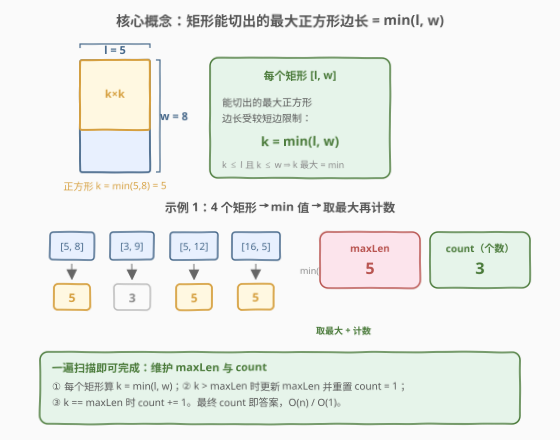
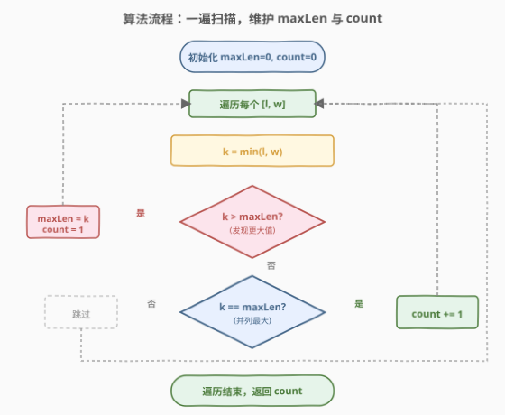
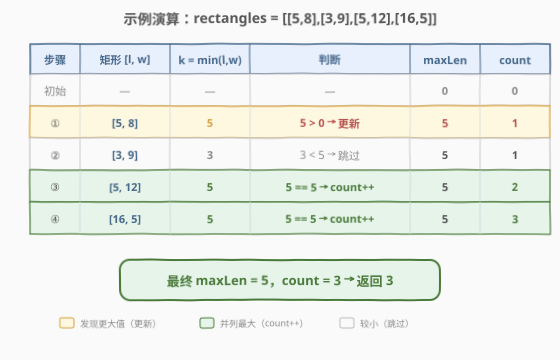

# 可以形成最大正方形的矩形数目

- **题目名称**：可以形成最大正方形的矩形数目
- **链接**：[1725. 可以形成最大正方形的矩形数目](https://leetcode.cn/problems/number-of-rectangles-that-can-form-the-largest-square/)
- **难度**：简单
- **标签**：数组

## 1. 题目概述

给你一个数组 `rectangles`，其中 `rectangles[i] = [li, wi]` 表示第 `i` 个矩形的长度为 `li`、宽度为 `wi`。

如果存在 `k` 同时满足 `k <= li` 和 `k <= wi`，就可以将第 `i` 个矩形切成边长为 `k` 的正方形。例如，矩形 `[4,6]` 可以切成边长最大为 `4` 的正方形。

设 `maxLen` 为可以从矩形数组 `rectangles` 切分得到的**最大正方形**的边长。请你统计有多少个矩形能够切出边长为 `maxLen` 的正方形，并返回矩形**数目**。

**示例 1**：

```text
输入：rectangles = [[5,8],[3,9],[5,12],[16,5]]
输出：3
解释：能从每个矩形中切出的最大正方形边长分别是 [5,3,5,5]。
      最大正方形的边长为 5，可以由 3 个矩形切分得到。
```

**示例 2**：

```text
输入：rectangles = [[2,3],[3,7],[4,3],[3,7]]
输出：3
解释：能从每个矩形中切出的最大正方形边长分别是 [2,3,3,3]。
      最大正方形的边长为 3，可以由 3 个矩形切分得到。
```

**约束条件**：

- $1 \le \text{rectangles.length} \le 1000$
- $\text{rectangles[i].length} = 2$
- $1 \le l_i, w_i \le 10^9$
- $l_i \ne w_i$

> 💡 **关键观察**：每个矩形能切出的最大正方形边长就是 $\min(l_i, w_i)$（受较短边限制）。问题本质是：在 $\min(l_i, w_i)$ 构成的序列中，找最大值并统计其出现次数——标准的「求最大 + 计数」。

---

## 2. 解题思路

### 2.1 暴力思路：两遍扫描

最直观的做法分两步：

1. **第一遍**：遍历所有矩形，计算每个 $\min(l_i, w_i)$，记录最大值 `maxLen`。
2. **第二遍**：再遍历一次，统计 $\min(l_i, w_i) = \text{maxLen}$ 的矩形个数。

```text
min_vals = [min(l, w) for [l, w] in rectangles]
maxLen = max(min_vals)
count = sum(1 for v in min_vals if v == maxLen)
return count
```

时间复杂度 $O(n)$，空间复杂度 $O(n)$（存了 `min_vals` 列表）。如果把第一步的最大值和第二步的计数合并到同一遍循环里，空间可降到 $O(1)$，但仍是两遍扫描的逻辑（先确定最大，再计数）。实际上可以更进一步：**一遍扫描同时维护最大值与计数**。

### 2.2 核心观察：一遍扫描，维护 maxLen 与 count



关键洞察：**不需要先知道全局最大值才能计数**。可以在遍历时同步维护 `maxLen` 和 `count`，规则如下：

- 当 $k = \min(l_i, w_i) > \text{maxLen}$ 时：发现更大的值，之前的计数全部作废——更新 $\text{maxLen} = k$，重置 $\text{count} = 1$。
- 当 $k = \text{maxLen}$ 时：并列最大，$\text{count} += 1$。
- 当 $k < \text{maxLen}$ 时：跳过，不影响结果。

> 💡 **正确性论证**：`count` 始终等于「当前已扫描部分中等于当前 `maxLen` 的元素个数」。一旦遇到更大的值，之前的元素都严格小于新 `maxLen`，不可能贡献到最终计数，因此重置为 1 是安全的。遍历结束时 `maxLen` 就是全局最大，`count` 就是全局最大值的出现次数。

### 2.3 算法流程图



**步骤**：

1. **初始化**：`maxLen = 0`，`count = 0`。
2. **遍历**每个矩形 $[l, w]$：
   - 计算 $k = \min(l, w)$。
   - **若 $k > \text{maxLen}$**：`maxLen = k`，`count = 1`。
   - **否则若 $k == \text{maxLen}$**：`count += 1`。
   - **否则**：跳过。
3. **返回** `count`。

### 2.4 示例演算

以示例 1 `rectangles = [[5,8],[3,9],[5,12],[16,5]]` 为例：



| 步骤 | 矩形 $[l, w]$ | $k = \min(l, w)$ | 判断 | maxLen | count |
|------|---------------|-------------------|------|--------|-------|
| 初始 | — | — | — | $0$ | $0$ |
| ① | $[5, 8]$ | $5$ | $5 > 0$ → 更新 | $5$ | $1$ |
| ② | $[3, 9]$ | $3$ | $3 < 5$ → 跳过 | $5$ | $1$ |
| ③ | $[5, 12]$ | $5$ | $5 == 5$ → count++ | $5$ | $2$ |
| ④ | $[16, 5]$ | $5$ | $5 == 5$ → count++ | $5$ | $3$ |

最终 $\text{maxLen} = 5$，$\text{count} = 3$，返回 $3$ ✓。

> 💡 **验算示例 2**：`[[2,3],[3,7],[4,3],[3,7]]` → $\min$ 值 $[2, 3, 3, 3]$。① $k=2>0$，maxLen=2, count=1；② $k=3>2$，maxLen=3, count=1（重置！）；③ $k=3==3$，count=2；④ $k=3==3$，count=3。返回 $3$ ✓。注意步骤②中 $k=3$ 覆盖了之前的 maxLen=2，count 从 1 重新开始——这正是「发现更大值时重置」的体现。

---

## 3. 参考代码

### Python（一遍扫描）

```python
class Solution:
    def countGoodRectangles(self, rectangles: list[list[int]]) -> int:
        maxLen = 0
        count = 0
        for l, w in rectangles:
            k = min(l, w)
            if k > maxLen:
                maxLen = k
                count = 1
            elif k == maxLen:
                count += 1
        return count
```

### Python（两遍扫描，对照写法）

```python
class Solution:
    def countGoodRectangles(self, rectangles: list[list[int]]) -> int:
        min_vals = [min(l, w) for l, w in rectangles]
        maxLen = max(min_vals)
        return min_vals.count(maxLen)
```

### C++（一遍扫描）

```cpp
class Solution {
  public:
    int countGoodRectangles(vector<vector<int>>& rectangles) {
        int maxLen = 0, count = 0;
        for (const auto& r : rectangles) {
            int k = min(r[0], r[1]);
            if (k > maxLen) {
                maxLen = k;
                count = 1;
            } else if (k == maxLen) {
                count++;
            }
        }
        return count;
    }
};
```

> ⚠️ **实现细节**：① $l_i, w_i \le 10^9$，`min` 结果在 `int` 范围内，无需 `long long`。② `maxLen` 初始为 $0$ 是安全的：所有 $k = \min(l_i, w_i) \ge 1 > 0$，第一个矩形必然触发 `k > maxLen` 分支，`count` 被正确置为 1。③ 一遍扫描版用 `if / elif` 而非两个 `if`，因为 $k > \text{maxLen}$ 时更新后 $k == \text{maxLen}$ 必然成立，不应再触发 `count++`（否则首个矩形 count 变成 2）。

> 💡 **两种写法怎么选？** 面试中先说两遍扫描（思路最直白、不易错），再指出可以合并为一遍扫描、用 $O(1)$ 空间同步维护最大值与计数。$n \le 1000$ 时两者性能无差异，但一遍扫描体现了「在遍历中维护滚动最值」的技巧，是本题的加分项。

---

## 4. 复杂度分析

| 维度 | 复杂度 | 说明 |
|------|--------|------|
| 时间复杂度 | $O(n)$ | 一遍遍历，每个矩形做一次 `min` + 常数次比较 |
| 空间复杂度 | $O(1)$ | 只用 `maxLen` 和 `count` 两个变量，不存额外数组 |

> ⚠️ 两遍扫描版空间为 $O(n)$（存 `min_vals` 列表），时间仍为 $O(n)$。一遍扫描版把空间降到 $O(1)$，是更优解。

---

## 5. 扩展：为什么不能先排序再数？

有人可能想到先对 $\min(l_i, w_i)$ 排序，再取末尾连续相等的最大值个数。这也能 AC，但时间复杂度 $O(n \log n)$，劣于一遍扫描的 $O(n)$。

排序的本质是「把所有元素的关系都排清楚」，但本题只需要**最大值及其出现次数**——这是一个「局部信息」而非「全局序」。求最大值是 $O(n)$ 的，排序引入了不必要的 $O(\log n)$ 因子。同理，用堆 / 桶也不如直接遍历。

> 💡 **通用原则**：当只需要最值（最大/最小）及其计数时，一遍扫描 $O(n)$ 总是优于排序 $O(n \log n)$。只有当问题需要多次查询「第 k 大」或「区间最值」时，排序或预处理才有意义。

---

## 6. 面试要点

1. **为什么 $\min(l, w)$ 就是能切出的最大正方形边长？**

   > 正方形边长 $k$ 必须同时满足 $k \le l$ 和 $k \le w$，即 $k \le \min(l, w)$。要让 $k$ 最大，就取 $k = \min(l, w)$。这是「瓶颈在较短边」的直观体现。

2. **一遍扫描时，为什么 `k > maxLen` 时要重置 `count = 1` 而不是 `count += 1`？**

   > 因为新的 `maxLen` 比之前所有值都大，之前那些矩形都不可能切出这么大的正方形，对最终计数无贡献。重置为 1 表示「当前这个矩形是第一个达到新 maxLen 的」。如果只 `count += 1`，会把之前较小的值也算进去，导致多算。

3. **`maxLen` 初始化为 0 安全吗？会不会漏掉第一个矩形？**

   > 安全。约束 $l_i, w_i \ge 1$，故 $k = \min(l_i, w_i) \ge 1 > 0$。第一个矩形必然满足 $k > \text{maxLen}$，触发更新分支，`maxLen` 和 `count` 被正确设置。若初始化为 $-1$ 或 `INT_MIN` 也行，但 $0$ 最简洁且依赖约束条件。

4. **两遍扫描和一遍扫描，面试怎么取舍？**

   > 先说两遍扫描把题做对（逻辑最清晰），再指出可以合并为一遍、用 $O(1)$ 空间同步维护。$n \le 1000$ 时性能无差异，但一遍扫描展示了「在遍历中维护滚动状态」的能力，是加分项。核心区别：两遍扫描需要先确定全局最大再计数，一遍扫描利用「发现更大值时重置计数」把两步合一。

5. **如果题目改成「能切出边长 $\ge k$ 的正方形的矩形数目」怎么做？**

   > 直接一遍遍历，统计 $\min(l_i, w_i) \ge k$ 的个数即可，$O(n) / O(1)$。这比原题更简单——不需要维护最大值，只需一个阈值判定。原题的难点在于阈值（maxLen）本身需要在线确定。

> 💡 **一句话总结**：每个矩形贡献 $k = \min(l, w)$，一遍扫描同步维护 `maxLen` 与 `count`——发现更大值时重置 count=1，相等时 count++，最终 count 即答案，$O(n) / O(1)$。

---

## 7. 同类练习题

- [27. 移除元素](https://leetcode.cn/problems/remove-element/)：一遍遍历维护「写入位置」，与本题「一遍遍历维护 maxLen/count」同为 $O(n)$ 原地单遍扫描范式
- [1287. 有序数组中出现次数超过 25% 的元素](https://leetcode.cn/problems/element-appearing-more-than-25-in-sorted-array/)：有序数组中统计出现次数，对照「在遍历中维护计数」的技巧
- [747. 至少是其他数字两倍的最大数](https://leetcode.cn/problems/largest-number-at-least-twice-of-others/)：一遍扫描找最大值并维护次大值，对照「遍历时维护滚动最值」
- [1619. 删除某些元素后的数组均值](https://leetcode.cn/problems/mean-of-array-after-removing-some-elements/)：排序后截取中间段求均值，对照「需要全局序时排序 vs 只需最值时一遍扫描」的取舍
- [2341. 数组能形成多少数对](https://leetcode.cn/problems/maximum-number-of-pairs-in-array/)：一遍遍历统计频次再算对数，对照「遍历中维护计数状态」的简单数组题
