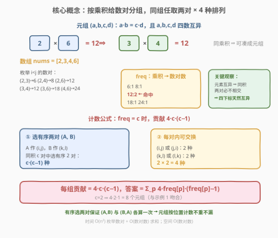
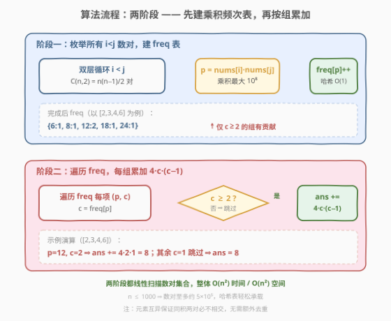

# 同积元组

- **题目名称**：同积元组
- **链接**：[1726. 同积元组](https://leetcode.cn/problems/tuple-with-same-product/)
- **难度**：中等
- **标签**：数组、哈希表、计数

## 1. 题目概述

给定一个由**不同**正整数组成的数组 `nums`，返回满足 $a \times b = c \times d$ 的元组 $(a, b, c, d)$ 的数量，其中 $a, b, c, d$ 都是 `nums` 中的元素，且 $a \neq b \neq c \neq d$（四数互异）。由于数组元素互异，"四数互异"等价于"四个下标互异"。

**示例 1**：

```text
输入：nums = [2,3,4,6]
输出：8
解释：8 个满足题意的元组为
(2,6,3,4), (2,6,4,3), (6,2,3,4), (6,2,4,3),
(3,4,2,6), (4,3,2,6), (3,4,6,2), (4,3,6,2)
```

**示例 2**：

```text
输入：nums = [1,2,4,5,10]
输出：16
解释：两组同积数对 —— 1·10 = 2·5 = 10 贡献 8 个；2·10 = 4·5 = 20 贡献 8 个，共 16 个。
```

**示例 3**：

```text
输入：nums = [2,3,4,6,8,12]
输出：40
解释：12=2·6=3·4 贡献 8；24=2·12=3·8=4·6 贡献 24；48=4·12=6·8 贡献 8，共 40 个。
```

**约束条件**：

- $1 \le \text{nums.length} \le 1000$
- $1 \le \text{nums[i]} \le 10^4$
- `nums` 中的所有元素**互不相同**

> 💡 **关键约束**：元素互异是本题的"护身符"——它保证**任意两个同积数对必然不相交**（若共享下标 $i$，则 $\text{nums}[i]\cdot\text{nums}[j]=\text{nums}[i]\cdot\text{nums}[k]$ 推出 $\text{nums}[j]=\text{nums}[k]$，与互异矛盾）。因此我们**无需任何去重**，只需数"同积数对有多少对"即可。而 $n \le 1000$ 意味着数对总数 $\binom{n}{2} \le 499500$，恰好落在 $O(n^2)$ 哈希的甜区。

---

## 2. 解题思路

### 2.1 暴力思路：四层循环枚举元组

最直观的做法是四层循环枚举所有 $(i, j, k, l)$，判断四下标互异且 $\text{nums}[i]\cdot\text{nums}[j] = \text{nums}[k]\cdot\text{nums}[l]$。

```text
for i in 0..n-1:
    for j in 0..n-1, j != i:
        for k in 0..n-1, k not in {i,j}:
            for l in 0..n-1, l not in {i,j,k}:
                if nums[i]*nums[j] == nums[k]*nums[l]:
                    ans += 1
```

时间复杂度 $O(n^4)$，$n=1000$ 时约 $10^{12}$ 次操作，**严重超时**。问题在于：元组由**两个等积数对**拼接而成，而暴力把"找等积数对"重复做了 $n^2$ 遍。需要把"等积关系"预先聚合成一次扫描可查的结构。

### 2.2 核心观察：按乘积分组，每组任取两对



把元组 $(a,b,c,d)$ 拆成**两个数对** $(a,b)$ 与 $(c,d)$，等式 $a\cdot b = c\cdot d$ 的本质是"两个数对落在**同一乘积组**里"。于是问题归约为两步：

1. **建组**：枚举所有 $i < j$ 的数对，按乘积 $p = \text{nums}[i]\cdot\text{nums}[j]$ 入哈希表 `freq`，`freq[p]` 即乘积为 $p$ 的数对个数。
2. **计数**：对每个乘积 $p$，设 $c = \text{freq}[p]$。从这 $c$ 个数对中**任取两个**即可拼成元组——但要注意元组 $(a,b,c,d)$ 是**有序**的，要数清所有排列。

**计数推导**（有序选两对 + 每对内交换）：

- **有序选两对**：把数对 $A$ 放在元组前位作 $(a,b)$、数对 $B$ 放在后位作 $(c,d)$。从 $c$ 个数对中选**有序**两个 $(A, B)$（$A \neq B$）共 $c\cdot(c-1)$ 种。注意 $(A,B)$ 与 $(B,A)$ 是不同的有序选择，对应不同的元组（如 $(2,6,3,4)$ 与 $(3,4,2,6)$），各算一次，不重不漏。
- **每对内交换**：$A=(a,b)$ 可写成 $(a,b)$ 或 $(b,a)$（2 种），$B=(c,d)$ 同理（2 种），共 $2\times 2 = 4$ 种。

$$\boxed{\text{每组贡献} = c\cdot(c-1)\cdot 4, \qquad \text{答案} = \sum_{p} 4\cdot\text{freq}[p]\cdot(\text{freq}[p]-1)}$$

以示例 1 验证：`freq = {6:1, 8:1, 12:2, 18:1, 24:1}`，仅 $p=12$ 满足 $c=2\ge 2$，贡献 $4\cdot2\cdot1 = 8$，与答案吻合。

> 💡 **为什么 $c=1$ 的组贡献为 0？** 公式 $4c(c-1)$ 在 $c=1$ 时为 $0$。直观上，一个数对孤零零没有"另一半"可拼，凑不出四数互异的元组。故代码里可直接套公式无需特判，或用 `if c >= 2` 跳过省点循环。

> ⚠️ **"有序选两对" vs "无序选两对"**：若误用组合数 $\binom{c}{2}=\frac{c(c-1)}{2}$（无序），会漏掉 $(A,B)$ 与 $(B,A)$ 的对称元组，结果少一半。正确做法是**有序**选两对 $c(c-1)$，再乘每对内 $4$ 种交换。等价地也可写成 $\binom{c}{2}\cdot 8$，二者数值相同：$\frac{c(c-1)}{2}\cdot 8 = 4c(c-1)$。

> 💡 **元素互异免去查重**：若两个同积数对共享下标 $i$，由 $\text{nums}[i]\cdot\text{nums}[j]=\text{nums}[i]\cdot\text{nums}[k]$ 推出 $\text{nums}[j]=\text{nums}[k]$，与互异矛盾。故同积两对**必然不相交**，四下标天然互异，无需任何去重。这是本题能用纯哈希计数的关键。

### 2.3 算法流程图



**步骤**：

1. **阶段一·建表**：初始化空哈希表 `freq`。双层循环枚举所有 $i < j$，计算 $p = \text{nums}[i]\cdot\text{nums}[j]$，执行 `freq[p] += 1`。
2. **阶段二·累加**：初始化 `ans = 0`。遍历 `freq` 每一项 $(p, c)$，若 $c \ge 2$，执行 `ans += 4 * c * (c - 1)`。
3. **返回** `ans`。

> 💡 **为何只枚举 $i < j$？** 数对 $(i,j)$ 与 $(j,i)$ 乘积相同，若都入表会把同一对算两次，导致 $c$ 翻倍、答案爆炸。固定 $i < j$ 让每个**无序下标对**恰入表一次，$c$ 即"无序数对个数"。元组的有序性已由公式里的 $c(c-1)$ 与 $4$ 充分覆盖。

> ⚠️ **乘积规模**：$\text{nums}[i] \le 10^4$，故 $p \le 10^8$，在 `int` 范围内（C++ `int` 上界约 $2.1\times10^9$）。但若用更小类型（如 `int16_t`）会溢出。Python 无此顾虑。

### 2.4 示例演算

以 `nums = [2,3,4,6]` 为例，演示两阶段全过程：

![示例演算：[2,3,4,6] → 8，以及 [2,3,4,6,8,12] → 40](../images/1726_example_walkthrough.svg)

**阶段一·建表**（枚举 6 个 $i<j$ 数对）：

| 数对 $(i,j)$ | 元素 | 乘积 $p$ | `freq` 更新后 |
|--------------|------|----------|----------------|
| (0,1) | 2,3 | 6 | {6:1} |
| (0,2) | 2,4 | 8 | {6:1, 8:1} |
| (0,3) | 2,6 | 12 | {6:1, 8:1, 12:1} |
| (1,2) | 3,4 | 12 | {6:1, 8:1, **12:2**} |
| (1,3) | 3,6 | 18 | {6:1, 8:1, 12:2, 18:1} |
| (2,3) | 4,6 | 24 | {6:1, 8:1, 12:2, 18:1, 24:1} |

**阶段二·累加**：

| 乘积 $p$ | $c = \text{freq}[p]$ | $c \ge 2$? | 贡献 $4c(c-1)$ |
|----------|----------------------|------------|----------------|
| 6 | 1 | 否 | 0 |
| 8 | 1 | 否 | 0 |
| **12** | **2** | **是** | $4\cdot2\cdot1 = 8$ |
| 18 | 1 | 否 | 0 |
| 24 | 1 | 否 | 0 |

**答案** `ans = 8` ✓

**示例 3 的 $c=3$ 验证**：`nums = [2,3,4,6,8,12]` 中乘积 $24$ 由 $(2,12),(3,8),(4,6)$ 三对凑成，$c=3$。有序选两对 $3\cdot2=6$ 种，每对内 $4$ 种交换，共 $6\cdot4=24$ 个元组；加上 $c=2$ 的两组（$12$ 与 $48$）各 $8$ 个，总 $24+8+8=40$ ✓。

---

## 3. 参考代码

### Python

```python
class Solution:
    def tupleSameProduct(self, nums: List[int]) -> int:
        freq = {}
        n = len(nums)
        for i in range(n):
            for j in range(i + 1, n):
                p = nums[i] * nums[j]
                freq[p] = freq.get(p, 0) + 1

        ans = 0
        for c in freq.values():
            if c >= 2:
                ans += 4 * c * (c - 1)
        return ans
```

### C++

```cpp
class Solution {
  public:
    int tupleSameProduct(vector<int>& nums) {
        unordered_map<int, int> freq;
        int n = nums.size();
        for (int i = 0; i < n; ++i) {
            for (int j = i + 1; j < n; ++j) {
                ++freq[nums[i] * nums[j]];
            }
        }

        int ans = 0;
        for (auto& [p, c] : freq) {
            if (c >= 2) {
                ans += 4 * c * (c - 1);
            }
        }
        return ans;
    }
};
```

> ⚠️ **实现细节**：① 内层循环 `j` 从 `i + 1` 起，保证每个无序数对只入表一次；若误写成 `j != i` 会让 $c$ 翻倍、答案变为正确的 4 倍。② 乘积 $p \le 10^8$ 不溢出 `int`，但若题面上界变大（如 $10^9$），应用 `long long` 存乘积。③ `ans` 最大值：$n=1000$ 时数对约 $5\times10^5$，极端情况下全部挤进同一乘积组（实际不可能，因元素互异且值域有限），$c\approx5\times10^5$ 时 $4c(c-1)\approx10^{12}$ 超 `int`——但元素互异 + 值域 $10^4$ 使同积组数受限，实际 `ans` 远未溢出 `int`（理论最坏约 $10^7$ 量级）。Python 无此顾虑。④ C++17 结构化绑定 `auto& [p, c]` 让遍历更清晰，等价于 `for (const auto& kv : freq)`。

> 💡 **一行写法**：也可省去 `if c >= 2`，直接 `ans += 4 * c * (c - 1)`——$c=1$ 时项为 $0$ 不影响结果。保留 `if` 仅省一点循环开销，可读性见仁见智。

---

## 4. 复杂度分析

| 维度 | 复杂度 | 说明 |
|------|--------|------|
| 时间复杂度 | $O(n^2)$ | 阶段一双层循环枚举 $\binom{n}{2} = \frac{n(n-1)}{2}$ 个数对，每次哈希 $O(1)$；阶段二遍历至多 $\binom{n}{2}$ 个不同乘积。总 $O(n^2)$ |
| 空间复杂度 | $O(n^2)$ | 最坏情况所有数对乘积互异，哈希表存 $\binom{n}{2}$ 项；实际受值域限制，不同乘积数 $\le 10^8$ 但远小于 $n^2$ 时退化为 $O(n^2)$ |

> ⚠️ 暴力 $O(n^4)$ 在 $n=1000$ 时约 $10^{12}$ 次操作超时；优化到 $O(n^2) \approx 5\times10^5$ 次哈希操作，快约 $2\times10^6$ 倍。核心是把"元组计数"拆成"数对分组 + 组合计数"，用哈希把等积关系一次聚齐。

> 💡 **$n \le 1000$ 的甜区**：$O(n^2)$ 在 $n=1000$ 时约 $5\times10^5$，是哈希表舒适区。若 $n$ 升到 $10^4$，$n^2=10^8$ 哈希操作 + 内存 $\sim$ 数百 MB，需谨慎；$n$ 再大则需另寻数论或值域压缩思路。

---

## 5. 扩展：为何元素互异如此重要？

本题的简洁性几乎全部建立在"元素互异"之上。若去掉这一条件，会发生什么？

**退化场景**：`nums = [2,2,2,2]`（四个相同的 2）。任意两对乘积都是 $4$，按本题公式 $c = \binom{4}{2} = 6$，贡献 $4\cdot6\cdot5 = 120$。但题面要求 $a\neq b\neq c\neq d$（四数互异），这里四数全同，**正确答案应为 0**——公式失效。

**失效根源**：元素重复后，"同积两对必不相交"不再成立。如数对 $(0,1)$ 与 $(0,2)$ 共享下标 $0$，乘积都是 $\text{nums}[0]\cdot\text{nums}[1] = \text{nums}[0]\cdot\text{nums}[2]$，但这并不推出 $\text{nums}[1]=\text{nums}[2]$（因为 $\text{nums}[1]$ 可能等于 $\text{nums}[2]$）。于是同积两对可能相交，四下标未必互异，公式把"相交两对"也计入了。

**修复方向**（若题面允许重复元素）：

1. **去重过滤**：枚举数对时记录下标对，计数阶段只统计"下标四元组互异"的组合——但同积组内两两配对需排除共享下标者，复杂度上升。
2. **按值分组**：先用 `Counter` 统计每个值的出现次数，枚举不同值对 $(x, y)$（$x \le y$）算乘积，再按"取下标"的组合数乘进去——当 $x = y$ 时同值数对个数是 $\binom{\text{cnt}[x]}{2}$，跨值数对是 $\text{cnt}[x]\cdot\text{cnt}[y]$。这把"下标互异"问题转化为"组合数乘法"，但仍需小心 $a\neq b\neq c\neq d$ 的四值互异判定。

> 💡 **设计哲学**：题面的"元素互异"不是凑数约束，而是**让问题从"组合计数+去重"退化为"纯哈希计数"的关键简化**。面试中遇到类似计数题，先看"元素是否互异 / 是否需要去重"——这决定了是用 $O(n^2)$ 哈希还是更复杂的组合枚举。

---

## 6. 面试要点

1. **为什么是 $4c(c-1)$ 而不是 $\binom{c}{2}\cdot 8$ 或 $8\binom{c}{2}$？**

   > 三者数值相同。$4c(c-1)$ 来自"有序选两对 $c(c-1)$ × 每对内 $4$ 种交换"；$\binom{c}{2}\cdot 8$ 来自"无序选两对 $\frac{c(c-1)}{2}$ × 两对互换 $2$ × 每对内 $4$"。两者等价：$\frac{c(c-1)}{2}\cdot8 = 4c(c-1)$。写代码时用前者更直观，少一个分支。

2. **为什么元素互异就不用去重？同积两对会不会共享下标？**

   > 不会。若数对 $(i,j)$ 与 $(k,l)$ 同积且共享下标（设 $i=k$），则 $\text{nums}[i]\cdot\text{nums}[j]=\text{nums}[i]\cdot\text{nums}[l]$，两边约去 $\text{nums}[i]$（正整数非零）得 $\text{nums}[j]=\text{nums}[l]$，与元素互异矛盾（除非 $j=l$，即两对完全相同，但枚举 $i<j$ 时同一对只入表一次）。故同积两对必不相交，四下标天然互异。

3. **为什么只枚举 $i < j$？枚举所有 $i \neq j$ 会怎样？**

   > 若枚举所有 $i\neq j$，每个无序数对被算两次（$(i,j)$ 与 $(j,i)$），$c$ 翻倍。公式 $4c(c-1)$ 在 $c\to2c$ 时变为 $4\cdot2c\cdot(2c-1)\approx16c^2$，是正确值 $4c^2$ 的约 4 倍。固定 $i<j$ 让每个无序数对恰入表一次，元组的有序性由公式充分覆盖。

4. **$n=1000$ 时哈希表会有多少项？空间够吗？**

   > 数对总数 $\binom{1000}{2}=499500$。最坏情况所有乘积互异，哈希表存约 $5\times10^5$ 项，每项几十字节，总内存约几十 MB，完全可接受。实际因值域 $\le10^8$ 且元素互异，不同乘积数远小于上界，更省。

5. **如果数组元素可能重复，公式还能直接用吗？**

   > 不能。重复元素会让同积两对可能共享下标（如 `[2,2,2,2]` 全同积但四数不互异），公式会多算。需改用"按值分组 + 组合数"思路：枚举不同值对 $(x,y)$，用 $\binom{\text{cnt}[x]}{2}$ 或 $\text{cnt}[x]\cdot\text{cnt}[y]$ 算数对数，并额外排除四值不互异的情况。复杂度与实现都显著上升——这也是题面给"元素互异"的原因。

6. **能否用排序 + 双指针代替哈希？**

   > 可以但更麻烦。把所有数对乘积排序后，相同乘积连成一段，双指针定位每段边界 $[L, R)$，段长 $c = R-L$，贡献 $4c(c-1)$。时间 $O(n^2\log n)$（排序主导），空间 $O(n^2)$ 存乘积数组。比哈希多一个 $\log$ 因子且要存全部乘积，**不如哈希 $O(n^2)$ 直接**。哈希胜在"边算边聚"，无需排序。

> 💡 **一句话总结**：元素互异让同积两对天然不相交，于是"枚举 $i<j$ 数对建乘积频次表 + 每组套 $4c(c-1)$"一步到位，$O(n^2)$ 时间 / $O(n^2)$ 空间，无需任何去重。

---

## 7. 同类练习题

- [454. 四数相加 II](https://leetcode.cn/problems/4sum-ii/)（[题解](../0401-0500/454_四数相加II.md)）：分组 + 哈希 Meet in the Middle，把四数问题拆成两组求和配对，与本题"按乘积分组计数"同为"哈希聚合等值关系"范式
- [1. 两数之和](https://leetcode.cn/problems/two-sum/)（[题解](../0001-0100/1_两数之和.md)）：哈希查补数的母题，对照"单点查询"与本题"批量分组计数"的不同哈希用法
- [1512. 好数对的数目](https://leetcode.cn/problems/number-of-good-pairs/)：数对计数 + 频次，按值分组求 $\binom{c}{2}$，对照"求和等值"与"乘积等值"的计数同构
- [2001. 可互换矩形的组数](https://leetcode.cn/problems/number-of-pairs-of-interchangeable-rectangles/)：按化简比例分组求 $\binom{c}{2}$，与本题"按乘积分组求 $c(c-1)$"同源，对照"无序数对"与"有序元组"的系数差异
- [18. 四数之和](https://leetcode.cn/problems/4sum/)（[题解](../0001-0100/18_四数之和.md)）：排序 + 双指针的四数问题，对照"哈希计数"与"排序双指针"两条不同技术路线处理多数关系
