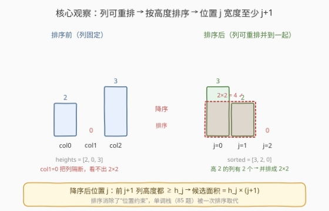
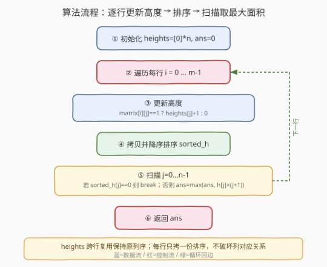
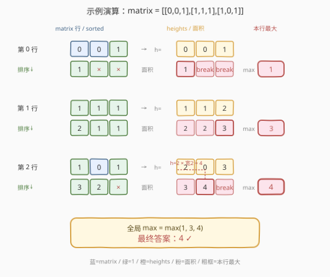

# 重新排列后的最大子矩阵

- **题目名称**：重新排列后的最大子矩阵
- **链接**：[1727. 重新排列后的最大子矩阵](https://leetcode.cn/problems/largest-submatrix-with-rearrangements/)
- **难度**：中等
- **标签**：贪心、数组、矩阵、排序、柱状图

## 1. 题目概述

给定一个大小为 $m \times n$ 的**二进制矩阵** `matrix`（元素为 `0` 或 `1`）。你可以将 `matrix` 的**列**按**任意顺序整体重排**（即挑一个列的全排列，应用到所有行）。返回重排后**全由 `1` 组成的最大子矩阵的面积**。

> ⚠️ **关键限制**：只能**整列**重排，列的相对顺序对所有行一致；不能单独重排某一行的列，也不能交换行。

**示例 1**：

```text
输入：matrix = [[0,0,1],
               [1,1,1],
               [1,0,1]]
输出：4
解释：可将列重排为 [2,0,1]（即原第 2 列放最左）：
      [[1,0,0],
       [1,1,1],
       [1,1,0]]
      ↑   ↑
      第 0~1 行、第 0~1 列构成 2×2 全 1 子矩阵，面积 4。
```

**示例 2**：

```text
输入：matrix = [[1,0,1,0,1]]
输出：3
解释：单行矩阵，把三个 1 列并到一起 → 1×3 全 1 子矩阵，面积 3。
```

**示例 3**：

```text
输入：matrix = [[1,1,0],
               [1,0,1]]
输出：2
解释：只能整列重排，第 0 列(高 2)必须和某个高 1 的列相邻，
      无法拼出面积 > 2 的全 1 子矩阵，最大面积 2。
```

**示例 4**：

```text
输入：matrix = [[0,0],[0,0]]
输出：0
解释：矩阵无 1，面积为 0。
```

**约束条件**：

- $m = \text{matrix.length}$，$n = \text{matrix[i].length}$
- $1 \le m \times n \le 10^5$
- $\text{matrix}[i][j]$ 为 $0$ 或 $1$

> 💡 **关键观察**：本题是 [85. 最大矩形](../0001-0100/85_最大矩形.md) 的「可重排列」变体——85 题列固定、要用**单调栈**求柱状图最大矩形；本题允许**整列重排**，意味着对每个作为「底」的行，我们可以把列按高度**排序**，单调栈被一次排序取代，难度从困难降到中等。核心公式：排序后第 $j$ 个位置的高度 $h_j$，保证至少有 $j+1$ 列高度 $\ge h_j$，候选面积即 $h_j \times (j+1)$。

---

## 2. 解题思路

### 2.1 暴力思路：枚举列排列

枚举所有 $n!$ 种列排列，对每种排列用 85 题的单调栈求最大全 1 子矩阵。$n!$ 在 $n \ge 10$ 时已爆炸，完全不可行。

> ⚠️ **症结**：列排列空间太大。但其实我们**不需要真的排出一个具体排列**——只需对每个候选「底行 + 高度」，统计有多少列能达到该高度，把它们并到一起即可。

### 2.2 核心观察：按行累加高度 + 排序取最大矩形



**两步转换**：

**第一步：把「矩阵」压缩成「每行的柱状图」**。对每一行 $i$，维护 `heights[j]` 表示「以第 $i$ 行为底、第 $j$ 列向上连续 `1` 的高度」：

$$
\text{heights}[j] = \begin{cases} \text{heights}[j] + 1, & \text{matrix}[i][j] = 1 \\ 0, & \text{matrix}[i][j] = 0 \end{cases}
$$

这与 [85. 最大矩形](../0001-0100/85_最大矩形.md) 的预处理完全相同——遇到 `0` 高度归零，遇到 `1` 高度累加。

**第二步：用「排序」替代「单调栈」**。85 题列不能动，要在固定列序上用单调栈找最大矩形；本题列可任意重排，所以对当前行的 `heights` **降序排序**即可。排序后，位于第 $j$ 位（从 0 起）的高度 $h_j$ 满足：

$$
h_0 \ge h_1 \ge \dots \ge h_j \quad\Longrightarrow\quad \text{至少 } j+1 \text{ 列的高度 } \ge h_j
$$

把这 $j+1$ 列并排摆在一起（重排允许！），就能得到一个**高 $h_j$、宽 $j+1$** 的全 1 子矩阵，面积为 $h_j \times (j+1)$。遍历 $j$ 取最大即为本行作为底的最大矩形。

$$\boxed{\text{answer} = \max_{i=0}^{m-1}\ \max_{j=0}^{n-1}\ \text{sorted}(\text{heights}_i)[j] \times (j+1)}$$

> 💡 **为什么列重排是全局的，却能按行独立排序？** 我们只需要找出**某个**最优子矩阵的面积，而非输出一个同时满足所有行的排列。最优子矩阵必然以某行 $i$ 为底——对这一行而言，把「高度 $\ge$ 目标高度」的列并到一起就能实现它，至于其它行怎么排无所谓。因此对每行独立求「排序后的最大矩形」再取全局 max，每个候选都对应一个**可行**的排列方案。

> ⚠️ **遇 0 提前终止**：排序后一旦 $h_j = 0$，后续全为 0，可直接 `break`，避免无意义计算。

### 2.3 算法流程图



**步骤**：

1. **初始化** `heights = [0] * n`，`ans = 0`。
2. **逐行处理** $i = 0 \dots m-1$：
   - **更新高度**：遍历列 $j$，`matrix[i][j] == 1` 则 `heights[j] += 1`，否则 `heights[j] = 0`。
   - **拷贝并降序排序**：`sorted_h = sorted(heights, reverse=True)`。
   - **扫描取最大**：对 $j = 0 \dots n-1$，若 `sorted_h[j] == 0` 则 `break`；否则 `ans = max(ans, sorted_h[j] * (j + 1))`。
3. **返回** `ans`。

> 💡 **为什么要拷贝再排序？** `heights` 要跨行复用（下一行还要在原列序上累加），不能就地排序破坏列与列的对应关系。每行拷一份 `sorted_h` 排序，`heights` 本身保持原列序。

### 2.4 示例演算

以示例 1 `matrix = [[0,0,1],[1,1,1],[1,0,1]]` 为例：



**第 0 行** `[0,0,1]`：
- 更新高度：`heights = [0, 0, 1]`（`0` 列遇 0 归零、`1` 列遇 0 归零、`2` 列遇 1 累加）。
- 降序排序：`[1, 0, 0]`。
- 扫描：$j=0: 1\times1=1$；$j=1: h=0$ → `break`。
- `ans = 1`。

**第 1 行** `[1,1,1]`：
- 更新高度：`heights = [1, 1, 2]`（三列全遇 1，分别 `0+1, 0+1, 1+1`）。
- 降序排序：`[2, 1, 1]`。
- 扫描：$j=0: 2\times1=2$；$j=1: 1\times2=2$；$j=2: 1\times3=3$。
- `ans = max(1, 3) = 3`。

**第 2 行** `[1,0,1]`：
- 更新高度：`heights = [2, 0, 3]`（`0` 列 `1+1=2`、`1` 列遇 0 归零、`2` 列 `2+1=3`）。
- 降序排序：`[3, 2, 0]`。
- 扫描：$j=0: 3\times1=3$；$j=1: 2\times2=4$；$j=2: h=0$ → `break`。
- `ans = max(3, 4) = 4`。

**最终答案**：`4` ✓

> 💡 **第 2 行为何取到 4？** 排序后 `[3, 2, 0]`：高度 3 的列单独成 1×3=3；但把「高度 3」和「高度 2」两列并排（重排允许），得到 2×2=4 的全 1 块（两列向上都有至少 2 层 1）。这正是「排序暴露最优宽高组合」的体现——不排序时这两列不相邻，看不出 2×2 的可能。

---

## 3. 参考代码

### C++

```cpp
class Solution {
public:
    int largestSubmatrix(vector<vector<int>>& matrix) {
        int m = matrix.size(), n = matrix[0].size();
        vector<int> heights(n, 0);
        int ans = 0;
        for (int i = 0; i < m; i++) {
            for (int j = 0; j < n; j++) {
                heights[j] = (matrix[i][j] == 1) ? heights[j] + 1 : 0;
            }
            vector<int> sorted_h = heights;
            sort(sorted_h.begin(), sorted_h.end(), greater<int>());
            for (int j = 0; j < n; j++) {
                if (sorted_h[j] == 0) break;
                ans = max(ans, sorted_h[j] * (j + 1));
            }
        }
        return ans;
    }
};
```

### Python

```python
class Solution:
    def largestSubmatrix(self, matrix: List[List[int]]) -> int:
        m, n = len(matrix), len(matrix[0])
        heights = [0] * n
        ans = 0
        for row in matrix:
            for j, v in enumerate(row):
                heights[j] = heights[j] + 1 if v else 0
            for j, h in enumerate(sorted(heights, reverse=True)):
                if h == 0:
                    break
                ans = max(ans, h * (j + 1))
        return ans
```

> 💡 **实现细节**：① `heights` 跨行复用、保持原列序；每行拷一份排序，避免破坏列对应关系。② 降序排序后用 `h * (j+1)`——位置 $j$ 表示前 $j+1$ 列高度都 $\ge h$。③ `h == 0` 提前 `break`：排序后 0 集中在尾部，遇到即终止。

> ⚠️ **不降序排序也行**：升序排序后从右往左扫，`h * (n - j)` 同样正确（位置 $j$ 右侧共 $n-j$ 列高度 $\ge h$）。降序写法更直观（$j+1$ 即宽度），本文采用降序。

---

## 4. 复杂度分析

| 维度 | 复杂度 | 说明 |
|------|--------|------|
| 时间 | $O(m \cdot n \log n)$ | 共 $m$ 行，每行更新高度 $O(n)$ + 排序 $O(n \log n)$ + 扫描 $O(n)$；由 $m \cdot n \le 10^5$、$\log n \le 17$，总量 $\le 1.7 \times 10^6$ |
| 空间 | $O(n)$ | `heights` 数组 $O(n)$ + 排序拷贝 `sorted_h` $O(n)$；不计输入矩阵 |

> 💡 **与 85 题对比**：85 题（列固定）用单调栈 $O(m \cdot n)$；本题（列可重排）用排序 $O(m \cdot n \log n)$。排序比单调栈多一个 $\log$，但换来了大幅简化——无需处理栈的弹出/边界。在 $m \cdot n \le 10^5$ 下两者都远在时限内。

> ⚠️ **能否做到 $O(m \cdot n)$？** 可以。由于高度是 $[0, m]$ 内整数，排序可用**计数排序** $O(n + m)$ 替代比较排序，总量降为 $O(m \cdot n)$。更进一步，可维护一个「存活列」的有序结构，逐行把遇 0 的列剔除——实现较繁琐，收益有限，见第 5 节。

---

## 5. 扩展：$O(m \cdot n)$ 优化与不可重排情形

### 5.1 计数排序优化

高度 `heights[j]` 取值范围 $[0, m]$（最多累加 $m$ 行）。每行排序可用计数排序替代：

- 用一个大小 $m+1$ 的桶数组 `cnt`，`cnt[h]` 统计高度等于 $h$ 的列数。
- 从高到低扫桶，累加宽度 `w += cnt[h]`，候选面积 `h * w`。

单行计数排序 $O(n + m)$，总量 $O(m \cdot n + m^2)$。当 $m$ 较小时优于比较排序；但 $m$ 也可能达 $10^5$（此时 $n=1$，本就 trivial）。实务中比较排序的 $O(m \cdot n \log n)$ 已足够快，计数排序仅在追求理论最优时使用。

### 5.2 维护有序结构（增量排序）

观察到相邻两行的 `heights` 关系：遇 1 的列高度 $+1$（相对顺序不变），遇 0 的列高度归零。可维护一个**按高度排序的列表**：

- 遇 1 的列：高度 $+1$，需在有序表中「上移」。
- 遇 0 的列：高度变 0，移到表尾。

用桶/链表可实现 $O(n)$ 摊还每行。实现细节多、易错，竞赛中很少采用，了解思想即可。

### 5.3 与 85 题（不可重排）的关系

[85. 最大矩形](../0001-0100/85_最大矩形.md) 列**不可**重排，要在固定列序的柱状图上求最大矩形，必须用**单调栈**处理「右边界确定时左边界在哪」——这是 $O(n)$ 的精髓。本题允许重排，**消除了列的位置约束**：任意子集都能并到一起，所以排序后「前 $j+1$ 个」直接给出宽度，单调栈被排序取代。

一句话：**85 题 = 单调栈（处理位置约束）；1727 题 = 排序（消除位置约束）**。预处理（按行累加高度）两者完全一致。

---

## 6. 面试要点

**Q1：为什么按行独立排序求最大矩形是正确的？列重排不是全局的吗？**

> 因为题目只要求「存在某种排列使某子矩阵面积最大」的**面积值**，不要求输出排列本身。最优子矩阵必以某行 $i$ 为底；对该行，把所有「高度 $\ge$ 目标高度」的列并排即可实现，其它行怎么排不影响这个子矩阵。所以对每行独立求最大矩形、再取全局 max，每个候选都对应一个可行排列，正确性得证。

**Q2：为什么要先拷贝 `heights` 再排序，不能就地排序吗？**

> `heights` 要跨行复用——下一行还要在**原列序**上做 `matrix[i][j]==1 ? heights[j]+1 : 0` 的累加。就地排序会打乱列与列的对应关系，导致下一行累加错位。每行拷一份排序，`heights` 始终保持原列序。

**Q3：排序后为什么 `h[j] * (j+1)` 就是候选面积？**

> 降序排序后 $h_0 \ge h_1 \ge \dots \ge h_j$，意味着前 $j+1$ 列的高度都 $\ge h_j$。把这 $j+1$ 列并排（重排允许），它们向上至少有 $h_j$ 层全 1，构成 $h_j \times (j+1)$ 的全 1 子矩阵。遍历 $j$ 取最大即覆盖所有「宽高组合」。

**Q4：本题与 85 题的核心区别？**

> 85 题列固定不可重排，要用**单调栈**在固定列序上找最大矩形，$O(m \cdot n)$，困难；本题列可任意重排，**位置约束消失**，单调栈退化为一次**排序** $O(m \cdot n \log n)$，中等。两者预处理（按行累加高度）完全相同，区别只在「如何由柱状图求最大矩形」——单调栈 vs 排序。

**Q5：时间复杂度能优化到 $O(m \cdot n)$ 吗？**

> 可以。高度是 $[0, m]$ 内整数，排序可用**计数排序** $O(n + m)$ 替代比较排序。但 $m \cdot n \le 10^5$ 下比较排序总量 $\le 1.7 \times 10^6$，已远在时限内，优化收益有限。面试时提一句「可用计数排序优化到线性」即可展示深度。

> 💡 **一句话总结**：按行累加高度（同 85 题）→ 每行降序排序（替代 85 题的单调栈）→ `h[j] * (j+1)` 取最大。列可重排消除了位置约束，单调栈变排序。

---

## 7. 同类练习题

- [85. 最大矩形](https://leetcode.cn/problems/maximal-rectangle/)（[题解](../0001-0100/85_最大矩形.md)）：本题的「不可重排」原型——列固定，需用单调栈求柱状图最大矩形，困难。掌握 85 题的预处理与单调栈后，本题只是把单调栈换成排序
- [84. 柱状图中最大的矩形](https://leetcode.cn/problems/largest-rectangle-in-histogram/)（[题解](../0001-0100/84_柱状图中最大的矩形.md)）：单调栈母题——85 题与本题共用的「柱状图最大矩形」思想的源头，单行柱状图求最大矩形
- [1504. 统计全 1 子矩形](https://leetcode.cn/problems/count-submatrices-with-all-ones/)（[题解](../1501-1600/1504_统计全1子矩形.md)）：同按行累加高度的框架，但求「全 1 子矩形总数」而非最大面积——排序变乘法原理计数，对照「求最值 vs 求计数」的套路分叉
- [2289. 重排数组以得到最大子矩阵和](https://leetcode.cn/problems/rearrange-array-to-maximize-submatrix-sum/)：本题思想在「求和」维度上的推广——仍按列重排，但矩阵元素非 0/1，需按行前缀和排序，是 1727 思路的加权进阶
