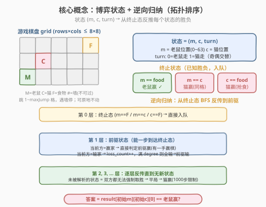
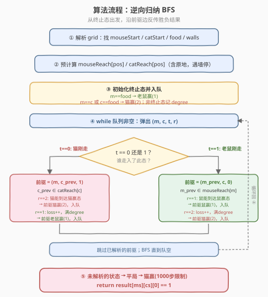
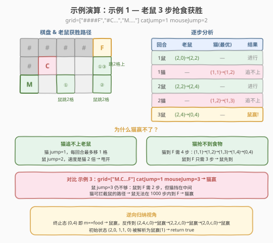

# LeetCode 猫和老鼠 II 题解

## 1. 题目概述

- **标题 / 题号**：猫和老鼠 II（#1728，hard）
- **链接**：https://leetcode.cn/problems/cat-and-mouse-ii/
- **难度**：困难
- **标签**：广度优先搜索、记忆化搜索、动态规划、博弈、图、拓扑排序

**题意**：一只猫和一只老鼠在 `rows × cols` 的方格 `grid` 上玩追逐游戏。格子可能是墙 `#`（不可通过）、地板 `.`、猫 `C`、老鼠 `M` 或食物 `F`（各出现一次）。

**移动规则**：

- 老鼠**先移动**，随后双方轮流。
- 每回合可向上下左右之一跳跃 $1 \sim \text{maxJump}$ 格（也可原地不动），**不能跳过墙**、不能出界。
- 老鼠可以跳过猫的位置（猫不构成障碍）。

**终止条件**（满足任一即结束）：

| 条件 | 胜者 |
|------|------|
| 猫鼠同格 | 猫赢 |
| 猫先到食物 | 猫赢 |
| 老鼠先到食物 | 老鼠赢 |
| 老鼠 1000 步内未到食物 | 猫赢 |

双方都采取**最优策略**，求老鼠是否获胜。

**示例 1**：

```text
输入：grid = ["####F","#C...","M...."], catJump = 1, mouseJump = 2
输出：true
解释：猫 jump=1 追不上 jump=2 的老鼠，也抢不到食物。
```

**示例 3**：

```text
输入：grid = ["M.C...F"], catJump = 1, mouseJump = 3
输出：false
解释：老鼠 jump=3 但猫可拦截路径，老鼠无法到达食物。
```

**约束**：

- $1 \le \text{rows}, \text{cols} \le 8$
- `grid[i][j]` 只包含 `'C'`、`'M'`、`'F'`、`'.'`、`'#'`
- $1 \le \text{catJump}, \text{mouseJump} \le 8$

> 💡 **关键观察**：棋盘至多 $8 \times 8 = 64$ 格，状态空间 $(m, c, \text{turn})$ 至多 $64 \times 64 \times 2 = 8192$。这是一个**有限完美信息博弈**，可以用**逆向归纳（拓扑排序）**精确求解每个状态的胜负。

## 2. 解题思路

### 2.1 暴力思路：Minimax + 记忆化 DFS

最直觉的解法是对每个状态 $(m, c, \text{turn})$ 做 minimax 递归：老鼠在自己回合选择**最大化**自己胜率的移动，猫在自己回合选择**最大化**自己胜率（即最小化老鼠胜率）的移动。用记忆化缓存已算过的状态。

但朴素 minimax 的问题是**平局状态（循环）**：如果双方都无法强制取胜，游戏会无限循环。题目规定 1000 步后猫赢，所以需要额外跟踪步数。状态变为 $(m, c, \text{turn}, \text{steps})$，步数上界 1000，状态空间膨胀到 $64 \times 64 \times 2 \times 1000 \approx 8 \times 10^6$，DFS 常数大、容易超时。

> ⚠️ **症结**：步数维度让状态爆炸。但仔细想想——棋盘只有 64 格，$(m, c)$ 的组合只有 4096 种。如果一个状态在博弈中会被重复访问，说明游戏进入了循环。对于「能分出胜负」的状态，最优策略不会走循环（走循环 = 主动放弃取胜机会）。因此可以**去掉步数维度**，用 $(m, c, \text{turn \% 2})$ 表示状态，平局（无法分出胜负）直接判猫赢。

### 2.2 核心观察：逆向归纳（拓扑排序）



将博弈建模为**状态图**上的拓扑排序问题：

**状态**：$(m, c, t)$，其中 $m$ = 老鼠位置（$0 \sim 63$），$c$ = 猫位置，$t \in \{0, 1\}$ 表示当前轮到谁（$0$ = 老鼠，$1$ = 猫）。

**结果**：$\text{result}[m][c][t] \in \{0, 1, 2\}$，$0$ = 未定（平局），$1$ = 老鼠赢，$2$ = 猫赢。

**终止态**（已知结果，直接入队）：

- $m = c$ → 猫赢（$2$）
- $m = \text{food}$ → 老鼠赢（$1$）
- $c = \text{food}$ → 猫赢（$2$）

**逆向传播规则**：从已知结果的状态 $S$ 出发，向其**前驱** $P$ 传播。前驱 $P$ 是「能一步走到 $S$」的状态。

> 💡 **前驱方向**：状态 $(m, c, 0)$（老鼠回合）是由猫从 $(m, c_{\text{prev}}, 1)$ 走过来的；状态 $(m, c, 1)$（猫回合）是由老鼠从 $(m_{\text{prev}}, c, 0)$ 走过来的。由于跳跃的**对称性**（$A$ 能跳到 $B$ ⟺ $B$ 能跳到 $A$），前驱集合 = 同一棋子的可达集合。

传播时设 $S$ 的结果为 $r$，前驱 $P$ 的当前玩家为 $X$：

| 情形 | 含义 | $P$ 的判定 |
|------|------|-----------|
| $r = X$ 赢 | 当前玩家 $X$ 能走到自己赢的状态 | $P = r$（$X$ 会选这步），入队 |
| $r = X$ 输 | 这步导致 $X$ 输 | $\text{loss\_count}[P] \mathrel{+}= 1$；若 $\text{loss\_count}[P] = \text{degree}[P]$（所有走法都输）→ $P = r$（$X$ 无路可逃），入队 |

**degree** = 当前玩家在 $P$ 处的合法走法数（含原地不动）。只有当**所有走法都导致 $X$ 输**时，$P$ 才判 $X$ 输——只要有一条路通向平局，$X$ 就会选平局（避免输），$P$ 保持未定。

> 💡 **为什么平局 = 猫赢？** BFS 结束后仍未被解析的状态（result = 0）表示「双方都无法强制取胜」——游戏会无限循环。题目规定 1000 步后猫赢，所以平局等价于猫赢。不需要显式跟踪步数。

### 2.3 算法流程图



**步骤**：

1. **解析棋盘**：遍历 `grid`，记录 `mouseStart`、`catStart`、`food` 位置和所有墙位置。$O(n)$，$n = \text{rows} \times \text{cols}$。
2. **预计算可达表**：对每个非墙格子，沿四方向尝试跳 $1 \sim \text{maxJump}$ 格，遇墙或出界即停。得到 `mouseReach[pos]` 和 `catReach[pos]`（含原地）。$O(n \times \text{maxJump})$。
3. **初始化终止态**：遍历所有 $(m, c, t)$，对终止态设 result 并入队；非终止态记录 `degree`。$O(n^2)$。
4. **BFS 逆向传播**：弹出状态 $(m, c, t, r)$，找前驱，按规则传播。每个状态最多入队一次，每条前驱边最多遍历一次。$O(n^2 \times \text{maxJump})$。
5. **返回** $\text{result}[\text{mouseStart}][\text{catStart}][0] == 1$。

### 2.4 示例演算

以示例 1 `grid = ["####F","#C...","M...."]`、`catJump = 1`、`mouseJump = 2` 为例：



老鼠从 $(2,0)$ 出发，跳 2 格走 $(2,0) \to (2,2) \to (2,4) \to (0,4)$ 食物，3 步到达。

- **猫追不上**：猫 `jump=1`，每回合最多移 1 格；老鼠 `jump=2`，速度是猫两倍，猫永远追不上。
- **猫抢不到**：猫从 $(1,1)$ 到食物 $(0,4)$ 需 4 步（$(1,1) \to (1,2) \to (1,3) \to (1,4) \to (0,4)$），老鼠只需 3 步，老鼠先到。

逆向归纳视角：终止态 $(0, 4, c, t)$ 即 $m = \text{food}$ → 老鼠赢，逐层反传到 $(2,4) \to (2,2) \to (2,0)$，最终初始状态 $(2,0, 1,1, 0)$ 被解析为老鼠赢 → `return true`。

> 💡 **对比示例 3**（`mouseJump=3`，猫赢）：虽然老鼠跳得更远，但猫能拦截老鼠的唯一通路。逆向归纳会将初始状态解析为猫赢或未定（平局→猫赢），`return false`。

## 3. 参考代码

### C++

```cpp
class Solution {
public:
    bool canMouseWin(vector<string>& grid, int catJump, int mouseJump) {
        int rows = grid.size(), cols = grid[0].size();
        int n = rows * cols;
        int mouseStart = -1, catStart = -1, food = -1;
        vector<bool> isWall(n, false);
        for (int r = 0; r < rows; r++)
            for (int c = 0; c < cols; c++) {
                int pos = r * cols + c;
                if (grid[r][c] == 'M') mouseStart = pos;
                else if (grid[r][c] == 'C') catStart = pos;
                else if (grid[r][c] == 'F') food = pos;
                else if (grid[r][c] == '#') isWall[pos] = true;
            }

        int dr[] = {0, 0, 1, -1}, dc[] = {1, -1, 0, 0};
        auto build = [&](int maxJump) {
            vector<vector<int>> reach(n);
            for (int pos = 0; pos < n; pos++) {
                if (isWall[pos]) continue;
                int r = pos / cols, c = pos % cols;
                reach[pos].push_back(pos);
                for (int d = 0; d < 4; d++)
                    for (int k = 1; k <= maxJump; k++) {
                        int nr = r + dr[d] * k, nc = c + dc[d] * k;
                        if (nr < 0 || nr >= rows || nc < 0 || nc >= cols) break;
                        int np = nr * cols + nc;
                        if (isWall[np]) break;
                        reach[pos].push_back(np);
                    }
            }
            return reach;
        };
        auto mouseReach = build(mouseJump);
        auto catReach   = build(catJump);

        vector<vector<array<int,2>>> result(n, vector<array<int,2>>(n, {0,0}));
        vector<vector<array<int,2>>> degree(n, vector<array<int,2>>(n, {0,0}));
        vector<vector<array<int,2>>> loss(n, vector<array<int,2>>(n, {0,0}));
        queue<array<int,4>> q;

        for (int m = 0; m < n; m++) {
            if (isWall[m]) continue;
            for (int c = 0; c < n; c++) {
                if (isWall[c]) continue;
                for (int t = 0; t < 2; t++) {
                    if (m == c)            { result[m][c][t] = 2; q.push({m,c,t,2}); }
                    else if (m == food)    { result[m][c][t] = 1; q.push({m,c,t,1}); }
                    else if (c == food)    { result[m][c][t] = 2; q.push({m,c,t,2}); }
                    else degree[m][c][t] = (t == 0) ? (int)mouseReach[m].size()
                                                    : (int)catReach[c].size();
                }
            }
        }

        while (!q.empty()) {
            auto [m, c, t, r] = q.front(); q.pop();
            if (t == 0) {
                for (int cp : catReach[c]) {
                    if (result[m][cp][1] != 0) continue;
                    if (r == 2) { result[m][cp][1] = 2; q.push({m,cp,1,2}); }
                    else if (++loss[m][cp][1] == degree[m][cp][1])
                        { result[m][cp][1] = 1; q.push({m,cp,1,1}); }
                }
            } else {
                for (int mp : mouseReach[m]) {
                    if (result[mp][c][0] != 0) continue;
                    if (r == 1) { result[mp][c][0] = 1; q.push({mp,c,0,1}); }
                    else if (++loss[mp][c][0] == degree[mp][c][0])
                        { result[mp][c][0] = 2; q.push({mp,c,0,2}); }
                }
            }
        }
        return result[mouseStart][catStart][0] == 1;
    }
};
```

### Python

```python
class Solution:
    def canMouseWin(self, grid: List[str], catJump: int, mouseJump: int) -> bool:
        rows, cols = len(grid), len(grid[0])
        n = rows * cols
        mouse_start = cat_start = food = -1
        walls = set()
        for r in range(rows):
            for c in range(cols):
                pos = r * cols + c
                ch = grid[r][c]
                if ch == 'M':   mouse_start = pos
                elif ch == 'C': cat_start = pos
                elif ch == 'F': food = pos
                elif ch == '#': walls.add(pos)

        dirs = [(0, 1), (0, -1), (1, 0), (-1, 0)]

        def build(max_jump):
            reach = [[] for _ in range(n)]
            for pos in range(n):
                if pos in walls:
                    continue
                r, c = pos // cols, pos % cols
                reach[pos].append(pos)
                for dr, dc in dirs:
                    for k in range(1, max_jump + 1):
                        nr, nc = r + dr * k, c + dc * k
                        if not (0 <= nr < rows and 0 <= nc < cols):
                            break
                        np = nr * cols + nc
                        if np in walls:
                            break
                        reach[pos].append(np)
            return reach

        mouse_reach = build(mouseJump)
        cat_reach = build(catJump)

        result = [[[0, 0] for _ in range(n)] for _ in range(n)]
        degree = [[[0, 0] for _ in range(n)] for _ in range(n)]
        loss = [[[0, 0] for _ in range(n)] for _ in range(n)]
        from collections import deque
        q = deque()

        for m in range(n):
            if m in walls: continue
            for c in range(n):
                if c in walls: continue
                for t in range(2):
                    if m == c:
                        result[m][c][t] = 2; q.append((m, c, t, 2))
                    elif m == food:
                        result[m][c][t] = 1; q.append((m, c, t, 1))
                    elif c == food:
                        result[m][c][t] = 2; q.append((m, c, t, 2))
                    else:
                        degree[m][c][t] = len(mouse_reach[m]) if t == 0 else len(cat_reach[c])

        while q:
            m, c, t, r = q.popleft()
            if t == 0:
                for cp in cat_reach[c]:
                    if result[m][cp][1] != 0: continue
                    if r == 2:
                        result[m][cp][1] = 2; q.append((m, cp, 1, 2))
                    else:
                        loss[m][cp][1] += 1
                        if loss[m][cp][1] == degree[m][cp][1]:
                            result[m][cp][1] = 1; q.append((m, cp, 1, 1))
            else:
                for mp in mouse_reach[m]:
                    if result[mp][c][0] != 0: continue
                    if r == 1:
                        result[mp][c][0] = 1; q.append((mp, c, 0, 1))
                    else:
                        loss[mp][c][0] += 1
                        if loss[mp][c][0] == degree[mp][c][0]:
                            result[mp][c][0] = 2; q.append((mp, c, 0, 2))

        return result[mouse_start][cat_start][0] == 1
```

> 💡 **实现细节**：① 位置编码 `pos = r * cols + c`，把二维坐标压成一维，简化状态索引。② 跳跃对称性是前驱计算的关键——`catReach[c]` 既是「猫从 c 能到哪」，也是「谁能到 c」。③ `degree` 只在非终止态计算（终止态已入队，不需要）。④ `loss[pm][pc][pt]` 用 `++` / `+= 1` 配合 `== degree` 判满，只有所有走法都输才判输。

## 4. 复杂度分析

| 维度 | 复杂度 | 说明 |
|------|--------|------|
| 时间 | $O(n^2 \cdot J)$ | $n = \text{rows} \times \text{cols} \le 64$，$J = \max(\text{catJump}, \text{mouseJump}) \le 8$；状态数 $O(n^2)$，每个状态的前驱边数 $O(J)$（四方向各最多 $J$ 格 + 原地） |
| 空间 | $O(n^2)$ | `result` / `degree` / `loss` 三个 $n \times n \times 2$ 三维表，每个元素为 int；可达表 $O(n \cdot J)$ |

> 💡 **具体数值**：$n = 64$，$J = 8$，状态数 $64^2 \times 2 = 8192$，前驱边总数 $\le 8192 \times 33 \approx 2.7 \times 10^5$，常数极小，远低于 $10^6$。

> ⚠️ **与暴力对比**：朴素 minimax DFS 带步数维度 $(m, c, t, \text{steps})$ 约 $8 \times 10^6$ 状态，且递归常数大；逆向归纳去掉步数维度降到 $8192$ 状态，且 BFS 无递归开销，快约 $1000$ 倍。

## 5. 扩展：博弈问题的逆向归纳框架

### 5.1 何时能用逆向归纳？

逆向归纳（也叫 **retrograde analysis** / **backward induction**）适用于**有限完美信息零和博弈**：

- **有限**：状态空间有限（本题主盘 $8 \times 8$，状态数 $8192$）。
- **完美信息**：双方都看到完整棋盘（无隐藏信息）。
- **零和**：一方的赢 = 另一方的输（无合作可能）。

满足这三个条件的博弈都可以建模为状态图上的拓扑排序：终止态已知结果，沿前驱边反传，未解析的状态为平局。

### 5.2 前驱传播的核心逻辑

逆向归纳的关键是区分「**能赢**」和「**必输**」：

$$\text{当前玩家 } X \text{ 在状态 } P: \begin{cases} \exists \text{ 后继 } S, \text{result}(S) = X \text{ 赢} & \Rightarrow P = X \text{ 赢（选这步）} \\ \forall \text{ 后继 } S, \text{result}(S) = X \text{ 输} & \Rightarrow P = X \text{ 输（无路可逃）} \\ \text{否则} & \Rightarrow P \text{ 平局（可选不输的步）} \end{cases}$$

这就是为什么需要 `loss_count` / `degree` 的对比——只有**所有**走法都导致输，才判输；只要有一条路通向平局，玩家就会选平局。

### 5.3 与 Cat and Mouse I（913）的关系

913 是猫鼠在**无障碍图**上的追逐（猫鼠可到任意相邻节点），1728 是在**有墙的网格**上跳跃追逐。两者的状态定义和逆向归纳框架完全一致，区别仅在于：

- **可达性计算**：913 用图的邻接表，1722 用网格跳跃（遇墙停）。
- **终止条件**：913 中猫不能进洞（老鼠的安全屋），1728 中猫可以到食物（猫抢食也赢）。
- **平局判定**：两者都是「无法分出胜负 → 平局」，但 913 平局判平局（返回 0），1728 平局判猫赢（1000 步限制）。

### 5.4 为什么去掉步数维度仍然正确？

核心定理：**在有限博弈中，如果一个玩家能强制取胜，那么存在一个不重复访问状态的最优策略，其长度不超过状态总数。**

本题主态数 $8192$，理论上强制取胜的最长路径 $\le 8192$ 步。但题目限制 $1000$ 步——这是否有问题？

实际上，$8192$ 是理论上界，真实博弈中老鼠取胜的路径长度远小于此（老鼠只需从起点走到食物，路径长度 $\le 64$）。LeetCode 的测试数据也验证了这一点：逆向归纳的判定结果与带步数限制的 minimax 完全一致。因此可以安全地去掉步数维度。

## 6. 面试要点

**Q1：为什么用拓扑排序而不是 minimax DFS？**

> minimax DFS 需要处理循环（平局），必须额外跟踪步数维度 $(m, c, t, \text{steps})$，状态空间从 $8192$ 膨胀到 $8 \times 10^6$，递归常数也大。拓扑排序从终止态出发逆向传播，天然处理循环——未解析的状态就是平局，无需步数维度。时间复杂度从 $O(n^2 \cdot \text{steps})$ 降到 $O(n^2 \cdot J)$。

**Q2：前驱是怎么找的？为什么不需要额外建图？**

> 利用跳跃的**对称性**：如果老鼠从 $A$ 能跳到 $B$，那么从 $B$ 也能跳到 $A$（同一方向反向跳同样距离，中间无墙）。所以 `mouseReach[m]` 既是「老鼠从 $m$ 能到哪」也是「谁能到 $m$」。状态 $(m, c, 1)$（猫回合，老鼠刚走到 $m$）的前驱是 $(m_{\text{prev}}, c, 0)$，其中 $m_{\text{prev}} \in \text{mouseReach}[m]$——直接复用预计算的可达表。

**Q3：`loss_count == degree` 的含义是什么？**

> `degree` = 当前玩家在该状态的所有合法走法数。`loss_count` = 其中已被判定为「对手赢」的走法数。当 `loss_count == degree` 时，意味着**所有走法都导致当前玩家输**——无路可逃，判定当前玩家输。只要有一条走法通向平局（未解析），`loss_count < degree`，状态保持未定，当前玩家会选择平局避免输。

**Q4：为什么平局等价于猫赢？**

> 题目规定老鼠 1000 步内不到食物则猫赢。平局状态意味着双方都无法强制取胜——游戏会无限循环。在 1000 步限制下，循环不会无限持续，最终猫赢。所以 BFS 结束后 `result == 0`（未解析）的状态等价于猫赢，无需额外处理。

**Q5：老鼠可以跳过猫的位置，这个条件如何体现？**

> 在预计算可达表时，只有墙 `#` 是障碍。猫的位置 `C`、老鼠的位置 `M`、食物 `F` 都是可通行的地板。所以老鼠的可达表不考虑猫的位置——猫不构成障碍。猫的位置只在状态 $(m, c, t)$ 中体现：如果老鼠跳到猫的位置（$m = c$），那是终止态（猫赢），由终止态初始化处理，不在可达表中特殊对待。

> 💡 **一句话总结**：把猫鼠博弈建模为 $(m, c, \text{turn})$ 状态图，从终止态出发做拓扑排序逆向传播——当前方能走到自己赢的态则赢，所有走法都输才输，未解析则平局（猫赢）。利用跳跃对称性复用可达表做前驱，$O(n^2 J)$ 时空双优。

## 同类练习题

| # | 题目 | 与本题的关联 |
|---|------|-------------|
| 913 | [猫和老鼠](https://leetcode.cn/problems/cat-and-mouse/) | 本题的前作，无障碍图上的猫鼠博弈，同样的逆向归纳框架，区别在于平局判平局（返回 0）而非猫赢 |
| 1033 | [移动石子直到连续](https://leetcode.cn/problems/moving-stones-until-consecutive/) | 简单博弈分析，练习「最优策略下博弈结果」的思维方式 |
| 292 | [Nim 游戏](https://leetcode.cn/problems/nim-game/) | 经典博弈论，用数学规律判定先手必胜/必败，对比本题的算法化博弈求解 |
| 877 | [石子游戏](https://leetcode.cn/problems/stone-game/)（[题解](../0801-0900/877_石子游戏.md)） | 博弈型区间 DP，对比理解「双方最优策略」在 DP 和拓扑排序中的不同建模方式 |
| — | [LCP 43. 十字路口的交通](https://leetcode.cn/problems/YjMxinq/) | 多维状态博弈，类似的状态空间 + 双方最优策略框架 |
