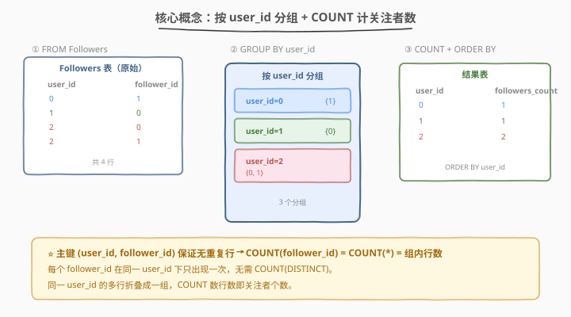
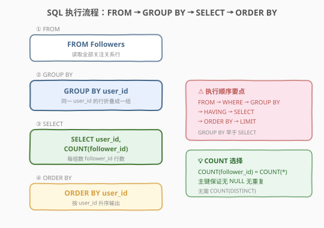
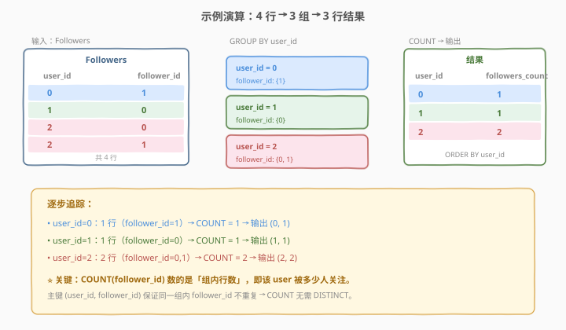

# 求关注者的数量

- **题目名称**：求关注者的数量
- **链接**：[1729. 求关注者的数量](https://leetcode.cn/problems/find-followers-count/)
- **难度**：简单
- **标签**：数据库、SQL、`GROUP BY`、`COUNT`、`ORDER BY`、聚合

## 1. 题目概述

给定 `Followers` 表，编写 SQL 查询，对于**每一个用户**，返回该用户的**关注者数量**。按 `user_id` 的顺序返回结果表。

**表结构**：

```text
Table: Followers
+-------------+------+
| Column Name | Type |
+-------------+------+
| user_id     | int  |
| follower_id | int  |
+-------------+------+
(user_id, follower_id) 是这个表的主键（具有唯一值的列的组合）。
该表包含一个关注关系中关注者和用户的编号，其中关注者关注用户。
```

**示例 1**：

```text
输入：
Followers 表：
+---------+-------------+
| user_id | follower_id |
+---------+-------------+
| 0       | 1           |
| 1       | 0           |
| 2       | 0           |
| 2       | 1           |
+---------+-------------+

输出：
+---------+----------------+
| user_id | followers_count|
+---------+----------------+
| 0       | 1              |
| 1       | 1              |
| 2       | 2              |
+---------+----------------+

解释：
0 的关注者有 {1}
1 的关注者有 {0}
2 的关注者有 {0,1}
```

**约束条件**：

- `(user_id, follower_id)` 是 `Followers` 表的主键，具有唯一值
- 结果按 `user_id` 升序排列

> 💡 本题是 SQL **"分组聚合计数"最基础招牌题**——核心两步：① `GROUP BY user_id` 把关注关系按被关注用户折叠成一组；② `COUNT(follower_id)` 数每组行数即关注者个数。难点仅在于理解 `GROUP BY` 的「同键折叠」语义，以及主键约束如何保证 `COUNT` 无需 `DISTINCT`。

---

## 2. 解题思路

### 2.1 暴力思路：逐用户扫描

最直觉的过程式思路：遍历所有不同的 `user_id`，对每个用户遍历全部关注关系行，筛出属于该用户的行，再统计行数。伪代码：

```text
for each distinct user_id u:
    rows = [r for r in Followers if r.user_id == u]
    result += (u, len(rows))
sort result by u
```

但**纯 SQL 没有显式逐行循环**——"按用户分组 + 组内计数"需换成集合式表达：用 `GROUP BY` 把关注关系按 `user_id` 折叠成一行，再用聚合函数 `COUNT` 一次性算出每个用户的关注者数。

### 2.2 核心观察：GROUP BY 分组 + COUNT 计数



**问题拆解为两个子问题**：

1. **按用户分组**：`GROUP BY user_id` 把同一 `user_id` 的所有关注关系行折叠成一组。例如 `user_id=2` 有两行 `(2,0)` 和 `(2,1)`，折叠成一组。

2. **聚合计数**：`COUNT(follower_id)` 数每组内 `follower_id` 的行数——即该用户被多少人关注。因主键 `(user_id, follower_id)` 保证同一组内 `follower_id` **不重复**且**非空**，`COUNT(follower_id)` = `COUNT(*)` = 组内行数，无需 `COUNT(DISTINCT)`。

> ⚠️ **为何不需要 `COUNT(DISTINCT follower_id)`？** 主键 `(user_id, follower_id)` 保证同一 `user_id` 下同一个 `follower_id` 只出现一次——不存在重复行。故 `COUNT(follower_id)` 已是去重后的计数，`DISTINCT` 多余。这是主键约束带来的「天然去重」保证。

> 💡 **`COUNT(follower_id)` vs `COUNT(*)`**：本题两者完全等价。`COUNT(follower_id)` 数 `follower_id` 非空值的行数；`COUNT(*)` 数所有行数（含 NULL）。因 `follower_id` 是主键的一部分，主键列不可为 NULL，故两者结果相同。写 `COUNT(follower_id)` 语义更自文档化——明确表达「数关注者」。

### 2.3 算法流程图



**逻辑执行步骤**：

| 步骤 | 子句 | 作用 |
|------|------|------|
| ① | `FROM Followers` | 读取全部关注关系行 |
| ② | `GROUP BY user_id` | 按 `user_id` 折叠，同一用户的行归为一组 |
| ③ | `SELECT user_id, COUNT(follower_id)` | 每组输出用户 ID 与关注者计数 |
| ④ | `ORDER BY user_id` | 按用户 ID 升序输出 |

> 💡 **SQL 子句执行顺序**：`FROM` → `WHERE` → `GROUP BY` → `HAVING` → `SELECT`（含聚合函数）→ `ORDER BY` → `LIMIT`。本题无 `WHERE`（无需行级过滤）、无 `HAVING`（无需组级过滤），是最简的「分组聚合」形态。`ORDER BY` 在 `SELECT` 之后执行，故可引用 `SELECT` 中的别名——但标准写法建议直接用原列名 `user_id`。

### 2.4 示例演算

以示例 1 的 4 行数据为例，观察「`GROUP BY` 分组 → `COUNT` 计数」的逐步过程：



**步骤 ①：FROM Followers**

| user_id | follower_id |
|---------|-------------|
| 0 | 1 |
| 1 | 0 |
| 2 | 0 |
| 2 | 1 |

**步骤 ②③：GROUP BY user_id + COUNT(follower_id)**

| 分组 | 组内行 | COUNT(follower_id) | 说明 |
|------|--------|---------------------|------|
| user_id=0 | (0,1) | 1 | 1 个关注者 |
| user_id=1 | (1,0) | 1 | 1 个关注者 |
| user_id=2 | (2,0), (2,1) | 2 | 2 个关注者 |

**步骤 ④：ORDER BY user_id**

| user_id | followers_count |
|---------|-----------------|
| 0 | 1 |
| 1 | 1 |
| 2 | 2 |

> 💡 **看 user_id=2 这一组**：两行 `(2,0)` 和 `(2,1)` 折叠成一组，`COUNT(follower_id) = 2`。主键保证 `follower_id` 不重复——若题目去掉主键约束，可能出现 `(2,0)` 重复两行，此时 `COUNT` 会得 3 而 `COUNT(DISTINCT)` 仍得 2，两者不再等价。

---

## 3. 参考代码

### SQL（解法 A：`GROUP BY` + `COUNT`，推荐）

```sql
SELECT
    user_id,
    COUNT(follower_id) AS followers_count
FROM Followers
GROUP BY user_id
ORDER BY user_id;
```

> 💡 **写法要点**：
> - **`GROUP BY user_id`**：按被关注用户 ID 分组，同一用户的多条关注关系折叠成一行。
> - **`COUNT(follower_id) AS followers_count`**：数每组内 `follower_id` 的非空行数，即关注者个数。别名 `followers_count` 对应输出列名。
> - **`ORDER BY user_id`**：题目要求按 `user_id` 顺序返回。`ORDER BY` 默认升序（`ASC`），可省略。
> - ✓ **最推荐**：语义清晰、一行聚合搞定，标准 SQL 通用写法。

### SQL（解法 B：`COUNT(*)` 等价写法）

```sql
SELECT
    user_id,
    COUNT(*) AS followers_count
FROM Followers
GROUP BY user_id
ORDER BY user_id;
```

> 💡 **解法 B 的思路**：因 `follower_id` 是主键的一部分（非空），`COUNT(*)` = `COUNT(follower_id)`。
>
> **与解法 A 的区别**：`COUNT(*)` 数所有行（含 NULL 行），`COUNT(follower_id)` 数 `follower_id` 非空行。本题主键保证无 NULL，两者等价。语义上 `COUNT(follower_id)` 更明确表达「数关注者」，`COUNT(*)` 更简洁。生产环境均可。

### Python（pandas）

```python
import pandas as pd

def count_followers(followers: pd.DataFrame) -> pd.DataFrame:
    result = (
        followers.groupby('user_id')
        .agg(followers_count=('follower_id', 'count'))
        .reset_index()
        .sort_values('user_id')
    )
    return result
```

> 💡 **pandas 对照**：
> - `followers.groupby('user_id')` 对应 SQL 的 `GROUP BY user_id`。
> - `.agg(followers_count=('follower_id', 'count'))` 对应 `COUNT(follower_id) AS followers_count`——pandas 的 `count` 统计非空值个数，与 SQL `COUNT(col)` 语义一致。
> - `.reset_index()` 把 `groupby` 的分组键从索引变回普通列，对应 SQL 结果的 `user_id` 列。
> - `.sort_values('user_id')` 对应 `ORDER BY user_id`。

---

## 4. 复杂度分析

| 维度 | 解法 A（`COUNT(follower_id)`） | 解法 B（`COUNT(*)`） | pandas |
|------|-------------------------------|----------------------|--------|
| **时间** | $O(n)$ | $O(n)$ | $O(n)$ |
| **空间** | $O(m)$ | $O(m)$ | $O(n)$ |
| **跨数据库** | 通用 | 通用 | — |
| **推荐度** | ✓ **语义首选** | ✓ **简洁首选** | ✓ 验证用 |

> - $n$ = `Followers` 表行数，$m$ = 不同 `user_id` 数（$m \le n$）
> - **时间**：`GROUP BY` 哈希聚合 $O(n)$（每个分组维护计数器，均摊 $O(1)$）；`ORDER BY` 对 $m$ 个分组排序 $O(m \log m)$；总时间 $O(n + m \log m) = O(n)$（因 $m \le n$）。
> - **空间**：SQL 解法需 $O(m)$ 存储分组结果（`user_id` → 计数器）；pandas 需 $O(n)$ 存 DataFrame。
> - **索引优化**：在 `Followers(user_id)` 上建索引可让 `GROUP BY user_id` 走索引顺序扫描，天然有序，省去排序开销。

---

## 5. 扩展：COUNT 家族辨析

SQL 中 `COUNT` 有多种写法，辨析如下：

| 写法 | 含义 | 本题是否适用 |
|------|------|-------------|
| `COUNT(*)` | 所有行数（含 NULL） | ✓ 等价 |
| `COUNT(follower_id)` | `follower_id` 非空值的行数 | ✓ **推荐** |
| `COUNT(DISTINCT follower_id)` | `follower_id` 非空去重后的值数 | ✓ 等价但多余 |
| `COUNT(1)` | 等价 `COUNT(*)` | ✓ 等价 |

> 💡 本题主键 `(user_id, follower_id)` 保证：① `follower_id` 非空（主键列不可 NULL）；② 同一 `user_id` 下 `follower_id` 不重复。故四种写法结果完全相同。**推荐 `COUNT(follower_id)`**——语义自文档化，明确表达「数关注者个数」。

> ⚠️ **何时必须用 `COUNT(DISTINCT)`？** 若表无主键约束，或主键不包含 `follower_id`，则同一 `user_id` 下可能出现重复 `follower_id`。此时 `COUNT(follower_id)` 会多算重复行，必须用 `COUNT(DISTINCT follower_id)` 去重。判断准则：**看主键是否覆盖了要计数的列**——覆盖则 `COUNT` 足够，否则需 `COUNT(DISTINCT)`。

---

## 6. 面试要点

1. **`GROUP BY` 的作用是什么？本题为何需要它？**

   > `GROUP BY` 把指定列值相同的行折叠成一组，对每组应用聚合函数（如 `COUNT`、`SUM`、`AVG`）得到一行结果。本题要「每个用户的关注者数」，即按 `user_id` 分组后数行数——没有 `GROUP BY` 就只能得到全表总关注者数，而非每用户分组。

2. **为什么不需要 `COUNT(DISTINCT follower_id)`？**

   > 主键 `(user_id, follower_id)` 保证同一 `user_id` 下同一 `follower_id` 只出现一次——不存在重复行。故 `COUNT(follower_id)` 已是去重后的计数，`DISTINCT` 多余。若表无此主键约束，则需 `COUNT(DISTINCT)` 防止重复计数。

3. **`COUNT(*)`、`COUNT(col)`、`COUNT(DISTINCT col)` 有何区别？**

   > `COUNT(*)` 数所有行（含 NULL）；`COUNT(col)` 数 `col` 非空值的行数（不去重）；`COUNT(DISTINCT col)` 数 `col` 非空去重后的值数。本题 `follower_id` 是主键列（非空且组内不重复），三者等价。一般场景：数行数用 `COUNT(*)`，数某列非空值用 `COUNT(col)`，数某列不同值用 `COUNT(DISTINCT col)`。

4. **`ORDER BY user_id` 能否省略？对结果有何影响？**

   > 题目明确要求「按 `user_id` 的顺序返回」，故不可省略。省略后 SQL 不保证输出顺序——虽然某些数据库（如 MySQL 的 InnoDB）在 `GROUP BY` 后可能恰好按分组键有序，但这不是 SQL 标准保证的行为，依赖实现细节不可靠。生产环境始终显式写 `ORDER BY`。

5. **如果某用户没有关注者，会出现在结果中吗？**

   > 不会。`GROUP BY` 只对表中**存在**的 `user_id` 产生分组。若某用户在 `Followers` 表中没有任何行（无人关注），则该用户不产生分组、不出现在结果中。若题目要求「列出所有用户，无关注者显示 0」，需用 `Users LEFT JOIN Followers` 补齐缺失用户——但本题无 `Users` 表，无此要求。

> 💡 **一句话总结**：1729 是 SQL **"分组聚合计数"最基础招牌题**——核心模板「`GROUP BY user_id` → `COUNT(follower_id)` → `ORDER BY user_id`」。最大要点：**主键约束保证 `COUNT` 无需 `DISTINCT`**；`GROUP BY` 把同用户行折叠成一组，`COUNT` 数行数即关注者个数。

---

## 7. 同类练习题

- [511. 游戏玩法分析 I](https://leetcode.cn/problems/game-play-analysis-i/)：`GROUP BY player_id` + `MIN(event_date)`，同为最基础的分组聚合入门题，巩固 `GROUP BY` 骨架
- [586. 订单最多的客户](https://leetcode.cn/problems/customer-placing-the-largest-number-of-orders/)：`GROUP BY` + `COUNT` + `ORDER BY ... LIMIT 1`，本题进阶——分组计数后取最大值
- [1565. 按月统计订单数与顾客数 🔒](https://leetcode.cn/problems/unique-orders-and-customers-per-month/)（[题解](../1501-1600/1565_按月统计订单数与顾客数.md)）：`GROUP BY` + `COUNT` + `COUNT(DISTINCT)`，本题的进阶版——区分 `COUNT` 与 `COUNT(DISTINCT)` 语义
- [1511. 消费者下单频率](https://leetcode.cn/problems/customer-order-frequency/)（[题解](../1501-1600/1511_消费者下单频率.md)）：`GROUP BY` + `HAVING` 双条件聚合过滤，在分组计数基础上叠加组级条件
- [580. 统计各专业学生人数](https://leetcode.cn/problems/count-student-number-in-departments/)：`GROUP BY` + `COUNT` + `LEFT JOIN` 补齐无数据分组，对照本题「无关注者用户不出现」的边界
