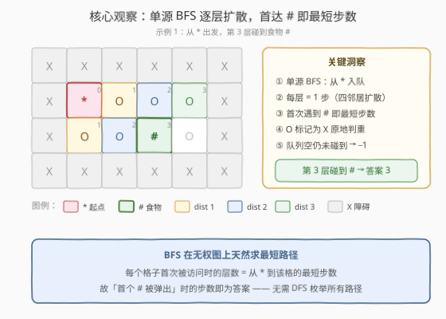
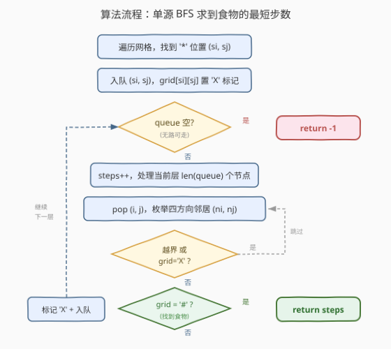
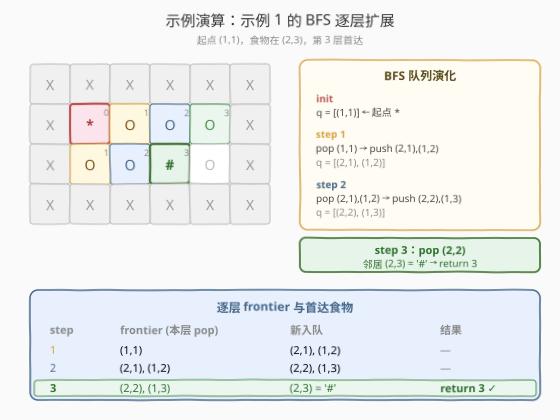

# LeetCode 获取食物的最短路径 题解

## 1. 题目概述

- **标题 / 题号**：获取食物的最短路径（#1730，medium）
- **链接**：https://leetcode.cn/problems/shortest-path-to-get-food/
- **难度**：中等
- **标签**：广度优先搜索、矩阵、单源 BFS

**题意**：给定一个 $m \times n$ 的字符矩阵 `grid`，你很饿，要找最短路径到达任意一个食物所在的格子。格子有四种：

- `'*'` 是你的位置，矩阵中**有且只有一个**；
- `'#'` 是食物，可能存在**多个**；
- `'O'` 是空地，可以穿过；
- `'X'` 是障碍，**不可以**穿过。

你每步可以走到上下左右相邻的格子（不能走对角线、不能出界、不能进障碍）。返回你到**任意**食物的最短路径长度；若不存在路径，返回 $-1$。

**示例 1**：

```text
输入：grid = [["X","X","X","X","X","X"],
              ["X","*","O","O","O","X"],
              ["X","O","O","#","O","X"],
              ["X","X","X","X","X","X"]]
输出：3
解释：从 (1,1) 出发，向右→向右→向下（或向下→向右→向右），3 步到达 (2,3) 的食物。
```

**示例 2**：

```text
输入：grid = [["X","X","X","X","X"],
              ["X","*","X","O","X"],
              ["X","O","X","#","X"],
              ["X","X","X","X","X"]]
输出：-1
解释：起点 (1,1) 被 X 完全包围，无法走到任何食物。
```

**示例 3**：

```text
输入：grid = [["X","X","X","X","X","X","X","X"],
              ["X","*","O","X","O","#","O","X"],
              ["X","O","O","X","O","O","X","X"],
              ["X","O","O","O","O","#","O","X"],
              ["X","X","X","X","X","X","X","X"]]
输出：6
解释：有多个食物。绕过障碍到达下方食物 (3,5) 仅需 6 步，比上方食物 (1,5) 更近。
```

**约束**：

- $m == \text{grid.length}$
- $n == \text{grid}[i].\text{length}$
- $1 \le m, n \le 200$
- $\text{grid}[i][j]$ 为 `'*'`、`'X'`、`'O'` 或 `'#'`
- `grid` 中**有且只有一个** `'*'`

> 💡 **关键结构**：网格中每个格子是一个节点，相邻四方向连边，边权均为 1——这是典型的**无权图最短路径**问题。无权图最短路径的招牌解法是 **BFS（广度优先搜索）**：从起点逐层扩展，每个节点首次被访问时的层数即为最短距离。多个食物只需「首达任意 `#`」即返回，无需逐一比较。

## 2. 解题思路

### 2.1 暴力思路：DFS 枚举所有路径取最短

最直觉的做法是 DFS 回溯：从 `'*'` 出发，穷举所有能走到 `'#'` 的路径，记录最短长度。

```text
dfs(i, j, steps):
    if grid[i][j] == '#': 更新 ans = min(ans, steps); return
    标记 (i,j) 已访问
    for 四方向: dfs(ni, nj, steps+1)
    取消标记 (i,j)
```

问题在于：

1. **路径数指数级**：网格中任意两点间的路径数随空地数量指数增长，$m, n \le 200$ 时网格可达 $4 \times 10^4$ 格，DFS 必然超时；
2. **重复访问**：同一格子会被多条路径反复经过，即便加记忆化也只能记录「到该格的最短距离」，本质上把 DFS 退化成了 BFS 却保留了递归栈开销。

> ⚠️ **症结**：DFS 的「深入一条路径」策略与「求最短」目标错配——它无法在首次到达时就确定最短，必须枚举所有可能。而 **BFS 的「逐层扩展」天然保证首次到达即最短**，这正是无权图最短路径的核心性质。

### 2.2 核心观察：单源 BFS 求最短路径



**三个关键洞察**：

1. **BFS 层级 = 最短距离**：BFS 从起点 `'*'` 出发，第 $k$ 层扩展到的格子距离起点恰为 $k$ 步。由于每个格子**首次**被访问时的层数最小（BFS 的 FIFO 特性保证先到者步数少），故无需比较——**首达即最短**。

2. **首达 `'#'` 即答案**：题目要求到**任意**食物的最短路径。BFS 逐层扩展时，第一个被碰到的 `'#'` 必然是距离起点最近的食物，此时返回当前层数即可，无需继续搜索其余食物。

3. **原地标记判重**：为避免重复访问，走过的 `'O'` 直接改写为 `'X'`（障碍），既标记「已访问」又防止再次入队。无需额外 `visited` 数组——这是网格 BFS 的常见空间优化。起点 `'*'` 同样置 `'X'` 防止回走。

> 💡 **为何能原地改写而不影响正确性？** `'O'` 改成 `'X'` 后该格不再可通行，但它**首次被访问时的最短距离已记录**（层数）。后续若从其他路径再次到达，那条路径必然更长（BFS 层级更大），跳过它不影响「首达食物」的最短性。这与 [200. 岛屿数量](../0101-0200/200_岛屿数量.md) 的「沉岛」标记同源。

> ⚠️ **判重时机**：必须在**入队时**就标记，而非**出队时**。若出队才标记，同一格子会被多个邻居重复入队，队列膨胀到 $O((mn)^2)$。入队即置 `'X'` 保证每格至多入队一次。

### 2.3 算法流程图



**步骤**：

1. **找起点**：遍历网格找到 `'*'` 的位置 $(s_i, s_j)$。
2. **初始化**：把 $(s_i, s_j)$ 入队，`grid[si][sj] = 'X'` 标记已访问，`steps = 0`。
3. **BFS 主循环**：只要队列非空：
   - `steps += 1`（进入下一层，距离 +1）；
   - 取当前层大小 `size = len(queue)`，逐个 `pop` 节点 $(i, j)$；
   - 枚举四方向邻居 $(x, y)$：
     - **越界**或 `grid[x][y] == 'X'`（障碍/已访问）→ 跳过；
     - `grid[x][y] == '#'`（食物）→ **返回 `steps`**（首达即最短）；
     - `grid[x][y] == 'O'`（空地）→ 置 `'X'` 标记，入队。
4. **队列空仍未碰到食物** → 返回 $-1$。

> 💡 **`steps` 何时自增？** 在处理每一层**之前** `steps += 1`。这样：第一层（pop 起点）时 `steps = 1`，若起点的邻居就是 `'#'`，返回 1——正确（走 1 步到达）。这与 [994. 腐烂的橘子](../0901-1000/994_腐烂的橘子.md) 的「分钟数」计数同构。

### 2.4 示例演算

以示例 1 为例，起点 $(1,1)$，食物在 $(2,3)$。BFS 逐层扩展（距离标注在格子右上角）：



| step | frontier（本层 pop） | 新入队 | 结果 |
|------|----------------------|--------|------|
| 1 | $(1,1)$ | $(2,1),\ (1,2)$ | — |
| 2 | $(2,1),\ (1,2)$ | $(2,2),\ (1,3)$ | — |
| 3 | $(2,2),\ (1,3)$ | $(2,3)=\text{'\#'}$ | **return 3 ✓** |

**关键转折**：

- **step 1**：从起点 $(1,1)$ 向右到 $(1,2)$、向下到 $(2,1)$，两格均置 `'X'` 标记。
- **step 2**：$(2,1)$ 扩展出 $(2,2)$；$(1,2)$ 扩展出 $(1,3)$。注意 $(2,2)$ 不会被重复入队——它由 $(2,1)$ 首先发现并即时标记。
- **step 3**：处理 $(2,2)$ 时，其向下邻居 $(2,3)$ 是 `'#'`，**立即返回** `steps = 3`，无需继续处理队列中剩余的 $(1,3)$。

最终返回 `3` ✓。

> 💡 **为何 step 3 不需要把 `(1,3)` 也处理完？** BFS 的「首达即最短」保证了：一旦在扩展某层时碰到 `'#'`，该食物的距离就是当前 `steps`，不可能有更短路径（更短的路径在前几层就该被发现）。故立即返回是正确的提前终止。

## 3. 参考代码

### C++

```cpp
class Solution {
public:
    int getFood(vector<vector<char>>& grid) {
        int m = grid.size(), n = grid[0].size();
        queue<pair<int, int>> q;
        for (int i = 0; i < m; ++i) {
            for (int j = 0; j < n; ++j) {
                if (grid[i][j] == '*') {
                    q.emplace(i, j);
                    grid[i][j] = 'X';
                    break;
                }
            }
            if (!q.empty()) break;
        }
        int dirs[5] = {-1, 0, 1, 0, -1};
        int steps = 0;
        while (!q.empty()) {
            ++steps;
            for (int sz = q.size(); sz; --sz) {
                auto [i, j] = q.front(); q.pop();
                for (int k = 0; k < 4; ++k) {
                    int x = i + dirs[k], y = j + dirs[k + 1];
                    if (x < 0 || x >= m || y < 0 || y >= n) continue;
                    if (grid[x][y] == '#') return steps;
                    if (grid[x][y] == 'O') {
                        grid[x][y] = 'X';
                        q.emplace(x, y);
                    }
                }
            }
        }
        return -1;
    }
};
```

### Python

```python
class Solution:
    def getFood(self, grid: List[List[str]]) -> int:
        m, n = len(grid), len(grid[0])
        q = collections.deque()
        for i in range(m):
            for j in range(n):
                if grid[i][j] == '*':
                    q.append((i, j))
                    grid[i][j] = 'X'
                    break
            if q:
                break
        dirs = (-1, 0, 1, 0, -1)
        steps = 0
        while q:
            steps += 1
            for _ in range(len(q)):
                i, j = q.popleft()
                for k in range(4):
                    x, y = i + dirs[k], j + dirs[k + 1]
                    if 0 <= x < m and 0 <= y < n:
                        if grid[x][y] == '#':
                            return steps
                        if grid[x][y] == 'O':
                            grid[x][y] = 'X'
                            q.append((x, y))
        return -1
```

> 💡 **方向数组的写法**：`dirs = {-1, 0, 1, 0, -1}` 是「压缩」的四方向表示——相邻两数构成一个方向向量 $(-1,0),(0,1),(1,0),(0,-1)$，对应上、右、下、左。`dirs[k]` 与 `dirs[k+1]` 取出第 $k$ 个方向的行、列增量，比二维数组更紧凑。

> ⚠️ **越界检查必须在前**：C++ 中 `x < 0 || x >= m` 用短路 `||` 保证越界时不访问 `grid[x][y]`；Python 中 `0 <= x < m and 0 <= y < n` 同理。若颠倒顺序会触发未定义行为或 `IndexError`。

> 💡 **原地修改 `grid` 是否允许？** 题目未禁止修改输入。若面试官要求保持原网格，可用单独的 `vector<vector<bool>> visited(m, vector<bool>(n))` 替代原地标记，空间升至 $O(mn)$ 但逻辑不变。

## 4. 复杂度分析

| 维度 | 复杂度 | 说明 |
|------|--------|------|
| 时间 | $O(m \times n)$ | 每个格子至多入队一次、出队一次，每次扩展 4 个邻居共 $O(1)$；$m, n \le 200$ 时约 $1.6 \times 10^4$ 格，操作约 $6.4 \times 10^4$ 次 |
| 空间 | $O(\min(m, n))$ | 队列最坏存满一层。BFS 在网格上的队列宽度上界为「矩阵周长的一半」即 $O(\min(m, n))$；极端情形（如蛇形铺满）可达 $O(mn)$，但渐近仍记 $O(mn)$ |

> 💡 **为何时间不是 $O((mn)^2)$？** 关键在于「入队即标记」。每格首次被发现时立刻置 `'X'`，再无邻居能把它重复入队。故总入队次数 $\le mn$，每队列出队扩展 4 邻居，总操作 $O(4mn) = O(mn)$。若改为「出队才标记」，同一格会被多个邻居各入队一次，最坏 $O((mn)^2)$——这是网格 BFS 最常见的实现陷阱。

## 5. 扩展：BFS 为何能求无权图最短路径

### 5.1 BFS 的最短性证明

设起点 $s$，某节点 $v$ 在 BFS 中首次被访问时位于第 $k$ 层（即从 $s$ 出发经过 $k$ 条边到达）。要证明 $s$ 到 $v$ 的最短路径长度恰为 $k$。

- **存在性**：BFS 第 $k$ 层扩展到 $v$，说明存在一条 $s \to \cdots \to v$ 的 $k$ 步路径，故最短距离 $\le k$。
- **最优性（反证）**：假设存在更短路径 $s \to \cdots \to v$ 长度 $k' < k$。沿这条路径，$s$ 的第 $k'$ 个节点是 $v$，而 BFS 在第 $k'$ 层就应扩展到路径上的每个中间节点（因为它们距 $s$ 均 $\le k'$，由归纳法 BFS 在第 $\le k'$ 层必已访问）。于是 $v$ 应在第 $k'$ 层被访问，与「首次在第 $k$ 层」矛盾。故 $k' \ge k$。

从而最短距离 $= k$。这正是「首达即最短」的形式化保证。

### 5.2 多食物为何不需逐一比较

题目有多个 `'#'`，要求到**任意**食物的最短距离。直觉上似乎要对每个食物各跑一次 BFS 取最小，但**无需如此**：

BFS 逐层扩展时，第 $k$ 层碰到的第一个 `'#'` 必然是所有食物中距起点最近的——因为若存在更近的食物（距离 $< k$），它会在第 $< k$ 层就被扩展到并返回。故「首达任意 `#`」自然给出全局最短。这等价于把所有食物视为「目标集」，BFS 一旦触及目标集任意成员即终止。

> 💡 **与多源 BFS 的对照**：[994. 腐烂的橘子](../0901-1000/994_腐烂的橘子.md) 是**多源 BFS**——多个腐烂橘子同时入队，求每个橘子被最近源感染的时间。本题是**单源 BFS + 多目标**——一个起点，多个食物，求到最近食物的距离。两者是 BFS 的对偶形态：多源单目标 vs 单源多目标，但「逐层扩展 + 首达即最短」的核心不变。

### 5.3 若边权不等：Dijkstra

本题边权均为 1（每步代价相同），BFS 适用。若网格中不同格子有不同通行代价（如 `'O'` 代价 1、沼泽代价 5），则退化为**带权图最短路径**，需改用 **Dijkstra + 优先队列**。BFS 可视为 Dijkstra 在「所有边权相等」时的特例——用 FIFO 队列替代优先队列即可，因为同层节点距离天然相同、无需排序。

## 6. 面试要点

**Q1：为什么用 BFS 而不是 DFS？**
> BFS 按层扩展，每层距离 +1，**首次到达目标时的层数即最短距离**。DFS 深入一条路径，无法在首次到达时确定最短，必须枚举所有路径取最小——网格中路径数指数级，必超时。无权图最短路径是 BFS 的招牌场景。

**Q2：多个食物时为什么不用对每个食物分别 BFS？**
> BFS 逐层扩展，第一个被碰到的 `'#'` 必是最近食物——更近的食物在前几层就该被扩展到。故「首达任意 `#`」即全局最短，提前返回即可。这等价于把所有食物视为「目标集」，BFS 触及目标集任意成员即终止，复杂度不随食物数量增加。

**Q3：为什么把 `'O'` 改写成 `'X'` 而不用 `visited` 数组？**
> 原地改写利用输入网格做判重，省去 $O(mn)$ 额外空间，空间复杂度从 $O(mn)$ 降到 $O(\min(m,n))$（仅队列）。逻辑等价：走过的空地变障碍，后续不再入队。若面试官要求不改输入，再换 `visited` 数组即可，逻辑不变。

**Q4：「入队时标记」还是「出队时标记」？为什么？**
> 必须**入队时**标记。若出队才标记，同一格子会被多个邻居各自发现并重复入队（因为入队时它还是 `'O'`），队列膨胀到 $O((mn)^2)$。入队即置 `'X'` 保证每格至多入队一次，时间保持 $O(mn)$。这是网格 BFS 最容易踩的坑。

**Q5：`steps` 的自增时机为什么在每层循环开始？**
> BFS 按层处理，每层代表「再走一步」。在处理第 $k$ 层（pop 第 $k$ 层节点、扩展其邻居）之前 `steps += 1`，使得扩展出的邻居若是 `'#'`，返回的 `steps` 恰为从起点到该食物的步数。若在层末自增，会少算一步。

> 💡 **一句话总结**：无权网格最短路径 → 单源 BFS 逐层扩展 → 入队即标记判重 → 首达 `'#'` 返回层数，$O(mn)$ 时间、$O(\min(m,n))$ 空间。

## 同类练习题

| # | 题目 | 与本题的关联 |
|---|------|-------------|
| 994 | [腐烂的橘子](https://leetcode.cn/problems/rotting-oranges/)（[题解](../0901-1000/994_腐烂的橘子.md)） | **最同构的姊妹题**——多源 BFS 求所有橘子被感染的最短时间。与本题「单源多目标」对偶为「多源单目标」，但「逐层扩展 + 首达即最短」的 BFS 骨架完全一致，对照体会单源/多源的初始化差异 |
| 1926 | [网格图中递增路径的数目](https://leetcode.cn/problems/number-of-increasing-paths-in-a-grid/) | 网格上 DFS + 记忆化，与本题同为「网格图遍历」族，但目标从「最短路径」换成「路径计数」，对照理解 BFS 求最短 vs DFS 求方案数的适用边界 |
| 542 | [01 矩阵](https://leetcode.cn/problems/01-matrix/) | 多源 BFS 求每个格子到最近 0 的距离——「多源 + 全目标距离」，与本题「单源 + 首达目标」同为网格 BFS，对照理解「求一个最短」与「求全部最短」的写法差异 |
| 200 | [岛屿数量](https://leetcode.cn/problems/number-of-islands/)（[题解](../0101-0200/200_岛屿数量.md)） | 网格 BFS/DFS 连通分量计数，与本题共享「四方向扩展 + 原地标记沉岛」的判重技巧，但目标从「最短路径」换成「连通块计数」 |
| 1091 | [二进制矩阵中的最短路径](https://leetcode.cn/problems/shortest-path-in-binary-matrix/) | 8 方向网格 BFS 求左上到右下的最短路径——同为单源 BFS 求最短，但方向从 4 邻居扩到 8 邻居、起点终点固定，对照体会方向数组与终止条件的通用性 |
