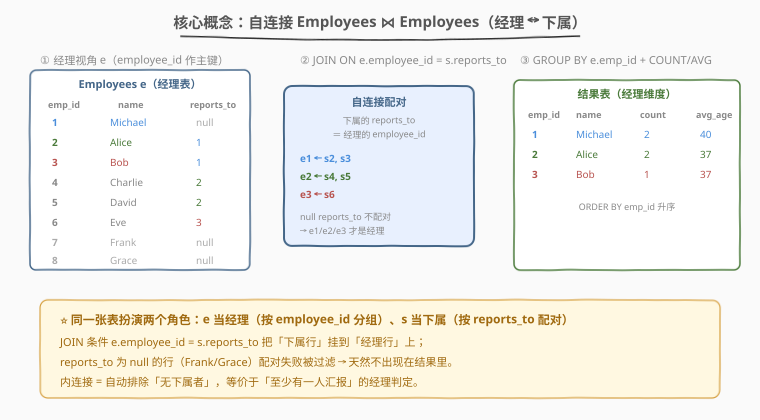
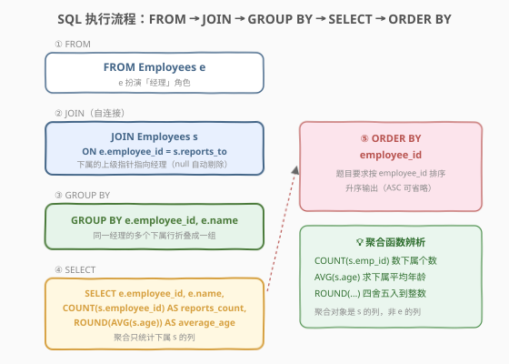
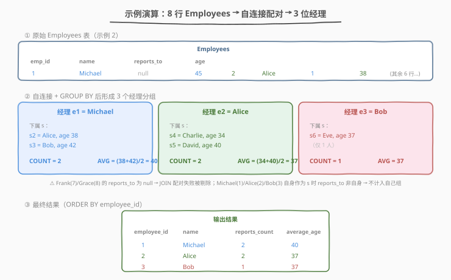

# LeetCode 每位经理的下属员工数量 题解

## 1. 题目概述

- **标题 / 题号**：每位经理的下属员工数量（#1731，easy）
- **链接**：https://leetcode.cn/problems/the-number-of-employees-which-report-to-each-employee/
- **难度**：简单
- **标签**：数据库、SQL、自连接、`GROUP BY`、`COUNT`、`AVG`、`ROUND`、`ORDER BY`

**题意**：给定 `Employees` 表（员工 ID、姓名、直属上级 `reports_to`、年龄）。`reports_to` 为 `null` 表示该员工不需要向任何人汇报。题目约定**至少有一个其他员工向他汇报的人即为「经理」**。要求返回每位经理的：

- `employee_id`：经理的员工 ID
- `name`：经理的姓名
- `reports_count`：直接向他汇报的下属人数
- `average_age`：这些下属的平均年龄，**四舍五入到最接近的整数**

结果按 `employee_id` 升序排列。

**表结构**：

```text
Table: Employees
+-------------+----------+
| Column Name | Type     |
+-------------+----------+
| employee_id | int      |
| name        | varchar  |
| reports_to  | int      |
| age         | int      |
+-------------+----------+
employee_id 是这个表中具有不同值的列。
该表包含员工以及需要听取他们汇报的上级经理的 ID 的信息。
有些员工不需要向任何人汇报（reports_to 为空）。
```

**示例 1**：

```text
输入：
Employees 表：
+-------------+---------+------------+-----+
| employee_id | name    | reports_to | age |
+-------------+---------+------------+-----+
| 9           | Hercy   | null       | 43  |
| 6           | Alice   | 9          | 41  |
| 4           | Bob     | 9          | 36  |
| 2           | Winston | null       | 37  |
+-------------+---------+------------+-----+

输出：
+-------------+-------+---------------+-------------+
| employee_id | name  | reports_count | average_age |
+-------------+-------+---------------+-------------+
| 9           | Hercy | 2             | 39          |
+-------------+-------+---------------+-------------+

解释：
Hercy（id=9）有两个下属 Alice 和 Bob，平均年龄 (41+36)/2 = 38.5，四舍五入为 39。
Winston（id=2）的 reports_to 为 null，且无人向他汇报，不是经理，不出现。
```

**示例 2**：

```text
输入：
Employees 表：
+-------------+---------+------------+-----+
| employee_id | name    | reports_to | age |
+-------------+---------+------------+-----+
| 1           | Michael | null       | 45  |
| 2           | Alice   | 1          | 38  |
| 3           | Bob     | 1          | 42  |
| 4           | Charlie | 2          | 34  |
| 5           | David   | 2          | 40  |
| 6           | Eve     | 3          | 37  |
| 7           | Frank   | null       | 50  |
| 8           | Grace   | null       | 48  |
+-------------+---------+------------+-----+

输出：
+-------------+---------+---------------+-------------+
| employee_id | name    | reports_count | average_age |
+-------------+---------+---------------+-------------+
| 1           | Michael | 2             | 40          |
| 2           | Alice   | 2             | 37          |
| 3           | Bob     | 1             | 37          |
+-------------+---------+---------------+-------------+
```

**约束**：

- `employee_id` 是表中具有不同值的列（即主键）
- `reports_to` 可为 `null`
- 结果按 `employee_id` 升序排列
- `average_age` 需四舍五入到最接近的整数

> 💡 本题是 SQL **"自连接 + 分组聚合"招牌题**——核心三步：① 用自连接把「下属行」挂到「经理行」上（`JOIN ON e.employee_id = s.reports_to`）；② `GROUP BY e.employee_id` 按经理折叠；③ `COUNT(s.employee_id)` 数下属、`ROUND(AVG(s.age))` 算平均。难点在于「同一张表扮演两个角色」的抽象，以及内连接天然过滤 `null` 上级指针的妙用。

## 2. 解题思路

### 2.1 暴力思路：逐经理扫描

最直觉的过程式思路：遍历所有员工作为候选经理 $e$，再遍历全体员工 $s$，筛出 `s.reports_to == e.employee_id` 的行，统计个数与平均年龄。伪代码：

```text
for each employee e:
    subs = [s for s in Employees if s.reports_to == e.employee_id]
    if subs not empty:
        result += (e.employee_id, e.name, len(subs), round(avg(s.age for s in subs)))
sort result by employee_id
```

但**纯 SQL 没有显式双重循环**——「按经理分组 + 组内聚合」需换成集合式表达：用**自连接**（self-join）一次性把每条下属行挂到对应经理行上，再用 `GROUP BY` 折叠。

### 2.2 核心观察：自连接 + 分组聚合



**关键洞察**：同一张 `Employees` 表在逻辑上扮演**两个角色**——

1. **经理视角 `e`**：以 `employee_id` 为键，作为分组的依据（最终输出的 `employee_id`、`name` 来自 `e`）。
2. **下属视角 `s`**：以 `reports_to` 为「指向经理的指针」，`JOIN ON e.employee_id = s.reports_to` 把每条下属行精确挂到其经理行上。

配对完成后，**同一经理的多条下属行**自然形成一组，`GROUP BY e.employee_id` 把它们折叠成一行，聚合函数只对 `s` 的列求值：

- `COUNT(s.employee_id)` → 下属个数
- `AVG(s.age)` → 下属平均年龄
- `ROUND(AVG(s.age))` → 四舍五入到整数

> ⚠️ **为何用内连接（INNER JOIN）而非 LEFT JOIN？** 内连接要求 `s.reports_to` 能在 `e.employee_id` 中找到匹配——`reports_to` 为 `null` 的行（如示例 2 的 Frank/Grace）配对失败被自动剔除。这恰好等价于题目「至少有一人汇报才算经理」的判定：**没人向他汇报的员工不会产生任何配对行，自然不出现在结果里**。无需额外写 `WHERE reports_to IS NOT NULL` 或 `HAVING COUNT(*) > 0`。

> 💡 **聚合对象是 `s` 的列，不是 `e` 的列**：`COUNT` 和 `AVG` 都作用于下属 `s`——`COUNT(s.employee_id)` 数下属个数，`AVG(s.age)` 求下属平均年龄。若误写 `COUNT(e.employee_id)` 会得到「每条配对行都有一个非空经理 ID」即组内行数（看似也对），但 `AVG(e.age)` 就会算成「经理年龄在组内的平均」即经理自己的年龄（错得离谱）。**口诀：要统计谁，就聚合谁的列。**

### 2.3 算法流程图



**逻辑执行步骤**：

| 步骤 | 子句 | 作用 |
|------|------|------|
| ① | `FROM Employees e` | 引入「经理」视角，e.employee_id 作主键 |
| ② | `JOIN Employees s ON e.employee_id = s.reports_to` | 自连接，把下属行挂到经理行；null 上级自动剔除 |
| ③ | `GROUP BY e.employee_id, e.name` | 按经理折叠，同经理的多个下属并成一组 |
| ④ | `SELECT e.employee_id, e.name, COUNT(...), ROUND(AVG(...))` | 每组输出经理信息 + 下属计数 + 下属平均年龄 |
| ⑤ | `ORDER BY employee_id` | 按经理 ID 升序输出 |

> 💡 **SQL 子句执行顺序**：`FROM`/`JOIN` → `WHERE` → `GROUP BY` → `HAVING` → `SELECT`（含聚合）→ `ORDER BY` → `LIMIT`。本题无 `WHERE`（JOIN 已过滤）、无 `HAVING`（内连接保证每组非空）。`GROUP BY` 早于 `SELECT`，故聚合函数在分组后才求值。

> ⚠️ **为何 `GROUP BY` 要带上 `e.name`？** 标准SQL（如 PostgreSQL、SQL Server）要求 `SELECT` 中非聚合列必须出现在 `GROUP BY` 中。`e.name` 在 `SELECT` 但未聚合，故需加入 `GROUP BY`。MySQL 在 `ONLY_FULL_GROUP_BY` 模式下也要求如此。因 `employee_id` 是主键（唯一），`e.name` 函数依赖于 `e.employee_id`，带上它只是满足语法，不影响分组粒度。

### 2.4 示例演算

以示例 2 的 8 行数据为例，观察「自连接配对 → 分组 → 聚合」的逐步过程：



**步骤 ①②：自连接配对（JOIN ON e.employee_id = s.reports_to）**

对每条下属行 `s`，按 `s.reports_to` 找到对应经理行 `e`，形成配对：

| 经理 e | 下属 s | 下属 age |
|--------|--------|----------|
| e1 (Michael) | s2 (Alice) | 38 |
| e1 (Michael) | s3 (Bob) | 42 |
| e2 (Alice) | s4 (Charlie) | 34 |
| e2 (Alice) | s5 (David) | 40 |
| e3 (Bob) | s6 (Eve) | 37 |

> 配对失败的行：s1(Michael)、s7(Frank)、s8(Grace) 的 `reports_to` 为 `null` → 不产生配对行。这正是「无下属者不出现在结果」的来源。

**步骤 ③：GROUP BY e.employee_id 折叠成 3 组**

| 分组 | 组内下属 | COUNT(s.employee_id) | AVG(s.age) | ROUND |
|------|----------|----------------------|------------|-------|
| e1 = Michael | Alice(38), Bob(42) | 2 | (38+42)/2 = 40.0 | 40 |
| e2 = Alice | Charlie(34), David(40) | 2 | (34+40)/2 = 37.0 | 37 |
| e3 = Bob | Eve(37) | 1 | 37.0 | 37 |

**步骤 ④⑤：SELECT + ORDER BY employee_id**

| employee_id | name | reports_count | average_age |
|-------------|------|---------------|-------------|
| 1 | Michael | 2 | 40 |
| 2 | Alice | 2 | 37 |
| 3 | Bob | 1 | 37 |

> 💡 **四舍五入的边界**：示例 1 的 `(41+36)/2 = 38.5` 经 `ROUND` 得 `39`——SQL 的 `ROUND` 对 `.5` 取远离零的方向（round half away from zero）。若题目要求「向下取整」则改用 `FLOOR`，要求「银行家舍入」需注意各数据库实现差异。

## 3. 参考代码

### SQL（解法 A：自连接 + `GROUP BY`，推荐）

```sql
SELECT
    e.employee_id,
    e.name,
    COUNT(s.employee_id) AS reports_count,
    ROUND(AVG(s.age)) AS average_age
FROM Employees e
JOIN Employees s ON e.employee_id = s.reports_to
GROUP BY e.employee_id, e.name
ORDER BY e.employee_id;
```

> 💡 **写法要点**：
> - **`FROM Employees e JOIN Employees s`**：同一张表起两个别名，`e` 当经理、`s` 当下属，这是「自连接」的标准写法。
> - **`ON e.employee_id = s.reports_to`**：用下属的「上级指针」匹配经理的主键，把下属行挂到经理行上。
> - **`COUNT(s.employee_id)`**：数每组内下属的个数。因内连接已保证 `s.employee_id` 非空，等价于 `COUNT(*)`。
> - **`ROUND(AVG(s.age))`**：先对下属年龄求平均，再四舍五入到整数。注意 `ROUND` 只传一个参数时表示取整。
> - **`GROUP BY e.employee_id, e.name`**：按经理分组；`e.name` 为满足标准 SQL 的「非聚合列需入 GROUP BY」而带上。
> - ✓ **最推荐**：一次自连接搞定配对 + 过滤 + 聚合，语义清晰、通用性强。

### SQL（解法 B：子查询先聚合再回连）

```sql
SELECT
    m.employee_id,
    e.name,
    m.reports_count,
    m.average_age
FROM (
    SELECT
        reports_to AS employee_id,
        COUNT(employee_id) AS reports_count,
        ROUND(AVG(age)) AS average_age
    FROM Employees
    WHERE reports_to IS NOT NULL
    GROUP BY reports_to
) m
JOIN Employees e ON m.employee_id = e.employee_id
ORDER BY m.employee_id;
```

> 💡 **解法 B 的思路**：分两步——先在子查询里**直接按 `reports_to` 分组**（此时 `reports_to` 就是经理 ID），统计每组下属个数与平均年龄；再 `JOIN` 回 `Employees` 表取经理姓名。
>
> **与解法 A 的区别**：
> - 解法 A 用自连接先「展开」配对再分组；解法 B 先「折叠」下属再回连经理。
> - 解法 B 需显式 `WHERE reports_to IS NOT NULL`（因没用自连接过滤 null）。
> - 两者结果相同，解法 A 更简洁直观，解法 B 在「下属聚合」与「经理信息」逻辑分离时更清晰，适合下属聚合逻辑复杂（如多层过滤）的场景。

### Python（pandas）

```python
import pandas as pd

def count_employees(employees: pd.DataFrame) -> pd.DataFrame:
    subs = employees[employees['reports_to'].notna()]
    grouped = (
        subs.groupby('reports_to')
        .agg(
            reports_count=('employee_id', 'count'),
            average_age=('age', lambda s: round(s.mean())),
        )
        .reset_index()
        .rename(columns={'reports_to': 'employee_id'})
    )
    result = grouped.merge(
        employees[['employee_id', 'name']],
        on='employee_id',
        how='left',
    )
    return result[['employee_id', 'name', 'reports_count', 'average_age']].sort_values('employee_id')
```

> 💡 **pandas 对照**：
> - `employees[employees['reports_to'].notna()]` 对应 SQL 的「过滤 null 上级」——只保留有上级的下属行（即解法 B 的 `WHERE reports_to IS NOT NULL`）。
> - `.groupby('reports_to')` 对应 `GROUP BY reports_to`——按上级 ID 分组。
> - `.agg(reports_count=('employee_id', 'count'), average_age=('age', lambda s: round(s.mean())))` 对应 `COUNT(employee_id)` 与 `ROUND(AVG(age))`。
> - `.merge(employees[['employee_id', 'name']], on='employee_id', how='left')` 对应回连经理表取 `name`。
> - `.sort_values('employee_id')` 对应 `ORDER BY employee_id`。

## 4. 复杂度分析

| 维度 | 解法 A（自连接 + GROUP BY） | 解法 B（子查询 + 回连） | pandas |
|------|----------------------------|--------------------------|--------|
| **时间** | $O(n \log n)$ | $O(n \log n)$ | $O(n \log n)$ |
| **空间** | $O(n)$ | $O(n)$ | $O(n)$ |
| **跨数据库** | 通用 | 通用 | — |
| **推荐度** | ✓ **首选** | ✓ 备选 | ✓ 验证用 |

> - $n$ = `Employees` 表行数，$m$ = 经理数（$m \le n$）
> - **时间**：自连接/分组需对 `reports_to` 建索引或哈希，配对 $O(n)$；`GROUP BY` 哈希聚合 $O(n)$；`ORDER BY` 对 $m$ 个分组排序 $O(m \log m)$。最坏情况（无索引的嵌套循环连接）为 $O(n^2)$，但现代数据库优化器通常走哈希连接 $O(n)$。总时间以 $O(n \log n)$ 为保守估计。
> - **空间**：自连接的中间结果最多 $n$ 行配对（每条下属一行），分组表 $O(m)$，总 $O(n)$。
> - **索引优化**：在 `Employees(reports_to)` 上建索引可让自连接走索引扫描，配对降至 $O(\log n)$ 每行；`employee_id` 作为主键默认有索引，回连解法 B 的 `JOIN` 可走主键索引。

## 5. 扩展：自连接的典型场景与变体

自连接（self-join）是 SQL 处理「同一表内关系」的核心武器，常见场景：

| 场景 | 关系类型 | JOIN 条件模式 | 典型题 |
|------|----------|---------------|--------|
| 经理-下属 | 树形（一对多） | `e.id = s.reports_to` | 本题 1731 |
| 好友对 | 无向图（对称） | `a.id < b.id AND a.friend = b.id` | 1812 |
| 连续行比较 | 时序相邻 | `a.id = b.id - 1` | 601、197 |
| 同表分层 | 父子层级 | `parent.id = child.parent_id` | 本题 + 闭包表 |

**变体思考**：

1. **若要统计「所有层级的下属」（含间接下属）？** 自连接只能查直接下属；查全层级需用**递归 CTE**（`WITH RECURSIVE`）从经理出发逐层展开。
2. **若要求「没有下属的员工也列出，count 显示 0」？** 把内连接换成 `LEFT JOIN`，并用 `COALESCE(COUNT(s.employee_id), 0)` 把 null 补 0。
3. **若 `average_age` 要求截断而非四舍五入？** 把 `ROUND` 换成 `FLOOR`（向下取整）或 `TRUNCATE`（截断小数位）。

> ⚠️ **`ROUND` 的数据库差异**：MySQL/PostgreSQL 的 `ROUND(x)` 对 `.5` 远离零取整；SQL Server 的 `ROUND(x, 0)` 同样远离零；Oracle 的 `ROUND` 对整数位也是远离零。本题 `ROUND(AVG(s.age))` 在主流数据库行为一致，可放心使用。

## 6. 面试要点

1. **为什么需要自连接？同一张表为什么要有两个别名？**

   > 题目要按「经理」分组统计「下属」信息，而经理和下属都在同一张 `Employees` 表里——经理的 `employee_id` 与下属的 `reports_to` 是同一含义的两个列。给表起两个别名 `e`（经理视角）和 `s`（下属视角），用 `JOIN ON e.employee_id = s.reports_to` 把下属行挂到经理行，才能在一次查询里同时拿到「经理信息」和「下属集合」。没有自连接就只能用子查询逐行查上级。

2. **内连接为什么天然过滤了「无下属者」？需要额外写 `WHERE` 或 `HAVING` 吗？**

   > 内连接要求 `ON` 条件成立才保留行——`reports_to` 为 `null` 的行无法匹配任何 `e.employee_id`（`null = anything` 在 SQL 中为 `unknown`，不满足连接条件），故自动剔除。无人向他汇报的员工不产生任何配对行，自然不出现在分组里。所以**不需要**额外写 `WHERE reports_to IS NOT NULL`（解法 A）或 `HAVING COUNT(*) > 0`。若改用 `LEFT JOIN`，才需 `HAVING COUNT(s.employee_id) > 0` 或 `WHERE s.employee_id IS NOT NULL` 来过滤。

3. **`COUNT(s.employee_id)`、`COUNT(*)`、`COUNT(DISTINCT s.employee_id)` 有何区别？本题用哪个？**

   > `COUNT(s.employee_id)` 数 `s.employee_id` 非空值的行数；`COUNT(*)` 数所有行（含 NULL）；`COUNT(DISTINCT s.employee_id)` 数去重后的非空值数。本题内连接保证每条配对行的 `s.employee_id` 非空，且 `employee_id` 是主键（同经理下不重复），故三者等价。推荐 `COUNT(s.employee_id)`——语义自文档化，明确表达「数下属个数」。若表无主键约束，可能出现重复下属行，此时需 `COUNT(DISTINCT)`。

4. **为什么 `GROUP BY` 要写 `e.name`？只写 `e.employee_id` 行不行？**

   > 标准SQL（PostgreSQL、SQL Server 等）要求 `SELECT` 中的非聚合列必须出现在 `GROUP BY` 中。`e.name` 在 `SELECT` 但未聚合，故必须入 `GROUP BY`。MySQL 在 `ONLY_FULL_GROUP_BY` 模式（5.7+ 默认开启）下也要求如此。但因 `employee_id` 是主键，`e.name` 函数依赖于 `e.employee_id`（一个 ID 唯一对应一个 name），部分数据库（如 PostgreSQL 9.1+）允许只 `GROUP BY e.employee_id`——这是「函数依赖分组」的语法糖。为跨数据库兼容，建议**带上 `e.name`**。

5. **`ROUND(AVG(s.age))` 的执行顺序是什么？能写成 `AVG(ROUND(s.age))` 吗？**

   > `ROUND(AVG(s.age))` 是先对 `s.age` 求平均，再对平均值四舍五入——这是题目要求的「平均年龄四舍五入到整数」。`AVG(ROUND(s.age))` 是先对每个 `s.age` 四舍五入（整数年龄四舍五入仍是自身），再求平均——结果可能是小数。两者语义完全不同。**口诀：外层 `ROUND` 是对聚合结果舍入，内层 `ROUND` 是对原始值舍入**。本题要的是前者。

> 💡 **一句话总结**：1731 是 SQL **"自连接 + 分组聚合"招牌题**——核心模板「`FROM Employees e JOIN Employees s ON e.employee_id = s.reports_to` → `GROUP BY e.employee_id, e.name` → `COUNT` + `ROUND(AVG)` → `ORDER BY`」。三大要点：① 同表双别名扮演经理/下属两角色；② 内连接天然过滤 `null` 上级即「无下属者」；③ 聚合对象是下属 `s` 的列而非经理 `e` 的列。

## 同类练习题

| # | 题目 | 与本题的关联 |
|---|------|-------------|
| 570 | [至少有5名直接下属的经理](https://leetcode.cn/problems/managers-with-at-least-5-direct-reports/) | 本题进阶——自连接 + `GROUP BY` + `HAVING COUNT(*) >= 5` 组级过滤，在分组聚合后加阈值条件 |
| 610 | [判断三角形](https://leetcode.cn/problems/triangle-judgement/) | 同表多列自比较（`x + y > z` 等），对照本题「同表双行自连接」的「同表单行多列」变体 |
| 181 | [超过经理收入的员工](https://leetcode.cn/problems/employees-earning-more-than-their-managers/) | 自连接经典入门题——`e JOIN m ON e.managerId = m.id WHERE e.salary > m.salary`，巩固「同表双别名 + JOIN 配对」骨架 |
| 197 | [上升的温度](https://leetcode.cn/problems/rising-temperature/) | 自连接 + 日期相邻比较（`DATEDIFF`），自连接在时序数据上的应用 |
| 601 | [人类活动的人均停留时间](https://leetcode.cn/problems/human-traffic-of-stadium/) | 自连接 + 连续行判定，对照本题「树形关系自连接」的「时序相邻自连接」场景 |
