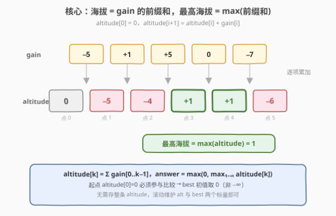
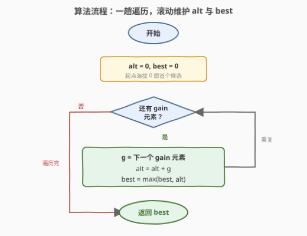

# 找到最高海拔

- **题目名称**：找到最高海拔
- **链接**：[1732. 找到最高海拔](https://leetcode.cn/problems/find-the-highest-altitude/)
- **难度**：简单
- **标签**：数组、前缀和、一次遍历

## 1. 题目概述

一位自行车手进行公路骑行，路线由 $n+1$ 个海拔不同的点组成，从海拔为 $0$ 的**点 0** 出发。给定长度为 $n$ 的整数数组 `gain`，其中 `gain[i]` 是点 $i$ 与点 $i+1$ 的**净海拔高度差**（$0 \le i < n$）。请返回**最高点的海拔**。

**示例 1**：

```text
输入：gain = [-5,1,5,0,-7]
输出：1
解释：海拔高度依次为 [0,-5,-4,1,1,-6]，最高海拔为 1。
```

**示例 2**：

```text
输入：gain = [-4,-3,-2,-1,4,3,2]
输出：0
解释：海拔高度依次为 [0,-4,-7,-9,-10,-6,-3,-1]，最高海拔为 0。
```

**约束条件**：

- $n = \text{gain.length}$
- $1 \le n \le 100$
- $-100 \le \text{gain}[i] \le 100$

> 💡 **关键结构**：`gain[i]` 把相邻两点海拔「绑」成等式 $\text{altitude}[i+1] = \text{altitude}[i] + \text{gain}[i]$，且起点 $\text{altitude}[0]=0$ 已知。这是典型的「链式约束 + 已知起点」信号——海拔序列就是 `gain` 的前缀和，逐项递推即可。题目要的不是整条序列，而是其中的**最大值**。

---

## 2. 解题思路

### 2.1 暴力思路：先建海拔数组，再扫最大值

最直觉的做法分两趟：先从起点 $0$ 出发，按 $\text{altitude}[i+1] = \text{altitude}[i] + \text{gain}[i]$ 把整条海拔序列显式构造出来（长度 $n+1$），再遍历该序列取最大值。

```text
alt = [0] * (n + 1)
for i in 0 .. n-1:
    alt[i+1] = alt[i] + gain[i]      # 第一趟：建海拔数组
return max(alt)                       # 第二趟：求最大值
```

时间 $O(n)$、空间 $O(n)$（需存下整条海拔序列）。$n \le 100$ 时毫无压力，但**存下整条序列是多余的**——我们只要最大值，根本用不到中间每个海拔。

> ⚠️ **症结**：暴力把「求最大值」当成「先把所有值物化再比较」。但最大值是一个**可滚动维护**的聚合量：每产出一个新海拔，立刻与当前最大比较即可，无需回看历史。把「可增量维护」的量当作「需完整存储」的量，是空间浪费的根源。

### 2.2 核心观察：海拔即 gain 前缀和，最大值一趟滚动维护



把递推式 $\text{altitude}[i+1] = \text{altitude}[i] + \text{gain}[i]$ 展开，任意点的海拔正是 `gain` 的前缀和：

$$
\text{altitude}[k] = \sum_{i=0}^{k-1} \text{gain}[i], \qquad \text{altitude}[0] = 0
$$

于是「最高海拔」就是这些前缀和（含起点 $0$）中的最大值：

$$
\boxed{\;\text{answer} = \max_{0 \le k \le n}\; \text{altitude}[k] = \max\Big(0,\; \max_{1 \le k \le n} \sum_{i=0}^{k-1} \text{gain}[i]\Big)\;}
$$

关键优化在于：前缀和本身是**滚动累加**得到的，而最大值可随累加**同步维护**——只需保留当前海拔 `alt` 与历史最高 `best` 两个标量，无需数组：

$$
\text{alt} \gets \text{alt} + \text{gain}[i], \qquad \text{best} \gets \max(\text{best},\, \text{alt})
$$

> 💡 **`best` 初始为 0 而非 $-\infty$**：起点海拔 $\text{altitude}[0]=0$ 本身就是一个合法点，必须参与最大值比较。示例 2 中所有海拔都 $\le 0$，答案恰为 $0$——若把 `best` 初始化为 $-\infty$ 而漏掉起点，会错误地返回 $-1$（最低点 $-10$ 之后回弹到的 $-1$，但它不是最高，最高是起点 $0$）。把「起点即候选」编码进初值，是最易错的边界。
>
> 💡 **与 53 最大子数组和的对照**：53 题求「任意子数组」的最大和 $= \max_j(\text{pref}[j] - \min_{i<j}\text{pref}[i])$，需同时维护前缀和与**最小前缀**；本题求「从起点出发」的最大海拔 $= \max_k \text{pref}[k]$，只需维护前缀和与**最大前缀**。两者同为「前缀和 + 滚动极值」，但 53 多一个「减去历史最小」的维度，是本题的直接升级。

### 2.3 算法流程图



1. **初始化**：`alt = 0`（当前海拔，从起点出发），`best = 0`（历史最高，起点即首个候选）。
2. **遍历**：对每个 `gain[i]`，先 `alt += gain[i]` 得到新海拔，再 `best = max(best, alt)` 更新最高。
3. **终止**：`gain` 全部消费完，返回 `best`。

每轮一次加法 + 一次比较，共 $n$ 轮，总复杂度 $O(n)$。

### 2.4 示例演算

以示例 1 `gain = [-5, 1, 5, 0, -7]` 为例（起点 `alt = 0, best = 0`）：

![示例演算：gain=[-5,1,5,0,-7] → alt 滚动累加，best 在第 3 步更新为 1](../images/1732_example_walkthrough.svg)

| 步骤 $i$ | `gain[i]` | 新海拔 `alt += gain[i]` | `best`（更新后） | 说明 |
|----------|-----------|------------------------|------------------|------|
| 起点 | — | $0$ | $0$ | 起点海拔，`best` 初值 |
| $0$ | $-5$ | $-5$ | $0$ | 下坡，`alt < best`，`best` 不变 |
| $1$ | $+1$ | $-4$ | $0$ | 仍低于起点 |
| $2$ | $+5$ | $1$ | $\mathbf{1}$ | 爬升超过起点，`best` 更新为 $1$ |
| $3$ | $0$ | $1$ | $1$ | 平路，`alt == best` |
| $4$ | $-7$ | $-6$ | $1$ | 陡降，`best` 保持 |

最终 `best = 1` ✓。注意 `best` 在整个过程中**只升不降**——这是 `max` 滚动维护的单调性，保证了遍历一遍即可锁定全局最高，无需回看。

---

## 3. 参考代码

### C++

```cpp
class Solution {
public:
    int largestAltitude(vector<int>& gain) {
        int alt = 0, best = 0;
        for (int g : gain) {
            alt += g;
            best = max(best, alt);
        }
        return best;
    }
};
```

### Python

```python
class Solution:
    def largestAltitude(self, gain: List[int]) -> int:
        alt = best = 0
        for g in gain:
            alt += g
            best = max(best, alt)
        return best
```

> 💡 **写法对照**：两版逻辑完全一致——`alt` 滚动累加当前海拔，`best` 同步取最大。Python 用内建 `max` 更简洁；C++ 用 `std::max`。均无需预分配数组，仅两个整型变量。
>
> ⚠️ **溢出无忧**：$n \le 100$，$|\text{gain}[i]| \le 100$，前缀和极端值 $\pm 10^4$，`int` 完全足够。即便 $n$ 与值域放大到 $10^5$，也需 $10^{10}$ 量级才考虑 `long long`，本题远未触及。

---

## 4. 复杂度分析

| 维度 | 复杂度 | 说明 |
|------|--------|------|
| 时间复杂度 | $O(n)$ | 单趟遍历 `gain`，每轮一次加法 + 一次比较，均为 $O(1)$ |
| 空间复杂度 | $O(1)$ | 仅 `alt`、`best` 两个标量，不依赖输入规模；不计返回值 |

> 💡 对比暴力两趟法的 $O(n)$ 时间 / $O(n)$ 空间：时间不变，空间从 $O(n)$ 降到 $O(1)$——把「物化整条序列」改为「滚动维护标量」是唯一改动。这正是「聚合量可增量维护」带来的空间红利。

---

## 5. 扩展：前缀和 + 滚动极值的三种形态

「逐项累加 + 维护极值」是一类题的共同骨架，按「维护哪个极值」可分三种：

| 形态 | 维护量 | 典型题 |
|------|--------|--------|
| **最大前缀和** | $\max$ 前缀 | **本题 1732**：最高海拔 $= \max_k \text{pref}[k]$ |
| **最小前缀和** | $\min$ 前缀 | [1413. 逐步求和得到正数的最小值](https://leetcode.cn/problems/minimum-value-to-get-positive-step-by-step-sum/)：找使前缀和全程 $>0$ 的最小初值，需先求 $\min$ 前缀 |
| **最大子数组和** | $\max$ 前缀 $-\min$ 前缀 | [53. 最大子数组和](https://leetcode.cn/problems/maximum-subarray/)（[题解](../0001-0100/53_最大子数组和.md)）：$\max_j(\text{pref}[j] - \min_{i<j}\text{pref}[i])$，需同时维护两个极值 |

> 💡 **从 1732 到 53 的升级路径**：本题只需「最大前缀」一个标量；1413 只需「最小前缀」一个标量（方向相反的镜像）；53 需要「最大前缀」减去「此前最小前缀」两个标量，多一个时间维度（$i<j$ 的先后约束）。三者共用「滚动累加」骨架，差异只在维护几个极值、维护 $\max$ 还是 $\min$。掌握这个谱系，遇到任何「前缀和 + 极值」题都能对号入座。

---

## 6. 面试要点

**Q1：为什么 `best` 初始化为 0 而不是 $-\infty$？**
> 起点海拔 $\text{altitude}[0] = 0$ 是一个合法点，必须参与最大值比较。若初始化为 $-\infty$，则在「全程下坡」情形（如示例 2，所有海拔 $\le 0$）会漏掉起点 $0$，错误返回某个负值。把 `best = 0` 编码了「起点即候选」这一边界，无需特判。

**Q2：为什么不显式存海拔数组？空间优化的依据是什么？**
> 最大值是**可增量维护**的聚合量：每得到一个新海拔，与当前最大比较即可，之后该海拔的数值就不再被需要。只有当题目要求**回看历史**（如区间查询、输出整条序列）时才需存储。本题只要最终最大值，故 $O(n)$ 空间可降为 $O(1)$。

**Q3：本题与 53 最大子数组和同为「前缀和 + 极值」，区别在哪？**
> 1732 求从起点出发的最大海拔 $= \max_k \text{pref}[k]$，只维护一个 $\max$ 标量；53 求任意子数组的最大和 $= \max_j(\text{pref}[j] - \min_{i<j}\text{pref}[i])$，需同时维护 $\max$ 前缀与**此前**的 $\min$ 前缀（注意「此前」保证子数组非空、下标先后）。53 多一个「减去历史最小」的维度，是本题的升级版。

**Q4：如果 `gain` 可能很长（如 $10^7$），算法还适用吗？**
> 完全适用。时间仍是 $O(n)$ 单趟扫描，空间仍是 $O(1)$——只用了两个标量，与 $n$ 无关。瓶颈会转移到内存带宽（顺序读 `gain`），但这是缓存友好的顺序访问，性能极佳。唯一需注意的是前缀和可能溢出：$n=10^7$、$|\text{gain}[i]|\le 100$ 时前缀和可达 $\pm 10^9$，应用 `long long`。

**Q5：如果要求「最高海拔出现在哪个点」或「所有达到最高海拔的点」，怎么改？**
> 在 `alt > best` 时记录下标 `argmax = i+1` 即可得首个最高点；若要全部，则在 `alt == best` 时也收集下标，`alt > best` 时清空重收。仍是一趟 $O(n)$ / $O(1)$（不计输出）。这是「argmax 配套 max」的标准扩展。

---

## 7. 同类练习题

- [53. 最大子数组和](https://leetcode.cn/problems/maximum-subarray/)（[题解](../0001-0100/53_最大子数组和.md)）：前缀和 + 滚动 $\min$，求 $\max(\text{pref}[j]-\min_{i<j}\text{pref}[i])$，是本题「最大前缀和」升级为「最大子数组和」的进阶版
- [1413. 逐步求和得到正数的最小值](https://leetcode.cn/problems/minimum-value-to-get-positive-step-by-step-sum/)：前缀和 + 滚动 $\min$，求使前缀和全程为正的最小初值，与本题互为 $\max/\min$ 镜像
- [724. 寻找数组的中心下标](https://leetcode.cn/problems/find-pivot-index/)：前缀和判定——左侧和 $==$ 右侧和（右侧 $=$ 总和 $-$ 左侧 $-\text{nums}[i]$），前缀和的双向应用
- [303. 区域和检索 - 数组不可变](https://leetcode.cn/problems/range-sum-query-immutable/)：前缀和经典查询——预处理 $\text{pref}$ 后 $\text{sum}(l,r)=\text{pref}[r+1]-\text{pref}[l]$，对照「需要回看历史时才存数组」
- [304. 二维区域和检索 - 数组不可变](https://leetcode.cn/problems/range-sum-query-2d-immutable/)（[题解](../0301-0400/304_二维区域和检索 - 数组不可变.md)）：二维前缀和，303 的升维版，四角容斥求子矩阵和
