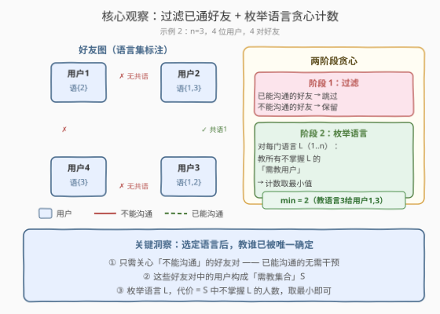
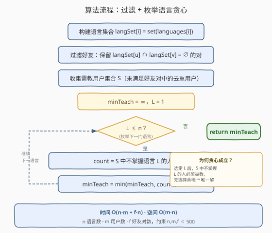
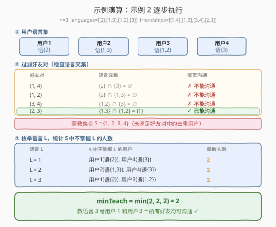

# 需要教语言的最少人数

- **题目名称**：需要教语言的最少人数
- **链接**：[1733. 需要教语言的最少人数](https://leetcode.cn/problems/minimum-number-of-people-to-teach/)
- **难度**：中等
- **标签**：贪心、枚举、哈希表、社交网络

## 1. 题目概述

在一个由 $m$ 个用户组成的社交网络里，两个好友能相互沟通的条件是**他们都掌握同一门语言**。给你：

- 整数 $n$：总共有 $n$ 种语言，编号 $1$ 到 $n$；
- `languages[i]`：第 $i$ 位用户掌握的语言集合；
- `friendships[i] = [u, v]`：用户 $u$ 和用户 $v$ 是好友。

你可以选择**一门**语言并教会一些用户，使得**所有好友之间都能相互沟通**。返回你最少需要教会多少名用户。

> ⚠️ 好友关系**没有传递性**：$x$ 和 $y$ 是好友、$y$ 和 $z$ 是好友，不代表 $x$ 和 $z$ 是好友。每对好友独立判断。

**示例 1**：

```text
输入：n = 2, languages = [[1],[2],[1,2]], friendships = [[1,2],[1,3],[2,3]]
输出：1
解释：可以教用户 1 第二门语言，也可以教用户 2 第一门语言。
```

**示例 2**：

```text
输入：n = 3, languages = [[2],[1,3],[1,2],[3]], friendships = [[1,4],[1,2],[3,4],[2,3]]
输出：2
解释：教用户 1 和用户 3 第三门语言，需要教 2 名用户。
```

**约束条件**：

- $2 \le n \le 500$
- $1 \le m \le 500$
- $1 \le \text{languages[i].length} \le n$
- $1 \le \text{friendships.length} \le 500$
- 所有好友关系 $(u_i, v_i)$ 都是唯一的
- `languages[i]` 中的值互不相同

> 💡 **关键结构**：只能选一门语言来教——这是一个**全局单选 + 逐项贪心**的问题。选定语言后，需要教谁已被唯一确定（不掌握该语言且出现在未满足好友对中的用户），无需再枚举子集。故只需枚举 $n$ 种语言，对每种贪心计数取最小。

---

## 2. 解题思路

### 2.1 暴力思路：枚举用户子集

最直觉的暴力做法是枚举「教哪些用户」的所有子集：对 $m$ 个用户的每个子集 $T$ 和每门语言 $L$，检查把 $L$ 教给 $T$ 中所有人后，是否所有好友都能沟通，取满足条件的最小 $|T|$。

问题在于：

1. **子集数指数级**：$m \le 500$ 时 $2^{500}$ 完全不可行；
2. **重复检查**：即便固定语言 $L$，仍需枚举 $2^m$ 个子集逐一验证。

> ⚠️ **症结**：暴力把「选语言」和「选人」当作两个独立的枚举维度。但实际上，**选定语言后，教谁是唯一确定的**——凡是出现在「不能沟通」好友对中、且不掌握该语言的人，都必须被教。这一步无需选择，贪心即可。

### 2.2 核心观察：过滤 + 枚举语言贪心计数



**三个关键洞察**：

1. **只需关注「不能沟通」的好友对**：已经能沟通的好友对（语言交集非空）无需任何干预。教语言给他们只会白白增加代价。故第一步是**过滤**：保留语言交集为空的好友对。

2. **需教集合 S 是确定的**：过滤后，所有「不能沟通」好友对中出现的用户（去重后）构成「需教集合」$S$。这些用户是唯一可能需要被教的人——不在 $S$ 中的用户的好友关系已经满足，教他们没有意义。

3. **选定语言后代价唯一确定**：选定语言 $L$ 后，$S$ 中不掌握 $L$ 的用户**必须**被教（否则他们所在的好友对仍然无法用 $L$ 沟通）。而 $S$ 中已掌握 $L$ 的用户无需再教。因此对每个 $L$，代价 $= |\{u \in S : L \notin \text{langSet}[u]\}|$，只需枚举 $n$ 种语言取最小。

> 💡 **为何贪心成立？** 对某个语言 $L$，若某用户 $u \in S$ 不掌握 $L$，但不教 $u$，那么 $u$ 所在的每个未满足好友对 $(u, v)$ 中，$v$ 必须掌握 $L$（否则双方都不懂 $L$，依然无法沟通）。但即使 $v$ 掌握 $L$，$(u, v)$ 仍无法用 $L$ 沟通——因为 $u$ 不懂。故 $u$ **必须**被教。这证明了对语言 $L$，代价唯一确定，不存在「少教某人也能满足」的情况。

### 2.3 算法流程图



**步骤**：

1. **构建语言集合**：将 `languages[i]` 转为哈希集合 `langSet[i]`，支持 $O(1)$ 查询某用户是否掌握某语言。
2. **过滤好友对**：遍历 `friendships`，对每对 $(u, v)$ 检查 `langSet[u]` 与 `langSet[v]` 是否有交集。无交集 → 加入 `unsatisfied` 列表。
3. **收集需教用户**：将 `unsatisfied` 中所有用户去重存入集合 $S$。
4. **枚举语言**：对 $L = 1, 2, \ldots, n$，统计 $S$ 中不掌握 $L$ 的用户数 `count`，更新 `minTeach = min(minTeach, count)`。
5. **返回** `minTeach`。

> 💡 **若 $S$ 为空**（所有好友已能沟通）：每个 $L$ 的 `count` 均为 0，`minTeach = 0`——无需教任何人。

### 2.4 示例演算

以示例 2 为例，逐步执行算法：



| 阶段 | 操作 | 结果 |
|------|------|------|
| ① 构建语言集 | `langSet[1]={2}, langSet[2]={1,3}, langSet[3]={1,2}, langSet[4]={3}` | 4 个哈希集合 |
| ② 过滤好友 | $(1,4)$: $\{2\}\cap\{3\}=\emptyset$ ✗；$(1,2)$: $\{2\}\cap\{1,3\}=\emptyset$ ✗；$(3,4)$: $\{1,2\}\cap\{3\}=\emptyset$ ✗；$(2,3)$: $\{1,3\}\cap\{1,2\}=\{1\}$ ✓ | unsatisfied = $\{(1,4),(1,2),(3,4)\}$ |
| ③ 收集需教用户 | 从 unsatisfied 提取去重用户 | $S = \{1, 2, 3, 4\}$ |
| ④ 枚举语言 | $L=1$: 不掌握者 $\{1,4\}$ → 2；$L=2$: 不掌握者 $\{2,4\}$ → 2；$L=3$: 不掌握者 $\{1,3\}$ → 2 | minTeach = 2 |

**验证**：选语言 3，教用户 1 和用户 3。教完后：
- 用户 1: $\{2, 3\}$，用户 3: $\{1, 2, 3\}$
- $(1,4)$: $\{2,3\}\cap\{3\}=\{3\}$ ✓；$(1,2)$: $\{2,3\}\cap\{1,3\}=\{3\}$ ✓；$(3,4)$: $\{1,2,3\}\cap\{3\}=\{3\}$ ✓

所有好友均可沟通，答案 $2$ ✓。

---

## 3. 参考代码

### C++

```cpp
class Solution {
public:
    int minimumTeachings(int n, vector<vector<int>>& languages,
                         vector<vector<int>>& friendships) {
        int m = languages.size();
        vector<unordered_set<int>> langSet(m + 1);
        for (int i = 0; i < m; ++i)
            for (int lang : languages[i])
                langSet[i + 1].insert(lang);

        vector<pair<int, int>> unsatisfied;
        for (auto& f : friendships) {
            int u = f[0], v = f[1];
            bool ok = false;
            for (int lang : langSet[u])
                if (langSet[v].count(lang)) { ok = true; break; }
            if (!ok) unsatisfied.emplace_back(u, v);
        }

        unordered_set<int> needy;
        for (auto& [u, v] : unsatisfied) {
            needy.insert(u);
            needy.insert(v);
        }

        int ans = INT_MAX;
        for (int L = 1; L <= n; ++L) {
            int cnt = 0;
            for (int u : needy)
                if (!langSet[u].count(L)) ++cnt;
            ans = min(ans, cnt);
        }
        return ans;
    }
};
```

### Python

```python
class Solution:
    def minimumTeachings(self, n: int, languages: List[List[int]],
                         friendships: List[List[int]]) -> int:
        lang_set = [set(langs) for langs in languages]

        unsatisfied = []
        for u, v in friendships:
            if not (lang_set[u - 1] & lang_set[v - 1]):
                unsatisfied.append((u, v))

        needy = set()
        for u, v in unsatisfied:
            needy.add(u)
            needy.add(v)

        ans = float('inf')
        for L in range(1, n + 1):
            cnt = sum(1 for u in needy if L not in lang_set[u - 1])
            ans = min(ans, cnt)
        return ans
```

> 💡 **Python 的集合交集**：`lang_set[u-1] & lang_set[v-1]` 直接计算两个集合的交集，非空即为 truthy。这比逐元素遍历更简洁，且 CPython 的集合交集底层用哈希表查找，复杂度 $O(\min(|A|, |B|))$。

> 💡 **1-indexed 处理**：LeetCode 的用户编号从 1 开始。C++ 中 `langSet` 大小开 $m+1$，直接用原始编号索引；Python 中 `lang_set` 是 0-indexed 列表，访问时需 `u - 1`。

> ⚠️ **`ans` 初始化为 `INT_MAX` / `inf`**：若 `needy` 为空（所有好友已能沟通），循环中每个 `cnt = 0`，`ans` 被更新为 0。但若循环一次都不执行（$n = 0$，约束不允许），`ans` 会保持初始值。约束 $n \ge 2$ 保证循环至少执行两次。

---

## 4. 复杂度分析

| 维度 | 复杂度 | 说明 |
|------|--------|------|
| 时间 | $O(n \cdot m + f \cdot n)$ | 构建语言集 $O(m \cdot n)$；过滤好友每对最坏 $O(n)$ 共 $O(f \cdot n)$；枚举语言 $n$ 轮每轮遍历 $S$（$\le m$）共 $O(n \cdot m)$ |
| 空间 | $O(m \cdot n)$ | `langSet` 存储 $m$ 个用户每人最多 $n$ 种语言 |

> 💡 **约束下规模**：$n, m, f \le 500$，总操作约 $500 \times 500 + 500 \times 500 = 5 \times 10^5$，远在时限内。

---

## 5. 扩展：若可以教多门语言会怎样？

如果题目放宽为「可以教任意多门语言」，问题将变为：选择若干语言 $L_1, L_2, \ldots$ 并分别教给若干用户，使所有好友对都能沟通，最小化总教学人数（一人学多门算多次）。

这退化为**集合覆盖问题（Set Cover）**的变体——NP-hard。每对未满足好友 $(u, v)$ 需要 $u$ 或 $v$ 至少一方学会某门共同语言。形式化地，对每对 $(u, v)$，需存在某语言 $L$ 使得 $u$ 和 $v$ 都掌握 $L$（原本就掌握或被教）。这是一个复杂的组合优化问题，通常需要贪心近似或 ILP 求解。

> 💡 **单选语言的约束是关键**：正因「只能选一门语言」，使得选定 $L$ 后所有好友对必须通过 $L$ 来沟通，从而教谁被唯一确定（$S$ 中不掌握 $L$ 的人全教），贪心成立。允许多语言后，不同好友对可用不同语言沟通，选择空间爆炸。

### Bitset 优化

当 $n$ 较大时，可将每个用户的语言集用 `bitset<500>` 存储，交集检查变为 $O(n / 64)$ 的位运算（AND 后判空）。对 $n = 500$，一次交集检查仅需 $\lceil 500/64 \rceil = 8$ 次机器字 AND，比哈希集合的 $O(\min(|A|, |B|))$ 更快。但 $n, m, f \le 500$ 时哈希集已足够，bitset 优化非必需。

---

## 6. 面试要点

**Q1：为什么要先过滤掉已经能沟通的好友对？**
> 已经能沟通的好友对无需任何干预，教语言给他们只会增加代价。过滤后只需关注「不能沟通」的子集，减小搜索空间。关键在于：教一门语言只能让原本不能沟通的 pair 变成能沟通，对已经满足的 pair 无影响。

**Q2：为什么枚举语言而不是枚举用户子集？**
> 枚举用户子集是 $2^m$ 指数级，不可行。题目限定只能教一门语言，故只需枚举 $n$ 种语言。更关键的是：选定语言 $L$ 后，需要教的人是唯一确定的——$S$ 中不掌握 $L$ 的人必须全教，无需再枚举子集。这是贪心成立的核心。

**Q3：如果所有好友已经能沟通，返回什么？**
> 返回 0。此时 `unsatisfied` 为空，`needy` 为空集，对任何语言 $L$ 的计数都是 0，`minTeach = 0`。代码中 `ans` 初始化为 $\infty$，循环后自然变为 0。

**Q4：好友关系没有传递性，对算法有影响吗？**
> 没有影响。算法只关心每对好友是否能直接沟通，不涉及间接传递。每对好友独立判断语言交集即可，不需要连通分量或并查集。

**Q5：时间复杂度能否优化？**
> 当前为 $O(n \cdot m + f \cdot n)$。过滤步骤可用 bitset 将交集检查从 $O(n)$ 降到 $O(n/w)$（$w$ 为机器字长）。但 $n, m, f \le 500$ 时当前方案约 $5 \times 10^5$ 次操作，已足够快，无需优化。

> 💡 **一句话总结**：过滤不能沟通的好友对 → 收集需教用户集合 S → 枚举 n 种语言，代价 = S 中不掌握该语言的人数 → 取最小，$O(n \cdot m + f \cdot n)$ 时间、$O(m \cdot n)$ 空间。

---

## 7. 同类练习题

- [547. 省份数量](https://leetcode.cn/problems/number-of-provinces/)（[题解](../0501-0600/547_省份数量.md)）：社交网络中求连通分量（省份），与本题同属「好友关系图」语境，但关注连通性而非沟通条件，对照体会并查集 vs 贪心枚举的适用边界
- [1497. 检查数组对是否可以被 k 整除](https://leetcode.cn/problems/check-if-array-pairs-are-divisible-by-k/)：配对条件检查 + 哈希计数，与本题「检查好友对能否沟通」的过滤步骤同构，但目标是判定能否完全配对而非最小化教学人数
- [1334. 阈值距离内邻居最少的城市](https://leetcode.cn/problems/find-the-city-with-the-smallest-number-of-neighbors-at-a-threshold-distance/)（[题解](../1301-1400/1334_阈值距离内邻居最少的城市.md)）：枚举城市 + 最短路计算代价取最小，与本题「枚举语言 + 贪心计数取最小」的枚举最小化结构同构，对照体会「枚举 + 计算代价」范式的通用性
- [881. 救生艇](https://leetcode.cn/problems/boats-to-save-people/)：贪心配对求最小数量，与本题「教最少人使好友都能沟通」的优化目标同构，但配对策略不同（双指针 vs 枚举），对照理解不同贪心场景的选择差异
