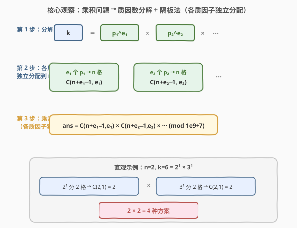
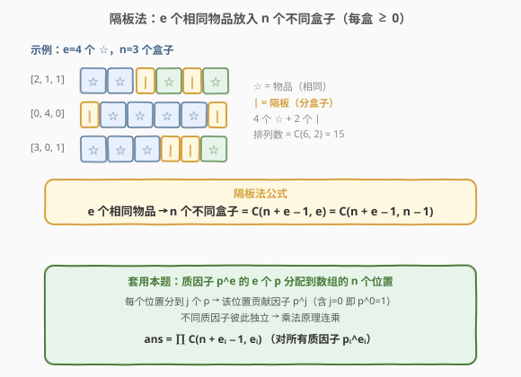
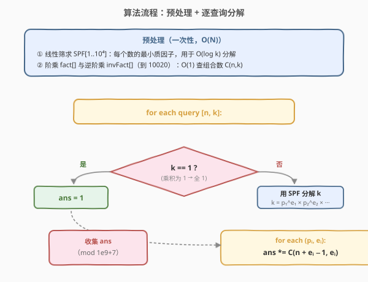
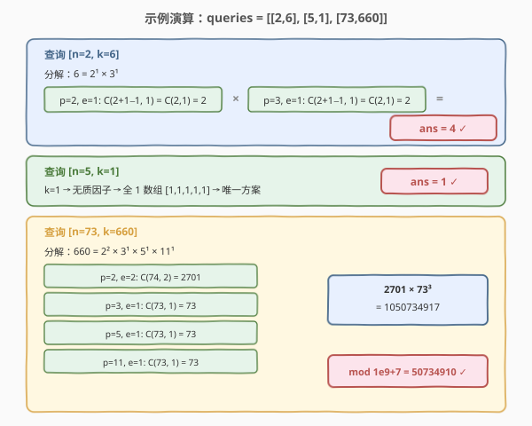

# LeetCode 生成乘积数组的方案数 题解

## 1. 题目概述

- **标题 / 题号**：生成乘积数组的方案数（#1735，hard）
- **链接**：https://leetcode.cn/problems/count-ways-to-make-array-with-product/
- **难度**：困难
- **标签**：数学、数论、组合数学、质因数分解、预处理

**题意**：给定一个二维整数数组 `queries`，其中 `queries[i] = [ni, ki]`。第 $i$ 个查询要求构造一个长度为 $n_i$、每个元素都是正整数的数组，且满足所有元素的**乘积**为 $k_i$。求有多少种可行方案。由于答案可能很大，需对 $10^9 + 7$ **取余**。

返回整数数组 `answer`，其中 `answer[i]` 是第 $i$ 个查询的结果。

**示例 1**：

```text
输入：queries = [[2,6],[5,1],[73,660]]
输出：[4,1,50734910]
解释：
[2,6]：4 种方案得到长度为 2、乘积为 6 的数组：[1,6]、[2,3]、[3,2]、[6,1]。
[5,1]：1 种方案得到长度为 5、乘积为 1 的数组：[1,1,1,1,1]。
[73,660]：1050734917 mod (10⁹+7) = 50734910。
```

**示例 2**：

```text
输入：queries = [[1,1],[2,2],[3,3],[4,4],[5,5]]
输出：[1,2,3,10,5]
```

**约束**：

- $1 \le \text{queries.length} \le 10^4$
- $1 \le n_i, k_i \le 10^4$

> 💡 **关键结构**：每个查询独立，核心是「给定 $n$ 个正整数的乘积等于 $k$，求方案数」。$k$ 的值域仅 $10^4$，提示我们可以对 $k$ 做**质因数分解**——不同质因子之间的分配互相独立，于是问题被拆解为「把同一种质因子分配到 $n$ 个位置」的组合计数。

## 2. 解题思路

### 2.1 暴力思路：枚举数组

最直觉的做法是 DFS 回溯：枚举数组的每个位置填什么正整数，保证乘积恰为 $k$。

```text
dfs(pos, remaining):
    if pos == n:
        if remaining == 1: ans += 1
        return
    for x in 1..remaining:  # x 必须整除 remaining
        if remaining % x == 0:
            dfs(pos+1, remaining // x)
```

问题在于：

1. **分支爆炸**：当 $k$ 较大时，每个位置可填的因子很多（$k$ 的所有约数），分支数随 $n$ 指数增长。$n = 73, k = 660$ 时答案已超过 $10^9$，枚举所有方案完全不可行。
2. **重复子问题未利用**：不同质因子的分配互相独立，但暴力法把它们耦合在一起枚举，无法利用乘法原理拆分。

> ⚠️ **症结**：乘积约束的本质是「每个质因子的总数固定」，不同质因子之间互不影响。暴力枚举把所有质因子的分配混在一起，丧失了独立性带来的可分解性。正确做法是先**分解**再**独立计数**。

### 2.2 核心观察：质因数分解 + 隔板法



**三步分解**：

**第 1 步——质因数分解**：将 $k$ 分解为质因数的幂乘积：

$$k = p_1^{e_1} \times p_2^{e_2} \times \cdots \times p_m^{e_m}$$

由于 $k \le 10^4$，质因子种类很少（$660 = 2^2 \times 3 \times 5 \times 11$ 只有 4 种），且最大指数 $e \le 13$（因为 $2^{13} = 8192 \le 10^4 < 2^{14}$）。

**第 2 步——隔板法独立分配**：对每个质因子 $p_i^{e_i}$，$e_i$ 个相同的 $p_i$ 要分配到 $n$ 个不同的位置（每位置分到 $\ge 0$ 个 $p_i$，分到 $j$ 个则该位置贡献因子 $p_i^j$）。这是经典的**隔板法（Stars and Bars）**问题：

$$\text{分配方案数} = \binom{n + e_i - 1}{e_i} = \binom{n + e_i - 1}{n - 1}$$



> 💡 **隔板法直觉**：$e$ 个相同的星（☆）和 $n-1$ 个隔板（|）排成一列，共 $n + e - 1$ 个位置，选 $e$ 个放星（或选 $n-1$ 个放隔板）。每种排列对应一种分配方案。例如 $e=4, n=3$：`☆☆|☆|☆` 表示盒子分别得到 $[2,1,1]$，排列总数 $= \binom{6}{2} = 15$。

**第 3 步——乘法原理**：不同质因子的分配互相独立（一个位置对 $p_1$ 的分配不影响对 $p_2$ 的分配），因此总方案数为各质因子分配方案数的乘积：

$$\text{ans} = \prod_{i=1}^{m} \binom{n + e_i - 1}{e_i} \pmod{10^9 + 7}$$

**特殊情况**：$k = 1$ 时没有质因子（空乘积），唯一方案是全 1 数组 $[1, 1, \ldots, 1]$，答案 $= 1$。

> ⚠️ **为什么不同质因子独立？** 设数组第 $j$ 个元素 $a_j = p_1^{c_{1,j}} \times p_2^{c_{2,j}} \times \cdots$。乘积约束 $\prod a_j = k$ 等价于对每个质因子 $p_i$，$\sum_j c_{i,j} = e_i$。各 $p_i$ 的方程互不耦合，方案数独立相乘。这是**唯一分解定理**的直接推论——正整数的质因数分解唯一，使得乘积约束可按质因子拆分。

### 2.3 算法流程图



**预处理**（一次性）：

1. **线性筛求 SPF（最小质因子）**：对 $1 \sim 10^4$ 的每个数预存其最小质因子，使得分解任意 $k \le 10^4$ 只需 $O(\log k)$ 次。
2. **阶乘与逆阶乘**：预计算 $\text{fact}[0 \ldots N_{\max}]$ 和 $\text{invFact}[0 \ldots N_{\max}]$，利用**费马小定理**求逆元（$10^9 + 7$ 是质数），使得 $\binom{n}{k} = \text{fact}[n] \times \text{invFact}[k] \times \text{invFact}[n-k] \bmod p$ 为 $O(1)$ 查询。其中 $N_{\max} = n_{\max} + e_{\max} - 1 = 10^4 + 13 - 1 = 10012$，取 $10020$ 即可。

**逐查询处理**：

1. 读取 $[n, k]$。若 $k = 1$，答案 $= 1$，跳过。
2. 用 SPF 分解 $k = p_1^{e_1} \times p_2^{e_2} \times \cdots$。
3. 对每个 $(p_i, e_i)$，计算 $\binom{n + e_i - 1}{e_i}$，累乘取模。
4. 返回累乘结果。

### 2.4 示例演算



**查询 [2, 6]**：

| 步骤 | 质因子 | 指数 $e$ | 组合数 $\binom{n+e-1}{e}$ | 含义 |
|------|--------|----------|---------------------------|------|
| 分解 | $6 = 2^1 \times 3^1$ | — | — | 两个质因子 |
| 分配 $p=2$ | $2$ | $1$ | $\binom{2}{1} = 2$ | 1 个 2 放 2 格：[2,1] 或 [1,2] |
| 分配 $p=3$ | $3$ | $1$ | $\binom{2}{1} = 2$ | 1 个 3 放 2 格：[3,1] 或 [1,3] |
| 乘法原理 | — | — | $2 \times 2 = 4$ | 4 种方案 ✓ |

4 种方案：$[1,6], [2,3], [3,2], [6,1]$ ✓

**查询 [73, 660]**：

$$660 = 2^2 \times 3^1 \times 5^1 \times 11^1$$

| 质因子 | $e$ | $\binom{73+e-1}{e}$ | 值 |
|--------|-----|----------------------|-----|
| $p=2$ | $2$ | $\binom{74}{2}$ | $2701$ |
| $p=3$ | $1$ | $\binom{73}{1}$ | $73$ |
| $p=5$ | $1$ | $\binom{73}{1}$ | $73$ |
| $p=11$ | $1$ | $\binom{73}{1}$ | $73$ |

$$\text{ans} = 2701 \times 73 \times 73 \times 73 = 2701 \times 389017 = 1050734917$$

$$1050734917 \bmod (10^9 + 7) = 1050734917 - 1000000007 = 50734910 \quad \checkmark$$

> 💡 **为什么 $e=2$ 时是 $\binom{74}{2}$？** 隔板法公式 $\binom{n+e-1}{e}$ 中 $n=73, e=2$，故 $\binom{73+2-1}{2} = \binom{74}{2} = \frac{74 \times 73}{2} = 2701$。直观理解：2 个相同的 2 分配到 73 个位置，等价于允许两位置相同（都分到 1 个 2）或不同（一个位置分到 2 个 2），即 73 个「单点」方案 + $\binom{73}{2}$ 个「双点」方案 $= 73 + 2628 = 2701$ ✓。

## 3. 参考代码

### C++

```cpp
class Solution {
    static constexpr int MOD = 1e9 + 7;
    static constexpr int MAXK = 10020;   // n_max + e_max - 1 = 10012, 留余量
    static constexpr int MAXP = 10001;   // k 的值域上界

    int spf[MAXP + 1];          // 最小质因子
    long long fact[MAXK];
    long long invFact[MAXK];

    long long power(long long base, long long exp, long long mod) {
        long long res = 1;
        base %= mod;
        while (exp > 0) {
            if (exp & 1) res = res * base % mod;
            base = base * base % mod;
            exp >>= 1;
        }
        return res;
    }

    void precompute() {
        // 线性筛求 SPF
        vector<int> primes;
        fill(spf, spf + MAXP + 1, 0);
        for (int i = 2; i <= MAXP; ++i) {
            if (spf[i] == 0) {
                spf[i] = i;
                primes.push_back(i);
            }
            for (int p : primes) {
                if ((long long)i * p > MAXP) break;
                spf[i * p] = p;
                if (i % p == 0) break;
            }
        }
        // 阶乘与逆阶乘
        fact[0] = 1;
        for (int i = 1; i < MAXK; ++i)
            fact[i] = fact[i - 1] * i % MOD;
        invFact[MAXK - 1] = power(fact[MAXK - 1], MOD - 2, MOD);
        for (int i = MAXK - 2; i >= 0; --i)
            invFact[i] = invFact[i + 1] * (i + 1) % MOD;
    }

    long long C(int n, int k) {
        if (k < 0 || k > n) return 0;
        return fact[n] * invFact[k] % MOD * invFact[n - k] % MOD;
    }

public:
    vector<int> waysToFillArray(vector<vector<int>>& queries) {
        precompute();
        vector<int> ans;
        ans.reserve(queries.size());
        for (auto& q : queries) {
            int n = q[0], k = q[1];
            if (k == 1) { ans.push_back(1); continue; }
            long long res = 1;
            while (k > 1) {
                int p = spf[k], e = 0;
                while (k % p == 0) { k /= p; ++e; }
                res = res * C(n + e - 1, e) % MOD;
            }
            ans.push_back((int)res);
        }
        return ans;
    }
};
```

### Python

```python
class Solution:
    MOD = 10**9 + 7
    MAXK = 10020
    MAXP = 10001

    def __init__(self):
        self._precompute()

    def _precompute(self):
        # 线性筛求 SPF
        self.spf = [0] * (self.MAXP + 1)
        primes = []
        for i in range(2, self.MAXP + 1):
            if self.spf[i] == 0:
                self.spf[i] = i
                primes.append(i)
            for p in primes:
                if i * p > self.MAXP:
                    break
                self.spf[i * p] = p
                if i % p == 0:
                    break
        # 阶乘与逆阶乘
        self.fact = [1] * self.MAXK
        for i in range(1, self.MAXK):
            self.fact[i] = self.fact[i - 1] * i % self.MOD
        self.inv_fact = [1] * self.MAXK
        self.inv_fact[self.MAXK - 1] = pow(self.fact[self.MAXK - 1], self.MOD - 2, self.MOD)
        for i in range(self.MAXK - 2, -1, -1):
            self.inv_fact[i] = self.inv_fact[i + 1] * (i + 1) % self.MOD

    def _C(self, n: int, k: int) -> int:
        if k < 0 or k > n:
            return 0
        return self.fact[n] * self.inv_fact[k] % self.MOD * self.inv_fact[n - k] % self.MOD

    def waysToFillArray(self, queries: List[List[int]]) -> List[int]:
        ans = []
        for n, k in queries:
            if k == 1:
                ans.append(1)
                continue
            res = 1
            while k > 1:
                p = self.spf[k]
                e = 0
                while k % p == 0:
                    k //= p
                    e += 1
                res = res * self._C(n + e - 1, e) % self.MOD
            ans.append(res)
        return ans
```

> 💡 **预处理为什么放在构造函数/方法入口？** LeetCode 会复用同一个 `Solution` 实例跑多个测试用例。C++ 中每次调用 `waysToFillArray` 都重跑 `precompute()` 是 $O(N)$ 的常数开销（$N \approx 10^4$），在 $10^4$ 个查询下完全可接受。若追求极致效率，可用 `static` 成员 + `if (!initialized)` 标志位只预处理一次。

> ⚠️ **MAXK 的取值**：$\binom{n + e - 1}{e}$ 的第一个参数最大为 $n_{\max} + e_{\max} - 1 = 10000 + 13 - 1 = 10012$，故 `MAXK = 10020` 足够。若算错上界（如取 $10000$），会在 $n$ 大且 $k = 8192 = 2^{13}$ 时数组越界。

## 4. 复杂度分析

| 维度 | 复杂度 | 说明 |
|------|--------|------|
| 预处理时间 | $O(N + N_{\max})$ | 线性筛 $O(N)$（$N = 10^4$）+ 阶乘表 $O(N_{\max})$（$N_{\max} \approx 10^4$），总计约 $2 \times 10^4$ 次操作 |
| 单查询时间 | $O(\log k)$ | 用 SPF 分解 $k$：每次除掉最小质因子，总次数 $\le \log_2 k \le 14$；每个质因子 $O(1)$ 查组合数 |
| 总时间 | $O(N + Q \log k_{\max})$ | $Q \le 10^4$ 个查询，每个 $O(\log 10^4) \approx 14$，总计约 $1.4 \times 10^5$ 次操作 |
| 空间 | $O(N + N_{\max})$ | SPF 数组 $O(10^4)$ + 阶乘/逆阶乘表 $O(10^4)$，总计约 $2 \times 10^4$ 个 `long long` |

> 💡 **为何单查询是 $O(\log k)$ 而非 $O(\sqrt{k})$？** 朴素分解需试除到 $\sqrt{k}$（$O(\sqrt{k}) \approx 100$），但预存 SPF 后每次直接取最小质因子并整除，$k$ 每轮至少减半（最小质因子 $\ge 2$），总轮数 $\le \log_2 k$。这是线性筛预处理的核心收益——把分解从 $O(\sqrt{k})$ 降到 $O(\log k)$。

## 5. 扩展：隔板法与组合数取模

### 5.1 隔板法的等价视角

隔板法 $\binom{n+e-1}{e}$ 有两种等价理解：

- **星与隔板排列**：$e$ 个相同的星 + $n-1$ 个相同的隔板，共 $n+e-1$ 个位置选 $e$ 个放星（或选 $n-1$ 个放隔板），方案数 $\binom{n+e-1}{e} = \binom{n+e-1}{n-1}$。
- **可重复组合**：从 $n$ 种物品中可重复地取 $e$ 个（每种取 $\ge 0$ 个），方案数 $\binom{n+e-1}{e}$，即「$n$ 元 $e$ 次可重复组合」。

> 💡 **隔板法变体**：若要求每盒 $\ge 1$（而非 $\ge 0$），先给每盒放 1 个，剩下 $e - n$ 个分 $n$ 盒，方案数 $\binom{e-1}{n-1}$。本题允许位置取 $1$（即 $p^0 = 1$，不分配该质因子），故用 $\ge 0$ 的版本 $\binom{n+e-1}{e}$。

### 5.2 费马小定理求逆元

组合数 $\binom{n}{k} = \frac{n!}{k!(n-k)!} \bmod p$ 需要计算除法取模。当 $p$ 为质数时，利用**费马小定理**：$a^{p-1} \equiv 1 \pmod{p}$，故 $a^{-1} \equiv a^{p-2} \pmod{p}$。于是：

$$\binom{n}{k} \equiv \text{fact}[n] \times \text{invFact}[k] \times \text{invFact}[n-k] \pmod{p}$$

其中 $\text{invFact}[i] = (\text{fact}[i])^{p-2} \bmod p$。批量预处理时，先算最大的 $\text{invFact}[N_{\max}]$（一次快速幂 $O(\log p)$），再利用 $\text{invFact}[i] = \text{invFact}[i+1] \times (i+1) \bmod p$ 倒推，总体 $O(N_{\max} + \log p)$。

> ⚠️ **费马小定理的前提**：模数 $p$ 必须为质数，且 $a$ 不被 $p$ 整除。本题 $p = 10^9 + 7$ 是质数，且 $\text{fact}[i] < p$（因为 $p > 10^9$ 而 $i \le 10^4$），条件满足。

### 5.3 为什么用线性筛而非埃氏筛

本题需要 SPF（最小质因子）数组来做 $O(\log k)$ 分解。**埃氏筛**只标记合数是否为质数，不记录最小质因子；**线性筛**在标记 `spf[i*p] = p` 时天然记录了每个合数的最小质因子（因为 `p` 是按从小到大枚举的质数，且 `i % p == 0` 时 `break` 保证 `p` 是 `i*p` 的最小质因子）。因此需要 SPF 时线性筛是首选。

## 6. 面试要点

**Q1：为什么这道题可以分解成各质因子独立计数？**
> 唯一分解定理保证正整数的质因数分解唯一。乘积约束 $\prod a_j = k$ 等价于对每个质因子 $p_i$，各位置分配的 $p_i$ 个数之和 $= e_i$。不同质因子的方程互不耦合，方案数独立相乘。这是「乘法原理」在数论计数中的典型应用。

**Q2：隔板法公式 $\binom{n+e-1}{e}$ 是怎么来的？**
> $e$ 个相同物品分到 $n$ 个不同盒子（每盒 $\ge 0$），等价于 $e$ 个星和 $n-1$ 个隔板的排列，共 $n+e-1$ 个位置选 $e$ 个放星，方案数 $\binom{n+e-1}{e}$。本题中「物品」是同一种质因子的 $e$ 个拷贝，「盒子」是数组的 $n$ 个位置，分到 $j$ 个的位置贡献 $p^j$（$j=0$ 时贡献 $1$）。

**Q3：预处理需要多大范围的阶乘表？**
> $\binom{n+e-1}{e}$ 的第一个参数最大为 $n_{\max} + e_{\max} - 1$。$n_{\max} = 10^4$，$k_{\max} = 10^4$ 的最大质因子指数 $e_{\max} = 13$（$2^{13} = 8192$），故最大 $= 10012$，阶乘表开到 $10020$ 即可。开小了会在 $n$ 大、$k = 8192$ 时越界；开大了浪费空间但无害。

**Q4：为什么用线性筛而不是埃氏筛？**
> 本题需要 SPF（最小质因子）数组来 $O(\log k)$ 分解 $k$。线性筛在 `spf[i*p] = p` 处天然记录了每个数的最小质因子，而埃氏筛只标记「是否为质数」。需要 SPF 时线性筛是首选；仅计数质数时埃氏筛更简洁（参见 [204. 计数质数](../0201-0300/204_计数质数.md)）。

**Q5：$k = 1$ 为什么要特判？**
> $k = 1$ 没有质因子，分解结果为空，乘法原理的空乘积 $= 1$（乘法单位元）。直接返回 $1$ 对应唯一方案 $[1, 1, \ldots, 1]$。如果不特判而依赖「空循环不累乘、`res` 保持初值 $1$」，逻辑也正确，但显式特判更清晰。

> 💡 **一句话总结**：乘积方案数 = 质因数分解（线性筛 SPF）+ 隔板法（$\binom{n+e-1}{e}$ 各质因子独立分配）+ 乘法原理（连乘取模），预处理 $O(N)$ 后每查询 $O(\log k)$。

## 同类练习题

| # | 题目 | 与本题的关联 |
|---|------|-------------|
| 254 | [因子的组合](https://leetcode.cn/problems/factor-combinations/)（[题解](../0201-0300/254_因子的组合.md)） | 同为「乘积分解」族，但用回溯枚举所有因子组合而非计数，对照「计数」与「枚举」两种分解视角 |
| 204 | [计数质数](https://leetcode.cn/problems/count-primes/)（[题解](../0201-0300/204_计数质数.md)） | 埃氏筛 / 线性筛模板题，本题预处理 SPF 的基础，对照两种筛法的适用场景 |
| 172 | [阶乘后的零](https://leetcode.cn/problems/factorial-trailing-zeroes/)（[题解](../0101-0200/172_阶乘后的零.md)） | 勒让德公式数质因子个数，与本题的质因数分解同源，对照「统计因子」与「分配因子」两种数论计数 |
| 62 | [不同路径](https://leetcode.cn/problems/unique-paths/) | 网格路径计数 $= \binom{m+n-2}{m-1}$，同为组合数取模的经典场景，对照隔板法在不同问题中的套用方式 |
| 50 | [Pow(x, n)](https://leetcode.cn/problems/powx-n/)（[题解](../0001-0100/50_Powx_n.md)） | 快速幂模板，本题求逆元（费马小定理 $a^{p-2}$）的核心依赖 |
