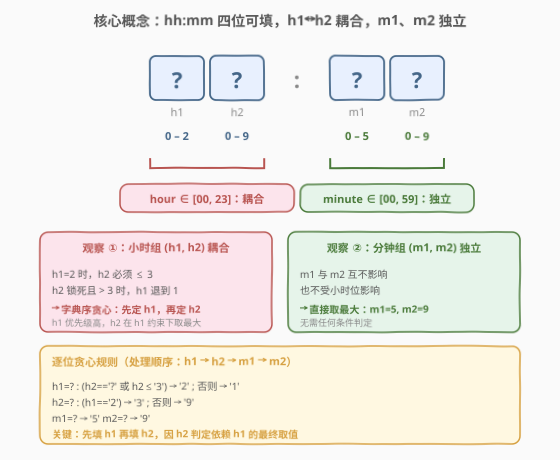
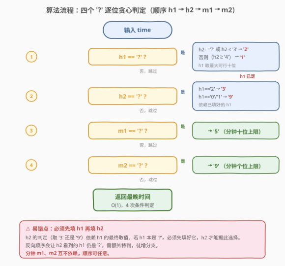
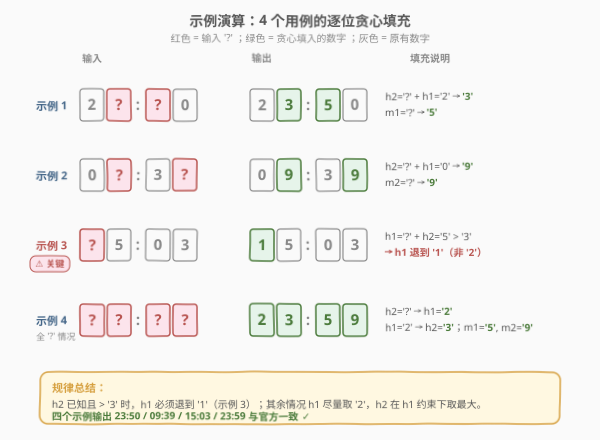

# LeetCode 替换隐藏数字得到的最晚时间 题解

## 1. 题目概述

- **标题 / 题号**：替换隐藏数字得到的最晚时间（#1736，easy）
- **链接**：https://leetcode.cn/problems/latest-time-by-replacing-hidden-digits/
- **难度**：简单
- **标签**：字符串、贪心

**题意**：给你一个字符串 `time`，格式为 `hh:mm`，其中某些数字被隐藏（用字符 `'?'` 表示）。请用数字替换所有 `'?'`，使得得到的**24 小时制时间最晚**（即在一天中尽量靠后），且仍是合法时间。返回替换后的字符串。

合法的 24 小时制时间范围为 `00:00` 到 `23:59`。

**示例 1**：

```text
输入：time = "2?:?0"
输出："23:50"
解释：可选的最晚时间是 23:50。
```

**示例 2**：

```text
输入：time = "0?:3?"
输出："09:39"
```

**示例 3**：

```text
输入：time = "1?:22"
输出："19:22"
```

**示例 4**：

```text
输入：time = "?5:03"
输出："15:03"
解释：第 1 位若取 2，则 25:03 非法（小时不能超过 23），故最大取 1，得到 15:03。
```

**约束**：

- `time.length == 5`
- `time` 形如 `hh:mm`
- `time[i]` 是 `'0'`–`'9'` 中的数字，或 `'?'`
- 输入保证存在至少一种合法替换方案

> 💡 **关键观察**：字符串长度固定为 5，`'?'` 最多 4 个。问题规模极小，但直接枚举所有替换（$10^4$ 种）虽能 AC 却未免"杀鸡用牛刀"。本题真正考察的是**识别位间耦合关系**：小时两位互相约束（$\text{hour} \le 23$），分钟两位则完全独立，于是可逐位贪心 $O(1)$ 直接定出答案。

## 2. 解题思路

### 2.1 暴力思路：从 23:59 倒序枚举所有合法时间

最直白的做法是：**从最晚的合法时间 `23:59` 起，按时间倒序逐个检查是否匹配输入模式**（非 `'?'` 位必须相等），返回首个匹配者。

```text
for h in 23..0 (倒序):
    for m in 59..0 (倒序):
        cand = f"{h:02d}:{m:02d}"
        if match(cand, pattern):   # pattern[i]=='?' 或 pattern[i]==cand[i]
            return cand
```

合法时间共 $24\times60 = 1440$ 个，最坏遍历 1440 个候选、每个比对 5 位，$O(1440\times5) = O(1)$（常数）。逻辑清晰、**显然正确**，但常数偏大、未利用问题的结构。能否直接"算"出答案，而不靠枚举？

### 2.2 核心观察：分钟独立、小时耦合，逐位贪心



把 5 个位置标号为 `h1 h2 : m1 m2`，逐位分析其**合法取值范围**与**是否受其它位影响**：

| 位置 | 含义 | 独立取值范围 | 是否受其它位约束 |
|------|------|--------------|------------------|
| `h1` | 小时十位 | `'0'`–`'2'` | **受 `h2` 约束**：若 `h1='2'`，则 `h2` 只能 `'0'`–`'3'` |
| `h2` | 小时个位 | `'0'`–`'9'` | **受 `h1` 约束**：若 `h1='2'`，则 `h2` 限 `'0'`–`'3'`；否则 `'0'`–`'9'` |
| `m1` | 分钟十位 | `'0'`–`'5'` | **独立**（分钟恒为 0–59） |
| `m2` | 分钟个位 | `'0'`–`'9'` | **独立** |

于是问题分为两组：

1. **分钟组 `(m1, m2)`**：完全独立。要使时间最晚，分钟越大越好，直接 `m1='5'`、`m2='9'`（即 `59`），毫无悬念。
2. **小时组 `(h1, h2)`**：互相耦合，但满足"**字典序最大即时间最晚**"——因为小时越大时间越晚，而在小时相同下，`h2` 越大也越晚。于是按 `(h1, h2)` 的字典序从大到小贪心：

   - **先定 `h1`（优先级高）**：尽量取 `'2'`。但 `h1='2'` 要求 `h2 ≤ '3'`。
     - 若 `h2` 已知且 `≤ '3'`：取 `h1='2'` ✓
     - 若 `h2` 已知且 `≥ '4'`：`h1='2'` 会导致 `2X` 非法（`24`–`29` 超出 23），退而取 `h1='1'`
     - 若 `h2 == '?'`：`h2` 可由我们后续自由填成 `'3'` 满足约束，故 `h1` 取 `'2'` ✓
   - **再定 `h2`（基于已定的 `h1`）**：
     - 若 `h1='2'`：`h2` 最大取 `'3'`（保证 `≤ 23`）
     - 若 `h1='0'` 或 `'1'`：`h2` 无约束，最大取 `'9'`

> 💡 **"字典序最大"为何等同于"时间最晚"？** 时间的比较本质是先比小时、再比分钟；小时内先比十位、再比个位。因此字符串 `hh:mm` 的**字典序**与**时间先后**完全一致（`:` 的 ASCII 值介于 `'9'` 与 `'A'` 之间，不影响数字位比较）。要"最晚"即要"字典序最大"，这正是贪心逐位取最大可行值的依据。

> ⚠️ **为什么 `h2='?'` 时 `h1` 取 `'2'` 是安全的？** 关键在于 `h2` 还没定，我们有"后续补救权"——只要把 `h2` 填成 `'3'`，`23` 即合法。换言之，`h1='2'` 是否可行取决于"是否存在某个合法 `h2`"，而 `h2='?'` 意味着 `h2` 可任取，`'3'` 总在候选中，故 `h1='2'` 必然可行。这与 `h2` 已知为 `'5'` 的情况不同——后者 `h2` 锁死，`h1='2'` 会让 `25` 非法，只能退 `h1='1'`。

> 💡 **贪心交换论证**：设最优解为 `h1*, h2*`，贪心解为 `h1g, h2g`。若 `h1g > h1*`，则 `h1g` 更高位更大→贪心解严格更晚，与最优矛盾；若 `h1g == h1*`，则比 `h2`，同理 `h2g \ge h2*$`（取了该 `h1` 下最大可行 `h2`）。故贪心解不劣于最优解。这正是"字典序最大"贪心的标准论证。

### 2.3 算法流程图



**步骤**（对 `time` 的四个数字位依次判空填充，`:` 不动）：

1. **`h1` 位（下标 0）**：若为 `'?'`：
   - `h2 == '?'` 或 `h2 \le '3'` → 填 `'2'`
   - 否则（`h2 \ge '4'`） → 填 `'1'`
2. **`h2` 位（下标 1）**：若为 `'?'`：
   - `h1 == '2'` → 填 `'3'`
   - 否则（`h1` 为 `'0'`/`'1'`） → 填 `'9'`
3. **`m1` 位（下标 3）**：若为 `'?'` → 填 `'5'`
4. **`m2` 位（下标 4）**：若为 `'?'` → 填 `'9'`
5. 返回拼接后的字符串。

> 💡 **处理顺序很重要**：必须**先填 `h1` 再填 `h2`**，因为 `h2` 的判定依赖 `h1` 的最终取值（`h1=='2'` vs `'0'/'1'`）。若 `h1` 本是 `'?'`，先填好它，`h2` 才能据此选 `'3'` 或 `'9'`。反向顺序会导致 `h2` 看到的 `h1` 仍是 `'?'`，需额外特判，徒增复杂度。

### 2.4 示例演算

以四个示例演示逐位贪心填充过程：



**示例 1**：`"2?:?0"` → `"23:50"`

| 位置 | 原值 | 判定 | 填值 | 中间结果 |
|------|------|------|------|----------|
| `h1` (0) | `'2'` | 非 `?`，跳过 | `'2'` | `2?:?0` |
| `h2` (1) | `'?'` | `h1=='2'` → 取 `'3'` | `'3'` | `23:?0` |
| `m1` (3) | `'?'` | → `'5'` | `'5'` | `23:50` |
| `m2` (4) | `'0'` | 非 `?`，跳过 | `'0'` | `23:50` |

**示例 3**：`"?5:03"` → `"15:03"`

| 位置 | 原值 | 判定 | 填值 | 中间结果 |
|------|------|------|------|----------|
| `h1` (0) | `'?'` | `h2='5'` 且 `'5' > '3'` → 取 `'1'` | `'1'` | `15:03` |
| `h2` (1) | `'5'` | 非 `?`，跳过 | `'5'` | `15:03` |
| `m1` (3) | `'0'` | 非 `?`，跳过 | `'0'` | `15:03` |
| `m2` (4) | `'3'` | 非 `?`，跳过 | `'3'` | `15:03` |

> ⚠️ **示例 3 是本题最易错点**：`h1='?'`、`h2='5'` 时，若机械地"小时越大越好"取 `h1='2'`，会得到 `25:03` —— **非法**！关键在于 `h2` 已被锁死为 `'5'`，`h1='2'` 不再可行，必须退到 `'1'`。这正是"逐位贪心 + 受后续位约束"的精髓。

**示例 4（全 `?`）**：`"??:??"` → `"23:59"`

| 位置 | 原值 | 判定 | 填值 |
|------|------|------|------|
| `h1` | `'?'` | `h2=='?'` → 取 `'2'` | `'2'` |
| `h2` | `'?'` | `h1=='2'` → 取 `'3'` | `'3'` |
| `m1` | `'?'` | → `'5'` | `'5'` |
| `m2` | `'?'` | → `'9'` | `'9'` |

四个示例的输出 `23:50`、`09:39`、`19:22`、`15:03` 与官方一致 ✓。

## 3. 参考代码

### Python（逐位贪心）

```python
class Solution:
    def maximumTime(self, time: str) -> str:
        t = list(time)
        if t[0] == '?':
            t[0] = '2' if (t[1] == '?' or t[1] <= '3') else '1'
        if t[1] == '?':
            t[1] = '3' if t[0] == '2' else '9'
        if t[3] == '?':
            t[3] = '5'
        if t[4] == '?':
            t[4] = '9'
        return ''.join(t)
```

### Python（倒序枚举暴力，对照写法）

```python
class Solution:
    def maximumTime(self, time: str) -> str:
        for h in range(23, -1, -1):
            for m in range(59, -1, -1):
                cand = f"{h:02d}:{m:02d}"
                if all(c == '?' or c == p for c, p in zip(cand, time)):
                    return cand
        return ""
```

### C++（逐位贪心）

```cpp
class Solution {
  public:
    string maximumTime(string time) {
        if (time[0] == '?') {
            time[0] = (time[1] == '?' || time[1] <= '3') ? '2' : '1';
        }
        if (time[1] == '?') {
            time[1] = (time[0] == '2') ? '3' : '9';
        }
        if (time[3] == '?') {
            time[3] = '5';
        }
        if (time[4] == '?') {
            time[4] = '9';
        }
        return time;
    }
};
```

> ⚠️ **实现细节**：① `t[1] <= '3'` 利用了字符 ASCII 比较——`'0'`–`'3'` 的 ASCII 均小于等于 `'3'`，`'4'`–`'9'` 均大于 `'3'`，与数值大小顺序一致，可直接用字符比较。② 必须先处理 `t[0]` 再处理 `t[1]`：`t[1]` 的判定 `t[0] == '2'` 依赖 `t[0]` 已被填好。③ 分钟两位 `t[3]`、`t[4]` 互不依赖、也与小时无关，处理顺序可任意。④ 暴力版的 `all(c == '?' or c == p ...)` 是"通配符匹配"的紧凑写法：候选 `cand` 的每一位要么对上模式 `time` 的 `'?'`，要么对上其具体数字。

> 💡 **C++ 为何直接改 `string`？** C++ 的 `string` 是可变对象，支持下标原地修改，比 Python 的 `str`（不可变）省一次 `list()` 转换。Python 需先 `list(time)` 转成可变列表再 `join` 回字符串。

## 4. 复杂度分析

| 维度 | 复杂度 | 说明 |
|------|--------|------|
| 时间复杂度 | $O(1)$ | 输入长度恒为 5，贪心版仅 4 次条件判断 + 最多 4 次赋值；暴力版遍历至多 1440 个候选，亦为常数 |
| 空间复杂度 | $O(1)$ | 贪心版 Python 用一个长度 5 的列表（或 C++ 原地改 string），常数空间；暴力版只用几个循环变量 |

> ⚠️ 两种写法都是 $O(1)$（输入规模固定），但**常数差异显著**：贪心版至多 4 次判断，暴力版最坏 1440 次循环。本题数据规模极小，性能无实际差别，但贪心版体现了"识别耦合关系 + 字典序贪心"的洞察，是面试更想要的答案。

## 5. 扩展：若时间格式变为 12 小时制或带秒？

本题的贪心思路可平滑推广到更复杂的时间格式，关键仍是**分组识别独立位与耦合位**。

**12 小时制**（`hh:mm`，`01:00`–`12:59`）：小时范围变为 `01–12`，耦合关系更微妙：
- `h1`：若 `h2` 已知且 `h2` 为 `'0'` 或 `'1'` 或 `'2'`，则 `h1` 可取 `'1'`（`10,11,12` 合法）；若 `h2 ≥ '3'`，则 `h1` 只能 `'0'`（`03`–`09` 合法，但 12 小时制通常无 `00`，需视题意而定）。
- `h2`：若 `h1='0'` 或 `'1'`（多数情况），`h2` 可取 `'9'`；若 `h1='1'`，`h2` 受 `≤ 2` 约束（`12` 是上界）。
- 分钟组不变，仍 `m1='5'`、`m2='9'`。

**带秒**（`hh:mm:ss`）：新增秒组 `(s1, s2)`，与分钟组完全同构（`00–59`），独立填 `s1='5'`、`s2='9'`。整体仍是"小时组耦合 + 其余组独立"。

> 💡 **通用范式**：任何"按位填数字使结果最大且合法"的问题，都可按以下三步处理：① **分组**——把互相约束的位划为一组（如本题小时两位）；② **组内按字典序贪心**——优先级高的位先取最大可行值，低优先级位在约束下取最大；③ **独立组直接取最大**。本题为该范式的最简形态（一组耦合 + 两组独立）。

## 6. 面试要点

1. **为什么小时两位要"先填 `h1` 再填 `h2`？反过来行不行？**

   > 因为 `h2` 的判定依赖 `h1` 的最终值（`h1=='2'` 时 `h2` 上限是 `'3'`，否则 `'9'`）。若 `h1` 本是 `'?'` 却先填 `h2`，`h2` 看到的 `h1` 还是 `'?'`，无法判定该取 `'3'` 还是 `'9'`，需额外特判。先填 `h1` 让 `h2` 的判定基于已确定的 `h1`，逻辑自然简化。

2. **`h1='?'` 且 `h2='?'` 时，为什么 `h1` 取 `'2'` 是安全的？会不会导致无解？**

   > 不会。`h2` 还没定，我们有"后续补救权"——`h1='2'` 后只要把 `h2` 填成 `'0'`–`'3'` 中任一个（取 `'3'` 使最大）即合法。换言之，`h1='2'` 可行当且仅当"存在某个合法 `h2`"，而 `h2='?'` 意味着 `h2` 可任取，`'3'` 总在候选中。这与 `h2` 已锁死为 `'5'` 的情况不同——后者 `h1='2'` 会让 `25` 非法。

3. **为什么可以用字符比较 `t[1] <= '3'` 而不用转成数字？**

   > 因为 `'0'`–`'9'` 的 ASCII 值是连续递增的（`'0'`=48, `'1'`=49, …, `'9'`=57），字符的字典序与对应数值的大小顺序完全一致。`t[1] <= '3'` 等价于 `int(t[1]) <= 3`，但少一次类型转换，更简洁。注意此技巧仅在比较**同为数字字符**时成立，混入 `'?'` 等非数字字符则失效（本题已先判 `t[1]=='?'` 排除）。

4. **贪心和倒序枚举两种写法，面试怎么选？**

   > 先讲倒序枚举（从 `23:59` 往下，首个匹配即答案）—— 显然正确、不易错，快速建立信心。再指出"小时位耦合、分钟位独立"的结构，提炼出逐位贪心 $O(1)$ 解法展示洞察。两者都能 AC，但贪心版体现"识别约束关系 + 字典序最大贪心"的思维能力，是面试加分项。

5. **如果时间格式改成 12 小时制，贪心怎么调整？**

   > 小时范围变 `01–12`，耦合更复杂：`h1='1'` 时 `h2 ≤ '2'`（`12` 是上界），`h1='0'` 时 `h2` 自由。故 `h1` 判定要考虑 `h2` 是否 `≤ '2'`（若是则 `h1` 取 `'1'`，否则 `'0'`）；`h2` 判定：`h1=='1'` 时取 `'2'`，否则 `'9'`。分钟组不变。整体仍是"小时耦合 + 分钟独立"的同构框架。

> 💡 **一句话总结**：分钟两位独立直接填 `'5'`、`'9'`；小时两位耦合，按字典序贪心——`h1` 先取最大可行（`'2'` 优先，`h2` 锁死且 `> '3'` 时退 `'1'`），`h2` 随后在 `h1` 约束下取最大（`h1=='2'` 取 `'3'`，否则 `'9'`）。全程 $O(1)$。

## 同类练习题

| # | 题目 | 与本题的关联 |
|---|------|-------------|
| 1323 | [6 和 9 组成的最大数字](https://leetcode.cn/problems/maximum-69-number/)（[题解](../1301-1400/1323_6和9组成的最大数字.md)） | 替换数字位使数值最大，贪心选最高位的 `6` 翻成 `9`，与本题"逐位取最大可行值"同源，对照"单次替换"与"多位替换" |
| 402 | [移掉 K 位数字](https://leetcode.cn/problems/remove-k-digits/)（[题解](../0401-0500/402_移掉K位数字.md)） | 移除若干位使剩余数字最小/最大，贪心 + 单调栈，对照"位间约束下的字典序极值"思想 |
| 1758 | [生成交替二进制字符串的最少操作数](https://leetcode.cn/problems/minimum-changes-to-make-alternating-binary-string/) | 字符串逐位贪心判定两种目标模式取较小，对照"逐位贪心"在最小化场景的应用 |
| 2259 | [移除指定数字得到的最大数字](https://leetcode.cn/problems/remove-digit-from-number-to-maximize-result/) | 移除某一指定字符使剩余字符串最大，贪心找首个"后继更大"位置，与本题"高位优先取最大"同思路 |
| 58 | [最后一个单词的长度](https://leetcode.cn/problems/length-of-last-word/)（[题解](../0001-0100/58_最后一个单词的长度.md)） | 从右向左扫描跳过尾随空格定位末词，对照"字符串定位 + 边界处理"的基础操作 |
