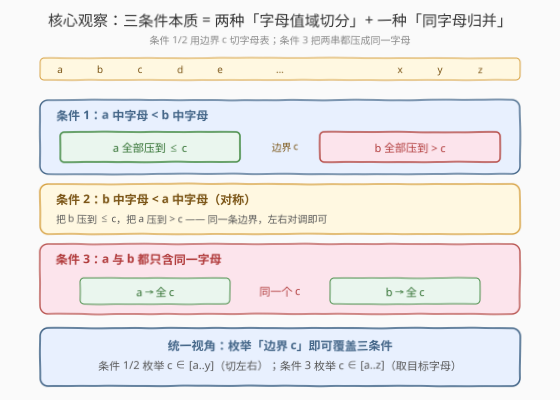
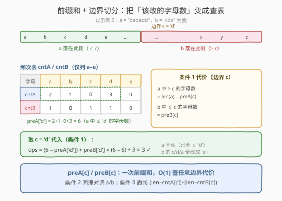
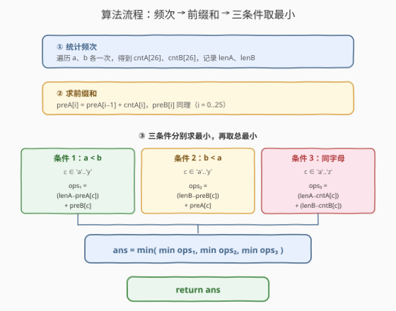
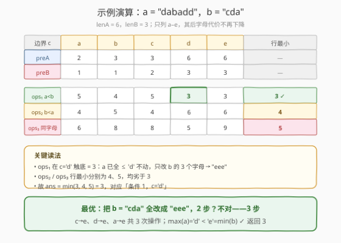

# 满足三条件之一需改变的最少字符数

- **题目名称**：满足三条件之一需改变的最少字符数
- **链接**：[1737. 满足三条件之一需改变的最少字符数](https://leetcode.cn/problems/change-minimum-characters-to-satisfy-one-of-three-conditions/)
- **难度**：中等
- **标签**：哈希表、字符串、前缀和、计数

## 1. 题目概述

给定两个**仅由小写字母**组成的字符串 `a` 和 `b`。一次操作可以把 `a` 或 `b` 中的**任意一个字符**改成任意小写字母。目标是让下列**三个条件之一**成立：

1. `a` 中**每个字母**都**严格小于** `b` 中**每个字母**（按字母表顺序）；
2. `b` 中每个字母都严格小于 `a` 中每个字母；
3. `a` 和 `b` 都**只由同一个字母**组成（`a` 内部全同、`b` 内部全同、且 `a` 与 `b` 用的是同一个字母）。

返回达成目标所需的**最少操作次数**。

**示例 1**：

```text
输入：a = "aba", b = "caa"
输出：2
解释：
- 条件 1：把 b 改成 "ccc"（2 次），a="aba" 最大字母 'b' < 'c' = b 最小字母 → 2 次；
- 条件 3：把 a 改成 "aaa"（1 次）、b 改成 "aaa"（1 次）→ 2 次。
最优为 2。
```

**示例 2**：

```text
输入：a = "dabadd", b = "cda"
输出：3
解释：最优是让条件 1 成立——把 b 全改成 "eee"（3 次操作），
      此时 a 最大字母 'd' < 'e' = b 最小字母。
```

**约束条件**：

- $1 \le \text{a.length},\ \text{b.length} \le 10^5$
- `a` 和 `b` 仅由小写字母组成

> 💡 **关键结构**：三个条件本质上只有两类——条件 1/2 是「把两串的字母值域**切分**到边界两侧」（一串全小、一串全大），条件 3 是「把两串**归并**到同一个字母」。两者都可以通过**枚举一个字母 c** 来覆盖所有情况，再用**频次 + 前缀和**在 $O(1)$ 内算出每个 c 的代价。

---

## 2. 解题思路

### 2.1 暴力思路：枚举每个字符的目标字母

最直觉的做法：对 `a`、`b` 里的每个字符独立决定改成什么。但每个字符有 26 种选择，两串长度可达 $10^5$，搜索空间 $26^{10^5}$，完全不可行。

退一步：注意到「达成条件」只取决于两串中字母的**最大/最小值**或**是否全同**，与具体位置无关。于是可以先**统计频次**：`cntA[26]`、`cntB[26]` 表示各字母在 `a`、`b` 中出现的次数。

即便如此，若对每个候选「目标字母组合」重新扫描频次数组，仍是 $O(26^2)$ 次 $O(26)$ 扫描——虽然能过，但忽略了更优的**前缀和**结构。

> ⚠️ **症结**：条件 1/2 的代价本质是「某串中 $> c$ 的字母数 + 另一串中 $\le c$ 的字母数」。这俩都是**值域上的区间计数**，而区间计数正是前缀和的招牌场景。不预处理前缀和，每次都要现算一遍区间和，浪费了重复计算。

### 2.2 核心观察：统一视角——枚举边界字母 c



**三个关键洞察**：

1. **条件 1/2 = 值域切分**。「`a` 中字母都严格小于 `b` 中字母」等价于 $\max(a) < \min(b)$。我们只要选定一个**边界字母** $c \in ['a', 'y']$，把 `a` 全部压到 $\le c$、`b` 全部压到 $> c$（即 $\ge c+1$），就有 $\max(a) \le c < c+1 \le \min(b)$，条件 1 成立。条件 2 只是把 `a`、`b` 对调。

2. **条件 3 = 同字母归并**。两串都用同一个字母 $c$，代价就是把 `a` 中非 $c$ 的字母全改成 $c$、`b` 中非 $c$ 的全改成 $c$。$c$ 枚举 $['a', 'z']$。

3. **代价 = 区间计数 → 前缀和**。对条件 1，给定边界 $c$：
   - `a` 中需要改的是「$> c$」的字母数 $= \text{len}(a) - \text{preA}[c]$；
   - `b` 中需要改的是「$\le c$」的字母数 $= \text{preB}[c]$；
   - 其中 $\text{preA}[c] = \sum_{i \le c} \text{cntA}[i]$ 即前缀和。

   预处理 `preA`、`preB` 后，**每个 $c$ 的代价 $O(1)$ 查表**，26 个 $c$ 共 $O(26)$。



> 💡 **为何边界 $c$ 只到 `'y'`？** 条件 1 要求 `b` 全部 $> c$，即 `b` 的字母落在 $[c+1, 'z']$。若 $c = 'z'$，则 $c+1$ 越界、`b` 无字母可选——而 `b` 非空（长度 $\ge 1$），故 $c$ 至多取到 `'y'`。条件 3 不切分，$c$ 可取满 `'a'..'z'`。

> ⚠️ **「严格小于」为何不需要额外处理？** 严格性体现在「`a` 侧 $\le c$、`b` 侧 $> c$」——两侧值域**不重叠**，天然严格。若写成「`a` 侧 $\le c$、`b` 侧 $\ge c$」则会重叠（同取 $c$ 时不严格），故 `b` 侧必须用「$> c$」即「$\ge c+1$」。

### 2.3 算法流程图



**步骤**：

1. **统计频次**：遍历 `a`、`b` 各一次，得 `cntA[26]`、`cntB[26]`，记录 `lenA`、`lenB`。
2. **求前缀和**：`preA[i] = preA[i-1] + cntA[i]`，`preB` 同理，$i = 0..25$。
3. **三条件分别取最小**：
   - 条件 1（$a < b$）：$c \in [0, 24]$，$\text{ops}_1(c) = (\text{lenA} - \text{preA}[c]) + \text{preB}[c]$，取最小；
   - 条件 2（$b < a$）：$c \in [0, 24]$，$\text{ops}_2(c) = (\text{lenB} - \text{preB}[c]) + \text{preA}[c]$，取最小；
   - 条件 3（同字母）：$c \in [0, 25]$，$\text{ops}_3(c) = (\text{lenA} - \text{cntA}[c]) + (\text{lenB} - \text{cntB}[c])$，取最小。
4. **返回** $\min(\min \text{ops}_1,\ \min \text{ops}_2,\ \min \text{ops}_3)$。

> 💡 **前缀和的复用**：条件 1 与条件 2 共用同一组 `preA`/`preB`，只是公式里两项对调。这是「同一数据结构多种查询」的典型体现——预处理一次，查询多次。

### 2.4 示例演算

以示例 2 `a = "dabadd"`、`b = "cda"` 为例。先建频次与前缀和（只列 `a`–`e`，其后字母前缀和不再变化）：



| $c$ | `'a'` | `'b'` | `'c'` | `'d'` | `'e'` |
|-----|-------|-------|-------|-------|-------|
| `preA[c]` | 2 | 3 | 3 | 6 | 6 |
| `preB[c]` | 1 | 1 | 2 | 3 | 3 |
| $\text{ops}_1$（$a<b$） | 5 | 4 | 5 | **3** | 3 |
| $\text{ops}_2$（$b<a$） | 4 | 5 | 4 | 6 | 6 |
| $\text{ops}_3$（同字母） | 6 | 8 | 8 | 5 | 9 |

**关键读法**：

- $\text{ops}_1$ 在 $c = $ `'d'` 触底 $= 3$：`a` 已全部 $\le$ `'d'`（`a` 中只有 `a`/`b`/`d`），无需改动；`b` 的 `c`/`d`/`a` 三个字母全改成 `'e'`+（共 3 次）。
- $\text{ops}_2$、$\text{ops}_3$ 的行最小分别为 4、5，均劣于 3。
- 故 $\text{ans} = \min(3, 4, 5) = 3$，对应「条件 1，$c = $ `'d'`」。

最终把 `b = "cda"` 全改成 `"eee"`：$c \to e$、$d \to e$、$a \to e$ 共 3 次操作，$\max(a) = $ `'d'` $<$ `'e'` $= \min(b)$ ✓，返回 `3`。

> 💡 **为何 $c \ge$ `'d'` 后 $\text{ops}_1$ 不再下降？** 当 $c$ 增大到已覆盖 `a` 的最大字母（此处 `'d'`）后，`lenA - preA[c]` 已为 0（`a` 无需改动），`preB[c]` 也已等于 `lenB`（`b` 全部 $\le c$，需全改），此后继续增大 $c$ 两项都不变，代价稳定在 `lenB`。故「最佳边界」往往落在某串的最大字母附近。

---

## 3. 参考代码

### C++

```cpp
class Solution {
public:
    int minCharacters(string a, string b) {
        int cntA[26] = {0}, cntB[26] = {0};
        int lenA = a.size(), lenB = b.size();
        for (char ch : a) ++cntA[ch - 'a'];
        for (char ch : b) ++cntB[ch - 'a'];

        int preA[27] = {0}, preB[27] = {0};
        for (int i = 0; i < 26; ++i) {
            preA[i + 1] = preA[i] + cntA[i];
            preB[i + 1] = preB[i] + cntB[i];
        }

        int ans = INT_MAX;
        for (int c = 0; c < 26; ++c) {
            ans = min(ans, (lenA - cntA[c]) + (lenB - cntB[c]));
        }
        for (int c = 0; c < 25; ++c) {
            int ops1 = (lenA - preA[c + 1]) + preB[c + 1];
            int ops2 = (lenB - preB[c + 1]) + preA[c + 1];
            ans = min(ans, min(ops1, ops2));
        }
        return ans;
    }
};
```

### Python

```python
class Solution:
    def minCharacters(self, a: str, b: str) -> int:
        cntA = [0] * 26
        cntB = [0] * 26
        for ch in a: cntA[ord(ch) - 97] += 1
        for ch in b: cntB[ord(ch) - 97] += 1
        lenA, lenB = len(a), len(b)

        preA = [0] * 27
        preB = [0] * 27
        for i in range(26):
            preA[i + 1] = preA[i] + cntA[i]
            preB[i + 1] = preB[i] + cntB[i]

        ans = min((lenA - cntA[c]) + (lenB - cntB[c]) for c in range(26))
        for c in range(25):
            ops1 = (lenA - preA[c + 1]) + preB[c + 1]
            ops2 = (lenB - preB[c + 1]) + preA[c + 1]
            ans = min(ans, ops1, ops2)
        return ans
```

> 💡 **前缀和数组的「开闭」约定**：代码里 `preA[i+1]` 存的是「字母 $\le i$ 的总数」，`preA[0] = 0`。这样 `preA[c+1]` 对应公式中的 $\text{preA}[c]$（字母 $\le c$），`lenA - preA[c+1]` 对应「$> c$」的部分，避免下标偏移出错。也可以直接让 `preA[i]` 表示「$\le i$」并原地累加，二者等价，选一种坚持即可。

> ⚠️ **循环上界**：条件 1/2 的 `c` 只到 `24`（即 `'y'`），对应代码 `range(25)` / `c < 25`。若误写到 `range(26)`，会把 $c = $ `'z'` 也算进条件 1——此时 `b` 侧无字母可放（`> 'z'` 为空集），但公式仍给出 `lenA + lenB` 量级的错误代价，不会崩却会偏大，故容易被忽略。务必确认上界。

---

## 4. 复杂度分析

| 维度 | 复杂度 | 说明 |
|------|--------|------|
| 时间 | $O(|a| + |b| + 26)$ | 遍历两串统计频次各 $O(|a|)$、$O(|b|)$；前缀和 $O(26)$；枚举三条件各 $O(26)$。$|a|, |b| \le 10^5$ 时约 $2 \times 10^5$ 次操作 |
| 空间 | $O(26) = O(1)$ | 仅 `cntA`、`cntB`、`preA`、`preB` 四个长度 26/27 的定长数组，与输入规模无关 |

> 💡 **为何时间不是 $O(26^2)$？** 三条件的代价都是「一个边界 $c$ → 一次 $O(1)$ 查表」，并非两两配对。前缀和把「区间计数」从 $O(26)$ 降到 $O(1)$，故总枚举量线性于字母表大小 $26$。若字母表换成更大的值域（如 Unicode），则需用排序 + 二分或哈希前缀，复杂度变为 $O(|a| + |b| + |\Sigma|\log|\Sigma|)$。

---

## 5. 扩展：前缀和是「值域计数」的通用武器

### 5.1 从「位置前缀和」到「值域前缀和」

经典前缀和是**位置维度**的：`pre[i]` 是前 $i$ 个元素之和，用来 $O(1)$ 查区间和。本题用的是**值域维度**的前缀和：`preA[c]` 是「值 $\le c$ 的元素个数」，用来 $O(1)$ 查「值落在某区间的元素数」。

两者的结构完全同构——都是「累加 + 区间差」：

- 位置前缀和：区间 $[l, r]$ 元素和 $= \text{pre}[r] - \text{pre}[l-1]$；
- 值域前缀和：值 $\in (c, +\infty)$ 的元素数 $= \text{len} - \text{pre}[c]$，值 $\in [0, c]$ 的元素数 $= \text{pre}[c]$。

> 💡 **何时用值域前缀和？** 当查询是「按值的大小关系」而非「按位置」时。本题的「$> c$」「$\le c$」就是典型值域查询。另见 [974. 和可被 K 整除的子数组](../0901-1000/974_和可被K整除的子数组.md) 的「同余前缀和」——把值域换成余数域，思路一致。

### 5.2 为何「枚举边界」是最优策略

条件 1 要求 $\max(a) < \min(b)$。最优解中 `a` 改完后必有某个最大字母 $c = \max(a)$（`a` 非空保证存在），此时 `b` 的所有字母都 $\ge c+1$。也就是说**任何可行解都对应某个边界 $c$**——枚举 $c$ 不漏掉任何最优。而每个 $c$ 的最小代价由前缀和 $O(1)$ 给出，故枚举 26 个 $c$ 必然取到全局最优。

### 5.3 若允许「不改成同一字母」

题目允许任意改成小写字母，故条件 3 中「`a` 全 $c$、`b` 全 $c$」是最省的——只需把非 $c$ 的改掉，已是 $c$ 的零代价。若题目额外限制「每个字符只能改成它的邻居字母」之类，则条件 3 退化为更复杂的逐字符最小编辑，需另算。本题无此限制，直接用频次差即可。

---

## 6. 面试要点

**Q1：三个条件为什么能统一成「枚举一个字母 c」？**
> 条件 1/2 的本质是值域切分——存在一个边界 $c$，使一串字母 $\le c$、另一串 $> c$；枚举 $c \in ['a','y']$ 覆盖所有切分。条件 3 的本质是同字母归并——枚举目标字母 $c \in ['a','z']$ 覆盖所有归并。两者都是「单字母参数化」，故可在一层循环里并行处理。

**Q2：为什么条件 1/2 的边界 c 只到 'y' 而不是 'z'？**
> 条件 1 要求 `b` 全部 $> c$。若 $c = $ `'z'`，则 `b` 的字母需 $> $ `'z'`，无字母可选，而 `b` 非空（长度 $\ge 1$），矛盾。故 $c$ 至多 `'y'`，对应 `b` 侧至少有 `'z'` 可用。条件 3 不切分值域，$c$ 可取满 26 个。

**Q3：「严格小于」在公式里如何体现？为什么不会写成非严格？**
> 「`a` 侧 $\le c$、`b` 侧 $> c$」——两侧值域不重叠，天然严格。若误把 `b` 侧写成「$\ge c$」，则 $c$ 可同时出现在两串，不严格。代码里 `b` 侧用「$> c$」即「$\ge c+1$」，靠 `preA[c+1]`（含 $c$）与 `lenA - preA[c+1]`（不含 $c$）的差天然分开。

**Q4：前缀和在这里省了多少？不用它会怎样？**
> 不用前缀和，每个 $c$ 算「$> c$ 的字母数」需 $O(26)$ 扫一遍 `cnt` 数组，26 个 $c$ 共 $O(26^2) = 676$ 次——常数级，本题也能过。但前缀和把每次查询降到 $O(1)$，总计 $O(26)$，且在字母表更大时（如值域扩展）优势立刻显现。它是「值域区间计数」的通用武器。

**Q5：条件 3 的公式 `(lenA - cntA[c]) + (lenB - cntB[c])` 是什么意思？**
> 把 `a` 全改成 $c$ 需改 `lenA - cntA[c]` 个（非 $c$ 的个数），`b` 同理。两者相加即两串都归并为 $c$ 的总代价。枚举 26 个 $c$ 取最小。注意条件 3 不需要前缀和——它只关心「等于 $c$」的频次，是单点查询而非区间查询。

> 💡 **一句话总结**：三条件统一为「枚举边界字母 $c$」→ 频次 + 值域前缀和把每个 $c$ 的代价降到 $O(1)$ → 三组最小再取最小，$O(|a|+|b|+26)$ 时间、$O(1)$ 空间。

---

## 7. 同类练习题

- [242. 有效的字母异位词](https://leetcode.cn/problems/valid-anagram/)：同为「字符串频次表」入门，但只比较两串频次是否相等，不涉及值域切分；对照体会「频次计数」作为基础工具的通用性
- [974. 和可被 K 整除的子数组](https://leetcode.cn/problems/subarray-sums-divisible-by-k/)（[题解](../0901-1000/974_和可被K整除的子数组.md)）：前缀和的「值域/余数域」变体——把位置前缀和换成同余前缀和做区间计数，与本题的「值域前缀和」同为前缀和家族的不同维度应用
- [825. 适龄的朋友](https://leetcode.cn/problems/friends-of-appropriate-ages/)：按年龄值域分组 + 前缀和统计合法范围，与本题「按字母值域切分 + 前缀和查区间计数」同构，对照理解值域前缀和在「范围约束计数」中的复用
- [1701. 平均等待时间](https://leetcode.cn/problems/average-waiting-time/)（[题解](./1701_平均等待时间.md)）：同区间题号邻居，按 arrival_time 模拟等待；与本题同为「数组/字符串 + 一次扫描统计」族，但聚焦前缀累积而非值域切分，对照两种累积方向
- [1941. 检查是否所有字符出现相等次数](https://leetcode.cn/problems/check-if-all-characters-have-equal-number-of-occurrences/)：小写字母频次表判定，与本题共享「26 桶频次」基础结构，但只判相等不做切分；作为频次计数的更简单热身题
