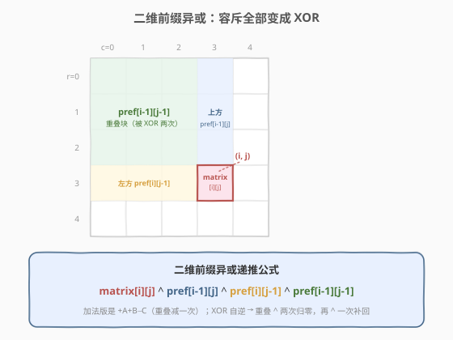
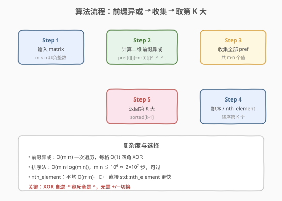
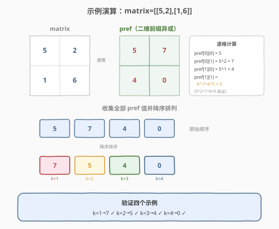

# 找出第 K 大的异或坐标值

- **题目名称**：找出第 K 大的异或坐标值
- **链接**：[1738. 找出第 K 大的异或坐标值](https://leetcode.cn/problems/find-kth-largest-xor-coordinate-value/)
- **难度**：中等
- **标签**：位运算、数组、前缀异或、排序

## 1. 题目概述

给定一个 `m × n` 的**非负整数**矩阵 `matrix` 和一个整数 `k`。坐标 `(a, b)` 的**目标值**定义为：对所有满足 `0 <= i <= a` 且 `0 <= j <= b` 的元素 `matrix[i][j]` 执行异或（$\oplus$）运算的结果。

要求返回所有坐标中**第 $k$ 大**的目标值（$k$ 从 1 开始计数）。

**示例 1**：

```text
输入：matrix = [[5,2],[1,6]], k = 1
输出：7
解释：坐标 (0,1) 的目标值 = 5 ⊕ 2 = 7，为最大值。
```

**示例 2**：

```text
输入：matrix = [[5,2],[1,6]], k = 2
输出：5
解释：坐标 (0,0) 的目标值 = 5，为第 2 大。
```

**示例 3**：

```text
输入：matrix = [[5,2],[1,6]], k = 3
输出：4
解释：坐标 (1,0) 的目标值 = 5 ⊕ 1 = 4，为第 3 大。
```

**示例 4**：

```text
输入：matrix = [[5,2],[1,6]], k = 4
输出：0
解释：坐标 (1,1) 的目标值 = 5 ⊕ 2 ⊕ 1 ⊕ 6 = 0，为第 4 大。
```

**约束条件**：

- `m == matrix.length`，`n == matrix[i].length`
- $1 \le m, n \le 1000$
- $0 \le \text{matrix}[i][j] \le 10^6$
- $1 \le k \le m \cdot n$

> 💡 **关键观察**：坐标 $(a, b)$ 的目标值 = 子矩阵 $(0,0) \to (a,b)$ 的全体元素异或——这正是**二维前缀异或**的定义。与 [304. 二维区域和检索](../0301-0400/304_二维区域和检索 - 数组不可变.md) 的二维前缀和同构，只是把「加」换成「异或」。而异或有一个绝佳性质——**自逆性**（$x \oplus x = 0$），使得容斥公式里所有的 $+/-$ 全部统一为 $\oplus$，无需区分加减。

---

## 2. 解题思路

### 2.1 暴力思路

对每个坐标 $(a, b)$，双重循环遍历 $(0..a) \times (0..b)$ 的所有元素逐个异或。单点 $O(a \cdot b)$，全部 $m \cdot n$ 个坐标的总代价为 $O(m^2 \cdot n^2)$，当 $m = n = 1000$ 时约 $10^{12}$，必然超时。

> ⚠️ **症结**：每个坐标都从头算异或，大量重复计算。坐标 $(a, b)$ 与 $(a-1, b)$、$(a, b-1)$ 的目标值高度重叠，应利用递推复用。

### 2.2 核心观察：二维前缀异或 + 容斥全 XOR



定义 `pref[i][j]` 为子矩阵 $(0,0) \to (i,j)$ 全体元素的异或。与二维前缀和类似，利用容斥原理递推，但**关键区别**在于：异或的自逆性（$x \oplus x = 0$）使得重叠区域「被算两次自动归零」，因此容斥公式里**不需要减法**，全部统一为异或。

**构造递推**：

$$
\text{pref}[i][j] = \text{matrix}[i][j] \oplus \text{pref}[i-1][j] \oplus \text{pref}[i][j-1] \oplus \text{pref}[i-1][j-1]
$$

**直观理解**：

- `pref[i-1][j]`（上方块）覆盖了行 $0..i-1$、列 $0..j$。
- `pref[i][j-1]`（左方块）覆盖了行 $0..i$、列 $0..j-1$。
- 两者都包含左上角重叠块 `pref[i-1][j-1]`（行 $0..i-1$、列 $0..j-1$）。

| 运算 | 重叠块处理 | 原因 |
|------|-----------|------|
| **求和** | 减去一次（$-C$） | 加了两次，需减回一次 |
| **异或** | 再 XOR 一次（$\oplus C$） | XOR 两次 $= 0$，需补回一次 |

> 💡 **为什么异或版公式全是 $\oplus$？** 对求和，$A + B$ 把重叠块 $C$ 算了两次，需 $-C$ 修正。对异或，$A \oplus B$ 中 $C$ 被异或了两次 $\Rightarrow C \oplus C = 0$，相当于 $C$ 消失了！所以要 $\oplus C$ 把它「补回来」。本质上：异或的「减」就是「再异或一次」，因为 $-x \equiv x \pmod{\text{XOR}}$。

> ⚠️ **边界处理**：为避免 $i=0$ 或 $j=0$ 时 `pref[i-1][j]` 越界，给 `pref` 多开一行一列，令 `pref[0][*] = pref[*][0] = 0`（$0$ 是异或的单位元）。这样递推公式统一适用，无需特判首行首列。

### 2.3 算法流程图



**步骤**：

1. **初始化** `pref` 为 $(m+1) \times (n+1)$ 的二维数组，首行首列为 $0$。
2. **递推填充**：双重遍历 `matrix`，对每个 `(i, j)` 应用四角 XOR 公式填入 `pref[i+1][j+1]`。
3. **收集**：把 `pref[1..m][1..n]` 的所有值（共 $m \cdot n$ 个）放入一维数组 `vals`。
4. **取第 K 大**：将 `vals` 降序排序，返回 `vals[k-1]`；或用 `nth_element` 平均 $O(m \cdot n)$。

### 2.4 示例演算

以 `matrix = [[5,2],[1,6]]` 为例：



**前缀异或表计算**：

| 坐标 | 计算 | 结果 |
|------|------|------|
| `(0,0)` | `5` | `5` |
| `(0,1)` | `5 ⊕ 2` | `7` |
| `(1,0)` | `5 ⊕ 1` | `4` |
| `(1,1)` | `6 ⊕ pref[0][1] ⊕ pref[1][0] ⊕ pref[0][0] = 6 ⊕ 7 ⊕ 4 ⊕ 5` | `0` |

> 💡 **验证 `(1,1)`**：直接对子矩阵全体元素异或 $5 \oplus 2 \oplus 1 \oplus 6 = (5 \oplus 2) \oplus (1 \oplus 6) = 7 \oplus 7 = 0$，与递推结果一致。这验证了四角 XOR 公式的正确性——重叠块恰好被补回。

**收集并降序排列**：`[5, 7, 4, 0]` → 排序后 `[7, 5, 4, 0]`。

| $k$ | 第 $k$ 大 | 对应坐标 |
|-----|----------|----------|
| 1 | 7 | `(0,1)` |
| 2 | 5 | `(0,0)` |
| 3 | 4 | `(1,0)` |
| 4 | 0 | `(1,1)` |

四个示例全部验证通过 ✓

---

## 3. 参考代码

### C++

```cpp
class Solution {
public:
    int kthLargestValue(vector<vector<int>>& matrix, int k) {
        int m = matrix.size(), n = matrix[0].size();
        vector<vector<int>> pref(m + 1, vector<int>(n + 1, 0));

        vector<int> vals;
        vals.reserve(m * n);

        for (int i = 0; i < m; ++i) {
            for (int j = 0; j < n; ++j) {
                pref[i + 1][j + 1] = matrix[i][j]
                                   ^ pref[i][j + 1]
                                   ^ pref[i + 1][j]
                                   ^ pref[i][j];
                vals.push_back(pref[i + 1][j + 1]);
            }
        }

        nth_element(vals.begin(), vals.begin() + k - 1, vals.end(), greater<int>());
        return vals[k - 1];
    }
};
```

### Python

```python
class Solution:
    def kthLargestValue(self, matrix: List[List[int]], k: int) -> int:
        m, n = len(matrix), len(matrix[0])
        pref = [[0] * (n + 1) for _ in range(m + 1)]

        vals = []
        for i in range(m):
            for j in range(n):
                pref[i + 1][j + 1] = (
                    matrix[i][j]
                    ^ pref[i][j + 1]
                    ^ pref[i + 1][j]
                    ^ pref[i][j]
                )
                vals.append(pref[i + 1][j + 1])

        vals.sort(reverse=True)
        return vals[k - 1]
```

> 💡 **实现细节**：① `pref` 多开一行一列，`pref[0][*] = pref[*][0] = 0` 是异或单位元，使首行首列无需特判。② C++ 用 `std::nth_element` 配合 `greater<int>()` 将第 $k$ 大元素放到 `vals[k-1]` 位置，平均 $O(m \cdot n)$，比完整排序更快。③ Python 无内置 `nth_element`，用 `sort(reverse=True)` 取 `vals[k-1]`，$O(m \cdot n \log(m \cdot n))$ 在 $10^6$ 量级可过。

> ⚠️ **空间优化**：若不需要保留整张 `pref` 表，可只用一维滚动数组（按行滚动），将空间从 $O(m \cdot n)$ 降到 $O(n)$。但本题 $m \cdot n \le 10^6$，二维 `pref` 约 4MB，完全可接受，无需滚动。

---

## 4. 复杂度分析

| 维度 | 复杂度 | 说明 |
|------|--------|------|
| 时间 | $O(m \cdot n + m \cdot n \log(m \cdot n))$（排序）或 $O(m \cdot n)$（nth_element） | 前缀异或递推 $O(m \cdot n)$；排序 $O(m \cdot n \log(m \cdot n))$，nth_element 平均 $O(m \cdot n)$ |
| 空间 | $O(m \cdot n)$ | `pref` 表 $(m+1) \times (n+1)$；收集数组 `vals` 共 $m \cdot n$ 个值 |

> 💡 **规模估算**：$m = n = 1000$ 时，$m \cdot n = 10^6$。排序约 $10^6 \times 20 = 2 \times 10^7$ 步，远在时限内。`nth_element` 更快但常数略大，两者均可通过。Python 的 `sort` 基于 Timsort，对部分有序数据有优化，实测也足够快。

---

## 5. 扩展：前缀异或家族与 XOR 的代数性质

### 5.1 异或的「自逆」让容斥更简洁

前缀和家族的核心是**容斥原理**——把一个区域拆成若干子区域的并集，处理重叠部分。对不同的二元运算，重叠的处理方式不同：

| 运算 | 单位元 | 逆运算 | 重叠处理 | 公式形态 |
|------|--------|--------|----------|----------|
| 加法（$+$） | $0$ | 减法（$-$） | 减去一次 | $a + b - c$ |
| 异或（$\oplus$） | $0$ | 异或（$\oplus$） | 再 XOR 一次 | $a \oplus b \oplus c$ |
| 乘法（$\times$） | $1$ | 除法（$\div$） | 除以一次 | $a \times b \div c$ |

> 💡 异或的「逆运算就是自身」这一性质，使得**前缀异或的容斥公式里没有减号**，所有运算统一为 $\oplus$，实现更简洁、不易写错。这也是为什么一维前缀异或的查询只需 `pref[r] ^ pref[l-1]`（两个值异或即得区间异或），而一维前缀和需要 `pref[r] - pref[l-1]`。

### 5.2 一维 → 二维的推广

| 维度 | 题目 | 递推公式 |
|------|------|----------|
| 一维前缀和 | [303. 区域和检索](https://leetcode.cn/problems/range-sum-query-immutable/) | `pref[i] = pref[i-1] + a[i]` |
| 一维前缀异或 | [1310. 子数组异或查询](https://leetcode.cn/problems/xor-queries-of-a-subarray/) | `pref[i] = pref[i-1] ^ a[i]` |
| 二维前缀和 | [304. 二维区域和检索](../0301-0400/304_二维区域和检索 - 数组不可变.md) | `pref[i][j] = m[i][j] + pref[i-1][j] + pref[i][j-1] - pref[i-1][j-1]` |
| **二维前缀异或** | **本题 1738** | `pref[i][j] = m[i][j] ^ pref[i-1][j] ^ pref[i][j-1] ^ pref[i-1][j-1]` |

### 5.3 如果要求第 K 小而非第 K 大？

只需把排序改为升序（`sort` 不加 `reverse`，`nth_element` 不加 `greater<int>()`），返回 `vals[k-1]` 即第 $k$ 小。或等价地返回 `vals[m*n - k]`（降序中的倒数第 $k$ 个）。前缀异或的计算完全不变。

---

## 6. 面试要点

**Q1：为什么容斥公式里全是 XOR，没有减法？**

> 异或具有自逆性：$x \oplus x = 0$。当上方块 `pref[i-1][j]` 和左方块 `pref[i][j-1]` 都包含重叠块 `pref[i-1][j-1]` 时，异或两次等于 $0$（消失了），所以要再 $\oplus$ 一次把它「补回」。而加法版中加两次需要减一次修正。本质上：异或的「减」=「再异或」，所以公式统一为 $\oplus$。

**Q2：为什么 `pref` 要多开一行一列？**

> 让 `pref[0][*] = pref[*][0] = 0` 成为异或的单位元（$x \oplus 0 = x$）。这样首行（$i=0$）和首列（$j=0$）的递推无需特判 `pref[-1][*]` 越界，代码统一、简洁。与 [304](../0301-0400/304_二维区域和检索 - 数组不可变.md) 二维前缀和多开一行一列的技巧完全一致。

**Q3：排序和 `nth_element` 该选哪个？**

> $m \cdot n \le 10^6$ 时两者都能过。`nth_element` 平均 $O(m \cdot n)$ 更快，但不保证完全排序，只把第 $k$ 大元素放到正确位置。C++ 推荐用 `nth_element`；Python 没有内置等价物，用 `sort` 或 `heapq.nlargest`。面试中先用 `sort` 保证正确性，再提 `nth_element` 优化即可。

**Q4：能否用一维滚动数组优化空间？**

> 可以。`pref[i][j]` 只依赖本行 `pref[i][j-1]` 和上一行 `pref[i-1][j]`、`pref[i-1][j-1]`。用一行数组 `row` 按列递推，同时记录左上角旧值 `prev = row[j-1]`（更新前的值），可将空间降到 $O(n)$。但本题 $10^6$ 的二维数组约 4MB，不优化也能过，面试时提及即可。

**Q5：本题与 1310（一维异或查询）的关系？**

> [1310. 子数组异或查询](https://leetcode.cn/problems/xor-queries-of-a-subarray/) 是一维版前缀异或：`pref[i] = pref[i-1] ^ a[i]`，区间异或 = `pref[r] ^ pref[l-1]`。本题把一维升到二维，递推从「两角异或」变成「四角异或」，但核心思想（前缀 + 容斥 + XOR 自逆）完全一致。先掌握 1310 再看本题，思路是一脉相承的升维。

> 💡 **一句话总结**：坐标的目标值 = 二维前缀异或，容斥公式因 XOR 自逆全部统一为 $\oplus$（无减法），递推 $O(m \cdot n)$ 后收集排序取第 $k$ 大。

---

## 7. 同类练习题

- [304. 二维区域和检索 - 数组不可变](https://leetcode.cn/problems/range-sum-query-2d-immutable/)（[题解](../0301-0400/304_二维区域和检索 - 数组不可变.md)）：二维前缀和的模板题，本题的加法版兄弟——对比学习容斥中 $+/-$ 与 $\oplus$ 的区别
- [1310. 子数组异或查询](https://leetcode.cn/problems/xor-queries-of-a-subarray/)：一维前缀异或，本题的降维基础版，先掌握 `pref[r] ^ pref[l-1]` 再升到二维四角
- [1737. 改变一个最小偏差的数](https://leetcode.cn/problems/change-minimum-distance-to-target-value/)：异或差值最小化，另一种异或应用角度
- [215. 数组中的第K个最大元素](https://leetcode.cn/problems/kth-largest-element-in-an-array/)：纯 Top-K 模板，本题「收集后取第 K 大」步骤的母题，对比 `sort` vs `nth_element` vs 堆
- [1314. 矩阵区域和](https://leetcode.cn/problems/matrix-block-sum/)：二维前缀和 + 邻域扩展，进一步熟悉四角容斥的查询公式
