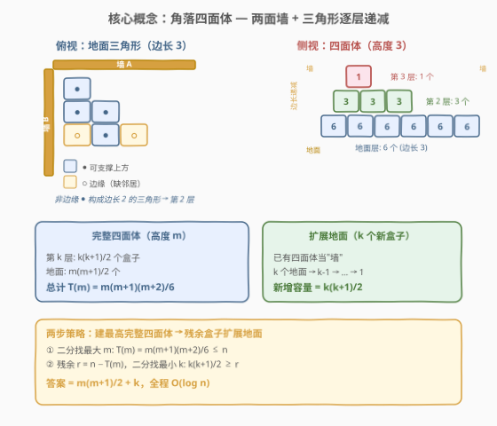
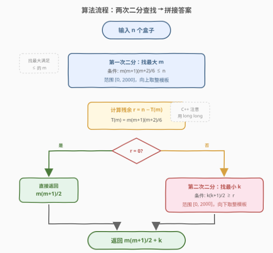
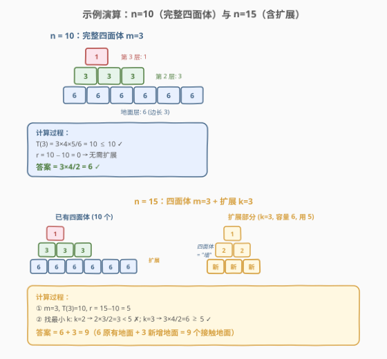

# LeetCode 放置盒子 题解

## 1. 题目概述

- **标题 / 题号**：放置盒子（#1739，hard）
- **链接**：https://leetcode.cn/problems/building-boxes/
- **难度**：困难
- **标签**：数学、二分查找

**题意**：有一个立方体房间，其长度、宽度和高度都等于 `n` 个单位。请你在房间里放置 `n` 个盒子，每个盒子都是一个单位边长的立方体。放置规则如下：

- 你可以把盒子放在地板上的任何地方。
- 如果盒子 `x` 需要放置在盒子 `y` 的顶部，那么盒子 `y` 竖直的四个侧面都 **必须** 与另一个盒子或墙相邻。

给你一个整数 `n`，返回接触地面的盒子的 **最少** 可能数量。

**示例 1**：

```text
输入：n = 3
输出：3
解释：3 个盒子放在房间一角，全部贴地。
```

**示例 2**：

```text
输入：n = 4
输出：3
解释：3 个盒子贴地组成三角形，第 4 个盒子放在角顶上方。
```

**示例 3**：

```text
输入：n = 10
输出：6
解释：6 个盒子贴地组成三角形（边长 3），上方堆叠 4 个盒子，总计 10 个。
```

**约束**：

- $1 \le n \le 10^9$

> 💡 **关键观察**：$n$ 高达 $10^9$，排除模拟。核心在于发现**最优堆叠结构是角落里的四面体（三角金字塔）**——利用两面墙作为"免费邻居"，使每个地面盒子只需 2 个盒子邻居即可支撑上方盒子，从而最大化空间利用率。

## 2. 解题思路

### 2.1 暴力思路：逐个放置模拟

最直观的做法是模拟放置过程：每次在能放的位置中选择最优位置放置一个盒子。但 $n \le 10^9$ 使得任何 $O(n)$ 的方法都不可行。必须找到数学规律，用 $O(1)$ 或 $O(\log n)$ 的公式直接计算。

### 2.2 核心观察：角落四面体



**为什么选角落？** 一个盒子要支撑上方盒子，其 4 个竖直侧面都必须被覆盖。如果把盒子放在角落，**两面墙自动覆盖 2 个侧面**，只需再安排 2 个盒子邻居即可。这让角落成为最节省地面的位置。

**四面体结构**：在角落放置三角形地面层，每一层是比下层边长少 1 的三角形。具体地，高度为 $m$ 的完整四面体各层从底到顶为：

| 层（从底起） | 三角形边长 | 该层盒子数 | 累计盒子数 |
|-------------|-----------|-----------|-----------|
| 第 1 层（地面） | $m$ | $\frac{m(m+1)}{2}$ | $\frac{m(m+1)}{2}$ |
| 第 2 层 | $m-1$ | $\frac{(m-1)m}{2}$ | $\frac{m(m+1)}{2} + \frac{(m-1)m}{2}$ |
| $\vdots$ | $\vdots$ | $\vdots$ | $\vdots$ |
| 第 $m$ 层（顶部） | $1$ | $1$ | $T(m)$ |

**完整四面体的总盒子数**：

$$
T(m) = \sum_{k=1}^{m} \frac{k(k+1)}{2} = \frac{m(m+1)(m+2)}{6}
$$

> 💡 **推导**：$\sum_{k=1}^{m} \frac{k(k+1)}{2} = \frac{1}{2}\sum_{k=1}^{m}(k^2+k) = \frac{1}{2}\left(\frac{m(m+1)(2m+1)}{6} + \frac{m(m+1)}{2}\right) = \frac{m(m+1)}{2} \cdot \frac{(2m+1)+3}{6} = \frac{m(m+1)(m+2)}{6}$

**为什么边长递减 1？** 地面三角形中，只有**非边缘**的盒子（即 4 个侧面都被覆盖的盒子）才能支撑上方盒子。边长为 $s$ 的三角形中，边缘盒子（对角线上）无法支撑，非边缘盒子恰好构成边长 $s-1$ 的三角形。因此每一层的边长恰好比下层少 1，形成四面体。

### 2.3 残余盒子：扩展地面三角形

给定 $n$，先建最大的完整四面体（高度 $m$，用掉 $T(m)$ 个盒子），还剩 $r = n - T(m)$ 个盒子。这些盒子用来**扩展地面层**。

**扩展规律**：扩展地面时，每新增 $k$ 个地面盒子（在地面三角形外侧新增一行），这些盒子连同上方可堆叠的盒子，恰好构成一个**边长为 $k$ 的小四面体**，总共能放 $\frac{k(k+1)}{2}$ 个盒子。

> 💡 **为什么？** 扩展部分的一侧是已有四面体（充当"墙"），另一侧是房间墙。新增 $k$ 个地面盒子排成一行，上方可堆 $k-1$ 个，再上方 $k-2$ 个……直到顶部 1 个，总计 $k + (k-1) + \cdots + 1 = \frac{k(k+1)}{2}$。这与完整四面体的逐层递减结构完全一致，只是规模更小。

因此，残余 $r$ 个盒子需要找到**最小的 $k$** 满足：

$$
\frac{k(k+1)}{2} \ge r
$$

最终答案：

$$
\boxed{\,\text{ans} = \frac{m(m+1)}{2} + k\,,\quad T(m) \le n < T(m+1),\quad r = n - T(m),\quad \frac{k(k+1)}{2} \ge r\,}
$$

### 2.4 算法流程图



**步骤**：

1. **第一次二分**：找最大 $m$ 使得 $T(m) = \frac{m(m+1)(m+2)}{6} \le n$。
2. **计算残余**：$r = n - T(m)$。若 $r = 0$，直接返回 $\frac{m(m+1)}{2}$。
3. **第二次二分**：找最小 $k$ 使得 $\frac{k(k+1)}{2} \ge r$。
4. **返回** $\frac{m(m+1)}{2} + k$。

> ⚠️ **上界估计**：$n \le 10^9$ 时 $m \le 1817$（因为 $T(1817) \approx 10^9$），$k \le 1817$。二分上界取 $2000$ 即可。C++ 中 $m(m+1)(m+2)$ 最大约 $6 \times 10^9$，超出 `int` 范围，需用 `long long`。

### 2.5 示例演算

以 $n = 10$ 和 $n = 15$ 为例：



**示例 $n = 10$**：

- $T(3) = \frac{3 \times 4 \times 5}{6} = 10 \le 10$，$T(4) = 20 > 10$。故 $m = 3$，$r = 0$。
- $r = 0$，无需扩展。答案 $= \frac{3 \times 4}{2} = 6$。✓

**示例 $n = 15$**：

- $m = 3$，$T(3) = 10$，$r = 15 - 10 = 5$。
- 找最小 $k$：$k=2$ 时 $\frac{2 \times 3}{2} = 3 < 5$；$k=3$ 时 $\frac{3 \times 4}{2} = 6 \ge 5$。故 $k = 3$。
- 答案 $= 6 + 3 = 9$。
- 验证：6 个原有地面 + 3 个新增地面 = 9 个地面盒子。新增 3 个地面盒子上方可放 $3 + 2 + 1 = 6$ 个，但只需 5 个。总计 $10 + 5 = 15$。✓

> 💡 **验算三个示例**：$n=3 \Rightarrow m=1, r=2, k=2$：$1 + 2 = 3$ ✓；$n=4 \Rightarrow m=2, r=0$：$\frac{2\times3}{2} = 3$ ✓；$n=10 \Rightarrow m=3, r=0$：$6$ ✓。

## 3. 参考代码

### Python

```python
class Solution:
    def minimumBoxes(self, n: int) -> int:
        # 第一次二分：找最大 m 使得 m(m+1)(m+2)/6 <= n
        lo, hi = 0, 2000
        while lo < hi:
            mid = (lo + hi + 1) // 2
            if mid * (mid + 1) * (mid + 2) // 6 <= n:
                lo = mid
            else:
                hi = mid - 1
        m = lo
        used = m * (m + 1) * (m + 2) // 6
        r = n - used
        if r == 0:
            return m * (m + 1) // 2

        # 第二次二分：找最小 k 使得 k(k+1)/2 >= r
        lo, hi = 0, 2000
        while lo < hi:
            mid = (lo + hi) // 2
            if mid * (mid + 1) // 2 >= r:
                hi = mid
            else:
                lo = mid + 1
        return m * (m + 1) // 2 + lo
```

### C++

```cpp
class Solution {
  public:
    int minimumBoxes(int n) {
        // 第一次二分：找最大 m 使得 m(m+1)(m+2)/6 <= n
        int lo = 0, hi = 2000;
        while (lo < hi) {
            int mid = (lo + hi + 1) / 2;
            if ((long long)mid * (mid + 1) * (mid + 2) / 6 <= n)
                lo = mid;
            else
                hi = mid - 1;
        }
        int m = lo;
        int r = n - (int)((long long)m * (m + 1) * (m + 2) / 6);
        if (r == 0) return m * (m + 1) / 2;

        // 第二次二分：找最小 k 使得 k(k+1)/2 >= r
        lo = 0, hi = 2000;
        while (lo < hi) {
            int mid = (lo + hi) / 2;
            if ((long long)mid * (mid + 1) / 2 >= r)
                hi = mid;
            else
                lo = mid + 1;
        }
        return m * (m + 1) / 2 + lo;
    }
};
```

> ⚠️ **实现细节**：① 第一次二分用 `mid = (lo + hi + 1) // 2`（向上取整）配合 `lo = mid`，找**最大**满足条件的值；第二次二分用 `mid = (lo + hi) // 2`（向下取整）配合 `hi = mid`，找**最小**满足条件的值。② C++ 中 `mid * (mid + 1) * (mid + 2)` 在 $m \approx 1817$ 时约 $6 \times 10^9$，超出 `int` 上限 $\approx 2.1 \times 10^9$，必须强转 `long long`。③ $r = 0$ 时直接返回，避免第二次二分找到 $k = 0$ 的冗余计算。④ 二分上界 $2000$ 足够：$T(2000) = 2000 \times 2001 \times 2002 / 6 \approx 1.3 \times 10^9 > 10^9$。

## 4. 复杂度分析

| 维度 | 复杂度 | 说明 |
|------|--------|------|
| 时间复杂度 | $O(\log n)$ | 两次二分查找，每次约 $\log_2(2000) \approx 11$ 轮 |
| 空间复杂度 | $O(1)$ | 只用常数个变量 |

> 💡 两次二分都是对 $[0, 2000]$ 区间搜索，与 $n$ 的具体值无关，实际运行次数固定约 22 次比较，极其高效。

## 5. 扩展：为什么不建更矮的四面体？

一个自然疑问：如果不建高度 $m$ 的完整四面体，而是建高度 $m-1$ 的四面体再用更多残余盒子扩展地面，是否更优？

**结论**：不会更优。设高度 $m-1$ 的四面体用掉 $T(m-1)$ 个盒子，残余 $r' = n - T(m-1) = r + \frac{m(m+1)}{2}$（因为 $T(m) - T(m-1) = \frac{m(m+1)}{2}$）。需要 $k'$ 满足 $\frac{k'(k'+1)}{2} \ge r'$，而 $r' \ge \frac{m(m+1)}{2}$，故 $k' \ge m$。地面盒子 $= \frac{(m-1)m}{2} + k' \ge \frac{(m-1)m}{2} + m = \frac{m(m+1)}{2}$，与建高度 $m$ 的地面盒子数相同甚至更多。因此**建最高完整四面体再扩展**始终最优。

> 💡 **核心洞察**：四面体的"效率"（总盒子数 / 地面盒子数）随高度增加而提高——高度 $m$ 的效率为 $\frac{m+2}{3}$，所以尽可能建高的完整四面体，再用残余盒子以相同效率扩展地面。

## 6. 面试要点

1. **为什么角落四面体是最优结构？**

   > 角落的两面墙免费覆盖盒子的 2 个侧面，使每个地面盒子只需 2 个盒子邻居即可支撑上方。三角形地面层的非边缘盒子恰好构成更小的三角形，形成逐层递减的四面体。这种结构最大化了"每个地面盒子能支撑的上方盒子数"。

2. **$T(m) = \frac{m(m+1)(m+2)}{6}$ 怎么来的？**

   > 四面体第 $k$ 层（从顶到底）有 $\frac{k(k+1)}{2}$ 个盒子（三角形数）。总和 $\sum_{k=1}^{m} \frac{k(k+1)}{2} = \frac{1}{2}\left(\sum k^2 + \sum k\right) = \frac{1}{2}\left(\frac{m(m+1)(2m+1)}{6} + \frac{m(m+1)}{2}\right) = \frac{m(m+1)(m+2)}{6}$。这也是组合数 $C(m+2, 3)$。

3. **残余盒子为什么满足 $\frac{k(k+1)}{2} \ge r$？**

   > 扩展地面时，新增 $k$ 个地面盒子沿已有四面体外侧排成一行。已有四面体充当一面"墙"，房间墙是另一面墙，形成与角落相同的双墙条件。上方可堆 $k-1, k-2, \ldots, 1$ 个盒子，总计 $k + (k-1) + \cdots + 1 = \frac{k(k+1)}{2}$。

4. **为什么不能用 $O(n)$ 模拟？**

   > $n \le 10^9$，即使 $O(n)$ 也需要约 $10^9$ 次操作，远超时间限制。必须识别数学结构，用二分查找 $O(\log n)$ 解决。

5. **C++ 中为什么要用 `long long`？**

   > $m \approx 1817$ 时，$m \times (m+1) \times (m+2) \approx 6 \times 10^9$，超出 32 位 `int` 上限 $\approx 2.1 \times 10^9$。中间计算必须用 `long long`，最终结果（地面盒子数 $\le \frac{1817 \times 1818}{2} + 1817 \approx 1.65 \times 10^6$）在 `int` 范围内。

> 💡 **一句话总结**：角落建最高的完整四面体（$T(m) = \frac{m(m+1)(m+2)}{6}$），残余盒子用第二次二分找最小扩展行数 $k$（$\frac{k(k+1)}{2} \ge r$），答案 $= \frac{m(m+1)}{2} + k$，全程 $O(\log n)$。

## 同类练习题

| # | 题目 | 与本题的关联 |
|---|------|-------------|
| 875 | [爱吃香蕉的珂珂](https://leetcode.cn/problems/koko-eating-bananas/)（[题解](../0801-0900/875_爱吃香蕉的珂珂.md)） | 二分答案 + $O(n)$ 验证，对照「二分查找降维」 |
| 1011 | [在 D 天内送达包裹的能力](https://leetcode.cn/problems/capacity-to-ship-packages-within-d-days/)（[题解](../1001-1100/1011_在D天内送达包裹的能力.md)） | 二分答案 + 贪心验证，对照「二分找最小满足值」 |
| 410 | [分割数组的最大值](https://leetcode.cn/problems/split-array-largest-sum/)（[题解](../0401-0500/410_分割数组的最大值.md)） | 二分答案 + 贪心划分，对照「二分上界估计与验证函数」 |
| 172 | [阶乘后的零](https://leetcode.cn/problems/factorial-trailing-zeroes/)（[题解](../0101-0200/172_阶乘后的零.md)） | 勒让德公式 $O(\log n)$，对照「识别数学结构避免模拟」 |
| 96 | [不同的二叉搜索树](https://leetcode.cn/problems/unique-binary-search-trees/)（[题解](../0001-0100/96_不同的二叉搜索树.md)） | 卡塔兰数计数 DP，与本题四面体计数 $C(m+2,3)$ 同为组合数学结构 |
