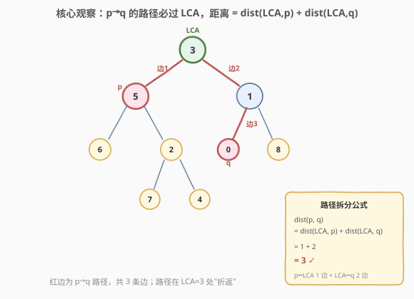
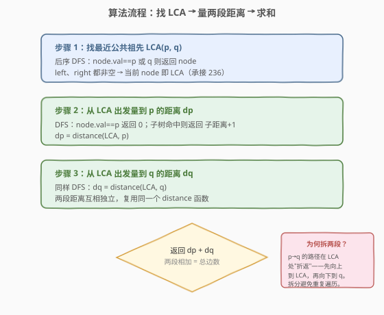
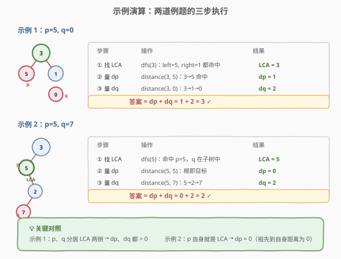

# LeetCode 找到二叉树中的距离 题解

## 1. 题目概述

- **标题 / 题号**：找到二叉树中的距离（#1740，medium）
- **链接**：https://leetcode.cn/problems/find-distance-in-a-binary-tree/
- **难度**：中等
- **标签**：树、二叉树、深度优先搜索、最近公共祖先

**题意**：给定一棵二叉树的根节点 `root`，以及两个**节点值** `p` 和 `q`，返回树中值为 `p` 的节点与值为 `q` 的节点之间的**距离**。

两节点间的**距离**定义为连接它们的路径上的**边数**。

**示例 1**：

```text
输入：root = [3,5,1,6,2,0,8,null,null,7,4], p = 5, q = 0
输出：3
解释：节点 5 和 0 之间的路径为 5-3-1-0，共 3 条边。
```

**示例 2**：

```text
输入：root = [3,5,1,6,2,0,8,null,null,7,4], p = 5, q = 7
输出：2
解释：节点 5 和 7 之间的路径为 5-2-7，共 2 条边。
```

**示例 3**：

```text
输入：root = [1,2,3,4], p = 4, q = 3
输出：3
解释：节点 4 和 3 之间的路径为 4-2-1-3，共 3 条边。
```

**约束**：

- 树中节点数目范围 $[2, 10^5]$
- 所有 `Node.val` **互不相同**
- $1 \le \text{Node.val} \le 10^5$
- `p != q`，且 `p`、`q` 都存在于给定的二叉树中

> 💡 **关键结构**：本题给出的是**节点值** `p`、`q`（整数），而非节点引用——这与 [236. 二叉树的最近公共祖先](../0201-0300/236_二叉树的最近公共祖先.md)（给的是节点指针）不同，因此搜索时需按 `val` 比较。核心思路是先找最近公共祖先，再把距离拆成两段相加。

## 2. 解题思路

### 2.1 暴力思路：存路径找公共前缀

一种直观做法是：

1. 从根出发，分别找到 `root → p` 和 `root → q` 的两条路径（DFS + 回溯记录）。
2. 两条路径的**公共前缀**末端就是 LCA。
3. 距离 = `len(path_p) + len(path_q) - 2 × len(公共前缀)`。

这种方法可行，但需要 $O(n)$ 额外空间存两条路径，且要写两遍 DFS + 一次遍历比较。面试中可作为引出最优解的对比。

### 2.2 核心观察：LCA 拆两段距离



关键直觉：**`p` 到 `q` 的路径必定经过它们的最近公共祖先（LCA）**。因为树中任意两点间路径唯一，而 LCA 是两条「向上回溯」路径的汇聚点。于是可以把总距离拆成两段：

$$\text{dist}(p, q) = \text{dist}(\text{LCA}, p) + \text{dist}(\text{LCA}, q)$$

- $\text{dist}(\text{LCA}, p)$：从 LCA 向下走到 `p` 的边数；
- $\text{dist}(\text{LCA}, q)$：从 LCA 向下走到 `q` 的边数。

> 💡 **为何拆成两段？** `p` 到 `q` 的路径在 LCA 处"折返"——`p` 先向上走到 LCA，再从 LCA 向下走到 `q`。从 LCA 出发的两段是独立的子问题，可复用同一个「从某节点向下找目标值的距离」函数，逻辑清晰且互不干扰。若 `p` 自身就是 LCA（`p` 是 `q` 的祖先），则 $\text{dist}(\text{LCA}, p) = 0$，公式依然成立。

**三个子函数**：

1. **`lca(node, p, q)`**：后序 DFS 找 LCA（与 236 同构，只是按 `val` 而非指针比较）。
2. **`distance(node, target)`**：从 `node` 向下找值为 `target` 的节点，返回边数；不在子树则返回 $-1$。
3. **主函数**：`return distance(lca, p) + distance(lca, q)`。

### 2.3 算法流程图



**步骤**：

1. **找 LCA**：后序遍历整棵树。若 `node.val == p` 或 `node.val == q`，命中返回；若左右子树各返回一个非空结果，当前节点即 LCA。
2. **量 $\text{dp}$**：从 LCA 出发，DFS 找值为 `p` 的节点。命中返回 $0$；子树命中则返回子距离 $+1$。
3. **量 $\text{dq}$**：同样从 LCA 出发找 `q`，复用 `distance` 函数。
4. **返回 $\text{dp} + \text{dq}$**。

### 2.4 示例演算



以示例 1（`p=5, q=0`）为例，树的结构同 236：

```
        3
       / \
      5   1
     / \ / \
    6  2 0  8
      / \
     7   4
```

三步执行：

- **步骤 ①**：`lca(3)`。后序遍历：`dfs(5)` 命中 `p=5` 返回节点 5；`dfs(1)` 的左子树 `dfs(0)` 命中 `q=0` 返回节点 0，向上传递到节点 1。`dfs(3)` 得到 `left=5`（非空）、`right=1`（非空）→ **LCA = 3** ⭐。
- **步骤 ②**：`distance(3, 5)`。3→5 命中，返回 $\text{dp} = 1$。
- **步骤 ③**：`distance(3, 0)`。3→1→0，返回 $\text{dq} = 2$。
- **答案**：$1 + 2 = 3$ ✓。

对照示例 2（`p=5, q=7`）：`dfs(5)` 命中 `p=5`，而 `q=7` 在 5 的子树中，故 **LCA = 5** 自身。$\text{dp} = \text{distance}(5, 5) = 0$，$\text{dq} = \text{distance}(5, 7) = 2$，答案 $0 + 2 = 2$ ✓。

> 💡 **两种情形对照**：`p`、`q` 分居 LCA 两侧时（示例 1）$\text{dp}, \text{dq} > 0$；`p` 自身就是 LCA 时（示例 2）$\text{dp} = 0$——公式统一处理，无需特判。

## 3. 参考代码

### C++

```cpp
/**
 * Definition for a binary tree node.
 * struct TreeNode {
 *     int val;
 *     TreeNode *left;
 *     TreeNode *right;
 *     TreeNode(int x) : val(x), left(nullptr), right(nullptr) {}
 * };
 */
class Solution {
  public:
    // 后序 DFS 找 LCA（按 val 比较，承接 236）
    TreeNode* findLCA(TreeNode* root, int p, int q) {
        if (root == nullptr || root->val == p || root->val == q) {
            return root;
        }
        TreeNode* left = findLCA(root->left, p, q);
        TreeNode* right = findLCA(root->right, p, q);
        if (left != nullptr && right != nullptr) {
            return root; // p、q 分居两侧 → root 是 LCA
        }
        return left != nullptr ? left : right;
    }

    // 从 node 向下找值为 target 的节点，返回边数；不在子树返回 -1
    int distance(TreeNode* node, int target) {
        if (node == nullptr) {
            return -1;
        }
        if (node->val == target) {
            return 0;
        }
        int l = distance(node->left, target);
        if (l != -1) {
            return l + 1;
        }
        int r = distance(node->right, target);
        if (r != -1) {
            return r + 1;
        }
        return -1;
    }

    int findDistance(TreeNode* root, int p, int q) {
        TreeNode* ancestor = findLCA(root, p, q);
        return distance(ancestor, p) + distance(ancestor, q);
    }
};
```

### Python

```python
class Solution:
    def findDistance(self, root: Optional[TreeNode], p: int, q: int) -> int:
        # 后序 DFS 找 LCA（按 val 比较，承接 236）
        def find_lca(node):
            if not node or node.val == p or node.val == q:
                return node
            left = find_lca(node.left)
            right = find_lca(node.right)
            if left and right:
                return node        # p、q 分居两侧 → node 是 LCA
            return left or right

        # 从 node 向下找值为 target 的节点，返回边数；不在子树返回 -1
        def distance(node, target):
            if not node:
                return -1
            if node.val == target:
                return 0
            l = distance(node.left, target)
            if l != -1:
                return l + 1
            r = distance(node.right, target)
            return r + 1 if r != -1 else -1

        ancestor = find_lca(root)
        return distance(ancestor, p) + distance(ancestor, q)
```

> ⚠️ **与 236 的关键区别**：236 的 `p`、`q` 是**节点指针**，用 `root == p` 比较；本题 `p`、`q` 是**整数值**，须用 `root->val == p` 比较。若照搬 236 的指针比较会编译报错或逻辑错误。

## 4. 复杂度分析

| 维度 | 复杂度 | 说明 |
|------|--------|------|
| 时间复杂度 | $O(n)$ | 三次 DFS 各遍历至多 $n$ 个节点：找 LCA 一次 $O(n)$，量两段距离各 $O(n)$，总计 $O(3n) = O(n)$ |
| 空间复杂度 | $O(h)$ | 递归调用栈深度 = 树高 $h$；最坏（链状树）$O(n)$，平衡树 $O(\log n)$。无额外数组 |

> 💡 **为何时间仍是 $O(n)$ 而非 $O(3n)$？** 渐近意义下 $O(3n) = O(n)$，常数因子为 3。实际面试中可以提及"三次遍历"，但渐近复杂度记 $O(n)$。第 5 节给出一次遍历的优化版本。

## 5. 扩展：单次 DFS 一趟搞定

上述解法遍历树三次（找 LCA + 量两段）。可以合并为**单次后序 DFS**：递归函数返回「当前节点子树中目标节点的距离」（$-1$ 表示子树不含目标）。当 `p`、`q` 的距离在同一节点首次同时确定时，该节点即 LCA，直接求和得到答案。

```python
class Solution:
    def findDistance(self, root: Optional[TreeNode], p: int, q: int) -> int:
        ans = 0

        def dfs(node):
            nonlocal ans
            if not node or ans:
                return -1
            l = dfs(node.left)
            r = dfs(node.right)
            # 当前节点是否是 p 或 q
            is_target = (node.val == p or node.val == q)
            if is_target:
                if l != -1:           # 另一目标在左子树 → 当前节点是 LCA
                    ans = l + 1
                    return -1
                if r != -1:           # 另一目标在右子树 → 当前节点是 LCA
                    ans = r + 1
                    return -1
                return 0              # 命中一个目标，距父节点 1
            if l != -1 and r != -1:   # 两子树各有一个目标 → 当前节点是 LCA
                ans = l + r + 2
                return -1
            if l != -1:
                return l + 1
            if r != -1:
                return r + 1
            return -1

        dfs(root)
        return ans
```

**返回值约定**：`dfs(node)` 返回从 `node` 到其子树中**目标节点**（`p` 或 `q`）的边数，$-1$ 表示子树无目标。

- **当前节点是目标** 且另一目标在子树中 → 当前即 LCA，`ans = 子树距离 + 1`，返回 $-1$ 终止传播。
- **两子树各有目标** → 当前即 LCA，`ans = (l+1) + (r+1) = l + r + 2`，返回 $-1$。
- **仅一侧有目标** → 向上传递距离 $+1$。
- `if ans: return -1` 保证一旦答案确定，后续遍历立即短路返回。

> ⚠️ **距离公式为何是 `l + r + 2`？** `l` 是左子树根到目标的距离，从当前节点出发还需多走一条到左子树的边，故左段 $= l + 1$；同理右段 $= r + 1$；总和 $= l + r + 2$。

该版本时间仍为 $O(n)$、空间 $O(h)$，但常数更优（只遍历一次），代价是逻辑更烧脑。面试中**推荐先讲清三步法**，再提此优化展示进阶思考。

## 6. 面试要点

**Q1：为什么要先找 LCA？不能直接从 p 走到 q 吗？**

> 二叉树只有从父到子的指针，没有从子到父的指针。直接从 `p` 出发无法"向上"走到 LCA 再下到 `q`。找 LCA 相当于确定路径的"中转点"，从 LCA 出发向下量两段距离即可——无需父指针。若题目给了父指针（如 [1650](https://leetcode.cn/problems/lowest-common-ancestor-of-a-binary-tree-iii/)），可直接从 `p` 向上收集祖先再匹配。

**Q2：本题和 236 最近公共祖先有什么区别？**

> 两点：① 236 给的是**节点指针** `p`、`q`，用 `root == p` 比较；本题给的是**节点值**（整数），须用 `root->val == p` 比较。② 目标不同——236 返回 LCA 节点，本题返回两节点间的边数，需在 LCA 基础上再量两段距离。

**Q3：如果 p 是 q 的祖先（如示例 2），公式还成立吗？**

> 成立。此时 LCA = `p` 自身，$\text{dist}(\text{LCA}, p) = 0$（节点到自身距离为 0），$\text{dist}(\text{LCA}, q) = $ 实际边数，答案 $= 0 + \text{边数} = $ 正确值。公式天然涵盖祖先情形，无需特判。

**Q4：`distance` 函数找到目标后为什么立即返回，不继续搜索？**

> 题目保证所有节点值互不相同，因此值为 `target` 的节点在子树中至多一个。一旦命中（返回 $0$）或某子树返回非 $-1$，即可确定距离，无需再搜另一子树——这保证了 `distance` 的时间为 $O(h)$ 而非 $O(n)$（从 LCA 出发只需走到目标深度）。

**Q5：单次 DFS 版本中 `if ans: return -1` 的作用是什么？**

> 一旦在 LCA 处确定了答案（`ans` 被赋值），后续遍历其他子树已无意义。该守卫让递归在回溯阶段立即短路返回 $-1$，避免无谓遍历，也防止祖先节点误将已解决的距离再次累加导致错误。

> 💡 **一句话总结**：两节点距离 = 经 LCA 拆两段 → 找 LCA（后序 DFS 按 `val` 比较）+ 量两段距离（DFS 找目标值）→ $O(n)$ 时间、$O(h)$ 空间。

## 同类练习题

| # | 题目 | 与本题的关联 |
|---|------|-------------|
| 236 | [二叉树的最近公共祖先](https://leetcode.cn/problems/lowest-common-ancestor-of-a-binary-tree/)（[题解](../0201-0300/236_二叉树的最近公共祖先.md)） | **最直接的基石题**——本题找 LCA 的子函数与 236 同构，只是按 `val` 而非指针比较，先掌握 236 再做本题水到渠成 |
| 1650 | [二叉树的最近公共祖先 III](https://leetcode.cn/problems/lowest-common-ancestor-of-a-binary-tree-iii/) | 节点带父指针，可直接从 `p` 向上走祖先链求 LCA，对照理解「有/无父指针」对路径求解的影响 |
| 235 | [二叉搜索树的最近公共祖先](https://leetcode.cn/problems/lowest-common-ancestor-of-a-binary-search-tree/) | BST 版 LCA 可利用有序性 $O(h)$ 时间、$O(1)$ 空间，若本题也是 BST 则量距离同样可二分加速 |
| 863 | [二叉树中所有距离为 K 的节点](https://leetcode.cn/problems/all-nodes-distance-k-in-binary-tree/) | 从目标节点出发找距离为 K 的所有节点，与本题「求两点间距离」互补——一个求特定距离的节点集，一个求两点间的确切距离 |
