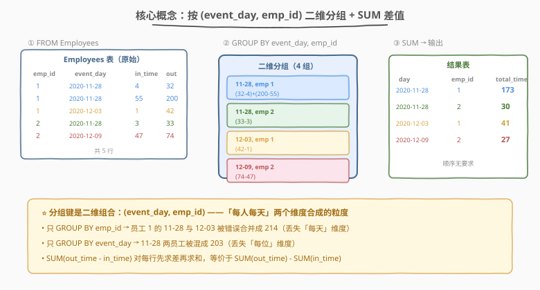
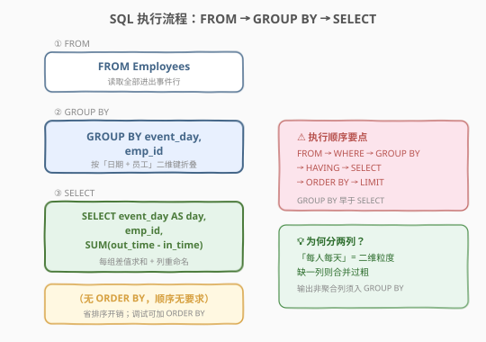
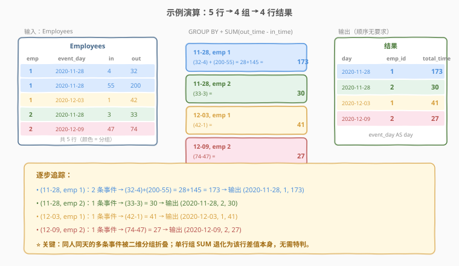

# 查找每个员工花费的总时间

- **题目名称**：查找每个员工花费的总时间
- **链接**：[1741. 查找每个员工花费的总时间](https://leetcode.cn/problems/find-total-time-spent-by-each-employee/)
- **难度**：简单
- **标签**：数据库、SQL、`GROUP BY`、`SUM`、聚合、多列分组

## 1. 题目概述

给定 `Employees` 表，记录员工每次进出办公室的事件。表中一次「进-出」配对所花费的时间为 `out_time - in_time`。**同一天同一员工可能多次进出**，要求计算**每位员工每天**在办公室花费的**总时间**（分钟）。

返回结果表的顺序无要求。

**表结构**：

```text
Table: Employees
+-------------+------+
| Column Name | Type |
+-------------+------+
| emp_id      | int  |
| event_day   | date |
| in_time     | int  |
| out_time    | int  |
+-------------+------+
在 SQL 中，(emp_id, event_day, in_time) 是这个表的主键。
event_day 是事件发生的日期；in_time 是进入办公室的时间，out_time 是离开的时间。
in_time 和 out_time 取值在 1 到 1440 之间。
题目保证同一天没有两个事件在时间上相交，且 in_time 小于 out_time。
```

**示例 1**：

```text
输入：
Employees 表：
+--------+------------+---------+----------+
| emp_id | event_day  | in_time | out_time |
+--------+------------+---------+----------+
| 1      | 2020-11-28 | 4       | 32       |
| 1      | 2020-11-28 | 55      | 200      |
| 1      | 2020-12-03 | 1       | 42       |
| 2      | 2020-11-28 | 3       | 33       |
| 2      | 2020-12-09 | 47      | 74       |
+--------+------------+---------+----------+

输出：
+------------+--------+------------+
| day        | emp_id | total_time |
+------------+--------+------------+
| 2020-11-28 | 1      | 173        |
| 2020-11-28 | 2      | 30         |
| 2020-12-03 | 1      | 41         |
| 2020-12-09 | 2      | 27         |
+------------+--------+------------+

解释：
雇员 1 有三次进出：两次在 2020-11-28 花费 (32-4) + (200-55) = 173，一次在 2020-12-03 花费 (42-1) = 41。
雇员 2 有两次进出：一次在 2020-11-28 花费 (33-3) = 30，一次在 2020-12-09 花费 (74-47) = 27。
```

**约束条件**：

- `(emp_id, event_day, in_time)` 是表的主键，具有唯一值
- `in_time` 和 `out_time` 取值范围 $[1, 1440]$（一天 1440 分钟）
- 同一天同一员工的事件时间互不相交，且 `in_time < out_time`
- 返回结果顺序无要求

> 💡 本题是 SQL **"多列分组聚合"招牌题**——核心两步：① `GROUP BY event_day, emp_id` 按「日期 + 员工」二维键折叠；② `SUM(out_time - in_time)` 对每组内的进出差求和。相比 [1729](../1701-1800/1729_求关注者的数量.md) 的单列分组，本题的要点在于**分组键是一个组合**——「每人每天」是两个维度合成的粒度，必须同时 `GROUP BY` 两列。

---

## 2. 解题思路

### 2.1 暴力思路：逐人逐天扫描

最直觉的过程式思路：遍历所有不同的 `(event_day, emp_id)` 组合，对每个组合遍历全部事件行，筛出属于该「人-天」的行，逐行算 `out_time - in_time` 再累加。伪代码：

```text
for each distinct (day, emp) in Employees:
    total = sum(out_time - in_time for r in Employees if r.event_day == day and r.emp_id == emp)
    result += (day, emp, total)
```

但**纯 SQL 没有显式双重循环**——"按人-天分组 + 组内求和"需换成集合式表达：用 `GROUP BY` 把事件按 `(event_day, emp_id)` 折叠成一行，再用聚合函数 `SUM` 一次性算出每组的总时间。

### 2.2 核心观察：多列分组 + 算术求和



**问题拆解为三个子问题**：

1. **逐事件算差值**：每行的「单次停留时间」= `out_time - in_time`。这是一个**行内算术表达式**，可作为 `SUM` 的参数直接传入——`SUM(out_time - in_time)` 等价于先对每行求差、再对组内所有差值求和。

2. **按二维键分组**：题目要「每位员工**每天**」的总时间，分组粒度是 `(event_day, emp_id)` 的**组合**。`GROUP BY event_day, emp_id` 把同一员工同一天的多条事件折叠成一组——**两列缺一不可**：
   - 只 `GROUP BY emp_id` 会把员工所有天的数据混在一起，丢失「每天」维度；
   - 只 `GROUP BY event_day` 会把当天所有员工混在一起，丢失「每位」维度。

3. **列重命名**：输出列名要求 `day`（而非 `event_day`），用 `event_day AS day` 别名实现。

> ⚠️ **为何分组键是两列而不是一列？** 「每位员工每天」描述的是一个**复合粒度**——「员工」和「天」是两个独立的维度，合起来才定位到「某人在某一天」这个统计单元。示例中员工 1 在 2020-11-28 有两次进出（需合并），但在 2020-12-03 又有一次（独立一组）——若不按天分组，员工 1 的三次进出会被错误合并成 $173 + 41 = 214$ 一行。**口诀：分组键 = 输出中除聚合列外的所有列**（本题输出 `day`、`emp_id` 两列 → 分组键就是 `event_day`、`emp_id`）。

> 💡 **`SUM(表达式)` 而非 `SUM(列)`**：`SUM` 的参数可以是任意数值表达式，不限于单列名。`SUM(out_time - in_time)` 让数据库先对每行计算差值再求和，与「先算每行差、存临时列、再 `SUM(临时列)`」等价但更简洁。也可写 `SUM(out_time) - SUM(in_time)`，因加减法可交换，两者结果相同——但前者语义更直观（「每次停留时间之和」）。

### 2.3 算法流程图



**逻辑执行步骤**：

| 步骤 | 子句 | 作用 |
|------|------|------|
| ① | `FROM Employees` | 读取全部进出事件行 |
| ② | `GROUP BY event_day, emp_id` | 按「日期 + 员工」二维键折叠，同人同天的多条事件并成一组 |
| ③ | `SELECT event_day AS day, emp_id, SUM(out_time - in_time) AS total_time` | 每组输出日期、员工 ID 与差值总和 |

> 💡 **SQL 子句执行顺序**：`FROM` → `WHERE` → `GROUP BY` → `HAVING` → `SELECT`（含聚合）→ `ORDER BY` → `LIMIT`。本题无 `WHERE`（无需行级过滤）、无 `HAVING`（无需组级过滤）、无 `ORDER BY`（题目说顺序无要求），是最简的「分组聚合」形态。`GROUP BY` 早于 `SELECT`，故 `SUM` 在分组后才求值。

> ⚠️ **为何不写 `ORDER BY`？** 题目明确「返回结果表单的顺序无要求」。省略 `ORDER BY` 后 SQL 不保证输出顺序，数据库可按任意顺序返回分组（通常按哈希聚合的桶序）。若面试官要求确定性输出，可加 `ORDER BY day, emp_id` 让结果可复现。

### 2.4 示例演算

以示例 1 的 5 行数据为例，观察「`GROUP BY` 二维分组 → `SUM` 差值」的逐步过程：



**步骤 ①：FROM Employees**

| emp_id | event_day  | in_time | out_time | 差值 |
|--------|------------|---------|----------|------|
| 1 | 2020-11-28 | 4 | 32 | 28 |
| 1 | 2020-11-28 | 55 | 200 | 145 |
| 1 | 2020-12-03 | 1 | 42 | 41 |
| 2 | 2020-11-28 | 3 | 33 | 30 |
| 2 | 2020-12-09 | 47 | 74 | 27 |

> 「差值」列并非真实存在，而是 `SUM(out_time - in_time)` 在每行隐式计算的中间结果。

**步骤 ②③：GROUP BY (event_day, emp_id) + SUM(差值)**

| 分组 | 组内事件 | 差值明细 | SUM |
|------|----------|----------|-----|
| (2020-11-28, 1) | 2 条 | 28 + 145 | **173** |
| (2020-11-28, 2) | 1 条 | 30 | **30** |
| (2020-12-03, 1) | 1 条 | 41 | **41** |
| (2020-12-09, 2) | 1 条 | 27 | **27** |

**输出（顺序无要求）**：

| day | emp_id | total_time |
|-----|--------|------------|
| 2020-11-28 | 1 | 173 |
| 2020-11-28 | 2 | 30 |
| 2020-12-03 | 1 | 41 |
| 2020-12-09 | 2 | 27 |

> 💡 **看 (2020-11-28, 1) 这一组**：员工 1 在当天有两次进出，差值 28 与 145 被 `SUM` 合并成 173。这正是「同一天多次进出需合并」的体现——若误用单列 `GROUP BY emp_id`，员工 1 的三行差值（28、145、41）会被错误累加成 214，且丢失「12-03 那天单独 41」的行。

---

## 3. 参考代码

### SQL（解法 A：`GROUP BY` 双列 + `SUM(差值)`，推荐）

```sql
SELECT
    event_day AS day,
    emp_id,
    SUM(out_time - in_time) AS total_time
FROM Employees
GROUP BY event_day, emp_id;
```

> 💡 **写法要点**：
> - **`GROUP BY event_day, emp_id`**：按「日期 + 员工」二维键分组，同人同天的多条进出事件折叠成一行。两列顺序不影响分组结果，但习惯上按「时间→实体」或「输出列顺序」排列。
> - **`SUM(out_time - in_time)`**：对每组内每行先算 `out_time - in_time`（单次停留分钟数），再求和得总时间。`SUM` 的参数是算术表达式而非裸列名。
> - **`event_day AS day`**：把列名 `event_day` 重命名为输出要求的 `day`。`AS` 关键字可省略（`event_day day`），但保留 `AS` 更易读。
> - ✓ **最推荐**：一次分组聚合搞定，语义清晰、标准 SQL 通用。

### SQL（解法 B：`SUM(out_time) - SUM(in_time)` 等价写法）

```sql
SELECT
    event_day AS day,
    emp_id,
    SUM(out_time) - SUM(in_time) AS total_time
FROM Employees
GROUP BY event_day, emp_id;
```

> 💡 **解法 B 的思路**：利用加减法的可交换性——「先逐行求差再求和」=「先分别求和再相减」：
>
> $$\sum_i (\text{out}_i - \text{in}_i) = \sum_i \text{out}_i - \sum_i \text{in}_i$$
>
> **与解法 A 的区别**：
> - 解法 A 语义更直观——「每次停留时间之和」，直接对应题目「一次进出花费 `out_time - in_time`」的描述。
> - 解法 B 把「求和」与「求差」拆开，适合需要单独引用 `SUM(out_time)` 或 `SUM(in_time)` 的场景（如同时输出总外出时间与总进入时间）。
> - 两者结果恒相等（整数加减法可交换）。**推荐解法 A**，因其与题意一一对应。

### Python（pandas）

```python
import pandas as pd

def total_time(employees: pd.DataFrame) -> pd.DataFrame:
    employees = employees.copy()
    employees['spent'] = employees['out_time'] - employees['in_time']
    result = (
        employees.groupby(['event_day', 'emp_id'], as_index=False)
        .agg(total_time=('spent', 'sum'))
        .rename(columns={'event_day': 'day'})
    )
    return result[['day', 'emp_id', 'total_time']]
```

> 💡 **pandas 对照**：
> - `employees['out_time'] - employees['in_time']` 对应 `SUM(out_time - in_time)` 中的逐行差值——pandas 需显式造一列（或用 lambda），SQL 则在 `SUM` 内隐式完成。
> - `.groupby(['event_day', 'emp_id'])` 对应 `GROUP BY event_day, emp_id`——传**列表**表示多列分组，与 SQL 逗号分隔多列对应。
> - `.agg(total_time=('spent', 'sum'))` 对应 `SUM(spent) AS total_time`。
> - `.rename(columns={'event_day': 'day'})` 对应 `event_day AS day`。
> - `as_index=False` 让分组键保留为普通列而非索引，便于后续 `rename` 与列选取。

---

## 4. 复杂度分析

| 维度 | 解法 A（`SUM(差值)`） | 解法 B（`SUM-SUM`） | pandas |
|------|----------------------|---------------------|--------|
| **时间** | $O(n)$ | $O(n)$ | $O(n)$ |
| **空间** | $O(m)$ | $O(m)$ | $O(n)$ |
| **跨数据库** | 通用 | 通用 | — |
| **推荐度** | ✓ **语义首选** | ✓ 等价备选 | ✓ 验证用 |

> - $n$ = `Employees` 表行数，$m$ = 不同 `(event_day, emp_id)` 组合数（$m \le n$）
> - **时间**：`GROUP BY` 哈希聚合 $O(n)$（每行算一次差值 + 哈希查找/插入均摊 $O(1)$）；无 `ORDER BY` 故无排序开销。总时间 $O(n)$。
> - **空间**：SQL 解法需 $O(m)$ 存储分组结果（`(day, emp_id)` → 累加器）；pandas 需 $O(n)$ 存 DataFrame 与中间 `spent` 列。
> - **索引优化**：在 `Employees(event_day, emp_id)` 上建复合索引可让 `GROUP BY` 走索引顺序扫描，天然有序并减少随机访问；但本题无 `ORDER BY`，优化收益有限。

---

## 5. 扩展：多列分组的典型场景与变体

`GROUP BY` 多列是 SQL 处理「复合统计粒度」的核心能力，常见场景：

| 场景 | 分组键 | 聚合 | 典型题 |
|------|--------|------|--------|
| 每人每天时长 | `(date, emp_id)` | `SUM(diff)` | 本题 1741 |
| 每人每月订单数 | `(month, user_id)` | `COUNT(*)` | 1565 |
| 每部门每职位薪资均值 | `(dept, title)` | `AVG(salary)` | — |
| 每天每产品销量 | `(date, product)` | `SUM(qty)` | — |

**变体思考**：

1. **若要「每位员工（跨所有天）的总时间」？** 分组键改为单列 `GROUP BY emp_id`，输出 `emp_id, SUM(out_time - in_time)`——丢掉 `day` 列即可。这正对照「分组键决定粒度」的核心：键越少，合并越粗。
2. **若要「每天所有员工的总时间」？** 分组键改为单列 `GROUP BY event_day`，输出 `day, SUM(out_time - in_time)`——丢掉 `emp_id` 列。
3. **若要「每位员工每天的平均单次停留时长」？** 把 `SUM` 换成 `AVG(out_time - in_time)`，分组键不变——聚合函数可按需替换，分组逻辑复用。
4. **若输出要求按 `day` 升序、`emp_id` 升序？** 末尾加 `ORDER BY day, emp_id`（多列排序，先按天再按人）。

> ⚠️ **分组键与输出列的对应关系**：标准 SQL 要求 `SELECT` 中的**非聚合列**必须出现在 `GROUP BY` 中。本题 `day`（来自 `event_day`）与 `emp_id` 都是非聚合列，故二者都需入 `GROUP BY`。反过来，`GROUP BY` 中的列不一定都要出现在 `SELECT`——例如可 `GROUP BY event_day, emp_id` 但只 `SELECT emp_id, SUM(...)`（不输出 `day`），但那样语义会变成「按人-天分组却不展示天」，通常无意义。

---

## 6. 面试要点

1. **为什么 `GROUP BY` 要写两列？只按 `emp_id` 分组会怎样？**

   > 题目要求「每位员工**每天**」的总时间，「每人」和「每天」是两个独立的统计维度，合起来才定位到目标粒度。只 `GROUP BY emp_id` 会把同一员工所有天的事件混在一起，丢失「每天」维度——示例中员工 1 在 11-28（173 分钟）和 12-03（41 分钟）会被错误合并成一行 214 分钟，且 12-03 那行消失。**口诀：输出里有几个非聚合列，`GROUP BY` 就写几列**。

2. **`SUM(out_time - in_time)` 与 `SUM(out_time) - SUM(in_time)` 有区别吗？**

   > 数值结果完全相同，因为整数加减法满足可交换性：$\sum (out - in) = \sum out - \sum in$。但语义不同——前者是「每次停留时间之和」，与题目「一次进出花费 out-in」的描述一一对应；后者是「外出总和减进入总和」，适合需单独引用两个 `SUM` 的场景。推荐前者，更直观。

3. **`event_day AS day` 中的 `AS` 能省略吗？省略后有风险吗？**

   > 能省略——`event_day day` 与 `event_day AS day` 等价，`AS` 是可选关键字。但保留 `AS` 可提升可读性，避免与「表名 空格 别名」等写法混淆。在复杂查询中（多个列重命名、子查询别名），`AS` 能让读者快速区分「列名」与「别名」。

4. **题目说「顺序无要求」，为何还要讨论 `ORDER BY`？**

   > 生产环境中「无顺序要求」通常意味着上层应用会自行排序或按随机顺序消费，数据库可省去排序开销。但**测试与调试时**确定性输出很重要——若每次查询结果顺序不同，难以对比预期。故面试中可提一句「生产省略 `ORDER BY` 以省排序开销，测试时加 `ORDER BY day, emp_id` 保证可复现」。若面试官要求确定性，立即补上。

5. **如果某员工某天只有一次进出（单行），`GROUP BY` + `SUM` 还成立吗？**

   > 成立。单行分组下 `SUM(out_time - in_time)` 就是该行差值本身——`SUM` 对单元素退化为恒等。这正是「分组聚合」的统一性：无论组内 1 行还是多行，聚合函数都适用，无需特判。示例中 `(2020-12-03, 1)` 与 `(2020-12-09, 2)` 都是单行组，`SUM` 直接返回 41 与 27。

> 💡 **一句话总结**：1741 是 SQL **"多列分组聚合"招牌题**——核心模板「`GROUP BY event_day, emp_id` → `SUM(out_time - in_time) AS total_time` → `event_day AS day`」。最大要点：**分组键是二维组合**（每人每天），两列缺一不可；`SUM` 参数可为算术表达式；列重命名用 `AS`。

---

## 7. 同类练习题

- [1729. 求关注者的数量](https://leetcode.cn/problems/find-followers-count/)（[题解](../1701-1800/1729_求关注者的数量.md)）：**单列分组计数入门题**——`GROUP BY user_id` + `COUNT`，对照本题「双列分组求和」，体会分组键列数对统计粒度的影响
- [1731. 每位经理的下属员工数量](https://leetcode.cn/problems/the-number-of-employees-which-report-to-each-employee/)（[题解](../1701-1800/1731_每位经理的下属员工数量.md)）：**自连接 + 分组聚合**——`GROUP BY e.employee_id` + `COUNT`/`AVG`，巩固分组聚合骨架，并引入自连接配对
- [511. 游戏玩法分析 I](https://leetcode.cn/problems/game-play-analysis-i/)：`GROUP BY player_id` + `MIN(event_date)`，同为最基础的分组聚合入门题
- [586. 订单最多的客户](https://leetcode.cn/problems/customer-placing-the-largest-number-of-orders/)：`GROUP BY` + `COUNT` + `ORDER BY ... LIMIT 1`，在分组计数后取最值，对照本题「无最值、纯聚合」的简形态
- [1565. 按月统计订单数与顾客数 🔒](https://leetcode.cn/problems/unique-orders-and-customers-per-month/)（[题解](../1501-1600/1565_按月统计订单数与顾客数.md)）：`GROUP BY month` + `COUNT`/`COUNT(DISTINCT)`，按日期维度分组的进阶——把 `event_day` 聚合成 `month` 再分组
