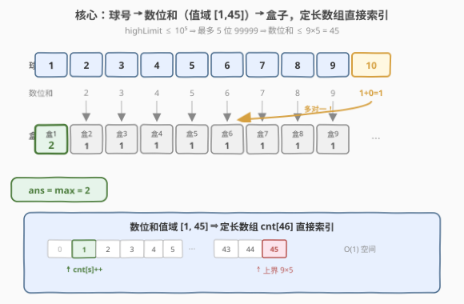
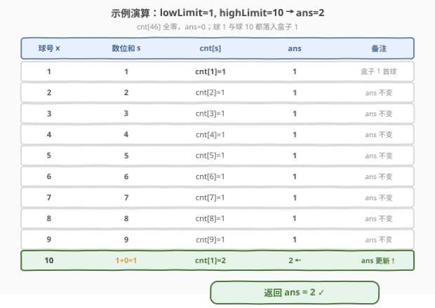

# 盒子中小球的最大数量

- **题目名称**：盒子中小球的最大数量
- **链接**：[1742. 盒子中小球的最大数量](https://leetcode.cn/problems/maximum-number-of-balls-in-a-box/)
- **难度**：简单
- **标签**：数组、哈希表、数学

## 1. 题目概述

有 $n$ 个编号连续的小球，编号从 `lowLimit` 到 `highLimit`（含两端，$n = \text{highLimit} - \text{lowLimit} + 1$）。另有无限数量的盒子，编号从 $1$ 开始。每个小球放入**编号等于其各位数字之和**的盒子。例如编号 $321$ 的小球放入盒子 $3+2+1=6$，编号 $10$ 的小球放入盒子 $1+0=1$。

返回**装有最多小球的盒子中的小球数量**。

**示例 1**：

```text
输入：lowLimit = 1, highLimit = 10
输出：2
解释：
盒子编号：1 2 3 4 5 6 7 8 9 10 11 ...
小球数量：2 1 1 1 1 1 1 1 1 0  0  ...
编号 1 的盒子放有最多小球（球 1 和球 10），数量为 2。
```

**示例 2**：

```text
输入：lowLimit = 5, highLimit = 15
输出：2
解释：
盒子编号：1 2 3 4 5 6 7 8 9 10 11 ...
小球数量：1 1 1 1 2 2 1 1 1 0  0  ...
编号 5（球 5、14）和 6（球 6、15）的盒子各放 2 个小球。
```

**示例 3**：

```text
输入：lowLimit = 19, highLimit = 28
输出：2
解释：
盒子编号：1 2 3 4 5 6 7 8 9 10 11 12 ...
小球数量：0 1 1 1 1 1 1 1 1 2  0  0  ...
编号 10 的盒子放有最多小球（球 19、28），数量为 2。
```

**约束条件**：

- $1 \le \text{lowLimit} \le \text{highLimit} \le 10^5$

> 💡 **关键结构**：小球编号 $x$ 到盒子编号的映射 $f(x) = \text{digitsum}(x)$ 是一个多对一函数——多个球号可能映射到同一个盒子。题目本质是：对区间 $[\text{lowLimit}, \text{highLimit}]$ 内所有整数施加 `digitsum`，再统计每个函数值的出现次数取最大。这是一个典型的**值域计数**问题。

---

## 2. 解题思路

### 2.1 暴力思路：哈希表逐球计数

最直觉的做法：遍历每个球号 $x$，逐位拆分求和得到盒子编号 $s$，用哈希表（`unordered_map` / `dict`）给盒子 $s$ 计数，遍历完取哈希表中最大的计数值。

```text
box = {}                          # 哈希表：盒子号 → 小球数
for x in lowLimit .. highLimit:
    s = digitsum(x)               # 逐位求和
    box[s] = box.get(s, 0) + 1    # 计数
return max(box.values())          # 取最大值
```

时间 $O(n \cdot d)$（$d$ 为球号位数，$d \le 6$），空间 $O(k)$（$k$ 为不同盒子数）。$n \le 10^5$ 时毫无压力，但**哈希表对这个场景是杀鸡用牛刀**——盒子编号的取值范围极其有限，根本不需要动态扩容的哈希结构。

> ⚠️ **症结**：暴力把盒子编号当成「不可预测的任意整数」，于是选了最通用的哈希表。但 $\text{highLimit} \le 10^5$ 意味着球号最多 5 位（$99999$），数位和上界 $= 9 \times 5 = 45$。盒子编号被严格限制在 $[1, 45]$ 这个极小值域内，用哈希表既浪费空间又有哈希开销。认清值域边界，就能换成更高效的存储。

### 2.2 核心观察：数位和值域有限 → 定长数组替代哈希表



关键在于估算数位和的**值域上界**。设 $\text{highLimit} \le 10^5$，则球号至多为 $5$ 位数 $99999$，其数位和：

$$
\text{digitsum}(99999) = 9 \times 5 = 45
$$

而球号 $\ge 1$，数位和 $\ge 1$。因此盒子编号被严格约束在 $[1, 45]$ 这一**闭区间**内——总共只有 $45$ 种可能。这个有限且稠密的值域，正是**直接索引数组**的甜区：

$$
\text{cnt}[s] \gets \text{cnt}[s] + 1, \qquad s = \text{digitsum}(x) \in [1, 45]
$$

用一个长度为 $46$ 的定长数组（下标 $0 \sim 45$，下标 $0$ 恒不用）替代哈希表，访问 $O(1)$ 且无哈希开销。同时，最大值可在计数时**同步滚动维护**，无需最后再扫一遍：

$$
\text{ans} \gets \max(\text{ans},\, \text{cnt}[s])
$$

> 💡 **值域分析是选数据结构的依据**：当键的取值范围有限且稠密（$k$ 较小）时，定长数组的直接索引在时间（无哈希函数计算/冲突处理）和空间（无额外指针/负载因子开销）上都优于哈希表。本题 $k = 45$，数组只需 $46$ 个 `int`（$184$ 字节），远小于哈希表的最小开销。这一思路与 [242. 有效的字母异位词](https://leetcode.cn/problems/valid-anagram/) 用长度 $26$ 数组统计字母频率、[41. 缺失的第一个正数](https://leetcode.cn/problems/first-missing-positive/) 利用值域做原地哈希同源——**先估值域，再定结构**。
>
> 💡 **数位和的进位规律（拓展）**：$f(x+1)$ 与 $f(x)$ 的关系取决于 $x$ 的末尾连续 $9$ 的个数 $k$：若末位非 $9$（$k=0$），$f(x+1) = f(x)+1$；若末尾恰好 $k$ 个 $9$，则这 $k$ 位归零（$-9k$）、前一位 $+1$，净变化 $f(x+1) = f(x) - 9k + 1$。利用此规律可 $O(1)$ 增量计算数位和，省去逐位拆分，但 $n \le 10^5$ 时收益可忽略。

### 2.3 算法流程图

![算法流程：cnt[46]=0,ans=0 → 对每个球号求数位和s → cnt[s]++ → ans=max(ans,cnt[s]) → 返回ans](../images/1742_algorithm_flow.svg)

1. **初始化**：定长数组 `cnt[46]` 全零（下标 $0$ 不用），`ans = 0`。
2. **遍历**：对每个球号 $x \in [\text{lowLimit}, \text{highLimit}]$：
   - 逐位拆分求数位和 $s$（`while t: s += t%10; t//=10`）。
   - `cnt[s] += 1`。
   - `ans = max(ans, cnt[s])` 同步更新最大值。
3. **终止**：遍历完返回 `ans`。

每轮一次数位求和（$\le 5$ 次取模）+ 一次自增 + 一次比较，共 $n$ 轮，总复杂度 $O(n \cdot d) = O(n)$（$d \le 6$ 视作常数）。

### 2.4 示例演算

以示例 1 `lowLimit = 1, highLimit = 10` 为例（`cnt[46]` 全零，`ans = 0`）：



| 球号 $x$ | 数位和 $s$ | `cnt[s]`（更新后） | `ans`（更新后） | 说明 |
|----------|-----------|-------------------|-----------------|------|
| $1$ | $1$ | $\text{cnt}[1]=1$ | $1$ | 盒子 1 收首个球 |
| $2$ | $2$ | $\text{cnt}[2]=1$ | $1$ | |
| $3$ | $3$ | $\text{cnt}[3]=1$ | $1$ | |
| $4$ | $4$ | $\text{cnt}[4]=1$ | $1$ | |
| $5$ | $5$ | $\text{cnt}[5]=1$ | $1$ | |
| $6$ | $6$ | $\text{cnt}[6]=1$ | $1$ | |
| $7$ | $7$ | $\text{cnt}[7]=1$ | $1$ | |
| $8$ | $8$ | $\text{cnt}[8]=1$ | $1$ | |
| $9$ | $9$ | $\text{cnt}[9]=1$ | $1$ | |
| $10$ | $1+0=1$ | $\text{cnt}[1]=\mathbf{2}$ | $\mathbf{2}$ | 球 10 落入盒子 1，`ans` 更新为 $2$ |

最终 `ans = 2` ✓。注意球 $1$ 和球 $10$ 都映射到盒子 $1$——这正是数位和多对一特性的体现：$f(1) = 1$，$f(10) = 1+0 = 1$。

---

## 3. 参考代码

### C++

```cpp
class Solution {
public:
    int countBalls(int lowLimit, int highLimit) {
        int cnt[46] = {0};
        int ans = 0;
        for (int x = lowLimit; x <= highLimit; ++x) {
            int s = 0, t = x;
            while (t) {
                s += t % 10;
                t /= 10;
            }
            ++cnt[s];
            ans = max(ans, cnt[s]);
        }
        return ans;
    }
};
```

### Python

```python
class Solution:
    def countBalls(self, lowLimit: int, highLimit: int) -> int:
        cnt = [0] * 46
        ans = 0
        for x in range(lowLimit, highLimit + 1):
            s = sum(map(int, str(x)))
            cnt[s] += 1
            ans = max(ans, cnt[s])
        return ans
```

> 💡 **写法对照**：两版逻辑完全一致——数位求和 + 数组索引计数 + 滚动维护最大值。C++ 用 `while` 循环逐位取模求和，避免字符串转换开销；Python 用 `sum(map(int, str(x)))` 更简洁可读，$n \le 10^5$ 时性能足够。数组大小 $46$ 对应数位和上界 $45$。
>
> ⚠️ **数组大小确定依据**：$\text{highLimit} \le 10^5 \Rightarrow$ 最大球号 $99999 \Rightarrow$ 数位和 $\le 45$。若约束放宽到 $10^9$（最大 $999999999$，数位和 $\le 81$），数组改为 `cnt[82]` 即可。值域上界 $= 9 \times \lceil \log_{10}(\text{highLimit}) \rceil$。

---

## 4. 复杂度分析

| 维度 | 复杂度 | 说明 |
|------|--------|------|
| 时间复杂度 | $O(n \cdot d)$ | 遍历 $n$ 个球号，每个球号数位求和 $O(d)$（$d \le 6$），计数与取最大 $O(1)$；$d$ 为常数故 $O(n)$ |
| 空间复杂度 | $O(1)$ | 定长数组 `cnt[46]`，大小由数位和值域上界 $45$ 决定，与 $n$ 无关 |

> 💡 对比哈希表方案的 $O(n \cdot d)$ 时间 / $O(k)$ 空间（$k \le 46$）：时间同为 $O(n)$，空间从「动态结构」改为「定长数组」，常数更小。核心收益在于消除了哈希函数计算与冲突处理的开销，且访问模式对缓存友好（连续内存顺序写）。

---

## 5. 扩展：值域计数的三种存储策略

「对函数值域计数并取最大」是一类题的共同骨架，按值域大小与稀疏程度选择存储结构：

| 策略 | 适用条件 | 典型题 |
|------|----------|--------|
| **定长数组直接索引** | 值域小且稠密（$k \le 10^2$） | **本题 1742**：数位和 $\in [1,45]$，`cnt[46]` 直接索引 |
| **哈希表** | 值域大或稀疏 | [451. 按字符频率排序字符](https://leetcode.cn/problems/sort-characters-by-frequency/)：字符频率统计，键为字符（可用数组也可用哈希） |
| **值域离散化 + 数组** | 值域大但键数少 | [1636. 按照频率将数组升序排序](https://leetcode.cn/problems/sort-array-by-increasing-frequency/)：先统计频率再按频率排序 |

> 💡 **从 1742 到一般值域计数的决策树**：第一步估算值域上界 $U$ 与元素个数 $n$ 的关系；若 $U$ 是小常数（如 $26$ 字母、$45$ 数位和），直接定长数组；若 $U$ 与 $n$ 同阶但键稀疏，用哈希表；若需要按值排序，先计数再排序键。本题 $U = 45$ 是典型的「小常数」甜区，数组是唯一合理选择。

---

## 6. 面试要点

**Q1：为什么用长度 46 的数组而不是哈希表？**
> $\text{highLimit} \le 10^5$，球号最多 $5$ 位，数位和上界 $= 9 \times 5 = 45$，下界为 $1$。盒子编号被严格限制在 $[1, 45]$ 这一含 $45$ 个整数的稠密小值域内。定长数组直接用数位和做下标，访问 $O(1)$ 且无哈希函数/冲突开销，空间恒定 $46$ 个 `int`。哈希表虽也能做，但常数更大、缓存不友好，是「通用但不优」的选择。

**Q2：数组大小 46 是怎么算的？如果约束变成 $\text{highLimit} \le 10^9$ 怎么改？**
> 上界 $= 9 \times \text{最大位数}$。$10^5$ 对应 $5$ 位，上界 $45$，故数组 $46$（下标 $0 \sim 45$，$0$ 不用）。若 $\text{highLimit} \le 10^9$，最大 $9$ 位 $999999999$，数位和上界 $= 9 \times 9 = 81$，数组改为 `cnt[82]` 即可。通用公式：$U = 9 \times \lceil \log_{10}(\text{highLimit}) \rceil$，数组大小 $U + 1$。

**Q3：为什么在计数时同步维护 `ans`，而不是最后再 `max(cnt)`？**
> 最大值是**可增量维护**的聚合量：每次 `cnt[s]++` 后，只有 `cnt[s]` 可能成为新的最大值，与当前 `ans` 比较即可。这省去了最后再遍历一遍数组的 $O(k)$ 扫描（虽 $k = 45$ 可忽略，但「边算边维护」是更通用的习惯，在 $k$ 大时收益明显）。与 [1732. 找到最高海拔](../1701-1800/1732_找到最高海拔.md) 中滚动维护 `best` 同理。

**Q4：数位和有什么数学性质可以利用？**
> 数位和 $f(x)$ 与 $x \bmod 9$ 有密切关系：$f(x) \equiv x \pmod{9}$（数根性质）。但本题要的是精确计数值而非同余类，该性质不能直接用于优化计数。更有用的增量性质是：$f(x+1) = f(x) + 1 - 9k$，其中 $k$ 为 $x$ 末尾连续 $9$ 的个数。利用它可 $O(1)$ 滚动计算数位和，省去逐位拆分，但 $n \le 10^5$ 时收益可忽略。

**Q5：如果 `highLimit` 很大（如 $10^{12}$），但区间长度 $n$ 仍不大，怎么办？**
> 数位和上界 $= 9 \times 12 = 108$，数组 `cnt[109]` 仍可行。瓶颈在遍历 $n$ 个球号——若 $n$ 仍 $\le 10^5$，直接遍历无压力；若 $n$ 也很大（如 $\text{lowLimit}=1, \text{highLimit}=10^{12}$），则需利用数位 DP 统计每个数位和对应的球号个数，将 $O(n)$ 降为 $O(d^2 \cdot U)$。这是本题的远期升级方向。

---

## 7. 同类练习题

- [242. 有效的字母异位词](https://leetcode.cn/problems/valid-anagram/)：用长度 $26$ 的定长数组统计字母频率——与本题用 `cnt[46]` 统计数位和同源，均为「小值域直接索引计数」
- [1732. 找到最高海拔](https://leetcode.cn/problems/find-the-highest-altitude/)（[题解](../1701-1800/1732_找到最高海拔.md)）：滚动维护最大值 `ans = max(ans, val)`，与本题计数时同步取最大的写法一致
- [258. 各位相加](https://leetcode.cn/problems/add-digits/)：数根问题——反复求数位和直到一位数，与本题的 `digitsum` 函数同源，$O(1)$ 公式解 $= 1 + (x-1) \bmod 9$
- [2169. 得到 0 的操作数](https://leetcode.cn/problems/count-operations-to-obtain-zero/)：模拟计数题，与本题「遍历 + 计数 + 取最大」骨架类似，训练计数循环的基本功
- [1945. 字符串转化后的各位数字之和](https://leetcode.cn/problems/sum-of-digits-of-string-after-convert/)：数位和的字符串变体——先字母转数字串再求数位和，与本题 `digitsum` 函数直接关联
