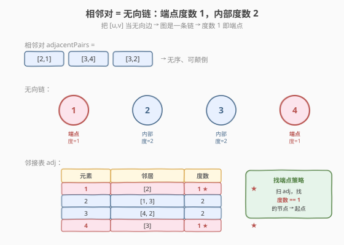
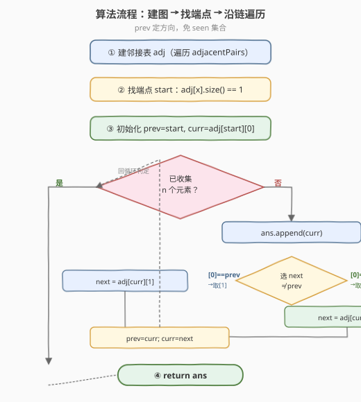
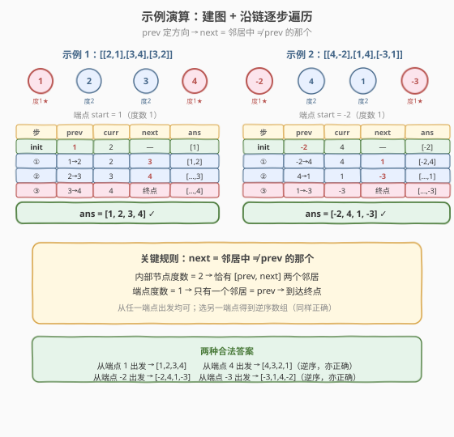

# LeetCode 从相邻元素对还原数组 题解

## 1. 题目概述

- **标题 / 题号**：从相邻元素对还原数组（#1743，medium）
- **链接**：https://leetcode.cn/problems/restore-the-array-from-adjacent-pairs/
- **难度**：中等
- **标签**：数组、哈希表、深度优先搜索

**题意**：存在一个由 $n$ 个**不同元素**组成的整数数组 `nums`，但你已经记不清具体内容。好在你还记得 `nums` 中的每一对相邻元素。

给你一个二维整数数组 `adjacentPairs`，大小为 $n - 1$，其中每个 `adjacentPairs[i] = [ui, vi]` 表示元素 `ui` 和 `vi` 在 `nums` 中相邻。

题目数据保证所有由元素 `nums[i]` 和 `nums[i+1]` 组成的相邻元素对都存在于 `adjacentPairs` 中，存在形式可能是 `[nums[i], nums[i+1]]`，也可能是 `[nums[i+1], nums[i]]`。这些相邻元素对可以**按任意顺序**出现。

返回**原始数组** `nums`。如果存在多种解答，返回其中任意一个即可。

**示例 1**：

```text
输入：adjacentPairs = [[2,1],[3,4],[3,2]]
输出：[1,2,3,4]
解释：数组的所有相邻元素对都在 adjacentPairs 中。
特别要注意的是，adjacentPairs[i] 只表示两个元素相邻，并不保证其 左-右 顺序。
```

**示例 2**：

```text
输入：adjacentPairs = [[4,-2],[1,4],[-3,1]]
输出：[-2,4,1,-3]
解释：数组中可能存在负数。
另一种解答是 [-3,1,4,-2]，也会被视作正确答案。
```

**示例 3**：

```text
输入：adjacentPairs = [[100000,-100000]]
输出：[100000,-100000]
```

**约束**：

- $\text{nums.length} = n$
- $\text{adjacentPairs.length} = n - 1$
- $\text{adjacentPairs}[i].\text{length} = 2$
- $2 \le n \le 10^5$
- $-10^5 \le \text{nums}[i], u_i, v_i \le 10^5$
- 题目数据保证存在一些以 `adjacentPairs` 作为元素对的数组 `nums`

> 💡 **关键结构**：相邻对本质上描述了一条**链**（path）——每个内部元素恰有两个邻居（左、右），两个端点各只有一个邻居。把相邻对看作无向边，问题就转化为「在一条链上找端点并沿链遍历」。

## 2. 解题思路

### 2.1 暴力思路：枚举排列

最朴素的想法是枚举 `adjacentPairs` 中出现的所有元素的全排列，逐一检查是否与给定的相邻对集合匹配。但 $n \le 10^5$，全排列有 $n!$ 种，完全不可行。必须利用相邻对的**图结构**信息。

### 2.2 核心观察：相邻对 = 无向链，端点度数为 1



把每个相邻对 `[u, v]` 视为一条**无向边**，所有元素构成一张图。由于原数组是线性排列，每个元素至多与左右两个元素相邻，因此：

| 元素位置 | 邻居数（度数） | 说明 |
|----------|---------------|------|
| 数组**端点**（首/尾） | $1$ | 只有一侧有邻居 |
| 数组**内部** | $2$ | 左右各一个邻居 |

> 💡 **关键洞察**：整张图是一条**链**（path graph），恰好有两个度数为 $1$ 的节点（端点），其余节点度数均为 $2$。只要找到任一端点，从它出发沿链遍历即可还原整个数组。

**两步走**：

1. **建邻接表**：用哈希表 `adj` 记录每个元素的邻居列表，遍历 `adjacentPairs` 给两端互相添加邻居。
2. **找端点 + 沿链走**：扫描 `adj`，找到度数为 $1$ 的节点作为起点；从起点出发，每步走到「尚未访问的邻居」，直到收集完 $n$ 个元素。

> ⚠️ **为何端点度数恰为 1？** 题目保证元素互不相同（"由 $n$ 个不同元素组成"），且相邻对恰好覆盖所有相邻关系。链的端点只有一个相邻元素，故度数 = 1。若存在重复元素，度数无法唯一标识端点，本题的数据保证规避了这一情况。

### 2.3 算法流程图



**步骤**：

1. **建邻接表**：遍历 `adjacentPairs`，对每对 `[u, v]`，执行 `adj[u].append(v)` 和 `adj[v].append(u)`。
2. **找端点**：遍历 `adj`，找到第一个 `adj[x].size() == 1` 的元素 `x`，作为链的起点。
3. **沿链遍历**：
   - 初始化 `prev = x`（起点）、`curr = adj[x][0]`（起点的唯一邻居）。
   - 将 `prev` 加入结果数组。
   - 循环：在 `curr` 的邻居中找不等于 `prev` 的那个，作为 `next`；把 `curr` 加入结果；`prev = curr`，`curr = next`。
   - 当 `curr` 只有一个邻居（到达另一端点）时，把 `curr` 加入结果后结束。
4. **返回**长度为 $n$ 的结果数组。

### 2.4 示例演算



**示例 1**：`adjacentPairs = [[2,1],[3,4],[3,2]]`

建图后的邻接表：

| 元素 | 邻居 | 度数 |
|------|------|------|
| 1 | [2] | 1 ← 端点 |
| 2 | [1, 3] | 2 |
| 3 | [4, 2] | 2 |
| 4 | [3] | 1 ← 端点 |

- **找端点**：`1` 的度数为 1，作为起点。
- **遍历**：`prev=1, curr=2` → 结果 `[1]`；`2` 的邻居中 `1` 是 `prev`，选 `3` → `curr=3`，结果 `[1,2]`；`3` 的邻居中 `4` 不是 `prev=2` → `curr=4`，结果 `[1,2,3]`；`4` 只有邻居 `3=prev` → 到达终点，追加 `4`。
- **答案**：`[1, 2, 3, 4]` ✓

**示例 2**：`adjacentPairs = [[4,-2],[1,4],[-3,1]]`

| 元素 | 邻居 | 度数 |
|------|------|------|
| -2 | [4] | 1 ← 端点 |
| 4 | [-2, 1] | 2 |
| 1 | [4, -3] | 2 |
| -3 | [1] | 1 ← 端点 |

- **找端点**：`-2` 的度数为 1，作为起点。
- **遍历**：`prev=-2, curr=4` → `[-2]`；`4` 选 `1` → `[-2,4]`；`1` 选 `-3` → `[-2,4,1]`；`-3` 只有 `1=prev` → 追加 `-3`。
- **答案**：`[-2, 4, 1, -3]` ✓（从 `-3` 出发则得到逆序 `[-3,1,4,-2]`，同样正确）

> 💡 **两种答案都正确**：从任一端点出发，得到原数组或其逆序。题目允许返回任意一个。

## 3. 参考代码

### C++

```cpp
class Solution {
public:
    vector<int> restoreArray(vector<vector<int>>& adjacentPairs) {
        // 1. 建邻接表
        unordered_map<int, vector<int>> adj;
        for (auto& p : adjacentPairs) {
            adj[p[0]].push_back(p[1]);
            adj[p[1]].push_back(p[0]);
        }

        // 2. 找端点：度数为 1 的节点
        int start = 0;
        for (auto& [val, neighbors] : adj) {
            if (neighbors.size() == 1) {
                start = val;
                break;
            }
        }

        // 3. 沿链遍历
        int n = adjacentPairs.size() + 1;
        vector<int> ans;
        ans.reserve(n);
        int prev = start;
        int curr = adj[start][0]; // 起点的唯一邻居
        ans.push_back(prev);
        for (int i = 1; i < n; ++i) {
            ans.push_back(curr);
            // 在 curr 的邻居中找不等于 prev 的那个
            int next = (adj[curr][0] == prev) ? adj[curr][1] : adj[curr][0];
            prev = curr;
            curr = next;
        }
        return ans;
    }
};
```

### Python

```python
class Solution:
    def restoreArray(self, adjacentPairs: List[List[int]]) -> List[int]:
        # 1. 建邻接表
        adj = collections.defaultdict(list)
        for u, v in adjacentPairs:
            adj[u].append(v)
            adj[v].append(u)

        # 2. 找端点：度数为 1 的节点
        start = next(x for x, nb in adj.items() if len(nb) == 1)

        # 3. 沿链遍历
        n = len(adjacentPairs) + 1
        ans = [start]
        prev, curr = start, adj[start][0]
        for _ in range(1, n):
            ans.append(curr)
            nxt = adj[curr][0] if adj[curr][0] != prev else adj[curr][1]
            prev, curr = curr, nxt
        return ans
```

> ⚠️ **实现细节**：① 起点的邻居只有一个，`curr = adj[start][0]` 直接取。② 迭代过程中 `curr` 一定是内部节点（度数为 2），故 `adj[curr]` 恰有两个元素，三元运算 `adj[curr][0] == prev ? adj[curr][1] : adj[curr][0]` 安全选出下一个。③ 最后一步 `curr` 到达另一端点（度数为 1），此时 `next` 会等于 `prev`，但循环已结束（`i` 到 `n-1` 即止），不会出错。④ 用 `ans.reserve(n)` 预分配避免 C++ `vector` 反复扩容。

## 4. 复杂度分析

| 维度 | 复杂度 | 说明 |
|------|--------|------|
| 时间复杂度 | $O(n)$ | 建邻接表遍历 $n-1$ 对，找端点最多遍历 $n$ 个键，沿链遍历 $n$ 步，总计 $O(n)$ |
| 空间复杂度 | $O(n)$ | 邻接表存储 $n$ 个节点、$2(n-1)$ 条有向边；结果数组 $O(n)$ |

> 💡 **为何是 $O(n)$ 而非 $O(n^2)$？** 链的总边数为 $n-1$，邻接表每条无向边存两次，总计 $2(n-1)$ 条记录。每个节点最多被访问一次，不存在重复遍历。

## 5. 扩展：迭代 vs 递归

上述解法用**迭代**沿链行走，空间 $O(n)$（仅邻接表 + 结果数组）。也可以用递归 DFS：

```python
def restoreArray(self, adjacentPairs):
    adj = collections.defaultdict(list)
    for u, v in adjacentPairs:
        adj[u].append(v)
        adj[v].append(u)
    start = next(x for x, nb in adj.items() if len(nb) == 1)
    n = len(adjacentPairs) + 1
    ans = []
    seen = set()
    def dfs(node):
        seen.add(node)
        ans.append(node)
        for nb in adj[node]:
            if nb not in seen:
                dfs(nb)
    dfs(start)
    return ans
```

递归版本更通用（适用于树/图），但有两个代价：① 需额外 `seen` 集合判重，空间多 $O(n)$；② $n = 10^5$ 时递归深度可达 $10^5$，Python 默认递归上限 $1000$ 会栈溢出，需 `sys.setrecursionlimit`；C++ 同样有栈溢出风险。

> 💡 **迭代版为何不需要 `seen`？** 链是线性的，每个内部节点恰有两个邻居：一个是 `prev`（刚来之处），另一个是 `next`（要去之处）。用 `prev` 即可判断方向，无需额外去重集合——这是利用链结构特性的优化。

## 6. 面试要点

**Q1：为什么度数为 1 的节点一定是端点？**

> 原数组是线性排列，端点只有一个相邻元素。题目保证所有元素互不相同且相邻对完整覆盖，因此图的度数分布严格为「两端点度 1、内部度 2」。若数据含重复元素或相邻对不完整，度数无法保证这一性质。

**Q2：从哪个端点开始有关系吗？**

> 没有关系。从任一端点出发，得到的都是合法答案——从左端点出发得到原数组，从右端点出发得到其逆序。题目允许返回任意一个，故任选即可。

**Q3：为什么不用 DFS 递归？**

> 链长可达 $10^5$，递归深度同样 $10^5$，会触发栈溢出（Python 默认上限 $1000$，C++ 也有栈限制）。迭代版本用 `prev/curr` 双指针沿链行走，无递归栈开销，且无需 `seen` 集合——链的每个节点只有两个邻居，`prev` 足以判断方向。

**Q4：邻接表为什么用哈希表而不是数组？**

> 元素值范围 $[-10^5, 10^5]$，可用偏移映射到数组下标（$+10^5$），但实际出现的元素仅 $n$ 个（最多 $10^5$），数组需 $2 \times 10^5$ 空间，哈希表更紧凑且支持任意值域。若值域已知且紧凑，数组方案也可行，常数更小。

**Q5：如果相邻对中有冗余（重复的边）怎么办？**

> 本题数据保证相邻对恰好对应原数组的 $n-1$ 对相邻关系，无冗余。若有冗余边，度数不再可靠（内部节点度数可能 $>2$），需改用一般图的欧拉路径方法。这超出本题范围。

> 💡 **一句话总结**：相邻对 = 无向链 → 建邻接表 + 找度数 1 的端点 + 沿链迭代遍历（`prev` 定方向免 `seen`）→ $O(n)$ 时间、$O(n)$ 空间。

## 同类练习题

| # | 题目 | 与本题的关联 |
|---|------|-------------|
| 1791 | [找出星型图的中心节点](https://leetcode.cn/problems/find-center-of-star-graph/) | 同样用**度数识别特殊节点**——星图中心度数为 $n-1$，与本题用度数 1 找端点异曲同工 |
| 1971 | [寻找图中是否存在路径](https://leetcode.cn/problems/find-if-path-exists-in-graph/) | 建邻接表 + BFS/DFS 遍历，与本题「建图 + 沿边遍历」同源，对照一般图的可达性判定 |
| 1443 | [收集树上所有苹果的最少时间](https://leetcode.cn/problems/minimum-time-to-collect-all-apples-in-a-tree/) | 树形 DFS + 邻接表后序收集，对照「无向图建邻接表 + 遍历」在树上的应用 |
| 1466 | [重新规划路线](https://leetcode.cn/problems/reorder-routes-to-make-all-paths-lead-to-the-city-zero/) | 建邻接表 + DFS 统计方向反转次数，对照「无向边建图 + 遍历时维护来源方向」 |
| 1740 | [找到二叉树中的距离](../1701-1800/1740_找到二叉树中的距离.md) | 树中两点间路径必经 LCA，与本题链上两点间路径唯一形成对照——树是「分叉」结构，链是「线性」结构 |
