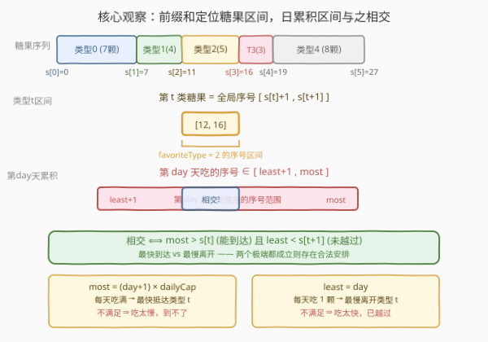
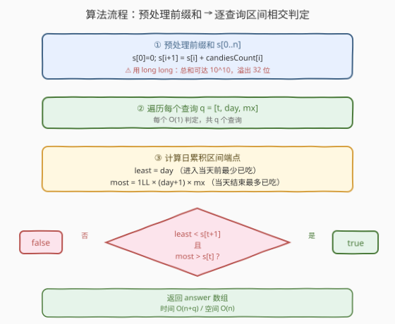
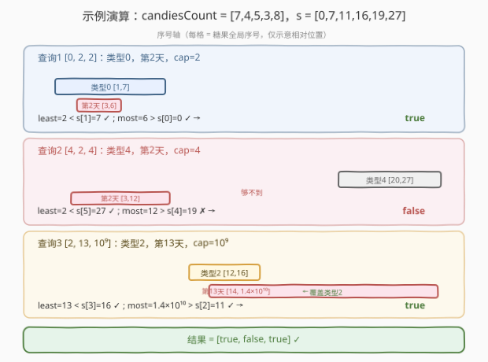

# 你能在你最喜欢的那天吃到你最喜欢的糖果吗？

- **题目名称**：你能在你最喜欢的那天吃到你最喜欢的糖果吗？
- **链接**：[1744. 你能在你最喜欢的那天吃到你最喜欢的糖果吗？](https://leetcode.cn/problems/can-you-eat-your-favorite-candy-on-your-favorite-day/)
- **难度**：中等
- **标签**：数组、前缀和

## 1. 题目概述

给你一个下标从 $0$ 开始的正整数数组 `candiesCount`，其中 `candiesCount[i]` 表示你拥有的第 $i$ 类糖果的数目。同时给你一个二维数组 `queries`，其中 `queries[i] = [favoriteType_i, favoriteDay_i, dailyCap_i]`。

你按照如下规则进行一场游戏：

- 你从第 $0$ 天开始吃糖果。
- 你在吃完**所有**第 $i-1$ 类糖果之前，**不能**吃任何一颗第 $i$ 类糖果（必须按类型顺序吃）。
- 在吃完所有糖果之前，你必须每天**至少**吃**一颗**糖果。
- 每天吃糖果的数量**不超过** `dailyCap_i` 颗。
- 注意：只要满足第二条规则，你可以在同一天吃不同类型的糖果（即在跨越类型边界的那天，可以同时吃前一类尾巴和后一类头部）。

对每个查询 `queries[i]`，判断在上述限制下能否在第 `favoriteDay_i` 天吃到第 `favoriteType_i` 类糖果，返回布尔数组 `answer`。

**示例 1**：

```text
输入：candiesCount = [7,4,5,3,8], queries = [[0,2,2],[4,2,4],[2,13,1000000000]]
输出：[true,false,true]
解释：
1. 第 0 天吃 2 颗（类型 0），第 1 天吃 2 颗（类型 0），第 2 天仍可吃到类型 0 的糖果 → true
2. 每天最多 4 颗，第 0、1 天共吃 8 颗（吃完类型 0、1 及部分类型 2），第 2 天最早只能到类型 2，到不了类型 4 → false
3. 每天吃 1 颗，前 7+4=11 颗在 11 天吃完（类型 0、1），第 12~16 天吃类型 2，第 13 天恰在类型 2 区间内 → true
```

**示例 2**：

```text
输入：candiesCount = [5,2,6,4,1], queries = [[3,1,2],[4,10,3],[3,10,100],[4,100,30],[1,3,1]]
输出：[false,true,true,false,false]
```

**约束条件**：

- $1 \le \text{candiesCount.length} \le 10^5$
- $1 \le \text{candiesCount}[i] \le 10^5$
- $1 \le \text{queries.length} \le 10^5$
- $\text{queries}[i].\text{length} = 3$
- $0 \le \text{favoriteType}_i < \text{candiesCount.length}$
- $0 \le \text{favoriteDay}_i \le 10^9$
- $1 \le \text{dailyCap}_i \le 10^9$

> 💡 **关键观察**：糖果按类型顺序排成一条「长队」，每颗糖果有一个全局序号；每天吃一段连续的序号区间。问题转化为：**第 `favoriteDay` 天吃的那一段区间，能否与 `favoriteType` 类糖果占据的序号区间相交**。这是前缀和 + 区间相交的典型模型。

---

## 2. 解题思路

### 2.1 暴力思路：逐天模拟

对每个查询，从第 0 天开始模拟：每天选择吃 $1$ 到 `dailyCap` 颗，逐颗推进类型指针，看第 `favoriteDay` 天是否落在 `favoriteType` 上。问题在于每天吃的数量有 `dailyCap` 种选择，`favoriteDay` 可达 $10^9$，搜索空间巨大，且查询数 $10^5$，完全不可行。

必须跳出「逐颗/逐天」视角，从**累积总量**的角度整体判断。

### 2.2 核心观察：前缀和定位区间 + 日累积区间相交



**第 1 步：用前缀和把「类型」翻译成「全局序号区间」**

把所有糖果按类型顺序拼成一条序列，每颗糖果有一个 $1$ 开始的全局序号。记前缀和 $s[i]$ 为前 $i$ 类糖果的总数（$s[0]=0$），则第 $t$ 类糖果占据的序号区间为：

$$
[s[t]+1,\ s[t+1]]
$$

例如 `candiesCount = [7,4,5,3,8]`，则 $s=[0,7,11,16,19,27]$，类型 2 的糖果序号为 $12 \sim 16$。

**第 2 步：把「第 d 天」翻译成「累积序号区间」**

每天至少吃 $1$ 颗、至多吃 `dailyCap` 颗。因此在第 `day` 天（$0$ 开始计数）：

| 量 | 含义 | 取值范围 |
|----|------|----------|
| `least = day` | **进入第 day 天前**最少已吃的糖果数（前 `day` 天每天吃 $1$ 颗） | 固定下界 |
| `most = (day+1) * dailyCap` | **结束第 day 天时**最多已吃的糖果数（前 `day+1` 天每天吃 `dailyCap` 颗） | 固定上界 |

第 `day` 天实际吃的糖果序号区间是 $[\text{已吃}+1,\ \text{已吃}+\text{当天颗数}]$，它落在 $[\text{least}+1,\ \text{most}]$ 这个范围内。

**第 3 步：区间相交判定**

第 `day` 天能吃到第 $t$ 类糖果，当且仅当「第 `day` 天的序号区间」与「第 $t$ 类糖果的序号区间 $[s[t]+1,\ s[t+1]]$」有交集。由区间相交的充要条件（A 的右端 $\ge$ B 的左端 且 A 的左端 $\le$ B 的右端）：

- **能到达类型 $t$**：当天累积上界 `most` 必须越过类型 $t$ 的起点，即 $\text{most} > s[t]$（否则即使每天吃满 `dailyCap` 也到不了类型 $t$）。
- **尚未越过类型 $t$**：当天累积下界 `least` 必须还没到类型 $t$ 的终点，即 $\text{least} < s[t+1]$（否则即使每天只吃 $1$ 颗也早就把类型 $t$ 吃完了）。

> 💡 **为什么用 `least` 和 `most` 这两个极端值？** 我们要判断的是「**是否存在**一种每天吃糖数量的安排，使第 `day` 天吃到类型 $t$」。让累积量尽量大（每天吃满）能最快抵达类型 $t$——这是「能到达」的最乐观情形；让累积量尽量小（每天吃 $1$）能最慢离开类型 $t$——这是「未越过」的最乐观情形。两个极端都成立，则一定存在一个介于其间的安排让第 `day` 天恰好落在类型 $t$ 区间内。

> ⚠️ **同一天跨类型不影响结论**：题目允许在跨越类型边界的那天同时吃两类糖果。区间相交模型天然涵盖这一情况——只要第 `day` 天的序号区间与类型 $t$ 的序号区间有重叠即可，不要求整天全在类型 $t$ 内。

### 2.3 算法流程图



**步骤**：

1. **预处理前缀和**：$s[0]=0$，$s[i+1]=s[i]+\text{candiesCount}[i]$，得到长度 $n+1$ 的前缀和数组。⚠️ 用 `long long`，因为 $n \le 10^5$ 且每类 $\le 10^5$，总和可达 $10^{10}$，溢出 32 位。
2. **逐查询判定**：对每个 `[t, day, mx]`：
   - `least = day`（进入当天前最少已吃数）
   - `most = (long long)(day + 1) * mx`（当天结束时最多已吃数，⚠️ 乘积可达 $(10^9+1)\times 10^9 \approx 10^{18}$，必须用 64 位）
   - `answer[i] = (least < s[t+1]) && (most > s[t])`
3. 返回 `answer`。

### 2.4 示例演算



以 `candiesCount = [7,4,5,3,8]` 为例，前缀和 $s=[0,7,11,16,19,27]$。

**查询 1**：`[0, 2, 2]`（类型 0，第 2 天，每天最多 2 颗）

| 量 | 计算 | 值 |
|----|------|----|
| `least` | `day = 2` | $2$ |
| `most` | `(2+1)*2` | $6$ |
| 类型 0 区间 | `[s[0]+1, s[1]] = [1, 7]` | $[1,7]$ |
| 判定 | `least < s[1]` → $2<7$ ✓；`most > s[0]` → $6>0$ ✓ | **true** |

直观验证：第 0、1 天各吃 2 颗（序号 1-4，类型 0），第 2 天吃序号 5（类型 0），确实吃到类型 0。

**查询 2**：`[4, 2, 4]`（类型 4，第 2 天，每天最多 4 颗）

| 量 | 计算 | 值 |
|----|------|----|
| `least` | `day = 2` | $2$ |
| `most` | `(2+1)*4` | $12$ |
| 类型 4 区间 | `[s[4]+1, s[5]] = [20, 27]` | $[20,27]$ |
| 判定 | `least < s[5]` → $2<27$ ✓；`most > s[4]` → $12>20$ ✗ | **false** |

直观验证：即使每天吃满 4 颗，3 天最多吃 12 颗，到不了序号 20（类型 4 起点），故第 2 天吃不到类型 4。

**查询 3**：`[2, 13, 1000000000]`（类型 2，第 13 天，每天最多 $10^9$ 颗）

| 量 | 计算 | 值 |
|----|------|----|
| `least` | `day = 13` | $13$ |
| `most` | `(13+1)*10^9` | $1.4\times 10^{10}$ |
| 类型 2 区间 | `[s[2]+1, s[3]] = [12, 16]` | $[12,16]$ |
| 判定 | `least < s[3]` → $13<16$ ✓；`most > s[2]` → $1.4\times 10^{10} > 11$ ✓ | **true** |

直观验证：每天只吃 1 颗，前 11 天吃完类型 0、1（序号 1-11），第 12 天起吃类型 2（序号 12-16），第 13 天吃序号 13，恰为类型 2。✓

---

## 3. 参考代码

### C++

```cpp
using ll = long long;

class Solution {
public:
    vector<bool> canEat(vector<int>& candiesCount, vector<vector<int>>& queries) {
        int n = candiesCount.size();
        // 前缀和：s[t] = 前 t 类糖果总数，s[0] = 0
        vector<ll> s(n + 1, 0);
        for (int i = 0; i < n; ++i) {
            s[i + 1] = s[i] + candiesCount[i];
        }

        vector<bool> ans;
        ans.reserve(queries.size());
        for (auto& q : queries) {
            int t = q[0], day = q[1], mx = q[2];
            // 进入第 day 天前最少已吃 day 颗；当天结束时最多已吃 (day+1)*mx 颗
            ll least = day;
            ll most = 1LL * (day + 1) * mx;
            // 区间相交：能到达类型 t（most > s[t]）且未越过类型 t（least < s[t+1]）
            ans.emplace_back(least < s[t + 1] && most > s[t]);
        }
        return ans;
    }
};
```

### Python

```python
class Solution:
    def canEat(self, candiesCount: List[int], queries: List[List[int]]) -> List[bool]:
        # 前缀和：s[t] = 前 t 类糖果总数，s[0] = 0
        s = list(accumulate(candiesCount, initial=0))
        ans = []
        for t, day, mx in queries:
            # 进入第 day 天前最少已吃 day 颗；当天结束时最多已吃 (day+1)*mx 颗
            least = day
            most = (day + 1) * mx
            # 区间相交：能到达类型 t（most > s[t]）且未越过类型 t（least < s[t+1]）
            ans.append(least < s[t + 1] and most > s[t])
        return ans
```

> ⚠️ **溢出陷阱**：C++ 中 `(day + 1) * mx` 两个操作数都是 `int`，先按 32 位相乘再赋值会溢出（$10^9 \times 10^9$ 远超 `INT_MAX`）。必须显式提升为 `1LL * (day + 1) * mx` 或将操作数先存入 `ll` 变量。Python 原生大整数无此问题。前缀和 $s$ 同理：$10^5 \times 10^5 = 10^{10}$ 超 32 位，故 C++ 用 `vector<ll>`。

---

## 4. 复杂度分析

| 维度 | 复杂度 | 说明 |
|------|--------|------|
| 时间复杂度 | $O(n + q)$ | 预处理前缀和 $O(n)$；逐查询 $O(1)$ 判定共 $O(q)$，$n$ 为糖果类型数，$q$ 为查询数 |
| 空间复杂度 | $O(n)$ | 前缀和数组 $s$ 长度 $n+1$；答案数组 $O(q)$ 不计 |

> 💡 **为何是 $O(1)$ 单查询？** 每个查询只做两次比较 `least < s[t+1]` 和 `most > s[t]`，前缀和已预处理，无需遍历糖果。这正是前缀和将「区间查询」从 $O(n)$ 降到 $O(1)$ 的威力——承接 [303. 区域和检索 - 数组不可变](../0301-0400/303_区域和检索 - 数组不可变.md) 的同款思想。

---

## 5. 扩展：边界与正确性细节

### 5.1 为什么 `least = day` 而非 `day + 1`？

`least` 表示**进入第 `day` 天之前**已吃的最少糖果数。第 `day` 天之前共有 `day` 个完整的天（第 $0$ 到第 $\text{day}-1$ 天），每天至少吃 $1$ 颗，故至少已吃 `day` 颗。例如 `day = 0` 时 `least = 0`（第 0 天开始前没吃过任何糖果），`day = 2` 时 `least = 2`（前两天至少各吃 1 颗）。

而 `most = (day + 1) * dailyCap` 表示**第 `day` 天结束时**已吃的最多糖果数，因为到第 `day` 天结束共经历了 `day + 1` 个天（第 $0$ 到第 $\text{day}$ 天）。

### 5.2 同一天跨越类型边界

题目特别说明「可以在同一天吃不同类型的糖果」。例如某天吃了 4 颗，其中 1 颗是类型 $t-1$ 的最后一颗、3 颗是类型 $t$ 的前三颗。区间相交模型天然涵盖：只要第 `day` 天的序号区间 $[\text{least}+1,\ \text{most}]$ 与类型 $t$ 的序号区间 $[s[t]+1,\ s[t+1]]$ 相交即可，不要求整天全部属于类型 $t$。

### 5.3 「至少吃一颗」规则的作用

规则要求「吃完所有糖果前每天至少吃 1 颗」。这保证 `least = day` 是合法下界（不能更少）。若没有此规则，理论上可以某天吃 0 颗拖延到更晚，`least` 就不再成立。本题的「至少 1 颗」恰好让最小累积量可计算且固定。

---

## 6. 面试要点

**Q1：为什么用前缀和？前缀和在这里解决了什么问题？**

> 把「第 $t$ 类糖果」从类型下标翻译成全局序号区间 $[s[t]+1, s[t+1]]$，使「能否在第 `day` 天吃到类型 $t$」转化为两个区间是否相交。没有前缀和，每次查询都需累加前 $t$ 类的数量，单查询 $O(n)$，$q$ 次查询 $O(nq)$ 会超时。

**Q2：`least` 和 `most` 的物理含义是什么？为什么用极端值？**

> `least = day` 是进入第 `day` 天前最少已吃的糖果数（每天吃 1 颗），`most = (day+1)*dailyCap` 是当天结束时最多已吃的糖果数（每天吃满）。我们要判断的是「**存在性**」——是否存在一种每天吃糖数量的安排使第 `day` 天吃到类型 $t$。用最乐观的「最快到达」和「最慢离开」两个极端，若两者都满足，则必存在一个安排让第 `day` 天落在类型 $t$ 区间内。

**Q3：两个条件分别失败意味着什么？**

> `most <= s[t]`（即 `(day+1)*dailyCap <= s[t]`）意味着即使每天吃满 `dailyCap` 颗，到第 `day` 天结束也到不了类型 $t$ 的起点——吃得太慢。`least >= s[t+1]`（即 `day >= s[t+1]`）意味着即使每天只吃 1 颗，到第 `day` 天前也已把类型 $t$ 全部吃完——吃得太快。两种情况都无法在第 `day` 天吃到类型 $t$。

**Q4：为什么 C++ 必须用 `long long`？哪些地方会溢出？**

> 两处：①前缀和 $s$：$n \le 10^5$ 且每类 $\le 10^5$，总和达 $10^{10}$，超 `INT_MAX`（约 $2.1\times 10^9$）；②`most = (day+1)*mx`：`day` 和 `mx` 都可达 $10^9$，乘积约 $10^{18}$，超 `INT_MAX`。C++ 中 `int * int` 先按 32 位运算再赋值，故须写 `1LL * (day + 1) * mx` 先提升类型。

**Q5：如果去掉「每天至少吃一颗」的规则，算法还成立吗？**

> 不成立。`least = day` 依赖「每天至少吃 1 颗」这一下界。若允许某天吃 0 颗，则进入第 `day` 天前的最少累积量可以是任意 $< \text{day}$ 的值（甚至 $0$，若前几天都吃 0），`least` 不再是固定下界，需要重新建模。本题该规则保证了累积量下界可计算。

> 💡 **一句话总结**：前缀和把类型翻译成全局序号区间 $[s[t]+1, s[t+1]]$，把第 `day` 天翻译成累积区间 $[\text{least}+1, \text{most}]$，两者相交即 `least < s[t+1] && most > s[t]`——$O(1)$ 单查询，注意 64 位溢出。

---

## 7. 同类练习题

- [303. 区域和检索 - 数组不可变](https://leetcode.cn/problems/range-sum-query-immutable/)（[题解](../0301-0400/303_区域和检索 - 数组不可变.md)）：前缀和母题，将区间和查询从 $O(n)$ 降到 $O(1)$，本题同款预处理思想
- [528. 按权重随机选择](https://leetcode.cn/problems/random-pick-with-weight/)（[题解](../0501-0600/528_按权重随机选择.md)）：前缀和把权重翻译成区间，再二分定位落点，与本题「前缀和定位区间」同源
- [1109. 航班预订统计](https://leetcode.cn/problems/corporate-flight-bookings/)（[题解](../1101-1200/1109_航班预订统计.md)）：差分与前缀和互逆，对照「前缀和用于查询、差分用于更新」的对称关系
- [1480. 一维数组的动态和](https://leetcode.cn/problems/running-sum-of-1d-array/)：前缀和的入门练习，$s[i+1]=s[i]+\text{nums}[i]$ 的同款递推
- [2250. 统计包含每个点的矩形数目](https://leetcode.cn/problems/count-number-of-rectangles-containing-each-point/)：二维前缀/排序 + 区间计数，对照前缀和在「区间与点关系判定」上的进阶应用
