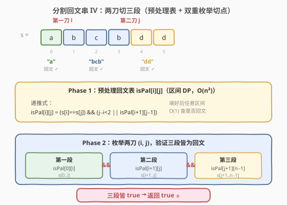
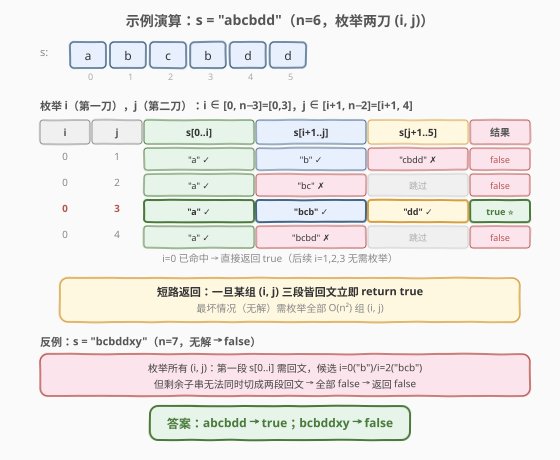
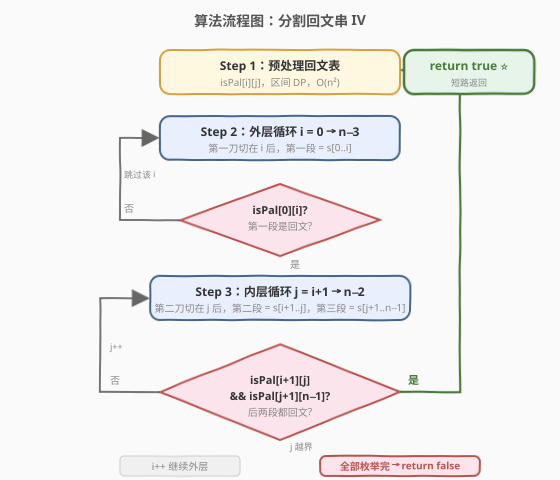

# LeetCode 分割回文串 IV 题解

## 1. 题目概述

- **标题 / 题号**：分割回文串 IV（#1745，hard）
- **链接**：https://leetcode.cn/problems/palindrome-partitioning-iv/
- **难度**：困难
- **标签**：字符串、动态规划

**题意**：给你一个字符串 `s`，如果可以将它分割成**三个非空回文子字符串**，那么返回 `true`，否则返回 `false`。

当一个字符串正着读和反着读一模一样时，称其为**回文字符串**。

**示例 1**：

```text
输入：s = "abcbdd"
输出：true
解释："abcbdd" = "a" + "bcb" + "dd"，三个子字符串都是回文的。
```

**示例 2**：

```text
输入：s = "bcbddxy"
输出：false
解释：s 没办法被分割成 3 个回文子字符串。
```

**约束**：

- `3 <= s.length <= 2000`
- `s` 只包含小写英文字母

> ⚠️ 本题要求**恰好切两刀分成三段**且每段都是回文，是 [132. 分割回文串 II](../0101-0200/132_分割回文串II.md)（求最少分割次数）的「定段数判定」变体。段数固定为 3，因此无需最小化，只需判定可行性——预处理一张回文表后双重枚举切点即可。

## 2. 解题思路

### 2.1 暴力思路：枚举所有两刀位置

长度为 $n$ 的字符串有 $n-1$ 个间隙，选其中 2 个作为切点共有 $\binom{n-1}{2} = O(n^2)$ 种方案。对每种方案，逐段用双指针判定回文需 $O(n)$，总复杂度 $O(n^3)$。当 $n = 2000$ 时约 $8 \times 10^9$ 次运算，会超时。

### 2.2 核心观察：预处理回文表 + 双重枚举切点



本题的关键观察：**「判断任意子串是否回文」这件事会被反复用到**。与其每次双指针 $O(n)$ 判定，不如一次性预处理成表，之后 $O(1)$ 查询。这正是 [132. 分割回文串 II](../0101-0200/132_分割回文串II.md) 的同款「**辅助预处理 + 主逻辑**」范式。

> 💡 把反复使用的中间信息先算好缓存起来，是字符串 DP 的通用套路。回文表一旦建好，本题、132、131 都能复用。

**Phase 1：预处理回文表** `isPal[i][j]`

定义 `isPal[i][j]` 表示 `s[i..j]` 是否为回文串。递推式：

$$
isPal[i][j] = (s[i] = s[j]) \land (j - i < 2 \lor isPal[i+1][j-1])
$$

- $j - i < 2$ 覆盖长度为 1（单字符）和 2（两字符相同）的 base case。
- 长度 $\geq 3$ 时，两端字符相同且中间子串也是回文。
- **填表顺序**：按子串长度从小到大（len=1 → 2 → 3 → …），或等价地 $i$ 从 $n-1$ 到 0、$j$ 从 $i$ 到 $n-1$，保证查 `isPal[i+1][j-1]` 时已填好。

**Phase 2：双重枚举切点 (i, j)**

两刀把 `s` 分成三段：

| 段 | 区间 | 回文条件 |
|----|------|----------|
| 第一段 | `s[0..i]` | `isPal[0][i]` |
| 第二段 | `s[i+1..j]` | `isPal[i+1][j]` |
| 第三段 | `s[j+1..n-1]` | `isPal[j+1][n-1]` |

为保证三段都非空：

- 第一段至少 1 个字符 → $i \geq 0$
- 第二段至少 1 个字符 → $j \geq i + 1$
- 第三段至少 1 个字符 → $j + 1 \leq n - 1$，即 $j \leq n - 2$

因此枚举范围：$i \in [0,\, n-3]$，$j \in [i+1,\, n-2]$。对每组 $(i, j)$ 检查三段是否都回文，命中即返回 `true`。

### 2.3 示例演算



以 `s = "abcbdd"`（$n=6$）为例，枚举 $i \in [0, 3]$、$j \in [i+1, 4]$：

| i | j | 第一段 `s[0..i]` | 第二段 `s[i+1..j]` | 第三段 `s[j+1..5]` | 结果 |
|---|---|------------------|---------------------|---------------------|------|
| 0 | 1 | `"a"` ✓ | `"b"` ✓ | `"cbdd"` ✗ | false |
| 0 | 2 | `"a"` ✓ | `"bc"` ✗ | — | false |
| **0** | **3** | **`"a"` ✓** | **`"bcb"` ✓** | **`"dd"` ✓** | **true ⭐** |
| 0 | 4 | `"a"` ✓ | `"bcbd"` ✗ | — | false |

- **i=0, j=3** 命中：`"a"` + `"bcb"` + `"dd"` 三段皆回文，立即返回 `true`，后续 $i=1,2,3$ 无需枚举（短路返回）。
- 反例 `s = "bcbddxy"`（$n=7$）：第一段 `s[0..i]` 为回文的候选 $i=0$（`"b"`）或 $i=2$（`"bcb"`），但剩余子串无法同时切成两段回文，全部失败 → 返回 `false`。

### 2.4 算法流程图



流程要点：
1. **Phase 1** 填回文表，$O(n^2)$。
2. **Phase 2** 双重循环枚举 $(i, j)$：外层先固定第一刀 $i$，若 `isPal[0][i]` 为 false 直接跳过（剪枝）；为 true 则内层枚举第二刀 $j$，检查后两段是否都回文。
3. 一旦某组 $(i, j)$ 三段皆回文，**短路返回** `true`；全部枚举完无解则返回 `false`。

> 💡 **剪枝**：外层先判 `isPal[0][i]`，为 false 时直接 `continue`，避免无意义地进入内层循环。同理内层可先判 `isPal[i+1][j]`，为 false 时跳过第三段判定。

## 3. 参考代码

### C++

```cpp
class Solution {
public:
    bool checkPartitioning(string s) {
        int n = s.size();
        // Phase 1: 预处理回文表
        vector<vector<char>> isPal(n, vector<char>(n, 0));
        for (int i = n - 1; i >= 0; --i) {
            for (int j = i; j < n; ++j) {
                isPal[i][j] = (s[i] == s[j]) &&
                              (j - i < 2 || isPal[i + 1][j - 1]);
            }
        }
        // Phase 2: 枚举两刀 (i, j)
        // 第一段 s[0..i]，第二段 s[i+1..j]，第三段 s[j+1..n-1]
        for (int i = 0; i <= n - 3; ++i) {
            if (!isPal[0][i]) continue;            // 第一段非回文，剪枝
            for (int j = i + 1; j <= n - 2; ++j) {
                if (isPal[i + 1][j] && isPal[j + 1][n - 1]) {
                    return true;                   // 三段皆回文
                }
            }
        }
        return false;
    }
};
```

### Python

```python
class Solution:
    def checkPartitioning(self, s: str) -> bool:
        n = len(s)
        # Phase 1: 预处理回文表
        isPal = [[False] * n for _ in range(n)]
        for i in range(n - 1, -1, -1):
            for j in range(i, n):
                isPal[i][j] = (s[i] == s[j]) and \
                              (j - i < 2 or isPal[i + 1][j - 1])
        # Phase 2: 枚举两刀 (i, j)
        for i in range(n - 2):                     # i ∈ [0, n-3]
            if not isPal[0][i]:
                continue                           # 第一段非回文，剪枝
            for j in range(i + 1, n - 1):          # j ∈ [i+1, n-2]
                if isPal[i + 1][j] and isPal[j + 1][n - 1]:
                    return True
        return False
```

> 💡 **边界对照**：C++ 中 `i <= n - 3` 与 Python 中 `range(n - 2)`（上界不含）等价，都保证第一段至少 1 字符、第三段至少 1 字符。`n = 3` 时 `i = 0`、`j = 1` 唯一一组，三段各 1 字符必为回文，返回 `true`——与「3 个单字符必是回文」的直觉一致。

## 4. 复杂度分析

| 维度 | 复杂度 | 说明 |
|------|--------|------|
| 时间复杂度 | $O(n^2)$ | Phase 1 填表 $O(n^2)$ + Phase 2 双重枚举切点 $O(n^2)$，查询每次 $O(1)$ |
| 空间复杂度 | $O(n^2)$ | 回文表 `isPal` 占 $O(n^2)$ |

> 💡 $n = 2000$ 时 `isPal` 约 $4 \times 10^6$ 字节（`char` 版）≈ 4MB，可接受。双重枚举最坏 $\binom{n}{2} \approx 2 \times 10^6$ 次，每次两次 $O(1)$ 查表，总量级在毫秒级。

## 5. 扩展：中心扩展省去回文表（O(n) 空间）

若要求更优空间，可用**中心扩展**在枚举切点时动态判定回文，省去 $O(n^2)$ 的 `isPal` 表。但本题 $n \leq 2000$，$O(n^2)$ 空间完全可接受，预处理表实现最直观、最不易出错，**面试推荐写预处理表版本**。

另一种思路是预计算两个一维数组：`left[i] = isPal[0][i]`（第一段可行终点）与 `right[j] = isPal[j][n-1]`（第三段可行起点），再枚举中段 `[i+1..j-1]` 用中心扩展判定。这样空间 $O(n)$，但仍需 $O(n^2)$ 时间枚举中段，复杂度不变，仅空间优化。对本题而言收益有限，了解即可。

## 6. 面试要点

1. **1745 和 132 的核心区别是什么？**

   - 132 求**最少分割次数**（最优值），段数不固定，需用 DP 逐位置推导最小刀数。
   - 1745 要求**恰好分成 3 段**（可行性判定），段数固定，只需枚举两刀位置并验证三段回文。两者共用同一张回文预处理表，但主逻辑不同：132 是 DP，1745 是双重枚举。

2. **为什么需要预处理回文表？**

   - 枚举 $(i, j)$ 共 $O(n^2)$ 组，每组需判定三段是否回文。若不预处理，每次双指针判定 $O(n)$，总复杂度退化为 $O(n^3)$，$n = 2000$ 时超时。预处理后每次查询 $O(1)$，总复杂度 $O(n^2)$。

3. **切点 $i, j$ 的枚举范围如何确定？**

   - 第一段 `s[0..i]` 非空 → $i \geq 0$；第三段 `s[j+1..n-1]` 非空 → $j \leq n-2$；第二段 `s[i+1..j]` 非空 → $j \geq i+1$。综合得 $i \in [0, n-3]$，$j \in [i+1, n-2]$。$n=3$ 时仅 $(0,1)$ 一组。

4. **回文表的填表顺序为什么是按长度递增？**

   - `isPal[i][j]`（长度 $L = j - i + 1$）依赖 `isPal[i+1][j-1]`（长度 $L - 2$）。只有先填完更短的子串，才能正确推导更长的。代码中按 $i$ 从大到小、$j$ 从小到大遍历，等价于按长度递增。

5. **能否在命中时提前返回？有什么剪枝？**

   - 可以。一旦某组 $(i, j)$ 三段皆回文立即 `return true`，最坏情况（无解）才枚举全部 $O(n^2)$ 组。剪枝：外层先判 `isPal[0][i]`，为 false 直接跳过内层；内层先判 `isPal[i+1][j]`，为 false 时第三段也无需查。

## 同类练习题

| # | 题目 | 与本题的关联 |
|---|------|-------------|
| 132 | [分割回文串 II](https://leetcode.cn/problems/palindrome-partitioning-ii/)（[题解](../0101-0200/132_分割回文串II.md)） | 求最少分割次数，共用回文预处理表，主逻辑为最小切割 DP |
| 131 | [分割回文串](https://leetcode.cn/problems/palindrome-partitioning/)（[题解](../0101-0200/131_分割回文串.md)） | 枚举所有分割方案，回溯 + 回文预处理表 |
| 1278 | [分割回文串 III](https://leetcode.cn/problems/palindrome-partitioning-iii/) | 允许修改字符使分段回文，求最小修改次数（区间 DP + 分组 DP） |
| 2472 | [不重叠回文子字符串的最大数目](https://leetcode.cn/problems/maximum-number-of-non-overlapping-palindrome-substrings/) | 回文预处理表 + 贪心/DP 选不重叠回文子串 |
| 5 | [最长回文子串](https://leetcode.cn/problems/longest-palindromic-substring/)（[题解](../0001-0100/5_最长回文子串.md)） | 同样的回文预处理 / 中心扩展模板 |
