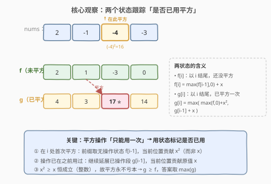
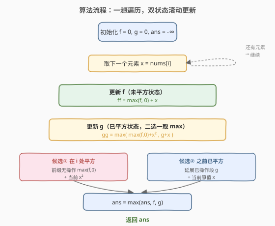

# 经过一次操作后的最大子数组和

- **题目名称**：经过一次操作后的最大子数组和
- **链接**：[1746. 经过一次操作后的最大子数组和](https://leetcode.cn/problems/maximum-subarray-sum-after-one-operation/)
- **难度**：中等
- **标签**：数组、动态规划

## 1. 题目概述

你有一个整数数组 `nums`。你**只能**将一个元素 `nums[i]` 替换为 `nums[i] * nums[i]`（即对某一处做一次平方）。返回替换后的**最大子数组和**。

**示例 1**：

```text
输入：nums = [2,-1,-4,-3]
输出：17
解释：把 -4 替换为 16（(-4)×(-4)），使 nums = [2,-1,16,-3]。
      最大子数组和为 2 + (-1) + 16 = 17。
```

**示例 2**：

```text
输入：nums = [1,-1,1,1,-1,-1,1]
输出：4
解释：把第一个 -1 替换为 1，使 nums = [1,1,1,1,-1,-1,1]。
      最大子数组和为 1 + 1 + 1 + 1 = 4。
```

**约束条件**：

- $1 \le \text{nums.length} \le 10^5$
- $-10^4 \le \text{nums[i]} \le 10^4$

> 💡 **关键约束**：平方操作**只能用一次**。这与普通「最大子数组和」（[53](../0001-0100/53_最大子数组和.md)）的区别在于多了一个「是否已用掉这次操作」的状态维度——正是这个维度把一维 Kadane 升级成了带状态机的滚动 DP，承接 [152. 乘积最大子数组](../0101-0200/152_乘积最大子数组.md)「同时维护两个状态」的套路。

---

## 2. 解题思路

### 2.1 暴力思路：枚举平方位置 + Kadane

最直观的做法是：枚举每个位置 `i` 作为平方点，把 `nums[i]` 替换成 `nums[i]²` 后对整个数组跑一遍 Kadane 求最大子数组和，最后取所有方案的最大值。

```text
ans = -inf
for i in range(n):
    nums[i] = nums[i] * nums[i]        # 平方第 i 个
    ans = max(ans, kadane(nums))       # O(n) 求最大子数组和
    nums[i] = nums[i] // nums[i] ...   # 还原（需特判 0）
```

时间复杂度 $O(n^2)$，在 $n = 10^5$ 时**严重超时**。

> ⚠️ **暴力法的瓶颈**：每次只改一个元素却对全数组重跑 Kadane，大量计算是重复的。其实「平方点是否落在当前子数组内」可以用一个状态标记来追踪，无需反复扫描。

### 2.2 核心观察：双状态滚动 DP（Kadane + 状态机）



把普通 Kadane 的单个状态「以 `i` 结尾的最大子数组和」**拆成两个状态**，标记平方操作是否已被用掉：

- $f[i]$：以 `nums[i]` 结尾、**尚未使用**平方操作的最大子数组和；
- $g[i]$：以 `nums[i]` 结尾、**已经使用**了（恰好一次）平方操作的最大子数组和。

**状态转移**：

$$
f[i] = \max(f[i-1],\ 0) + \text{nums}[i]
$$

$$
g[i] = \max\big(\ \max(f[i-1],\ 0) + \text{nums}[i]^2,\ \ g[i-1] + \text{nums}[i]\ \big)
$$

> 💡 **$g[i]$ 的两个候选各代表什么？**
> - **候选① `max(f[i-1], 0) + nums[i]²`**：平方操作**就在 `i` 处使用**。此时前缀（以 `i-1` 结尾）还没用过操作，取无操作状态 $f[i-1]$（负则掐断取 0），当前位贡献 $x^2$ 而非 $x$。这是「跨态」转移：$f \to g$。
> - **候选② `g[i-1] + nums[i]`**：平方操作**已在之前用过**，当前位只能按原值 $x$ 延展已操作段。这是「同态」转移：$g \to g$。

**为何 $x^2 \ge x$ 恒成立？** 对任意整数 $x$：$x \in \{0, 1\}$ 时 $x^2 = x$；$x = -1$ 时 $x^2 = 1 > -1$；$|x| \ge 2$ 时 $x^2 > |x| \ge x$。因此**平方永不亏本**，$g[i] \ge f[i]$ 恒成立，最终答案取 $\max_i g[i]$ 即可（实现中取 $\max(f, g)$ 更稳妥）。

由于 $f[i]$、$g[i]$ 只依赖 $i-1$，可用两个变量滚动，空间压到 $O(1)$。

### 2.3 算法流程图



**步骤**：

1. **初始化** `f = 0, g = 0, ans = -∞`（用 0 而非 `nums[0]` 作为起点，配合 `max(f, 0)` 自然处理「掐断重启」）。
2. **遍历**每个元素 `x = nums[i]`：
   - `ff = max(f, 0) + x`（更新无操作状态）；
   - `gg = max(max(f, 0) + x*x, g + x)`（更新已操作状态，二选一取 max）；
   - `ans = max(ans, ff, gg)`；
   - `f, g = ff, gg`（滚动赋值）。
3. **返回** `ans`。

> ⚠️ **为何用临时变量 `ff`、`gg`？** `gg` 的计算依赖 `f` 的**旧值**（候选①用到 `max(f, 0)`），若先更新 `f` 再算 `g`，候选①会拿到新 `f` 导致错误。用 `ff`、`gg` 暂存再统一赋值，与 [152](../0101-0200/152_乘积最大子数组.md) 的 `a`、`b` 暂存技巧同源。

### 2.4 示例演算

![示例演算：nums = [2,-1,-4,-3] 逐步跟踪](../images/maxsum_after_op_walkthrough.svg)

以示例 1 `nums = [2,-1,-4,-3]` 为例，跟踪 `f`、`g`、`ans` 的滚动过程：

| $i$ | $x$ | $f$（未平方） | $g$（已平方） | ans | 说明 |
|-----|-----|---------------|---------------|-----|------|
| 0 | 2   | 2  | 4  | 4  | $f=0+2$；$g=0+2^2=4$ |
| 1 | -1  | 1  | 3  | 4  | $f=\max(2,0)-1=1$；$g=\max(2+1,\ 4-1)=3$ |
| 2 | -4  | -3 | **17** ⭐ | **17** | $f=\max(1,0)-4=-3$；$g=\max(1+16,\ 3-4)=17$ |
| 3 | -3  | 0  | 14 | 17 | $f=\max(-3,0)-3=0$；$g=\max(-3+9,\ 17-3)=14$ |

**关键在 $i=2$**：候选①「在此处平方」给出 $1 + (-4)^2 = 17$（前缀无操作段 $[2,-1]$ 的和为 1，加上 $(-4)^2=16$），远超候选②的 $3 + (-4) = -1$。最终答案 **17** 来自子数组 $[2, -1, 16]$（即将 $-4$ 平方为 16）。

> 💡 **对比示例 2**：`nums = [1,-1,1,1,-1,-1,1]`，在 $i=1$ 处把 $-1$ 平方为 1，得到 $g$ 的最优值 4（子数组 $[1,1,1,1]$）。可见平方**负数**收益最大（$-1 \to 1$ 翻倍变正），而平方正数收益较小——但无论平方正负，$x^2 \ge x$ 保证不亏。

---

## 3. 参考代码

### C++

```cpp
class Solution {
  public:
    int maxSumAfterOperation(vector<int>& nums) {
        int f = 0, g = 0;          // f=未平方, g=已平方（滚动变量）
        int ans = INT_MIN;
        for (int x : nums) {
            int ff = max(f, 0) + x;                       // 无操作状态
            int gg = max(max(f, 0) + x * x, g + x);       // 已操作状态：在此平方 or 延展
            f = ff;
            g = gg;
            ans = max({ans, f, g});
        }
        return ans;
    }
};
```

### Python

```python
class Solution:
    def maxSumAfterOperation(self, nums: List[int]) -> int:
        f = g = 0                   # f=未平方, g=已平方（滚动变量）
        ans = float('-inf')
        for x in nums:
            ff = max(f, 0) + x                       # 无操作状态
            gg = max(max(f, 0) + x * x, g + x)       # 已操作状态：在此平方 or 延展
            f, g = ff, gg
            ans = max(ans, f, g)
        return ans
```

> ⚠️ **易错点**：`gg` 的候选①用到 `max(f, 0)` 必须是**更新前**的 `f`。上面代码先用 `ff`、`gg` 暂存，最后统一 `f, g = ff, gg` 赋值，保证两个状态基于同一轮旧值——与 [152. 乘积最大子数组](../0101-0200/152_乘积最大子数组.md) 用 `a`、`b` 暂存乘积是同一手法。

---

## 4. 复杂度分析

| 维度 | 复杂度 | 说明 |
|------|--------|------|
| 时间复杂度 | $O(n)$ | 只遍历数组一次，每步 $O(1)$ 的比较与乘法 |
| 空间复杂度 | $O(1)$ | 仅用 `f`、`g`、`ans` 三个滚动变量，无额外数组 |

> 💡 **与暴力 $O(n^2)$ 的本质区别**：暴力对每个平方点重跑 Kadane，重复计算了 $n$ 遍；双状态 DP 把「平方点在哪」编码进状态 $g$，一趟遍历同时考虑所有可能的平方位置，用 $O(1)$ 状态信息替代了 $O(n)$ 次重复扫描。

---

## 5. 扩展：可推广的「带一次特权操作」套路

本题的「双状态滚动 DP」可推广到一类问题：**在标准 Kadane / 背包 / 路径 DP 上叠加一次特权操作**（替换、删除、免费跳过等）。通用模板：

1. 定义 $f[i]$ 为**未用特权**的最优值，$g[i]$ 为**已用特权**的最优值。
2. $f[i]$ 按原问题递推（特权未介入）。
3. $g[i]$ 取两候选的 $\max$：
   - **在 $i$ 处首次使用特权**：从 $f[i-1]$ 跨态转移，当前位按特权后的值贡献；
   - **特权已在之前用掉**：从 $g[i-1]$ 同态转移，当前位按原值贡献。
4. 答案取 $\max_i g[i]$（或 $\max(f, g)$）。

**典型变体**：

- **至多删一个元素的最大子数组和**：$g[i] = \max(f[i-1],\ g[i-1] + \text{nums}[i])$（删除等同于「特权：跳过某元素一次」）。
- **至多改一个负数为正**：与本题完全同构，$x^2$ 换成 $|x|$ 即可。
- **恰好 $k$ 次特权**：状态扩展为 $g[i][j]$（以 $i$ 结尾、已用 $j$ 次特权），转移同理，时间 $O(nk)$。

> ⚠️ 当特权次数 $k > 1$ 时，需用二维状态或前缀和优化，不能简单套两变量滚动。但「恰好一次」的双状态模板是这类问题的最小可行骨架。

---

## 6. 面试要点

**Q1：为什么不能像普通最大子数组和那样只维护一个状态？**

> 普通最大子数组和（[53](../0001-0100/53_最大子数组和.md)）只有一个选择：延展 or 重启。本题多了一个维度——「平方操作用没用过」，它会影响当前位置的贡献（$x$ 还是 $x^2$）。只维护一个状态无法区分「当前子数组里已经平方过某个元素」和「还没平方」，就可能在同一段里平方两次或漏掉平方机会。

**Q2：$g[i]$ 的两个候选分别对应什么场景？**

> - 候选① `max(f[i-1], 0) + x²`：平方**就在 $i$ 处发生**，前缀是无操作段 $f[i-1]$，当前位贡献 $x^2$。这是 $f \to g$ 的跨态转移，**首次启用特权**。
> - 候选② `g[i-1] + x`：平方在之前已用过，当前位只能按原值 $x$ 延展。这是 $g \to g$ 的同态转移，**特权已耗尽**。

**Q3：为什么答案取 $\max(f, g)$ 而非只取 $\max(g)$？**

> 因为 $x^2 \ge x$ 对任意整数恒成立（$x \in \{0,1\}$ 时相等，其余 $x^2 > x$），所以平方永不亏本，$g[i] \ge f[i]$ 总成立，$\max(g)$ 与 $\max(f, g)$ 等价。实现中取 $\max(f, g)$ 是防御性写法，逻辑更清晰且不依赖这个数学性质。

**Q4：为什么初始 `f = g = 0` 而非 `nums[0]`？**

> 用 0 初始化配合 `max(f, 0) + x` 的写法，可以统一处理「掐断重启」：当 $f < 0$ 时 `max(f, 0) = 0` 相当于从当前位置重新开一段，无需特判第一个元素。`ans` 初始化为 $-\infty$ 保证全负数组也能正确取到最大值。

**Q5：如果题目改成「至多 $k$ 次平方」怎么做？**

> 状态扩展为 $g[i][j]$：以 $i$ 结尾、已用 $j$ 次平方的最大和。转移 $g[i][j] = \max(\max(f[i-1][j], 0)... )$——更准确地，需要 $f[i][j]$（未在第 $i$ 位平方、累计用了 $j$ 次）和 $g[i][j]$（在第 $i$ 位平方、累计用了 $j$ 次）两组状态。时间 $O(nk)$、空间可滚动到 $O(k)$。$k=1$ 时退化为本题的双变量版本。

> 💡 **一句话总结**：在 Kadane 上叠加「一次平方特权」→ 用 $f$（未用）/ $g$（已用）双状态滚动 DP，$g$ 的跨态转移 `max(f,0)+x²` 负责在当前位置首次启用特权，同态转移 `g+x` 负责延展已操作段 → $O(n)$ 时间、$O(1)$ 空间。

---

## 7. 同类练习题

- [53. 最大子数组和](https://leetcode.cn/problems/maximum-subarray/)（[题解](../0001-0100/53_最大子数组和.md)）：**最直接的基石题**——单状态 Kadane，先掌握它再叠加上「特权状态」就是本题；理解 $f[i]$ 的递推正是 53 的原样搬运
- [152. 乘积最大子数组](https://leetcode.cn/problems/maximum-product-subarray/)（[题解](../0101-0200/152_乘积最大子数组.md)）：同样「同时维护两个状态」的滚动 DP（maxP/minP 互换），临时变量暂存旧值的技巧完全同源
- [918. 环形子数组的最大和](https://leetcode.cn/problems/maximum-sum-circular-subarray/)：Kadane 的另一变体（环形），用 `total − min_sum` 处理跨界，与本题的「特权状态」思路互补——一个改数据范围、一个加状态维度
- [1186. 删除一次得到子数组最大和](https://leetcode.cn/problems/maximum-subarray-sum-with-one-deletion/)：**镜像题**——把「平方一次」换成「删除一次」，$g[i] = \max(f[i-1],\ g[i-1] + x)$，双状态模板直接套用，对比理解特权操作的两种形态
