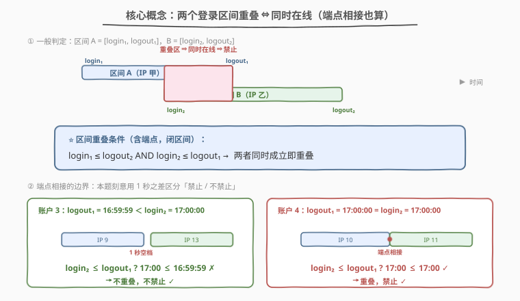
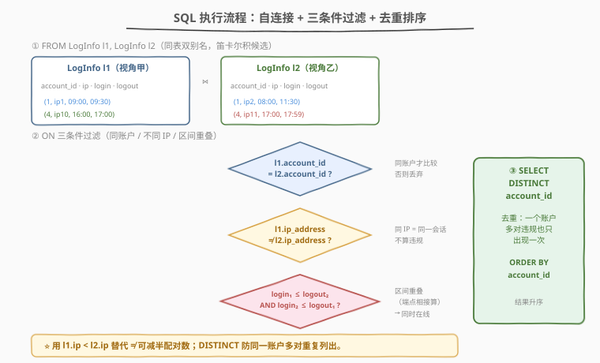
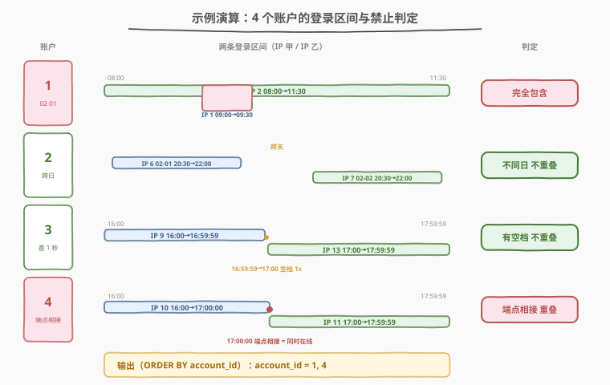

# 应该被禁止的 Leetflex 账户

- **题目名称**：应该被禁止的 Leetflex 账户
- **链接**：[1747. 应该被禁止的 Leetflex 账户](https://leetcode.cn/problems/leetflex-banned-accounts/)
- **难度**：中等
- **标签**：数据库、SQL、自连接、区间重叠、`JOIN`、`DISTINCT`、`datetime`

> ⚠️ **本题是 LeetCode Plus 会员专享题**，官方题面需登录会员查看。下方题面依据平台公开的建表语句与示例数据复原，描述与官方一致。

## 1. 题目概述

给定 `LogInfo` 表，记录用户登录/登出 Leetflex 账户的会话信息：某 `account_id` 从某 `ip_address` 在 `login` 时刻登录、`logout` 时刻登出。**如果一个账户在同一时刻从两个不同的 IP 地址在线**（即存在两条 `account_id` 相同、`ip_address` 不同、且时间区间 `[login, logout]` 重叠的记录），该账户应被禁止。

要求写一个 SQL 查询，返回所有应被禁止账户的 `account_id`，结果按 `account_id` 升序排列。

**表结构**：

```text
Table: LogInfo
+-------------+----------+
| Column Name | Type     |
+-------------+----------+
| account_id  | int      |
| ip_address  | int      |
| login       | datetime |
| logout      | datetime |
+-------------+----------+
该表没有主键，可能包含重复行。
每行包含账户 ID、IP 地址、登录时间和登出时间。
login 为登录时间，logout 为登出时间，且 login < logout。
```

**示例 1**：

```text
输入：
LogInfo 表：
+------------+------------+---------------------+---------------------+
| account_id | ip_address | login               | logout              |
+------------+------------+---------------------+---------------------+
| 1          | 1          | 2021-02-01 09:00:00 | 2021-02-01 09:30:00 |
| 1          | 2          | 2021-02-01 08:00:00 | 2021-02-01 11:30:00 |
| 2          | 6          | 2021-02-01 20:30:00 | 2021-02-01 22:00:00 |
| 2          | 7          | 2021-02-02 20:30:00 | 2021-02-02 22:00:00 |
| 3          | 9          | 2021-02-01 16:00:00 | 2021-02-01 16:59:59 |
| 3          | 13         | 2021-02-01 17:00:00 | 2021-02-01 17:59:59 |
| 4          | 10         | 2021-02-01 16:00:00 | 2021-02-01 17:00:00 |
| 4          | 11         | 2021-02-01 17:00:00 | 2021-02-01 17:59:59 |
+------------+------------+---------------------+---------------------+

输出：
+------------+
| account_id |
+------------+
| 1          |
| 4          |
+------------+

解释：
账户 1：IP 2 的会话 08:00→11:30 完全包含 IP 1 的会话 09:00→09:30，两 IP 同时在线 → 禁止。
账户 2：IP 6 在 02-01、IP 7 在 02-02，跨天不重叠 → 不禁止。
账户 3：IP 9 于 16:59:59 登出，IP 13 于 17:00:00 登录，中间有 1 秒空档，不重叠 → 不禁止。
账户 4：IP 10 于 17:00:00 登出，IP 11 于 17:00:00 登录，端点相接算同时在线 → 禁止。
```

**约束条件**：

- `account_id`、`ip_address` 为整数；`login`、`logout` 为 `datetime` 类型
- 区间为**闭区间** $[\text{login}, \text{logout}]$，**端点相接（一端 `logout` = 另一端 `login`）也算重叠**
- 结果按 `account_id` 升序排列；同一账户多对违规只出现一次

> 💡 本题是 SQL **"自连接 + 区间重叠判定"招牌题**——核心三步：① 自连接把同账户的两条会话配成对；② 用闭区间重叠条件 $a.\text{login} \le b.\text{logout} \land b.\text{login} \le a.\text{logout}$ 筛「同时在线」；③ `DISTINCT` 去重 + `ORDER BY`。难点在端点相接的边界处理：账户 3 用 `16:59:59` 与账户 4 用 `17:00:00` 仅差 1 秒，却决定禁止与否。

---

## 2. 解题思路

### 2.1 暴力思路：逐对比较

最直觉的思路：对每个账户，枚举其所有会话两两配对，检查是否「IP 不同 + 时间重叠」。伪代码：

```text
for each account a:
    sessions = [row for row in LogInfo if row.account_id == a]
    for i < j in sessions:
        if sessions[i].ip != sessions[j].ip
           and overlap(sessions[i], sessions[j]):
            mark a as banned
return sorted(distinct banned accounts)
```

纯 SQL 没有显式双重循环，但「同表两两配对」正是**自连接**（self-join）的天然表达：`LogInfo l1 JOIN LogInfo l2` 一次性产生所有配对，再用 `WHERE`/`ON` 过滤。

### 2.2 核心观察：自连接 + 闭区间重叠



**关键洞察**：判定「同时在线」等价于判定**两个时间区间是否相交**。对闭区间 $A = [\text{login}_1, \text{logout}_1]$ 与 $B = [\text{login}_2, \text{logout}_2]$，相交的充要条件是：

$$\text{login}_1 \le \text{logout}_2 \quad \land \quad \text{login}_2 \le \text{logout}_1$$

> ⚠️ **端点相接算重叠**：当 $\text{logout}_1 = \text{logout}_2 = \text{login}_2$（一端登出时刻 = 另一端登录时刻），上式仍成立（`<=` 取等），即视为同时在线。示例中账户 4（`17:00:00` 登出 = `17:00:00` 登录）因此被禁止。对照账户 3（`16:59:59` 登出 < `17:00:00` 登录），中间有 1 秒空档，条件不成立，不禁止。

**三个过滤条件**缺一不可：

1. **`l1.account_id = l2.account_id`**：只比较同一账户的会话。
2. **`l1.ip_address <> l2.ip_address`**：同 IP 的多条会话是同一地址的续登，不算违规。
3. **区间重叠**：上述闭区间相交公式。

> 💡 **用 `l1.ip_address < l2.ip_address` 代替 `<>` 减半配对**：`<>` 会把同一对会话配两次（(A,B) 和 (B,A)），结果用 `DISTINCT` 虽不影响正确性，但配对数翻倍。改用 `<` 只保留每对的一种顺序，连接代价减半。同理也可加 `l1.login < l2.login` 或限定 `l1.ip_address < l2.ip_address` 避免自配对。

### 2.3 算法流程图



**逻辑执行步骤**：

| 步骤 | 子句 | 作用 |
|------|------|------|
| ① | `FROM LogInfo l1 JOIN LogInfo l2` | 同表双别名，产生所有会话配对候选 |
| ② | `ON l1.account_id = l2.account_id` | 只保留同账户配对 |
| ③ | `AND l1.ip_address < l2.ip_address` | 不同 IP（且避免重复配对） |
| ④ | `AND l1.login <= l2.logout AND l2.login <= l1.logout` | 闭区间重叠 ⇒ 同时在线 |
| ⑤ | `SELECT DISTINCT l1.account_id` | 去重，每账户只列一次 |
| ⑥ | `ORDER BY l1.account_id` | 按账户 ID 升序输出 |

> 💡 **为何 `JOIN ... ON` 而非 `WHERE`？** 三个条件既做连接又做过滤，写在 `ON` 里语义更清晰（连接条件）；若用逗号分隔的隐式连接（`FROM l1, l2 WHERE ...`）效果等价，但 `JOIN ... ON` 是现代 SQL 推荐写法，可读性更好。

### 2.4 示例演算

以示例 1 的 8 行数据为例，观察「配对 → 重叠判定 → 禁止结论」的逐步过程：



**逐账户分析**（用 `l1.ip_address < l2.ip_address` 配对）：

| 账户 | 配对（IP 小→大） | login₁ ≤ logout₂ ? | login₂ ≤ logout₁ ? | 重叠? | 结论 |
|------|------------------|---------------------|---------------------|------|------|
| 1 | IP1(09:00→09:30) vs IP2(08:00→11:30) | 09:00 ≤ 11:30 ✓ | 08:00 ≤ 09:30 ✓ | ✓ | 禁止 |
| 2 | IP6(02-01 20:30→22:00) vs IP7(02-02 20:30→22:00) | ✓ | 02-02 20:30 ≤ 02-01 22:00 ✗ | ✗ | 不禁止 |
| 3 | IP9(16:00→16:59:59) vs IP13(17:00→17:59:59) | 16:00 ≤ 17:59:59 ✓ | 17:00 ≤ 16:59:59 ✗ | ✗ | 不禁止 |
| 4 | IP10(16:00→17:00:00) vs IP11(17:00→17:59:59) | 16:00 ≤ 17:59:59 ✓ | 17:00 ≤ 17:00:00 ✓ | ✓ | 禁止 |

> 💡 **账户 3 vs 账户 4 是本题的「题眼」**：两者唯一差别是前者登出于 `16:59:59`、后者登出于 `17:00:00`，正好卡在第二会话登录时刻 `17:00:00` 的两侧。这 1 秒之差让账户 4 触发 `login₂ ≤ logout₁`（`17:00 ≤ 17:00` 取等成立）而被禁止，账户 3 不成立。出题人刻意用 `16:59:59` 而非 `17:00:00` 来锚定闭区间边界——**判定必须用 `<=` 而非 `<`**。

**步骤 ⑤⑥：`DISTINCT` + `ORDER BY`**

| account_id |
|------------|
| 1 |
| 4 |

---

## 3. 参考代码

### SQL（解法 A：自连接 + 闭区间重叠，推荐）

```sql
SELECT DISTINCT l1.account_id
FROM LogInfo l1
JOIN LogInfo l2
  ON l1.account_id = l2.account_id
 AND l1.ip_address < l2.ip_address
 AND l1.login <= l2.logout
 AND l2.login <= l1.logout
ORDER BY l1.account_id;
```

> 💡 **写法要点**：
> - **`FROM LogInfo l1 JOIN LogInfo l2`**：同一张表起两个别名，产生所有会话配对。
> - **`l1.account_id = l2.account_id`**：只比较同账户。
> - **`l1.ip_address < l2.ip_address`**：保证两 IP 不同，且每对只配一次（避免 (A,B) 与 (B,A) 重复）。
> - **`l1.login <= l2.logout AND l2.login <= l1.logout`**：闭区间相交公式，`<=` 保证端点相接算重叠。
> - **`DISTINCT`**：一个账户可能有多对违规，只保留一个 `account_id`。
> - **`ORDER BY`**：按 `account_id` 升序输出。
> - ✓ **最推荐**：一次自连接搞定配对 + 过滤，语义清晰、跨数据库通用。

### SQL（解法 B：隐式连接 + `<>` 写法）

```sql
SELECT DISTINCT l1.account_id
FROM LogInfo l1, LogInfo l2
WHERE l1.account_id = l2.account_id
  AND l1.ip_address <> l2.ip_address
  AND l1.login <= l2.logout
  AND l2.login <= l1.logout
ORDER BY l1.account_id;
```

> 💡 **解法 B 与解法 A 的区别**：
> - 用逗号隐式连接（`FROM l1, l2`）+ `WHERE`，等价于 `CROSS JOIN` 后过滤。
> - `<>` 让每对配两次，连接行数翻倍，但 `DISTINCT` 保证结果正确。
> - 适合习惯旧式 SQL 的写法；性能上解法 A 的 `<` 减半配对更优。

### Python（pandas）

```python
import pandas as pd

def leetflex_banned_accounts(log_info: pd.DataFrame) -> pd.DataFrame:
    l1 = log_info.rename(columns={
        'ip_address': 'ip_1', 'login': 'login_1', 'logout': 'logout_1'
    })
    l2 = log_info.rename(columns={
        'ip_address': 'ip_2', 'login': 'login_2', 'logout': 'logout_2'
    })
    pairs = l1.merge(l2, on='account_id')
    pairs = pairs[pairs['ip_1'] < pairs['ip_2']]
    overlap = (pairs['login_1'] <= pairs['logout_2']) & (pairs['login_2'] <= pairs['logout_1'])
    banned = pairs.loc[overlap, 'account_id'].drop_duplicates().sort_values()
    return pd.DataFrame({'account_id': banned.astype(int)}).reset_index(drop=True)
```

> 💡 **pandas 对照**：
> - `l1.merge(l2, on='account_id')` 对应 `JOIN ON account_id = account_id` 的同账户配对。
> - `pairs['ip_1'] < pairs['ip_2']` 对应 `l1.ip_address < l2.ip_address`。
> - `(login_1 <= logout_2) & (login_2 <= logout_1)` 对应闭区间重叠公式。
> - `.drop_duplicates().sort_values()` 对应 `DISTINCT ... ORDER BY`。

---

## 4. 复杂度分析

| 维度 | 解法 A（`JOIN` + `<`） | 解法 B（隐式连接 + `<>`） | pandas |
|------|------------------------|---------------------------|--------|
| **时间** | $O(n^2)$ | $O(n^2)$ | $O(n^2)$ |
| **空间** | $O(n^2)$ | $O(n^2)$ | $O(n^2)$ |
| **跨数据库** | 通用 | 通用 | — |
| **推荐度** | ✓ **首选** | ✓ 备选 | ✓ 验证用 |

> - $n$ = `LogInfo` 表行数，$m$ = 账户数（$m \le n$）。
> - **时间**：自连接最坏产生 $O(n^2)$ 个配对（同账户的所有两两组合），每个配对 $O(1)$ 判定。若同账户会话数有上限 $k$，则配对数为 $O(n \cdot k)$。现代数据库优化器在 `account_id` 有索引时可走嵌套循环或哈希连接，把不同账户的会话分桶，配对只发生在桶内。
> - **空间**：中间配对结果最多 $O(n^2)$ 行，去重后结果 $O(m)$。
> - **索引优化**：在 `LogInfo(account_id)` 上建索引，让同账户会话快速聚集；`ip_address`、`login`、`logout` 的联合索引可进一步加速区间扫描。

---

## 5. 扩展：区间重叠的判定模板与变体

区间重叠是 SQL 与算法领域的通用原子操作，判定模板如下：

| 区间关系 | 条件（闭区间 $[a_1,a_2]$ 与 $[b_1,b_2]$） | 含义 |
|----------|------------------------------------------|------|
| **相交** | $a_1 \le b_2 \land b_1 \le a_2$ | 有任意公共点（含端点） |
| **严格相交** | $a_1 < b_2 \land b_1 < a_2$ | 有公共点但不含端点 |
| **包含** | $a_1 \le b_1 \land b_2 \le a_2$ | $B$ 完全在 $A$ 内 |
| **相离** | $a_2 < b_1 \lor b_2 < a_1$ | 无公共点 |

**变体思考**：

1. **若端点相接不算重叠（开区间/严格相交）？** 把 `<=` 改为 `<`：`l1.login < l2.logout AND l2.login < l1.logout`。本题刻意用账户 3（`16:59:59`）与账户 4（`17:00:00`）锚定闭区间，故必须用 `<=`。
2. **若要输出违规的「IP 对」而非账户？** 把 `SELECT DISTINCT l1.account_id` 换成 `SELECT l1.account_id, l1.ip_address, l2.ip_address`，并去掉 `DISTINCT`（或保留以避免同对重复）。
3. **若会话数量大、需优化？** 对 `login`/`logout` 建索引并按 `account_id` 分桶；或用窗口函数按 `account_id` 分区、按 `login` 排序后检查相邻会话的最大 `logout` 是否覆盖当前 `login`，可降至 $O(n \log n)$（前提是只需判定「是否存在任一重叠」，而非所有重叠对）。

> ⚠️ **`datetime` 比较的数据库一致性**：MySQL/PostgreSQL/SQL Server 的 `datetime`/`timestamp` 可直接用 `<=` 比较，语义一致。Oracle 的 `DATE` 类型同样支持。本题建表语句在 Oracle 下用 `login date, logout date`（见 `metaData`），比较行为不变。

---

## 6. 面试要点

1. **如何判定两个时间区间是否重叠？为什么用 `<=` 而非 `<`？**

   > 闭区间 $[a_1, a_2]$ 与 $[b_1, b_2]$ 相交的充要条件是 $a_1 \le b_2 \land b_1 \le a_2$。用 `<=` 是因为本题区间含端点——一端 `logout` 等于另一端 `login` 视为「同时在线」。示例中账户 4（`17:00:00` 登出 = `17:00:00` 登录）正是靠取等才被判定禁止；若用 `<` 则漏判。出题人用账户 3 的 `16:59:59` 与账户 4 的 `17:00:00` 仅差 1 秒来锚定这一边界。

2. **为什么需要自连接？同一张表为什么有两个别名？**

   > 要判定「同一账户的两条会话是否重叠」，需把表里的行两两配对。给表起两个别名 `l1`、`l2`，用 `JOIN ON l1.account_id = l2.account_id` 产生同账户的所有会话对，才能在一次查询里比较两条会话的 IP 与时间。没有自连接就只能用子查询逐行扫描。

3. **`l1.ip_address < l2.ip_address` 和 `<>` 有何区别？该用哪个？**

   > `<>` 让同一对会话配两次（(A,B) 和 (B,A)），连接行数翻倍；`<` 只保留每对的一种顺序，配对数减半。两者经 `DISTINCT` 后结果相同，但 `<` 性能更优。另外 `<` 天然排除 `l1.ip = l2.ip`（同一行自配对），保证只比较不同 IP。推荐用 `<`。

4. **为什么需要 `DISTINCT`？不加会怎样？**

   > 一个账户可能有多对违规会话（例如同时从 3 个 IP 在线，产生 3 对重叠）。不加 `DISTINCT`，该 `account_id` 会出现多次，违反「每个禁止账户只列一次」的要求。`DISTINCT` 把同一 `account_id` 的多行折叠成一行。

5. **如果会话量很大（同一账户上万条），自连接 $O(n^2)$ 会爆，怎么优化？**

   > 思路一：在 `account_id` 上建索引，让优化器把同账户会话分桶，配对只发生在桶内，若每桶 $k$ 条则总配对 $O(nk)$。思路二：用窗口函数 `OVER (PARTITION BY account_id ORDER BY login)`，维护「之前所有会话的最大 `logout`」，若该最大值 $\ge$ 当前 `login`，则存在重叠，可降至 $O(n \log n)$（仅判定存在性，不枚举所有对）。思路三：若 IP 维度有限，按 `(account_id, ip)` 聚合后再跨 IP 比较。

> 💡 **一句话总结**：1747 是 SQL **"自连接 + 区间重叠"招牌题**——核心模板「`FROM LogInfo l1 JOIN LogInfo l2 ON account_id 相同 AND ip 不同 AND login₁ ≤ logout₂ AND login₂ ≤ logout₁` → `SELECT DISTINCT` → `ORDER BY`」。三大要点：① 同表双别名产生会话配对；② 闭区间相交公式用 `<=` 让端点相接算重叠；③ `DISTINCT` 防同一账户多对重复。

---

## 7. 同类练习题

- [1454. 活跃用户](https://leetcode.cn/problems/active-users/)：自连接 + 登录日期区间判定活跃，对照本题「时间区间比较」的「日期连续」变体
- [603. 连续空余座位](https://leetcode.cn/problems/consecutive-available-seats/)：自连接 + 相邻 ID 比较，巩固「同表双别名 + JOIN 配对」骨架
- [1280. 学生们参加各科测试的次数](https://leetcode.cn/problems/students-and-examinations/)：自连接 + 分组计数，对照本题「自连接配对」的「分组聚合」场景
- [197. 上升的温度](https://leetcode.cn/problems/rising-temperature/)：自连接 + 日期比较（`DATEDIFF`），自连接在时序数据上的应用
- [175. 组合两个表](https://leetcode.cn/problems/combine-two-tables/)：`JOIN` 基础入门题，对照本题理解「连接条件」的构造
