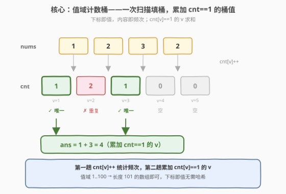
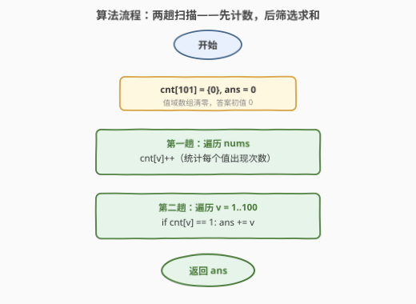

# 唯一元素的和

- **题目名称**：唯一元素的和
- **链接**：[1748. 唯一元素的和](https://leetcode.cn/problems/sum-of-unique-elements/)
- **难度**：简单
- **标签**：数组、哈希表、计数

## 1. 题目概述

给定一个整数数组 `nums`，其中**唯一元素**定义为只出现**恰好一次**的元素。请返回 `nums` 中所有唯一元素的和。

**示例 1**：

```text
输入：nums = [1,2,3,2]
输出：4
解释：唯一元素为 [1,3]，和为 1 + 3 = 4。
```

**示例 2**：

```text
输入：nums = [1,1,1,1,1]
输出：0
解释：没有唯一元素，和为 0。
```

**示例 3**：

```text
输入：nums = [1,2,3,4,5]
输出：15
解释：所有元素都唯一，和为 15。
```

**约束条件**：

- $1 \le \text{nums.length} \le 100$
- $1 \le \text{nums}[i] \le 100$

> 💡 **关键结构**：值域 $\le 100$ 且为正整数——这是「值域计数」的强烈信号。判断「恰好一次」本质是一个**频次判定**，而频次统计最适合用计数桶（值域数组）或哈希表完成。值域小到 100 时，一个长度 101 的数组即可一招制敌。

---

## 2. 解题思路

### 2.1 暴力思路：对每个元素重新数频次

最直觉的做法：对每个 `nums[i]`，再扫一遍整个数组统计它的出现次数，若恰好为 1 就累加进答案。

```text
ans = 0
for i in 0 .. n-1:
    cnt = 0
    for j in 0 .. n-1:        # 内层重新数 nums[i] 出现次数
        if nums[j] == nums[i]:
            cnt += 1
    if cnt == 1:
        ans += nums[i]
return ans
```

时间 $O(n^2)$、空间 $O(1)$。$n \le 100$ 时勉强可过，但**对同一个值重复计数**是明显的浪费——若 `nums[i]=2` 出现了 3 次，内层循环会把「2 出现 3 次」这个结论算 3 遍。

> ⚠️ **症结**：暴力把「频次」当作「每个位置的局部属性」反复查询，但频次本质是**值的全局属性**——一个值出现几次只取决于它本身，与它在数组中的位置无关。把全局信息降级为逐位置重复计算，是 $O(n^2)$ 的根源。

### 2.2 核心观察：值域计数桶，两趟线性扫描



关键洞察有两层：

1. **频次是值的属性，不是位置的属性**——只需对每个**值**统计一次出现次数，而非对每个**位置**重复统计。一次扫描即可把「值 → 频次」映射建好。
2. **值域 $\le 100$**——无需用通用哈希表，一个长度 101 的数组 `cnt` 就能以 `cnt[v]++` 完成统计，下标即值、内容即频次，$O(1)$ 寻址无哈希开销。

于是算法分两趟：

$$
\text{cnt}[v] = \#\{i : \text{nums}[i] = v\}, \qquad \text{answer} = \sum_{\substack{v=1\\ \text{cnt}[v]=1}}^{100} v
$$

第一趟遍历 `nums` 填 `cnt`；第二趟遍历值域 $1 \ldots 100$，把 `cnt[v] == 1` 的 $v$ 累加进答案。

> 💡 **为什么第二趟遍历值域而非再遍历 nums？** 遍历 `nums` 会让每个值被累加「出现次数」次（如 `nums=[2,2,3]` 中 2 会被检查两次），需额外去重；遍历值域则每个值只检查一次，天然去重。值域只有 100，第二趟常数极小。这是「值域小」红利的直接体现。
>
> 💡 **与 136 只出现一次的数字的对照**：136 题所有其他元素出现**两次**，可用 XOR 异或自抵消；本题其他元素出现次数**任意**（可能 2 次也可能 5 次），XOR 失效，必须显式计数。136 是本题在「其他元素恰好两次」强约束下的特殊技巧。

### 2.3 算法流程图



1. **初始化**：`cnt[101] = {0}`（值域数组，下标 0 不用），`ans = 0`。
2. **第一趟计数**：遍历 `nums`，对每个 `v = nums[i]` 执行 `cnt[v]++`。
3. **第二趟求和**：遍历 $v = 1 \ldots 100$，若 `cnt[v] == 1` 则 `ans += v`。
4. **终止**：返回 `ans`。

两趟均为线性，第一趟 $O(n)$，第二趟 $O(100) = O(1)$（与 $n$ 无关）。

### 2.4 示例演算

以示例 1 `nums = [1, 2, 3, 2]` 为例：

![示例演算：nums=[1,2,3,2] → 计数桶 {1:1, 2:2, 3:1} → 累加 cnt==1 的 1+3=4](../images/1748_example_walkthrough.svg)

**第一趟计数**（`cnt` 数组只列涉及到的值）：

| 步骤 $i$ | `nums[i]` | `cnt` 变化 | `cnt` 状态（v=1,2,3） | 说明 |
|----------|-----------|-----------|---------------------|------|
| $0$ | $1$ | `cnt[1]++` | $\{1, 0, 0\}$ | 首次见 1 |
| $1$ | $2$ | `cnt[2]++` | $\{1, 1, 0\}$ | 首次见 2 |
| $2$ | $3$ | `cnt[3]++` | $\{1, 1, 1\}$ | 首次见 3 |
| $3$ | $2$ | `cnt[2]++` | $\{1, 2, 1\}$ | 2 变成两次，不再唯一 |

**第二趟求和**：

| 值 $v$ | `cnt[v]` | 是否唯一 | 累加 |
|--------|----------|----------|------|
| $1$ | $1$ | ✅ | `ans += 1` → $1$ |
| $2$ | $2$ | ❌ | 跳过 |
| $3$ | $1$ | ✅ | `ans += 3` → $4$ |
| $4 \ldots 100$ | $0$ | ❌ | 跳过 |

最终 `ans = 4` ✓。

---

## 3. 参考代码

### C++

```cpp
class Solution {
public:
    int sumOfUnique(vector<int>& nums) {
        int cnt[101] = {0};
        for (int v : nums) cnt[v]++;
        int ans = 0;
        for (int v = 1; v <= 100; ++v)
            if (cnt[v] == 1) ans += v;
        return ans;
    }
};
```

### Python

```python
class Solution:
    def sumOfUnique(self, nums: List[int]) -> int:
        cnt = [0] * 101
        for v in nums:
            cnt[v] += 1
        return sum(v for v in range(1, 101) if cnt[v] == 1)
```

> 💡 **写法对照**：两版逻辑完全一致——`cnt` 为长度 101 的值域数组，第一趟 `cnt[v]++` 计数，第二趟累加 `cnt[v] == 1` 的值。Python 用生成器 + `sum` 一行完成第二趟；C++ 用显式循环更直观。
>
> ⚠️ **值域数组 vs 哈希表**：当值域小且稠密（本题 $1 \ldots 100$）时，值域数组优于 `unordered_map`——无哈希函数开销、缓存友好、常数更小。若值域很大或稀疏（如 `nums[i]` 可达 $10^9$），应改用 `unordered_map<int,int>`，第二趟则遍历哈希表而非固定值域。

---

## 4. 复杂度分析

| 维度 | 复杂度 | 说明 |
|------|--------|------|
| 时间复杂度 | $O(n + V)$ | 第一趟遍历 `nums` 为 $O(n)$；第二趟遍历值域为 $O(V)$，$V=100$ |
| 空间复杂度 | $O(V)$ | `cnt` 数组长度 $V+1=101$，与 $n$ 无关；$V=100$ 视作 $O(1)$ |

其中 $V = \max(\text{nums}) \le 100$ 为值域上界。当 $V$ 视作常数（$V=100$）时，时间 $O(n)$、空间 $O(1)$。

> 💡 对比暴力 $O(n^2)$：本题 $n \le 100$ 时两者常数都极小，但值域计数法的**可扩展性**更强——$n$ 涨到 $10^5$ 仍只需 $O(n)$，而暴力需 $O(10^{10})$ 必然超时。这是「用空间换时间 + 利用值域约束」的典型胜利。

---

## 5. 扩展：值域计数 vs 哈希表 vs 排序

「统计频次 + 按频次筛选」有三条主流路径，按值域特征择优：

| 方法 | 时间 | 空间 | 适用场景 |
|------|------|------|----------|
| **值域数组** | $O(n + V)$ | $O(V)$ | 值域小且稠密（如 $1 \ldots 100$），本题最优 |
| **哈希表** | $O(n)$ 期望 | $O(n)$ | 值域大或稀疏（如 $10^9$ 量级），通用解 |
| **排序 + 分组** | $O(n \log n)$ | $O(1)^\ast$ / $O(n)$ | 值域未知且要求 $O(1)$ 空间（原地排序） |

> 💡 **排序法的逻辑**：排序后相同值相邻，一次遍历即可数出每段长度，长度为 1 的段累加。代价是 $O(n \log n)$ 时间，但若原地排序则空间 $O(1)$（不计修改输入），是「值域未知 + 严格 $O(1)$ 空间」时的折中。
>
> 💡 **哈希表通用版**：把值域数组替换为 `unordered_map` / `Counter`，第二趟遍历哈希表而非固定值域，即可处理任意值域。本题值域小，值域数组更简洁；但掌握哈希表版能应对值域放大的变体。

---

## 6. 面试要点

**Q1：为什么用值域数组而不是哈希表？**
> 题目约束 $1 \le \text{nums}[i] \le 100$，值域小且稠密。值域数组下标即值、内容即频次，$O(1)$ 寻址无哈希开销，缓存友好，常数远小于 `unordered_map`。若值域放大到 $10^9$，则应改用哈希表，第二趟遍历哈希表而非固定值域。

**Q2：为什么第二趟遍历值域而非再遍历 nums？**
> 遍历 `nums` 会让每个值被检查「出现次数」次，需额外去重；遍历值域则每个值只检查一次，天然去重。值域仅 100，第二趟常数极小。这是「值域小」红利的直接体现——遍历值域比遍历去重后的值集合更简单。

**Q3：本题与 136 只出现一次的数字有什么区别？**
> 136 题所有其他元素恰好出现**两次**，可用 XOR 异或自抵消（$a \oplus a = 0$），一趟 $O(n)$ / $O(1)$。本题其他元素出现次数**任意**（可能 2 次也可能 5 次），XOR 无法区分「出现 1 次」与「出现 3 次」（两者异或结果都非零），必须显式计数。136 是本题在「其他元素恰好两次」强约束下的特殊解法。

**Q4：如果要求出现恰好 $k$ 次的元素之和，怎么改？**
> 把判定条件 `cnt[v] == 1` 改为 `cnt[v] == k` 即可，骨架完全不变。这正体现了「频次筛选」框架的通用性——统计与筛选解耦，筛选条件可任意替换。

**Q5：如果 $n$ 很大（$10^7$）但值域仍为 100，算法瓶颈在哪？**
> 时间仍 $O(n)$，瓶颈在顺序读 `nums` 的内存带宽（缓存友好，性能极佳）。空间 $O(1)$ 不变。值域数组在此场景反而比哈希表更优——哈希表需存 $O(n)$ 个条目而值域数组只需 101 个整数，且无哈希冲突与 rehash 开销。

---

## 7. 同类练习题

- [136. 只出现一次的数字](https://leetcode.cn/problems/single-number/)（[题解](../0101-0200/136_只出现一次的数字.md)）：所有其他元素恰好出现两次，可用 XOR 异或抵消，是本题在更强约束下的特殊技巧
- [1207. 独一无二的出现次数](https://leetcode.cn/problems/unique-number-of-occurrences/)（[题解](../1201-1300/1207_独一无二的出现次数.md)）：统计频次后再判频次本身是否唯一，是「频次统计 + 频次去重」的双层版本
- [451. 根据字符出现频率排序](https://leetcode.cn/problems/sort-characters-by-frequency/)（[题解](../0401-0500/451_根据字符出现频率排序.md)）：频次统计 + 按频次排序输出，频次筛选的进阶应用
- [389. 找不同](https://leetcode.cn/problems/find-the-difference/)（[题解](../0301-0400/389_找不同.md)）：两字符串计数差找出多出的字符，频次统计的差集应用
