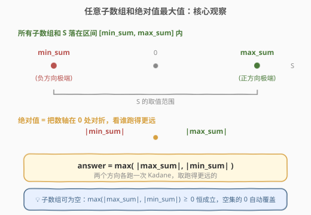
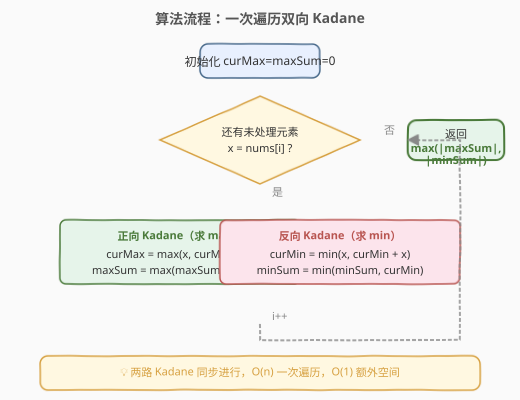

# 任意子数组和的绝对值的最大值

- **题目名称**：任意子数组和的绝对值的最大值
- **链接**：[1749. 任意子数组和的绝对值的最大值](https://leetcode.cn/problems/maximum-absolute-sum-of-any-subarray/)
- **难度**：中等
- **标签**：数组、动态规划、Kadane 算法

## 1. 题目概述

给你一个整数数组 `nums`。一个子数组 `[nums_l, nums_{l+1}, ..., nums_r]` 的**和的绝对值**为 `abs(nums_l + ... + nums_r)`。请找出 `nums` 中**和的绝对值**最大的任意子数组（**可能为空**），并返回该最大值。

> 💡 **子数组可以为空**：空子数组的和为 `0`，因此答案至少为 `0`。这意味着如果所有子数组和的绝对值都小于 `0`（不可能，因为绝对值非负），答案仍为 `0`。

**示例 1**：

```text
输入：nums = [1,-3,2,3,-4]
输出：5
解释：子数组 [2,3] 和的绝对值最大，为 abs(2+3) = 5。
```

**示例 2**：

```text
输入：nums = [2,-5,1,-4,3,-2]
输出：8
解释：子数组 [-5,1,-4] 和的绝对值最大，为 abs(-5+1-4) = abs(-8) = 8。
```

**约束条件**：

- `1 <= nums.length <= 10^5`
- `-10^4 <= nums[i] <= 10^4`

---

## 2. 解题思路

### 2.1 暴力思路

枚举所有子数组 `[i, j]`，计算其和 $S$，取 $\max |S|$。共有 $O(n^2)$ 个子数组，每个求和 $O(1)$（前缀和预计算），总复杂度 $O(n^2)$。对于 $n = 10^5$ 会超时，需要 $O(n)$ 的做法。

### 2.2 核心观察：绝对值最大 = max(最大子数组和, |最小子数组和|)



要最大化 $|S|$，只有两种来源：

1. **$S$ 尽可能大（正方向极端）**：即最大子数组和 `max_sum`，用 [Kadane 算法](../0001-0100/53_最大子数组和.md) 求解，贡献 $|max\_sum|$。
2. **$S$ 尽可能小（负方向极端）**：即最小子数组和 `min_sum`，把 Kadane 的 `max` 换成 `min` 即可，贡献 $|min\_sum| = -min\_sum$（此时 `min_sum` 为负或零）。

因此：

$$\text{answer} = \max\big(\,|max\_sum|,\ |min\_sum|\,\big)$$

> 💡 **直觉理解**：绝对值把数轴「对折」——和要么往正方向跑得越远越好，要么往负方向跑得越远越好。两个方向各跑一次 Kadane，取跑得更远的那个。

> ⚠️ **空子数组自动处理**：因为 `max_sum` 与 `min_sum` 至少有一个的绝对值 $\ge 0$（若 `nums[0] > 0` 则 `max_sum > 0`；若 `nums[0] < 0` 则 `min_sum < 0`；若 `nums[0] == 0` 则两者均可为 `0`），所以 $\max(|max\_sum|, |min\_sum|) \ge 0$ 恒成立，无需额外与 `0` 比较。当全数组为 `0` 时答案恰为 `0`，与空子数组一致。

### 2.3 算法流程图



一次遍历同时维护两个 Kadane 状态：

- `curMax` / `maxSum`：以当前元素结尾的最大子数组和 / 全局最大子数组和
- `curMin` / `minSum`：以当前元素结尾的最小子数组和 / 全局最小子数组和

遍历结束后返回 $\max(|maxSum|, |minSum|)$。

### 2.4 示例演算

![示例演算：nums = [2, −5, 1, −4, 3, −2]](../images/maxabssubarray_example_walkthrough.svg)

以 `nums = [2,-5,1,-4,3,-2]` 为例（示例 2，答案 `8`）：

| 步骤 | 元素 | curMax | maxSum | curMin | minSum |
|------|------|--------|--------|--------|--------|
| 初始 | — | 0 | −∞ | 0 | +∞ |
| i=0 | 2 | 2 | 2 | 2 | 2 |
| i=1 | −5 | −3 | 2 | −5 | −5 |
| i=2 | 1 | 1 | 2 | −4 | −5 |
| i=3 | −4 | −3 | 2 | **−8** | **−8** |
| i=4 | 3 | 3 | 3 | −5 | −8 |
| i=5 | −2 | 1 | **3** | −7 | −8 |

- `maxSum = 3`（对应子数组 `[3]`），$|3| = 3$
- `minSum = -8`（对应子数组 `[-5, 1, -4]`），$|-8| = 8$
- `answer = max(3, 8) = 8`

负方向走得更远，所以答案来自**最小子数组和的绝对值**。

---

## 3. 参考代码

### C++

```cpp
class Solution {
  public:
    int maxAbsoluteSum(vector<int>& nums) {
        int curMax = 0, maxSum = INT_MIN;
        int curMin = 0, minSum = INT_MAX;

        for (int x : nums) {
            curMax = max(x, curMax + x);
            maxSum = max(maxSum, curMax);

            curMin = min(x, curMin + x);
            minSum = min(minSum, curMin);
        }

        return max(abs(maxSum), abs(minSum));
    }
};
```

### Python

```python
class Solution:
    def maxAbsoluteSum(self, nums: List[int]) -> int:
        cur_max = max_sum = 0
        cur_min = min_sum = 0

        for x in nums:
            cur_max = max(x, cur_max + x)
            max_sum = max(max_sum, cur_max)

            cur_min = min(x, cur_min + x)
            min_sum = min(min_sum, cur_min)

        return max(abs(max_sum), abs(min_sum))
```

> 💡 **初始化细节**：`curMax` / `curMin` 初始化为 `0`（Kadane 第一步 `max(x, 0+x)` 自然取 `x`）。C++ 中 `maxSum` 初始化为 `INT_MIN`、`minSum` 为 `INT_MAX`，避免首个元素为负/正时被 `0` 覆盖。Python 版由于 `max(0, ...)` 在全负数组下 `max_sum` 恒为 `0`，恰好对应「空子数组和为 0」，逻辑一致且更简洁。

> ⚠️ **Python 与 C++ 初始化差异**：Python 用 `max_sum = 0` 表示「允许空子数组」，全负数组时 `max_sum = 0`、`min_sum = 负值`，`max(|0|, |min_sum|) = |min_sum|` 正确。C++ 若也用 `maxSum = 0`，全负数组下 `maxSum` 会停留在 `0`，配合 `abs` 同样正确——两种初始化在本题都成立，因为答案恒 $\ge 0$。上面 C++ 写成 `INT_MIN` 是为了与 [918](../0901-1000/918_最大环形子数组和.md) 等「非空子数组」题保持模板一致，便于记忆迁移。

---

## 4. 复杂度分析

| 维度 | 复杂度 | 说明 |
|------|--------|------|
| 时间复杂度 | $O(n)$ | 只遍历数组一次，每次迭代做 $O(1)$ 的 Kadane 双向更新 |
| 空间复杂度 | $O(1)$ | 仅使用 `curMax`、`maxSum`、`curMin`、`minSum` 四个变量 |

---

## 5. 扩展：前缀和视角

本题也可用**前缀和**优雅求解。设 `pre[i]` 为 `nums[0..i-1]` 的和（`pre[0] = 0`），则任意子数组 `[l, r]` 的和为 `pre[r+1] - pre[l]`。

$$\max |S| = \max_{r,l}\,|\text{pre}[r+1] - \text{pre}[l]| = \max(\text{pre}) - \min(\text{pre})$$

即前缀和数组的**最大值与最小值之差**。一次遍历维护前缀和的极值即可，时间 $O(n)$、空间 $O(1)$。

```python
class Solution:
    def maxAbsoluteSum(self, nums: List[int]) -> int:
        pre = hi = lo = 0
        for x in nums:
            pre += x
            hi = max(hi, pre)
            lo = min(lo, pre)
        return hi - lo
```

> 💡 **两种视角的等价性**：Kadane 维护的 `maxSum` 恰是 `pre` 的「上界增量」、`minSum` 恰是「下界增量」，$\max(|max\_sum|, |min\_sum|)$ 等价于 `hi - lo`。前缀和视角更直观地揭示了「绝对值最大 = 前缀和跨度最大」的几何含义。

---

## 6. 面试要点

1. **为什么 $\max(|max\_sum|, |min\_sum|)$ 能覆盖所有情况？**

   任意子数组和 $S$ 必落在 $[min\_sum,\ max\_sum]$ 区间内。$|S|$ 在该区间上的最大值只可能出现在端点：若区间跨 `0`，两端绝对值取大者；若全正，$|max\_sum|$ 最大；若全负，$|min\_sum|$ 最大。故只需比较两个端点的绝对值。

2. **子数组可以为空，为什么代码里没有显式与 `0` 比较？**

   因为 $\max(|max\_sum|, |min\_sum|) \ge 0$ 恒成立（绝对值非负）。空子数组的 `0` 只在「所有非空子数组和的绝对值都 $< 0$」时才会成为答案——但这不可能，故无需显式处理。

3. **Kadane 求最小子数组和怎么写？**

   把求最大的 `max(x, curMax + x)` 对称翻转为 `min(x, curMin + x)`。若 `curMin` 为正（前面的和为正），不如从当前 `x` 重新开始取最小。

4. **前缀和视角相比 Kadane 双向有什么优势？**

   前缀和写法只需维护一个前缀和变量及其上下界，代码更短、思路更直接，且天然处理空子数组（`pre[0] = 0` 已计入 `lo`/`hi`）。Kadane 双向的优势在于与 [53](../0001-0100/53_最大子数组和.md)、[918](../0901-1000/918_最大环形子数组和.md) 等题共用模板，便于迁移。

5. **和 [53. 最大子数组和](../0001-0100/53_最大子数组和.md) 的关系？**

   53 求 `max_sum`（单一方向）。本题在 53 基础上**对称地多求一个 `min_sum`**，取两者绝对值的较大者。掌握 53 后，本题的增量仅是「绝对值 → 双向 Kadane」这一步转换。

---

## 7. 同类练习题

- [53. 最大子数组和](https://leetcode.cn/problems/maximum-subarray/)（[题解](../0001-0100/53_最大子数组和.md)）：Kadane 基础模板，本题的前置题
- [918. 环形子数组的最大和](https://leetcode.cn/problems/maximum-sum-circular-subarray/)（[题解](../0901-1000/918_最大环形子数组和.md)）：同时维护 `max_sum` 与 `min_sum`，用补集思想处理环形
- [152. 乘积最大子数组](https://leetcode.cn/problems/maximum-product-subarray/)（[题解](../0101-0200/152_乘积最大子数组.md)）：维护 max/min 两状态的 Kadane 变体（乘法版）
- [2606. 找到最大开销的子数组](https://leetcode.cn/problems/find-the-substring-with-maximum-cost/)：Kadane 变体，元素映射后求最大子数组和
