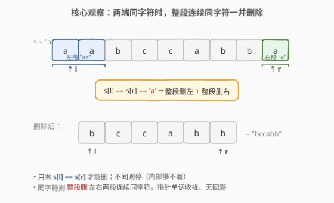
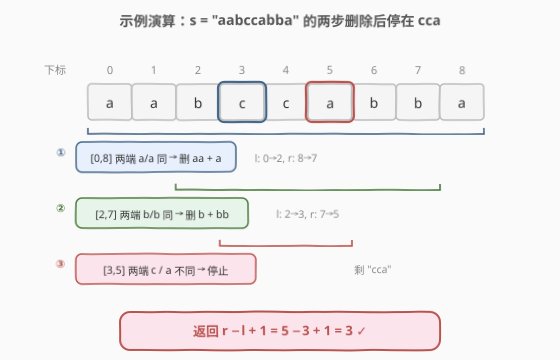

# LeetCode 删除字符串两端相同字符后的最短长度 题解

## 1. 题目概述

- **标题 / 题号**：删除字符串两端相同字符后的最短长度（#1750，medium）
- **链接**：https://leetcode.cn/problems/minimum-length-of-string-after-deleting-similar-ends/
- **难度**：中等
- **标签**：字符串、双指针、贪心

**题意**：给定一个只含 `'a'`、`'b'`、`'c'` 的字符串 `s`，可以**任意次**执行下述操作：

1. 选一个**非空**前缀，其所有字符相同；
2. 选一个**非空**后缀，其所有字符相同；
3. 前缀与后缀在串中**不重叠**；
4. 前缀与后缀包含的字符**必须相同**；
5. 同时删除前缀与后缀。

求执行任意次操作（可 0 次）后能得到的最短长度。

**示例 1**：

```text
输入：s = "ca"
输出：2
解释：两端字符 'c' 与 'a' 不同，无法操作，长度不变。
```

**示例 2**：

```text
输入：s = "cabaabac"
输出：0
解释：c...c → abaaba → baab → aa → ""，四步删空。
```

**示例 3**：

```text
输入：s = "aabccabba"
输出：3
解释：aa...a → bccabb → b...bb → cca，剩 "cca" 长度 3。
```

**约束**：

- $1 \le s.length \le 10^5$
- `s` 只包含 `'a'`、`'b'`、`'c'`

> 💡 **关键直觉**：操作的"删除权"完全由**两端的字符**决定——只有当左端字符与右端字符相同时才能删。一旦两端不同，再也无法触及内部。因此只需用**对撞双指针**从两端往中间扫，能删就**整段删**，删不动即停。

## 2. 解题思路

### 2.1 暴力思路：搜索所有删法

朴素做法是把操作过程当成搜索：在当前串上，若 $s[l] = s[r]$，则左端同字符连续段长度为 $L$、右端同字符连续段长度为 $R$，可删的前缀长度 $p \in [1, L]$、后缀长度 $q \in [1, R]$（且 $p + q \le \text{len}$）。枚举所有 $(p, q)$ 组合递归搜索最小值。

问题在于组合爆炸：最坏情况下每一步有 $O(n)$ 种选择，深度 $O(n)$，总复杂度无法承受（$n \le 10^5$）。需要找到**贪心性质**把"选多少"这件事一次性确定下来。

### 2.2 核心观察：贪心——同字符两端整段删



**观察**：当 $s[l] = s[r] = c$ 时，左端有一段连续的 $c$（长度 $L$），右端也有一段连续的 $c$（长度 $R$）。这一步无论删多少，**能被删掉的 $c$ 只可能来自这两段**——因为内部字符暂时够不着。

**贪心决策**：一旦两端同为 $c$，就把左端整段 $c$、右端整段 $c$ **一次性全删**。

> 💡 **为什么全删是最优的？** 删字符只会让长度更短，不会让长度变大。所以"能删则删"在目标"最短长度"下天然安全。唯一要担心的是"多删一个 $c$ 会不会断送后续更大的删除机会"。但注意到：若这一步少删一个左端 $c$，那新左端仍是 $c$；要再删它，必须右端也仍是 $c$（即右端也少删了）——那就再删一轮，最终把 $L + R$ 个 $c$ 都删掉，**结果与一次性全删完全一致**，只是多绕几步。若右端已删完露出非 $c$ 字符 $d$，左端残留的 $c$ 便永远匹配不上，反而**更差**。因此全删既不损失机会，又能立刻推进，必然最优。

如此，过程被压成一条**单调收拢**的轨道：左指针只右移、右指针只左移，无回溯。

### 2.3 算法流程图


设 $l = 0$、$r = n-1$。外层判 $l < r$ 且 $s[l] = s[r]$：取 $c = s[l]$，先**左指针右移**跳过所有连续 $c$，再**右指针左移**跳过所有连续 $c$（两个内层循环都用 $l \le r$ 守护以防越界与交叉）。两端不再同字符或指针相遇即终止，答案为 $r - l + 1$。

### 2.4 示例演算

以 `s = "aabccabba"`（示例 3，$n = 9$）为例：



| 步骤 | 区间 $[l,r]$ | 两端字符 | 动作 | 删除后剩余 |
|------|--------------|----------|------|------------|
| 初始 | $[0, 8]$ | `a` / `a` 同 | 删左段 `"aa"`、右段 `"a"`，$l \to 2, r \to 7$ | `bccabb` |
| 第 2 步 | $[2, 7]$ | `b` / `b` 同 | 删左段 `"b"`、右段 `"bb"`，$l \to 3, r \to 5$ | `cca` |
| 第 3 步 | $[3, 5]$ | `c` / `a` **不同** | 停止 | `cca` |

返回 $r - l + 1 = 5 - 3 + 1 = \mathbf{3}$ ✓。

对照示例 2 `"cabaabac"`：`c...c` → `a...a` → `b...b` → `a...a` → 空，每步两端都同字符且整段删后指针越过，最终 $l > r$，返回 $0$。

> ⚠️ **注意"全同串"边界**：若整串都是同一字符（如 `"aaaa"`），第 1 步左指针会把整个串扫完使 $l = r + 1$，第二个内层循环因 $l > r$ 不执行，返回 $0$。这正是"前缀与后缀不重叠"约束下的极限——能删的最多就是整串。

## 3. 参考代码

### Python

```python
class Solution:
    def minimumLength(self, s: str) -> int:
        l, r = 0, len(s) - 1
        while l < r and s[l] == s[r]:
            c = s[l]
            while l <= r and s[l] == c:
                l += 1
            while l <= r and s[r] == c:
                r -= 1
        return r - l + 1
```

### C++

```cpp
class Solution {
public:
    int minimumLength(string s) {
        int l = 0, r = s.size() - 1;
        while (l < r && s[l] == s[r]) {
            char c = s[l];
            while (l <= r && s[l] == c) l++;
            while (l <= r && s[r] == c) r--;
        }
        return r - l + 1;
    }
};
```

> 💡 **实现细节**：① 外层条件 `l < r` 保证两端不重合时才尝试匹配；单字符串 `l == r` 直接返回 1。② 两个内层循环用 `l <= r` 守护：左扫可能让 `l = r + 1`（全同串），此时第二个内层循环不再执行，避免越界与"删过头"。③ 答案 `r - l + 1`：当 $l > r$ 时为 0（删空），当两端不同时为剩余区间长度，两种情形统一。

## 4. 复杂度分析

| 维度 | 复杂度 | 说明 |
|------|--------|------|
| 时间 | $O(n)$ | 左指针只右移、右指针只左移，每个下标至多被各访问一次，总移动步数 $\le 2n$ |
| 空间 | $O(1)$ | 仅两个指针与一个字符变量 |

> ⚠️ 暴力搜索是指数级的；贪心把"删多少"的选择塌缩成"全删"，从而消除一切分叉，复杂度由指数降到线性。这是"贪心消除搜索分叉"的典型范式。

## 5. 扩展：贪心最优性的交换论证

为把第 2.2 节的直觉变成严格证明，给出**交换论证**。

设某最优操作序列 $\pi$，其第一步**没有**整段删——左端删了 $p < L$ 个 $c$。考察其后第一次"把左端剩余 $c$ 删掉"的操作（若存在）：

- 若该操作发生时右端仍是 $c$（右端此前也少删了），则它删的左端 $c$ 与第一步本可删的左端 $c$ 是**同一批**。把这部分删除**前移合并**到第一步，剩余串完全不变，操作数减少，仍最优——得到一个新最优解 $\pi'$，其第一步删了更多左端 $c$。
- 若该操作永不发生（右端后续露出了非 $c$ 字符 $d$），则左端那 $L - p$ 个 $c$ **永远删不掉**。但整段删方案会删掉它们，得到更短串，与 $\pi$ 的最优性矛盾。

反复对左端、右端施加上述交换，可把任一最优解改造成"每步两端整段删"的形式且长度不增。故**整段删贪心得到的长度 $\le$ 任意最优长度**，即最优。$\blacksquare$

> 💡 这与 [11. 盛最多水的容器](../0001-0100/11_盛最多水的容器.md)（移动较短端不会丢失最优）、[435. 无重叠区间](../0401-0500/435_无重叠区间.md)（按右端点排序贪心）同属"**交换论证保最优**"的家族：通过证明"任何最优解都能被改造成贪心形式"来确立贪心正确性。

## 6. 面试要点

1. **为什么两端不同时就一定要停？**

   > 操作要求前缀与后缀字符相同。左端字符 $s[l]$ 与右端 $s[r]$ 不同时，任何非空前缀的字符（必为 $s[l]$）都找不到同字符的非空后缀（必为 $s[r]$），操作不可执行。且后续操作只能从当前两端往里推进，两端卡死就彻底无法继续。

2. **为什么"整段删"而不是"只删一个"？**

   > 删一个意味着分多次删同一批同字符。若两端都分多次，最终仍把这批同字符删完，结果与一次性整段删相同，只是徒增操作数；若只一端分多次，另一端先删完露出异字符，则残留的同字符再也匹配不上，结果更差。故整段删不劣于任何策略。

3. **内层循环为什么用 `l <= r` 而不是 `l < r`？**

   > 当剩余区间形如 `"aa"`（$l, r$ 指向两个同字符）时，左扫要连 $s[r]$ 一起删掉使 $l = r + 1$。用 `l < r` 会在 $l = r$ 处提前停，漏删中间字符，答案偏大。`l <= r` 允许扫过相遇点，保证整段删干净；相遇后第二个内层循环自然不执行，不会越界。

4. **全同串（如 `"aaaa"`）会怎样？**

   > 外层进入，$c = s[l]$，左扫把整串扫完，$l = r + 1 = n$；第二个内层循环因 $l > r$ 跳过。返回 $r - l + 1 = 0$。这正是"前缀后缀不重叠"下的极限——能删的就是整串。注意若误用 `l < r` 守护会停在 $l = r$，错误返回 1。

5. **时间复杂度为什么是 $O(n)$？有嵌套 while 不是 $O(n^2)$ 吗？**

   > 均摊分析：左指针单调不减、右指针单调不增，两个内层循环总共移动 $l$、$r$ 的步数之和 $\le 2n$。外层每轮必然让 $l$ 或 $r$ 至少移动一步，故总轮数也 $O(n)$。嵌套 `while` 的总执行次数被指针移动量摊还，不是平方。

> 💡 **一句话总结**：对撞双指针，两端同字符则整段删（左扫 + 右扫，`l <= r` 守护），不同则停，返回 $r - l + 1$。

## 同类练习题

| # | 题目 | 与本题的关联 |
|---|------|-------------|
| 977 | [有序数组的平方](https://leetcode.cn/problems/squares-of-a-sorted-array/)（[题解](../0901-1000/977_有序数组的平方.md)） | 对撞双指针从两端取最大填结果，与本题"两端同字符一起删"同属"两端向中间收拢"骨架 |
| 125 | [验证回文串](https://leetcode.cn/problems/valid-palindrome/)（[题解](../0101-0200/125_验证回文串.md)） | 两端双指针比对字符，本题的双指针判定基础母题 |
| 680 | [验证回文串 II](https://leetcode.cn/problems/valid-palindrome-ii/)（[题解](../0601-0700/680_验证回文串II.md)） | 双指针 + 容错删一个，"两端不匹配时如何决策"的进阶，对照本题"不匹配即停" |
| 392 | [判断子序列](https://leetcode.cn/problems/is-subsequence/)（[题解](../0301-0400/392_判断子序列.md)） | 双指针贪心匹配，体会"贪心推进无回溯"的共性 |
| 1754 | [构造字典序最大的合并字符串](https://leetcode.cn/problems/largest-merge-of-two-strings/) | 同题号区间的贪心字符串题，两端比较做贪心决策，可作扩展练习 |
