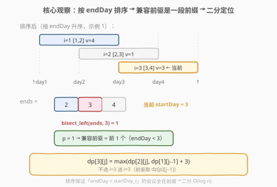
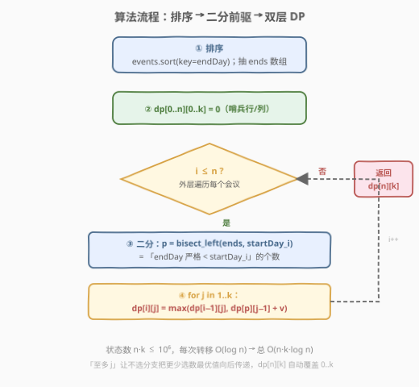

# 最多可以参加的会议数目 II

- **题目名称**：最多可以参加的会议数目 II
- **链接**：[1751. 最多可以参加的会议数目 II](https://leetcode.cn/problems/maximum-number-of-events-that-can-be-attended-ii/)
- **难度**：困难
- **标签**：动态规划、二分查找、排序

## 1. 题目概述

给定 `events` 数组，`events[i] = [startDayi, endDayi, valuei]`，表示第 `i` 个会议从 `startDayi` 天开始、`endDayi` 天结束，参加可得价值 `valuei`。再给整数 `k` 表示**最多**能参加的会议数。

约束：

1. 同一时间只能参加一个会议；
2. 必须**完整**参加完一个会议；
3. **结束日期包含在会议内**——一个会议的 startDay 与另一会议的 endDay 相等也算冲突（即前序会议的 `endDay` 必须 **严格小于** 后续会议的 `startDay`）。

求能得到的会议价值**最大和**（不必参加满 `k` 个）。

**示例 1**：

```text
输入：events = [[1,2,4],[3,4,3],[2,3,1]], k = 2
输出：7
解释：选会议 0 [1,2,4] 与会议 1 [3,4,3]，endDay 2 < startDay 3 不冲突，价值和 4 + 3 = 7。
```

**示例 2**：

```text
输入：events = [[1,2,4],[3,4,3],[2,3,10]], k = 2
输出：10
解释：只参加会议 2 [2,3,10]，价值 10 已优于任何两会议组合。
```

**示例 3**：

```text
输入：events = [[1,1,1],[2,2,2],[3,3,3],[4,4,4]], k = 3
输出：9
解释：四会议互不冲突但只能参加 3 个，选价值最大的 2 + 3 + 4 = 9。
```

**约束条件**：

- $1 \le k \le \text{events.length}$
- $1 \le k \times \text{events.length} \le 10^6$
- $1 \le \text{startDay}_i \le \text{endDay}_i \le 10^9$
- $1 \le \text{value}_i \le 10^6$

> 💡 **关键直觉**：这是经典的**带权重区间调度**（Weighted Interval Scheduling）。把它和「[435. 无重叠区间](../0301-0400/435_无重叠区间.md)」对比：435 是「**最少**删几个使剩余不重叠」（贪心按右端点），而本题每条区间带**价值**、还要**限量 k 个**、目标是**最大价值和**——贪心失效，必须 DP。但「**按 endDay 排序**」这一骨架仍然继承，它让"前驱兼容区间"具备单调性，可二分定位。

---

## 2. 解题思路

### 2.1 暴力思路：枚举所有子集

朴素做法是在 $2^n$ 个子集里挑出「大小 $\le k$ 且两两不冲突」的，取最大价值和。$n$ 上界虽未直接给出，但 $k \cdot n \le 10^6$ 且 $k \ge 1$，故 $n \le 10^6$，指数枚举完全不可行。

退一步：即便用「选/不选」DFS + 回溯，最坏仍是 $2^n$。要把它降到多项式，关键是发现**「选了某个会议后，后续能选的会议集合只与上一个被选会议的 endDay 有关」**——具有最优子结构，可用 DP。

### 2.2 核心观察：按 endDay 排序 + DP + 二分找前驱



**观察 1（排序暴露单调性）**：把所有会议按 `endDay` 升序排序。排序后，对任意会议 $i$，所有 `endDay < startDay_i` 的会议都集中在序列的**前缀**里（因为 endDay 升序）。于是「能与 $i$ 兼容的前驱集合」是一段连续前缀 $[0, p)$，可用**二分**在 $O(\log n)$ 内找到右端点 $p$。

**观察 2（DP 状态设计）**：令 $dp[i][j]$ = 在前 $i$ 个（排序后的）会议中、**至多**选 $j$ 个、且选出的会议两两不冲突时的最大价值和。对第 $i$ 个会议决策二选一：

- **不选**：$dp[i][j] = dp[i-1][j]$；
- **选**：选了 $i$ 就不能选任何与 $i$ 冲突的。设 $p$ 为最大的下标使 $\text{endDay}[p] < \text{startDay}_i$（即前缀兼容数），则前驱状态是 $dp[p][j-1]$，加上 $value_i$：
  $$dp[i][j] = \max\bigl(dp[i-1][j],\; dp[p][j-1] + value_i\bigr)$$

**观察 3（"至多 j"自动处理"不必选满"）**：用「至多 $j$」而非「恰好 $j$」定义状态，"不选"分支 $dp[i-1][j]$ 会把更少选数的最优值**向后传递**，最终答案 $dp[n][k]$ 天然涵盖选 $0 \sim k$ 个的所有情况（示例 2 只选 1 个即由此得解）。

> 💡 **二分写法要点**：在排序后的 `endDay` 数组上做 `bisect_left(ends, startDay_i)`，返回的是「第一个 $\ge \text{startDay}_i$ 的位置」，也正是「严格 $< \text{startDay}_i$ 的元素个数」$p$。把 $p$ 当作 1-based 下标直接读 $dp[p][\cdot]$——前 $p$ 个会议恰好是兼容前驱集合，干净利落。
>
> ⚠️ **「严格小于」别写成「$\le$」**：题目规定 startDay 与前一会议 endDay 相等也算冲突。若误用 `bisect_right`（得到 $\le$ 的个数）会把 endDay 恰为 startDay 的冲突会议算进兼容前驱，导致错解。

### 2.3 算法流程图



整体三步：

1. **排序**：按 `endDay` 升序排 `events`，并抽出 `ends` 数组供二分；
2. **DP 主循环**：$i$ 从 $1$ 到 $n$，对每个会议 $i$ 二分得到兼容前缀长度 $p$，再枚举 $j \in [1, k]$ 做转移；
3. **返回** $dp[n][k]$。

转移内部就是「不选 / 选」取 max 的两分支，无回溯、无后效性——这是「排序 + DP 消除搜索分叉」的标准范式。

### 2.4 示例演算

以示例 1 `events = [[1,2,4],[3,4,3],[2,3,1]], k = 2` 为例：

![示例演算：排序后的 DP 表逐行填充，最终 dp[3][2]=7](../images/1751_example_walkthrough.svg)

**第 0 步 排序**：按 endDay 升序得

| 序号 $i$（1-based） | 会议 | startDay | endDay | value |
|---|---|---|---|---|
| 1 | 原 0 | 1 | 2 | 4 |
| 2 | 原 2 | 2 | 3 | 1 |
| 3 | 原 1 | 3 | 4 | 3 |

`ends = [2, 3, 4]`。

**第 1 步 填表**（$p$ 由 `bisect_left(ends, startDay)` 得）：

| $i$ | startDay | $p$（endDay $<$ startDay 的个数） | $j=1$ | $j=2$ |
|---|---|---|---|---|
| 0 | — | — | 0 | 0 |
| 1 | 1 | 0 | $\max(0,\;0+4)=4$ | $\max(0,\;0+4)=4$ |
| 2 | 2 | 0 | $\max(4,\;0+1)=4$ | $\max(4,\;0+1)=4$ |
| 3 | 3 | 1（end 2 $<$ 3） | $\max(4,\;0+3)=4$ | $\max(4,\;\underbrace{dp[1][1]}_{=4}+3)=7$ |

**第 2 步 读答**：$dp[3][2] = \mathbf{7}$ ✓。

对照示例 2：会议 2（原 `[2,3,10]`）排序后位于 $i=2$，$value=10$ 直接刷新 $dp[2][1]=dp[2][2]=10$，后续会议无法超越，答案 $10$。示例 3 的四会议互不冲突，DP 等价于"在 4 个值里选至多 3 个的最大和"= $2+3+4=9$。

> ⚠️ **常见坑**：示例 1 中会议 0 `[1,2,4]` 与会议 2 `[2,3,1]` 看似可"首尾相接"，但题目明确 startDay 与 endDay 相等算冲突（$2 \not< 2$），故不能同选。这正是"严格小于"判定与 `bisect_left` 的由来。

---

## 3. 参考代码

### Python

```python
import bisect
from typing import List

class Solution:
    def maxValue(self, events: List[List[int]], k: int) -> int:
        events.sort(key=lambda e: e[1])          # 按 endDay 升序
        ends = [e[1] for e in events]            # 供二分的 endDay 数组
        n = len(events)
        # dp[i][j] = 前 i 个会议中至多选 j 个、不冲突的最大价值和
        dp = [[0] * (k + 1) for _ in range(n + 1)]
        for i in range(1, n + 1):
            s, _, v = events[i - 1]
            # 兼容前驱数：endDay 严格 < s 的元素个数
            p = bisect.bisect_left(ends, s)
            for j in range(1, k + 1):
                dp[i][j] = max(dp[i - 1][j], dp[p][j - 1] + v)
        return dp[n][k]
```

### C++

```cpp
class Solution {
public:
    int maxValue(vector<vector<int>>& events, int k) {
        sort(events.begin(), events.end(),
             [](const auto& a, const auto& b) { return a[1] < b[1]; });
        int n = events.size();
        vector<int> ends(n);
        for (int i = 0; i < n; ++i) ends[i] = events[i][1];

        vector<vector<int>> dp(n + 1, vector<int>(k + 1, 0));
        for (int i = 1; i <= n; ++i) {
            int s = events[i - 1][0], v = events[i - 1][2];
            int p = lower_bound(ends.begin(), ends.end(), s) - ends.begin();
            for (int j = 1; j <= k; ++j) {
                dp[i][j] = max(dp[i - 1][j], dp[p][j - 1] + v);
            }
        }
        return dp[n][k];
    }
};
```

> 💡 **实现细节**：① `dp` 多开一行一列（第 0 行 / 第 0 列全 0）作为哨兵，省去 `p == 0` 与 `j == 0` 的特判。② `bisect_left` / `lower_bound` 天然返回"严格小于 s 的个数"，正好作为 1-based 前驱下标。③ 外层按 $i$、内层按 $j$ 的双重循环顺序无关紧要，因为 $dp[i][j]$ 只依赖 $dp[i-1][\cdot]$ 与 $dp[p][\cdot]$（$p < i$），均在之前算好。

---

## 4. 复杂度分析

| 维度 | 复杂度 | 说明 |
|------|--------|------|
| 时间 | $O(n \log n + n k \log n)$ | 排序 $O(n \log n)$；DP 共 $n k$ 个状态（$n k \le 10^6$），每个状态一次二分 $O(\log n)$ |
| 空间 | $O(n k)$ | 二维 DP 表 $(n+1)\times(k+1)$；`ends` 数组 $O(n)$ |

> ⚠️ 题目给的是 $k \cdot n \le 10^6$ 而非单独限制 $n$、$k$，正是为 DP 状态数 $n k$ 兜底。若用 $O(n^2)$ 的"扫描找前驱"会超时，二分把单次转移压到 $O(\log n)$ 才稳过。

> 💡 **空间优化**：注意到 $dp[i][j]$ 只读 $dp[i-1][\cdot]$ 与 $dp[p][\cdot]$，而 $p < i$ 可能远小于 $i-1$，故**不能**用单行滚动（会覆盖仍需读取的历史行）。但可保留整张 $O(nk)$ 表——在 $n k \le 10^6$ 下完全可接受。若追求极致空间，可改用「按 $j$ 外层、内层维护一个按 endDay 的单调结构」，但实现复杂度上升、收益有限，面试不推荐。

---

## 5. 扩展：与不限 k 的 1235 对照

本题是带权重区间调度的「**限量 k**」版。去掉 k 限制即是 [1235. 规划兼职工作](https://leetcode.cn/problems/maximum-profit-in-job-scheduling/)（无限选、求最大利润），其 DP 退化为 $dp[i] = \max(dp[i-1],\; dp[p] + value_i)$ 一维。两题代码骨架几乎一致：

| 维度 | 1235（无 k 限制） | 1751（限 k） |
|---|---|---|
| 状态 | $dp[i]$ 一维 | $dp[i][j]$ 二维 |
| 转移 | $\max(dp[i-1],\; dp[p] + v)$ | $\max(dp[i-1][j],\; dp[p][j-1] + v)$ |
| 复杂度 | $O(n \log n)$ | $O(n k \log n)$ |

另有 [2054. 一次买两件的好交易](https://leetcode.cn/problems/two-best-non-overlapping-events/) 是 $k = 2$ 的特例——可用本题代码直接令 $k = 2$ 通过，也可写专门的两遍扫描 $O(n \log n)$ 解法。三题同属"排序 + 二分前驱 + DP"家族，掌握 1751 即可迁移。

---

## 6. 面试要点

1. **为什么按 endDay 而不是 startDay 排序？**

   > DP 转移需要"前驱会议已结束"——即前驱的 endDay $<$ 当前 startDay。按 endDay 排序后，对任意当前会议，所有兼容前驱必在它之前出现且构成一段前缀，从而可二分定位 $p$。若按 startDay 排序，一个 startDay 较小但 endDay 极大的会议会排在前面，破坏"前驱已结束"的单调性，无法用前缀二分。

2. **为什么用「至多 j」而不是「恰好 j」定义状态？**

   > "至多 j" 让"不选"分支 $dp[i-1][j]$ 把更少选数的最优值向后传递，天然覆盖"不必选满 k"的情况（示例 2 只选 1 个即最优）。若用"恰好 j"，需额外对 $\max_{j \le k} dp[n][j]$ 取答案，且转移时 $dp[p][j-1]$ 在 $j-1$ 个里要"恰好"，base case 处理更繁琐。

3. **`bisect_left` 为什么对？换成 `bisect_right` 会怎样？**

   > `bisect_left(ends, s)` 返回首个 $\ge s$ 的位置 = 严格 $< s$ 的元素个数 $p$，正是兼容前驱数。`bisect_right` 返回首个 $> s$ 的位置 = $\le s$ 的个数，会把 endDay 恰为 $s$ 的会议算进兼容前驱——而题目规定 startDay 与 endDay 相等算冲突，会得到错解。

4. **能贪心吗？比如按价值降序选可行会议？**

   > 不能。带权重区间调度不具贪心选择性质：价值最大的会议可能与多个中等价值会议冲突，选它反而损失总和（示例 2 看似支持贪心，但易构造反例：会议 A 价值 10 占满全程，会议 B、C 各价值 6 互不冲突——贪心选 A 得 10，最优选 B+C 得 12）。必须 DP 枚举"选/不选"两分支取 max。

5. **$n k \le 10^6$ 这个约束暗示什么？**

   > 它直接圈定了 DP 状态数上界为 $10^6$，配合 $O(\log n)$ 二分转移总运算量约 $2 \times 10^7$，在时限内稳过。同时它也排除了 $O(n^2)$ 做法（当 $k = 1$ 时 $n$ 可达 $10^6$，$n^2 = 10^{12}$ 必超时）。出题人用乘积约束同时给 DP 留路、堵掉平方解法。

> 💡 **一句话总结**：按 endDay 排序，$dp[i][j] = \max(dp[i-1][j],\; dp[p][j-1] + v)$，其中 $p = \text{bisect\_left}(ends, \text{startDay}_i)$，返回 $dp[n][k]$。

---

## 7. 同类练习题

- [1235. 规划兼职工作](https://leetcode.cn/problems/maximum-profit-in-job-scheduling/)：本题去掉 k 限制的"无限选"版，一维 DP，骨架完全一致，建议先做
- [2054. 一次买两件的好交易](https://leetcode.cn/problems/two-best-non-overlapping-events/)：$k = 2$ 特例，可直接套本题代码，也可写专门的两遍扫描解法
- [435. 无重叠区间](https://leetcode.cn/problems/non-overlapping-intervals/)（[题解](../0301-0400/435_无重叠区间.md)）：无权重区间调度贪心母题，对照"为何带权重后贪心失效、需 DP"
- [2008. 出租车的最大盈利](https://leetcode.cn/problems/maximum-earnings-from-taxi/)：带权重区间调度，按 endDP 排序 + 二分前驱，与 1235 同构
- [2830. 销售利润最大化](https://leetcode.cn/problems/maximize-the-profit-as-the-seller-on-the-events/)：同样按区间 endDP 排序 + 二分前驱的 DP，多区间捆绑价值的变体
