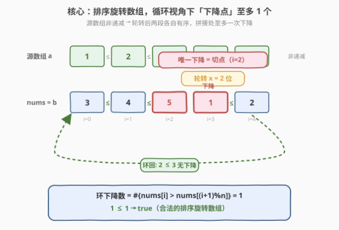
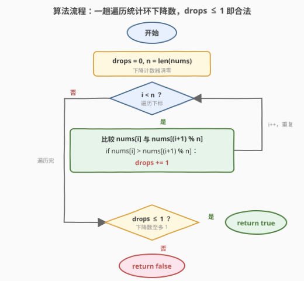

# 检查数组是否经排序和轮转得到

- **题目名称**：检查数组是否经排序和轮转得到
- **链接**：[1752. 检查数组是否经排序和轮转得到](https://leetcode.cn/problems/check-if-array-is-sorted-and-rotated/)
- **难度**：简单
- **标签**：数组、一次遍历

## 1. 题目概述

给你一个数组 `nums`。它的**源数组**与 `nums` 元素完全相同，但按**非递减顺序**排列。问 `nums` 能否由源数组**轮转若干位置**（包括 0 个）得到。

> **轮转定义**：数组 $A$ 轮转 $x$ 位后得到 $B$，满足 $B[i] = A[(i+x) \bmod n]$。直观上就是把末尾的 $x$ 个元素整体搬到头部。源数组中**可能存在重复项**。

**示例 1**：

```text
输入：nums = [3,4,5,1,2]
输出：true
解释：源数组为 [1,2,3,4,5]，轮转 x = 2 位得到 [3,4,5,1,2]。
```

**示例 2**：

```text
输入：nums = [2,1,3,4]
输出：false
解释：无论怎么轮转，都无法从任何非递减源数组得到 [2,1,3,4]。
```

**示例 3**：

```text
输入：nums = [1,2,3]
输出：true
解释：源数组即 [1,2,3]，轮转 x = 0 位（不转）。
```

**约束条件**：

- $1 \le n = \text{nums.length} \le 100$
- $1 \le \text{nums}[i] \le 100$

> 💡 **关键结构**：源数组是非递减的，轮转只是把它「切一刀」再「首尾拼接」。所以 `nums` 一定由**两段各自非递减的片段**拼成，拼接处可能出现一次「下降」。本题问的正是：这种「下降」是否**至多一次**——这是排序旋转数组的充要特征。

---

## 2. 解题思路

### 2.1 暴力思路：枚举所有轮转位置逐一验证

最直觉的做法：枚举源数组的所有可能形态。但源数组未知，等价于枚举 `nums` 的每个轮转偏移量 $x \in [0, n)$，对每个 $x$ 把 `nums` 「逆向旋转」回 $x=0$ 的形态，再检查是否非递减。

```text
for x in 0 .. n-1:
    # 把 nums 旋转 x 位「还原」，得到候选源数组
    cand = [nums[(i + x) % n] for i in 0 .. n-1]
    if cand 是非递减的:
        return true
return false
```

每个 $x$ 验证需 $O(n)$，共 $n$ 个 $x$，总时间 $O(n^2)$、空间 $O(n)$（构造 `cand`）。$n \le 100$ 时 $10^4$ 次操作毫无压力，但**枚举所有偏移量是多余的**——我们根本不关心「转了几位」，只关心「是否存在一个合法切点」。

> ⚠️ **症结**：暴力把「判定问题」当成「枚举构造问题」。但排序旋转数组有一个**全局不变量**（下降次数至多 1），只需统计这个不变量一次即可判定，无需逐个偏移量试错。把「存在性判定」拆成「逐一构造验证」，是时间浪费的根源。

### 2.2 核心观察：循环视角下「下降点」至多 1 个



设源数组 $a$ 非递减：$a[0] \le a[1] \le \cdots \le a[n-1]$。轮转 $x$ 位后得到 $b$，$b[i] = a[(i+x) \bmod n]$。把 $b$ 按「原 $a$ 的两段」切开：

- **前段** $b[0..n-1-x] = a[x..n-1]$：非递减（继承 $a$ 的单调性）；
- **后段** $b[n-x..n-1] = a[0..x-1]$：非递减。

两段各自有序，唯一的「潜在下降」出现在**拼接处** $b[n-1-x]$ vs $b[n-x]$，即 $a[n-1]$ vs $a[0]$。由于 $a$ 非递减，$a[n-1] \ge a[0]$，所以这里**至多一次**下降。

> 💡 **循环视角**：把数组首尾相连看成环。环上相邻对 $b[i]$ vs $b[(i+1) \bmod n]$ 中，「下降」（$b[i] > b[(i+1) \bmod n]$）的总数 $\le 1$。环上恰好那一个下降就是「切点」，把它后面那个元素当作新起点，环就展开成一条非递减链——这正是源数组。所以「下降次数 $\le 1$」既是**必要条件**也是**充分条件**。
>
> ⚠️ **必须数环、不能只数链**：若只数线性相邻对 $b[i]$ vs $b[i+1]$（$i \in [0,n-2]$）的下降，会漏掉「末尾 vs 开头」这一对。例如 $[1,2,3]$ 线性下降数为 $0$，看似合法；但它的环下降数恰为 $1$（$3 > 1$），对应切点在末尾，源数组就是自身——这没问题。真正的陷阱是反例 $[2,1,3,4]$：线性下降数 $= 1$（$2>1$），若不查环就会误判为 `true`，但环下降数 $= 2$（还有 $4>2$），实际 `false`。**必须把首尾相连一起数**，才能抓住第二个下降。

于是判定化为一句：

$$
\boxed{\;\text{answer} = \Big(\#\big\{\,i \in [0,n) \;\big|\; \text{nums}[i] > \text{nums}[(i+1) \bmod n]\,\big\} \;\le\; 1\Big)\;}
$$

### 2.3 算法流程图



1. **初始化**：`drops = 0`（下降计数器）。
2. **遍历**：对每个 $i \in [0, n)$，比较 $\text{nums}[i]$ 与 $\text{nums}[(i+1) \bmod n]$；若前者大于后者，`drops += 1`。
3. **终止**：遍历完返回 `drops <= 1`。

每轮一次取模 + 一次比较，共 $n$ 轮，总复杂度 $O(n)$。

### 2.4 示例演算

以示例 1 `nums = [3,4,5,1,2]`（合法）与示例 2 `nums = [2,1,3,4]`（非法）对比，环视角逐对比较：

![示例演算：[3,4,5,1,2] 下降 1 次→true；[2,1,3,4] 下降 2 次→false](../images/1752_example_walkthrough.svg)

**示例 1** `nums = [3,4,5,1,2]`（$n=5$）：

| $i$ | $\text{nums}[i]$ | $\text{nums}[(i+1)\bmod 5]$ | 下降? | `drops` | 说明 |
|-----|------------------|------------------------------|-------|---------|------|
| $0$ | $3$ | $4$ | 否 | $0$ | $3 \le 4$，前段内 |
| $1$ | $4$ | $5$ | 否 | $0$ | $4 \le 5$，前段内 |
| $2$ | $5$ | $1$ | **是** | $1$ | 拼接处，$5 > 1$，唯一切点 |
| $3$ | $1$ | $2$ | 否 | $1$ | $1 \le 2$，后段内 |
| $4$ | $2$ | $3$（环回） | 否 | $1$ | $2 \le 3$，末尾接开头无下降 |

`drops = 1 ≤ 1` → `true` ✓。

**示例 2** `nums = [2,1,3,4]`（$n=4$）：

| $i$ | $\text{nums}[i]$ | $\text{nums}[(i+1)\bmod 4]$ | 下降? | `drops` | 说明 |
|-----|------------------|------------------------------|-------|---------|------|
| $0$ | $2$ | $1$ | **是** | $1$ | $2 > 1$ |
| $1$ | $1$ | $3$ | 否 | $1$ | $1 \le 3$ |
| $2$ | $3$ | $4$ | 否 | $1$ | $3 \le 4$ |
| $3$ | $4$ | $2$（环回） | **是** | $2$ | $4 > 2$，第二个下降！ |

`drops = 2 > 1` → `false` ✓。环回那一对 $4$ vs $2$ 抓住了第二个下降，是判定非法的关键。

---

## 3. 参考代码

### C++

```cpp
class Solution {
public:
    bool check(vector<int>& nums) {
        int n = nums.size(), drops = 0;
        for (int i = 0; i < n; i++) {
            if (nums[i] > nums[(i + 1) % n]) drops++;
        }
        return drops <= 1;
    }
};
```

### Python

```python
class Solution:
    def check(self, nums: List[int]) -> bool:
        n = len(nums)
        drops = sum(nums[i] > nums[(i + 1) % n] for i in range(n))
        return drops <= 1
```

> 💡 **写法对照**：两版逻辑完全一致——遍历每个 $i$，比较 $\text{nums}[i]$ 与 $\text{nums}[(i+1) \bmod n]$，统计下降次数。Python 用生成器 + `sum` 一行收尾；C++ 用显式循环累加。注意取模让 $i = n-1$ 时自动环回到 $0$，无需特判首尾。
>
> ⚠️ **`<= 1` 而非 `== 1`**：当所有元素相等（如 $[1,1,1]$）或 $n=1$ 时，下降数为 $0$，仍应返回 `true`（源数组本身就是解，轮转 $0$ 位）。用 `<= 1` 同时覆盖「$0$ 个下降（已排序/全等）」与「$1$ 个下降（旋转过）」两种合法情形。

---

## 4. 复杂度分析

| 维度 | 复杂度 | 说明 |
|------|--------|------|
| 时间复杂度 | $O(n)$ | 单趟遍历 $i \in [0,n)$，每轮一次取模 + 一次比较，均为 $O(1)$ |
| 空间复杂度 | $O(1)$ | 仅 `drops` 一个计数器，不依赖输入规模 |

> 💡 对比暴力枚举法的 $O(n^2)$ 时间 / $O(n)$ 空间：时间降一阶、空间降到常数——把「枚举所有偏移量」改为「统计一个全局不变量」，是判定题的典型优化方向。

---

## 5. 扩展：环形数组的「断点计数」范式

「统计环上违反单调性的位置数」是一类环形判定题的通用骨架，按「违反什么单调性 / 阈值是多少」可分多种形态：

| 形态 | 判据 | 典型题 |
|------|------|--------|
| **非递减环，至多 1 个下降** | $\#\{i \mid b[i] > b[(i+1)\bmod n]\} \le 1$ | **本题 1752**：排序旋转数组判定 |
| **严格递增环，至多 1 个下降** | $\#\{i \mid b[i] \ge b[(i+1)\bmod n]\} \le 1$ | [189. 轮转数组](https://leetcode.cn/problems/rotate-array/) 的逆问题：判定是否为无重复排序数组的旋转 |
| **找唯一断点位置** | 下降处下标即旋转量 $x$ | [153. 寻找旋转排序数组中的最小值](https://leetcode.cn/problems/find-minimum-in-rotated-sorted-array/)（[题解](../0101-0200/153_寻找旋转排序数组中的最小值.md)）：断点右侧即最小值，二分定位 |

> 💡 **从 1752 到 153 的升级路径**：本题只问「是不是」合法旋转（判定），数下降次数即可；153 进一步问「最小值在哪」，需要**定位**那个唯一断点。当数组无重复时，断点把数组分两段，可用**二分**在 $O(\log n)$ 锁定；而本题允许重复且只要判定，$O(n)$ 扫一遍足矣。掌握「断点」这个不变量，就能在判定 / 定位 / 还原三类问题间迁移。

---

## 6. 面试要点

**Q1：为什么必须把首尾相连（环回）一起统计下降，而不是只数线性相邻对？**
> 只数 $i \in [0, n-2]$ 的 $\text{nums}[i] > \text{nums}[i+1]$ 会漏掉末尾 vs 开头这一对。反例 $[2,1,3,4]$ 线性下降数 $= 1$（仅 $2>1$），看似合法，但环回还有 $4 > 2$ 这第二个下降，实际非法。只有环视角的下降数 $\le 1$ 才是排序旋转数组的充要条件——切点可能恰好落在首尾交界处（如 $[1,2,3]$ 的 $3>1$），不数环就会误判。

**Q2：为什么判据是 `drops <= 1` 而不是 `drops == 1`？**
> 两种合法情形：已排序且未旋转（含全等数组 $[1,1,1]$、单元素 $[5]$）时下降数为 $0$；旋转过且非全等时下降数为 $1$。`== 1` 会漏掉 $0$ 的情形，把 $[1,2,3]$、$[1,1,1]$ 误判为 `false`。`<= 1` 同时覆盖两者。

**Q3：「下降次数 $\le 1$」为什么是充分条件，而不只是必要条件？**
> 必要性：源数组非递减，轮转后两段各自有序，拼接处至多一次下降，故环下降数 $\le 1$。充分性：若环下降数恰为 $1$，设下降在第 $k$ 处（$\text{nums}[k] > \text{nums}[(k+1)\bmod n]$），则从 $(k+1)\bmod n$ 起环游一周是**非递减**的——把它作为源数组，轮转 $n-1-k$ 位即还原成 `nums`；若下降数为 $0$，`nums` 本身非递减，轮转 $0$ 位即可。故 $\le 1$ 蕴含「存在合法源数组」。

**Q4：如果数组元素各不相同，能否做到 $O(\log n)$？**
> 判定「是否为排序旋转」在无重复时仍需 $O(n)$ 最坏（因为要确认无第二个下降，得看遍所有相邻对）。但若**额外保证**它是某个排序数组的旋转（即已知合法），只问「最小值位置 / 旋转量」，则可用二分在 $O(\log n)$ 定位唯一断点，这正是 [153. 寻找旋转排序数组中的最小值](https://leetcode.cn/problems/find-minimum-in-rotated-sorted-array/) 的做法。判定与定位的复杂度差异，源于前者要排除「非法」情形必须看全。

**Q5：`nums[(i+1) % n]` 的取模会不会拖慢性能？如何避免？**
> 取模是 $O(1)$ 但有常数开销。可展开循环把最后一对单独处理：前 $n-1$ 对比较 $\text{nums}[i]$ vs $\text{nums}[i+1]$，最后一对比较 $\text{nums}[n-1]$ vs $\text{nums}[0]$，省掉 $n-1$ 次取模。$n \le 100$ 时无意义，但 $n$ 很大时是常见的微优化写法。

---

## 7. 同类练习题

- [189. 轮转数组](https://leetcode.cn/problems/rotate-array/)：本题的「逆操作」——给定偏移量 $x$ 实施轮转，三次反转法 $O(n)/O(1)$；与本题合看即「轮转的构造与判定」
- [153. 寻找旋转排序数组中的最小值](https://leetcode.cn/problems/find-minimum-in-rotated-array/)（[题解](../0101-0200/153_寻找旋转排序数组中的最小值.md)）：无重复排序旋转数组，用二分定位那个唯一断点，是本题「断点不变量」从判定升级为定位
- [154. 寻找旋转排序数组中的最小值 II](https://leetcode.cn/problems/find-minimum-in-rotated-array-ii/)：允许重复的版本，二分遇 `nums[mid] == nums[r]` 时只能 `r--`，说明重复让断点定位退化——对照本题「允许重复仍可 $O(n)$ 判定」
- [33. 搜索 in 旋转排序数组](https://leetcode.cn/problems/search-in-rotated-sorted-array/)：在旋转数组中二分找目标值，需先判断 `mid` 落在断点左段还是右段，是断点思想的搜索应用
- [796. 旋转字符串](https://leetcode.cn/problems/rotate-string/)：判定字符串 $s$ 能否由 $t$ 旋转得到，用 $s \in t+t$ 一行判定，与本题同为「旋转判定」但用拼接技巧而非断点计数
