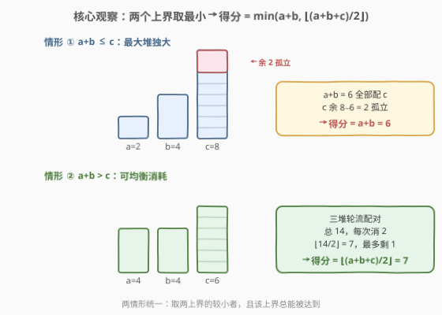
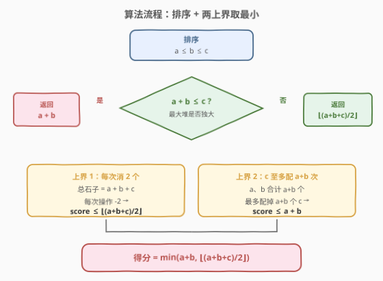
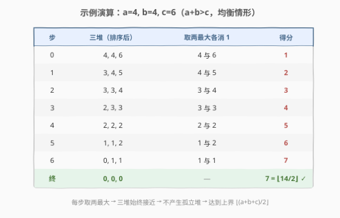

# LeetCode 移除石子的最大得分 题解

## 1. 题目概述

- **标题 / 题号**：移除石子的最大得分（#1753，medium）
- **链接**：https://leetcode.cn/problems/maximum-score-from-removing-stones/
- **难度**：中等
- **标签**：贪心、数学、堆

**题意**：你正在玩一个单人游戏，面前有 **三堆石子**，大小分别为 `a`、`b`、`c`。每一回合你**选择两个不同的非空堆**，从每堆中**各取走一颗石子**，得分 `+1`。当**剩余非空堆少于两个**时游戏结束。返回你能获得的**最大得分**。

**示例 1**：

```text
输入：a = 2, b = 4, c = 6
输出：6
解释：2+4=6 ≤ 6，a、b 全部配 c，共 6 步，c 余 0。
```

**示例 2**：

```text
输入：a = 4, b = 4, c = 6
输出：7
解释：4+4=8 > 6，三堆均衡消耗，共 7 步，总 14 颗消 14，余 0。
```

**示例 3**：

```text
输入：a = 1, b = 8, c = 8
输出：8
解释：1+8=9 > 8，均衡消耗，总 17 颗消 16，余 1，得分 8。
```

**约束**：

- $1 \le a, b, c \le 10^5$

> 💡 **关键直觉**：每次操作固定消掉 **2 颗**石子，所以得分首先受「总石子数的一半」限制；但最大堆 `c` 又受「另外两堆合计 $a+b$ 颗」的限制——配完 $a+b$ 颗后 `c` 若仍有剩余就再也无人可配。两个上界取较小者即为答案，且该上界**总能被达到**。

## 2. 解题思路

### 2.1 暴力思路：优先队列模拟

最直白的做法是**用最大堆模拟**：每轮弹出两个最大堆顶、各减 1 后压回，直到不足两个非零堆。由于每轮得分 `+1`，模拟结束时的轮数就是答案。

```python
import heapq
def maxScore(a, b, c):
    h = [-a, -b, -c]
    heapq.heapify(h)
    score = 0
    while True:
        x = -heapq.heappop(h)
        y = -heapq.heappop(h)
        if x == 0 or y == 0:
            break
        heapq.heappush(h, -(x - 1))
        heapq.heappush(h, -(y - 1))
        score += 1
    return score
```

复杂度 $O((a+b+c)\log 3) = O(a+b+c)$，$a,b,c \le 10^5$ 时约 $3\times10^5$ 次操作，能过但不够优雅。问题在于我们其实不需要一步步模拟——两个**数学上界**就能直接定死答案。

### 2.2 核心观察：两个上界取最小



设排序后 $a \le b \le c$。考察得分的两个天然上界：

**上界 1（总量限制）**：每次操作消 2 颗，总石子 $S = a+b+c$，所以

$$\text{score} \le \left\lfloor \frac{a+b+c}{2} \right\rfloor$$

**上界 2（最大堆限制）**：最大堆 $c$ 的每一颗石子都必须与 $a$ 或 $b$ 中的一颗配对才能消掉。而 $a$、$b$ 合计只有 $a+b$ 颗，所以 $c$ 最多被配 $a+b$ 次：

$$\text{score} \le a + b$$

> ⚠️ 注意上界 2 只对 $c$ 起约束。当 $a+b \ge c$ 时 $c$ 不是瓶颈，上界 2 退化为 $\ge c$，不起作用；此时上界 1（总量）才是紧的。

**合并**：

$$\text{score} \le \min\!\left(a+b,\ \left\lfloor \frac{a+b+c}{2} \right\rfloor\right)$$

而这两个上界恰好对应两种情形，**且都能被达到**：

- **情形 ① $a+b \le c$**：$c$ 太大。把 $a$、$b$ 全部拿去配 $c$（先配 $a$ 与 $c$，再配 $b$ 与 $c$），共 $a+b$ 步，$c$ 仍剩 $c-(a+b)$ 颗无人可配。此时上界 2 紧，$\min = a+b$，**得分 $= a+b$**。
- **情形 ② $a+b > c$**：三堆「够均衡」。每步**取两个最大的堆**各消 1，可保证不产生孤立堆，最终全部消到 0（$S$ 偶）或只剩 1 颗（$S$ 奇）。此时上界 1 紧，$\min = \lfloor S/2 \rfloor$，**得分 $= \lfloor(a+b+c)/2\rfloor$**。

> 💡 **为什么情形 ② 取两最大就能达到上界？** 关键不变式：只要 $a+b \ge c$（即最大堆不超过另两堆之和），就**永远存在两个非空堆可配**，直到总量降到 0 或 1。「取两最大」正是维持这个不变式的贪心策略——它把最大堆尽快压下来，避免某一堆独大变成瓶颈。严格证明见第 5 节。

### 2.3 算法流程图



只需排序后做一次比较：$a+b \le c$ 返回 $a+b$，否则返回 $\lfloor(a+b+c)/2\rfloor$。两条分支分别对应上界 2 与上界 1 取紧的情形。

### 2.4 示例演算

以示例 2 `a=4, b=4, c=6`（$a+b=8 > c=6$，均衡情形）为例，用「取两最大」贪心逐步模拟：



| 步 | 三堆（排序后） | 取两最大各消 1 | 得分 |
|----|----------------|----------------|------|
| 0 | 4, 4, 6 | 4 与 6 | 1 |
| 1 | 3, 4, 5 | 4 与 5 | 2 |
| 2 | 3, 3, 4 | 3 与 4 | 3 |
| 3 | 2, 3, 3 | 3 与 3 | 4 |
| 4 | 2, 2, 2 | 2 与 2 | 5 |
| 5 | 1, 1, 2 | 1 与 2 | 6 |
| 6 | 0, 1, 1 | 1 与 1 | 7 |
| 终 | 0, 0, 0 | — | $7 = \lfloor 14/2 \rfloor$ ✓ |

每步取两最大，三堆始终保持「最大堆 ≤ 另两堆之和」，不产生孤立堆，最终刚好达到总量上界 $\lfloor(a+b+c)/2\rfloor = 7$。

对照示例 1 `a=2, b=4, c=6`（$a+b=6 \le c=6$，独大情形）：$a$、$b$ 全配 $c$，$2+4=6$ 步后 $c$ 恰好也归零，得分 $= a+b = 6$。若把 $c$ 改成 8，则 $a+b=6 < 8$，6 步后 $c$ 仍剩 2 颗无人可配，得分仍为 $a+b=6$。

> ⚠️ **边界**：$a=b=c=1$ 时 $a+b=2 > c=1$，返回 $\lfloor 3/2 \rfloor = 1$（只配一次，剩一颗）。$a=b=c=10^5$ 时返回 $\lfloor 3\times10^5/2 \rfloor = 150000$。两种情形的公式无缝覆盖所有输入。

## 3. 参考代码

### Python

```python
class Solution:
    def maximumScore(self, a: int, b: int, c: int) -> int:
        a, b, c = sorted([a, b, c])
        if a + b <= c:
            return a + b
        return (a + b + c) // 2
```

### C++

```cpp
class Solution {
public:
    int maximumScore(int a, int b, int c) {
        int s[3] = {a, b, c};
        sort(s, s + 3);
        if (s[0] + s[1] <= s[2]) return s[0] + s[1];
        return (s[0] + s[1] + s[2]) / 2;
    }
};
```

> 💡 **实现细节**：① 先 `sort` 保证 $a \le b \le c$，只需一次比较即可分流。② 两条分支可合并为 `min(a+b, (a+b+c)//2)`——当 $a+b \le c$ 时 $(a+b+c)//2 \ge (a+b+c)//2 \ge a+b$（因为 $c \ge a+b$ 蕴含 $a+b+c \ge 2(a+b)$），故 `min` 自动取到 $a+b$；反之取到 $\lfloor S/2 \rfloor$。因此也可一行写就：`return min(a + b, (a + b + c) // 2)`。

## 4. 复杂度分析

| 维度 | 复杂度 | 说明 |
|------|--------|------|
| 时间 | $O(1)$ | 仅排序 3 个数 + 一次比较 / 一次整除，常数时间 |
| 空间 | $O(1)$ | 无额外数据结构 |

> ⚠️ 暴力堆模拟是 $O((a+b+c)\log 3)$，能过但浪费了「三堆」这一极小规模带来的数学结构。本题的优雅在于把「逐步消去」的模拟过程压缩成两个**紧上界**的取最小——这是「贪心/数学替代模拟」的典型范式。

## 5. 扩展：贪心「取两最大」达到上界的证明

为把第 2.2 节的直觉变成严格结论，证明：**当 $a+b \ge c$（$a \le b \le c$）时，反复取两最大堆各消 1，能恰好达到 $\lfloor(a+b+c)/2\rfloor$ 步**。

**核心不变式**：设当前三堆排序为 $x \le y \le z$。只要 $x + y \ge z$（最大堆不超过另两堆之和），就一定存在两个非空堆可配。我们证明「取两最大」**维持**这个不变式。

取两最大即消 $y$ 与 $z$ 各 1（$y \ge 1$ 否则游戏已结束）。消后新值为 $y-1$、$z-1$，$x$ 不变。重新排序后需验证新的最大堆 $\le$ 另两堆之和。分两种情况：

- 若消后 $z-1$ 仍最大（即 $z-1 \ge y-1 \ge x$）：需证 $x + (y-1) \ge z-1$，即 $x + y \ge z$——**正是原不变式**，成立。
- 若消后 $y-1$ 反超或 $x$ 成最大：此时最大堆更小，不变式更易满足。

故「取两最大」每步都维持 $x+y \ge z$。又因每步总量 $-2$，总量从 $S$ 单调降到 $0$（$S$ 偶）或 $1$（$S$ 奇）。不变式保证降到 $0$ 或 $1$ 前**始终有两非空堆**，所以恰好走 $\lfloor S/2 \rfloor$ 步。$\blacksquare$

> 💡 反过来，当 $a+b < c$ 时不变式一开始就破坏：最大堆 $c$ 超过另两堆之和，无论怎么配都最多配 $a+b$ 次（另两堆先耗尽），$c$ 必有剩余。这正是情形 ①。

## 6. 面试要点

1. **两个上界是怎么想到的？**

   > 每次操作消 2 颗 → 总量上界 $\lfloor S/2 \rfloor$；最大堆的每颗都需另两堆来配 → $c$ 至多配 $a+b$ 次。两个上界都很「自然」，难点在于意识到它们**已足够紧**且能统一成 $\min$。

2. **为什么 $\min(a+b, \lfloor S/2\rfloor)$ 一定能取到？**

   > 两种情形分别构造：$a+b \le c$ 时把 $a$、$b$ 全配 $c$ 即得 $a+b$；$a+b > c$ 时取两最大贪心维持「最大堆 ≤ 另两堆之和」的不变式，可一直配到剩 0 或 1，即得 $\lfloor S/2 \rfloor$。两情形覆盖全部输入，故上界即答案。

3. **为什么要排序？不排序行不行？**

   > 排序是为了用 $a+b$ 与 $c$ 比较来判定「最大堆是否独大」。不排序则需要先找出最大堆 $m=\max(a,b,c)$ 与另两堆之和 $S-m$ 比较，等价但多一次 max/sum。排序 3 个数是 $O(1)$，写起来更直观。

4. **堆模拟和数学解法分别适用什么场景？**

   > 堆模拟适用于「堆数不定 / 规则更复杂」的变体（如 [1046. 最后一块石头的重量](../1001-1100/1046_最后一块石头的重量.md) 两石相撞取差值）。本题只有 3 堆且规则简单（各消 1 不取差），数学结构清晰，应优先 $O(1)$ 解法。面试中先说堆模拟建立正确性直觉，再推导数学公式，体现「先暴力后优化」的思维链。

5. **如果把「三堆」推广到「$n$ 堆」呢？**

   > 同样两个上界：$\lfloor S/2 \rfloor$（总量）与 $S - \max$（最大堆不超过其余之和）。当 $\max \le S - \max$ 即 $2\max \le S$ 时取 $\lfloor S/2 \rfloor$，否则取 $S - \max$。即 $\min(\lfloor S/2 \rfloor, S - \max)$。这正是 [2335. 装满杯子需要的最短时间](https://leetcode.cn/problems/minimum-amount-of-time-to-fill-cups/) 的同构问题（$n$ 种杯子，每次可同时做两杯）。

> 💡 **一句话总结**：排序后比较 $a+b$ 与 $c$——$a+b \le c$ 返回 $a+b$，否则返回 $\lfloor(a+b+c)/2\rfloor$；本质是「总量上界」与「最大堆上界」取最小。

## 同类练习题

| # | 题目 | 与本题的关联 |
|---|------|-------------|
| 1046 | [最后一块石头的重量](https://leetcode.cn/problems/last-stone-weight/)（[题解](../1001-1100/1046_最后一块石头的重量.md)） | 最大堆每次取两最大相撞取差值，与本题「取两最大」同骨架，但规则更复杂需真实模拟 |
| 1561 | [你可以获得的最大硬币数](https://leetcode.cn/problems/maximum-number-of-coins-you-can-get/)（[题解](../1501-1600/1561_你可以获得的最大硬币数.md)） | $3n$ 堆排序后每隔一个取次大，贪心排序定贪心位置，与本题同属「排序 + 贪心定上界」家族 |
| 2335 | [装满杯子需要的最短时间](https://leetcode.cn/problems/minimum-amount-of-time-to-fill-cups/) | 每次可同时装满两种杯子，求最短时间，与本题完全同构（$\min(\lfloor S/2\rfloor, S-\max)$），$n$ 堆推广版 |
| 877 | [石子游戏](https://leetcode.cn/problems/stone-game/)（[题解](../0801-0900/877_石子游戏.md)） | 石子博弈区间 DP，同为「石子」主题但考察博弈型 DP，对照本题的贪心/数学解法 |
| 2141 | [同时运行 N 台电脑的最长时间](https://leetcode.cn/problems/maximum-running-time-of-n-computers/) | $n$ 台电脑 + 若干电池，二分答案 + 贪心验证，类似的「多源配对消耗」思维但用二分答案求解 |
