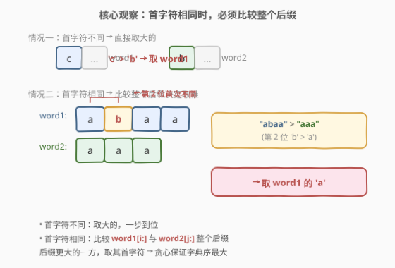
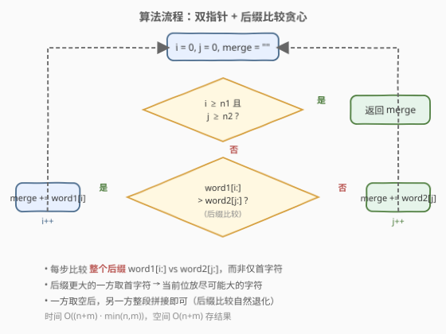
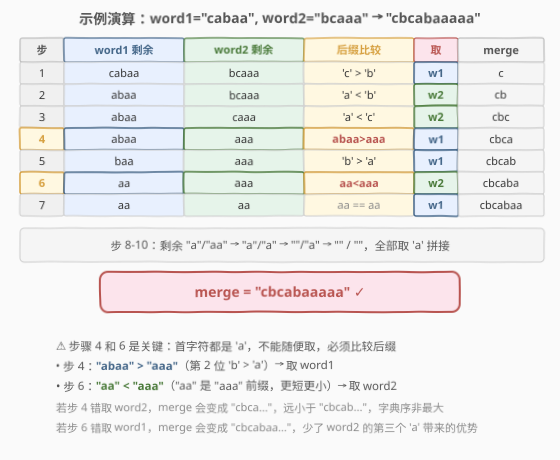

# 构造字典序最大的合并字符串

- **题目名称**：构造字典序最大的合并字符串
- **链接**：[1754. 构造字典序最大的合并字符串](https://leetcode.cn/problems/largest-merge-of-two-strings/)
- **难度**：中等
- **标签**：字符串、贪心、双指针

## 1. 题目概述

给定两个字符串 `word1` 和 `word2`，按下述方式构造新字符串 `merge`：只要 `word1` 或 `word2` 非空，就选择以下操作之一：

1. 从 `word1` 取出**第一个字符**附加到 `merge` 末尾，并从 `word1` 移除该字符；
2. 从 `word2` 取出**第一个字符**附加到 `merge` 末尾，并从 `word2` 移除该字符。

返回可以构造的**字典序最大**的 `merge`。

**示例 1**：

```text
输入：word1 = "cabaa", word2 = "bcaaa"
输出："cbcabaaaaa"
解释：
- 取 word1[0]='c' → merge="c",  word1="abaa",  word2="bcaaa"
- 取 word2[0]='b' → merge="cb", word1="abaa",  word2="caaa"
- 取 word2[0]='c' → merge="cbc",word1="abaa",  word2="aaa"
- 取 word1[0]='a' → merge="cbca",word1="baa",  word2="aaa"
- 取 word1[0]='b' → merge="cbcab",word1="aa",  word2="aaa"
- 剩余 5 个 'a' 全部拼接到末尾 → "cbcabaaaaa"
```

**示例 2**：

```text
输入：word1 = "abcabc", word2 = "abdcaba"
输出："abdcabcabcaba"
```

**约束条件**：

- $1 \le word1.length, word2.length \le 3000$
- `word1` 和 `word2` 仅由小写英文组成

> 💡 **关键直觉**：每一步要选"当前能放的最大字符"。当两个串首字符不同时，直接取大的；**当首字符相同时**，不能随便取——必须比较两个串的**整个剩余后缀**，后缀更大的那一方取首字符，才能保证字典序最大。

---

## 2. 解题思路

### 2.1 暴力思路：枚举所有选择

每一步有两个选择（取 `word1` 或取 `word2`），总共 $n + m$ 步，暴力枚举所有路径是 $O(2^{n+m})$，完全不可行。

退一步想：要最大化字典序，就是让 `merge` 的**每一位尽可能大**。这是典型的**贪心**场景——每一步取局部最优，能否保证全局最优？

### 2.2 核心观察：后缀比较贪心



**贪心策略**：每一步比较 `word1[i:]` 与 `word2[j:]`（即两个串的剩余后缀），**后缀更大的一方**取其首字符。

分两种情况：

1. **首字符不同**（`word1[i] != word2[j]`）：直接取首字符更大的那一方。这与"后缀比较"一致——首字符不同时，后缀的大小关系由首字符决定。

2. **首字符相同**（`word1[i] == word2[j]`）：这是关键所在。取 `word1` 还是 `word2` 的首字符，看似结果一样（都是同一个字符），但**它会影响后续能取到的字符**。必须比较整个后缀：`word1[i:]` vs `word2[j:]`，后缀更大的一方"前景更好"，取它的首字符能让后续也尽可能大。

> 💡 **为什么比较后缀是正确的？** 设当前后缀 $A = word1[i:]$、$B = word2[j:]$，且 $A > B$（字典序）。若取 $B$ 的首字符 $B[0]$，则下一步面临 $A$ vs $B[1:]$，由于 $A > B > B[1:]$，仍会取 $A[0]$——结果序列以 $B[0], A[0], \ldots$ 开头。而若先取 $A[0]$，结果以 $A[0], \ldots$ 开头。因为 $A > B$，存在首个不同位置 $k$ 使 $A[k] > B[k]$（或 $B$ 是 $A$ 的真前缀）。取 $A$ 的首字符相当于把 $A$ 的"优势"尽早释放。用交换论证可严格证明：任何最优解中"该取 $A$ 却取了 $B$"的首次偏离，都可以通过交换修正为取 $A$，结果不劣。

> ⚠️ **常见错误**：只比较首字符，相同就随便取一个。反例：`word1 = "abaa"`, `word2 = "aaa"`，首字符都是 `'a'`，但 `"abaa" > "aaa"`（第 2 位 `'b' > 'a'`），应取 `word1`。若错取 `word2`，`merge` 开头变成 `"aa..."`，永远无法追上 `"ab..."` 的字典序。

### 2.3 算法流程图



设双指针 $i = 0$、$j = 0$，结果 `merge` 初始为空。循环直至两串都取完：

- 若一方已空，另一方的剩余部分整段拼接到 `merge` 末尾即可。
- 若两方都非空，比较 `word1[i:]` 与 `word2[j:]`：
  - `word1[i:] > word2[j:]` → `merge += word1[i]`，`i++`
  - 否则 → `merge += word2[j]`，`j++`

### 2.4 示例演算

以 `word1 = "cabaa"`, `word2 = "bcaaa"`（示例 1）为例：



| 步 | word1 剩余 | word2 剩余 | 后缀比较 | 取 | merge |
|----|-----------|-----------|----------|-----|-------|
| 1 | `cabaa` | `bcaaa` | `'c' > 'b'` | w1 | `c` |
| 2 | `abaa` | `bcaaa` | `'a' < 'b'` | w2 | `cb` |
| 3 | `abaa` | `caaa` | `'a' < 'c'` | w2 | `cbc` |
| 4 | `abaa` | `aaa` | `abaa > aaa` | w1 | `cbca` |
| 5 | `baa` | `aaa` | `'b' > 'a'` | w1 | `cbcab` |
| 6 | `aa` | `aaa` | `aa < aaa` | w2 | `cbcaba` |
| 7 | `aa` | `aa` | `aa == aa` | w1 | `cbcabaa` |
| 8-10 | `a` → `""` | `a` → `""` | 全 `'a'` | 交替 | `cbcabaaaaa` |

> ⚠️ **步骤 4 和 6 是关键决策点**：首字符都是 `'a'`，必须比较后缀。步 4 中 `"abaa" > "aaa"`（第 2 位 `'b' > 'a'`），取 `word1`；步 6 中 `"aa" < "aaa"`（`"aa"` 是 `"aaa"` 的真前缀，更短更小），取 `word2`。若这两步选错，字典序会变小。

---

## 3. 参考代码

### Python

```python
class Solution:
    def largestMerge(self, word1: str, word2: str) -> str:
        i, j = 0, 0
        n1, n2 = len(word1), len(word2)
        merge = []
        while i < n1 and j < n2:
            if word1[i:] > word2[j:]:
                merge.append(word1[i])
                i += 1
            else:
                merge.append(word2[j])
                j += 1
        if i < n1:
            merge.append(word1[i:])
        if j < n2:
            merge.append(word2[j:])
        return "".join(merge)
```

### C++

```cpp
class Solution {
public:
    string largestMerge(string word1, string word2) {
        int n1 = word1.size(), n2 = word2.size();
        int i = 0, j = 0;
        string merge;
        merge.reserve(n1 + n2);
        while (i < n1 && j < n2) {
            if (word1.compare(i, string::npos, word2, j, string::npos) > 0) {
                merge.push_back(word1[i++]);
            } else {
                merge.push_back(word2[j++]);
            }
        }
        merge += word1.substr(i);
        merge += word2.substr(j);
        return merge;
    }
};
```

> 💡 **实现细节**：① Python 的 `word1[i:] > word2[j:]` 创建子串切片，单次比较 $O(\min(n_1 - i, n_2 - j))$，总计 $O((n+m) \cdot \min(n, m))$，$n, m \le 3000$ 时约 $9 \times 10^6$，可接受。② C++ 用 `word1.compare(i, npos, word2, j, npos)` 避免显式创建子串，底层逐字符比较，效率更高。③ 用 `list.append` + `"".join` 比 `str +=` 在 Python 中更高效（避免反复创建新字符串）。④ `merge.reserve(n1 + n2)` 预分配避免 C++ `push_back` 扩容。⑤ 当 `word1[i:] == word2[j:]` 时取哪方都行，代码中 `else` 分支取 `word2`，不影响正确性。

---

## 4. 复杂度分析

| 维度 | 复杂度 | 说明 |
|------|--------|------|
| 时间 | $O((n+m) \cdot \min(n, m))$ | 每步做一次后缀比较，最坏 $O(\min(n, m))$；共 $n + m$ 步。$n, m \le 3000$ 时约 $9 \times 10^6$ |
| 空间 | $O(n + m)$ | 存结果字符串；Python 切片额外 $O(\min(n, m))$ 临时空间 |

> ⚠️ 若需要进一步优化到 $O(n + m)$，可用**后缀数组**预处理 `word1 + "#" + word2` 的排名，使每次后缀比较降为 $O(1)$。但 $n \le 3000$ 下朴素方案已足够，后缀数组属于过度优化。

---

## 5. 扩展：后缀数组优化至线性

当 $n, m$ 达到 $10^5$ 级别时，朴素后缀比较的 $O(n^2)$ 会超时。优化思路：

1. 构造拼接串 $S = word1 + \texttt{"\#"} + word2$（`#` 为不在字母表中的哨兵字符）。
2. 对 $S$ 构建**后缀数组** `sa` 与**排名数组** `rank`（可用 SA-IS 或 DC3 算法，$O(|S|)$）。
3. 每次比较 `word1[i:]` vs `word2[j:]` 时，直接查 `rank[i]` 与 `rank[n1 + 1 + j]`，$O(1)$ 判定大小。
4. 总时间 $O(n + m)$，空间 $O(n + m)$。

> 💡 这与 [719. 找出第 K 小的数对距离](https://leetcode.cn/problems/find-k-th-smallest-pair-distance/)（二分答案 + 双指针计数）中"排序暴露单调性"的思想异曲同工：后缀数组本质是对所有后缀做了一次全局排序，把重复的逐字符比较摊还到预处理阶段。

---

## 6. 面试要点

1. **为什么不能只比较首字符？**

   > 首字符相同时，取 `word1` 还是 `word2` 会影响后续可取的字符。反例：`word1 = "ba"`, `word2 = "bc"`，首字符都是 `'b'`，但 `"ba" < "bc"`，应取 `word2` 以尽快释放 `'c'`。只比首字符会随机取，可能得到 `"bbac"` 而非最大的 `"bbca"`。

2. **为什么比较整个后缀是正确的？**

   > 交换论证：设最优解在某步该取后缀更大的 $A$ 却取了 $B$。由于 $A > B$，后续一定会取到 $A$ 的字符。把"取 $B$"与紧随其后的"取 $A[0]$"交换，结果序列前缀从 $B[0]A[0]\ldots$ 变为 $A[0]B[0]\ldots$，由 $A > B$ 知 $A[0] \ge B[0]$，若 $A[0] > B[0]$ 则交换后严格更优；若 $A[0] = B[0]$ 则需继续看后续，归纳可证不劣。故贪心解 $\ge$ 最优解，又贪心解是可行解 $\le$ 最优解，故相等。

3. **后缀相等（`word1[i:] == word2[j:]`）时取谁？**

   > 取谁都一样。后缀完全相同意味着无论取哪一方，后续的字符序列完全一致。代码中 `else` 分支统一取 `word2` 即可。

4. **时间复杂度为什么不是 $O(n^2)$？**

   > 严格说是 $O((n+m) \cdot \min(n, m))$。每步的后缀比较最坏 $O(\min(n, m))$，但实际中首字符不同的情形比较 $O(1)$ 即终止。最坏构造（如 `word1 = "aaa...a"`, `word2 = "aaa...a"`）确实达到 $O(n^2)$，但 $n \le 3000$ 下 $9 \times 10^6$ 可接受。

5. **如何优化到线性？**

   > 用后缀数组预处理 `word1 + "#" + word2`，每次后缀比较变为查 `rank` 数组 $O(1)$，总 $O(n + m)$。详见第 5 节扩展。

> 💡 **一句话总结**：双指针，每步比较 `word1[i:]` 与 `word2[j:]` 整个后缀，后缀更大的一方取首字符——贪心保证字典序最大。

---

## 7. 同类练习题

- [1750. 删除字符串两端相同字符后的最短长度](https://leetcode.cn/problems/minimum-length-of-string-after-deleting-similar-ends/)（[题解](../1701-1800/1750_删除字符串两端相同字符后的最短长度.md)）：同题号区间的贪心字符串题，双指针从两端做贪心决策，对照本题"双指针从两串做贪心决策"
- [321. 拼接最大数](https://leetcode.cn/problems/create-maximum-number/)：从两个数组中取 k 个数拼成最大数，同样涉及"从两串中贪心选取"的后缀比较思想，难度更高
- [402. 移掉 K 位数字](https://leetcode.cn/problems/remove-k-digits/)：贪心 + 单调栈保证字典序最值，与本题"贪心保证字典序最大"对照（一个删字符、一个拼字符）
- [179. 最大数](https://leetcode.cn/problems/largest-number/)：自定义排序比较器拼出最大数，核心是定义 $a+b$ vs $b+a$ 的字典序比较，与本题后缀比较贪心同属"字典序最优化"家族
- [1163. 按字典序排在最后的子串](https://leetcode.cn/problems/last-substring-in-lexicographical-order/)：找字符串中字典序最大的子串，双指针 + 后缀比较，与本题的后缀比较思想一致
